# 2025秋冬机器人技术与实践 实验五
## 1. 逆运动学解析解

利用 ${}^1T_5 = {}^1T_2 \cdot {}^2T_3 \cdot {}^3T_4 \cdot {}^4T_5 = {}^0T_1^{-1} \cdot T \cdot {}^5T_6^{-1}$

其中, $c_1 = \cos(\theta_1), c_{23} = \cos(\theta_2 + \theta_3)$

$$
{}^1T_5 = {}^1T_2 \cdot {}^2T_3 \cdot {}^3T_4 \cdot {}^4T_5 = \begin{bmatrix} -s_5 c_{234} & s_{234} & c_5 c_{234} & X \\ -s_5 s_{234} & -c_{234} & c_5 s_{234} & X \\ c_5 & 0 & s_5 & d_4 \\ 0 & 0 & 0 & 1 \end{bmatrix}
$$

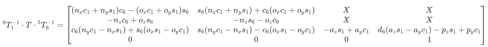

可得 $d_6 (a_z s_1 - a_y c_1) - p_z s_1 + p_y c_1 = d_4$ , 得到:

$$
(p_y - d_6 a_y) c_1 - (p_z - d_6 a_z) s_1 = d_4
$$

令 $m_1 = p_y - d_6 a_y, n_1 = p_z - d_6 a_z$ , 解得:

$$
\boxed{\theta_1 = \arctan 2 (m_1, n_1) - \arctan 2 (d_4, \pm \sqrt{m_1^2 + n_1^2 - d_4^2})}
$$


可得 $a_y c_1 - a_z s_1 = s_5$

得到:

$$
\boxed{\theta_5 = \arcsin (a_y c_1 - a_z s_1) \ \ \text{or}\ \  \pi - \arcsin (a_y c_1 - a_z s_1)}
$$


$$
c_6 (n_y c_1 - n_x s_1) + s_6 (o_x s_1 - o_y c_1) = c_5
$$
$$
s_6 (n_y c_1 - n_x s_1) - c_6 (o_x s_1 - o_y c_1) = 0
$$

令 $m_6 = n_y c_1 - n_x s_1, n_6 = o_y c_1 - o_x s_1$ , 有:

$$
m_6 c_6 - n_6 s_6 = c_5
$$
$$
m_6 s_6 + n_6 c_6 = 0
$$

可得 $m_6^2 + n_6^2 = c_5^2$ , 得到:

$$
\boxed{\theta_6 = \arctan 2 (m_6, n_6) - \arctan 2 (c_5, \pm \sqrt{m_6^2 + n_6^2 - c_5^2}) = \arctan 2 (m_6, n_6) - \arctan 2 (c_5, 0)}
$$


$$
{}^1T_4 = {}^1T_2 \cdot {}^2T_3 \cdot {}^3T_4 = {}^0T_1^{-1} \cdot T \cdot {}^5T_6^{-1} \cdot {}^4T_5^{-1}
$$

$$
{}^1T_4 = \begin{bmatrix} c_{234} & s_{234} & 0 & a_3 s_{23} + a_2 s_2 \\ s_{234} & -c_{234} & 0 & -a_3 c_{23} - a_2 c_2 \\ 0 & 0 & 1 & d_4 \\ 0 & 0 & 0 & 1 \end{bmatrix}
$$

$$
{}^0T_1^{-1} \cdot T \cdot {}^5T_6^{-1} \cdot {}^4T_5^{-1} = \begin{bmatrix} X & X & X & -d_5 (s_6 (n_x c_1 + n_y s_1) + c_6 (o_x c_1 + o_y s_1)) - d_6 (a_z c_1 + a_y s_1) + p_z c_1 + p_y s_1 \\ X & X & X & d_1 + a_z d_6 + d_5 (o_z c_6 + n_z s_6) - p_z \\ X & X & X & X \\ 0 & 0 & 0 & 1 \end{bmatrix}
$$

又有:

$$
m_3 = -d_5 (s_6 (n_x c_1 + n_y s_1) + c_6 (o_x c_1 + o_y s_1)) - d_6 (a_z c_1 + a_y s_1) + p_z c_1 + p_y s_1 = a_3 s_{23} + a_2 s_2
$$

$$
n_3 = -d_1 - a_z d_6 - d_5 (o_z c_6 + n_z s_6) + p_z = a_3 c_{23} + a_2 c_2
$$

可得, $m_3^2 + n_3^2 = a_3^2 + a_2^2 + 2 a_2 a_3 (c_{23} c_2 + s_{23} s_2) = a_3^2 + a_2^2 + 2 a_2 a_3 c_3$ , 得到:

$$
\boxed{\theta_3 = \pm \arccos \left( \frac{m_3^2 + n_3^2 - a_2^2 - a_3^2}{2 a_2 a_3} \right)}
$$


$$
\boxed{\theta_2 = \arctan 2 (m_2 m_3 - n_2 n_3, n_2 m_3 + m_2 n_3)}
$$


$$
m_4 = s_{234} = (n_x c_1 + n_y s_1) s_6 + (o_x c_1 + o_y s_1) c_6
$$
$$
n_4 = c_{234} = n_z s_6 + o_z c_6
$$

得到:

$$
\boxed{\theta_4 = \arctan 2 (m_4, n_4) - \theta_2 - \theta_3}
$$

## 2. 计算末端位姿参数对应的5组关节角
### IK逆运动学求解器
```python
姿态 1 的解为:
[[ 1.04691599  0.5432342   0.53145444 -0.55151199  0.52390861  0.69854057]
 [ 1.04691599  1.05168993 -0.53145444  0.00294117  0.52390861  0.69854057]]
姿态 2 的解为:
[[ 1.57152579  0.46051711  0.6608339  -0.07451221  0.52363516  0.00132214]
 [ 1.57152579  1.09236785 -0.6608339   0.61530485  0.52363516  0.00132214]]
姿态 3 的解为:
[[ 0.63810904  0.78999757  1.34326212 -1.31694921 -0.01049602  0.01012841]]
姿态 4 的解为:
[[-0.06591846  0.82735639  0.82452922 -1.08013164  0.05459678 -0.03619458]]
姿态 5 的解为:
[[-0.7356519   1.10250941  1.05320703 -0.87536185  0.07485627 -0.01280543]]
```
### 解析解
```python
姿态 1 
[1.0469159881245618, 1.051315179254894, -0.5486274344503987, 0.02048989088368326, 0.4476705426936607, 0.6985405717445783]
[1.0469159881245618, 0.5264675685912314, 0.5486274344503987, -0.5519183494334516, 0.4476705426936607, 0.6985405717445783]

姿态 2 
[1.5715257919759826, 1.060122555018591, -0.6303737057933186, 0.6170899442006842, 0.3521271666862505, 0.0013221366719161028]
[1.5715257919759826, 0.45730114686717105, 0.6303737057933186, -0.04083605923453304, 0.3521271666862505, 0.0013221366719161028]

姿态 3 
[0.638109037379833, 0.7899963428791525, 1.3432633260992533, -1.3169491925111272, -0.01023672833574483, 0.010128409252622487]

姿态 4 
[-0.06591845703403737, 0.8273564118138991, 0.8245292269940321, -1.080131665407864, 0.05459672952874233, -0.0361945809572239]

姿态 5 
[-0.7356518980607447, 1.102416736502623, 1.053276432244526, -0.8753385735468382, 0.07175868323524985, -0.012805429674805418]
```
## 仿真验证
### 姿态一
#### IK逆运动学求解器
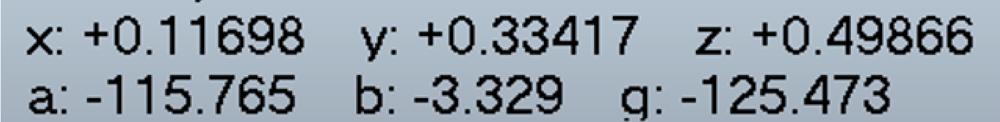

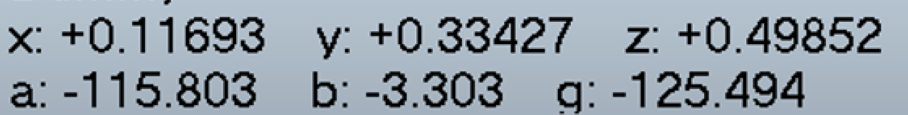

#### 解析解


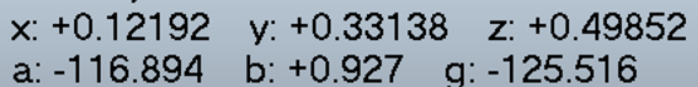

### 姿态二
#### IK逆运动学求解器
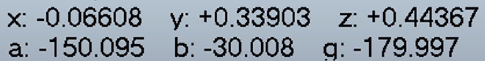


#### 解析解
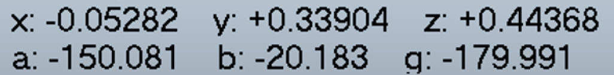

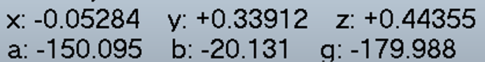

### 姿态三
#### IK逆运动学求解器
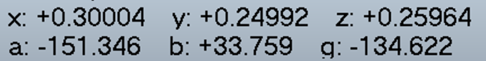


#### 解析解
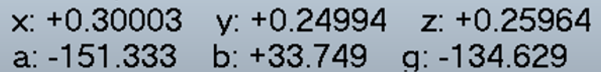


### 姿态四
#### IK逆运动学求解器
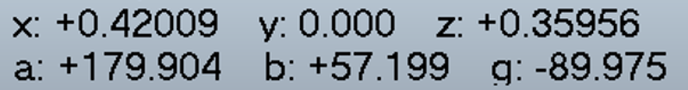


#### 解析解
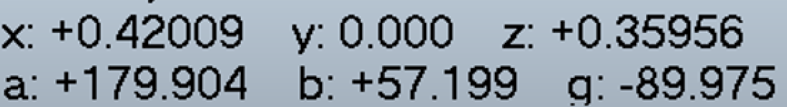


### 姿态五
#### IK逆运动学求解器
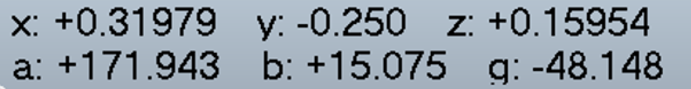


#### 解析解
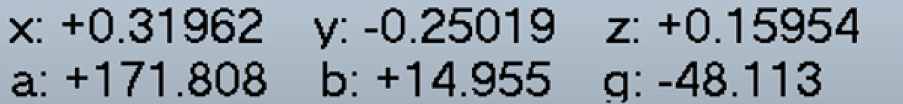

