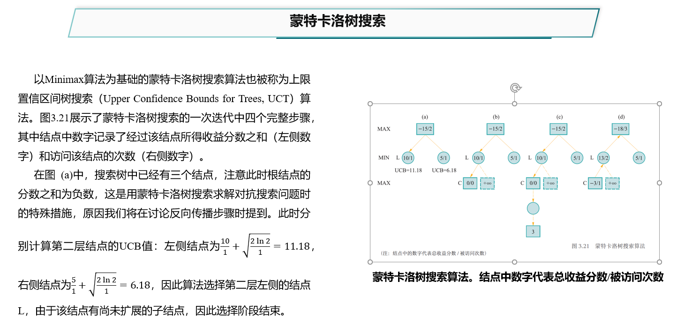
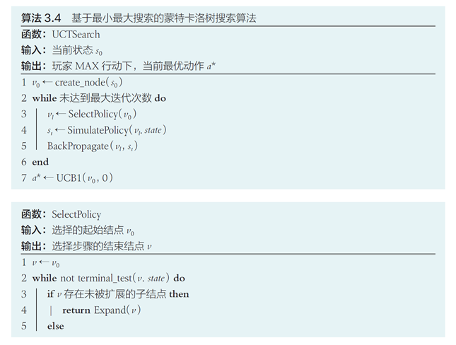

# 蒙特卡洛树搜索

概念：

+ 状态：每个被摇动的摇臂即为一个状态，$\set{s_1,\cdots,s_K}$
+ 动作：动作对应着摇动一个赌博机的摇臂，$\set{a_1,\cdots,a_K}$
+ 状态转移：选择动作$a_i$后，将状态相应地转换为$s_i$
+ 奖励：设从第$i$个赌博机获得收益分数的分布为$D_i$，其均值为$\mu_i$，如果智能体在第$t$次行动中选择摇动第$l_i$个赌博机摇臂，那么智能体在第$t$次行动中所得收益分$\hat{r_i}$服从分布$D_{l_i}$,称为第$t$次行动的奖励
+ 悔值函数：$\rho_T=T\mu^*-\sum\limits_{t=i}^T\hat{r_t}$，其中$\mu^*=\max\limits_{i=1,\cdots,k}\mu_i$，为最大值和实际值之差

贪心策略：智能体记录下每次摇动的赌博机摇臂和获得的相应收益分数。给定第$i$个赌博机，记在过去$t-1$次摇动赌博机摇臂的行动中，摇动第i个赌博机摇臂的次数为$T_{(i,t-1)}$。于是，可以计算得到第$i$个赌博机在过去$T_{(i,t-1)}$次被摇动过程中的收益分数平均值$\bar{x}_{i,T(i,t-1)}$。这样，智能体在第$t$步，只要选择$\bar{x}_{i,T(i,t-1)}$值最大的赌博机摇臂进行摇动即可。

问题：探索与利用的对立

## $\epsilon-$贪心算法

$$
l_t=\left\{\begin{array}{ll}\arg\max_i\bar{x}_{i,T(i,t-1)},&P=1-\epsilon,\\i\in\set{1,\cdots,K},&P=\epsilon\end{array}\right.
$$

问题：没有将每个动作被探索的次数纳入考虑

## 解决：UCB1算法

+ 策略：为每个动作的奖励期望计算一个估计范围，优先采用估计范围上限较高的动作

接下来的问题在于算法应该如何计算奖励期望的估计范围，尤其是奖励期望的置信上界呢？

假设算法在过去第 $𝑡$ 次已经对动作 $𝑎_𝑖$ 探索了 $𝑇_{(𝑖,𝑡−1)}$ 次，在当前问题中对应摇动了第 $𝑖$ 个赌博机的臂膀 $𝑇_{(𝑖,𝑡−1)}$ 次，执行动作 $𝑎_𝑖$ 所收到收益分数的均值为$\bar{𝑥}_{𝑖,𝑇_{(𝑖,𝑡−1)} }$。这$𝑇_{(𝑖,𝑡−1)}$次动作可以看作$𝑇_{(𝑖,𝑡−1)}$个取值范围在[0,1]的独立同分布随机变量的样本，根据霍夫丁不等式（Hoeffding’s inequality），有如下公式存在：

!!! note "霍夫丁不等式"
    $P(\mu_i-\bar{x}_{i,T(i,t-1)}>\delta)\leqslant e^{-2T_{(i,t-1)}\delta^2}$

故$P(\mu_i>\bar{x}_{i,T(i,t-1)}+\delta)\leqslant e^{-2T_{(i,t-1)}\delta^2}$，$\delta\to0$时得到期望上界。

令$e^{-2T_{(i,t-1)}\delta^2}=t^{-4}\Rightarrow\mu_i$上界$=\bar{x}_{i,T(i,t-1)}+\sqrt{\dfrac{2\ln t}{T_{i,(t-1)}}}$

故UCB1策略：

$$
l_t=\mathop{\arg\!\max}_i\bar{x}_{i,T(i,t-1)}+C\sqrt{\dfrac{2\ln t}{T_{i,(t-1)}}}
$$

其中$C$为取不同幂函数作收敛产生。

!!! note ""

    UCB1算法在经过 $𝑇$ 次测试后，悔值函数的期望上界为 
    
    $$O\left(\dfrac{K\ln T}{\Delta}\right),\Delta=\min_{i=1,\cdots,K,\mu_i<\mu}\mu^*-\mu_i$$

## 蒙特卡洛树搜索

!!! note ""
    算法事先不知道每个结点将会得到怎样的代价（或终局分数）分布，只能通过采样式探索来得到计算奖励的样本。由于这个算法利用蒙特卡洛法通过采样来估计每个结点的价值，因此它被称为蒙特卡洛树搜索（Monte-Carlo Tree Search）算法。

蒙特卡洛树搜索（基于Minimax搜索）：

1. 选择：算法从搜索树的根结点开始，向下递归选择子结点（结合具体搜索树策略确定UCB1），直至到达叶子结点或者到达尚未被完全扩展的结点$L$
2. 扩展：如果结点L不是一个终止结点(或对抗搜索的终局结点),则随机扩展它的一个未被扩展过的后继结点M
3. 模拟：从结点M出发，模拟扩展搜索树，直到找到一个终止结点（随机扩展）
4. 反向传播：用模拟所得结果（终止结点的代价或游戏终局分数）回溯更新模拟路径中M以上(含M)结点的奖励均值和被访问次数（不同层次更新策略不同）

