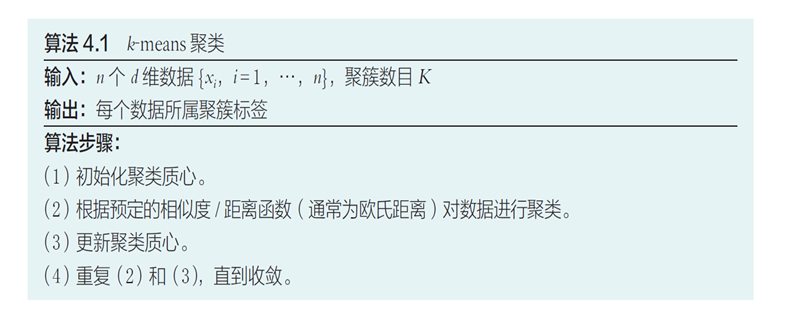

# k均值聚类

聚类任务：将大量数据根据它们的数据特征相似性分成少量簇的任务
> k-means算法要求特征变量连续，数据没有异常值

目标：将$n$个$d$维数据$\set{x_i,i=1,\cdots,n}$划分为$K$个聚簇，使得内部方差最小化

步骤：

1. 初始化聚类质心：初始化$K$个聚类质心$C=\set{c_1,c_2,\cdots,c_K},c_j\in \mathbb R^d\ (1\leqslant j\leqslant K)$ 每个聚类质心$c_j$所在的集合记为$G_j$
2. 对数据进行聚类：将每个聚类数据放入唯一一个聚类集合中
$$
\text{dist}(x_i,c_j)=\sqrt{\sum_{o=1}^d(x_{i,o}-c_j,o)^2}\ (1\leqslant i\leqslant n,1\leqslant j\leqslant K)
$$
> 对应维度距离差的平方和开根号

将每个$x_i$放入与之距离最近的聚类质心所在的聚类集合中，$\mathop{\arg\!\min}\limits_{c_j\in C}\ \text{dist}(x_i,c_j)$

3. 更新聚类质心：根据每个聚类集合中所包含的数据，求均值得到该聚类集合新的质心
$$
c_j=\dfrac{1}{|G_j|}\sum_{x_i\in G_j}x_i
$$
4. 迭代：重复2， 3
	+ 边界：（1）已经达到迭代次数上限 （2）前后两次迭代中，聚类质心保持不变

另一种理解：最小化类簇方差

$$
\mathop{\arg\!\min}_G\sum_{i=1}^K\sum_{x\in G_j}\Vert x-c_i\Vert^2=\mathop{\arg\!\min}_G\sum_{i=1}^K|G_i|\text{var}(G_i)
$$
