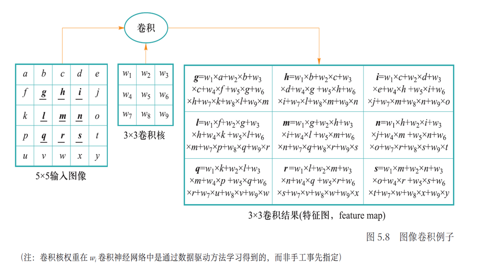
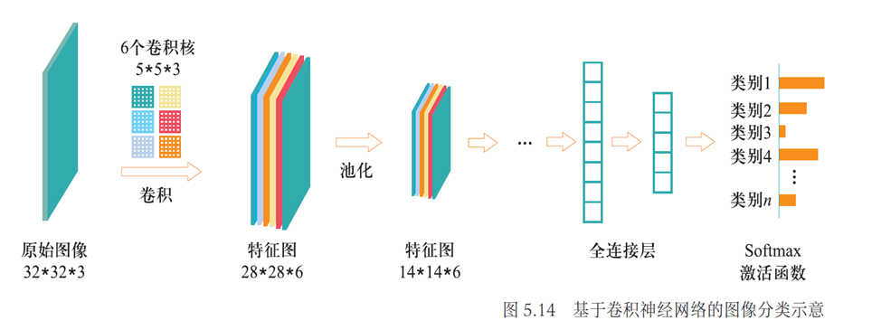

# 卷积神经网络

问题：在前馈神经网络模型参数数量巨大时，占用大量计算机内存，且会使神经网络模型的训练变得难以收敛；对于图像这样的数据，不能直接将所构成的像素点向量与前馈神经网络中的每个神经元相连

## 卷积

针对像素点的空间依赖性对图像进行处理的一种技术

+ 卷积核：二维矩阵，数值为图像中与卷积核同样大小的子块像素点进行卷积计算时所采用的权重
+ 操作：下采样 $g=w_1\times a+\cdots+w_9\times m$
	
+ 方法：
	+ 填充：为了使边缘位置的图像像素点也参与卷积滤波，在边缘像素点周围填充“0”(即0填充)，使得可以以边缘像素点为中心形成与卷积核同样大小的图像子块区域（在这种填充机制下，卷积后的图像分辨率将与卷积前的图像分辨率一致，不存在下采样）
	+ 步长：希望被卷积所得的图像被约减，改变卷积核在被卷积图像中移动步长的大小来跳过一些像素，进行卷积滤波，stride=k表示卷积核移动跳过的步长是k
+ 特点：
	+ 选择性感受野
	+ 局部感知，参数共享
	+ 下采样约减抽象：被卷图像$W\times W$，卷积核$F\times F$，填充$P=\lceil F/2\rceil$，步长$S$，则结果$\dfrac{W-F+2P}{S}+1$

> 卷积核权重$w_i$在卷积神经网络中是通过数据驱动方法学习得到的
> 无填充，step = 1：$(5-3+2*0)/1 + 1 = 3$
> 有填充，step = 1：$(5-3+2*1)/1 + 1 = 5$
> 无填充，step = 2：$(5-3+2*0)/2 + 1 = 2$

## 池化

由于图像中存在较多冗余，可用某一区域子块的统计信息来刻画该区域所有像素点呈现的空间分布模式，以替代区域子块中所有像素点的取值（下采样）

+ 最大池化：从输入特征图的某个区域子块中选择值最大的像素点作为最大池化结果
+ 平均池化：计算区域子块所包含所有像素点的均值，将均值作为平均池化结果。
+ k-max池化：对输入特征图区域子块中的像素点取前k个最大值

## 完整卷积神经网络

- 如图5.14所示，对于32 × 32 × 3的彩色图像，先用6个5 × 5 × 3的卷积核对其进行卷积操作（步长为1，无填充）
- $(32-5+0)/1 + 1  = 28$
- 得到 6 个 28 × 28 的卷积结果（特征图），然后以2 × 2大小进行池化，得到6个14 × 14大小的特征图。最后通过若干个全连接层得到原始图像的向量表达，再对这个向量表达通过softmax函数进行分类识别，得到输入图像隶属于n个类别的概率。
