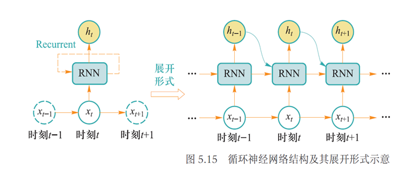
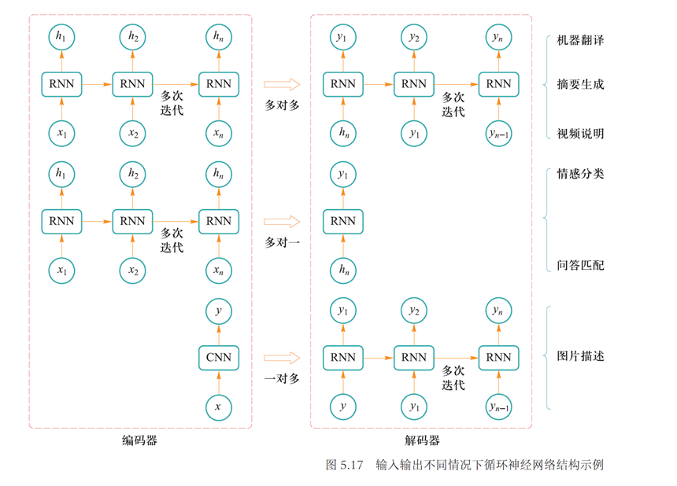
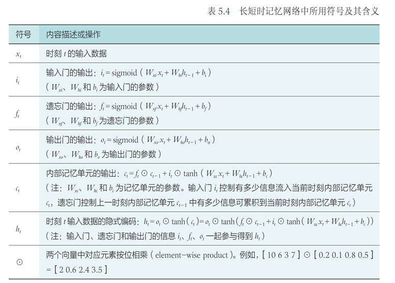

# 循环神经网络

!!! note ""
    先前所介绍的前馈神经网络或卷积神经网络所需要处理的输入数据一次性给定，难以处理存在前后依赖关系的数据。

应用：处理序列数据（文本句子、视频帧）时采用的网络结构

本质：希望模拟人所具有的记忆能力，在学习过程中记住部分已经出现的信息，并利用所记住的信息影响后续节点的输出

网络模型：在处理数据过程中构成循环体，在$t$时刻读取当前输入数据$x_i$和前一时刻输入数据$x_{i-1}$所对应的隐式编码结果$h_{i-1}$，一起生成$t$时刻的隐式编码结果$h_i$

+ 表示：$h_i=\Phi(U\times x_i+W\times h_{i-1})$
+ 展开：按照时间展开得到与前馈神经网络相似的网络结构，沿时间反向传播算法
$$
h_i=\Phi(U\times x_i+W\times h_{i-1})=\Phi(U\times x_i+W\times\Phi(U\times x_{i-1}+W\times \Phi(U\times x_{i-1}+\cdots)))
$$
+ 问题：梯度消失（叠加激活函数导致梯度越来越小）
$$
\dfrac{\partial E_t}{\partial W_x}=\sum_{i=1}^t\dfrac{\partial E_t}{\partial O_t}\dfrac{\partial O_t}{\partial h_t}\left(\prod_{j=i+1}^t\dfrac{\partial h_j}{\partial h_{j-1}}\right)\dfrac{\partial h_j}{\partial W_x}
$$
+ 解决：长短时记忆模型（Long Short-Term Memory，LSTM）

在循环神经网络中，根据输入序列数据与输出序列数据中所包含“单元”的多寡，循环神经网络可以实现**多对多**（即输入和输出序列数据中包含多个单元，常用于机器翻译）、**多对一**（即输入序列数据包含多个单元，输出序列数据只包含一个单元，常用于文本的情感分类）和**一对多**（即输入序列数据包含一个单元，输出序列数据包含多个单元，常用于图像描述生成）三种模式

## 长短时记忆网络

引入了内部记忆单元和门结构来对当前输入信息以及前序时刻所生成的信息进行整合和传递。在这里，内部记忆单元中信息可视为对“历史信息”的累积。

常见的LSTM模型中有**输入门(input gate)**、 **遗忘门(forget gate)** 和 **输出门(output gate)** 三种门结构。对于给定的当前时刻输入数据 $𝑥_𝑡$ 和前一时刻隐式编码 $ℎ_{𝑡−1}$，输入门、遗忘门和输出门通过各自参数对其编码，分别得到三种门结构的输出 $𝑖_𝑡$、$𝑓_𝑡$和$𝑜_𝑡$。

在此基础上，再进一步结合前一时刻内部记忆单元信息$𝑐_{𝑡−1}$来更新当前时刻内部记忆单元信息$𝑐_𝑡$，最终得到当前时刻的隐式编码$ℎ_𝑡$

> 对$c_t=f_t\odot c_{t-1}+i_t\cdot \tanh(W_{xc}x_t+W_{hc}h_{t-1}+b_c)$求导，结果为
> $\dfrac{\partial c_t}{\partial c_{t-1}}=f_t+\dfrac{\partial f_t}{\partial c_{t-1}}\times c_{t-1}+\cdots$
> 即梯度不会消失
