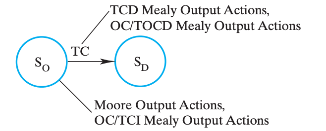
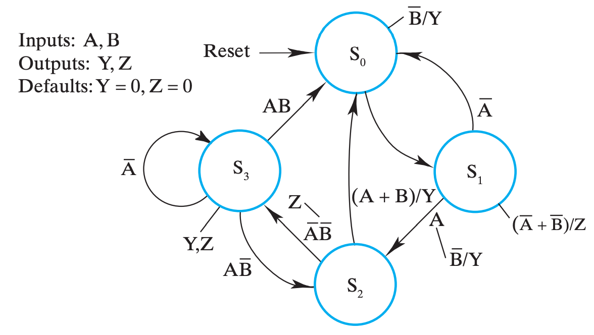

# 时序电路的设计

类比组合逻辑电路通过真值表设计电路，（同步）时序电路主要依据状态表（或等价表达，如状态图）来设计电路。实际设计中，我们需要考虑触发器以及其它组合电路的选择与设计：

- 触发器的数量基本取决于整个需求中 状态 的数量，$n$ 个触发器能够表达 $2^n$ 个二进制状态；
- 组合电路的主要设计围绕 触发器 的 输入 和 输出 展开；

而主要的设计过程和组合逻辑电路的设计是类似的，如下：

!!! note "时序电路设计流程"

    1. 确定系统的行为；
        1. 描述系统行为过程中，要注意状态的复用（不过并非状态越少成本就越小，这里有触发器数量和组合逻辑电路的 trade-off）；
        2. 确定电路的初始状态（**复位状态(reset state)**，通过给定复位(reset)信号实现）；
            - 复位一般可以是异步的；
    2. 阐述输入和输出之间的逻辑关系，并用真值表或逻辑表达式表达出来；
    3. 给设计好的状态编码赋值，得到具体的状态表；
        1. 我们可以使用 按计数顺序、 按格雷码、用独热码 来给状态赋值，更系统的方法比较复杂，不做讨论；
        2. 其中还有一种情况是所需要的状态不能完整填充 $2^n$ 种情况，需要设计无效状态，这种时候可以不考虑它们；
    4. 根据状态表确定使用的触发器及其输入方程；
    5. 根据状态表确定输出方程；
    6. 优化输入方程和输出方程；
    7. 将优化后的逻辑设计工艺映射到硬件实现上；
    8. 验证正确性（在仿真环境中）；
        - 主要就是看能不能复现状态图；

---

## 状态机

尽管在小规模的设计中，状态图表现良好，但是随着设计的系统规模变大，我们需要一个更加泛用的方式来表达类似的时序逻辑。

于是，我们在状态图的基础上进行修改，设计了 **状态机(State-Machine Diagram)** 来做这件事。

状态机混用了米勒型和摩尔型的输出格式，优劣在 **[状态图](#状态图)** 中有所提及。并且，有限图将状态转移方程也写入，总体上对电路设计更友好。下图是状态机的一个“范式”。

!!! note "Generic State Diagram Template"
    

    首先解释一下这个“范式”：

    > 具体解释状态机有哪些内容，以及各个部分之间的逻辑。关于各个部分出现的位置，请参考 Template。
    >
    > 另外，为了简化语句，下面的说法省略了时钟，请记得考虑。

    状态机模型主要有三要素：**输入条件(Input Conditions)**、**状态转移(Transitions)** 和 **输出行为(Output Actions)**。总体来说，输入条件告诉我们整个状态机要如何变化；状态转移描述了状态机的内部转移行为，即图论上的有向联通关系；输出行为描述动态变化过程中状态机的对外表达。其中，状态转移和输出行为是我们需要关注的状态机的两个维度，输入条件是我们用来做实时判断的外部依据。

    ---

    「输入条件」是由输入变量形成的一个布尔方程，在整个状态机中，输入是变化的“因变量”，换句话来说，无论是状态转移还是输出，都取决于输入条件。而导致特定行为的输入条件则被分类为 **转移条件(Transition Condition, TC)** 和 **输出条件(Output Condition, OC)**。

    ---

    「状态转移」在图中表现为有向边，当 TC 成立时，状态转移发生；或者对于无条件转移，只要得到时钟脉冲就会转移到下一个状态。

    ---

    「输出行为」在状态机中有四种触发方法（即四种 OC）：**Moore**、**不依赖转移(Transition-condition Independent, TCI)** Mealy、**依赖转移(Transition-condition Dependent, TCD)** Mealy 和 **依赖转移和输出条件(Transition and Output-condition Dependent, TOCD)** Mealy。根据字面意思来看：
        
    - Moore 只与状态有关，所以在图中从状态节点引出；
    - TCI Mealy 与状态和输出条件有关，所以在图中从状态节点引出写在 OC 后面（`OC`/`TCI OA`）；
    - TCD Mealy 与转移条件有关，当转移成立的时候发生 Output Action，所以直接写在 TC 后面（`TC`/`TCD OA`）；
    - TOCD Mealy 在转移发生时候才可能条件成立，即当 TC 和 OC 都成立时才发生 Output Action，所以需要从 TC 引出 OC，并跟在 OC 后面（`TC`——`OC`/`TOCD OA`）；
            - 如果出现复数的 TOCD OA，则使用 `,` 分隔；

    > In a given state, an output action occurs if: (a) it is unconditional (Moore), (b)  TCI and its output condition OC = 1, \(c) TCD and its transition condition TD = 1, and (d) TOCD and its transition condition TC and output condition OC are both equal to 1, i.e, TC·OC = 1. Note that Moore and TCI output actions attached to a state, apply to all transitions from the state as well.

    回到输出行为本身，当 OC 成立时输出行为发生，一般会将输出变量标出，如果写的是 NOT X，表示 OC 成立时 X 应为 `0`；如果写的是 X，则表示 OC 成立时 X 为 `1`。

    !!! warning "注意点"
        此外，还有一个点需要辨析，由于「Transition」表示的是“下一个”状态，所以对于当前时刻，当前节点的输出和出度的输出不能冲突。例如，下图因为 Moore 输出行为的 Z 和 TC=AB 那条边的 Z' 冲突，所以非法。

        

        ---

        当然，非法状态机并不只有这一个判据。不过核心思想就是 **不能有歧义或冲突且需要充分**，更数学的表达是，必须满足如下两个条件：

        1.非交：对于每一个状态 $S_i$，它的任意两个出度 $(T_{ij},T_{jk})$ 都不能同时成立，即应有：

        $$
        \forall (T_{ij},T_{ik})\;,\;\;T_{ij}\cdot T_{ik} = 0
        $$

        2.充分：对于每一个状态 $S_i$，它的所有出度条件应该涵盖所有可能，即应有：

        $$
        \sum_{j}T_{ij} = 1
        $$

        Tips: 上面是对 Transition Condition 的约束，**将 TC 换成 OC 也需要成立**。

    ---

    ???+ summary "缩写对照表"
        |缩写    |含义                                       |注释|
        |---    |---                                        |---|
        |TC     |Transition Condition                       |转移条件：导致 Transition 的 Input Condition|
        |OC     |Output Condition                           |输出条件：导致 Output Actions 的 Input Condition|
        |TCI    |Transition-condition Independent           |不依赖转移：只与 State 有关的 Output Actions|
        |TCD    |Transition-condition Dependent             |依赖转移：Transition Condition 成立才有 Output Actions|
        |TOCD   |Transition and Output-condition Dependent  |依赖转移和输出方程：Transition Condition 和 Output Condition 都成立才有 Output Actions|

    ???+ example "State Machine Diagram 🌰"
        
        > 注意，图中有一个错误（大概），右侧 $S_1$ 的 OC 应为 $(\overline{A}\cdot\overline{B})$。

---

## 延时分析

首先，自上而下的给出观念，时序电路的延时分析有两个主要部分和一个次要部分：

1. 组合电路导致的延时；
2. 触发器导致的延时；
3. 电路的松弛时间；

并且往往是根据触发器的类型，计算一个时钟周期的时间。最核心的问题就是计算电路能够正常工作的最短时钟周期。接下来，自下而上的进行细节补充。

---

### 组合电路延时

这一部分的详细内容已经在 **[上一章](../Chap03/Chap03_1/#_2)** 介绍过了，在这里，为了简化计算过程，我们全部采用 $t_{pd}$。

---

### 触发器延时

触发器延时相比组合电路延时复杂很多，主要目的是为了保证采样。也就是说它的“延时”并不仅仅是因为电信号传播的延迟，还有为了保证信号稳定设计的一些内容。

大致来说有三个部分：

- Setup Time：采样边缘前输入信号需要保持稳定的时间；
- Hold Time：采样边缘后输入信号需要保持稳定的时间；
- Propagation Time：触发器的采样边缘到输出稳定的时间（传播时间）；

!!! note ""
    一篇介绍 Setup Time 和 Hold Time 的 **[文章](https://nandland.com/lesson-12-setup-and-hold-time/)**。

根据触发器的类型不同，主要的 Setup Time 也不同：

其中比较重要的一些点是：

1. 这几个时间点起点/终点都是触发边缘；
2. Propagation Time 一定长于 Hold Time，因此在计算电路延迟时只考虑 Propagation Time；
3. Pulse-trigger 和 Edge-trigger 在表现上的区别在于 Setup Time，前者需要覆盖整个 pulse(`pos` or `neg`)；

---

### 松弛时间

实际上这就是给整个电路的一个“容差”时间，给定一个误差，但是由于通过前两者计算出来的是最短时间，所以松弛时间必定非负。（不能倒扣！）

---

### 时序电路延时

时序电路的延时计算实际上是为了计算时序电路运作的最大频率以设计时钟频率。所以我们需要算出电路能够稳定工作的最小时钟期。

其计算遵循一定方法：

> 图中 $t_{pd,FF}$ 指触发器的 propagation time，$t_{COMB}$ 指组合电路的总传播时间（一般情况下 $t_{COMB} = \max{\sum_i t_{pd,gate_i}}$），$t_{s}$ 指触发器的 setup time，$t_{slack}$ 表示电路的松弛时间。

!!! note "（假）经验之谈"
    一般从一个 FF 的输出出发到 FF 的输入结束。

- [ ] 我觉得这里应该是需要有例题的，但是我现在还没做题，所以做了再写。
