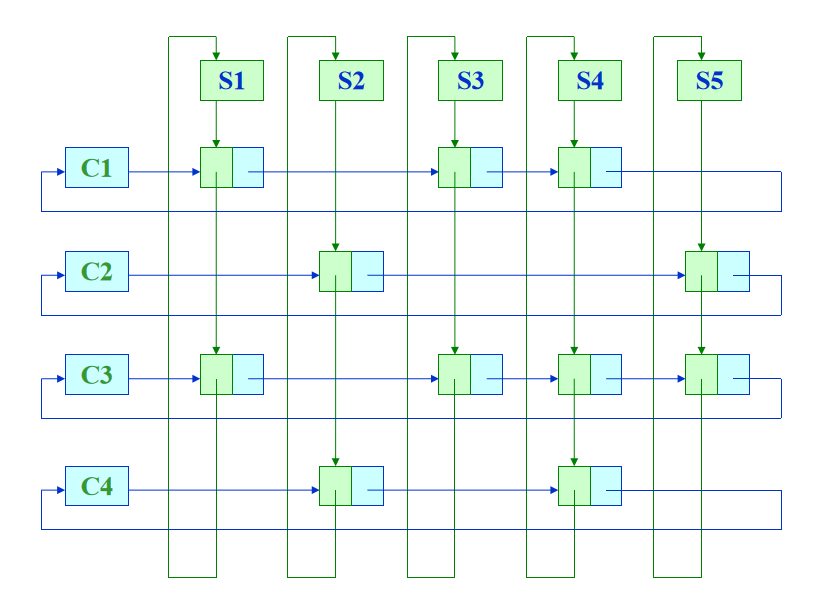

# 表 | The List ADT

「表 list」是一个抽象的数据结构概念，它表示元素的有序集合，支持元素访问、修改、添加、删除和遍历等操作。表可以基于链表或数组实现。

- 链表天然可以被看作是一个表，其支持元素增删查改操作，并且可以灵活动态扩容。
- 数组也支持元素增删查改，但由于其长度不可变，因此只能被看作是一个具有长度限制的表。

当使用数组实现表时，**长度不可变的性质会导致表的实用性降低**。这是因为我们通常无法事先确定需要存储多少数据，从而难以选择合适的表长度。若长度过小，则很可能无法满足使用需求；若长度过大，则会造成内存空间的浪费。

## 表常用操作

表的常用操作包括：

- **获取表长度**：获取表中元素的数量。
- **遍历表**：依次访问表中的每一个元素。
- **初始化表**：创建一个空表。
- **获取元素**：获取表中指定位置的元素。
- **插入元素**：在表中指定位置插入一个元素。
- **删除元素**：删除表中指定位置的元素。
- **获取下一个元素**：获取表中指定位置元素的下一个元素。
- **获取上一个元素**：获取表中指定位置元素的上一个元素。


## 可变长度表的实现

许多编程语言都提供内置的表，例如 Java、C++、Python 等。它们的实现比较复杂，各个参数的设定也非常有考究，例如初始容量、扩容倍数等。感兴趣的读者可以查阅源码进行学习。

为了加深对表工作原理的理解，我们尝试实现一个简易版表，包括以下三个重点设计。

- **初始容量**：选取一个合理的数组初始容量。在本示例中，我们选择 10 作为初始容量。
- **数量记录**：声明一个变量 `size` ，用于记录表当前元素数量，并随着元素插入和删除实时更新。根据此变量，我们可以定位表尾部，以及判断是否需要扩容。
- **扩容机制**：若插入元素时表容量已满，则需要进行扩容。首先根据扩容倍数创建一个更大的数组，再将当前数组的所有元素依次移动至新数组。在本示例中，我们规定每次将数组扩容至之前的 2 倍。

=== "C"

    ``` c
    /* 表类简易实现 */
    struct myList {
        int *arr;        // 数组（存储表元素）
        int capacity;    // 表容量
        int size;        // 表大小
        int extendRatio; // 表每次扩容的倍数
    };

    typedef struct myList myList;

    /* 构造函数 */
    myList *newMyList() {
        myList *nums = malloc(sizeof(myList));
        nums->capacity = 10;
        nums->arr = malloc(sizeof(int) * nums->capacity);
        nums->size = 0;
        nums->extendRatio = 2;
        return nums;
    }

    /* 析构函数 */
    void delMyList(myList *nums) {
        free(nums->arr);
        free(nums);
    }

    /* 获取表长度 */
    int size(myList *nums) {
        return nums->size;
    }

    /* 获取表容量 */
    int capacity(myList *nums) {
        return nums->capacity;
    }

    /* 访问元素 */
    int get(myList *nums, int index) {
        assert(index >= 0 && index < nums->size);
        return nums->arr[index];
    }

    /* 更新元素 */
    void set(myList *nums, int index, int num) {
        assert(index >= 0 && index < nums->size);
        nums->arr[index] = num;
    }

    /* 尾部添加元素 */
    void add(myList *nums, int num) {
        if (size(nums) == capacity(nums)) {
            extendCapacity(nums); // 扩容
        }
        nums->arr[size(nums)] = num;
        nums->size++;
    }

    /* 中间插入元素 */
    void insert(myList *nums, int index, int num) {
        assert(index >= 0 && index < size(nums));
        // 元素数量超出容量时，触发扩容机制
        if (size(nums) == capacity(nums)) {
            extendCapacity(nums); // 扩容
        }
        for (int i = size(nums); i > index; --i) {
            nums->arr[i] = nums->arr[i - 1];
        }
        nums->arr[index] = num;
        nums->size++;
    }

    /* 删除元素 */
    // 注意：stdio.h 占用了 remove 关键词
    int removeNum(myList *nums, int index) {
        assert(index >= 0 && index < size(nums));
        int num = nums->arr[index];
        for (int i = index; i < size(nums) - 1; i++) {
            nums->arr[i] = nums->arr[i + 1];
        }
        nums->size--;
        return num;
    }

    /* 表扩容 */
    void extendCapacity(myList *nums) {
        // 先分配空间
        int newCapacity = capacity(nums) * nums->extendRatio;
        int *extend = (int *)malloc(sizeof(int) * newCapacity);
        int *temp = nums->arr;

        // 拷贝旧数据到新数据
        for (int i = 0; i < size(nums); i++)
            extend[i] = nums->arr[i];

        // 释放旧数据
        free(temp);

        // 更新新数据
        nums->arr = extend;
        nums->capacity = newCapacity;
    }

    /* 将表转换为 Array 用于打印 */
    int *toArray(myList *nums) {
        return nums->arr;
    }

    ```

## 表的两种数据结构

!!! note "表的两种数据结构"
    - [数组](./array.md)
    - [链表](./linked_list.md)

## 表的两个应用场景

- 多项式ADT: The Polynomial ADT
- 多重表: Multilists
  
!!! note "学生与课程的关系"  
    
    学生与课程的关系，横排为课程，竖排为学生。如果用数组的话，会造成空间的浪费，因为有些学生没有选课，但是数组中的位置还是被占用了。所以此处用链表，就可以解决这个问题。
