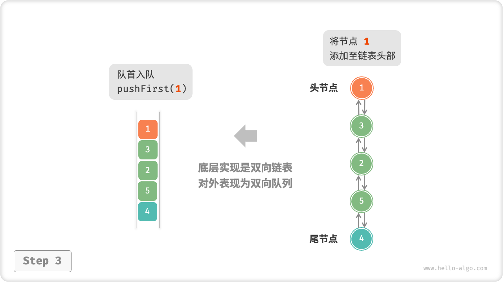
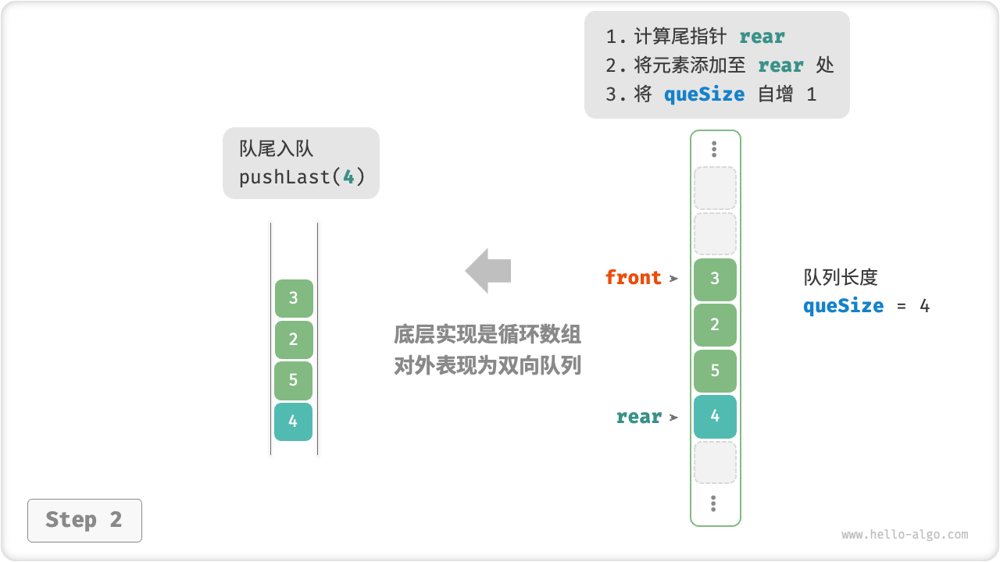
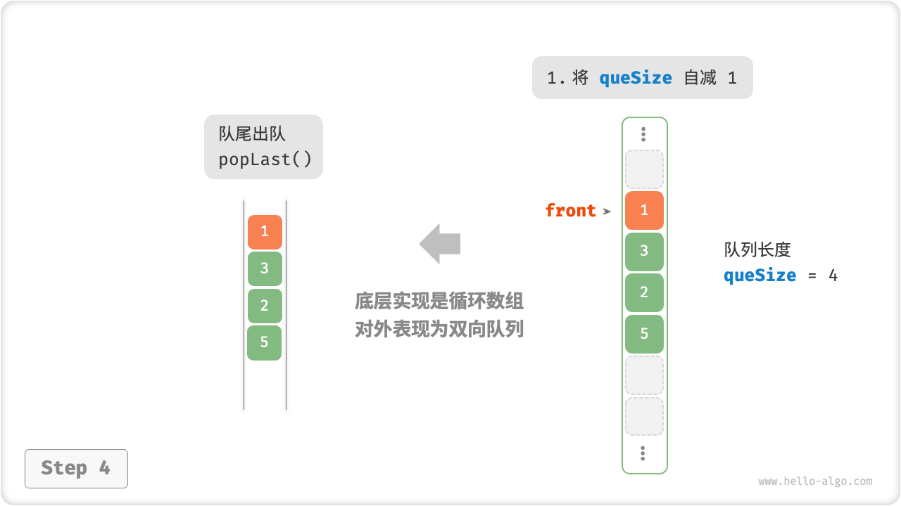
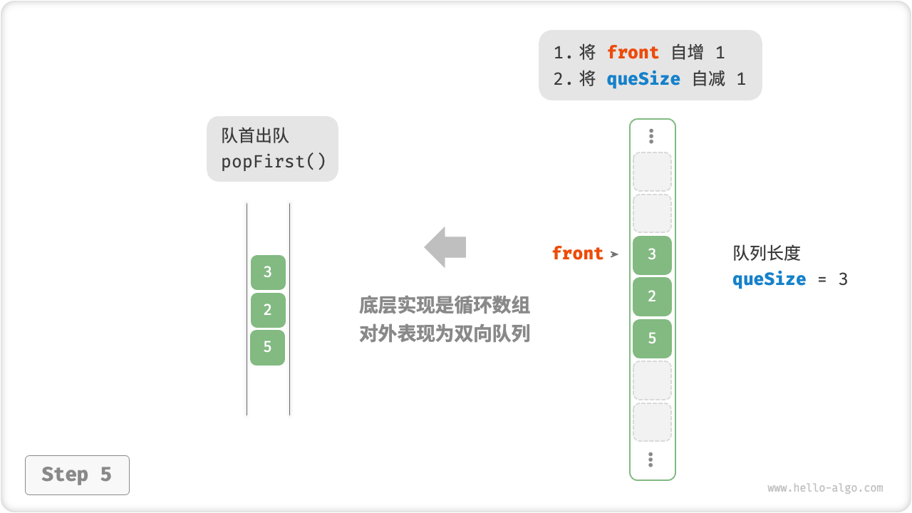

# 双向队列

在队列中，我们仅能在头部删除或在尾部添加元素。如下图所示，「双向队列 double-ended queue」提供了更高的灵活性，允许在头部和尾部执行元素的添加或删除操作。


## 双向队列常用操作

双向队列的常用操作如下表所示，具体的方法名称需要根据所使用的编程语言来确定。

<p align="center"> 表 <id> &nbsp; 双向队列操作效率 </p>

| 方法名       | 描述            | 时间复杂度 |
| ----------- | -------------- | ---------- |
| pushFirst() | 将元素添加至队首  | $O(1)$     |
| pushLast()  | 将元素添加至队尾  | $O(1)$     |
| popFirst()  | 删除队首元素     | $O(1)$     |
| popLast()   | 删除队尾元素     | $O(1)$     |
| peekFirst() | 访问队首元素     | $O(1)$     |
| peekLast()  | 访问队尾元素     | $O(1)$     |

## 双向队列实现 *

双向队列的实现与队列类似，可以选择链表或数组作为底层数据结构。

### 基于双向链表的实现

回顾上一节内容，我们使用普通单向链表来实现队列，因为它可以方便地删除头节点（对应出队操作）和在尾节点后添加新节点（对应入队操作）。

对于双向队列而言，头部和尾部都可以执行入队和出队操作。换句话说，双向队列需要实现另一个对称方向的操作。为此，我们采用“双向链表”作为双向队列的底层数据结构。

如下图所示，我们将双向链表的头节点和尾节点视为双向队列的队首和队尾，同时实现在两端添加和删除节点的功能。

=== "LinkedListDeque"
    

=== "pushLast()"
    

=== "pushFirst()"
    

=== "popLast()"
    

=== "popFirst()"
    

实现代码如下所示。

=== "C"

    ```c
    /* 双向链表节点 */
    struct doublyListNode {
        int val;                     // 节点值
        struct doublyListNode *next; // 后继节点
        struct doublyListNode *prev; // 前驱节点
    };

    typedef struct doublyListNode doublyListNode;

    /* 构造函数 */
    doublyListNode *newDoublyListNode(int num) {
        doublyListNode *new = (doublyListNode *)malloc(sizeof(doublyListNode));
        new->val = num;
        new->next = NULL;
        new->prev = NULL;
        return new;
    }

    /* 析构函数 */
    void delDoublyListNode(doublyListNode *node) {
        free(node);
    }

    /* 基于双向链表实现的双向队列 */
    struct linkedListDeque {
        doublyListNode *front, *rear; // 头节点 front ，尾节点 rear
        int queSize;                  // 双向队列的长度
    };

    typedef struct linkedListDeque linkedListDeque;

    /* 构造函数 */
    linkedListDeque *newLinkedListDeque() {
        linkedListDeque *deque = (linkedListDeque *)malloc(sizeof(linkedListDeque));
        deque->front = NULL;
        deque->rear = NULL;
        deque->queSize = 0;
        return deque;
    }

    /* 析构函数 */
    void delLinkedListdeque(linkedListDeque *deque) {
        // 释放所有节点
        for (int i = 0; i < deque->queSize && deque->front != NULL; i++) {
            doublyListNode *tmp = deque->front;
            deque->front = deque->front->next;
            free(tmp);
        }
        // 释放 deque 结构体
        free(deque);
    }

    /* 获取队列的长度 */
    int size(linkedListDeque *deque) {
        return deque->queSize;
    }

    /* 判断队列是否为空 */
    bool empty(linkedListDeque *deque) {
        return (size(deque) == 0);
    }

    /* 入队 */
    void push(linkedListDeque *deque, int num, bool isFront) {
        doublyListNode *node = newDoublyListNode(num);
        // 若链表为空，则令 front, rear 都指向node
        if (empty(deque)) {
            deque->front = deque->rear = node;
        }
        // 队首入队操作
        else if (isFront) {
            // 将 node 添加至链表头部
            deque->front->prev = node;
            node->next = deque->front;
            deque->front = node; // 更新头节点
        }
        // 队尾入队操作
        else {
            // 将 node 添加至链表尾部
            deque->rear->next = node;
            node->prev = deque->rear;
            deque->rear = node;
        }
        deque->queSize++; // 更新队列长度
    }

    /* 队首入队 */
    void pushFirst(linkedListDeque *deque, int num) {
        push(deque, num, true);
    }

    /* 队尾入队 */
    void pushLast(linkedListDeque *deque, int num) {
        push(deque, num, false);
    }

    /* 访问队首元素 */
    int peekFirst(linkedListDeque *deque) {
        assert(size(deque) && deque->front);
        return deque->front->val;
    }

    /* 访问队尾元素 */
    int peekLast(linkedListDeque *deque) {
        assert(size(deque) && deque->rear);
        return deque->rear->val;
    }

    /* 出队 */
    int pop(linkedListDeque *deque, bool isFront) {
        if (empty(deque))
            return -1;
        int val;
        // 队首出队操作
        if (isFront) {
            val = peekFirst(deque); // 暂存头节点值
            doublyListNode *fNext = deque->front->next;
            if (fNext) {
                fNext->prev = NULL;
                deque->front->next = NULL;
                delDoublyListNode(deque->front);
            }
            deque->front = fNext; // 更新头节点
        }
        // 队尾出队操作
        else {
            val = peekLast(deque); // 暂存尾节点值
            doublyListNode *rPrev = deque->rear->prev;
            if (rPrev) {
                rPrev->next = NULL;
                deque->rear->prev = NULL;
                delDoublyListNode(deque->rear);
            }
            deque->rear = rPrev; // 更新尾节点
        }
        deque->queSize--; // 更新队列长度
        return val;
    }

    /* 队首出队 */
    int popFirst(linkedListDeque *deque) {
        return pop(deque, true);
    }

    /* 队尾出队 */
    int popLast(linkedListDeque *deque) {
        return pop(deque, false);
    }

    /* 打印队列 */
    void printLinkedListDeque(linkedListDeque *deque) {
        int arr[deque->queSize];
        // 拷贝链表中的数据到数组
        int i;
        doublyListNode *node;
        for (i = 0, node = deque->front; i < deque->queSize; i++) {
            arr[i] = node->val;
            node = node->next;
        }
        printArray(arr, deque->queSize);
    }
    ```

### 基于数组的实现

如下图所示，与基于数组实现队列类似，我们也可以使用环形数组来实现双向队列。

=== "ArrayDeque"
    

=== "pushLast()"
    

=== "pushFirst()"
    

=== "popLast()"
    

=== "popFirst()"
    

在队列的实现基础上，仅需增加“队首入队”和“队尾出队”的方法。

=== "C"

    ```c
    /* 基于环形数组实现的双向队列 */
    struct arrayDeque {
        int *nums;       // 用于存储队列元素的数组
        int front;       // 队首指针，指向队首元素
        int queSize;     // 尾指针，指向队尾 + 1
        int queCapacity; // 队列容量
    };

    typedef struct arrayDeque arrayDeque;

    /* 构造函数 */
    arrayDeque *newArrayDeque(int capacity) {
        arrayDeque *deque = (arrayDeque *)malloc(sizeof(arrayDeque));
        // 初始化数组
        deque->queCapacity = capacity;
        deque->nums = (int *)malloc(sizeof(int) * deque->queCapacity);
        deque->front = deque->queSize = 0;
        return deque;
    }

    /* 析构函数 */
    void delArrayDeque(arrayDeque *deque) {
        free(deque->nums);
        deque->queCapacity = 0;
    }

    /* 获取双向队列的容量 */
    int capacity(arrayDeque *deque) {
        return deque->queCapacity;
    }

    /* 获取双向队列的长度 */
    int size(arrayDeque *deque) {
        return deque->queSize;
    }

    /* 判断双向队列是否为空 */
    bool empty(arrayDeque *deque) {
        return deque->queSize == 0;
    }

    /* 计算环形数组索引 */
    int dequeIndex(arrayDeque *deque, int i) {
        // 通过取余操作实现数组首尾相连
        // 当 i 越过数组尾部时，回到头部
        // 当 i 越过数组头部后，回到尾部
        return ((i + capacity(deque)) % capacity(deque));
    }

    /* 队首入队 */
    void pushFirst(arrayDeque *deque, int num) {
        if (deque->queSize == capacity(deque)) {
            printf("双向队列已满\r\n");
            return;
        }
        // 队首指针向左移动一位
        // 通过取余操作，实现 front 越过数组头部回到尾部
        deque->front = dequeIndex(deque, deque->front - 1);
        // 将 num 添加到队首
        deque->nums[deque->front] = num;
        deque->queSize++;
    }

    /* 队尾入队 */
    void pushLast(arrayDeque *deque, int num) {
        if (deque->queSize == capacity(deque)) {
            printf("双向队列已满\r\n");
            return;
        }
        // 计算尾指针，指向队尾索引 + 1
        int rear = dequeIndex(deque, deque->front + deque->queSize);
        // 将 num 添加至队尾
        deque->nums[rear] = num;
        deque->queSize++;
    }

    /* 访问队首元素 */
    int peekFirst(arrayDeque *deque) {
        // 访问异常：双向队列为空
        assert(empty(deque) == 0);
        return deque->nums[deque->front];
    }

    /* 访问队尾元素 */
    int peekLast(arrayDeque *deque) {
        // 访问异常：双向队列为空
        assert(empty(deque) == 0);
        int last = dequeIndex(deque, deque->front + deque->queSize - 1);
        return deque->nums[last];
    }

    /* 队首出队 */
    int popFirst(arrayDeque *deque) {
        int num = peekFirst(deque);
        // 队首指针向后移动一位
        deque->front = dequeIndex(deque, deque->front + 1);
        deque->queSize--;
        return num;
    }

    /* 队尾出队 */
    int popLast(arrayDeque *deque) {
        int num = peekLast(deque);
        deque->queSize--;
        return num;
    }

    /* 打印队列 */
    void printArrayDeque(arrayDeque *deque) {
        int arr[deque->queSize];
        // 拷贝
        for (int i = 0, j = deque->front; i < deque->queSize; i++, j++) {
            arr[i] = deque->nums[j % deque->queCapacity];
        }
        printArray(arr, deque->queSize);
    }

    ```

## 双向队列应用

双向队列兼具栈与队列的逻辑，**因此它可以实现这两者的所有应用场景，同时提供更高的自由度**。

我们知道，软件的“撤销”功能通常使用栈来实现：系统将每次更改操作 `push` 到栈中，然后通过 `pop` 实现撤销。然而，考虑到系统资源的限制，软件通常会限制撤销的步数（例如仅允许保存 $50$ 步）。当栈的长度超过 $50$ 时，软件需要在栈底（即队首）执行删除操作。**但栈无法实现该功能，此时就需要使用双向队列来替代栈**。请注意，“撤销”的核心逻辑仍然遵循栈的先入后出原则，只是双向队列能够更加灵活地实现一些额外逻辑。
