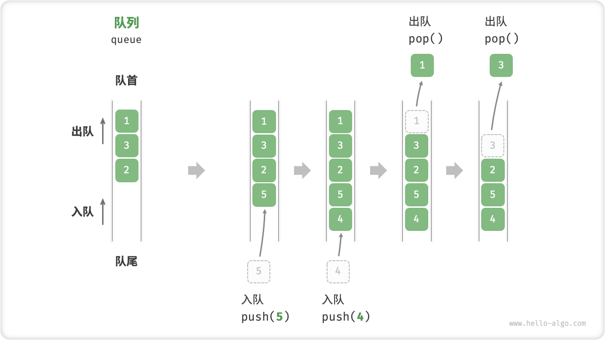
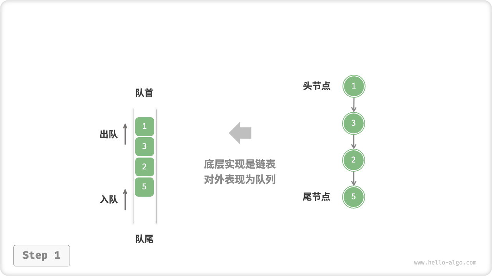
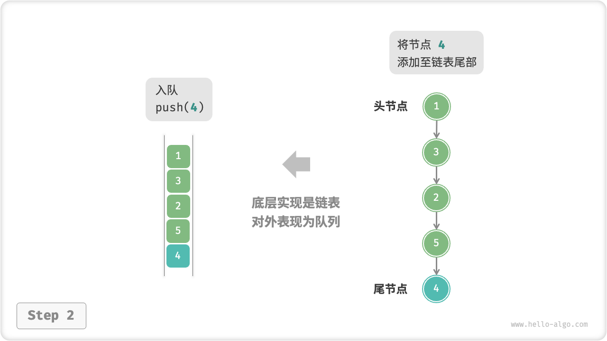
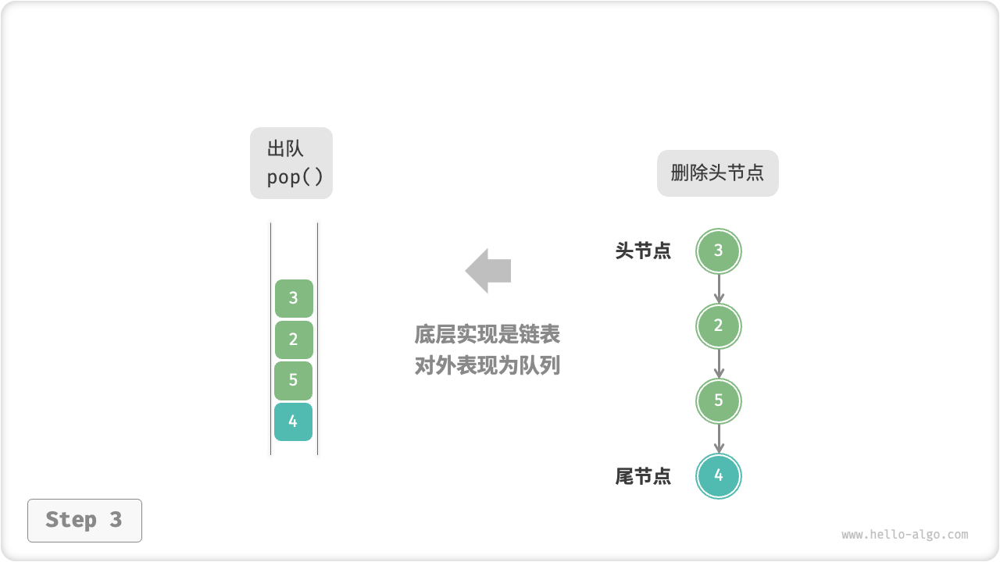
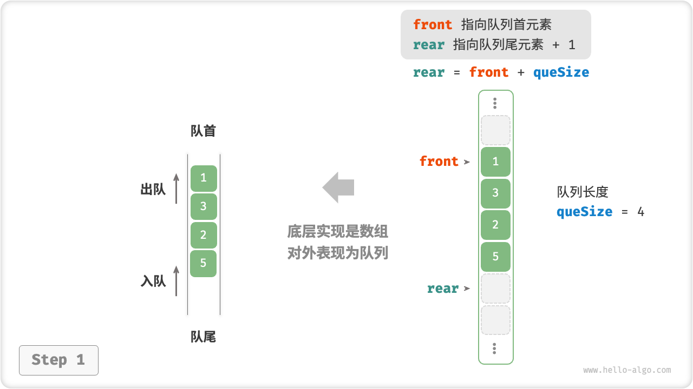
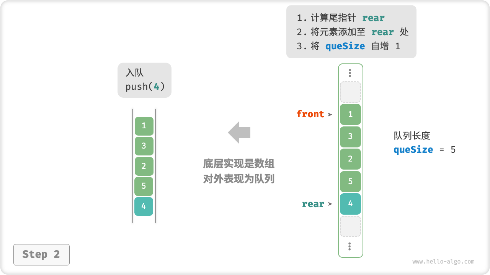
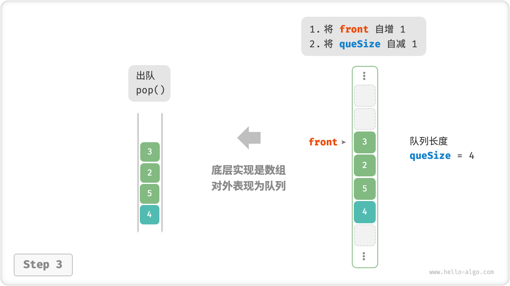

# 队列 | The Queue ADT

「队列 queue」是一种遵循先入先出规则的线性数据结构。顾名思义，队列模拟了排队现象，即新来的人不断加入队列的尾部，而位于队列头部的人逐个离开。

如下图所示，我们将队列的头部称为“队首”，尾部称为“队尾”，将把元素加入队尾的操作称为“入队”，删除队首元素的操作称为“出队”。



## 队列常用操作

队列的常见操作如下表所示。需要注意的是，不同编程语言的方法名称可能会有所不同。我们在此采用与栈相同的方法命名。

<p align="center"> 表 <id> &nbsp; 队列操作效率 </p>

| 方法名     | 描述                        | 时间复杂度 |
| --------- | -------------------------- | -------- |
| push()    | 元素入队，即将元素添加至队尾    | $O(1)$   |
| pop()     | 队首元素出队                 | $O(1)$   |
| peek()    | 访问队首元素                 | $O(1)$   |

## 队列实现

为了实现队列，我们需要一种数据结构，可以在一端添加元素，并在另一端删除元素。因此，链表和数组都可以用来实现队列。

### 基于链表的实现

如下图所示，我们可以将链表的“头节点”和“尾节点”分别视为“队首”和“队尾”，规定队尾仅可添加节点，队首仅可删除节点。

=== "LinkedListQueue"
    

=== "push()"
    

=== "pop()"
    

以下是用链表实现队列的代码。

=== "C"

    ```c
    /* 基于链表实现的队列 */
    struct linkedListQueue {
        ListNode *front, *rear;
        int queSize;
    };

    typedef struct linkedListQueue linkedListQueue;

    /* 构造函数 */
    linkedListQueue *newLinkedListQueue() {
        linkedListQueue *queue = (linkedListQueue *)malloc(sizeof(linkedListQueue));
        queue->front = NULL;
        queue->rear = NULL;
        queue->queSize = 0;
        return queue;
    }

    /* 析构函数 */
    void delLinkedListQueue(linkedListQueue *queue) {
        // 释放所有节点
        for (int i = 0; i < queue->queSize && queue->front != NULL; i++) {
            ListNode *tmp = queue->front;
            queue->front = queue->front->next;
            free(tmp);
        }
        // 释放 queue 结构体
        free(queue);
    }

    /* 获取队列的长度 */
    int size(linkedListQueue *queue) {
        return queue->queSize;
    }

    /* 判断队列是否为空 */
    bool empty(linkedListQueue *queue) {
        return (size(queue) == 0);
    }

    /* 入队 */
    void push(linkedListQueue *queue, int num) {
        // 尾节点处添加 node
        ListNode *node = newListNode(num);
        // 如果队列为空，则令头、尾节点都指向该节点
        if (queue->front == NULL) {
            queue->front = node;
            queue->rear = node;
        }
        // 如果队列不为空，则将该节点添加到尾节点后
        else {
            queue->rear->next = node;
            queue->rear = node;
        }
        queue->queSize++;
    }

    /* 访问队首元素 */
    int peek(linkedListQueue *queue) {
        assert(size(queue) && queue->front);
        return queue->front->val;
    }

    /* 出队 */
    void pop(linkedListQueue *queue) {
        int num = peek(queue);
        ListNode *tmp = queue->front;
        queue->front = queue->front->next;
        free(tmp);
        queue->queSize--;
    }

    /* 打印队列 */
    void printLinkedListQueue(linkedListQueue *queue) {
        int arr[queue->queSize];
        // 拷贝链表中的数据到数组
        int i;
        ListNode *node;
        for (i = 0, node = queue->front; i < queue->queSize; i++) {
            arr[i] = node->val;
            node = node->next;
        }
        printArray(arr, queue->queSize);
    }
    ```

### 基于数组的实现

由于数组删除首元素的时间复杂度为 $O(n)$ ，这会导致出队操作效率较低。然而，我们可以采用以下巧妙方法来避免这个问题。

我们可以使用一个变量 `front` 指向队首元素的索引，并维护一个变量 `size` 用于记录队列长度。定义 `rear = front + size` ，这个公式计算出的 `rear` 指向队尾元素之后的下一个位置。

基于此设计，**数组中包含元素的有效区间为 `[front, rear - 1]`**，各种操作的实现方法如下图所示。

- 入队操作：将输入元素赋值给 `rear` 索引处，并将 `size` 增加 1 。
- 出队操作：只需将 `front` 增加 1 ，并将 `size` 减少 1 。

可以看到，入队和出队操作都只需进行一次操作，时间复杂度均为 $O(1)$ 。

=== "ArrayQueue"
    

=== "push()"
    

=== "pop()"
    

你可能会发现一个问题：在不断进行入队和出队的过程中，`front` 和 `rear` 都在向右移动，**当它们到达数组尾部时就无法继续移动了**。为解决此问题，我们可以将数组视为首尾相接的“环形数组”。

对于环形数组，我们需要让 `front` 或 `rear` 在越过数组尾部时，直接回到数组头部继续遍历。这种周期性规律可以通过“取余操作”来实现，代码如下所示。

=== "C"

    ```c
    /* 基于环形数组实现的队列 */
    struct arrayQueue {
        int *nums;       // 用于存储队列元素的数组
        int front;       // 队首指针，指向队首元素
        int queSize;     // 尾指针，指向队尾 + 1
        int queCapacity; // 队列容量
    };

    typedef struct arrayQueue arrayQueue;

    /* 构造函数 */
    arrayQueue *newArrayQueue(int capacity) {
        arrayQueue *queue = (arrayQueue *)malloc(sizeof(arrayQueue));
        // 初始化数组
        queue->queCapacity = capacity;
        queue->nums = (int *)malloc(sizeof(int) * queue->queCapacity);
        queue->front = queue->queSize = 0;
        return queue;
    }

    /* 析构函数 */
    void delArrayQueue(arrayQueue *queue) {
        free(queue->nums);
        queue->queCapacity = 0;
    }

    /* 获取队列的容量 */
    int capacity(arrayQueue *queue) {
        return queue->queCapacity;
    }

    /* 获取队列的长度 */
    int size(arrayQueue *queue) {
        return queue->queSize;
    }

    /* 判断队列是否为空 */
    bool empty(arrayQueue *queue) {
        return queue->queSize == 0;
    }

    /* 访问队首元素 */
    int peek(arrayQueue *queue) {
        assert(size(queue) != 0);
        return queue->nums[queue->front];
    }

    /* 入队 */
    void push(arrayQueue *queue, int num) {
        if (size(queue) == capacity(queue)) {
            printf("队列已满\r\n");
            return;
        }
        // 计算队尾指针，指向队尾索引 + 1
        // 通过取余操作，实现 rear 越过数组尾部后回到头部
        int rear = (queue->front + queue->queSize) % queue->queCapacity;
        // 将 num 添加至队尾
        queue->nums[rear] = num;
        queue->queSize++;
    }

    /* 出队 */
    void pop(arrayQueue *queue) {
        int num = peek(queue);
        // 队首指针向后移动一位，若越过尾部则返回到数组头部
        queue->front = (queue->front + 1) % queue->queCapacity;
        queue->queSize--;
    }

    /* 打印队列 */
    void printArrayQueue(arrayQueue *queue) {
        int arr[queue->queSize];
        // 拷贝
        for (int i = 0, j = queue->front; i < queue->queSize; i++, j++) {
            arr[i] = queue->nums[j % queue->queCapacity];
        }
        printArray(arr, queue->queSize);
    }
    ```

以上实现的队列仍然具有局限性，即其长度不可变。然而，这个问题不难解决，我们可以将数组替换为动态数组，从而引入扩容机制。有兴趣的同学可以尝试自行实现。

两种实现的对比结论与栈一致，在此不再赘述。

## 队列典型应用

- **淘宝订单**。购物者下单后，订单将加入队列中，系统随后会根据顺序依次处理队列中的订单。在双十一期间，短时间内会产生海量订单，高并发成为工程师们需要重点攻克的问题。
- **各类待办事项**。任何需要实现“先来后到”功能的场景，例如打印机的任务队列、餐厅的出餐队列等。队列在这些场景中可以有效地维护处理顺序。
