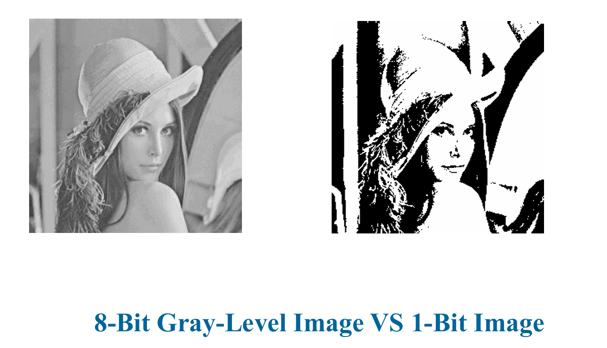
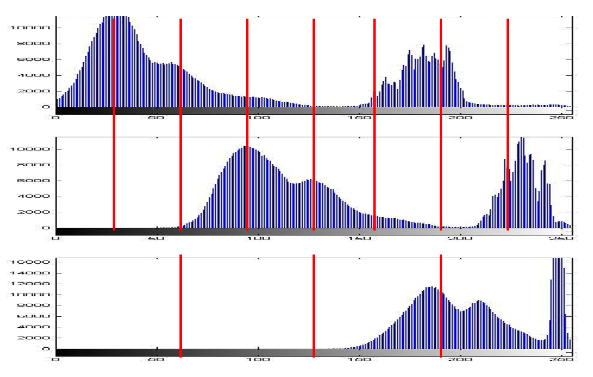

# Graphics and Image Data Types

## 1-Bit Image

**1-Bit Image** 也叫做二值图像（**Binary Image**）或者单色图像（**Monochrome Image**），是一种只包含黑白两种颜色的图像。


## 8-Bit Image



!!! note ""

    整个图像可以理解为由像素值构成的二维矩阵，这种数据结构被称为位图（**Bitmap**）。

### Print

!!! question "Question"
    如何将 8-Bit Image 以 1-Bit Image 的形式打印出来？

先给出一个概念：**DPI**（**Dots Per Inch**）是打印机的分辨率单位，表示每英寸上的点数。

打印这类图像（如位图）时，由于打印机本身的色彩或灰度精度有限（如黑白打印机只能输出纯黑或纯白），直接输出可能导致颜色过渡生硬或细节丢失。此时需要通过**抖动（Dithering）**技术，将**强度分辨率**（即颜色/灰度的精细程度）转换为**空间分辨率**（通过像素点的空间分布模拟颜色层次）。

#### Dithering

核心策略是通过将单个像素值替换为**更大的图案**（如 **2×2** 或 **4×4 网格**），使印刷网点数量近似模拟传统**半色调印刷（halftone printing）**中使用的**可变尺寸墨点**（例如报纸照片印刷）。其本质是将**色彩分辨率**转换为**空间分辨率**。  

- **数学表征**：一个 **N×N 矩阵**可呈现 **N²+1 级灰度**  

    !!! note ""
        **2×2 图案**可呈现 **5 种灰度等级**  
        

对于 8-Bit Image，可以通过**抖动**技术将其转换为 1-Bit Image。首先将图像像素值从 **0~255** 重新映射至 **0~4** 范围，方法是通过**整数除法**（除以 **256/5**）。

!!! question "为什么是 256/5？"
    因为 **5** 是 **2×2 矩阵**的可以表示的**最大灰度等级**，要使得 **0~255** 范围内的值映射到 **0~4**，需要将 **256** 等分为 **5** 份。

- 若像素值为 **0**，则在印刷输出的 **2×2 区域**内不打印任何网点；  
- 若像素值为 **4**，则打印该区域内的全部 **4 个网点**。  

!!! note "**核心规则**"  
    **阈值判定**：若像素强度值 **大于** 抖动矩阵（dither matrix）对应位置的阈值，则在矩阵条目位置打印**实心网点**。  
    - 这里的抖动矩阵例如：
        $$ \begin{bmatrix} 0 & 2 \\ 3 & 1 \end{bmatrix} $$

    **像素扩展**：将每个像素替换为 **n×n 点阵**，导致输出图像尺寸显著增加。例如：  
        - 原始图像为 **N×N** 像素；  
        - 使用 **4×4 点阵**替换每个像素时，输出图像尺寸将变为 **4N×4N**，即**扩大16倍**！

##### 优化 | Standard Pattern

在刚刚的方法里，我们的输出图像尺寸增大了很多，这是不可接受的。因此，我们需要对这个方法进行优化，避免输出图像尺寸的显著增加。

我们采用 **标准阈值矩阵（Standard Pattern）** 方法。

- 预存一个与目标输出尺寸相同的**整数矩阵（0-255）**，称为标准模式矩阵。  
- **操作规则**：将灰度图像矩阵与标准模式矩阵逐位置比较，**当灰度值 > 模式矩阵对应位置的阈值时，打印实心网点**。  

!!! note ""
    例如，对于一个25灰度等级的图像，标准模式矩阵如下：
        {width=25%}
    当我们的灰度值为 **15** 时，输出的图像如下：
        {width=25%}

    !!! example "相关代码"
        对于 n×n 的标准模式矩阵，我们可以通过以下伪代码实现：
        ```plaintext
         BEGIN
            for x = 0 to x_max              // column
                for y = 0 to y_max          // row
                    if gray(x, y) > pattern(x % n, y % n) then
                        print solid dot
                    else
                        print empty dot
                    end if
                end for
            end for
        ```

!!! question "Print an image ($600 \times 450 \times 8$bit) on a paper ($8 \times 6$ inch) by a printer with $300 \times 300$ DPI, what’s the size of each pixel (dots)?"

    !!! note ""
        问的是每一个像素要打多少点

    - Paper Size: $8 \times 6$ inch
    - DPI: $300 \times 300$
    - **Dots of paper**: $8 \times 300 \times 6 \times 300$

    - **Dots of image**: $600 \times 450$
    - **Size of each pixel**: $\frac{8 \times 300 \times 6 \times 300}{600 \times 450}=16$
    
    这样子打出来的图像只有17个灰度等级，这就是产生失真的原因。

## 24-Bit Image

**24-Bit Image** 是一种真彩图像，每个像素由 **RGB** 三个通道组成，每个通道占 **8 位**，共 **24 位**。

很多24-Bit Image 实际上以 **32 位**的形式存储，其中 **8 位**用于存储 $\alpha$ 值及特殊效果信息，例如透明度标识符(transparency flag)。

- **α通道功能**：  
    - **透明度控制**：α值定义像素的**不透明度（Opacity）**，范围通常为 **0（全透明）** 至 **255（完全不透明）**。  
    - **混合公式**：半透明图像颜色 = **源图像颜色 × (1 – 透明度) + 背景图像颜色 × 透明度**  

## 8-Bit Color Image

**8-Bit Color Image** 是一种伪彩图像，每个像素由 **8 位**的索引值表示，对应调色板中的一种颜色。

**核心机制**：  

- **索引颜色与查找表（Lookup Table/Palette）**  
    - 图像数据不直接存储实际颜色值，而是存储**索引字节**（0-255），每个索引对应调色板中的一条 **3字节RGB颜色**（如索引42 → RGB(120,200,50)）。  

   

    - **技术优势**
        - 将颜色存储空间从每像素3字节压缩至1字节（256色），显著减少文件体积。  
        - 只要更换调色板，即可实现图像颜色风格的**快速切换**。
          

常见查找表：


### 调色板生成算法  

- **关键任务**：从全色域（16,777,216色）中选取**最具代表性的256色**。  

#### 均匀切片法（Equal Slicing）​

将RGB颜色立方体在R、G、B三个维度上切割，基于人眼对红（R）、绿（G）更敏感的特性，将 8 位颜色表示中 R，G，B  的分配设为 3:3:2。



但是在这种简单的颜色量化方法中，相邻像素的微小RGB变化可能导致索引值突变，产生**边缘伪影（Edge Artifacts）**，是不好的，所以我们引入 Median-cut 算法。

#### Median-cut算法

Median-cut算法通过中位切分最小化子区域内的颜色方差，最大化子区域间差异，将量化误差集中在人眼不敏感区域，从而减少伪影。


- **1. 定位最小包围盒（Find the smallest box）**  
- **目标**：确定包含图像中所有颜色的最小**RGB立方体**。  
    - **示例**：若图像颜色范围为R∈[50,200]、G∈[30,180]、B∈[0,255]，则包围盒定义为该区间的三维空间。  
- **意义**：缩小后续处理范围，减少无效计算。

---

- **2. 沿最长维度排序（Sort along the longest dimension）**  
- **动态通道选择**：  
  计算包围盒各维度（R/G/B）的**跨度（Max - Min）**，选择跨度最大的通道作为切分轴。  
    - **示例**：若R跨度最大（图3.11中R通道直方图分布广），则优先沿R轴排序颜色。  
- **排序规则**：将包围盒内所有颜色的选定通道值升序排列，准备中位切分。

---

- **3. 中位切分（Split at the median）**  
- **中位点定义**：  
  找到排序后颜色列表的**中位点**，使得前半部分与后半部分颜色数量相等（非几何中点）。  
    - **直方图辅助**：通过累计像素计数快速定位（如图3.11中垂线所示）。  
- **切分动作**：  
  将包围盒分为两个子区域：  
    - **子盒1**：原盒前半部分（R ≤ 中位值）  
    - **子盒2**：原盒后半部分（R > 中位值）  

---

- **4. 递归迭代（Repeat until 256 regions）**  
- **递归条件**：对每个子盒重复步骤2-3，直至总区域数达到目标（如256个）。  
- **终止逻辑**：  
    - 每次切分将区域数翻倍（2 → 4 → 8 → ... → 256）。  
    - **优先切分高密度区域**：始终选择当前盒中最长维度操作，确保颜色密集区域被细化。

---

- **5. 计算代表色（Assign representative color）**  
- **均值计算**：对每个最终子盒内的所有颜色，计算其**RGB均值**作为代表色。  
    - **公式**：  
    \[
    R_{\text{rep}} = \frac{1}{N}\sum R_i, \quad G_{\text{rep}} = \frac{1}{N}\sum G_i, \quad B_{\text{rep}} = \frac{1}{N}\sum B_i
    \]  
    - **作用**：代表色是子盒内颜色的统计中心，最小化局部量化误差。

---

- **6. 像素映射与LUT构建（Pixel assignment & LUT）**  
- **欧氏距离匹配**：  
  将每个原始像素的RGB值与所有代表色计算**欧氏距离**，选择最近的代表色作为其映射目标。  
    - **距离公式**：  
    \[
    d = \sqrt{(R - R_{\text{rep}})^2 + (G - G_{\text{rep}})^2 + (B - B_{\text{rep}})^2}
    \]  
- **构建LUT**：  
    - **LUT结构**：256行 × 3列（每行存储一个代表色的24位RGB值）。  
    - **索引存储**：图像像素值替换为对应LUT索引（0-255），实现8位压缩。
