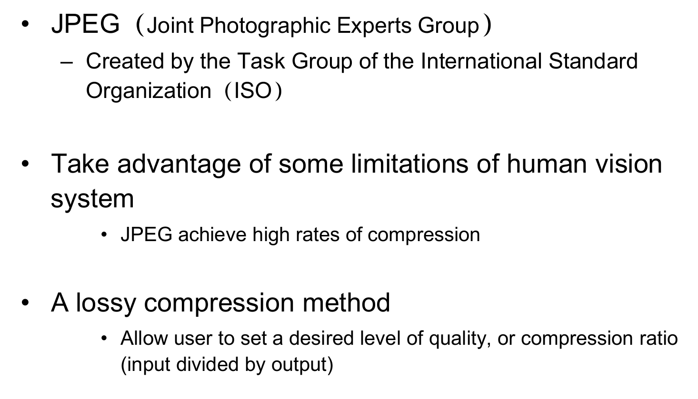
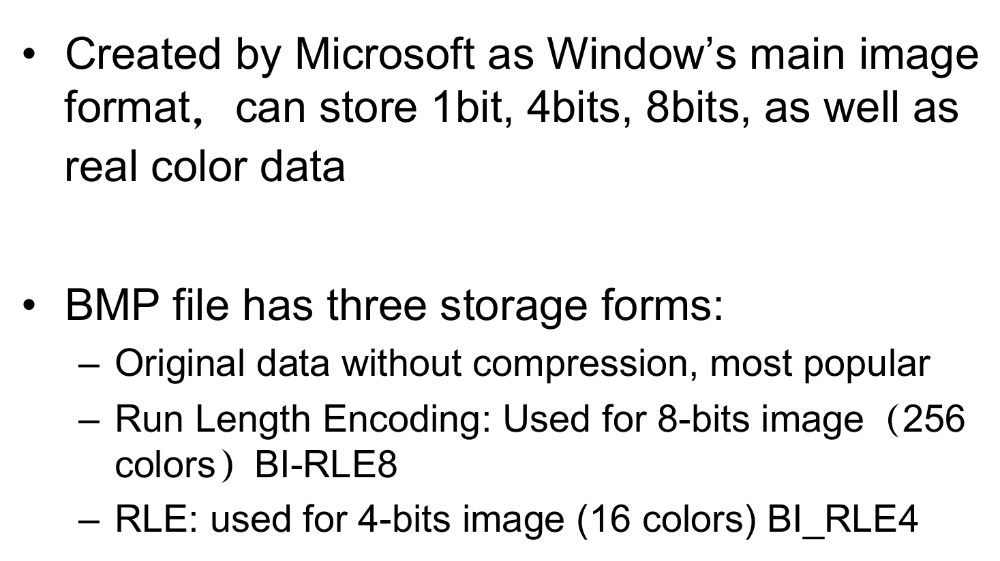

# Popular File Formats

!!! note ""
    [2025-02-21的智云](https://interactivemeta.cmc.zju.edu.cn/#/replay?course_id=70390&sub_id=1518269&tenant_code=112) 56:56，老师说这部分不会考

## GIF

**GIF（Graphics Interchange Format）**——由UNISYS Corporation与Compuserve于1987年联合开发，最初旨在通过电话线传输图形图像。该格式不隶属于任何特定应用程序，现已获得几乎所有相关软件的广泛支持。

GIF 采用**LZW（Lempel-Ziv-Welch）压缩算法**  

- **无损压缩与连续色调支持**  
    LZW算法采用**无损压缩（lossless compression）**，可保留图像原始细节，适用于需精准还原色彩的图形（如插画、图表）。其平均压缩率可达约**50%**，显著减少文件体积。  

- **色彩深度限制**  
    GIF格式基于**8位（256色）调色板模型**，图像色彩深度从**1位（2色）到8位（256色）可调**，通过优化调色板索引实现高效压缩，但无法直接支持摄影级真彩色（24位）。  

- **隔行扫描（Interlacing）**  
    - **渐进式显示（Progressive Display）**  
        GIF支持**隔行存储**，图像分**4次扫描（4 passes）** 加载

    - **快速解码优势**  
     隔行扫描允许解码器优先处理关键行数据，降低内存占用，适配低性能设备（如旧显示器、嵌入式系统）。  

- **GIF89a动画支持**  
    - **多帧动画存储**  
     GIF89a标准允许在单文件中嵌入**多个颜色索引图像（frames）**，通过帧间**时间延迟（delay time）**和**透明色控制**实现动画效果。  

## JPEG

- 有损压缩

## BMP

