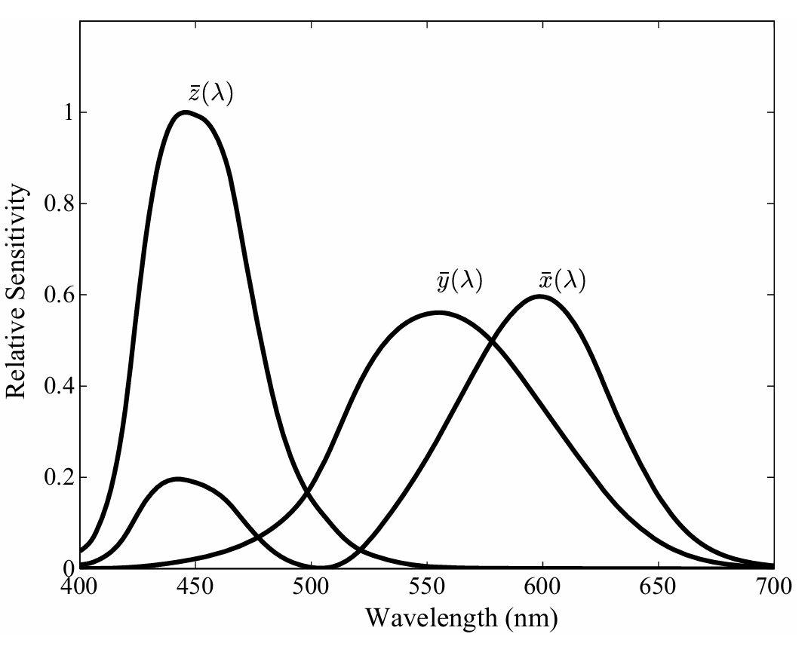
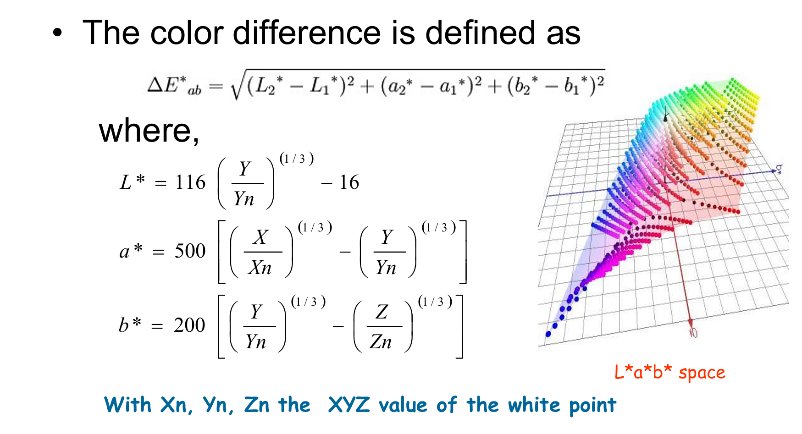

# Color in Image and Video

## Color Science

### Light and Spectra

光是一种电磁波，其颜色由波长决定—— **激光（Laser）** 具有单一波长特性，而多数光源包含多种波长成分。短波对应蓝光（400-500nm），长波对应红光（620-700nm），可见光范围介于400-700纳米（Nanometer，10⁻⁹米）之间。

!!! note ""
    分光光度计（Spectrophotometer）：通过使光线经衍射光栅（Diffraction Grating，一种精密刻线表面）反射以分散不同波长成分，从而测定可见光的仪器。

!!! note ""
    光谱功率分布（Spectral Power Distribution, SPD）——表征各波长区间内相对功率分布的物理量，其中波长以符号λ表示，该曲线被定义为E(λ)函数。

    

!!! note ""
    人类视觉（Human Vision）——采用类相机成像机制，晶状体（Lens）将影像聚焦于视网膜（Retina）。视网膜分布着视杆细胞（Rods）与视锥细胞（Cones）：视杆细胞在低照度环境下启动工作，生成灰度影像；视锥细胞则在强光条件下分别生成色觉信号，三类视锥细胞分别对红光（R）、绿光（G）、蓝光（B）最为敏感。

!!! note ""
    眼睛的光谱灵敏度（Spectral Sensitivity of the Eye）——人眼对可见光谱中段最为敏感，感光细胞灵敏度随波长变化呈现函数关系。光效函数（Luminous-efficiency Function）表征整体灵敏度特征，其中蓝敏细胞（Blue）灵敏度曲线未按比例呈现，其响应值显著低于红（Red）、绿（Green）通道。视杆细胞（Rods）具有宽谱段波长响应特性，主导黑白视觉感知；约600万视锥细胞（Cones）构成彩色视觉系统，其红（R）、绿（G）、蓝（B）细胞密度比例约为40:20:1。

    

人眼光谱灵敏度函数通常不以"R、G、B"标记，此处采用**向量函数**进行表征：  

**向量函数定义**：  
$$ q(\lambda) = \begin{pmatrix} q_R(\lambda) \\ q_G(\lambda) \\ q_B(\lambda) \end{pmatrix} \quad (4.1) $$  

- 视网膜各颜色通道的响应值 **正比于** 激活态神经元数量  
- 通过**光谱功率分布积分**实现色彩感知

**三通道响应方程**：  
$$
\begin{aligned}
R &= \int E(\lambda)\ q_R(\lambda)\ d\lambda \\
G &= \int E(\lambda)\ q_G(\lambda)\ d\lambda \\
B &= \int E(\lambda)\ q_B(\lambda)\ d\lambda
\end{aligned} \quad (4.2)
$$  

| 符号    | 物理意义                   |  
|---------|--------------------------|  
| \( E(\lambda) \) | 光谱功率分布函数（Spectral Power Distribution） |  
| \( q(\lambda) \) | 视锥细胞光谱灵敏度向量函数（Cone Spectral Sensitivity） |  
| \( \lambda \)    | 光波长（单位：纳米，nm）         |  

---

#### 图像形成机制  

物体表面在不同波长处呈现差异化的光反射特性，暗色表面反射能量显著低于浅色表面。如图4.4所示，(1)橙色运动鞋与(2)褪色蓝牛仔裤的表面光谱反射率（Surface Spectral Reflectance）曲线，该反射特性由函数$S(\lambda)$定量描述。


当光源的光谱功率分布（SPD）\( E(\lambda) \) 投射至物体表面时，与表面光谱反射率函数 \( S(\lambda) \) 相互作用，反射光随后被人眼的视锥细胞灵敏度函数 \( q(\lambda) \) 选择性过滤。  

**色彩信号定义**：  
$$ C(\lambda) = E(\lambda) \cdot S(\lambda) $$  
此函数 \( C(\lambda) \) 称为**色彩信号**（Color Signal），由光源 \( E(\lambda) \) 与表面反射率 \( S(\lambda) \) 的乘积构成。  

综合考虑成像模型的方程式可表述为：  
$$
\begin{aligned}
R &= \int E(\lambda)\ S(\lambda)\ q_R(\lambda)\ d\lambda \\
G &= \int E(\lambda)\ S(\lambda)\ q_G(\lambda)\ d\lambda \\
B &= \int E(\lambda)\ S(\lambda)\ q_B(\lambda)\ d\lambda
\end{aligned}
$$  

公式定量揭示色彩感知的物理本质：光-物相互作用 → 生物神经编码 → 三通道色彩信号生成

!!! note ""
    相机系统（Camera System）——相机构建原理与此类似：演播级摄像机在每个像素点（对应视网膜位置）生成三通道信号。模拟信号被转换为数字信号，截断为整数并存储。若采用8位精度，则R、G、B通道最大值为255，最小值为0。

### Gamma Correction

**阴极射线管显示器**（CRT Display）——通过将RGB数字信号逆向转换为模拟电压信号，驱动阴极射线管（CRT, Cathode Ray Tube）内的电子枪工作，我们期望最终其发光强度与驱动电压呈**线性**关联。

实际上光输出正比于电压值的γ次方（数学表达：$R→R^γ$）。该幂律指数称为伽马值​（gamma，符号γ），典型取值约为2.2。所以，为了使显示器输出的光强度与输入信号线性相关，我们需要对输入信号进行伽马校正。


**校正运算**：  
$$R' = R^{1/\gamma} \quad (\gamma \approx 2.2)$$  

**显示端光电转换**：  
$$\text{实际光输出} = (R')^{\gamma} = \left( R^{1/\gamma} \right)^{\gamma} = R $$  


校正后层次感会更强一些

---

!!! note
    相机信号传输函数（Camera Transfer Function）定义为：  
    $$  
    R' = a \times R^{1/\gamma} + b  
    $$  
    式中参数 \( a, b \) 用于优化信号动态范围，特别在低亮度区域（接近零值）需进行特殊校准。  

!!! note

    电影与电视工程师协会（SMPTE）在标准SMPTE-170中规定如下分段函数：  

    ```math  
    V_{\text{out}} = \begin{cases}  
    4.5 \times V_{\text{in}} & \text{若 } V_{\text{in}} < 0.018 \\  
    1.099 \times V_{\text{in}} - 0.099 & \text{若 } V_{\text{in}} \geq 0.018  
    \end{cases}  
    ```  

**理论值与实践偏差**  

- **名义伽马值**：2.2（基于NTSC制式历史沿革）
- **实际系统总伽马值**：约2.8（工程实现中约等于1.25×2.2）  

**伽马校正核心议题**

- **亮度量化映射**：物理光强与数字像素位模式（8位：0-255）的非线性对应关系  
- **视觉感知特性**：人眼对亮度**相对比值**的敏感度显著高于绝对强度值，此特性深刻影响伽马曲线的函数设计

### Color Matching Functions

**颜色匹配曲线（Color-Matching Curves）**——受试者为匹配各单波长光而选定的红、绿、蓝三原色光量比例，经系统化测量后形成的函数曲线称为颜色匹配曲线。此类曲线通常以符号 $\bar{r}(\lambda)$、$\bar{g}(\lambda)$、$\bar{b}(\lambda)$ 表征（实验数据详见下图），其形态直观揭示人眼三色视觉机制对不同波长光的响应权重分布特性。


由于原始颜色匹配曲线存在**负值**响应区，科学家通过数学建模构建了假想三原色系统，其对应色匹配函数全程保持非负特性：



该体系即CIE 1931 XYZ标准色度系统，其全正值特性使色度计算与设备校准具备严格的数学可行性。


#### 人眼亮度感知特性

!!! note ""

    {width=50%}

    图中绿色曲线表征实际物理强度分布，蓝色曲线则对应主观感知强度响应，直观揭示人眼对光强变化的非线性编码机制。

即**韦伯定理（Weber's Law）**：​刺激量的基数越大，引发可感知差异所需的增量变化越显著。也就是说，人眼对光强的感知是对数关系。

这极大地影响了各种色彩空间与压缩算法的设计

### L\*a\*b\* Color Space

国际照明委员会（CIE）基于人眼视觉特性构建的均匀色彩空间，由三个感知维度构成：Luminance（亮度）、Colorfulness（色度）、Hue（色相）。采用1/3指数，而不是对数。



## Color Models in Images

### Subtractive Color: CMY


CMY和RGB的转换：


打印机里使用的是CMYK，K是黑色，因为CMY三原色叠加不是完全黑（可能会有化学反应，不是很稳定）


### Color Models in Video

#### YUV


Y是明暗相关的，U和V是色度相关的

!!! question "为什么要转成YUV？"
    - 方便压缩。对灰度敏感度大于对色度的敏感度，所以可以降低色度的采样率，减少数据量。（对Y小心处理、对UV粗处理）

#### YIQ

Y也是明暗相关的，I和Q是色度相关的


#### YCbCr

