# Fundamental Concepts in Video

## Types of Video Signals

### Component video | 分量视频

RGB分开传送、不同信号间干扰小

- 高端视频系统（如演播室应用）  
    - 三路独立视频信号（Red, Green, Blue图像平面）  
    - 三线直连Camera/信号源设备至TV/Monitor  
- 最佳色彩还原（无通道间Crosstalk）  
    - 需更高Bandwidth与精准Synchronization  
- 除RGB外，支持YIQ/YUV等Luminance-Chrominance模型  
    - 基于RGB的Luminance-Chrominance矩阵变换实现  

### Composite Video | 复合视频

色度与亮度信号、音频数据混合于单一载波  

- 色度信号：I/Q（或U/V）分量  
- 单线传输：存在一定干扰  
- 应用场景：广播电视系统，兼容黑白电视  

### S-Video

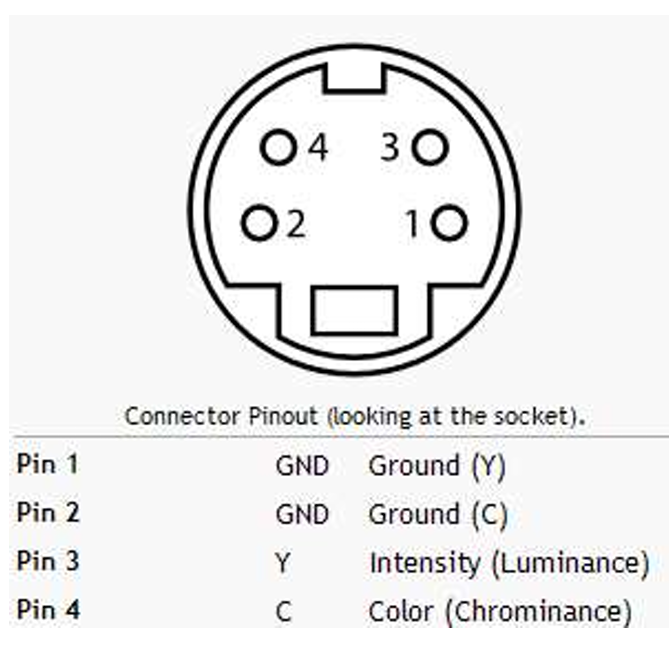{width=50%}

四根电线，两根接地，两根分别传输亮度和色度信号

S-Video：作为一种折中方案（分离视频或Super Video，如S-VHS），使用双线传输，一条用于亮度信号，另一条用于复合色度信号。 这样子颜色信息与关键的灰度信息之间的串扰减少。  

将亮度信号独立传输的原因在于，黑白信息对视觉感知最为关键。事实上，人类对灰度图像的空间分辨率的分辨能力远高于彩色图像的色彩部分。  

因此，我们可以传输精度较低的色彩信息，而必须传输高精度的亮度信息——我们只能感知较大的色块，因此减少色彩细节的传输是合理的。

## Analog Video

时序的模拟信号，连续不断的信号

### Related Concepts

模拟信号相当于是时变的图像函数

#### 逐行扫描 | Progressive Scanning

“逐行”扫描("progressive" scanning)在每一时间间隔内逐行完整地扫描整个画面（一帧）。

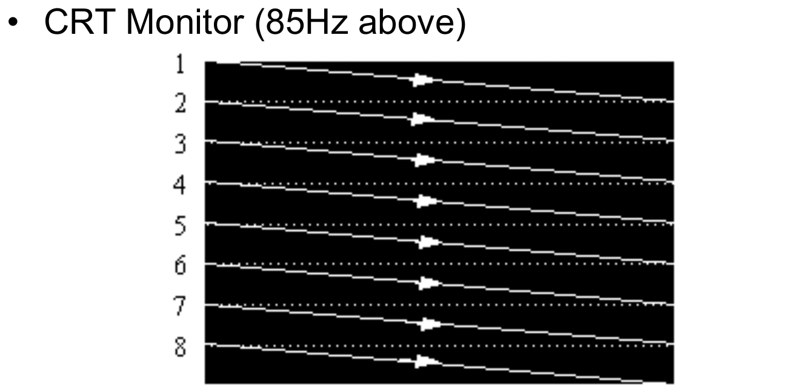

#### 隔行扫描 | Interlaced Scanning

在电视系统及部分显示设备与多媒体标准中，采用了一种称为隔行扫描（Interlaced Scanning）的技术：  

- 先扫描奇数行，再扫描偶数行，由此生成奇数场（Odd Field）与偶数场（Even Field）——两场合为一帧（Frame）。  
- 实际上，奇数场扫描结束于行中位置，而偶数场扫描则始于半行处，形成无缝衔接。

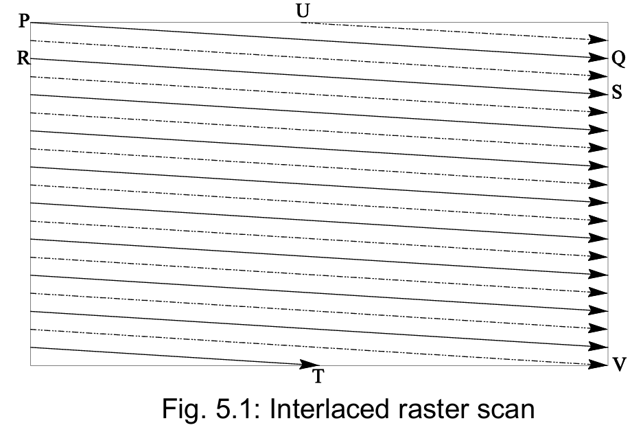

!!! note ""
    图5.1展示了所使用的扫描方案。首先扫描实线（奇数行），从P到Q，然后从R到S，依此类推，结束于T；接着偶数场从U开始，结束于V。  

    在图5.1中，从Q到R等跳跃称为水平回扫（Horizontal Retrace），在此期间CRT中的电子束被消隐。从T到U或V到P的跳跃称为垂直回扫（Vertical Retrace）。

!!! note "TV和Computer monitor采用的扫描方式不同"
    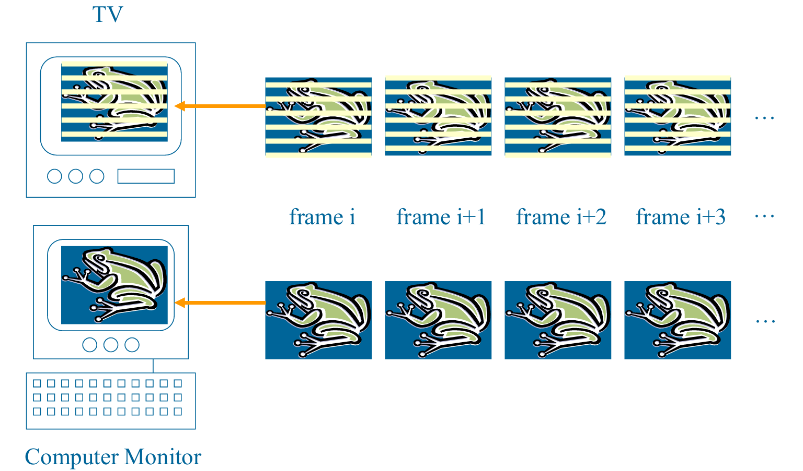

由于隔行扫描，奇数行与偶数行在时间上存在位移——通常不易察觉，除非屏幕上出现快速动作时，可能产生模糊现象。

模拟视频使用一个略高于零的电压偏移表示“黑色”，并用另一个值（如零）表示一行的起始。例如，可以使用“比黑更黑”的零信号来表示一行的开始。

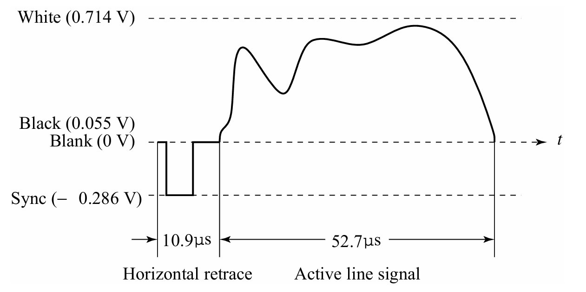

#### 模拟电视标准  

- **NTSC视频**（正交平衡调幅）  
    - 美国、加拿大、日本和韩国  
    - 1953年由美国制定  
- **PAL视频**（逐行倒相正交平衡调幅）  
    - 德国、英国和中国  
    - 1962年由德国制定  
- **SECAM视频**（顺序传送彩色与存储）  
    - 法国、俄罗斯  
    - 1966年由法国制定  

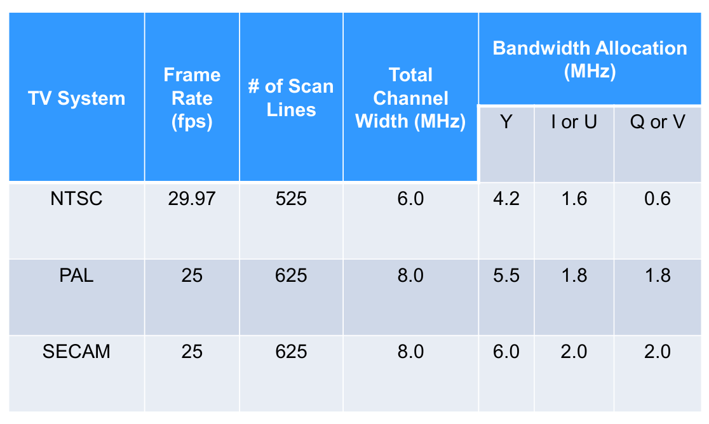

**向下兼容黑白电视系统**  

- 参数一致性：扫描方式、扫描行频、场频、帧频、图像载频、音频载频  
- 信号传输一致性：亮度信号、两个色度信号

### NTSC视频

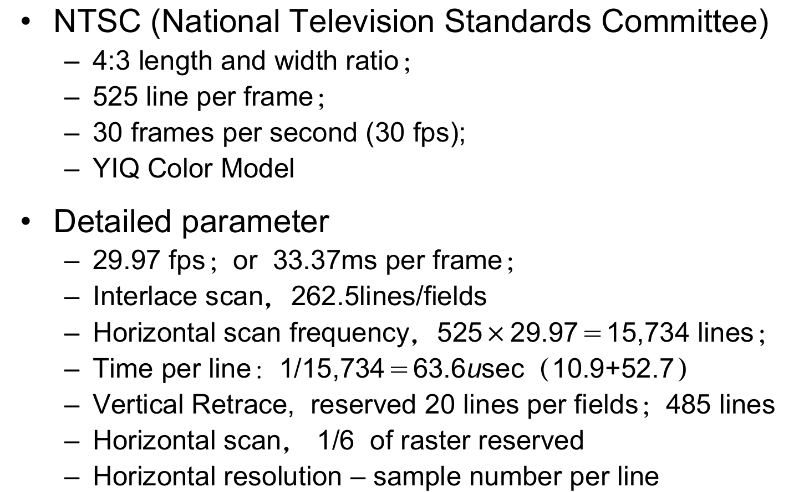

!!! note ""
    NTSC视频制式的帧率为30帧/秒，每帧525行，其中480行为可见行，剩余45行为垂直消隐信号。

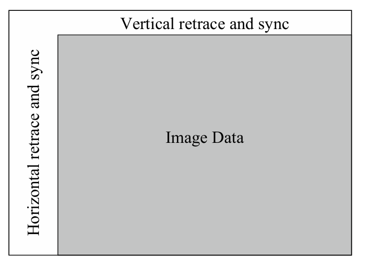{width=50%}

不同制式格式下也会有不同的帧率和行数

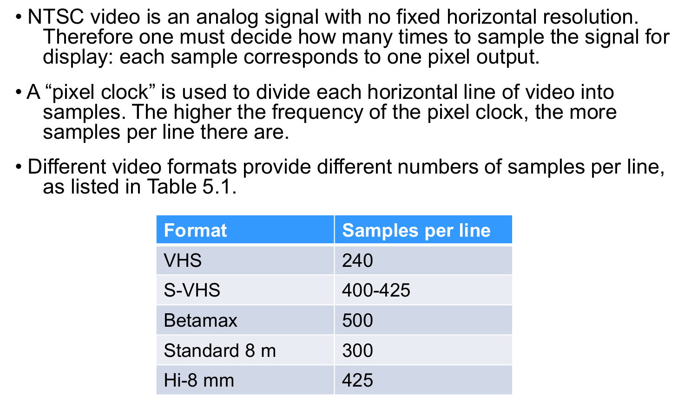

#### Color Model and Modulation of NTSC

1. **颜色模型**：  
   NTSC采用YIQ颜色模型，其中：
   - Y表示亮度信号（Luminance），包含图像的灰度信息。
   - I（In-phase）和Q（Quadrature）表示色度信号（Chroma），分别携带颜色信息。

2. **调制技术**：  
   NTSC使用正交调制技术将I和Q信号组合成一个单一的色度信号C，公式为：  
   \[
   C = I \cos(F_{sc}t) + Q \sin(F_{sc}t)
   \]  
   其中，\(F_{sc}\)为色副载波频率，约为3.58 MHz。

3. **色度信号特性**：  
   - 色度信号的幅度为 \(\sqrt{I^2 + Q^2}\)，表示颜色的强度。  
   - 色度信号的相位为 \(\tan^{-1}(Q/I)\)，表示颜色的色调。

4. **复合信号**：  
   NTSC复合信号由亮度信号Y和色度信号C组合而成，公式为：  
   \[
   \text{composite} = Y + C = Y + I \cos(F_{sc}t) + Q \sin(F_{sc}t)
   \]  
   这种复合信号将亮度和色度信息整合在一起，便于传输和显示。

!!! note "复合信号不可避免地产生干扰"

    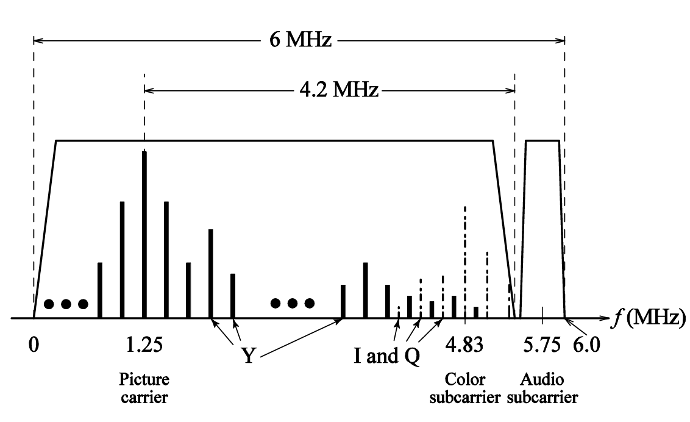{width=50%}

#### 如何解调NTSC信号

根据图片中的核心内容，以下是复合信号解码的步骤及解题思路：

1. **提取亮度信号（Y）**  
   - 公式：  
     \[
     Y + I \cos(F_{sc}t) + Q \sin(F_{sc}t)
     \]
   - 使用低通滤波器从复合信号中提取Y信号。  

2. **解调色度信号（C）以提取I和Q**  
   - **步骤1**：将色度信号C乘以 \(2 \cos(F_{sc}t)\)，公式为：  
     \[
     C \cdot 2 \cos(F_{sc}t) = I + I \cdot \cos(2F_{sc}t) + Q \cdot 2 \sin(2F_{sc}t)
     \]  
   - **步骤2**：应用低通滤波器提取I信号，滤除高频分量。

### PAL视频

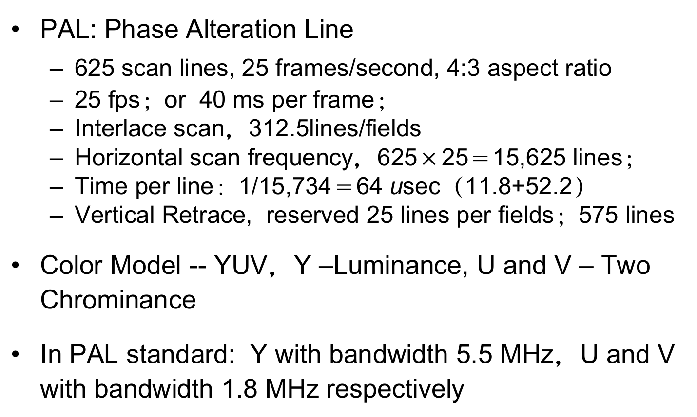

### SECAM Video

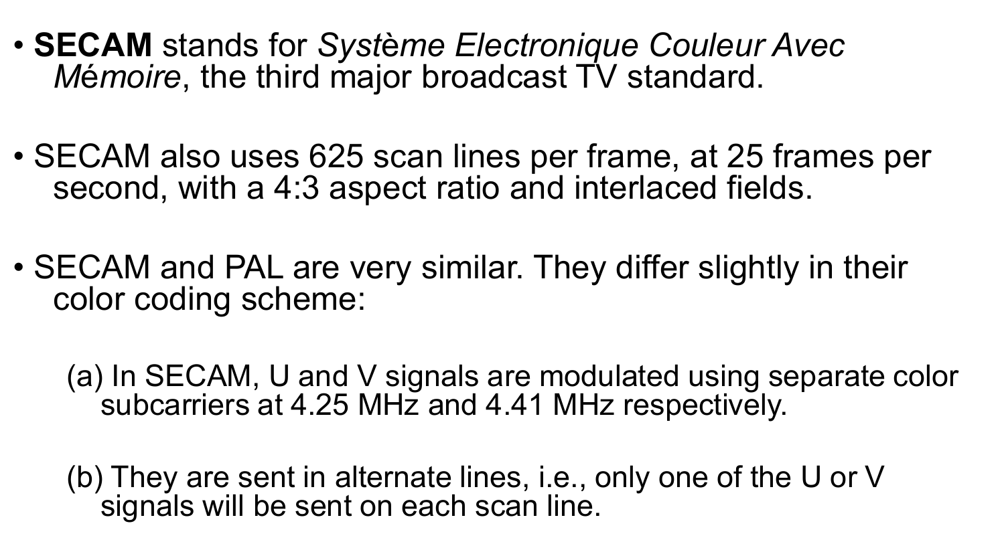

U和V分别进行调制。

## Digital Video

### Advantages of digital representation

- 在数字设备或内存中存储视频  
- 可随时处理并集成到各种多媒体应用中  
- 支持直接访问——非线性视频编辑  （可以拖进度条）
- 重复录制不会导致图像质量下降  
- 易于加密，且对信道噪声有更好的容忍度

### Chroma subsampling

还是那句话：对颜色的分辨率低于黑白，这导致了不同采样方案  

- 每四个原始像素中，实际发送多少像素值？  
    - 4:4:4 表示无子采样  
    - 4:2:2 表示Cb和Cr在水平方向上以因子2进行子采样  
    - 4:1:1 表示Cb和Cr在水平方向上以因子4进行子采样  
    - 4:2:0 表示Cb和Cr分别在水平和垂直方向上以因子2进行子采样  
- 4:2:0 方案通常用于JPEG和MPEG

!!! note ""
    - J\:a\:b的形式描述：
        - J：水平抽样参照（概念上区域的宽度）。通常为4。
        - a：在J个像素第一行中的色度抽样数目 (Cr, Cb)。
        - b：在J个像素第二行中的额外色度抽样数目 (Cr, Cb)。
    - 4:2:2采样：相邻的两个像素共享一个色度样本
    - 4:1:1采样：每四个像素共享一个色度样本
    - 4:2:0采样：每四个像素共享一个色度样本，且每两行共享一个色度样本
    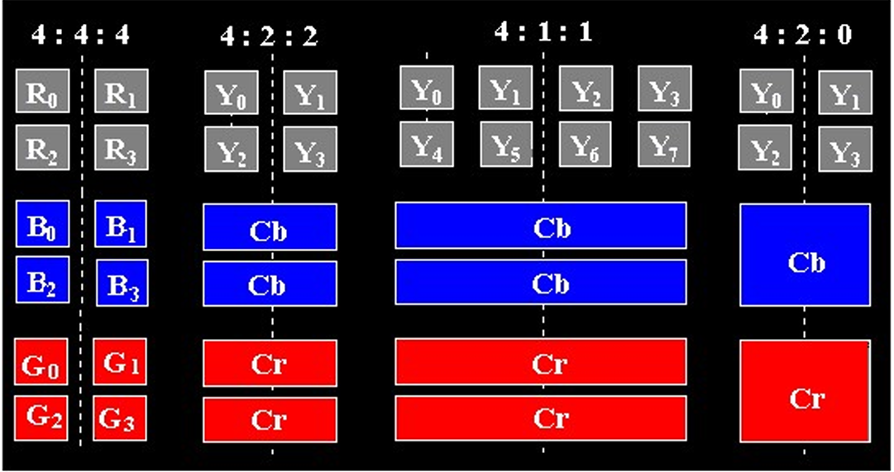

### Digital video CCIR standard

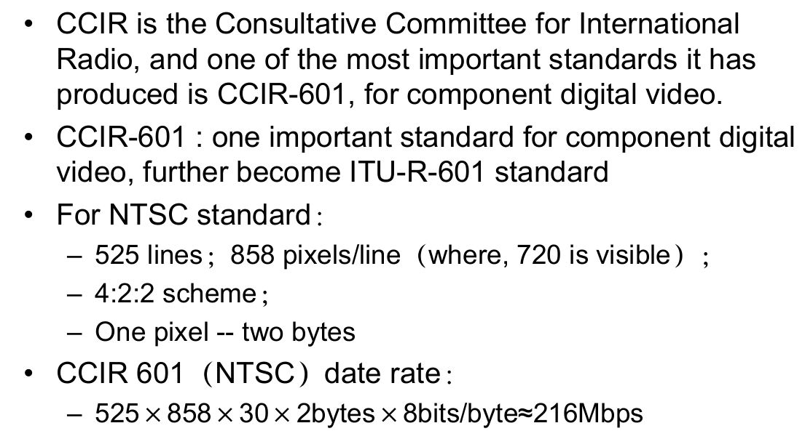

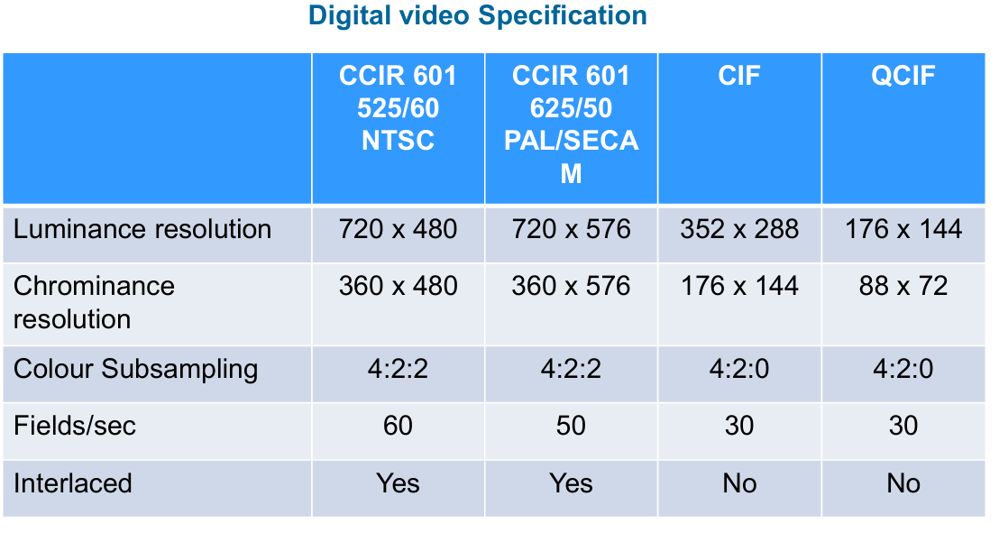

### CIF standard

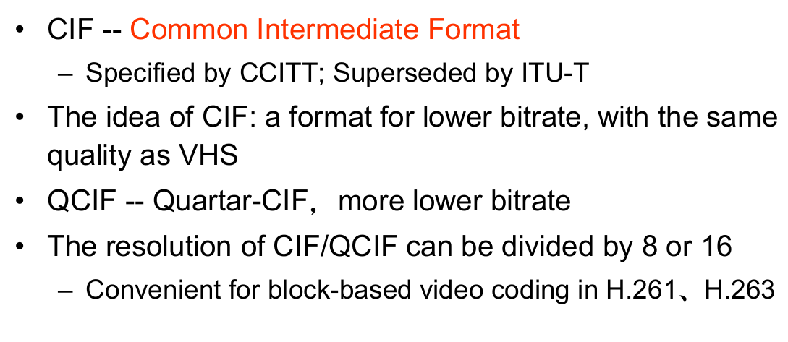

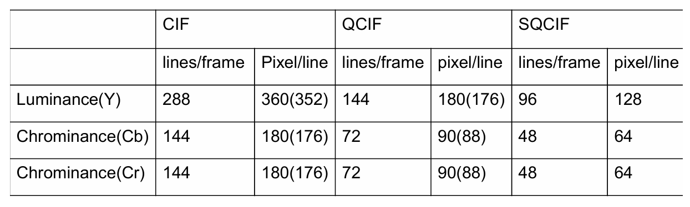

### HDTV (High Definition TV)

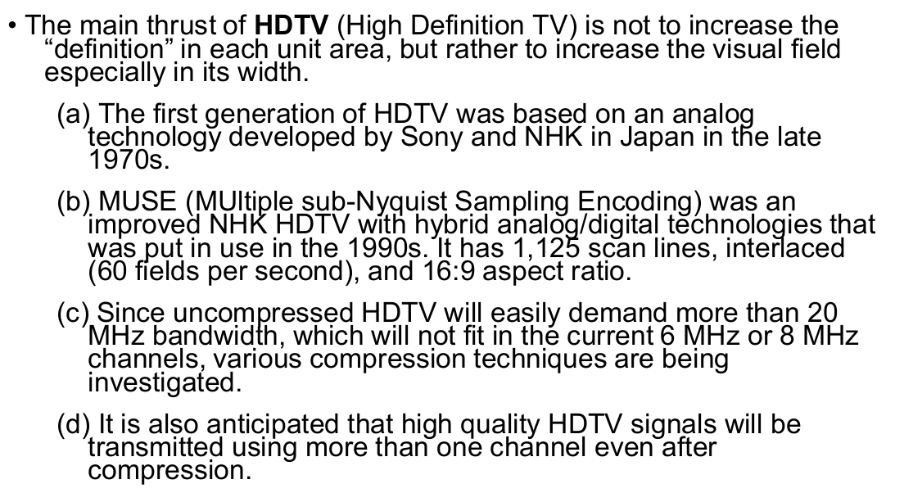

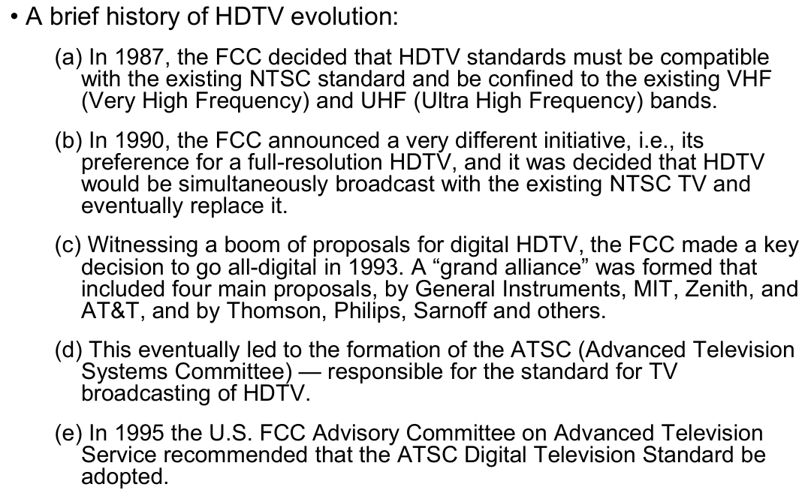

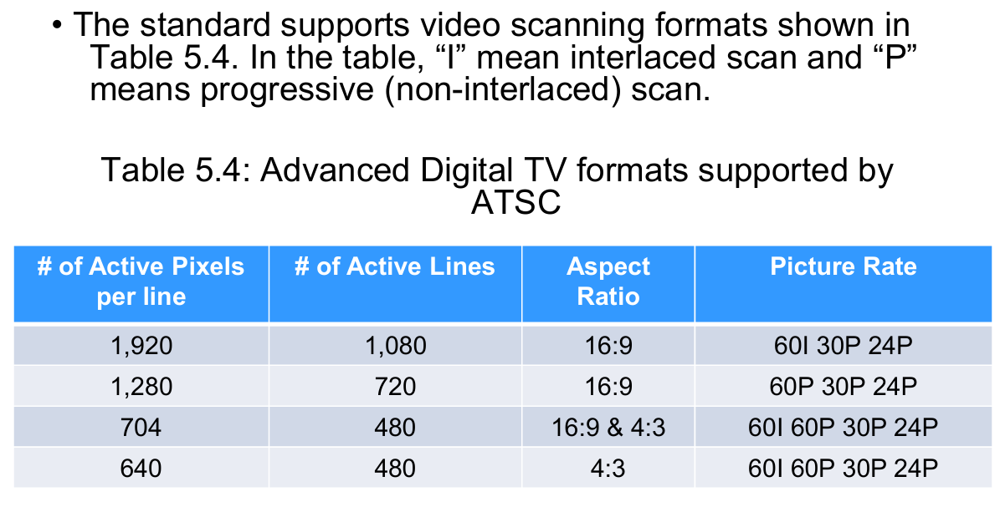

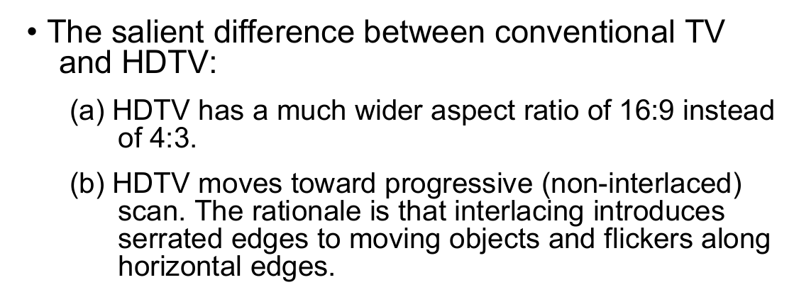

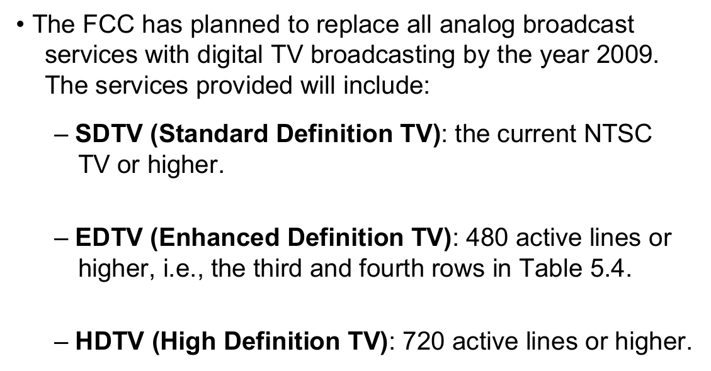