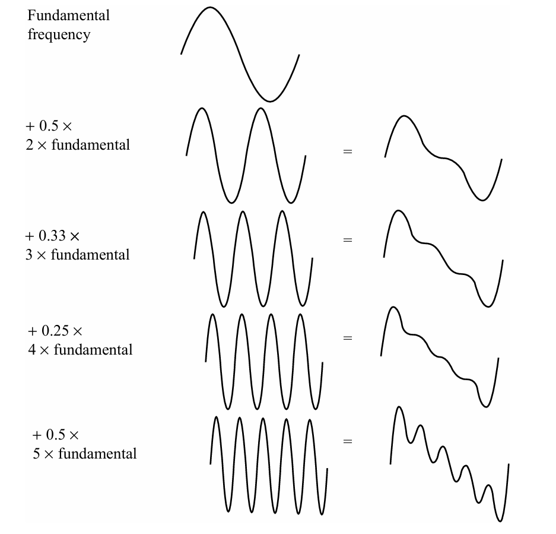
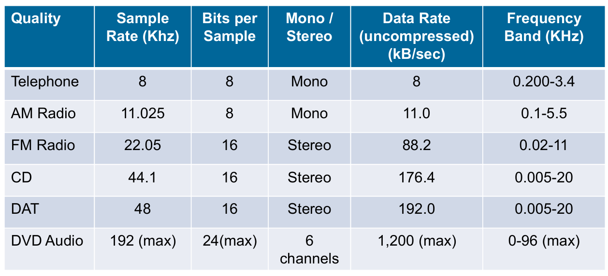
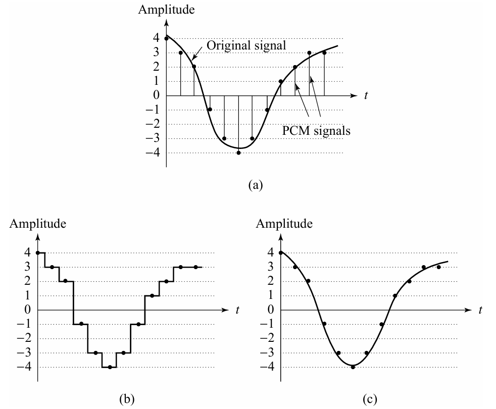
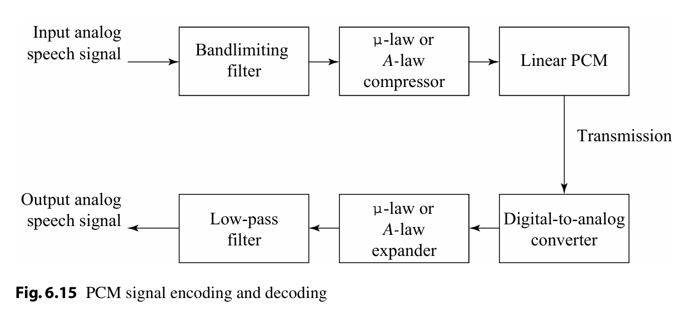
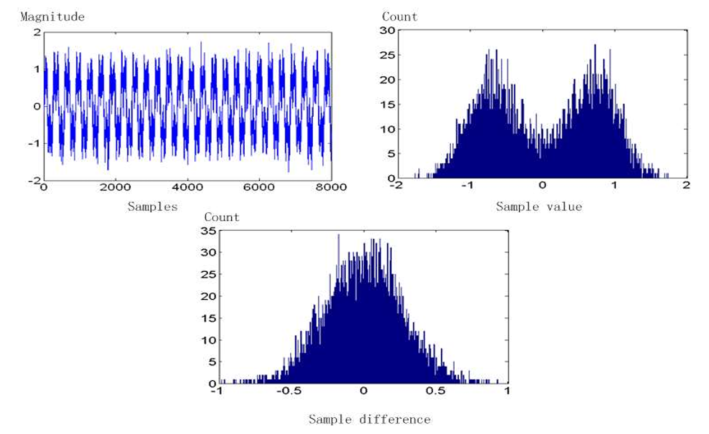
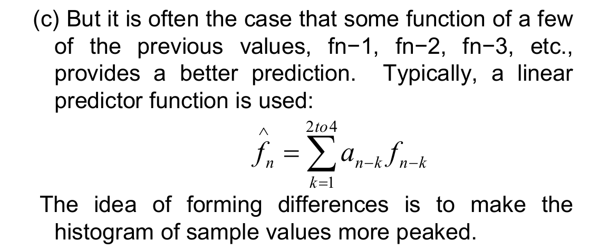
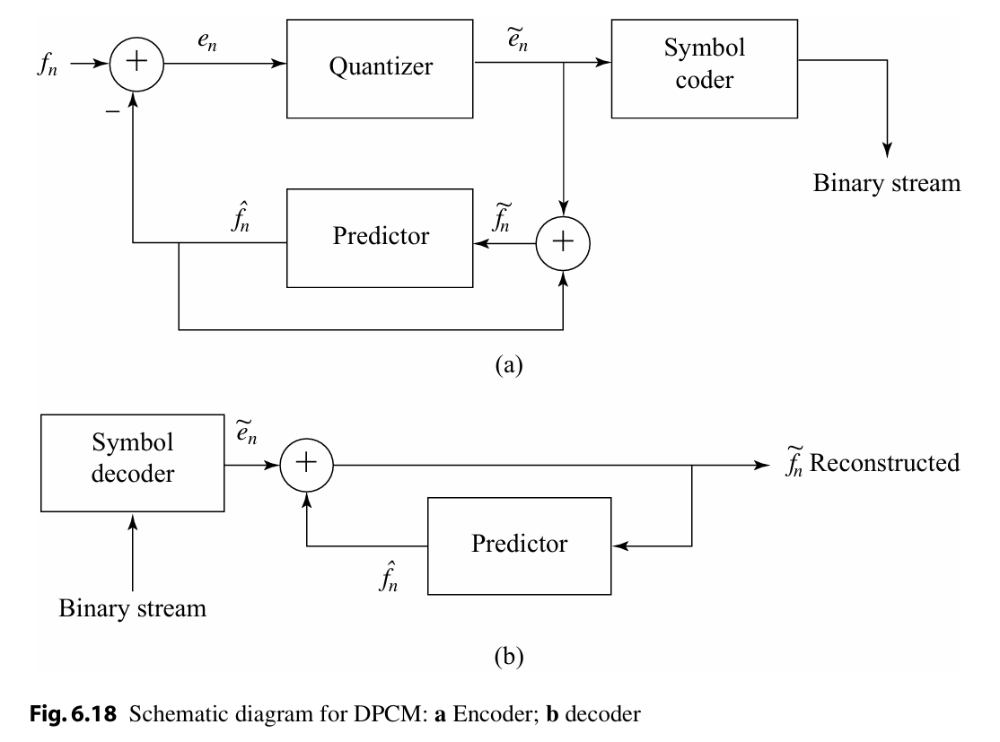

# Basics of Digital Audio

## Digitization of Sound

### What Is Sound

声音是一种压力波，其值为连续变化

### Digitization

- **振幅**：连续值并随时间变化——需要在时间和振幅两个维度上进行采样  
- **时间维度**：在等间隔时间点上采样  
    - 典型范围：8kHz 到 48kHz  
    - 人类可听频率范围：20Hz 到 20kHz  
- **量化**：在振幅维度上进行采样  
    - **均匀量化**：等间隔采样  
    - **非均匀量化**：如 μ-law 规则  
    - 典型均匀量化率：  
        - 8-bit：256 个量化级别  
        - 16-bit：65,536 个量化级别

!!! note "To decide how to digitize audio data we need to answer the following questions"

    1. What is the sampling rate?
    2. How finely is the data to be quantized, and is quantization uniform?
    1. How is audio data formatted? (file format)

### Nyquist Theorem

任何一个复杂的信号可以分解为一系列正弦波。

**奈奎斯特率（Nyquist Rate）**  

- 为了正确采样，采样率必须至少为信号中最高频率的两倍。  

**奈奎斯特定理（Nyquist Theorem）**  

- 对于一个频带受限的信号，其频率下限为 \(f_1\)，上限为 \(f_2\)，采样率必须至少为 \(2(f_2 - f_1)\)。  

**奈奎斯特频率（Nyquist Frequency）**  

- 奈奎斯特频率为奈奎斯特率的一半。  
- 由于无法恢复高于奈奎斯特频率的信号，大多数系统会使用抗混叠滤波器，将输入信号的频率限制在奈奎斯特频率或以下范围内。

!!! note ""
    数字信号采样的频率是10000Hz，那能还原的最高的就是5000Hz的信号。

### Signal-to-Noise Ratio (SNR)

- **概念**：SNR 是正确信号功率与噪声功率的比值，用于衡量信号的质量。  
- **意义**：SNR 越高，信号质量越好；SNR 越低，信号受噪声影响越严重。

- **单位**：SNR 通常以分贝（dB）为单位测量。  
- **分贝的定义**：1 dB 等于贝尔（Bel）的十分之一。

---

SNR 的值以 dB 为单位，定义为信号电压平方与噪声电压平方之比的对数的 10 倍，公式如下：  
\[
SNR = 10 \log_{10} \frac{V_{\text{signal}}^2}{V_{\text{noise}}^2} = 20 \log_{10} \frac{V_{\text{signal}}}{V_{\text{noise}}}
\]  
其中：  

- \(V_{\text{signal}}\)：信号的电压值。  
- \(V_{\text{noise}}\)：噪声的电压值。

---

假设信号电压 \(V_{\text{signal}} = 10 \, \text{V}\)，噪声电压 \(V_{\text{noise}} = 1 \, \text{V}\)，则 SNR 的计算如下：  
\[
SNR = 20 \log_{10} \frac{10}{1} = 20 \log_{10} 10 = 20 \times 1 = 20 \, \text{dB}
\]

---

**信号功率与电压的关系**：信号功率与电压的平方成正比。例如，如果信号电压 \(V_{\text{signal}}\) 是噪声电压的 10 倍，则 SNR 为：  
  \[
  SNR = 20 \log_{10} (10) = 20 \, \text{dB}
  \]  

**功率比与分贝的关系**：如果十把小提琴的功率是一把小提琴的 10 倍，则功率比为 10 dB 或 1 B（贝尔）。  

- **关键点**：  
    - **功率**：10 倍对应 10 dB。  
    - **信号电压**：10 倍对应 20 dB。

### SQNR

!!! note ""
    说不会考

### Linear and Nonlinear Quantization

横轴时间一般是均匀量化的，纵轴振幅可以是非均匀量化的。**考虑到有限的可用位数和人类感知特性**：非均匀量化更多地关注人类听觉最敏感的频率范围。非均匀量化方案利用人类感知特性，采用对数形式进行量化。

### Audio Filtering

在采样和模数转换之前，通过滤波去除音频信号中的不需要频率。  

- 保留的频率取决于应用：  
    - 语音信号：50Hz 到 10kHz；  
    - 音频音乐信号：20Hz 到 20kHz。  
- 其他频率被带通滤波器（也称为限带滤波器）阻挡。

### Audio Quality versus Data Rate

- **未压缩数据率**：随着量化位数的增加而增加。  
- **音频质量**：取决于数据率和带宽。  
  - **模拟设备**：带宽以频率单位（赫兹，Hz）表示。  
  - **数字设备**：带宽以每秒比特数（bps）表示。

### Synthetic Sounds

- **合成声音**：通过合成器生成的声音。

## Music Instrument Digital Interface

### MIDI

存的是脚本，不是音频。

## Quantization and Transmission of Audio

### Coding of Audio

降低时序的冗余性是编码的关键

### Pulse Code Modulation | 脉冲编码调制

量化到一个固定的级别，然后编码为二进制。

!!! note ""

    1. 量化区间边界集合称为**判决边界（decision boundaries）**，代表值称为**重建电平（reconstruction levels）**  
    2. 将所有映射到同一输出电平的量化器输入区间边界集合，构成**编码器映射（coder mapping）**  
    3. 量化器的输出值（即代表值）构成**解码器映射（decoder mapping）**  
    4. 最终可通过**数据压缩**技术优化比特分配——为出现频率最高的信号值分配更少的比特（详见第7章）  

!!! note ""

    每种压缩方案均包含三个阶段：  
    1. 数据转换  
        输入数据被**转换到一种新的数据表示形式**，这种形式更易于压缩或具有更高的压缩效率  

    2. 量化（有损压缩核心阶段）
        在此阶段**引入信息损失**——通过使用**有限数量的重建电平**（远少于原始信号的可能取值）实现数据精简  

    3. 编码  
        为每个输出电平或符号**分配码字**（形成二进制比特流），可采用：  
        - **定长编码**（固定码长）  
        - **变长编码**（如霍夫曼编码，详见第7章）  

### Differential coding of audio

分布很散，有两个峰值。为了把信源的分布变得更集中，可以使用差分编码。

我们只记录每个样本与前一个样本的差值。得到的结果就是图中最下面的那个。

### Lossless Predictive Coding

!!! note ""

    实际上也就是差分编码。

设输入信号为离散序列 \( f_n \)，预测器采用**前值预测法**：  
\[
\hat{f}_n = f_{n-1}  
\]  
（注：预测值 \(\hat{f}_n\) 为前一个样本值 \(f_{n-1}\)）

实际信号 \(f_n\) 与预测值 \(\hat{f}_n\) 的差值为误差信号 \(e_n\)：  
\[
e_n = f_n - \hat{f}_n = f_n - f_{n-1}  
\]  

同时，可以修改预测函数，使其更加复杂，如：

### DPCM

差分脉冲编码调制（DPCM）是一种有损压缩技术，实际上是差分编码加上量化。

