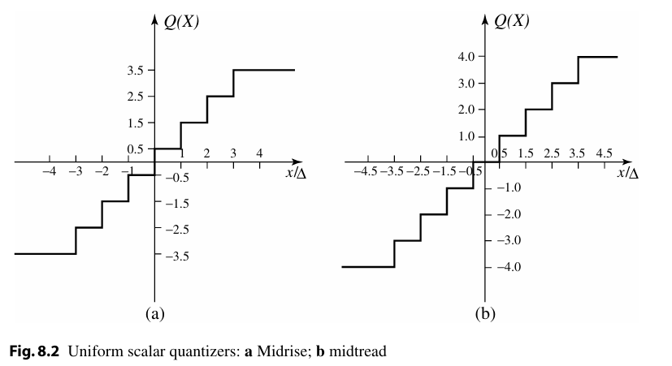
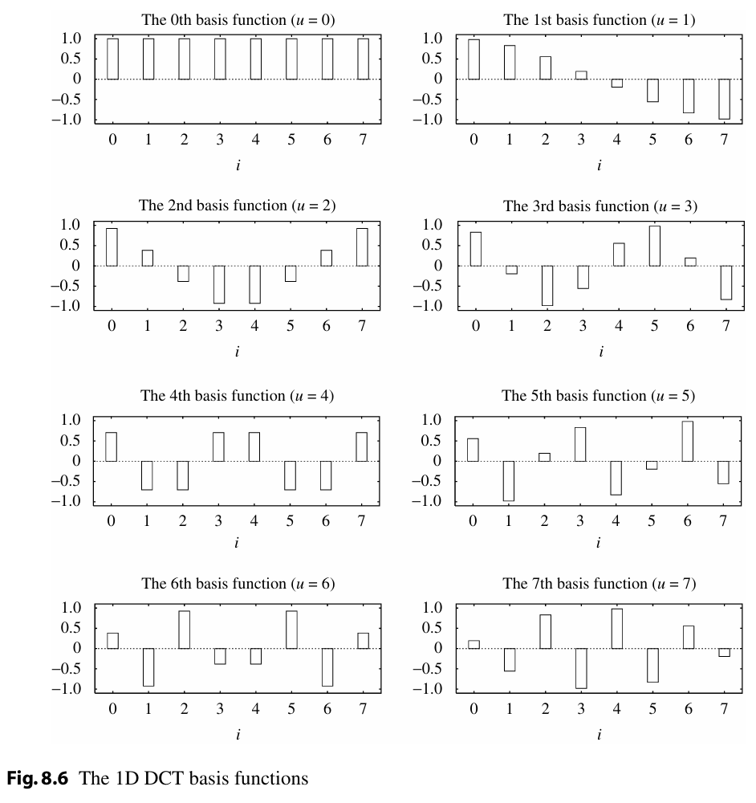
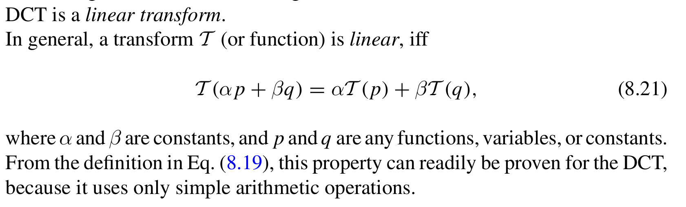

# Lossy Compression Algorithms

## Distortion Measures

用于衡量近似结果与原始数据之间的接近程度。通常人们会想到数值上的差异，但在处理图像数据时，简单的数值差异可能无法反映预期的效果。因此，需要采用感知失真度量，即从人类感知的角度来衡量失真程度，以更准确地评估图像质量或差异。

### 均方误差（MSE, Mean Square Error）

- **定义**：MSE 是原始信号与近似信号之间像素差异的平均值，用于衡量整体失真程度。
- **公式**：
  \[
  \sigma^2 = \frac{1}{N} \sum_{n=1}^{N} (x_n - y_n)^2
  \]
  其中：
    - \(x_n\)：原始信号的第 \(n\) 个像素值。
    - \(y_n\)：近似信号的第 \(n\) 个像素值。
    - \(N\)：总像素数。
- **含义**：MSE 越小，表示失真越小，图像质量越高。

---

### 信噪比（SNR, Signal-to-Noise Ratio）

- **定义**：SNR 是信号与噪声的比值，用于衡量信号相对于噪声的强度。
- **公式**：
  \[
  \text{SNR} = 10 \log_{10} \frac{\sigma_x^2}{\sigma_d^2}
  \]
  其中：
    - \(\sigma_x^2\)：原始信号的方差（表示信号的强度）。
    - \(\sigma_d^2\)：误差的方差（表示噪声的强度）。
- **含义**：SNR 越大，表示信号相对于噪声的强度越高，失真越小。

---

### 峰值信噪比（PSNR, Peak Signal-to-Noise Ratio）

- **定义**：PSNR 是信号峰值与噪声的比值，用于衡量失真相对于信号峰值的大小。
- **公式**：
  \[
  \text{PSNR} = 10 \log_{10} \frac{x_{\text{peak}}^2}{\sigma_d^2}
  \]
  其中：
    - \(x_{\text{peak}}\)：信号的最大可能值（例如，对于 8 位图像，\(x_{\text{peak}} = 255\)）。
    - \(\sigma_d^2\)：误差的方差（表示噪声的强度）。
- **含义**：PSNR 越大，表示失真相对于信号峰值越小，图像质量越高。

## The Rate-Distortion Theory

有损压缩始终涉及速率与失真之间的权衡：

- **速率**：表示每个源符号所需的平均比特数；
- **R(D)**：即速率-失真函数。

- **R(D)** 定义了在失真不超过 D 的情况下，源数据能够被编码的最低速率；
- 当 **D=0** 时，即无失真情况下，R(D) 等于源数据的熵；
- R(D) 描述了编码算法性能的基本限制；
- 可用于评估不同算法的性能表现。

1. **当 D=0 时，源数据的熵等于 R(D)**  
   - **D=0** 表示无失真压缩，此时 **R(D)** 等于源数据的熵。这是因为在无失真情况下，压缩的最低速率由源数据的信息量（即熵）决定。

2. **R(D)=0，表示没有编码**  
   - 当 **R(D)=0** 时，意味着没有对源数据进行编码。这种情况通常发生在失真非常大（即允许的失真无限大）时，不需要传输任何信息。

3. **对于给定源，找到率失真函数的闭式解析描述非常困难**  
   - 率失真函数 **R(D)** 描述了在失真上限为 **D** 时，源数据可以被编码的最低速率。然而，对于大多数实际源数据，很难找到一个闭式（即数学上精确的）解析表达式来描述 **R(D)**。这通常需要复杂的数学分析和近似方法。

## Quantization

1. **量化的核心地位**  
   - 量化是任何有损压缩方案的核心组成部分。  
   - 如果没有量化，几乎不会丢失信息，因为量化是减少数据精度的主要手段。  

2. **量化的作用**  
   - 通过量化，减少数据中不同值的数量，从而降低数据量。  
   - 量化是 **有损压缩** 中“损失”的主要来源，因为它通过舍弃部分信息来实现压缩。  

每个量化器都有其独特的输入范围划分和输出值集合。根据输入和输出的维度，量化器可以分为以下两类：

1. **标量量化器（Scalar Quantizer）**  
   - 对单个输入值进行量化。  
   - 根据量化间隔的均匀性，可分为：  
       - **均匀量化（Uniform Quantizer）**：量化间隔相等，适用于输入值分布均匀的情况。  
       - **非均匀量化（Nonuniform Quantizer）**：量化间隔不等，适用于输入值分布不均匀的情况。  

2. **矢量量化器（Vector Quantizer）**  
   - 对一组输入值（即矢量）进行联合量化。  
   - 通过将多个输入值作为一个整体处理，能够更好地捕捉数据之间的相关性，从而提高压缩效率。  

### **均匀标量量化器的定义**

1. **输入域的划分**  
   - 将输入域划分为 **等间距** 的区间。  
   - **决策边界（Decision Boundaries）**：每个区间的端点，用于决定输入值属于哪个区间。  

2. **输出值**  
   - 每个区间的 **中点** 作为该区间的输出值。  

3. **步长（Step Size）**  
   - 每个区间的长度，即步长，决定了量化的精度。  

---

### **均匀标量量化器的两种类型**

1. **Midrise 量化器**  
   - 具有 **偶数个** 输出级别。  
   - 其中一个区间围绕 **零** 值（即零值位于一个区间的中间）。  
   - 零值 **不是** 输出值之一。  

2. **Midtread 量化器**  
   - 具有 **奇数个** 输出级别。  
   - **零值** 是其中一个输出值。  

---

### **成功的均匀量化器的目标**

- 在给定输入源和期望输出值数量的情况下，**最小化失真**。  
- 失真通常通过量化误差（即输入值与输出值之间的差异）来衡量。  

## Transform Coding

---

1. **矢量编码比标量编码更高效**  
   - 将输入数据中的连续样本分组为矢量进行编码，可以更有效地利用数据之间的相关性，从而提高压缩效率。  

2. **矢量 X 的定义**  
   - 设 **X = {x₁, x₂, ..., xₖ}** 为样本矢量，其中相邻样本之间通常存在一定的相关性。  

---

1. **线性变换 T 的定义**  
   - 设 **Y** 是输入矢量 **X** 经过线性变换 **T** 后的结果，即 **Y = T(X)**。  
   - 变换后的 **Y** 的分量之间的相关性大大降低。  

2. **编码效率的提升**  
   - 由于 **Y** 的分量之间相关性减少，**Y** 可以比 **X** 更高效地编码。  

3. **变换本身不压缩数据**  
   - 变换 **T** 本身并不会压缩数据，压缩是通过对 **Y** 的分量进行处理和量化实现的。  

---

1. **DCT 的广泛应用**  
   - DCT 是一种广泛使用的线性变换，能够有效去除输入信号的相关性。  

2. **DCT 的作用**  
   - DCT 将输入信号转换为频域表示，使得信号的能量集中在少数低频分量中，从而为后续的量化与编码提供更高效的基础。  

### DCT | Discrete Cosine Transform

长度为 8 的一维 DCT 变换公式如下：

> 变换后只跟第一个坐标轴有关系，减少了分量之间的相关性。

例子：

就是坐标轴上的投影。

同时，DCT 变换是线性的。

原始信号就是基信号加权结果。

#### 2D DCT

在JPEG中，使用的是8x8的DCT变换。

二维的DCT变换，就是对每一行进行一维的DCT变换，然后对每一列进行一维的DCT变换。

### DFT | Discrete Fourier Transform

离散余弦变换（DCT）是仅保留离散傅里叶变换（DFT）实部运算的变换形式。

DCT通过构造对称信号消除DFT虚部的关键技术在于：对原始8点采样信号进行镜像对称复制，构造16点扩展序列。如图8.10所示，DCT运算本质上等效于对对称扩展信号实施DFT后保留实部运算。

## Wavelet-Based Coding

DFT和DCT在频域上有高分辨率，但是在时域上分辨率缺失。而小波变换在时域和频域上都有高分辨率。

对于$\{x_{n,i}\}=\{10,13,25,26,29,21,7,15\}$，进行小波变换后得到

对二维图像进行小波变换，就是对每一行进行小波变换，然后对每一列进行小波变换。

人眼对于低频部分的敏感度更高，所以可以通过小波变换，将高频部分进行压缩（就是对左上角的部分进行压缩）。