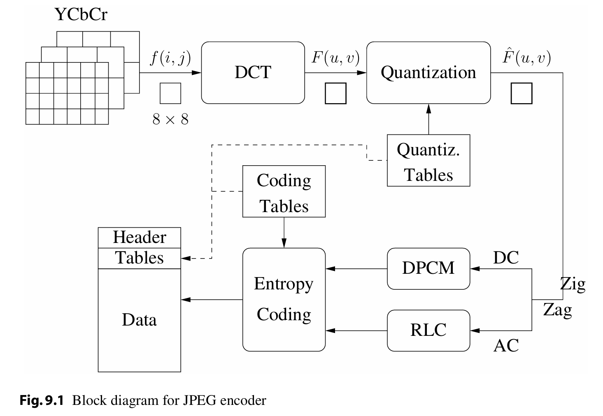
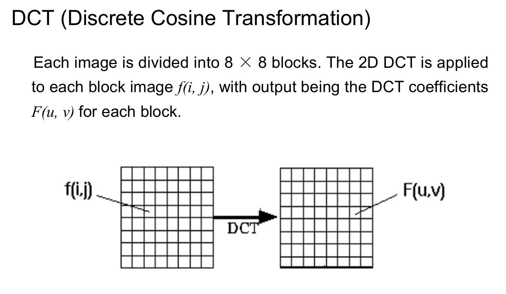
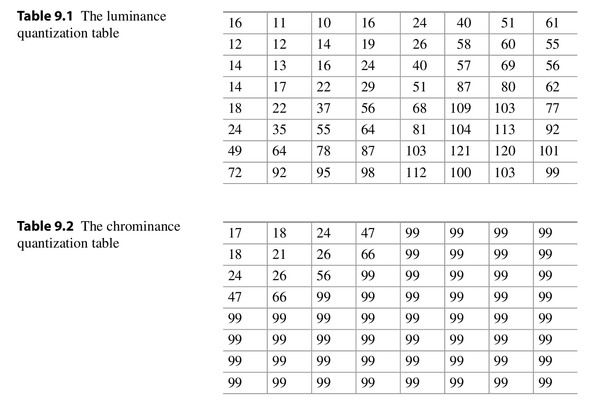
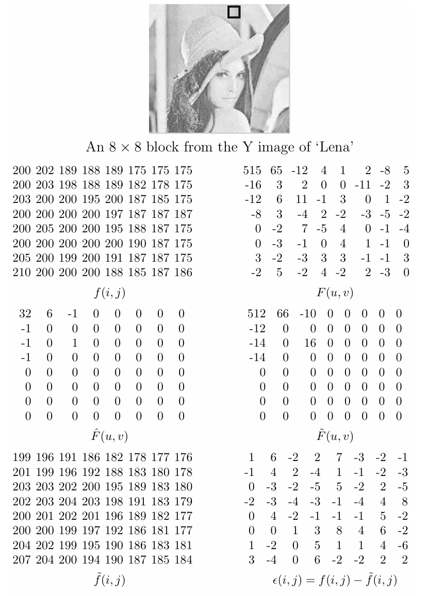
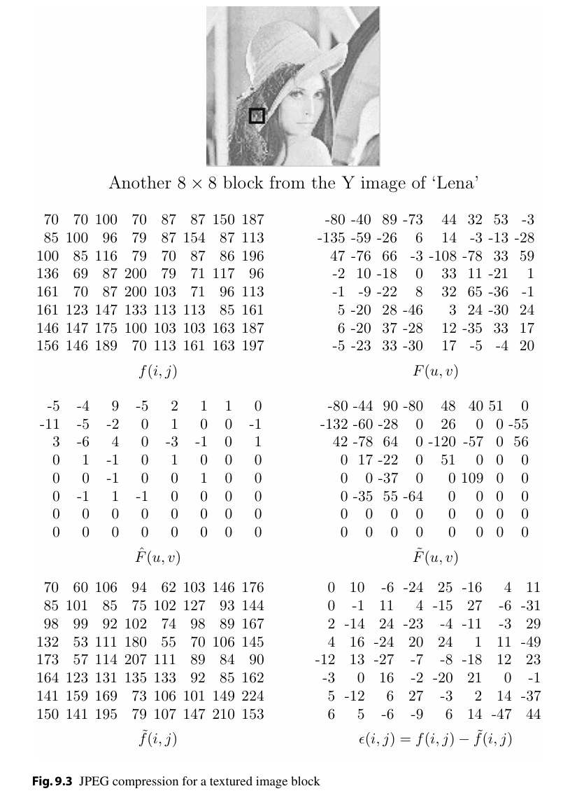
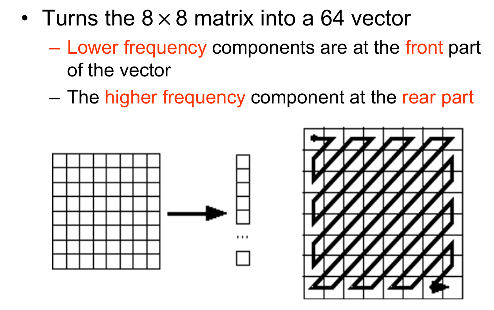
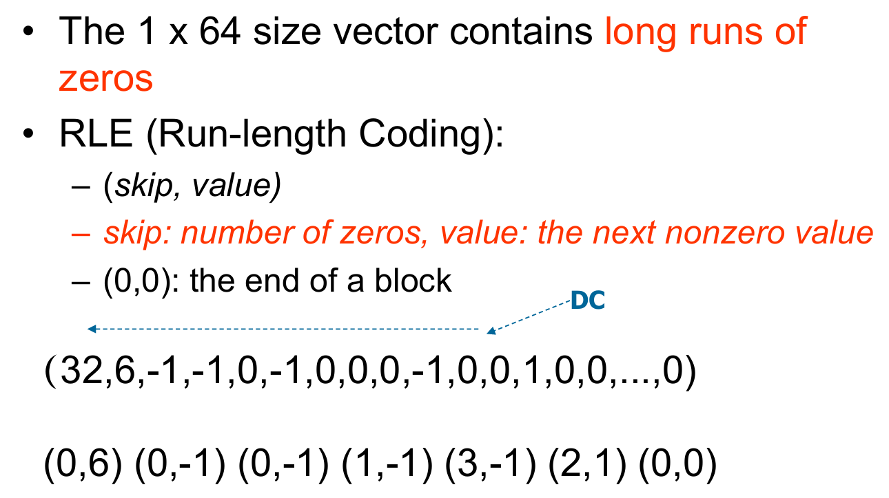
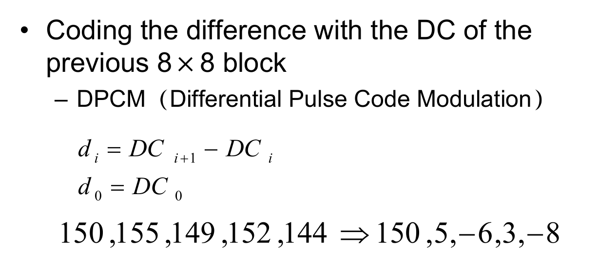
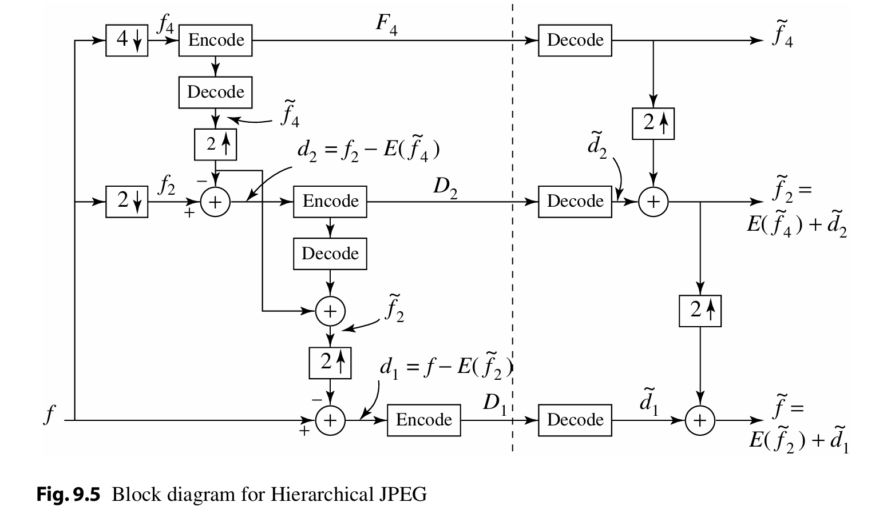
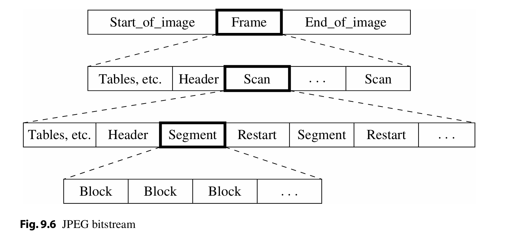

# Image Compression Standards

## JPEG (Joint Photographic Experts Group)

DCT有损压缩算法

JPEG：联合图像专家小组（Joint Photographic Experts Group）

- 由国际标准化组织（ISO）下属委员会制定
    - 首个国际静态图像压缩标准，于1992年正式发布，编号为ISO 10918-1
- 凭借其卓越特性（pleasing properties）

JPEG标准发布仅数年间便获得巨大成功

- 当前互联网上约80%的图像仍采用JPEG标准（JPEG standards）进行压缩

### Introduction

#### 基本特性

JPEG是一种**有损图像压缩**（lossy image compression）方法，其核心技术采用基于**离散余弦变换**（DCT, Discrete Cosine Transform）的编码方案。

#### 空间域转换

- 在**空间域**（spatial domain）中，图像可表示为i和j（传统记法为x和y）的函数
- 通过二维DCT变换将图像转换为**空间频率域**（spatial frequency domain）中的频率响应函数F(u, v)
    - 函数由两个整数u和v索引

#### 核心观察原理

##### 观察点1：空间缓变特性

- 像素强度值在8×8图像块内剧烈波动的情况罕见
- 图像中大量信息存在重复性（"空间冗余/spatial redundancy"）

##### 观察点2：频率感知特性

- **心理物理实验**（psychophysical experiments）表明：
    - 人眼对高频成分损失的敏感度显著低于低频成分
    - 通过削减高频内容（high spatial frequency contents）降低冗余

##### 观察点3：色度感知差异

- 人眼对灰度细节的分辨能力远高于色彩细节
- 采用**色度子采样**（chroma subsampling）技术（4:2:0模式）

### JPEG压缩流程

1. 将RGB色彩空间转换为YIQ/YUV色彩空间，并进行色度子采样（chroma subsampling）  
2. 对图像块（image blocks）执行离散余弦变换（DCT, Discrete Cosine Transform）  
3. 应用量化处理（Quantization）  
4. 按Z字形扫描顺序（Zigzag Ordering）排列系数  
5. 对直流系数（DC coefficients）实施差分脉冲编码调制（DPCM, Differential Pulse Code Modulation）  
6. 对交流系数（AC coefficients）进行游程编码（RLE, Run-Length Encoding）  
7. 执行熵编码（entropy coding）

信息损失主要来自第一步和第三步



#### DCT



为何选用 `8x8` 的块尺寸？– 这是在图像保真度 (accuracy) 与计算复杂度 (computation) 之间权衡 (compromise) 的结果。

消除 `blocking artifacts`（块效应）是研究领域的一个重要关注点。

然而，采用分块处理 (using blocks) 的方式，其效果是将每个图像块与其相邻区域的上下文信息 (neighboring context) 隔离开来。这就是为什么当用户指定了高压缩比 (high `compression ratio`) 时，`JPEG` 图像看起来会显得不连贯、断裂 (“choppy”) 或呈现明显的块状 (“blocky”)。

#### Quantization

常用的量化表



##### 举例 | 低频多



!!! note "各个表的含义"
      1.  **`f(i,j)` (左上角):**
          - **含义:** 原始图像块。
          - **解释:** 这是从原始 'Lena' 图像的亮度（Y）分量中取出的一个 8x8 大小的像素块。里面的数值 (例如 200, 202, 189 等) 代表了每个像素点的亮度值。`(i,j)` 是像素在块内的空间坐标。

      2.  **`F(u,v)` (右上角):**
          - **含义:** DCT 系数块。
          - **解释:** 这是对原始图像块 `f(i,j)` 进行离散余弦变换 (DCT) 后得到的结果。里面的数值代表了图像块在不同频率上的分量。`(u,v)` 是频率坐标，左上角是最低频（直流分量 DC），右下角是最高频。我们之前讨论过，低频系数的绝对值通常较大。

      3.  **`F̂(u,v)` (中间左边):**
          - **含义:** 量化后的 DCT 系数块。
          - **解释:** 这是将 `F(u,v)` 中的每个系数除以一个对应的量化值，然后取整（通常是四舍五入）得到的结果（来自量化表，左上角就是515/16四舍五入后的结果）。可以看到很多高频系数（右下角区域）都变成了 0。这是 JPEG 有损压缩中信息丢失的主要步骤。

      4.  **`F̃(u,v)` (中间右边):**
          - **含义:** 反量化/逆量化后的 DCT 系数块。
          - **解释:** 这是在解压缩过程中，将量化后的系数 `F̂(u,v)` 乘以 *相同* 的量化值得到的。注意，这些值是原始 DCT 系数 `F(u,v)` 的近似值（比如 515 恢复成 512，65 恢复成 66，-12 恢复成 -10），并且原来是 0 的地方仍然是 0。量化过程中丢失的信息无法完全恢复。

      5.  **`f̃(i,j)` (左下角):**
          - **含义:** 重建后的图像块。
          - **解释:** 这是对反量化后的 DCT 系数块 `F̃(u,v)` 进行反离散余弦变换 (IDCT) 得到的结果。这些数值就是解压缩后最终显示的像素值。可以对比一下这里的像素值（范围约 176 到 207）和左上角原始块 `f(i,j)` 的值，它们很接近但并不完全相同。

      6.  **`e(i,j)` (右下角):**
          - **含义:** 误差块。
          - **解释:** 这个块显示了原始像素值与重建像素值之间的差异。它的计算方法是 `e(i,j) = f(i,j) - f̃(i,j)`，即用原始块中对应位置的像素值减去重建块中对应位置的像素值。这个矩阵展示了在压缩解压缩过程中每个像素丢失或改变了多少信息。数值越小表示误差越小，重建效果越好。

##### 举例 | 高频多



可以看到，此时的误差块 `e(i,j)` 中的数值普遍较大，说明高频信息的丢失更为严重。（实际上这就是我们想要的结果，因为人眼对高频信息的损失不如对低频信息敏感，这样做可以在尽可能保持视觉效果的同时，大大减少需要存储和传输的数据量，从而实现高效压缩。）

#### Zigzag Ordering



它的主要作用和特点如下：

1. **转换:** 将一个 8x8 的二维矩阵（通常是量化后的 DCT 系数矩阵 `F̂(u,v)`) 转换成一个包含 64 个元素的一维向量（或者说序列）。
2. **扫描顺序:** 转换并非简单地按行或按列读取，而是按照右边图示的“之”字形（Zigzag）路径来扫描 8x8 矩阵中的元素。扫描从左上角（DC 系数，最低频）开始，逐渐向右下角（最高频交流 AC 系数）移动。
3. **排序结果:**
    - 按照 Zigzag 顺序扫描后，**低频的系数会排在生成的一维向量的前面**。
    - **高频的系数则会排在向量的后面**。

**为什么这么做？**

因为经过量化后，高频系数区域（对应 8x8 矩阵的右下角）通常包含了大量的零。采用 Zigzag 扫描可以将这些零集中到一维向量的末尾，形成长串的连续零。这非常有利于后续的熵编码步骤（例如行程编码 Run-Length Encoding, RLE），可以更有效地压缩数据。

#### RLE on AC coefficients

JPEG 压缩流程中紧接着 Zigzag 扫描之后的步骤：**对 AC 系数进行 RLE (行程编码)**。



1. **背景:**
    - 经过 Zigzag 扫描后，我们得到了一个 1x64 的一维向量。
    - 这个向量的特点是包含了很多连续的零，特别是在向量的后半部分（对应高频系数）。

2. **RLE (Run-Length Encoding / 行程编码):**
    - 这是一种非常适合压缩含有大量连续重复数据的编码方法。
    - 在 JPEG 中，RLE **专门用于处理 AC 系数**（即 Zigzag 扫描后得到的向量中，除了第一个 DC 系数之外的后面 63 个系数）。DC 系数通常采用其他方法（如差分编码 DPCM）处理，图中用 "DC" 指出了第一个系数（例子中的 32）不参与此处的 RLE。

3. **RLE 编码规则:**
    - 使用 `(skip, value)` 这样的数据对来表示。
    - `skip` (跳过数): 代表在遇到下一个非零值 (`value`) 之前，连续出现了多少个零。
    - `value` (数值): 代表遇到的那个非零的 AC 系数值。
    - 特殊代码 `(0,0)`: 表示块结束 (End Of Block, EOB)，意味着从当前位置到这个 8x8 块的最后一个 AC 系数全都是零。

4. **图示例子解读:**
    - **输入向量 (AC 部分):** 从 DC 值 32 之后开始看：`6, -1, -1, 0, -1, 0, 0, 0, -1, 0, 0, 1, 0, 0, ... , 0` (后面省略的部分也都是 0，直到填满 63 个 AC 系数)。
    - **RLE 编码输出:**
        - 第一个 AC 值是 `6`。它前面有 `0` 个零。 -> 编码为 `(0, 6)`
        - 下一个非零值是 `-1`。它前面有 `0` 个零。 -> 编码为 `(0, -1)`
        - 下一个非零值是 `-1`。它前面有 `0` 个零。 -> 编码为 `(0, -1)`
        - 下一个非零值是 `-1`。它前面有 `1` 个零。 -> 编码为 `(1, -1)`
        - 下一个非零值是 `-1`。它前面有 `3` 个零。 -> 编码为 `(3, -1)`
        - 下一个非零值是 `1`。它前面有 `2` 个零。 -> 编码为 `(2, 1)`
        - 此时，向量中 `1` 之后的所有剩余 AC 系数都是零。 -> 用 EOB 标记结束：`(0, 0)`

**目的:** 通过 RLE 编码，原来需要表示很多个零的长序列，现在可以用很紧凑的 `(skip, value)` 对和 `(0,0)` 来表示，极大地减少了数据量，实现了进一步的压缩。

#### DPCM on DC coefficients

JPEG 压缩流程中处理 DC 系数，使用的是 **DPCM (差分脉冲编码调制)** 方法。

主要解释了以下几点：

1. **分开处理:** DC 系数（每个 8x8 块经过 DCT 变换后的第一个值，代表块的平均亮度）是和 AC 系数（其他 63 个频率分量）分开进行编码的。我们之前看到 AC 系数用了 RLE 编码。

2. **DC 系数的特点:**
    - 不同图像块的 DC 系数值可能会很大，并且彼此不同。
    - 但是，**相邻的图像块的 DC 系数值通常不会相差太大**。这是因为图像中相邻区域的平均亮度往往是比较接近的（具有相关性）。

3. **为何使用 DPCM:**
    - 正是利用了相邻块 DC 系数相关性强的特点，DPCM 成为了编码 DC 系数的理想方案。
    - DPCM 的核心思想是：不直接对每个 DC 系数本身进行编码，而是**计算当前块的 DC 系数与上一个块的 DC 系数之间的差值**，然后对这个**差值**进行编码。
    - 

4. **DPCM 的优势:**
    - 由于相邻 DC 系数很可能相近，它们的差值通常会是一个较小的数。
    - 对这些较小的差值进行编码，比直接对可能很大的原始 DC 系数值进行编码，所需要的比特数更少，从而提高了压缩效率。

5. **应用范围:**
    - 对 DC 系数的 DPCM 编码是在整个图像（或者说图像的一个分量，比如 Y 分量）的所有块上顺序进行的。第一个块的 DC 系数会有一个特殊的处理方式（通常是直接编码），后续的块则编码与前一个块 DC 系数的差值。

#### Entropy Coding

- **DC 系数** 由一对符号表示
    - (`SIZE`, `AMPLITUDE`)
    - `SIZE` 指示表示该**系数 (coefficient)** 所需的**位元 (bits)** 数量
    - `AMPLITUDE` 包含实际的**位元 (bits)**

| `SIZE` | `AMPLITUDE`             |
| :----- | :---------------------- |
| 1      | -1, 1                   |
| 2      | -3, -2, 2, 3            |
| 3      | -7\~-4, 4\~7            |
| 4      | -15\~-8, 8\~15          |
| ...    | ...                     |
| 10     | -1023\~-512, 512\~1023 |

- 范例 (e.g.)：(150, 5, -6, 3, -8)  ->  (8, 10010110), (3, 101), (3, 001), (2, 11), (4, 0111)
    - `SIZE` 使用**霍夫曼编码 (Huffman coded)**
    - `AMPLITUDE` **不进行**霍夫曼编码 (is not Huffman coded)

- **霍夫曼表 (Huffman table)** 可以自定义并存储于图像**标头 (header)** 中，否则将使用**预设的 (default)** Huffman table。

- **AC 系数 (AC Coefficient)** -- 使用两个符号：
    - **Symbol_1**: (`RUNLENGTH`, `SIZE`)
    - **Symbol_2**: (`AMPLITUDE`)

- **Symbol_1** 使用**霍夫曼编码 (Huffman coding)**，**Symbol_2** 则不使用。

### **JPEG编码模式架构**

#### 1. 顺序模式 (Sequential Mode)

**技术原理**  

- 基于离散余弦变换（DCT）的**分块编码**（8×8像素块）  
- **单次扫描策略**：按光栅顺序（左→右，上→下）完成全部DCT系数量化与熵编码  
- **典型应用**：  
    - Motion JPEG视频编码（每帧独立压缩）  
    - 快速编解码场景（如数码相机存储）

#### 2. 渐进模式 (Progressive Mode)

**设计目标**  

- 解决网络传输中**渐进呈现**（Progressive Rendering）需求  
- 允许用户先预览低质量图像，再逐步增强细节  

**实现路径**  
**(a) 频谱选择 (Spectral Selection)**  

- **DCT域分层**：将8×8块的64个DCT系数（1个DC+63个AC）按频率分组  

  ```math
  \text{低频组}：DC, AC_1-AC_5 \quad (轮廓信息) \\  
  \text{高频组}：AC_6-AC_{63} \quad (细节信息)
  ```

- **多扫描传输**：优先发送低频组，后续扫描补充高频分量  

**(b) 逐次逼近 (Successive Approximation)**  

- **位平面分层**：对DCT系数的二进制位进行MSB→LSB分层编码  

  ```math
  \text{例如：系数值} \ 139_{10} = 10001011_2 \quad \text{拆分为} \quad  
  1\underline{0001011} \ (MSB) → \underline{0}001011 \ (次高位) → ...
  ```

- **质量渐进**：每层扫描增加量化精度（典型分层数：3-5层）

#### 3. 分层模式 (Hierarchical Mode)

**核心思想**  

- 构建**多分辨率金字塔**结构，适配不同显示设备需求  
- 支持从缩略图到高清图的**分级解码**

**编码流程**  

1. **空间降采样**：  
   原始图像$f_0$ → $\frac{1}{2}$分辨率$f_1$ → $\frac{1}{4}$分辨率$f_2$  
   （采用线性插值或高斯滤波避免混叠）  

2. **差分编码**：  
   - 对最低分辨率图像$f_n$进行基准编码（如Baseline JPEG）  
   - 逐层计算相邻分辨率间的预测残差：  

     ```math  
     d_k = f_k - \uparrow(f_{k+1}) \quad (\uparrow表示插值上采样)
     ```

   - 对残差$d_k$进行独立压缩（可选用不同量化表）



**应用场景**  

- 医疗影像系统（允许医生先查看低分辨率概览）  
- 卫星遥感图像传输（按需加载不同精度层级）

#### 4. 无损模式 (Lossless Mode)

**技术突破**  

- **脱离DCT框架**，采用预测编码（Predictive Coding）  
- **差分脉冲编码调制**（DPCM）流程：  
  1. 当前像素值预测：基于左、上、左上三邻域像素（7种预测器可选）  

     ```math  
     \hat{I}(x,y) = \alpha I(x-1,y) + \beta I(x,y-1) + \gamma I(x-1,y-1)
     ```

  2. 计算预测残差：  

     ```math  
     e(x,y) = I(x,y) - \hat{I}(x,y)
     ```

  3. 对残差进行Huffman或算术编码  

**性能局限**  

- 典型压缩比仅2:1~3:1（远低于有损模式的10:1~50:1）  
- 实际应用受限（常用于医学DICOM标准中的无损归档）

---

### **工程对比分析**

| 模式                | 压缩效率 | 实时性   | 适用场景                  | 兼容性        |
|---------------------|----------|----------|---------------------------|---------------|
| 顺序模式            | 高       | 快       | 普通图像存储              | 全平台支持    |
| 渐进模式            | 中       | 中等     | 网页加载/流媒体传输       | 主流浏览器支持|
| 分层模式            | 低       | 慢       | 多分辨率需求系统          | 需专用解码器  |
| 无损模式            | 极低     | 快       | 医学/科研图像存档         | 部分设备支持  |

---

### **技术演进趋势**

1. **渐进式优化**：结合WebP/AVIF格式的渐进加载技术，提升首屏渲染速度  
2. **智能分层**：通过AI预测用户关注区域（ROI），实现非均匀质量分层  
3. **混合编码**：在HEIF容器中整合有损JPEG与无损PNG压缩策略  

### JPEG Bitstream

