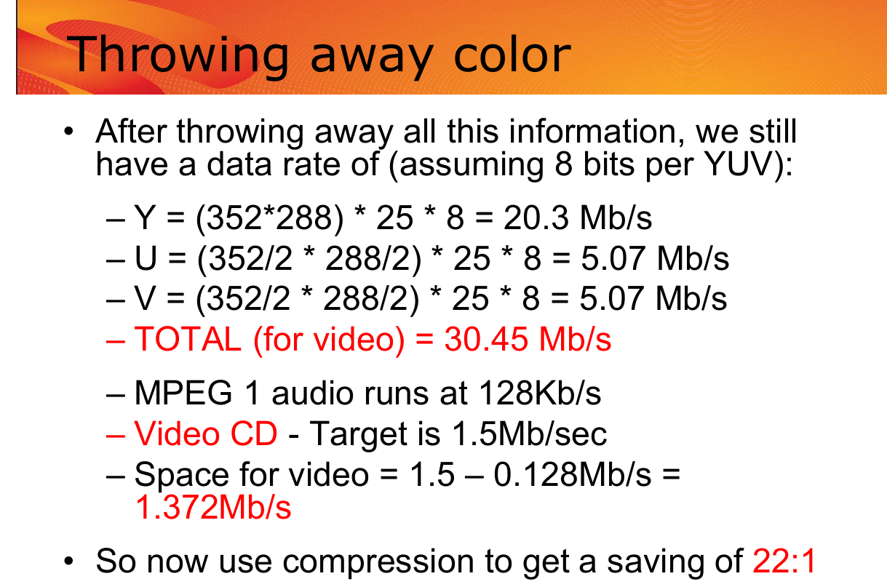
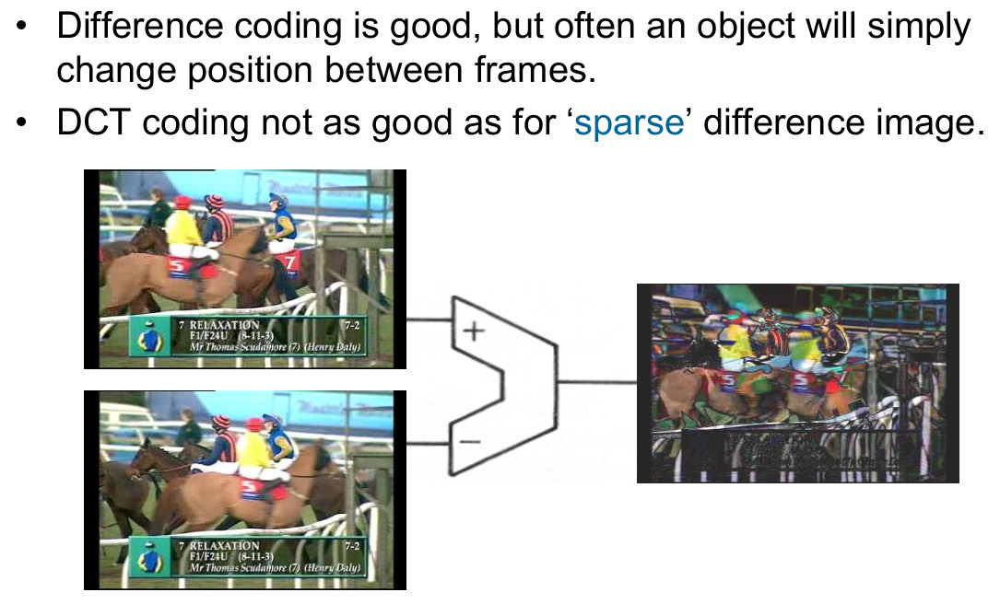
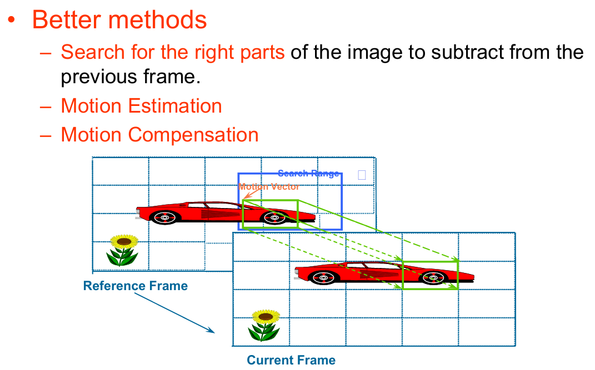
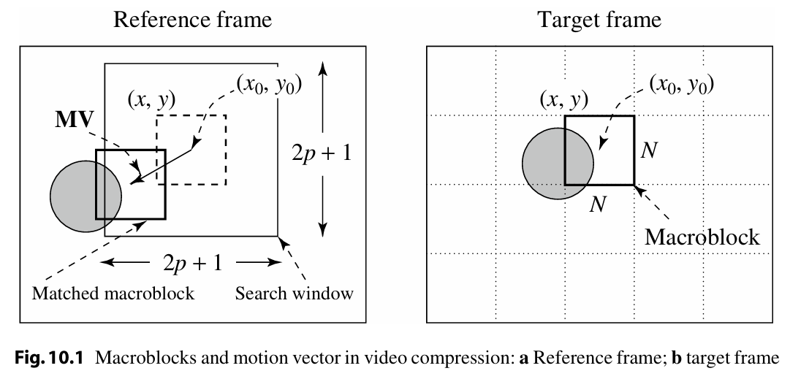
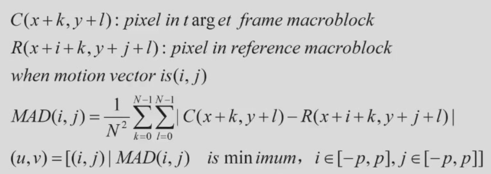
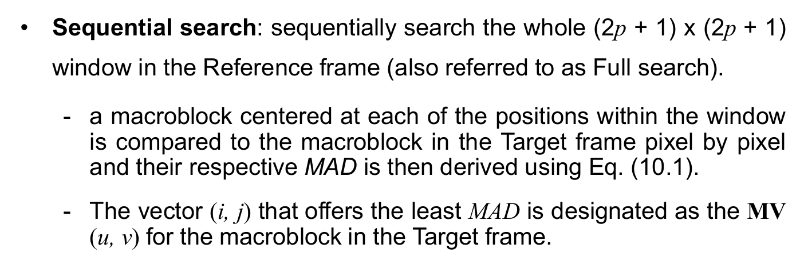
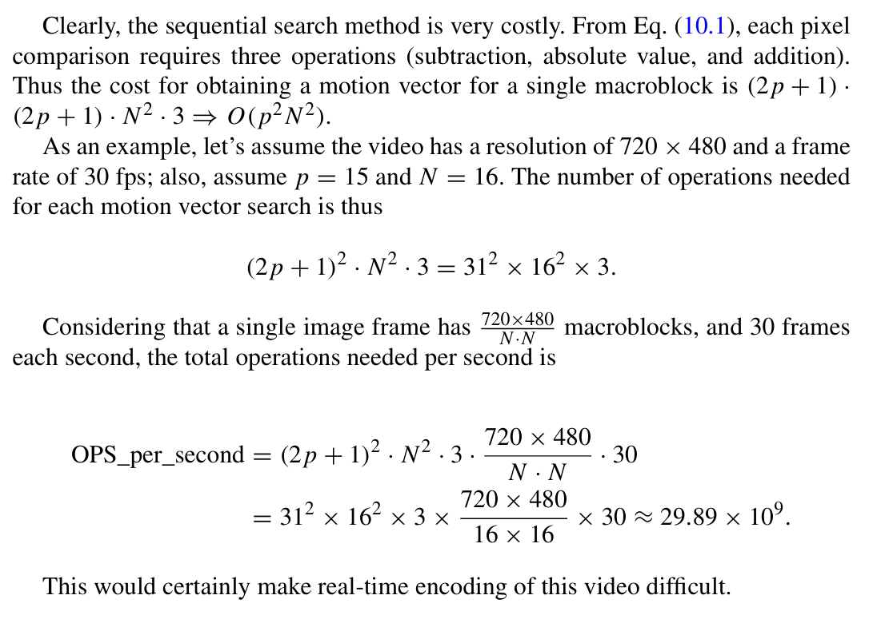
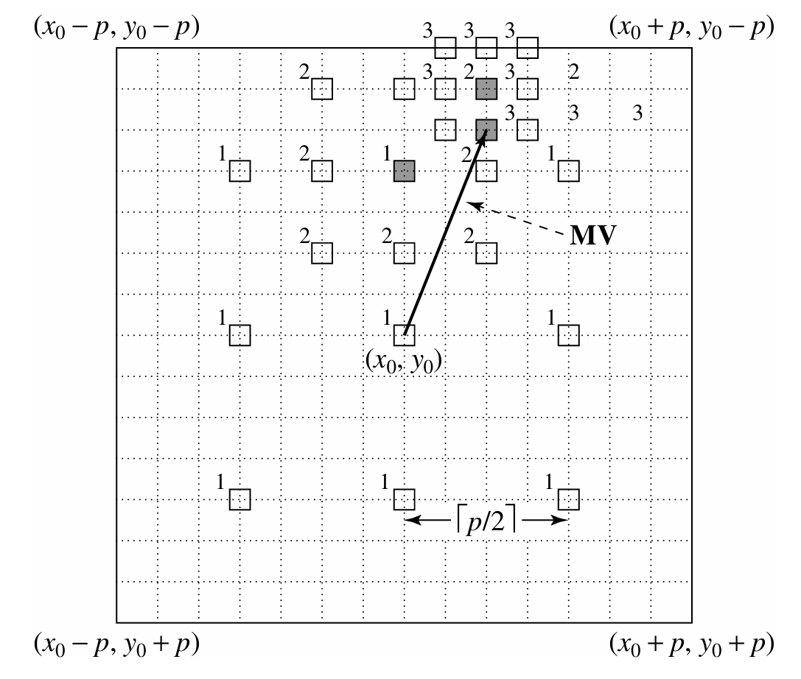

# Basic Video Compression Techniques

## Introduction to video compression

为什么能压缩？

- Redundant Spatial Information
- Color Information
- Redundant Temporal Information

### Color

- 人类视觉对亮度变化最为敏感
- 色彩感知次之（如黑白照片仍具辨识度）
- RGB编码存在冗余——人眼可接受较低色彩精度
- 采用YUV格式时，色度信号（UV）在各方向以半分辨率编码（176×144，即Quarter SIF），使UV通道数据量仅为Y通道的25%

### Spatial Compression by JPEG

我们可以用JPEG形式的Spatial Compression，但这种压缩比只能在10:1到20:1之间。压缩比不够。

### Introduction

我们首先想到的是差分。通过下面例子，可以看出，差分压缩的效果并不好。

我们想这样一种方法，如下图。每一块大小大概是16*16，拿着下面的块和上面的块比较，找到最合适的两个块做差分。

## Video Compression Based on Motion Compensation

- 视频是时间维度上的一系列图像  
- 连续帧通常高度相似
    - 视频存在显著时间冗余
    - 非逐帧独立编码
    - 仅编码相邻帧间差异  
- 帧间差异主因源于相机或物体运动  
- 运动可通过补偿机制处理——检测对应像素/区域的位移量，并计算其差异（运动补偿，MC）

- 动态图像中同时存在空间冗余与时间冗余  
- 运动图像编码原理：消除空间冗余（帧内编码，类JPEG）与时间冗余（帧间编码，基于运动预测与补偿）  
- 帧类型：P帧、B帧  
- 多帧参考技术（H.264标准）

- 运动补偿的基本思想：许多“动态”图像或图像序列由静态背景与一个或多个运动前景物体构成，可借此优化编码效率  
- 具体实现方式：  
    - 首帧采用基准JPEG编码并作为参考帧；  
    - 对第二帧逐块处理，将其各块与参考帧中的对应块进行比较；  
    - 若某块在参考帧中存在完全匹配块，则仅传输特殊代码而非完整编码；  
    - 其余块则按常规方式编码

- 三个核心步骤：  
    - 运动估计：运动向量搜索  
    - 基于运动补偿的预测  
    - 预测误差计算  

- 图像被划分为N×N宏块：  
    - 默认亮度（Y）宏块尺寸N=16；若采用4:2:0色度子采样，色度（UV）宏块尺寸N=8  

- 运动补偿在宏块级别执行：  
    - 当前图像帧称为目标帧（Target Frame）；  
    - 将目标帧中的宏块（macroblock）与参考帧（Reference frame，可为前向或后向帧）中的最相似宏块进行匹配；  
    - 参考宏块到目标宏块的位移量称为运动向量（MV）；  
    - 图10.1展示前向预测场景，其参考帧为前一帧

左图限制了搜索范围

## Search For Motion Vectors

### Criteria of matching

两块的相似度可以用MAD（Mean Absolute Difference）来衡量。

### Sequential Search

### 2D-Logarithmic-search

先采样类别一，然后不断二分迭代。