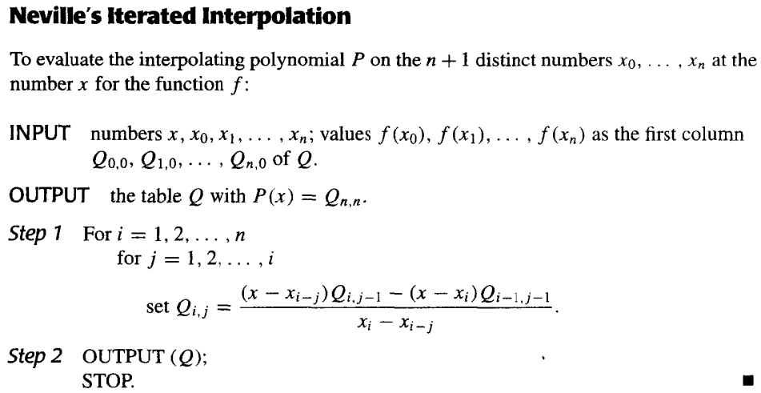
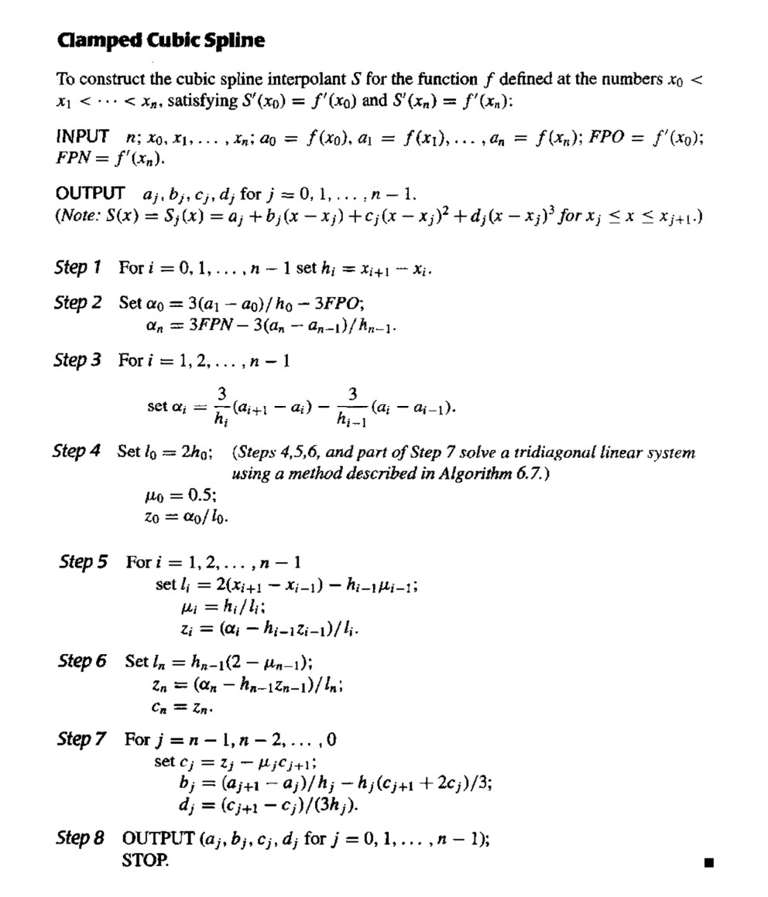

# Chapter 3 插值和多项式逼近 | Interpolation and Polynomial Approximation

## 3.1 插值和 Lagrange 多项式 | Interpolation and Lagrange Polynomials

### 构造 Lagrange 多项式

拉格朗日插值就是构造一个次数至多为 $n$ 次的多项式使它通过 $n+1$ 个给定的点，这个多项式就是拉格朗日多项式。

!!! note  " $n = 1$ "

    构造$P(x)=a_0+a_1x$，使得$P(x_0)=y_0$，$P(x_1)=y_1$。
    
    则$P(x)=y_0+\frac{y_1-y_0}{x_1-x_0}(x-x_0)=\frac{x-x_1}{x_0-x_1}y_0+\frac{x-x_0}{x_1-x_0}y_1$。 

    其中$\frac{x-x_1}{x_0-x_1}$和$\frac{x-x_0}{x_1-x_0}$分别记作$L_{1,0}(x)$和$L_{1,1}(x)$（第一个下标即为$n$的值，第二个下标为样本点的序号），这称为拉格朗日基函数（Lagrange Basis）。

!!! note ""
    可以知道，拉格朗日基函数总是满足Kronecker Delta函数$\delta_{ij}$。

    $$\delta_{ij} = \begin{cases} 1, & i = j \\ 0, & i \neq j \end{cases}$$

推广到$n$次插值，构造$P(x)=a_0+a_1x+\cdots+a_nx^n$，使得$P(x_i)=y_i$，$i=0,1,\cdots,n$。就是要找到 $L_{n,i}(x)$ 使得 $L_{n,i}(x_j) = \delta_{ij}$

分析可知，这里的$L_{n,i}(x)$有 $n$ 个根，分别为$x_0,x_1,\cdots,x_{i-1},x_{i+1},\cdots,x_n$。所以可以构造出

$$L_{n,i}(x)=C(x-x_0)(x-x_1)\cdots(x-x_{i-1})(x-x_{i+1})\cdots(x-x_n)$$

又因为$L_{n,i}(x_i)=1$，所以

$$L_{n,i}(x)=\frac{(x-x_0)(x-x_1)\cdots(x-x_{i-1})(x-x_{i+1})\cdots(x-x_n)}{(x_i-x_0)(x_i-x_1)\cdots(x_i-x_{i-1})(x_i-x_{i+1})\cdots(x_i-x_n)}$$

即

$$L_{n,i}(x)=\prod\limits_{j=0,j\neq i}^n\frac{x-x_j}{x_i-x_j}$$

于是我们根据拉格朗日基函数构造出了 $n$ 次拉格朗日插值多项式

$$P_n(x)=\sum\limits_{i=0}^nL_{n,i}(x)y_i$$

### Lagrange 多项式的唯一性

对 $n$ 个不同的点 ， $n$ 次拉格朗日插值多项式是唯一的

***证明：***

如果不唯一，假设存在另一个多项式$Q_n(x)$，使得$Q_n(x_i)=y_i$，$i=0,1,\cdots,n$，且$Q_n(x)\neq P_n(x)$。

则$R_n(x)=P_n(x)-Q_n(x)$是一个次数不超过$n$的多项式，且$R_n(x_i)=0$，$i=0,1,\cdots,n$。

由于$R_n(x)$的次数不超过$n$，$n$次多项式不可能有 $n+1$ 个解，所以$R_n(x)=0$，即$P_n(x)=Q_n(x)$，与假设矛盾。

!!! note ""

    如果 对 $n$ 个点 运用 超过$n$ 次的拉格朗日插值多项式，那么得到的多项式就不唯一了。

    例如 $P(x)=L_n\left(x\right)+p(x)\prod\limits_{i=0}^n\left(x-x_i\right)$

### 拉格朗日逼近的余项

假定$a\leq x_0<x_1<\cdots<x_n\leq b$，$f\in C[a,b]$，$P_n(x)$是$f(x)$在$x_0,x_1,\cdots,x_n$上的拉格朗日插值多项式，则对任意$x\in[a,b]$，存在$\xi(x)\in(a,b)$，使得

$$f(x)-P_n(x)=\frac{f^{(n+1)}(\xi(x))}{(n+1)!}\prod\limits_{i=0}^n(x-x_i)$$

!!! note "证明"

    记$R_n(x)=f(x)-P_n(x)$，则$R_n(x)$是一个次数不超过$n$的多项式，且$R_n(x_i)=0$，$i=0,1,\cdots,n$。所以$R_n(x)$可记作$C(x)\prod\limits_{i=0}^n(x-x_i)$

    固定一个点$x$ ($x\neq x_i$) 时，记$g(t)=R_n(t)-C(x)\prod\limits_{i=0}^n(t-x_i)$，则$g(x)=0$，$g(x_i)=0$，$i=0,1,\cdots,n$，所以$g(t)$存在$n+2$个不同的零点
    
    根据推广的Rolle定理，存在$\xi(x)\in(a,b)$，使得$g^{(n+1)}(\xi(x))=0$，即
    
    $$
    \begin{aligned}
    0=g^{(n+1)}(\xi(x))&=(R_n(\xi(x))-C(x)\prod\limits_{i=0}^n(\xi(x)-x_i))^{(n+1)}\\&=(f(\xi(x))-P_n(\xi(x))-C(x)\prod\limits_{i=0}^n(t-x_i))^{(n+1)}\\
    &=f^{(n+1)}(\xi(x))-C(x)(n+1)! \quad //因为P_n(x)是n次多项式，所以P_n^{(n+1)}(x)=0\\
    \end{aligned}
    $$
    
    所以$C(x)=\frac{f^{(n+1)}(\xi(x))}{(n+1)!}$，所以$R_n(x)=\frac{f^{(n+1)}(\xi(x))}{(n+1)!}\prod\limits_{i=0}^n(x-x_i)$

因为这里的$f^{(n+1)}(\xi(x))$是不知道的，所以我们经常用$f^{(n+1)}(x)$的上界来估计余项。

!!! note ""

    分析余项可知，对于小于等于 $n$ 次的多项式 $f$ ，经过$n$次拉格朗日插值得到的余项为0，得到的多项式就是 $f$ 本身

    !!! note ""
        这里限制了$f$为多项式

#### 例子 1

假设为 $x\in [0,1]$ 的函数 $f(x)=e^x$ 做一个表格。设表中每一项精确的位数是 $d\geq 8$，相邻 $x$ 值之差即步长为 $h$。为使线性插值（即一次Lagrange插值）的误差不超过 $10^{-6}$，$h$应该是多少？

***解：***

假设 $[0, 1]$ 被分成 $n$ 个等距的子区间 $[x_0, x_1], [x_1, x_2], \cdots, [x_{n-1} , x_n]$，$x$ 在区间 $[x_k, x_{k+1}]$ 中。则误差估计为

$$
\begin{aligned}
|f(x)-P_1(x)| &= |\frac{f''(\xi(x))}{2!}(x-x_k)(x-x_{k+1})| \\
&\leq |\frac{e^\xi}{2}(x-kh)(x-(k+1)h)| \\
&\leq \frac{e}{2}\cdot \frac{h^2}{4} \\
&\leq 10^{-6}
\end{aligned}
$$

所以 $h\leq 1.72\times 10^{-3}$。我们不妨取 $h=10^{-3}$，则 $n=1000$。

#### 例子 2

!!! note ""

    给三个点，我们有两种方法来线性插值。往往，**内插(Intrapolation)** 会比 **外插(Extrapolation)** 更加准确。

!!! note ""

    高次的拉格朗日插值一般会比低次的插值更加准确，但是这不一定总成立。

### Neville 迭代插值法

**记号说明：** 设 $f$ 在 $x_0,x_1,\cdots,x_n$ 上有定义，$m_1,m_2,\cdots,m_k$ 是 $k$ 个不同的整数，$0\leq m_i\leq n$，$i=1,2,\cdots,k$。记在这 $k$ 个点上与 $f(x)$ 相同的拉格朗日多项式为 $P_{m_1,m_2,\cdots,m_k}(x)$。

**定理：** 设 $f$ 在 $x_0,x_1,\cdots,x_n$ 上有定义，让 $x_i$ 和 $x_j$ 是这个集合中的两个不同的数。则

$$P(x)=\frac{(x-x_j)P_{0,1,...,j-1,j+1,...,k}(x)-(x-x_i)P_{0,1,...,i-1,i+1,...,k}(x)}{(x_i-x_j)}$$

描述了对 $f$ 在 $x_0,x_1,\cdots,x_k$ 这 $k+1$个点 上的 $k$ 次插值多项式。

!!! example "五个点"
    

**证明：**

对于任意 $0\leq r\leq k$，$r\neq i$ 和 $r\neq j$，分子上的两个插值多项式在 $x_r$ 处都等于 $f(x_r)$，所以 $P(x_r)=f(x_r)$。

分子上的第一个多项式在 $x_i$ 处等于 $f(x_i)$，而第二个多项式在 $x_i$ 处为0，所以 $P(x_i)=f(x_i)$。同理 $P(x_j)=f(x_j)$。

所以 $P(x)$ 在 $x_0,x_1,\cdots,x_k$ 上与 $f(x)$ 相同，因为 $P(x)$ 是 $k$ 次多项式，所以 $P(x)=P_{0,1,\cdots,k}(x)$。

#### 伪代码

## 3.2 Divided Differences | 差商

### Newton's Interpolatory Divided-Difference formula | 差商型 Newton 插值多项式

设 $P_n(x)$ 是函数 $f$ 在点 $x_0, x_1,\cdots,x_n$ 上的拉格朗日多项式，$f$ 关于 $x_0,x_1,\cdots,x_n$ 的差商被用于将 $P_n(x)$ 表示为：

$$P_n(x)=f[x_0]+f[x_0,x_1](x-x_0)+\cdots+f[x_0,x_1,\cdots,x_n](x-x_0)(x-x_1)\cdots(x-x_{n-1})$$

其中 $f[x_0,x_1,\cdots,x_n]$ 是 $f$ 关于 $x_0,x_1,\cdots,x_n$ 的差商，通过代值可以得到

$$f[x_0]=f(x_0), f[x_0,x_1]=\frac{f(x_1)-f(x_2)}{x_1-x_0}, f[x_0,x_1,x_2]=\frac{f[x_1,x_2]-f[x_0,x_1]}{x_2-x_0}, \cdots$$

$$f[x_0,x_1,\cdots,x_n]=\frac{f[x_1,x_2,\cdots,x_n]-f[x_0,x_1,\cdots,x_{n-1}]}{x_n-x_0}$$

我们记 $f[x_0], f[x_0,x_1],\cdots,f[x_0,x_1,\cdots,x_n]$ 为 $f$ 关于 $x_0,x_1,\cdots,x_n$ 的 $0$ 阶差商，$1$ 阶差商，$\cdots$，$n$ 阶差商。

!!! note "六个点的三阶差商计算的例子"
    

同时，我们称

$$P_n(x)=f[x_0]+f[x_0,x_1](x-x_0)+\cdots+f[x_0,x_1,\cdots,x_n](x-x_0)(x-x_1)\cdots(x-x_{n-1})$$

为**差商型 Newton 插值多项式**(Newton's Interpolatory Divided-Difference formula)。

#### 伪代码

#### 差商和导数的关系

##### 一阶差分

将中值定理应用到 $f$ 在 $[x_0,x_1]$ 上，得到

$$f[x_0,x_1]=\frac{f(x_1)-f(x_0)}{x_1-x_0}=f'(\xi)$$

##### $n$ 阶差分

设 $f\in C^n[a,b]$ 且 $x_0,x_1,\cdots,x_n\in[a,b]$，则存在 $\xi\in(a,b)$，使得

$$f[x_0,x_1,\cdots,x_n]=\frac{f^{(n)}(\xi)}{n!}$$

***证明：***

设 $g(t)=f(t)-P_n(t)$，则 $g(x_i)=0$，$i=0,1,\cdots,n$。所以 $g(t)$ 在 $[x_0,x_n]$ 上有 $n+1$ 个零点，根据推广的 Rolle 定理，存在 $\xi\in(a,b)$，使得 $g^{(n)}(\xi)=0$，即

$$f^{(n)}(\xi)-P_n^{(n)}(\xi)=0$$

所以 $P_n^{(n)}(\xi)=f^{(n)}(\xi)$，因为

$$P_n^{(n)}(\xi)=n!f[x_0,x_1,\cdots,x_n]$$

所以

$$f[x_0,x_1,\cdots,x_n]=\frac{f^{(n)}(\xi)}{n!}$$

!!! note "PPT上采用的证明方法"
    

#### 差分记号引入

如果每个点都连续等步长排列，记步长为$h$，令$x_i=x_0+ih$，则

引入**向前差分(forward difference)**记号：

$$\begin{aligned}
\Delta f(x_i)&=f(x_{i+1})-f(x_i)\\
\Delta^2 f(x_i)&=\Delta f(x_{i+1})-\Delta f(x_i)\\
\Delta^3 f(x_i)&=\Delta^2 f(x_{i+1})-\Delta^2 f(x_i)\\
\cdots
\end{aligned}$$

引入**向后差分(backward difference)**记号：

$$\begin{aligned}
\nabla f(x_i)&=f(x_i)-f(x_{i-1})\\
\nabla^2 f(x_i)&=\nabla f(x_i)-\nabla f(x_{i-1})\\
\nabla^3 f(x_i)&=\nabla^2 f(x_i)-\nabla^2 f(x_{i-1})\\
\cdots
\end{aligned}$$

引入**中心差分(central difference)**记号：

$$\delta^k f_i = \delta^{k-1}f_{i+\frac{1}{2}}-\delta^{k-1}f_{i-\frac{1}{2}}$$

其中

$$f_{i\pm\frac{1}{2}}=f(x_i\pm\frac{h}{2})$$

#### 等距下的向前差商公式

在等距情况下，向前差商的公式可表示为：

$$\begin{aligned}
P_n(x_s)=P_n(x_0+sh)&=f[x_0]+f[x_0,x_1]sh+\cdots+f[x_0,x_1,\cdots,x_n]s(s-1)\cdots(s-n+1)h^n\\
&=\sum\limits_{k=0}^n\begin{pmatrix}s\\k\end{pmatrix}k!h^kf[x_0,x_1,\cdots,x_k]
\end{aligned}$$

!!! note ""
    这里的 $\begin{pmatrix}s\\k\end{pmatrix}$ 是组合数，即 $\frac{s(s-1)\cdots(s-k+1)}{k!}$

#### 等距下的向前差分公式

由向前差分的记号可知道

$$
\begin{aligned}
f[x_{0},x_{1}]& =\frac{f(x_{1})-f(x_{0})}{x_{1}-x_{0}}=\frac{1}{h}\Delta f(x_{0})  \\
f[x_{0},x_{1},x_{2}]& =\frac{1}{2h}\left[\frac{\Delta f(x_{1})-\Delta f(x_{0})}{h}\right]=\frac{1}{2h^{2}}\Delta^{2}f(x_{0}),
\end{aligned}
$$

由此可推广得出

$$f[x_{0},x_{1},\ldots,x_{k}]=\frac{1}{k!h^{k}}\Delta^{k}f(x_{0}).$$

所以

$$P_n(x_s)=\sum\limits_{k=0}^n\begin{pmatrix}s\\k\end{pmatrix}\Delta^{k}f(x_{0})$$

此即为向前差分的公式

#### 等距下的向后差商公式

重排插值节点再计算，此时：

$$\begin{aligned}P_n(x)=&f[x_n]+f[x_n,x_{n-1}](x-x_n)+f[x_n,x_{n-1},x_{n-2}](x-x_n)(x-x_{n-1})\\&+\cdots+f[x_n,\ldots,x_0](x-x_n)(x-x_{n-1})\cdots(x-x_1).\end{aligned}$$

在等距情况下，记 $x_s=x_n+sh=x_i+(s+n-i)h$，有

$$
\begin{aligned}
P_{n}(x_s) =&P_{n}(x_{n}+sh)  \\
=&f[x_{n}]+shf[x_{n},x_{n-1}]+s(s+1)h^{2}f[x_{n},x_{n-1},x_{n-2}]+\cdots  \\
&+s(s+1)\cdots(s+n-1)h^nf[x_n,\ldots,x_0]\\
=&\sum\limits_{k=0}^n(-1)^k\begin{pmatrix}-s\\k\end{pmatrix}k!h^kf[x_n,x_{n-1},\cdots,x_{n-k}]
\end{aligned}
$$

!!! note ""
    这里的 $\begin{pmatrix}-s\\k\end{pmatrix}$ 是组合数，即 $\frac{-s(-s-1)\cdots(-s-k+1)}{k!}=(-1)^k \cdot \frac{s(s+1)\cdots(s+k-1)}{k!}$

#### 等距下的向后差分公式

由向后差分的记号可知道

$$\begin{aligned}
f[x_n,x_{n-1}]&=\frac1h\nabla f(x_n),\\
f[x_n,x_{n-1},x_{n-2}]&=\frac1{2h^2}\nabla^2f(x_n),\\\end{aligned}$$

由此可推广得出

$$
\begin{aligned}
f[x_n,x_{n-1},\ldots,x_{n-k}]&=\frac1{k!h^k}\nabla^kf(x_n).\end{aligned}$$

所以

$$P_n(x_s)=\sum\limits_{k=0}^n(-1)^k\begin{pmatrix}-s\\k\end{pmatrix}\nabla^kf(x_n)$$

## 3.3 Hermite Interpolation | Hermite 插值

Hermite 插值的目标是找到一个插值多项式

### Osculating polynomials | 密切多项式

在 $x_0,x_1,\cdots,x_n$ 上逼近 $f\in C^m[a,b]$ 的**密切多项式(osculating polynomial)** 是具有以下性质的多项式 $P_n(x)$：

1. $P_n(x)$ 在 $x_0,x_1,\cdots,x_n$ 上与 $f(x)$ 相同
2. 对每个 $x_i$，$P_n(x)$ 和 $f(x)$ 在 $x_i$ 处的前 $m_i$ 阶导数相同
3. 因此，我们可以得到 $\sum\limits_{i=0}^n(m_i+1)=\sum\limits_{i=0}^nm_i+(n+1)$ 个条件，于是 $P_n(x)$ 是一个次数至多为 $\sum\limits_{i=0}^nm_i+n$ 的多项式

我们给出密切多项式的定义：

**定义：** 设 $x_0,x_1,\cdots,x_n$ 是 $[a,b]$ 上的 $n+1$ 个不同的点，$m_0,m_1,\cdots,m_n$ 是 $n+1$ 个非负整数，假设$ f\in C^m[a,b]$，其中 $m=\max\limits_{0\leq i\leq n}m_i$。逼近 $f$ 的**密切多项式** $P_n(x)$ 是使得下式成立的**最小次数**的多项式：

$$\frac{d^k}{dx^k}P_n(x_i)=\frac{d^k}{dx^k}f(x_i),\quad k=0,1,\cdots,m_i,\quad i=0,1,\cdots,n$$

!!! note ""

    1. 当 $n=0$ 时，逼近 $f$ 的密切多项式是 $f$ 在 $x_0$ 处的 $m_0$ 阶 Taylor 多项式。
    2. 当 $m_i=0$ 时，密切多项式就是对 $f$ 在 $x_0,x_1,\cdots,x_n$ 上插值的 $n$ 次拉格朗日插值多项式。

### Hermite 插值多项式

对密切多项式 $m_i=1$ 的情况，我们定义其为 Hermite 多项式。也就是说，多项式 $P(n)$ 和它的一阶导数 $P'(n)$ 在 $x_i$ 处与 $f$ 和 $f'$ 相同。

#### 特殊例子

假设 $x_0\neq x_1 \neq x_2$，给定 $f(x_0),f(x_1),f(x_2),f'(x_1)$，找到多项式使得$P(x_i)=f(x_i)$，$P'(x_1)=f'(x_1)$。

首先，其次数为3次，我们猜想其形式为

$$P(x)=\sum\limits_{i=0}^2f(x_i)h_i(x)+f'(x_1)\hat{h}_1(x)$$

其中$h_i(x_j)=\delta_i(x_j),h'_i(x_1)=0,\hat{h}_1(x_i)=0,\hat{h}'_1(x_1)=1$。

根据这个猜想，我们试图构造出 $h_i(x)$ 和 $\hat{h}_1(x)$ 。

首先，我们可以用拉格朗日同样的方法构造出三次多项式$h_i(x)$，使得$h_i(x_j)=\delta_i(x_j)$，$h'_i(x_1)=0$，$i=0,1,2$。

对于$h_0(x)$，有根$x_1,x_2$，且因为 $h'_0(x_1)=0$ 所以 $x_1$ 是 $h_0(x)$ 的二重根，所以其形式为

$$h_0(x)=C_0(x-x_1)^2(x-x_2)$$

又因为$h'_0(x_0)=1$，所以

$$h_0(x)=\frac{(x-x_1)^2(x-x_2)}{(x_0-x_1)^2(x_0-x_2)}$$

类似地，我们可以得到

$$h_2(x)=\frac{(x-x_0)(x-x_1)^2}{(x_2-x_0)(x_2-x_1)^2}$$

对于$h_1(x)$，有根$x_0,x_2$，都是单根。所以其形式为

$$h_1(x)=(Ax+B)(x-x_0)(x-x_2)$$

通过计算 $h_1(x_1)=1$，$h'_1(x_1)=0$，可以得到 $A$ 和 $B$ 的值。此处略。

然后，我们构造$\hat{h}_1(x)$，使得$\hat{h}_1(x_i)=0$，$\hat{h}'_1(x_1)=1$。对于$\hat{h}_1(x)$，有根$x_0,x_1,x_2$，所以

$$\hat{h}_1(x)=C(x-x_0)(x-x_1)(x-x_2)$$

又因为$\hat{h}'_1(x_1)=1$，所以可以通过计算得到 $C$ 的值。此处略。

#### 一般情况

如果已知 $f(x_0),f(x_1),\cdots,f(x_n)$ 和 $f'(x_0),f'(x_1),\cdots,f'(x_n)$，则可以构造出 Hermite 插值多项式

$$H_{2n+1}(x)=\sum\limits_{i=0}^nf(x_i)h_i(x)+\sum\limits_{i=0}^nf'(x_i)\hat{h}_i(x)$$

其中$(2n+1)$阶多项式$h_i(x_j)=\delta_i(x_j),h'_i(x_j)=0,\hat{h}_i(x_j)=0,\hat{h}'_i(x_j)=\delta_i(x_j)$。

对于$h_i(x)$，有根$x_0,x_1,\cdots,x_{i-1},x_{i+1},\cdots,x_n$，且因为 $h'_i(x_j)=0(j\neq i)$ 所以 $x_j$ 是 $h_i(x)$ 的 $2$ 重根，所以其形式为

$$
\begin{aligned}
h_i(x)&=(A'x+B')(x-x_0)^2(x-x_1)^2\cdots(x-x_{i-1})^2(x-x_{i+1})^2\cdots(x-x_n)^2\\
&=(Ax+B)L_{n,i}^2(x)
\end{aligned}
$$

!!! note ""
    这里的常系数改变是因为引入 $L_{n,i}(x)$ 的话，它相较前面的有额外系数

    $$L_{n,i}(x)=\prod\limits_{j=0,j\neq i}^n\frac{x-x_j}{x_i-x_j}$$

因为$h_i(x_i)=1$，$h'_i(x_i)=0$，所以

$$h_i(x)=\left(1-2(x-x_i)L'_{n,i}(x_i)\right)\left(L_{n,i}(x)\right)^2$$

对于$\hat{h}_i(x)$，有根$x_0,x_1,\cdots,x_n$，且因为 $\hat{h}'_i(x_j)=0(j\neq i)$，$\hat{h}'_i(x_i)=1$ 所以 $x_i$ 是 $\hat{h}_i(x)$ 的 $1$ 重根，其余的都是 $2$ 重根，所以其形式为

$$\hat{h}_i(x)=C_i(x-x_i)\left(L_{n,i}(x)\right)^2$$

因为$\hat{h}'_i(x_i)=1$，所以

$$\hat{h}_i(x)=\left(x-x_i\right)\left(L_{n,i}(x)\right)^2$$

#### 余项

如果 $a=x_0<x_1<\cdots<x_n=b$，$f\in C^{2n}[a,b]$，余项为

$$f(x)-P_n(x)=\frac{f^{(2n+2)}(\xi(x))}{(2n+2)!}\prod\limits_{i=0}^n(x-x_i)^2$$

## 3.4 Cubic Spline Interpolation | 三次样条插值

### Piecewise-polynomial approximation | 分段多项式逼近

最简单的分段多项式逼近是分段线性逼近，即在每个子区间上用一个一次多项式逼近函数 $f$。但是，分段线性逼近的函数不光滑，所以我们希望用更高次的多项式来逼近 $f$。

{width=50%}

一个可替代的方法是使用 Hermite 插值多项式。例如，如果 $f$ 和 $f'$ 的值在每一个点 $x_i$ 处都已知，那么我们可以在每个子区间上使用一个三次多项式来逼近 $f$。这样的逼近是光滑的，但是为了将该多项式应用于一般插值，需要知道所有的 $f'$ 的值，这是不现实的。

由此，我们引入了三次样条插值。

### Cubic spline interpolation | 三次样条插值

!!! note ""
    三次样条的构造不假设插值函数的导数值与原函数的导数值相等，即使在插值点处也如此。

给定在 $[a,b]$ 上的 $n+1$ 个点 $x_0,x_1,\cdots,x_n$，$a=x_0<x_1<\cdots<x_n=b$，以及 $f$。三次样条插值是一个函数 $S(x)$，满足以下条件：

1. $S(x)$ 在每个子区间 $[x_i,x_{i+1}]$ 上是一个三次多项式，$i=0,1,\cdots,n-1$
2. $S(x_i)=f(x_i)$，$i=0,1,\cdots,n$
3. $S_{i+1}(x_{i+1})=S_i(x_{i+1})$，$i=0,1,\cdots,n-2$
4. $S'_{i+1}(x_{i+1})=S'_i(x_{i+1})$，$i=0,1,\cdots,n-2$
5. $S''_{i+1}(x_{i+1})=S''_i(x_{i+1})$，$i=0,1,\cdots,n-2$
6. 下列的边界条件之一成立：
    1. $S''(x_0)=S''(x_n)=0$，称为**自由或自然边界(free or natural boundary)**
    2. $S'(x_0)=f'(x_0)$，$S'(x_n)=f'(x_n)$，称为**固支边界(clamped boundary)**
    3. 其他边界条件（上面两个条件其实已经足以满足目的了）

我们介绍一种构造三次样条插值的方法：

#### Method of Bending Moments

记 $h_j=x_j-x_{j-1}$，在 $x\in[x_{j-1},x_j]$ 上，$S(x)=S_j(x)$，$S'(x)=S'_j(x)$，$S''(x)=S''_j(x)$。

因为 $S(x)$ 是一个三次多项式，所以 $S''_j(x)$ 是一个一次多项式，由端点值决定，假设 $S''_j(x_{j-1})=M_{j-1}$，$S''_j(x_j)=M_j$。那么对于 $x\in[x_{j-1},x_j]$，有

$$S''_j(x)=M_{j-1}\frac{x_j-x}{h_j}+M_j\frac{x-x_{j-1}}{h_j}$$

积分得到

$$S'_j(x)=-M_{j-1}\frac{(x_j-x)^2}{2h_j}+M_j\frac{(x-x_{j-1})^2}{2h_j}+A_j$$

再积分得到

$$S_j(x)=M_{j-1}\frac{(x_j-x)^3}{6h_j}+M_j\frac{(x-x_{j-1})^3}{6h_j}+A_jx+B_j$$

$A_j$ 和 $B_j$ 是常数，可以通过 $S_j(x_{j-1})=y_{j-1}$ 和 $S_j(x_j)=y_{j}$ 得到。

$$\begin{aligned}
\begin{cases}
S_j(x_{j-1})=y_{j-1}\\
S_j(x_j)=y_{j}
\end{cases}
&\Rightarrow
\begin{cases}
M_{j-1}\frac{h_j^2}{6}+A_jx_{j-1}+B_j=y_{j-1}\\
M_j\frac{h_j^2}{6}+A_jx_j+B_j=y_{j}
\end{cases}\\
&\Rightarrow
\begin{cases}
A_j=\frac{y_j-y_{j-1}}{h_j}-\frac{M_j-M_{j-1}}{6}h_j\\
B_j=\frac{y_{j-1}x_j-y_jx_{j-1}}{h_j}-\frac{M_{j-1}x_j-M_jx_{j-1}}{6}h_j
\end{cases}\\
\end{aligned}$$

所以

$$
\begin{aligned}
A_jx+B_j&=\frac{y_j-y_{j-1}}{h_j}x+\frac{y_{j-1}x_j-y_jx_{j-1}}{h_j}-\frac{M_j-M_{j-1}}{6}h_jx-\frac{M_{j-1}x_j-M_jx_{j-1}}{6}h_j\\
&=(y_{j-1}-\frac{M_{j-1}}{6}h_j^2)\frac{x_j-x}{h_j}+(y_j-\frac{M_j}{6}h_j^2)\frac{x-x_{j-1}}{h_j}
\end{aligned}
$$

所以，我们的目的就是求出 $M_j$，$j=0,1,\cdots,n$。

因为 $S'$ 是连续的，所以

在 $[x_{j-1},x_j]$ 上，$S'_j(x)=-M_{j-1}\frac{(x_j-x)^2}{2h_j}+M_j\frac{(x-x_{j-1})^2}{2h_j}+f[x_{j-1},x_j]-\frac{M_j-M_{j-1}}{6}h_j$

在 $[x_j,x_{j+1}]$ 上，$S'_{j+1}(x)=-M_{j}\frac{(x_{j+1}-x)^2}{2h_{j+1}}+M_{j+1}\frac{(x-x_{j})^2}{2h_{j+1}}+f[x_j,x_{j+1}]-\frac{M_{j+1}-M_{j}}{6}h_{j+1}$

有 $S'_{j+1}(x_j)=S'_j(x_j)$，所以我们可以得到 $M_{j-1}, M_j, M_{j+1}$ 之间的关系：

记 $\lambda_j=\frac{h_{j+1}}{h_j+h_{j+1}}$，$\mu_j=\frac{h_{j}}{h_j+h_{j+1}}$，$g_j=\frac{6}{h_j+h_{j+1}}(f[x_j,x_{j+1}]-f[x_{j-1},x_j])$，则

$$
\mu_jM_{j-1}+2M_j+\lambda_jM_{j+1}=g_j
$$

其中 $j=1,2,\cdots,n-1$。

$$
\begin{bmatrix}
\mu_1 & 2 & \lambda_1 &  & & \\
& \mu_2 & 2 & \lambda_2 &  & \\
& & \ddots & \ddots & \ddots & \\
& & & \mu_{n-1} & 2 & \lambda_{n-1} \\
\end{bmatrix}
\begin{bmatrix}
M_0\\
M_1\\
\vdots\\
M_n\\
\end{bmatrix}=
\begin{bmatrix}
g_1\\
g_2\\
\vdots\\
g_{n-1}\\
\end{bmatrix}
$$

我们有 $n+1$ 个未知数，$n-1$个方程 → 由边界条件增加两个方程

##### Clamped boundary | 固支边界

此时我们知道 $S'(x_0)=f'(x_0)$，$S'(x_n)=f'(x_n)$，所以

在 $[x_0,x_1]$ 上，$S'_1(x)=-M_0\frac{(x_1-x)^2}{2h_1}+M_1\frac{(x-x_0)^2}{2h_1}+f[x_0,x_1]-\frac{M_1-M_0}{6}h_1$

在 $[x_{n-1},x_n]$ 上，$S'_n(x)=-M_{n-1}\frac{(x_n-x)^2}{2h_n}+M_n\frac{(x-x_{n-1})^2}{2h_n}+f[x_{n-1},x_n]-\frac{M_n-M_{n-1}}{6}h_n$

所以我们额外有两个方程：

$$
\begin{cases}
f'(x_0)=-M_0\frac{h_1}{2}+f[x_0,x_1]-\frac{M_1-M_0}{6}h_1\\
f'(x_n)=M_{n }\frac{h_n}{2}+f[x_{n-1},x_n]-\frac{M_n-M_{n-1}}{6}h_n
\end{cases}
\Rightarrow
\begin{cases}
2M_0+M_1=\frac{6}{h_1}(f[x_0,x_1]-f'(x_0))\triangleq g_0\\
M_{n-1}+2M_n=\frac{6}{h_n}(f'(x_n)-f[x_{n-1},x_n]) \triangleq g_n
\end{cases}
$$

所以我们可以得到

$$
\begin{bmatrix}
2 & 1 &  & & &\\
\mu_1 & 2 & \lambda_1 &  & &\\
& \ddots & \ddots & \ddots & &\\
& & \mu_{n-1} & 2 & \lambda_{n-1} &\\
& &   & 1  & 2
\end{bmatrix}
\begin{bmatrix}
M_0\\
M_1\\
\vdots\\
M_n\\
\end{bmatrix}=
\begin{bmatrix}
g_0\\
g_1\\
\vdots\\
g_n
\end{bmatrix}
$$

##### Natural boundary | 自由边界

!!! note ""
    根据之前的假设 $M_0=S''(x_0)=y''_0$，$M_n=S''(x_n)=y''_n$，则

    $$ \lambda_0 = 0, g_0 = 2y''_0, \mu_n = 0, g_n = 2y''_n $$

    当 $S''(x_0)=S''(x_n)=0$，我们称之为**自由边界(free boundary)**，此时 $g_0=g_n=0$。

$$
\begin{bmatrix}
2 & 0 & 0 & & &\\
\mu_1 & 2 & \lambda_1 &   \\
 & \ddots & \ddots & \ddots & \\
 & & \mu_{n-1} & 2 & \lambda_{n-1} \\
 & &   0& 0  & 2
\end{bmatrix}_{(n+1)\times (n+1)}
\begin{bmatrix}
M_0\\
M_1\\
\vdots\\
M_{n-1}\\
M_n\\
\end{bmatrix}_{(n+1)\times 1}=
\begin{bmatrix}
g_0\\
g_1\\
\vdots\\
g_{n-1}\\
g_n
\end{bmatrix}_{(n+1)\times 1}
$$

自由边界的情况下，有 $S''(x_0)=S''(x_n)=0$。

#### 书上的方法

我们介绍另一种构造三次样条插值的方法：

给定在 $[a,b]$ 上的 $n+1$ 个点 $x_0,x_1,\cdots,x_n$，$a=x_0<x_1<\cdots<x_n=b$，设三次多项式 $S_j(x)$ 为

$$S_j(x)=a_j+b_j(x-x_{j})+c_j(x-x_{j})^2+d_j(x-x_{j})^3,\quad j=0,1,\cdots,n-1$$

且满足

!!! note ""

      1. $S(x)$ 在每个子区间 $[x_i,x_{i+1}]$ 上是一个三次多项式，$i=0,1,\cdots,n-1$
      2. $S(x_i)=f(x_i)$，$i=0,1,\cdots,n$
      3. $S_{i+1}(x_{i+1})=S_i(x_{i+1})$，$i=0,1,\cdots,n-2$
      4. $S'_{i+1}(x_{i+1})=S'_i(x_{i+1})$，$i=0,1,\cdots,n-2$
      5. $S''_{i+1}(x_{i+1})=S''_i(x_{i+1})$，$i=0,1,\cdots,n-2$
      6. 下列的边界条件之一成立：
          1. $S''(x_0)=S''(x_n)=0$，称为**自由或自然边界(free or natural boundary)**
          2. $S'(x_0)=f'(x_0)$，$S'(x_n)=f'(x_n)$，称为**固支边界(clamped boundary)**
          3. 其他边界条件（上面两个条件其实已经足以满足目的了）

记 $h_j=x_j-x_{j-1}$，由条件3，可得

$$a_{j+1}=S_{j+1}(x_{j+1})=S_j(x_{j+1})=a_j+b_jh_j+c_jh_j^2+d_jh_j^3,\quad j=0,1,\cdots,n-1$$

又由条件4，因为 $S'(x)=b_j+2c_j(x-x_j)+3d_j(x-x_j)^2$，所以

$$b_{j+1}=S'_{j+1}(x_{j+1})=S'_j(x_{j+1})=b_j+2c_jh_j+3d_jh_j^2,\quad j=0,1,\cdots,n-1$$

又由条件5，因为 $S''(x)=2c_j+6d_j(x-x_j)$，所以

$$c_{j+1}=\frac{S''_{j+1}(x_{j+1})}{2}=c_j+3d_jh_j,\quad j=0,1,\cdots,n-1$$

所以

$$\begin{cases}
a_{j+1}=a_j+b_jh_j+c_jh_j^2+d_jh_j^3\\
b_{j+1}=b_j+2c_jh_j+3d_jh_j^2\\
c_{j+1}=c_j+3d_jh_j
\end{cases},\quad j=0,1,\cdots,n-1$$

把最后一个式子代入前两个式子，消去 $d_j$，得到

$$\begin{cases}
a_{j+1}=a_j+b_jh_j+\frac{h_j^2}{3}(2c_j+c_{j+1})\\
b_{j+1}=b_j+h_j(c_j+c_{j+1})\\
\end{cases},\quad j=0,1,\cdots,n-1$$

为了减少未知数，我们有

$$
\begin{aligned}
a_{j+1}=a_j+b_jh_j+\frac{h_j^2}{3}(2c_j+c_{j+1})&\Rightarrow
\begin{cases}
b_j=\frac{1}{h_j}(a_{j+1}-a_j)-\frac{h_j}{3}(2c_j+c_{j+1})\\
b_{j-1}=\frac{1}{h_{j-1}}(a_{j}-a_{j-1})-\frac{h_{j-1}}{3}(2c_{j-1}+c_{j})
\end{cases}\\
b_{j+1}=b_j+h_j(c_j+c_{j+1})&\Rightarrow b_j=b_{j-1}+h_{j-1}(c_{j-1}+c_j)
\end{aligned}
$$

所以

$$
\begin{aligned}
&\begin{cases}
b_j&=\frac{1}{h_j}(a_{j+1}-a_j)-\frac{h_j}{3}(2c_j+c_{j+1})\\
b_{j-1}&=\frac{1}{h_{j-1}}(a_{j}-a_{j-1})-\frac{h_{j-1}}{3}(2c_{j-1}+c_{j})\\
b_j&=b_{j-1}+h_{j-1}(c_{j-1}+c_j)
\end{cases}\\
&\Rightarrow
\frac{1}{h_j}(a_{j+1}-a_j)-\frac{h_j}{3}(2c_j+c_{j+1})
=\frac{1}{h_{j-1}}(a_{j}-a_{j-1})-\frac{h_{j-1}}{3}(2c_{j-1}+c_{j})+h_{j-1}(c_{j-1}+c_j)\\
&\Rightarrow
h_{j-1}c_{j-1}+2(h_{j-1}+h_j)c_j+h_jc_{j+1}
=\frac{3}{h_j}(a_{j+1}-a_j)-\frac{3}{h_{j-1}}(a_{j}-a_{j-1}) \quad (j=1,2,\cdots,n-1)\\
\end{aligned}
$$

因为 $a_j$, $h_j$ 已知，所以上式未知量仅为 $c_j$，而且求出 $c_j$ 后，$b_j$ 也就求出了。（$b_j=\frac{1}{h_j}(a_{j+1}-a_j)-\frac{h_j}{3}(2c_j+c_{j+1})$）

所以我们有 $n-1$ 个方程，$n+1$ 个未知数，所以我们需要额外的两个方程。

##### Natural boundary | 自由边界

书上给的是 $S''(a)=S''(b)=0$，实际上，我们在做题中扩展到了 $S''(a)=s_0$，$S''(b)=s_n$，此时

$$
c_0=\frac{S''(a)}{2}=\frac{s_0}{2},\quad c_n=\frac{S''(b)}{2}=\frac{s_n}{2}$$

所以，我们可以将上面的方程组写成 $\mathbf{Ax}=\mathbf{b}$ 的形式，其中 $\mathbf{A}$ 为 $(n+1)\times(n+1)$ 的矩阵

$$
\mathbf{A}=\begin{bmatrix}
1&0&0&\cdots&0&0&0\\
h_0&2(h_0+h_1)&h_1&\cdots&0&0&0\\
0&h_1&2(h_1+h_2)&\cdots&0&0&0\\
\vdots&\vdots&\vdots&\ddots&\vdots&\vdots&\vdots\\
0&0&0&\cdots&h_{n-2}&2(h_{n-2}+h_{n-1})&h_{n-1}\\
0&0&0&\cdots&0&0&1
\end{bmatrix}
$$

$\mathbf{b}$ 和 $\mathbf{x}$ 为 $(n+1)\times1$ 的向量

$$
\mathbf{b}=\begin{bmatrix}
\frac{s_0}{2}\\
\frac{3}{h_1}(a_{2}-a_1)-\frac{3}{h_0}(a_{1}-a_0)\\
\frac{3}{h_2}(a_{3}-a_2)-\frac{3}{h_1}(a_{2}-a_1)\\
\vdots\\
\frac{3}{h_{n-1}}(a_{n}-a_{n-1})-\frac{3}{h_{n-2}}(a_{n-1}-a_{n-2})\\
\frac{s_n}{2}
\end{bmatrix}
,\quad
\mathbf{x}=\begin{bmatrix}
c_0\\
c_1\\
c_2\\
\vdots\\
c_{n-1}\\
c_n
\end{bmatrix}
$$

因为矩阵 $\mathbf{A}$ 是严格对角占优的，所以该方程组有唯一解。

##### 伪代码

##### 固支边界

固支边界要求 $S'(a)=f'(a)$，$S'(b)=f'(b)$。

因为 $f'(a)=S'(a)=S'(x_0)=b_0$，$f'(b)=S'(b)=S'(x_n)=b_n$，所以

$$
\begin{aligned}
&\begin{cases}
f'(a)&=b_0=\frac{1}{h_0}(a_1-a_0)-\frac{h_0}{3}(2c_0+c_1)\\
f'(b)&=b_n=b_{n-1}+h_{n-1}(c_{n-1}+c_n)=\frac{1}{h_{n-1}}(a_{n}-a_{n-1})+\frac{h_{n-1}}{3}(c_{n-1}+2c_n)
\end{cases}\\
\Rightarrow&
\begin{cases}
2h_0c_0+h_0c_1&=\frac{3}{h_0}(a_1-a_0)-3f'(a)\\
h_{n-1}c_{n-1}+2h_{n-1}c_n&=3f'(b)-\frac{3}{h_{n-1}}(a_n-a_{n-1})
\end{cases}
\end{aligned}
$$

所以，我们可以将上面的方程组写成 $\mathbf{Ax}=\mathbf{b}$ 的形式，其中 $\mathbf{A}$ 为 $(n+1)\times(n+1)$ 的矩阵

$$
\mathbf{A}=\begin{bmatrix}
2h_0&h_0&0&\cdots&0&0&0\\
h_0&2(h_0+h_1)&h_1&\cdots&0&0&0\\
0&h_1&2(h_1+h_2)&\cdots&0&0&0\\
\vdots&\vdots&\vdots&\ddots&\vdots&\vdots&\vdots\\
0&0&0&\cdots&h_{n-2}&2(h_{n-2}+h_{n-1})&h_{n-1}\\
0&0&0&\cdots&0&h_{n-1}&2h_{n-1}
\end{bmatrix}
$$

$\mathbf{b}$ 和 $\mathbf{x}$ 为 $(n+1)\times1$ 的向量

$$
\mathbf{b}=\begin{bmatrix}
\frac{3}{h_0}(a_1-a_0)-3f'(a)\\
\frac{3}{h_1}(a_{2}-a_1)-\frac{3}{h_0}(a_{1}-a_0)\\
\frac{3}{h_2}(a_{3}-a_2)-\frac{3}{h_1}(a_{2}-a_1)\\
\vdots\\
\frac{3}{h_{n-1}}(a_{n}-a_{n-1})-\frac{3}{h_{n-2}}(a_{n-1}-a_{n-2})\\
3f'(b)-\frac{3}{h_{n-1}}(a_n-a_{n-1})
\end{bmatrix}
,\quad
\mathbf{x}=\begin{bmatrix}
c_0\\
c_1\\
c_2\\
\vdots\\
c_{n-1}\\
c_n
\end{bmatrix}
$$

因为矩阵 $\mathbf{A}$ 是严格对角占优的，所以该方程组有唯一解。

##### 伪代码

### Properties of cubic splines | 三次样条的性质

- 只要系数矩阵严格对角占优（实际上是确保可逆），三次样条就可以由其边界条件唯一确定。
- 如果 $\frac{\max h_i}{\min h_i}$ 有界，那么 $S(x)$ 是收敛的。
- 增加点可以更贴近原函数。
