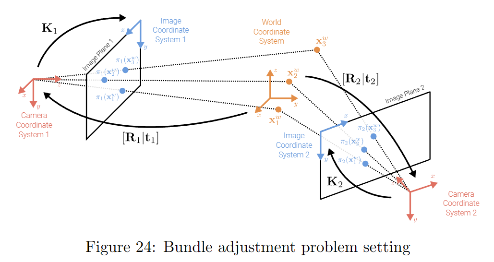
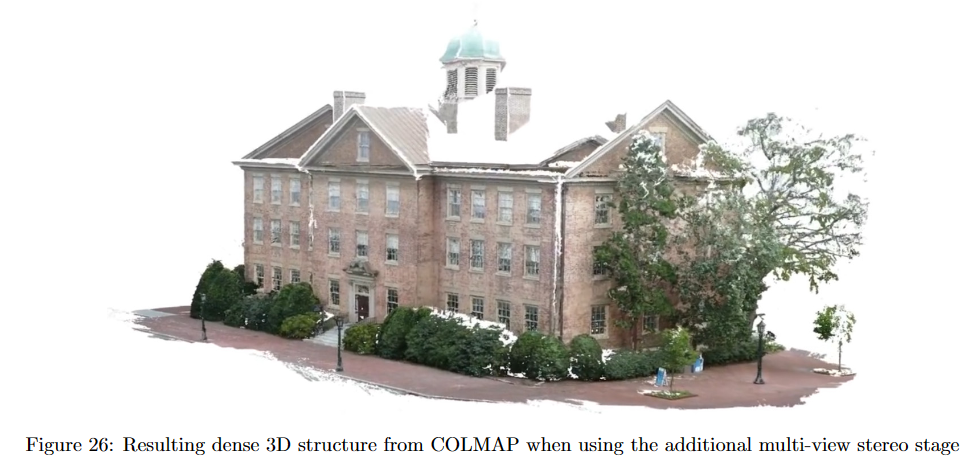

# 3.4 光束平差法 | Bundle Adjustment

光束平差法/束调整（Bundle adjustment）是从多幅图像中估计3D结构和相机姿态的黄金标准算法。它最小化了重投影误差，即观察特征点与在图像平面上投影的3D点之间的距离。这导致了一个高度非线性和非凸的优化问题，需要联合优化3D结构和相机姿态来解决。

设 $\Pi = \{\pi_i\}$ 表示包括内部和外部参数在内的 $N$ 个相机，设 $\mathcal{X}_w = \{\mathbf{x}^w_p\}$，其中 $\mathbf{x}^w_p \in \mathbb{R}^3$ 表示世界坐标中的 $P$ 个 3D 点的集合，设 $\mathcal{X}_s = \{\mathbf{x}^s_{ip}\}$，其中 $\mathbf{x}^s_{ip} \in \mathbb{R}^2$ 表示所有 $i$ 个相机中的图像（屏幕）观察。束调整最小化所有观测的重投影误差，并可以表述如下：

$$\Pi^*, \mathcal{X}_w^* = \argmin_{\Pi, \mathcal{X}_w} \sum_{i=1}^N \sum_{p=1}^P w_{ip} \|\mathbf{x}^s_{ip} - \pi_i(\mathbf{x}^w_p)\|_2^2$$

这里，$w_{ip}$ 表示点 $p$ 是否在图像 $i$ 中观测到，$\pi_i(\mathbf{x}^w_p)$ 是3D世界点 $\mathbf{x}^w_p$ 投影到第 $i$ 个相机的2D图像平面上的3D到2D投影，即：

$$\pi_i(\mathbf{x}^w_p) = \begin{pmatrix} \tilde{x^s_p} / \tilde{w^s_p} \\ \tilde{y^s_p} / \tilde{w^s_p} \end{pmatrix} \quad \text{with} \quad \tilde{\mathbf{x}}^s_p = \mathbf{K}_i (\mathbf{R}_i \mathbf{x}^w_p + \mathbf{t}_i).$$

$\mathbf{K}_i$ 和 $[\mathbf{R}_i|\mathbf{t}_i]$ 分别是 $\pi_i$ 的内部和外部参数。在束调整期间，我们联合优化 $\{(\mathbf{K}_i, \mathbf{R}_i, \mathbf{t}_i)\}$ 和 $\{\mathbf{x}^w_p\}$。

!!! note "束调整问题涉及到三个点和两个相机的示意图如图所示"

    

由于束调整问题的能量景观(energy landscape)非常非凸，良好的初始化对于避免陷入不良局部最小值至关重要。联合初始化所有的3D点和相机是困难的（由于遮挡、视角、匹配异常值等因素），因此通常使用增量式束调整。这意味着使用精心选择的双视图重建来初始化，然后逐步添加新的图像/相机。在初始化之后，实际的优化也具有挑战性。考虑到数百万个特征点和数千个相机，大规模束调整在计算上要求很高（未知数的数量呈立方复杂度增长）。幸运的是，这个问题是稀疏的（并不是每个相机中都观测到所有的3D点），在实际应用中可以利用高效的稀疏实现（例如，Ceres）来解决。

!!! note "能量景观"
    "能量景观"（Energy Landscape）是一个概念，通常在优化问题和机器学习中使用。它指的是一个多维空间中的函数，该函数用于衡量某个问题的解的质量或优劣。在这个多维空间中，每个可能的解都对应着函数中的一个点，而这个点的函数值就代表了解的"能量"，或者是一个"成本"或"损失"。因此，能量景观用来描述问题的解空间中各种解的质量。

    在优化问题中，目标通常是寻找能量景观中的最小值点，因为这表示问题的最佳解。然而，能量景观可能会具有复杂的形状，包括多个局部极小值和鞍点，这使得找到全局最小值变得困难，因为通常的优化算法容易陷入局部最小值。

    在机器学习中，能量景观通常是由损失函数或成本函数构成的，用于衡量模型的性能。训练机器学习模型的目标是找到最小化损失函数的模型参数，以获得最佳性能。

    因此，"能量景观"是一个用来描述问题空间中各种解的质量和性能的概念，对于优化问题和机器学习问题都具有重要意义，因为它帮助我们理解和解决复杂问题中的最优化挑战。

    !!! note "能量景观非常非凸"
        当能量景观非常非凸时，这表示问题的解空间非常复杂，可能包含多个局部最小值，这些局部最小值不一定是全局最小值。在这种情况下，寻找全局最优解变得更加困难，因为标准的优化算法可能会陷入局部最小值，而无法找到全局最小值。非凸能量景观增加了优化问题的挑战性，通常需要更复杂的算法和策略来处理。

!!! note "增量式束调整"

    增量式束调整（Incremental Bundle Adjustment）是一种用于估计相机姿态和三维结构的计算机视觉技术，通常用于多图像或多相机系统中。它的目标是通过逐步优化来不断改善相机参数和三维结构的估计，而不是一次性优化所有参数。

    这个方法的基本思想是从一个初始估计开始，然后逐渐添加更多的图像或相机，并在每次添加新数据时进行优化。通常的步骤包括：

    初始估计：从一对或更少的图像中估计初始的相机姿态和三维结构。这可以使用一些简单的技术来实现，例如通过两幅图像的特征点匹配来进行初始估计。

    逐步添加数据：随着更多的图像或相机数据可用，将它们逐一添加到估计中。

    重新优化：每次添加新数据后，重新运行束调整优化算法，以改善相机参数和三维结构的估计。这可以是一个迭代的过程，可以多次运行优化算法以达到更好的估计。

    增量式束调整的优势在于它可以有效地处理大规模的数据集，因为它不需要同时处理所有数据。此外，它可以用于实时或在线场景，因为可以随时添加新的数据并进行更新。但它的缺点是需要仔细选择初始估计，以及在每次添加新数据后运行优化算法，这可能会带来一定的计算开销。

    !!! note "增量式束调整和普通的有什么区别"

        增量式束调整和传统（或普通）束调整的主要区别在于它们处理数据的方式和优化的策略：

        数据处理方式：

        传统束调整：传统束调整通常需要一次性处理所有的数据，包括所有的相机图像和特征点，然后对它们进行联合优化。这意味着所有数据都同时参与了优化过程，计算和存储要求较高。
        增量式束调整：增量式束调整以逐步增加的方式处理数据。它从一个初始估计开始，然后逐步添加更多的数据并进行优化。这意味着在初始估计之后，只需要处理一部分数据，然后根据需要逐步添加更多的数据。这种方式可以降低计算和存储的要求，并且适用于大规模数据集。
        优化策略：

        传统束调整：传统束调整采用全局优化策略，试图找到整个问题的最优解，通常通过迭代算法来实现。这可以保证找到全局最小值，但计算开销较大。
        增量式束调整：增量式束调整采用逐步优化策略，每次仅优化部分数据，然后逐步改进估计。这可以在保证一定准确性的情况下降低计算成本，但可能无法保证找到全局最小值，因为每次优化仅考虑了一部分数据。
        总的来说，增量式束调整更适用于大规模数据集和实时应用，因为它可以降低计算和存储的需求，并且可以随时添加新的数据。传统束调整通常更适合小规模数据集和需要高精度解的情况，因为它可以全局考虑所有数据来找到最优解。选择哪种方法取决于具体的应用需求和计算资源可用性。

## 3.4.1 增量式结构重建 | Incremental Structure from Motion

这个流程分为两个基本部分：**对应关系搜索**（Correspondence Search）和**增量重建**（Incremental Reconstruction）。

***对应关系搜索***是一个阶段，用于在图像内部和图像之间找到并匹配2D特征点。在这个阶段，我们首先进行特征提取，使用SIFT（在3.1.2节中讨论）或其他特征检测器如SURF或BRISK来提取所有图像中的特征。接下来的步骤是找到重叠的图像对和相关的特征点对应。

对应关系搜索阶段开始于所有图像中的特征提取。然后，进行匹配操作，找到具有重叠特征点的图像对以及相关的特征点对应关系。

***增量重建***是一个阶段，其中使用这些匹配的特征点来推断3D结构和相机参数。这个过程是逐步进行的，从只有两个相机开始，然后逐步添加新的相机。

增量重建阶段的第一步（初始化）始于两个具有匹配特征的图像。这些特征根据第3.2节中描述的方式进行处理，以估计极线几何（epipolar geometry）。一旦完成这一步，下一步（图像注册）开始运行，选择一个新的图像，该图像在当前图像集中具有对应关系。然后，估算这个新图像的相机姿态。

设 $\mathcal{X}= \{\overline{\mathbf{x}}_i^s,\overline{\mathbf{x}}_i^w\}^N_{i=1}$ 为一组 $N$ 个3D到2D的对应关系，它们之间的关系是 $\overline{\mathbf{x}}_i^s = \mathbf{P} \overline{\mathbf{x}}_i^w$。由于对应关系向量是齐次的，它们具有相同的方向但不同的大小。因此，上述方程可以表达为 $\overline{\mathbf{x}}_i^s \times \mathbf{P}\overline{\mathbf{x}}_i^w = 0$。使用直接线性变换（Direct Linear Transform），这可以写成 $\mathbf{P}$ 的条目的线性方程。解决这个受约束系统（固定 $\mathbf{P}$ 的尺度）的方法是使用奇异值分解（SVD）。考虑到 $\mathbf{P} = \mathbf{K}[\mathbf{R}|\mathbf{t}]$，并且 $\mathbf{K}$ 是上三角矩阵，可以使用标准的RQ分解轻松地从 $\mathbf{P}$ 的前3×3子矩阵中获得 $\mathbf{K}$ 和 $\mathbf{R}$。如果 $\mathbf{K}$ 已知，甚至可以从仅三个点（P3P算法）中估算 $\mathbf{P}$。在实践中，通常还会使用随机采样一致性（RANSAC）来去除离群值。

流程的下一步是三角测量（triangulation）。对于新注册的图像，可以进行新的对应关系的三角测量。在COLMAP中，提出了一种稳健的三角测量方法，还处理了离群值。

之后，进行束调整（bundle adjustment）步骤。由于增量式结构重建只在局部影响模型，COLMAP在与局部连接的图像上执行局部束调整，为了效率，只偶尔执行全局束调整。COLMAP使用Ceres来解决稀疏大规模优化问题。在每次束调整之后，会移除具有大的重投影误差的观测以及具有异常视场或大畸变系数的相机。

COLMAP还具有额外的多视图立体阶段，用于获取稠密几何信息，如图26所示的结果。

