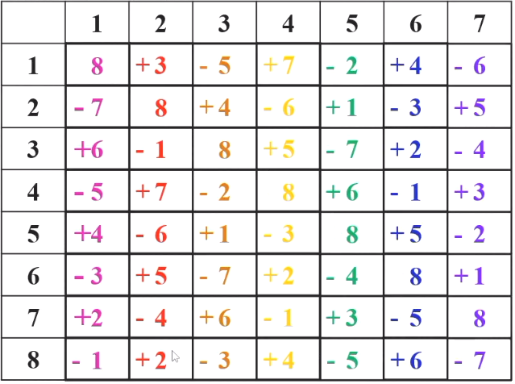
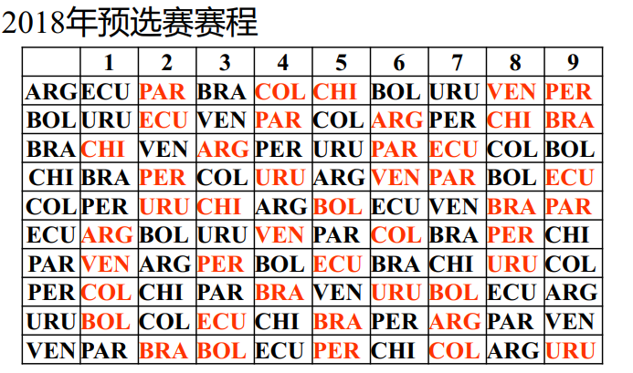

# 19 赛程编制

!!! note ""
    - Symmetry and separation(对称性和分离性)
    - Breaks(出现连续的客场或主场比赛--这是我们不愿看到的)
    - The carry-over effect

## 图的因子分解

图 $G$ 的因子分解，指将 $G$ 分解为若干边不重的因子之并——因子指至少包含G的一条边的生成子图。

一个图G的 $n$ 因子，是指图G的 $n$ 度正则因子——正则因子指所有顶点的度数都是 $n$ 的因子。

一个 $K-8$ 完全图的 1 - 因子分解如下（不同颜色的边表示不同的因子）：

{width=50%}

根据因子分解，我们可以给出赛程编制的一种方法：

{width=70%}

同时，我们也可以根据因子分解，给出主客场的安排（尽量不安排连续的客场或主场比赛），例如第一轮和第二轮中：

{width=50%}

根据这条路的开头和结尾，我们给出了主客场的安排。

{width=70%}

但我们的第八支队伍还没有安排，但无论怎么安排，都会出现breaks：

{width=70%}

这时排出来 6 种break，而这已经是最少的break了，接下来我们给出一般情况下至少有的break数。

## breaks数

对 $n$（偶数）支队伍的赛程，用形如 HAH…HA，长度为 $n-1$（奇数）的字符串表示每支队伍的主客场安排，称为**模式**（pattern）

- 任何两支队伍的模式互不相同

!!! note "单循环赛程"

    $n$ 支队伍的单循环赛程，全程所有队伍总break数至少为 $n-2$
    
    !!! note ""
        因为任意两支队伍的模式是互不相同，而只有HAHA…HAH 和 AHAH…AHA 两种模式没有break，其它模式的break数至少为 $1$，所以总break数至少为 $n-2$

!!! note "镜像双循环赛程"

    $n$ 支队伍的镜像双循环赛程，全程所有队伍总break数至少为 $3n-6$

    1. 若半程没有break，则全程也没有break，这样的队伍至多有两支（HAHAH-AHAHA，AHAHA-HAHAH）
    2. 若半程有且仅有一个break，由于模式字符串长度为奇数，在前后半程之间有一个break（H **A A** H **A - A** **H H** A H），break数为 $3$
    3. 若半程有至少两个break，全程break数至少为 $4$
    
    
    所以总break数至少为 $3(n-2)$

!!! note "$n$（偶数）支队的镜像赛程中的double-round break"

    此时赛程分成多个阶段，我们只考虑每个阶段中的 double-round break。

    因为队伍为偶数支，所以每支队伍的模式字符串长度为奇数。

    - 若半程没有break，则全程也没有break，这样的队伍至多有两支（HAHAH-AHAHA，AHAHA-HAHAH）
    - 若半程至少有1个break，全程至少有2个double-round break（H A | A H |**A - A** | **H H** | A H），根据奇数长度的模式字符串，我们可以得到：
        - 前后半程之间若有break，必为double-round
        - 若前半程的break不为double-round，后半程的break必为double-round
    
    所以总double-round break数至少为 $2(n-2)$

!!! note "其他方案"

    

    法制的 break 数可以到 0 ，最终我们采用法制。

## 数学规划

我们来到实际问题：有 $10$ 支队伍，每阶段两场比赛

**决策变量**：$x_{ijk}=\begin{cases}1,&\text{第}k\text{轮第}i\text{支队伍在主场对阵第}j\text{支队伍}\\0,&\text{其他}\end{cases}$

!!! note "例子"
    {width=50%}

**约束条件（部分）**：

- 每轮各队恰有一场比赛：$\sum\limits_{i=1}^{10} (x_{ijk}+x_{jik})=1$，$j=1,2,\cdots,{10}$，$k=1,2,\cdots,18$
- 任意两队在前后半程各交手一次：$\sum\limits_{k=1}^{18}x_{ijk}=1$，$i,j=1,2,\cdots,10$，$i\neq j$
- 任意两队之间的两场比赛中每队均有一个主场：$\sum\limits_{k=1}^{9}(x_{ijk}+x_{jik})=1$,$\sum\limits_{k={9}}^{18}(x_{ijk}+x_{jik})=1$，$i,j=1,2,\cdots,10$，$i\neq j$
- 任一队不连续与种子队（用 $I_s$ 表示）对阵：$\sum\limits_{j\in I_s}\left(x_{ijk}+x_{jik}+x_{i,j,k+1}+x_{j,i,k+1}\right)\leq1,\mathrm{~}i\in I\setminus I_s,k=1,\cdots,18$

### 均衡各阶段主场次数

每支队伍各阶段先主后客（先客后主）的次数尽可能均衡：

定义辅助变量 $y_{il}=\begin{cases}1,&\text{第}l\text{阶段第}i\text{支队伍先主后客}\\0,&\text{第}l\text{阶段第}i\text{支队伍先客后主}\end{cases}$

$x_{ijk}$ 与 $y_{il}$ 之间的关系：

$$y_{il}=1\Leftrightarrow\sum\limits_{j=1}^{10}x_{i,j,2l-1}=1\text{且}\sum\limits_{j=1}^{10}x_{j,i,2l}=1$$

改写一下就是：

$$
\begin{cases}\sum\limits_{j=1}^{10}\left(x_{i,j,2l-1}+x_{j,i,2l}\right)\leq1+y_{il}\\y_{il}\leq\sum\limits_{j=1}^{10}x_{i,j,2l-1}\\y_{il}\leq\sum\limits_{j=1}^{10}x_{j,i,2l}\end{cases}
$$

每支队伍先主后客的总次数尽可能均衡时，$4\leq\sum\limits_{l=1}^{9}y_{il}\leq5$，$i=1,2,\cdots,10$

### 各阶段连续客场的次数尽可能少

在法制双循环赛制中 $x_{i,j,1}=x_{j,i,18}$, $x_{i,j,k}=x_{j,i,k+8}$, $k=2,3,\cdots,9$，$i,j=1,2,\cdots,10$，$i\neq j$

定义辅助变量 $w_{il}=\begin{cases}1,&\text{第}l\text{阶段第}i\text{支队伍两场比赛均为客场}\\0,&\text{其他}\end{cases}$，$i=1,2,\cdots,10$，$l=1,2,\cdots,9$

$x_{i,j,k}$ 与 $w_{il}$ 之间的关系：

$$w_{il}=1\Leftrightarrow\sum\limits_{j=1}^{10}x_{j,i,2l-1}=1 \text{且} \sum\limits_{j=1}^{10}x_{j,i,2l}=1$$

改写一下就是：

$$
\begin{cases}\sum\limits_{j=1}^{10}\left(x_{j,i,2l-1}+x_{j,i,2l}\right)\leq1+w_{il}\\w_{il}\leq\sum\limits_{j=1}^{10}x_{j,i,2l-1}\\w_{il}\leq\sum\limits_{j=1}^{10}x_{j,i,2l}\end{cases}
$$

**目标函数** 为：$\min \sum\limits_{i=1}^{10}\sum\limits_{l=1}^{9}w_{il}$

最后的结果为：

{width=70%}