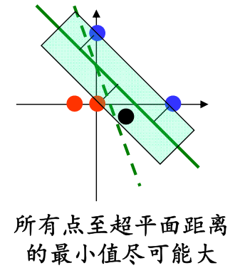

# 20 支持向量机

!!! note "问题背景"

    将一数据集 $S$ 分为 $C_1,C_2$ 两类，每个数据有 $n$ 个特征。我们应该如何通过训练集来找出一个超平面，使得它判别效果最好？

## 问题描述

我们拟将一数据集 $S$ 分为 $C_1,C_2$ 两类。每个数据有 $n$ 个特征，用 $n$ 维实向量表示，我们有训练集 $S'=\{\mathbf{x}_1,\cdots,\mathbf{x}_m\}$，其中 $\mathbf{x}_i\in \mathbb{R}^n$，记 $y_i=\begin{cases}1, \mathbf{x}_i\in C_1\\-1, \mathbf{x}_i\in C_2\end{cases}$。

假设训练集可线性分离，即存在超平面 $\mathbf{w}\cdot\mathbf{x}+b=0$，使得对于所有 $i$，有 $y_i(\mathbf{w}\cdot\mathbf{x}_i+b)>0$。

!!! note "超平面"

    设 $\mathbf{w}$ 为 $n$ 维实向量，$b$ 为实数，$\mathbf{w}\cdot\mathbf{x}+b=0$ 称为 $\mathbb{R}^n$ 中的超平面。

    - $\mathbb{R}^n$ 中的点 $\mathbf{x}$ 到超平面 $\mathbf{w}\cdot\mathbf{x}+b=0$ 的距离为 $\frac{|\mathbf{w}\cdot\mathbf{x}+b|}{\|\mathbf{w}\|}$。
    - 若 $\mathbf{w} \cdot \mathbf{w} =1$，则距离为 $|\mathbf{w}\cdot\mathbf{x}+b|$。

我们现在要做的是找到一个超平面，使得它到两类数据的距离最大（判别效果最好）。

{: width="50%"}

## 数学规划

根据上面的描述，我们可以得到如下的数学规划问题：

$$
\begin{aligned}
&\max \min\limits_{i=1,\cdots,m} |\mathbf{w}\cdot\mathbf{x}_i+b|\\s.t.\quad&y_i(\mathbf{w}\cdot\mathbf{x}_i+b)\geq 0,i=1,\cdots,m\\&\|\mathbf{w}\|=1
\end{aligned}
$$

本目标含绝对值与极小值，约束含二次函数，极难计算。我们将绝对值去掉，得到如下的数学规划问题：

$$
\begin{aligned}
&\max \min\limits_{i=1,\cdots,m} y_i(\mathbf{w}\cdot\mathbf{x}_i+b)\\s.t.\quad &\|\mathbf{w}\|=1
\end{aligned}
$$

!!! note "证明可以转换"

    

但此时目标含极小值，约束含二次函数，依旧难以计算。我们将极小值去掉，得到如下的数学规划问题：

$$
\begin{aligned}
&\min \|\mathbf{w}\| \\s.t.\quad &y_i(\mathbf{w}\cdot\mathbf{x}_i+b)\geq1
\end{aligned}
$$

!!! note "证明可以转换"

    
