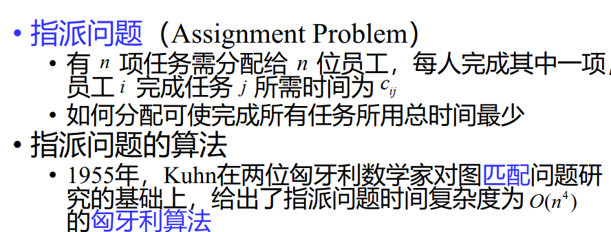
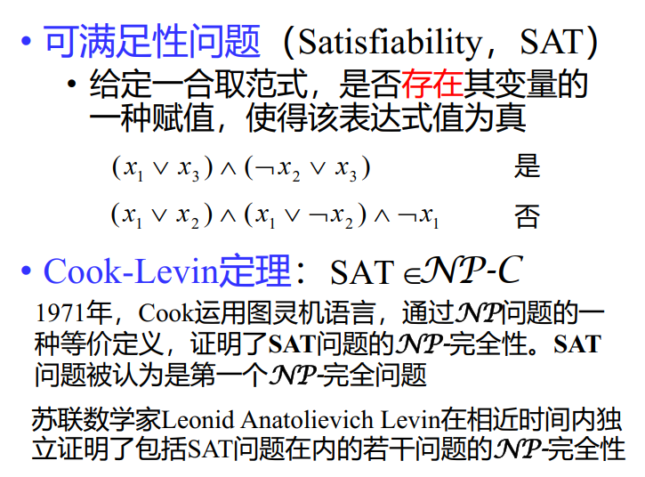
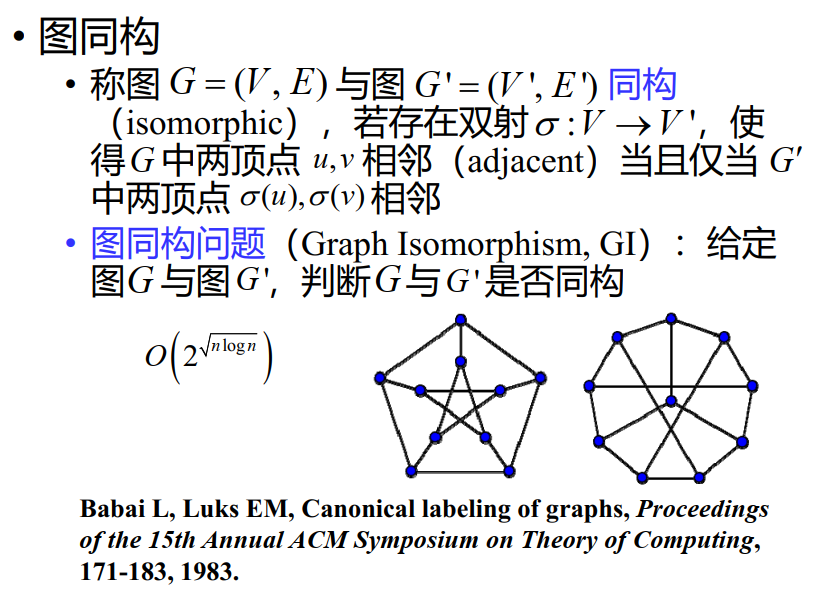
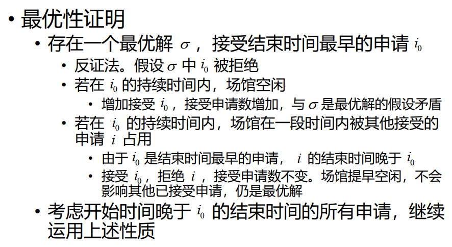
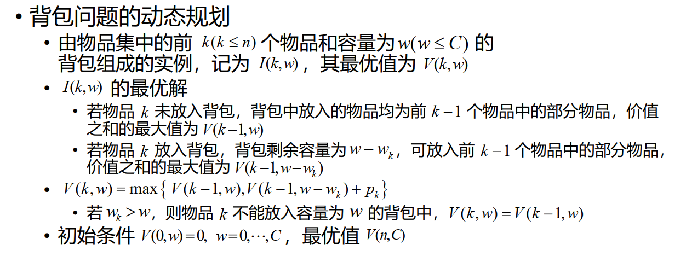
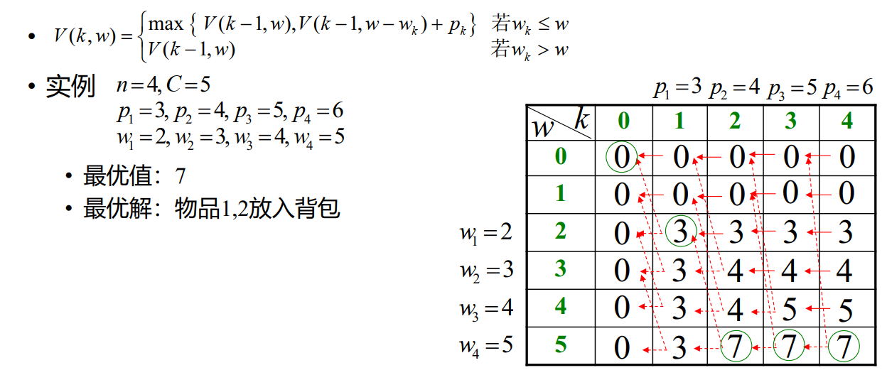
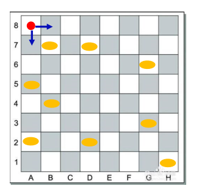
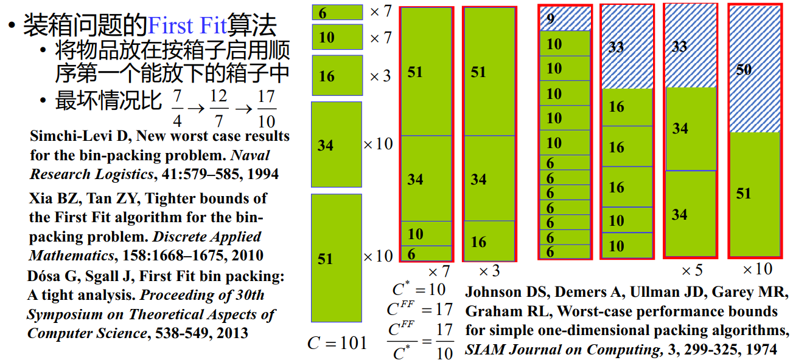

# 23 组合优化

## 组合优化的基本概念

组合优化是应用于离散对象的，从有限多个可行解中找出使某个目标函数达到最优的解的优化问题

- 组合优化是离散数学（Discrete Mathematics）与最优化的交叉学科分支

## 组合优化与连续优化

!!! note "连续优化"

    

    连续优化是应用于连续对象的，从无限多个可行解中找出使某个目标函数达到最优的解的优化问题

相对决策变量为连续变量的连续优化（Continuous Optimization）问题，组合优化问题的最优解缺少好的性质，求解缺少好的工具

## 组合优化例子

### 背包问题

#### 连续背包问题

现有 $n$ 件物品，物品 $j$ 的价值为$p_j$,大小为 $w_j$。 物品质地均匀，可任意切割

{width=50%}

#### 离散背包问题

现有 $n$ 件物品，物品 $j$ 的价值为$p_j$,大小为 $w_j$。 物品不可切割

### 旅行商问题 - TSP

**旅行售货商问题**（TravelingSalesman Problem， TSP）

- 一推销员想在若干个城市中推销自己的产品。计划从某个城市出发，经过每个城市恰好一次，最后回到出发的城市
- 城市之间距离已知
- 如何选择环游路线，使推销员走的路程最短

可行解（环游）

- 每一条环游路线由 $n$ 段两个城市之间的旅行路线连接而成，对应于 $1,2,\cdots,n$ 的一个圆周排列

### 车辆路径问题 - VRP

### 指派问题

### 排序问题

## 算法与计算复杂性

### $P\;v.s.\;NP$ 问题

$P$ 和 $NP$ 问题的通俗解释：

- $P$：有（确定性）多项式时间算法的问题
- $NP$：有非确定性多项式时间算法的问题

!!! note ""
    确定性算法是一种特殊的非确定性算法，故 $P\subseteq NP$

所谓 $P\;v.s.\;NP$ 问题是指 $P=NP$ 还是 $P\subset NP$ ？

!!! note ""
    - $P\;v.s.\;NP$ 问题是数学和计算机科学中的重大未解决难题之一
    - 目前多数人相信 $P\subset NP$。此时背包问题等，不存在多项式时间内求得最优解的算法

### $NP$ - 完全性理论

**$NP$ – 完全**与 **$NP$ – 难** 的通俗解释：

- $NP – C$：$NP$ 类中最难的问题
    - 若一个 $NP – C$ 问题有多项式时间算法，所有 $NP$ 问题都有多项式时间算法
- $NP – hard$：不比 $NP – C$ 问题容易的问题
    - 在 $P\neq NP$ 假设下， $NP$ - 难 问题不存在多项式时间最优算法

!!! note ""
    $NP – hard$ 可以是 $NP$ 问题，也可以不是 $NP$ 问题

    {width=50%}

在 $P\neq NP$ 假设下，多数组合优化问题分属 $P$ 问题 和 $NP – hard$ 问题

### NP-完全问题举例

!!! note ""
    线性规划和素性检验问题都是 $P$ 问题

#### SAT 问题

**SAT 问题**（Satisfiability Problem）

{width=50%}

#### 图同构问题（目前还没完全证明）

{width=50%}

## 组合优化的求解

组合优化问题通常不能通过穷举所有可能的解加以比较来求解，因为可行解的数目可能是一很大的数，以致于当前或相当长的一段时间内人力或计算机不能承受

### 贪心算法

**贪心算法**：在每一次决策时，选择当前可行且最有利的决策

#### 场馆安排问题

贪心算法：按结束时间从小到大的顺序排列最优

#### 排序悖论

!!! note ""

    右边第二个是所有加工时间-1，第三个是增加一条线。可见，后面两个竟然不如前面的好，这就是贪婪思想的局限性

实际上，这个问题是 $NP$ - 难问题，没有多项式时间算法

### 动态规划

**动态规划**是求解多阶段决策优化问题的一种数学方法和算法思想

#### 背包问题的动态规划算法

#### 麦子收集

一 $n$ 行 $m$ 列的棋盘，在棋盘的部分格子中各放有一颗麦子

{width=50%}

- 一机器人从棋盘左上角的格子出发收集麦子。机器人只能从当前所
在格子向下或向右移动一格，到达放有麦子的格子后，即能收集该
格子中的麦子
- 如何使机器人到达棋盘右下角的格子时，收集的麦子数量尽可能多

我们给出动态规划解法：

### 启发式算法

**启发式算法**（heuristic）是基于某种直观想法、合理假定，或者借助物理、化学、生命科学中的一些原理而设计的算法，体现了在求解的最优性、精确性与求解资源之间的权衡。启发式算法的有效性一般需通过计算机模拟验证。

!!! note ""
    - 遗传算法（genetic algorithm）
    - 模拟退火算法（simulated annealing）
    - 禁忌搜索（tabu search）
    - 蚁群算法（ant colony optimization）
    - 粒子群优化算法（partial swarm optimization）

#### 元启发式算法

元启发式算法是一种高层次的问题无关的算法框架，它提供了一组指导方针或策略来开发启发式优化算法

### 近似算法

算法的时间复杂性可通过分析确定（一般要求多项式时间），且算法给出的近似解与最优解目标值之间的差距可通过证明来严格估计

#### 装箱问题

