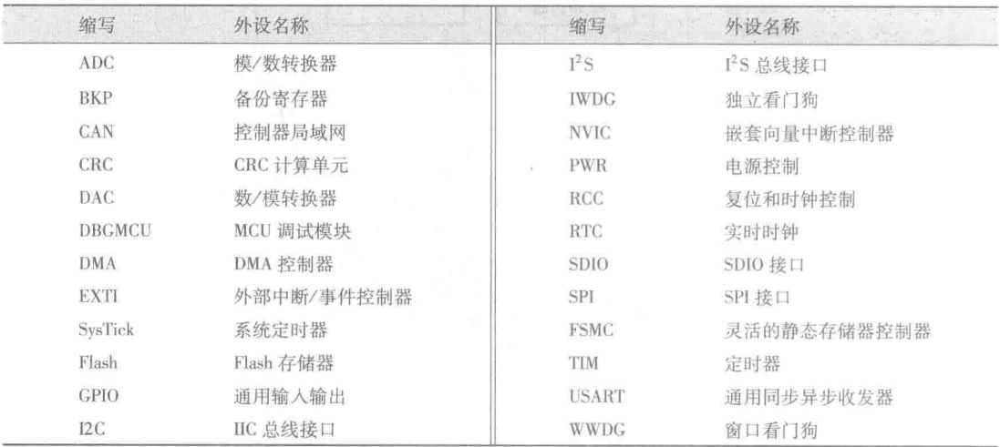

# 2024春夏嵌入式系统回忆卷
## 选择（2*15）
### 第一题（第一章）
以下不属于嵌入式系统特点的是
A. **无实时性要求** B. 体积小 C. 硬件资源限制 D. 专用性强
#### 相关知识点
嵌入式系统的特点：
1. **功耗限制**
2. 低成本
3. 多速率
4. 环境相关性
5. **系统内核⼩（体积⼩）**
6. **实时性**
7. **专业性强**
8. 不可垄断
9. 产品相对稳定
### 第二题（第三章）
标准库中配置 Cortex-M 核的文件是
A. `system_stm32f10x.c` B. `startup_stm32f10x_hd.c` C. `stm32f10x.h` **D**. `core_cm3.c`
#### 相关知识点
**Libraries 文件夹下的标准库的源代码及启动文件**
- `core_cm3.c` 和 `core_cm3.h`分别是核内外设访问层(CPAL)的源文件和头文件,作用是为采用 Cortex - M3 内核的芯片外设提供进入 M3 内核的接口。
- `stm32f10x.h`是设备外设访问层的头文件,包含了 STM32F10x 系列所有外设寄存器的定义(寄存器的基地址和布局)、位定义、中断向量表、存储空间的地址映射等。
- `system_stm32f10x.c` 和 `system_stm32f10x.h`分别是设备外设访问层(DPAL)的源文件和头文件,包含了两个函数和一个全局变量。函数 `SystemInit()`用来初始化系统时钟(系统时钟源、PLL 倍频因子、AHB/APBx 的预分频及其 Flash),启动文件在完成复位后跳转到 `main()`函数之前调用该函数。函数 `SystemCoreClockUpdate()`用来更新系统时钟,当系统内核时钟变化后必须执行该函数进行更新。全局变量 SystemCoreClock 包含了内核时钟(HCLK),方便用户在程序中设置 `SysTick` 定时器和其他参数。
- `startup_stm32f10x_X.s` 是用汇编写的系统启动文件,X 代表不同的芯片型号,使用时要与芯片对应。启动文件是任何处理器上电复位后首先运行的一段汇编程序,为 C 语言的运行搭建合适的环境。
- `stm32f10x_ppp.c` 和`stm32f10x_ppp.h`分别为外设驱动源文件和头文件,ppp 代表不同的外设,使用时将相应文件加入工程。其包含了相关外设的初始化配置和部分功能应用函数,这部分是进行编程功能实现的重要组成部分。
- `misc.c`和`misc.h` 提供了外设对内核中的嵌套向量中断控制器 NVIC 的访问函数,在配置中断时,必须把这两个文件加到工程中。

**Project 文件夹下的采用标准库写的工程模板和例子**

- `stm32f10x_it.c` 和 `stm32f10x_it.h` 是用来编写中断服务函数的,其中已经定义了一些系统异常的接口,其他普通中断服务函数要自己添加,中断服务函数的接口在启动文件中已经写好。
- `stm32f10x_conf.h` 文件被包含进 `stm32f10x.h` 文件,用来配置使用了哪些外设的头文件,用这个头文件可以方便地增加和删除外设驱动函数。
### 第三题（第二章）
总线系统中的驱动单元包括（全部为中文，不使用英文缩写）
#### 相关知识点
STM32F103 的总线系统由**驱动单元**、**被动单元**和**总线矩阵**三部分组成
##### 驱动单元
驱动单元包括：
1. 指令总线(ICode):将 Cortex - M3 内核的指令总线与**Flash 指令接口**相连接,取指操作在该总线上进行。
2. 数据总线(DCode):将 Cortex - M3 内核的数据总线连接到**总线矩阵**,通过**总线矩阵**与 **Flash 数据接口**相连接,用于常量加载和调试访问。
3. 系统总线(System):将 Cortex - M3 内核的系统总线连接到**总线矩阵**,通过**总线矩阵**与**外设**相连。
4. 直接内存访问总线(DMA):将DMA的**AHB 主机接口**连接到**总线矩阵**,通过**总线矩阵**与**外设**相连。
#####  被动单元
被动单元有3个
- 内部 SRAM
- 内部 Flash
- AHB (Advanced High Performance Bus,高级性能总线)/APB(Advanced Peripheral Bus,高级外设总线)桥
#####  总线矩阵
- DCode 总线、System 总线和通用 DMA 总线通过总线矩阵与被动单元相连 
- 为了允许 DMA 访问,AHB 外设**通过总线矩阵连接到系统总线**。
### 第四题（第七章）
定时器有哪几种
#### 相关知识点
定时器类型：
1. 基本定时器
2. 通用定时器
3. 高级控制定时器
4. 窗口看门狗定时器
5. 独立看门狗定时器
6. 系统滴答定时器
### 第五题（第五章）
关于中断服务函数描述错误的是
A. **中断服务函数可以嵌套** B. 中断服务函数不能有返回值 C. 中断服务函数不能有参数 D. 中断服务函数必须在中断向量表中声明
类似这样的选项？我猜的。
### 第六题（第六章）
波特率的含义与单位
#### 相关知识点
波特率即数据的传送速率,在串行异步通信中,每秒钟传送的二进制数的位数称为波特率,单位是**比特/秒(bit/s),或波特(baud)**
### 第七题（第六章）
异步通信数据构成（xx 位，xx 位）
#### 相关知识点
异步通信需指定共同遵守的约定：字长、波特率。
字长可以选择成 8 位或 9 位。起始位为低电平,停止位为高电平,空闲帧为全 1。
### 第八题（第八章）
DMA 优先级由谁决定
#### 相关知识点
DMA主要特性
1. 支持**存储器与存储器、外设与存储器、存储器与外设、外设与外设之间**的数据传输。闪存、SRAM、外设的SRAM、APB1 和APB2 外设均可以作为访问的源和目标。
2. 每个通道直接连接专用的硬件 DMA 请求,并且都支持软件触发,可通过软件配置。
3. **DMA 支持单向的从源端到目的端的数据传输,各通道的优先权可以通过硬件和软件编程实现,如果优先权相等则由硬件决定(请求0优先于请求1,以此类推)**。
4. 数据传输时内存和外设指针自动增加,传输数据大小可编程。
5. 循环模式/非循环模式。
6. 每个通道都有3个事件标志(**DMA 半传输、DMA 传输完成和DMA 传输出错**),这3个事件标志逻辑或为一个单独的中断请求。
7. 总线错误自动管理。
8. 可编程的数据传输数目最大为65536。
### 第九题（第四章）
使用 ADC 模块的时候 GPIO 引脚配置为什么模式
#### 相关知识点
IO 复用功能 AFIO 配置：
IO复用功能 AFIO 常对应到外设的输入输出功能。使用时,需要先配置IO 为复用功能,打开 AFIO 时钟,然后再根据不同的复用功能进行配置。对应外设的输入输出功能有下述三种情况:
1. 外设对应的引脚为输出:需要根据外围电路的配置选择对应的引脚为复用功能的推挽输出或复用功能的开漏输出。
2. 外设对应的引脚为输入:根据外围电路的配置可以选择浮空输入、带上拉输入或带下拉输入。
3. **ADC 对应的引脚:配置引脚为模拟输入。**

### 第十题（第二章）
内部时钟是否比外部晶振要精确
#### 相关知识点
stm32内部时钟单元：
- 在 STM32 中有 5 个时钟源,**分别为 HSI 、HSE、 LSE , LSI 、 PLL**
- 高速时钟(HSE 和 HSI)提供给芯片主体的主时钟.低速时钟(LSE 和 LSI)只是提供给芯片中的 RTC(实时时钟)及独立看门狗使用。当然高速时钟也可以提供给芯片中的 RTC 使用。
- 内部时钟是在芯片内部 RC 振荡器产生的，起振较快，所以时钟在芯片刚上电的时候，默认使用内部高速时钟。而**外部时钟信号**是由外部的晶振输入的，**在精度和稳定性上都有很大优势**，所以上电之后再通过软件配置，转而采用外部时钟信号.
- STM32 还具有系统时钟 SYSCLK。SYSCLK 是供STM32 中绝大部分部件工作的时钟源,**系统时钟可选择为PLL 输出、HSI 或者 HSE。**

### 第十一题（第五章）
事件和中断的区分
#### 相关知识点
- 中断是需要 CPU 参与的,需要**软件的中断服务函数**才能完成中断后产生的结果;
- 事件,是靠脉冲发生器产生一个脉冲,进而**由硬件自动完成**这个事件产生的结果,
### 第十二题（第二章）
STM32采用小端存储的含义
#### 相关知识点
STM32F103 处理器内部存储器结构及映射：
**数据字节以小端模式存放在存储器中,即低地址中存放的是字数据的低字节,高地址中存放的是字数据的高字节**。
### 第十三题（第八章）
DMA能够实现的数据传输的线路不包括谁和谁之间
#### 相关知识点
同[第八题](#相关知识点-6)
### 第十四题（第二章）
系统时钟源不能由哪个输出（HSI,HSE,**LSE**,PLL）
#### 相关知识点
同[第十题](#相关知识点-8)
### 第十五题（第三章）
STM32启动文件名
#### 相关知识点
同第二题
startup_stm32f10x_X.s
### 选择题分布
|章节|题数|
|---|---|
|第一章|1|
|第二章|4|
|第三章|2|
|第四章|1|
|第五章|2|
|第六章|2|
|第七章|1|
|第八章|2|
## 判断（2*10）
1. 抢占优先级相同不会发生中断嵌套(√)
2. Cortex-M3是高性能、低成本的32位处理器，其特点为低成本、低功耗……(√)
3. 内部时钟与外部时钟（RC振荡电路与晶振精度对比）与[第十题](#第十题第二章)是同一个题
4. R232异步通信最大距离可达1000m(x) 30m
5. 定时器自动重装载计时器的影子寄存器起到数据备份的作用(x)
6. 外部中断和外围设备的中断都由NVIC管理 （√）
## 简答（5*5）
### stm32引脚类型和作用

#### 电源

VDD_x (x =1, 2, 3, 4)、 VSS_x (x =1, 2, 3, 4), VBAT, VDDA,VSSA

#### 复位

NRST 低电平将导致系统复位

#### 时钟控制

SC_IN、OSC_OUT, OSC32_IN、OSC32_OUT

#### 启动配置

BOOT0、BOOT1(PB2)

#### 输入输出

PAx，PBx，PCx，PDx
### 中断源种类
STM32F103 中断系统提供 10 个系统异常和 60 个可屏蔽中断源，具有 16 个中断优先级。可屏蔽中断源包括：**串口中断、直接内存访问中断、模数转换中断、集成电路总线中断、串行外设接口中断**等。
### DMA处理过程
1. DMA 传送
当发生一个事件后,外设发送一个事件请求信号到DMA 控制器,DMA 控制器根据通道的优先权来处理请求。当DMA 控制器开始访问外设时,DMA 控制器首先向外设发送一个应答信号;外设得到应答信号后立即撤销请求;外设撤销请求后,DMA 控制器同时撤销应答信号。如果再次发生请求,外设则可以启动下次传送。
2. 仲裁器
仲裁器根据通道的优先级来管理各通道的请求以及启动外设/存储器访问的顺序。优先
级管理分硬件和软件2个阶段:
    1. 软件。通过软件可以设置4个等级:最高优先级、高优先级、中等优先级、低优先级。
    2. 硬件。如果2个请求有相同的软件优先级,则低编号的通道有较高的优先权,如通道2优先于通道4
1. DMA
每个通道都可以实现固定地址的外设寄存器和存储器地址之间的 DMA 传输。DMA 传输的数据量可通过库函数设置,最大可达65536
1. 指针自增
通过库函数可以设置下一次传输数据的地址。外设和存储器的指针在每次传输后都可以自增。例如,当设置为增量模式时,下一个要传输的地址是前一个地址加增量值,增量值取决于所选的数据宽度,可以为1、2或4。
1. 中断
传输一半数据后,半传输标志(HTIF)置1,当设置为半传输中断时,将产生中断请求;在数据传输完成后,传输完成标志(TCIF)置1,当设置为传输完成中断时,将产生中断请求。
1. 循环模式
循环模式用于处理循环缓冲区和连续的数据传输,例如 ADC 的扫描模式。如果通道配置为非循环模式,传输结束后,即传输数据的数据量变为0,则不再进行DMA 操作。
如果启动了循环模式,数据传输数目变为0时,将自动恢复为设置的初始值,DMA 操作继续。
1. 存储器到存储器模式
DMA 通道的操作可以在没有外设请求的情况下进行,这种操作是存储器到存储器模式。这种模式不能与循环模式同时使用。
1. 错误管理
在DMA 读写操作中一旦发生总线错误,硬件会自动地清除发生错误的通道所对应的通道配置寄存器相应的位,该通道操作被停止,此时传输错误中断标志位(FEIF)被置位,如果设置了传输错误中断,则产生中断。
1. DMA 请求映射
从外设(ADC、SPI、USART、TIM1 ~ TIM4)产生的7个请求,通过逻辑或输入到DMA控制器,这意味着某一时刻只能有一个 DMA 请求有效。每个通道对应不同的外设,映射关系见表8-1。外设 DMA 请求也可以通过软件设置相应外设寄存器中的控制位,独立开启或关闭。
### 通用时钟的作用
STM32 通用定时器的基本功能是定时和计数。当可编程定时/计数器的时钟源来自内部系统时钟时,可以完成精密定时;当时钟源来自外部信号时,可完成外部信号计数。
### 缩写
从ARM,GPIO,USART,EXTI,NVIC, DMA,PLL,PWM,ADC,DAC中选五个，写出全称和中文意思

## 编程题（25）
涉及GPIO控制LED、单个按键输入（中断使用）、TIM3通用定时器（做定时中断用，情景为交通灯红绿灯的闪烁亮灭控制，主进程红灯、绿灯各30s交替长亮，其中绿灯前25s长亮，后5s闪烁

1. 选填部分
    NVIC配置、TIM时基配置psc和arr、GPIO配置、EXTI配置
    TIM定时周期在题干注释中通过阅读理解代码逻辑确定，基于此选择psc和arr
    各中断通道的优先级在题干中已经指定
2. 手写部分
（1）说明TIM3和PE3按键输入中断能够实现嵌套，如果不能实现嵌套的前提要求是什么？
（2）补充main函数中 while(1) 循环内部主进程实现代码，
红灯30s，绿灯常亮25s，闪烁5s为一个周期，进行循环
按下按钮5s后红灯灭，绿灯亮
同一时刻只能有一个灯亮