# 面向对象软件开发作业

## 1. 学校组织结构类图

### 题目

学校中有若干学院，每个学院有若干系，每个系有若干个班级和教研室，每个教研室有若干个教师，其中一些教授和副教授每人带若干个研究生。每个班有若干个学生，每个学生选修若干课程，每门课程可由若干学生选修。抽象出以上模型的类图。

### 答案

根据图示可抽象出如下类图：

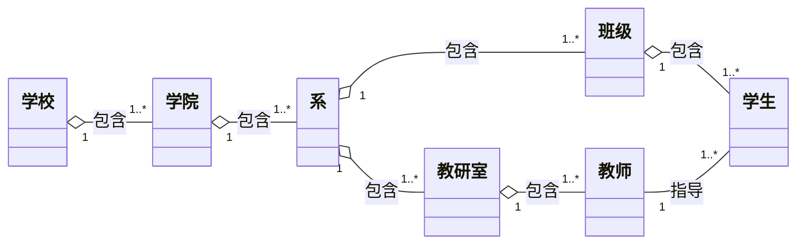

## 2. 邻国关系类图

### 题目

根据对象图，绘制出类图。
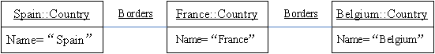
### 答案

对象图中只有一个类 `country`，该类具有一个属性 `name: char`。对象图中的“-邻国”表示国家对象之间存在自关联关系，国家与国家之间可以互为邻国。

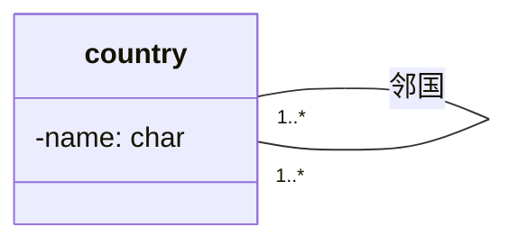

## 3. 多边形与点的类图

### 题目

根据图 2 所表示的对象图，绘制出类图。注明关联上的多重性。图要反映构成一个合法多边形最小需要多少个点及点是按顺序排列的事实。

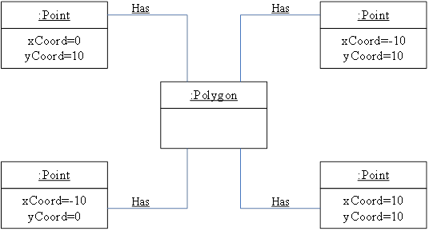
### 答案

一个合法多边形至少需要 3 个点构成，因此 `Polygon` 与 `Point` 之间的关联多重性为：一个 `Polygon` 对应 `3..*` 个 `Point`；每个 `Point` 属于 1 个 `Polygon`。同时，多边形中的点需要按照顺序排列，因此在关联上标注 `{ordered}`。

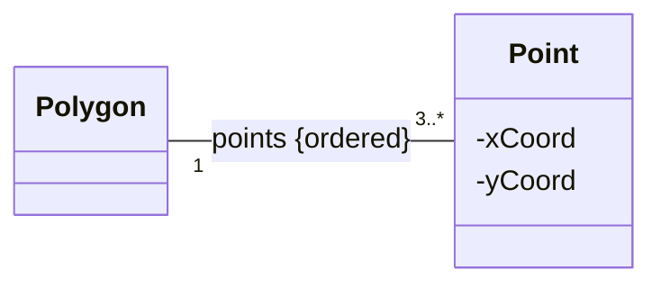

## 4. 无向图类图

### 题目

绘制一个类模型来描述无向图。无向图由一组顶点和边组成。边连接顶点对。模型应该只捕获图的结构（即连接性），不需要考虑顶点位置和边长等外形问题。
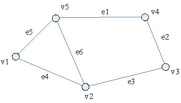
### 答案

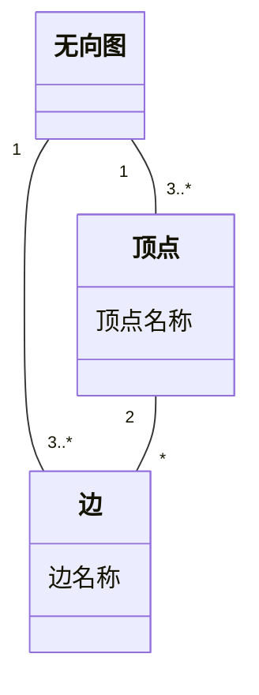

## 5. 多组类的类图

### 题目

为下面的每一组类绘制一个类图。需要表达类间关联、聚集、组成、泛化等关系，以及多重性、角色名等内容。可以添加类。

- A：学校、操场、校长、教室、书本、学生、教师、餐厅、公共厕所、计算机、课桌、椅子、尺子、门、秋千。
- B：汽车、引擎、车轮、刹车、刹车灯、车门、电池、消声器、排气尾管。
- C：文件系统、文件、ASCII 文件、二进制文件、目录文件、磁盘、驱动器、磁道、扇区。

### A. 学校相关类图

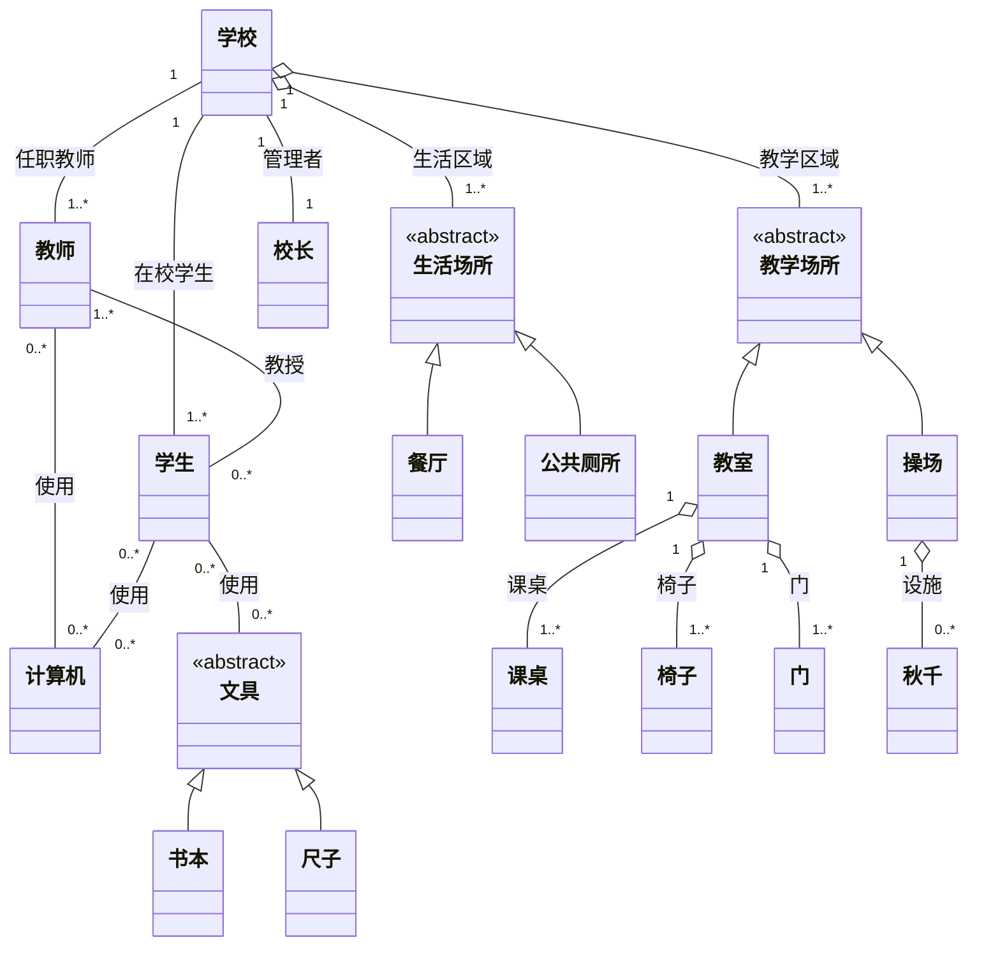

### B. 汽车相关类图

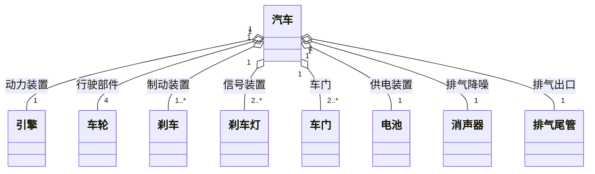

### C. 文件系统相关类图

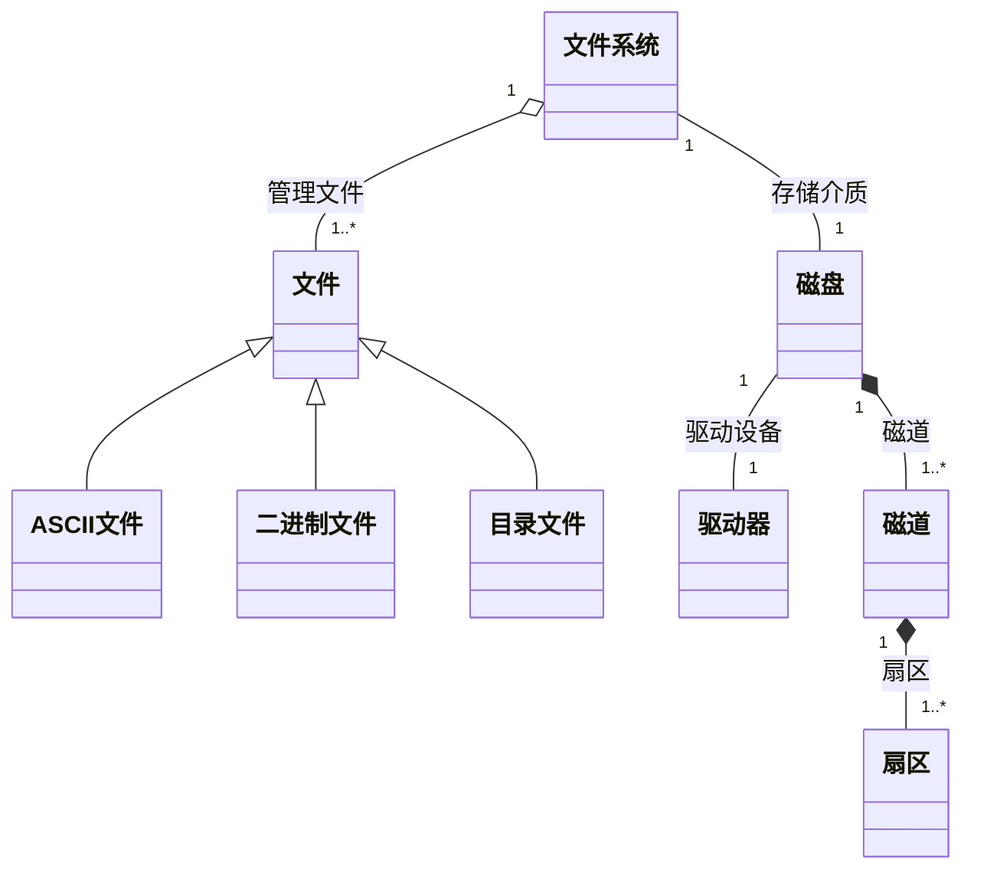

## 6. 关系分类

### 题目

把下列关系分类为：泛化、聚合、关联。

- A：一个国家有一个首都。
- B：用餐者使用筷子。
- C：文件要么是普通文件，要么是目录文件。
- D：文件包含记录。
- E：多边形由有序点组成。
- F：绘制的对象是文本、几何对象。
- G：鼠标和键盘是输入设备。
- H：某学生选择了某教授的课程。

### 答案

| 序号 | 关系描述 | 关系类型 |
| --- | --- | --- |
| A | 一个国家有一个首都 | 关联 |
| B | 用餐者使用筷子 | 关联 |
| C | 文件要么是普通文件，要么是目录文件 | 泛化 |
| D | 文件包含记录 | 聚合 |
| E | 多边形由有序点组成 | 聚合 |
| F | 绘制的对象是文本、几何对象 | 泛化 |
| G | 鼠标和键盘是输入设备 | 泛化 |
| H | 某学生选择了某教授的课程 | 关联 |

## 7. 旋转电机分类类图

### 题目

下面是旋转电机的分类。为了分析方便，电机会分为交流电机、直流电机。交流电机可以是同步电机、也可以是感应电机。直流电机包含永磁电机和通用电机两种。用类图显示各种电机之间的关系。

### 答案

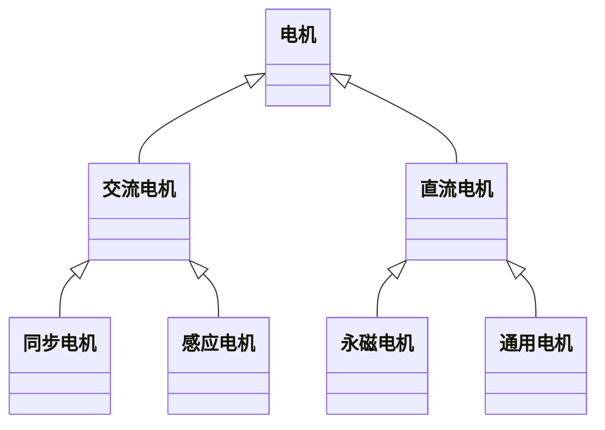

## 8. 词典单词类图

### 题目

绘制一个类模型来表示词典中的单词。包括以下内容：拼写、发音、含义、词性（名词、动词、形容词、副词）、词源、其他拼写、同义词、反义词。

### 答案

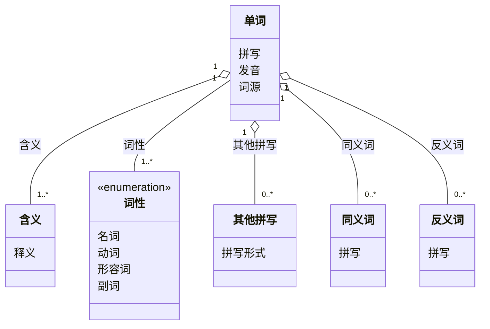

## 9. 伸缩梯状态图

### 题目

伸缩梯上有绳子、滑轮和插销，可以升起、放下和锁住。当插销锁住时，伸缩梯会被固定住，你可以很安全地爬上梯子。为了松开插销，需要用绳子稍微升起伸缩梯，然后可以自由地升降伸缩梯。当插销穿过梯子横档时，会发出劈啪的声响。在反方向升起伸缩梯时，插销会重新啮合，就像插销正在穿过横档一样。绘制一个伸缩梯的状态图。

### 答案

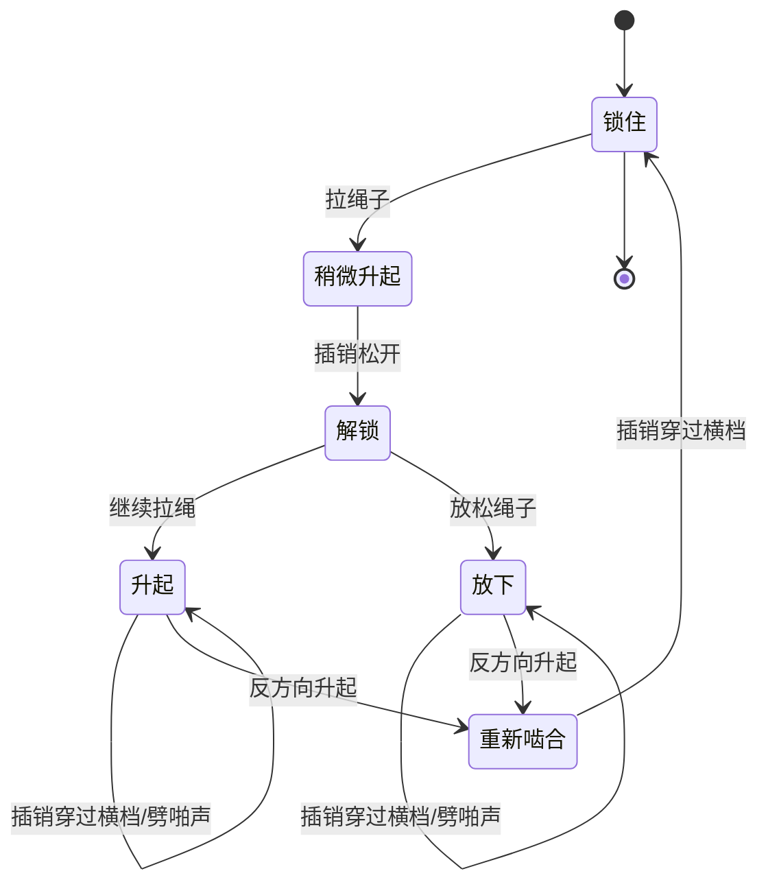

## 10. 数字手表状态图

### 题目

简单的数字手表上面有一个显示屏和两个设置按钮 A、B。此表有两种操作模式：显示时间和设置时间。

- 在显示时间模式下，手表会显示小时和分钟，小时和分钟有闪烁的冒号分隔。
- 设置时间模式有两个子模式：设定小时和设定分钟。
- 按钮 A 用于选择模式。在每次按下 A 时，模式会连续前进：显示、设定小时、设定分钟和显示时间。
- 在子模式内，只要按下按钮 B，就会拨快小时或分钟。在按钮生成另一个事件前必须释放它们。

### 答案

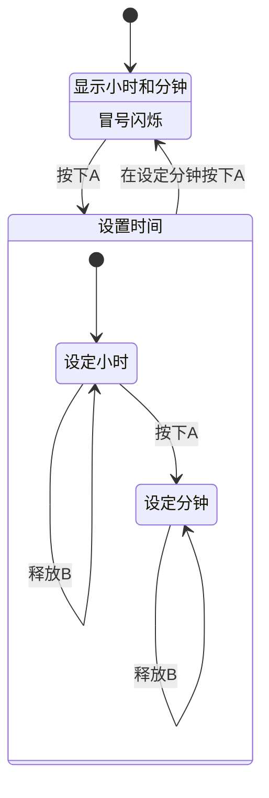

## 11. 电话应答控制状态图

### 题目

电话的应答控制过程如下：

- 首次响铃时，应答机会检查到达呼叫，然后用预先录制的应答回复呼叫。
- 当应答完成时，机器会记录呼叫端的消息。
- 当呼叫端挂起时，机器也会挂起并关闭。
- 提示：状态：挂起、回复、记录。

### 答案

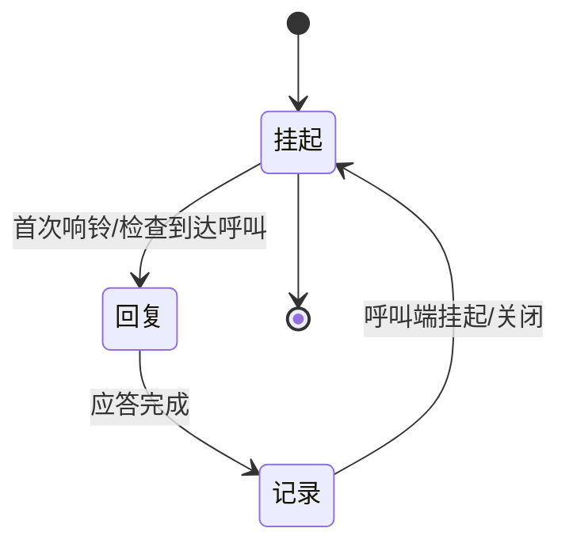

## 12. 马达控制状态图

### 题目

下图是一个没有完成的状态图，用于描述某种家用电器的马达控制。独立的家电控制会确定马达何时自动启动，并在马达应该运转时连续发出断言 on 作为马达控制的输入。

- 当 on 被断言时，马达控制应该启动并且运转马达。接通线圈 start 和 run 上的电源，马达启动。
- 传感器 starting delay 确定马达启动的时间，达到传感器 starting delay 时，线圈 start 会关掉，只剩下线圈 run 上还在加电。
- 当 on 没有被断言时，两个线圈都会关闭。
- 如果马达变得太热，马达控制就会关闭两个线圈的电，并忽略任何 on 断言。直到有重置按钮按下，并且马达冷却下来。

### 答案
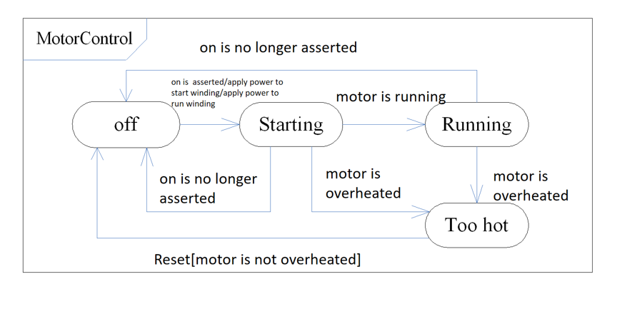

## 13. 书店购书顺序图

### 题目

考虑一个真实的书店，例如在购物中心的那种书店。对于正常购书场景，绘制一张顺序图。

### 答案

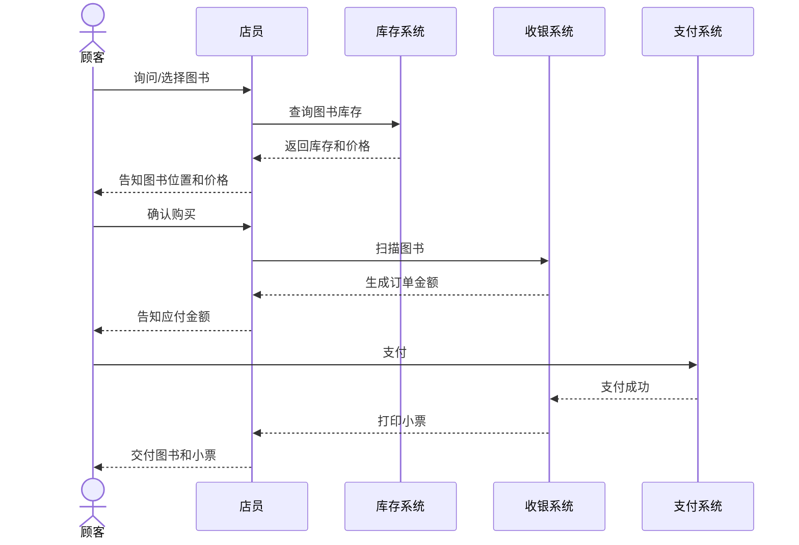

## 14. 餐厅账单计算活动图

### 题目

绘制一张活动图，描述如何计算餐厅账单。每次上餐都应该收费。对于 6 人或更多人的一组，要按总量收费，并收取 18% 作为服务费。对于更少人的组，应该有一个表示消费的空项，客户自愿支付消费。客户递交的任何优惠卷和礼物凭证都要从总费用中减去。

### 答案

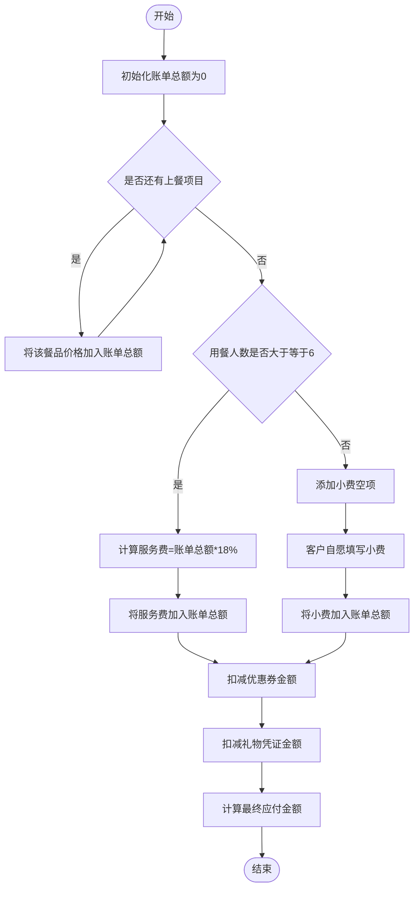

## 15. 飞行奖励积分活动图

### 题目

绘制一张活动图，描述飞行奖励积分。某某航空公司的飞行奖励积分以里程数记。乘客乘坐该航空公司的飞机，航空公司记录其里程，并累计起来，以作为奖励依据。其记录方法为：

- 金卡持有者如旅行里程的 125% 少于 1000 公里，按 1000 的里程数，否则按里程的 125% 算。
- 红卡持有者如旅行里程的 150% 少于 1000 公里，按 1000 的里程数，否则按里程的 150% 算。
- 普通乘客若旅行的里程少于 750 公里，按 750 公里计算里程数。

### 答案

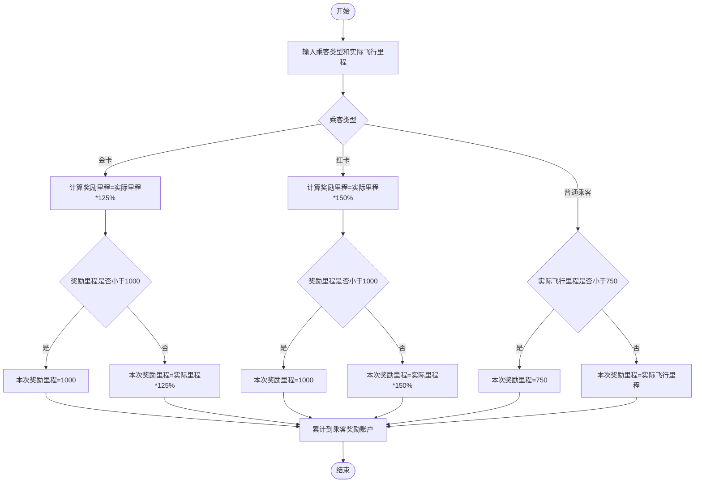
