# 工业软件开发技术
## 绪论
### 软件的定义
软件包括**程序、数据和文档**。
### 软件的分类
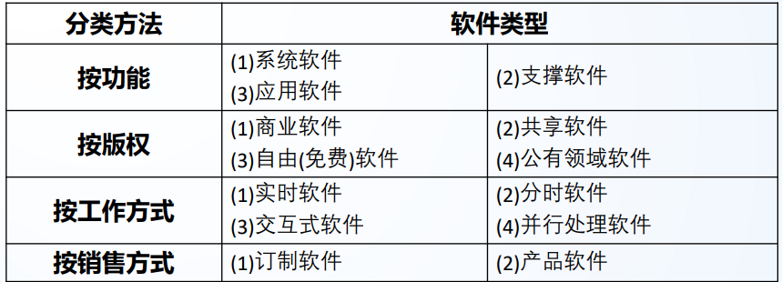
### 软件的质量特性
正确性、可靠性、简明性、有效性、可维护性、适应性

### 软件的发展阶段
程序设计时代、程序系统时代、软件工程时代

### 工业软件的分类
运营管理类、生产控制类、研发设计类、协同集成类、嵌入式开发类
### 软件开发方法
面向过程开发方法、面向数据开发方法、面向对象开发方法

## 软件的生命周期
软件生命周期由**软件定义、软件开发、运行维护**三个时期组成。
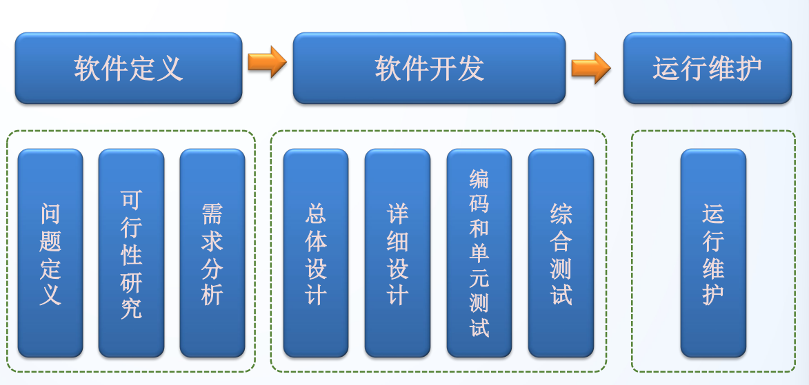

## 软件开发过程模型
瀑布模型、改进的瀑布模型、快速原型模型、增量模型、螺旋模型、
## 统一软件开发过程基本原理
迭代式开发、管理需求、使用基于构件的体系结构、可视化建模、验证软件质量、控制软件变更。
## RUP核心工作流
RUP有9个工作流，其中**业务建模、需求、分析与设计、实现、测试、部署**为核心工作流，**配置与变更管理、项目管理、环境**为核心支持工作流。
## RUP软件开发生命周期
RUP把软件生命周期（工作阶段）划分为**初始阶段、精化阶段、构建阶段、移交阶段**。
## 软件需求的定义
软件需求包括三个不同层次：**业务需求、用户需求、功能需求和非功能需求**
## 需求开发的总体过程
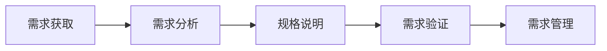
```mermaid
flowchart LR
    A[需求获取] --> B[需求分析] --> C[规格说明] --> D[需求验证] --> E[需求管理]
```
## 结构化分析方法
结构化需求分析使用**自顶向下，逐层分解**的系统分析方法来定义系统的需求
### 结构化分析结果的描述方法
- 一套分层的数据流图和实体联系图
- 一本数据词典
- 一组小说明
- 其他补充材料
## 数据流图
数据流图一般有两种典型的结构，分别反映两种问题类型：**变换型问题和事务型问题**
### 数据流图的基本组成元素
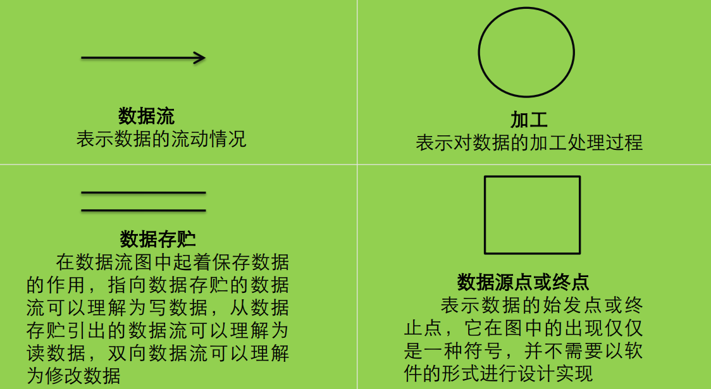
### 数据流
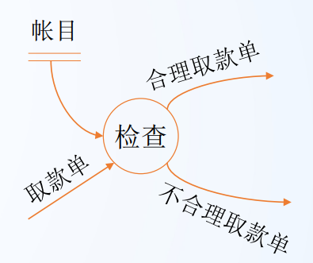

数据流表示数据的流动情况，用带有名字的具有箭头的线段表示，名字称为数据流名，表示流经的数据。流入或流出数据存贮的数据名称可以省略。
### 数据流的使用约定
- 数据流上必须标出名字，名字应能反映数据流的含义，流入或流出数据存贮的数据名称可以省略，因为文件本身就足以说明数据流。
- 数据流不允许同名。
- 两个数据流在结构上相同是允许的，但必须体现人们对数据流的不同理解。
- 两个加工之间可以有几股不同的数据流，这是由于它们的用途不同，或它们之间没有联系，或它们的流动时间不同。
### 数据流图例1
培训中心为有关行业的在职人员开设了很多课程，有兴趣的人可以来电或来函选修某门课程，成为该培训中心的学员，培训中心要收取一定的费用，学员通过支票付款，学员也可以来电或来函查询课程计划等有关事项。
将学员发来的电报、信件、电话收集分类后，按照几种不同情况处理。如果是报名的，则将报名数据送给负责报名事务的职员，他们要查阅课程文件，检查某课程是否额满，然后在学员文件、课程文件上登记，并开出报名单交财务部门，财务部门再开出发票经复审后通知学员。如果是付款的，则由财务人员在帐目文件上登记，再经复审后也给学员一种通知单。如果是查询的，则交查询部门查阅课程文件后给出答复。如果是想注销原来已经选修的课程，则由注销人员在课程、学员、帐目文件上相应修改，经复审后通知学员。对一些要求不合理的函电，培训中心将拒绝处理。

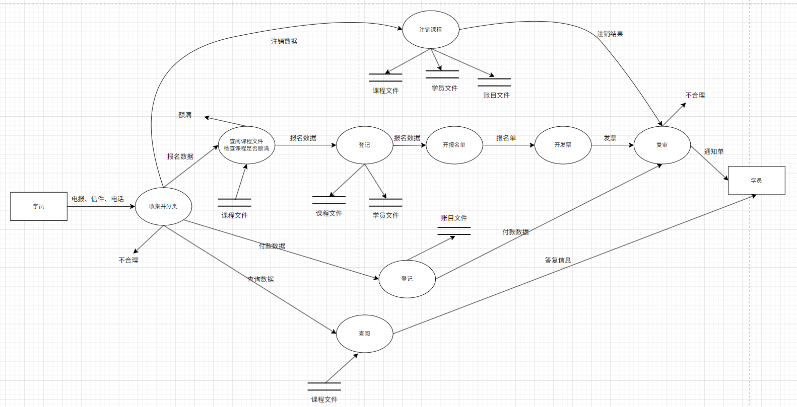
### 分层数据流图（例）
为提高设备利用率和降低设备的故障率，某公司需要开发一个设备管理系统，对公司的所有设备的基本资料和日常维护进行管理。该系统应包含如下功能：
（1）维护公司所有设备的基本资料，能够生成设备台账、设备结构清单和设备维修计划等报表文件；
（2）按照设备的检修要求，对设备进行定期检修；
（3）生产部门在使用设备过程中遇到故障时，能够生成报修单，提交设备管理部门进行维修，并对维修情况进行管理；
（4）设备维修的费用上报公司财务部门。

设备的基本资料包括设备的名称、编号、使用部门、存放地点等。显然，当购进新的设备时，这些信息都需要由设备管理部门进行输入。而且，当设备的某一项属性（如设备的存放地点）发生变化时，需要对设备信息进行更新。因此，需要一个管理设备基本信息的加工，用于维护公司的设备信息。当设备管理部门在录入或修改完设备的基本资料后，这些资料信息就更新进入系统的设备信息文件中。

生产部门在使用设备过程中，遇到设备故障时，将通过报修处理向系统提交报修单，系统通过读取报修单来启动维修过程。


系统要有一个加工来处理维修信息，如根据报修单和设备信息启动设备维修，根据设备信息，启动设备检修，并最终生成维修记录上报维修费用。

为了能生成一系列的报表，需要定义一个专门用来生成报表的加工，称报表管理。它通过读取设备信息和设备维修记录信息生成各种报表。

**顶层数据流图**
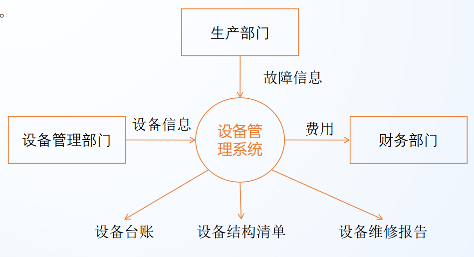
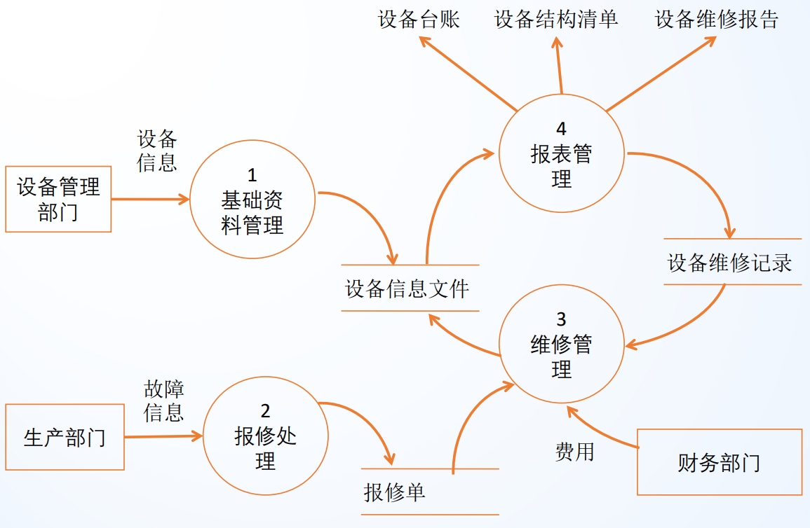

***以下内容到结构化设计之前复习课未提及，但是作业中有因此保留，可以跳着看***
### 数据词典
实际中常采用数据词典对数据流图作进一步的详细说明。 数据词典包括**数据流、数据存贮和加工**等条目类型。
#### 数据流
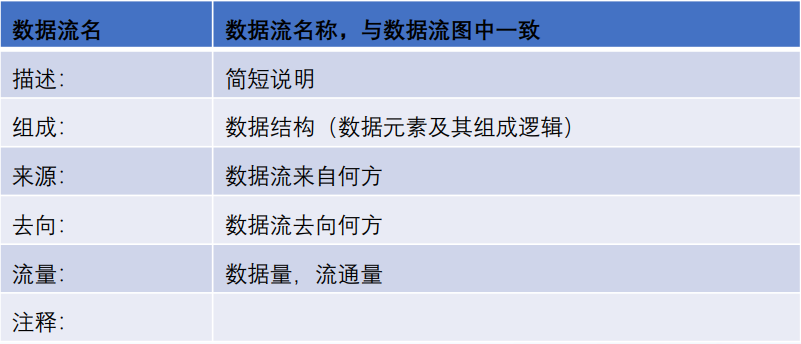
#### “组成”的表示
由数据元素组成数据的方式主要有三种：**顺序、选择、重复**。
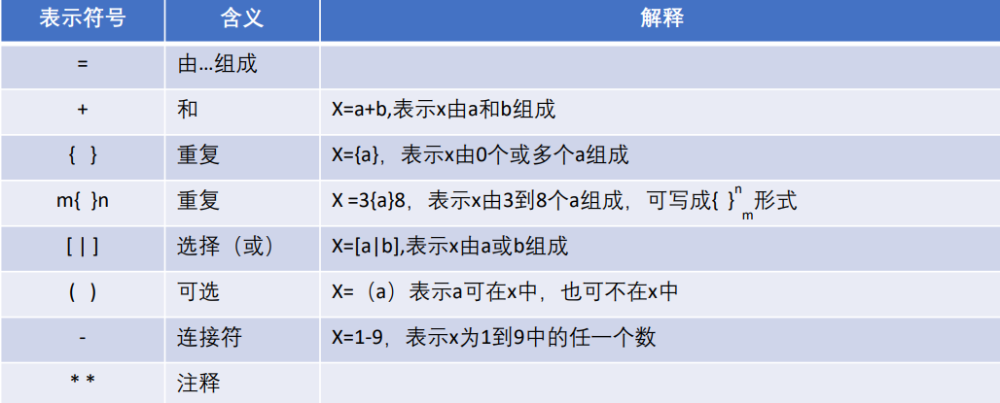

例如：
- {货名＋数量＋单价＋总价}$_1^5$
- 查⽆此书 | 符合条件的图书数量 + {图书馆藏号 + 图书类别 + 书名 + 作者 + 出版社 + 出版⽇期 + 在库册数}
#### 数据存储
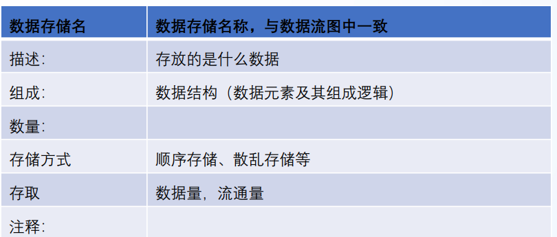
#### 加工
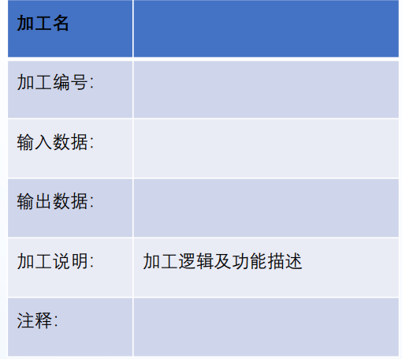
#### 结构化语言写的加工的说明
结构化语言是一种比自然语言精确，比形式化语言灵活易懂的语言。它没有严格的语法，它的结构通常分为内、外两层。 外层负责描述控制结构，如顺序、选择、循环等信息。 内层负责描述具体的加工信息，内层一般可以用更接近自然语言的语句书写。其一般的特点为：
- 只使用祈使句，它能明确地表达“做什么”
- 名词尽量是数据词典中的词
- 不要用形容词、副词等修饰语
- 可以用一般的数值、逻辑运行符，如＋－×/ and or等用户容易理解的符号。
  
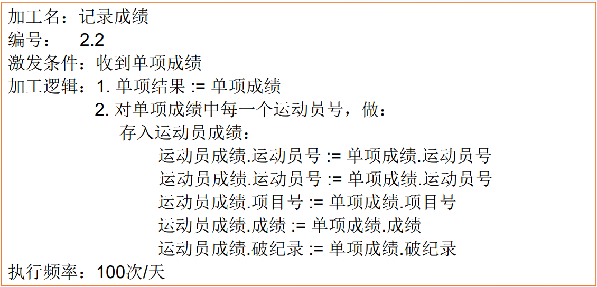
#### 判定表
检查定货单的加工逻辑为：如果金额超过500元，又未过期，则发出批准单和提货单，如果金额超过500元，但过期了，则不发出批准单；如果金额低于500元，则不论是否过期，都发出批准单和提货单，在过期的情况下还需要发出通知单。
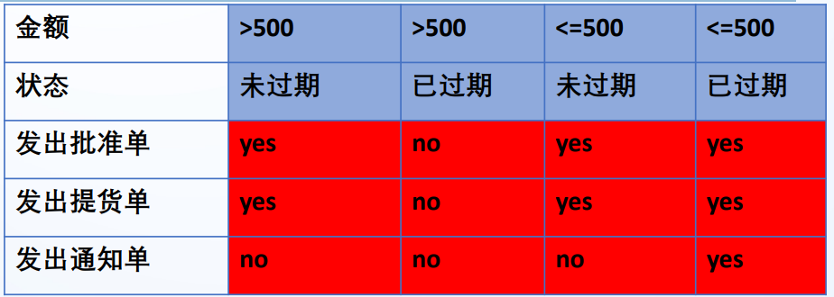
#### 判定树
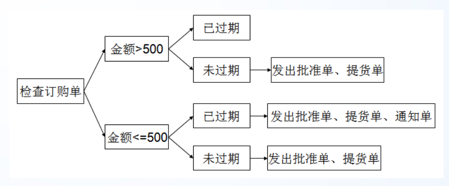
#### 适用场合
- 对于一个不太复杂的判断逻辑(条件组合和行动只有10个左右)，使用判定树比较好。
- 对于一个复杂的判断逻辑(条件较多，相应的行动也较多)，使用判定表比较好。
- 若一个处理逻辑既包含了一般的顺序执行动作，又包含了判断或循环逻辑，则使用结构化语言比较好。
## 结构化设计
### 软件设计阶段的任务
对软件解决问题的方案和具体方法进行建模，并使用**程序结构图**和**程序流程图**等模型描述程序的执行过程。
### 模块化设计设计原则
- 模块完成独立的功能
- 符合信息隐蔽和信息局部化原则
- 模块间关连和依赖程度尽量小
### 模块的耦合性
两个模块之间的耦合有6种形式，按照耦合程度由低到高排列为：**数据耦合、标记耦合、控制耦合、外部耦合、公共耦合、内容耦合**。
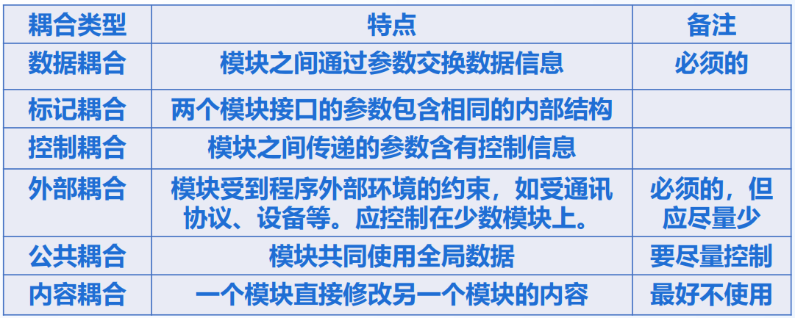

**什么叫标记耦合**
假设你去快递站拿快递，工作人员只需要核对你的名字和手机号。

理想的做法（数据耦合）：你直接口头告诉他你的名字和手机号。他拿到需要的信息，把快递给你。

标记耦合的做法：你把你的整个户口本和个人详细体检报告直接甩给了他。他翻开资料，确实从中找到了你的名字和手机号，但同时他也接触到了你的家庭住址、病史和家庭成员信息——这些都是他根本不需要的东西。

在这里，你和快递员之间就形成了“标记耦合”：你传了一个“大包裹”，但他只用了里面的两个“小物件”。

**什么叫控制耦合**
假设你要打车去机场。

好的做法（数据耦合）：你上车对司机说：“师傅，去机场（传递数据）”。至于走哪条路、怎么避开拥堵、什么时候换挡，全由司机自己决定。

控制耦合的做法：你上车对司机说：“师傅，前方路口左转，然后挂二挡，踩油门，看到红绿灯再踩刹车……”

在这种情况下，你不仅仅是给司机提供了一个目的地，你还在控制司机开车的内部操作流程。这就形成了控制耦合。

典型的控制耦合
```java
// 调用方通过 isVIP 这个布尔值，直接指挥函数内部走哪条分支
void calculatePrice(double amount, boolean isVIP) {
    if (isVIP) {
        System.out.println("VIP客户，打8折：" + (amount * 0.8));
    } else {
        System.out.println("普通客户，原价：" + amount);
    }
```

在Java中，`System.out.println`就是打印输出。

如何修正（拆分功能，消除控制耦合）
```java
// 把不同的逻辑拆分开，把控制权交还给调用方自己去判断
void calculateVipPrice(double amount) {
    System.out.println("VIP客户，打8折：" + (amount * 0.8));
}

void calculateNormalPrice(double amount) {
    System.out.println("普通客户，原价：" + amount);
}
```
### 模块的内聚性
内聚性是指一个模块内部各组成部分之间（如语句之间或语句段之间）的联系的紧密程度。

内聚性从高到低有7种：**功能内聚、顺序内聚、通信内聚、过程内聚、时间内聚、逻辑内聚、偶然内聚**。

#### 偶然内聚
如果一个模块的内部各组成部分的处理动作彼此没有任何联系，则称为偶然内聚。往往因为有多个模块有一段程序是相同的，为了节省程序量，而把这一段程序作成一个模块，而实际上这段程序内部的各部分没有什么联系。

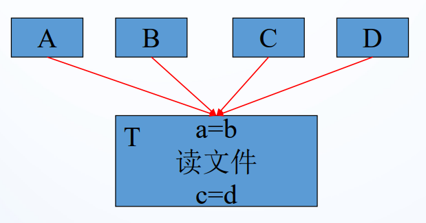
#### 逻辑内聚
如果一个模块内部的各组成部分的处理动作在逻辑上相似，但功能都彼此不同或无关，则称为逻辑内聚。
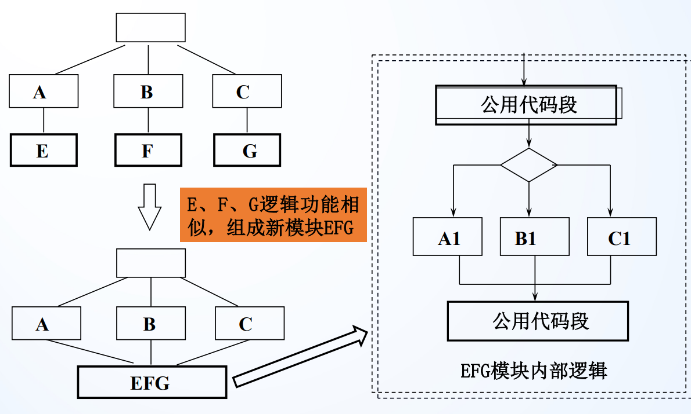
#### 时间内聚
模块完成的功能必须在同一时间内执行，这些功能只因时间因素关联在一起。
初始化系统模块、系统结束模块、紧急故障处理模块等
#### 过程内聚
如果一个模块内各组成部分的处理动作各不相同，彼此也没有联系，但它们都受同一个控制流支配，决定它们的执行次序，称为过程内聚。
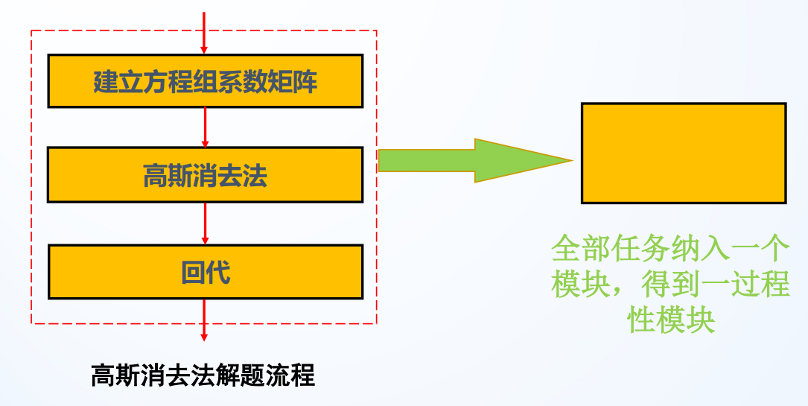
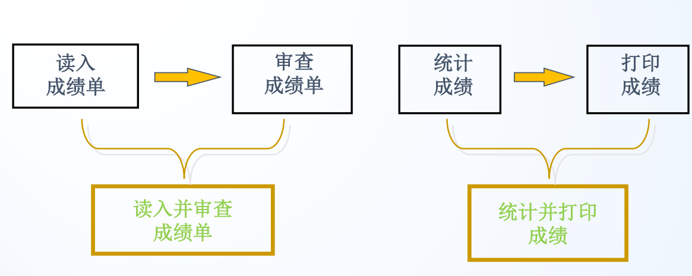

#### 通信内聚
如果一个模块内各组成部分的处理动作都使用相同的输入数据或相同的输出数据，称为通信内聚。

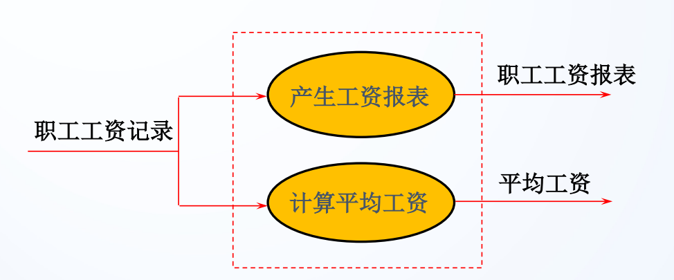

#### 顺序内聚
如果模块内一个内部成分的输出是另一个内部成分的输入，则属顺序内聚。也就是说，模块中一个成分依赖于另一个成分。

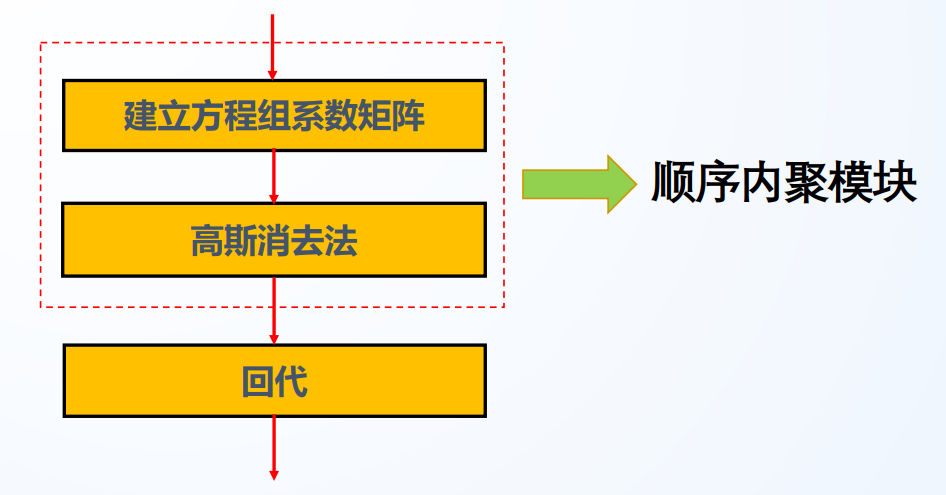
#### 功能内聚
一个模块仅包括为完成某个功能所必须的所有成分，即模块所有成分共同完成一个功能，缺一不可 ，则成为功能内聚。内聚性最强
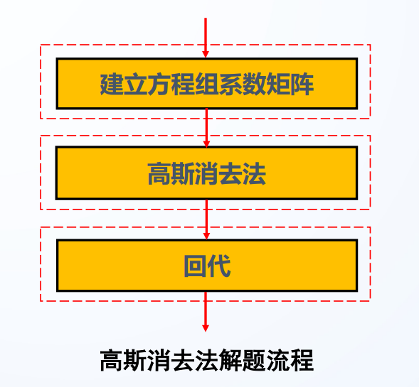
### 程序结构图
程序结构图中主要包括：**模块，调用，数据和控制**
- 模块以矩形框表示，框中标有模块的名字。对于已定义（或者已开发）的模块，则可以用双纵边矩形框表示


- 调用：从一个模块指向另一个模块的箭头表示了前一个模块中含有对后一个模块的调用．
- 数据：以表示调用关系的长箭头旁边的**短箭头**表示，短箭头的方向和名字分别表示调用模块和被调用模块之间信息的传递方向和数据．
- 控制：当模块A有**条件**的调用模块B时，在箭头的起点标以**菱形**。模块A**反复**地调用模块D时，另加一**环状箭头**。
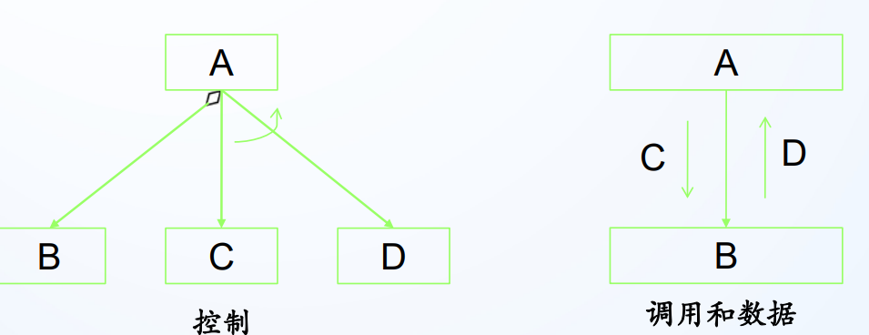
#### 模块类型
传入模块：从下属模块取得数据，经过某些处理，再将其传送给上级模块
传出模块：从上级模块取得数据，进行某些处理，传送给下属模块
变换模块：从上级模块取来数据，进行特定处理后，送回原上级模块
协调模块：对其下属模块进行控制和管理的模块
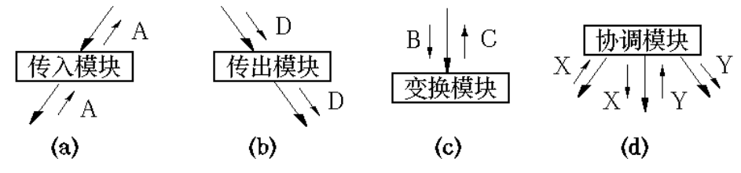
### 从数据流图导出程序结构图
数据流图一般有两种典型的结构，分别反映两种问题类型：**变换型问题和事务型问题**
#### 变换型问题
从（程序）“外部”取得数据（例如从键盘、磁盘文件等），对取得的数据进行某种变换，然后再将变换得到的数据传回给“外部”。
在数据流图中，变换型结构表现为一种线形结构，它明显地分为三个部分：输入、主加工、输出。

**例**
先设计主加工
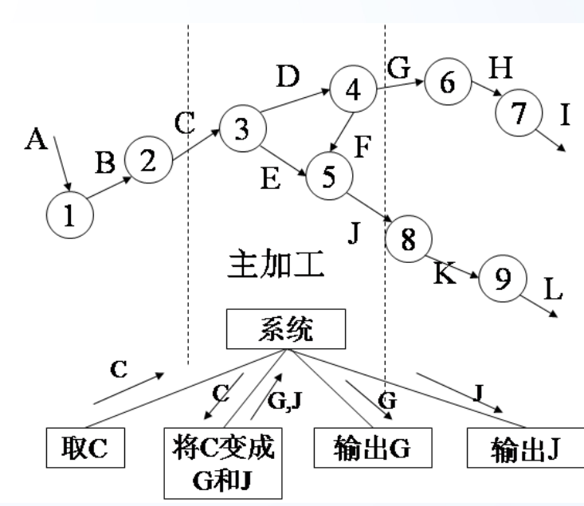

设计输入
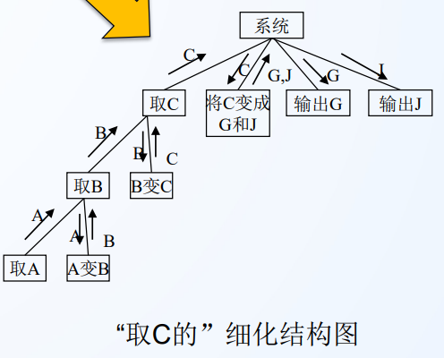

完善主加工
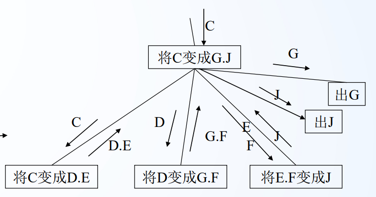

设计输出
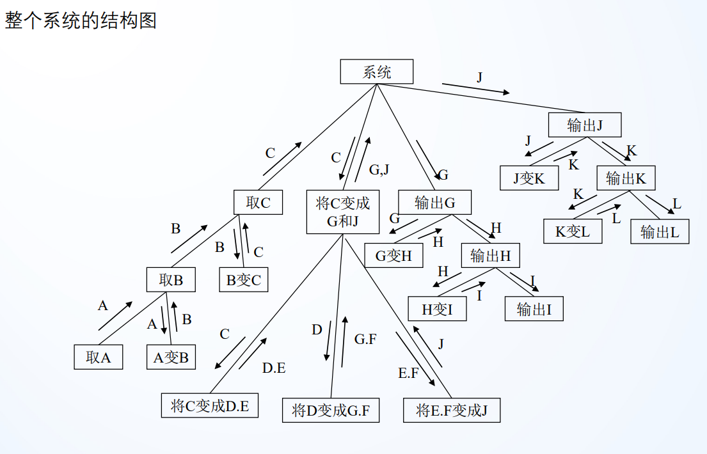

在树的同一层中，需要注意执行顺序是**从左到右**。（*树的后根遍历*）

- 当数据流图中出现环时，先将环视为一个整体，如上图中`将C变为G和J`这一块，然后再根据环内的执行顺序将环的内容作为下一级的内容。
#### 事务型问题
在接受某一项事务后，根据事务的特点和性质，选择分派给一个适当的处理单元，然后给出结果，这类问题就是事务型问题。
它的特点是，数据沿着接收分支把外部信息（数据）转换成一个**事务项**，然后计算该事务项的值，并根据它的值从多条数据流中选择其中的某一条数据流。发出多条数据流的处理单元叫**事务中心**。
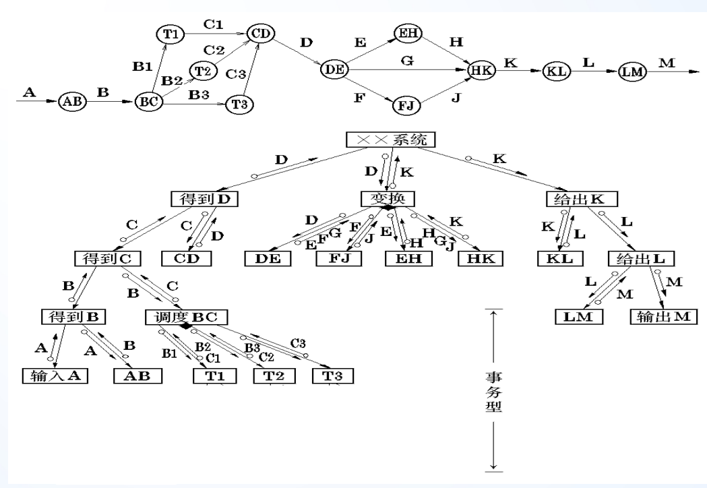

**事务型部分数据流图的特点**
- 中间环节是T1,T2,...而不是全字母
- 输入和输出会带数字，如B1,C1

#### 例题
数据流图转程序结构图


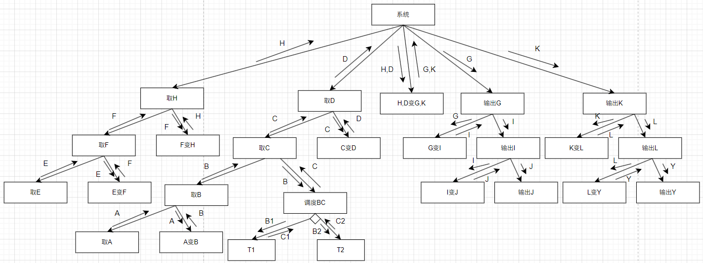
### 基本控制结构
任何程序逻辑都可以用**顺序结构、选择结构和循环结构**三种基本控制结构来表示。
### 程序流程图 FC
流程图包含三种基本成分：
- 加工步骤—用方框表示
- 逻辑条件—用菱形框表示
- 控制流—用箭头表示
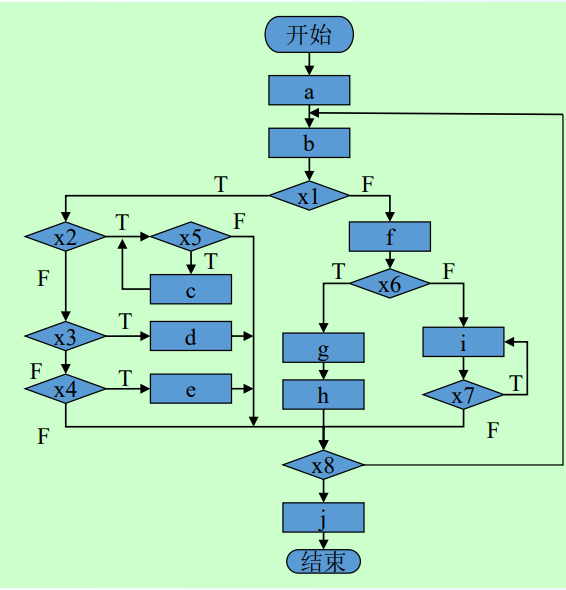

开始和结束使用胶囊框
### 盒图 NS
NS中常用两个盒子，数据盒和过程盒：
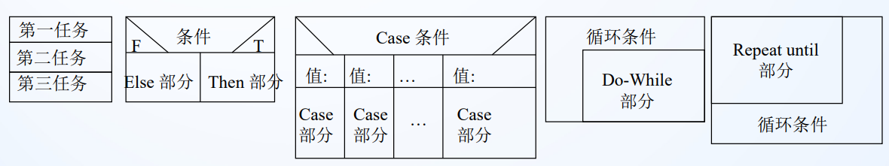
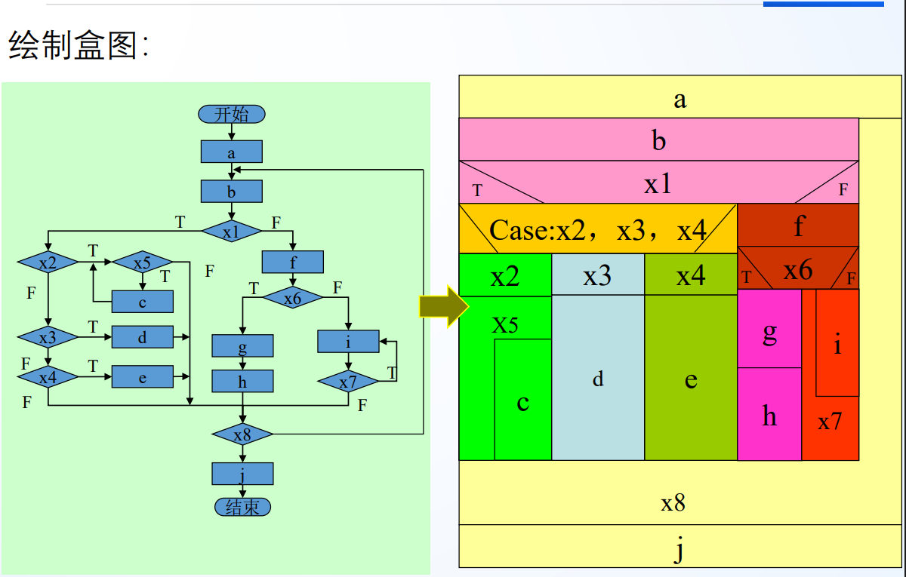

竖条在左边就是Do While，其横条在上面还是下面取决于执行顺序；竖条在右边就是Repeat until，横条同理。
### 问题分析图 PAD
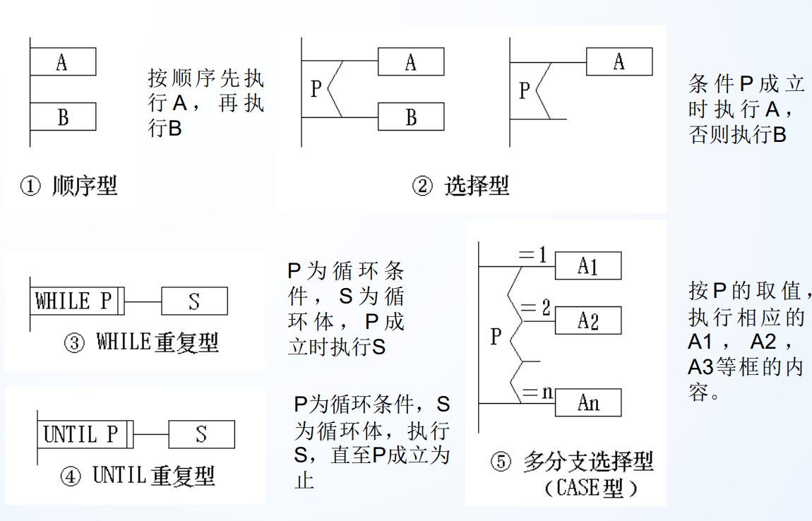
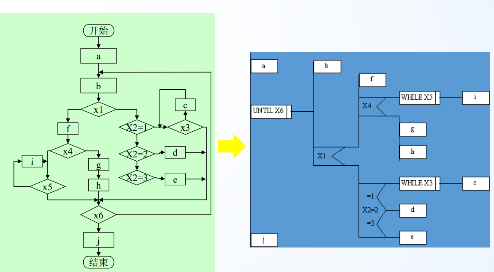

### 例题
```pascal
k ← n; FLAG ← 1
WHILE FLAG > 0 DO
    k ← k - 1
    FLAG ← 0
    FOR J ← 1 TO k DO
        IF L(J) > L(J + 1) THEN DO
            L(J) = L(J + 1)
            FLAG ← 1
        ENDDO  ENDIF
    END FOR
END WHILE
```
把这段伪代码画成以上三种图

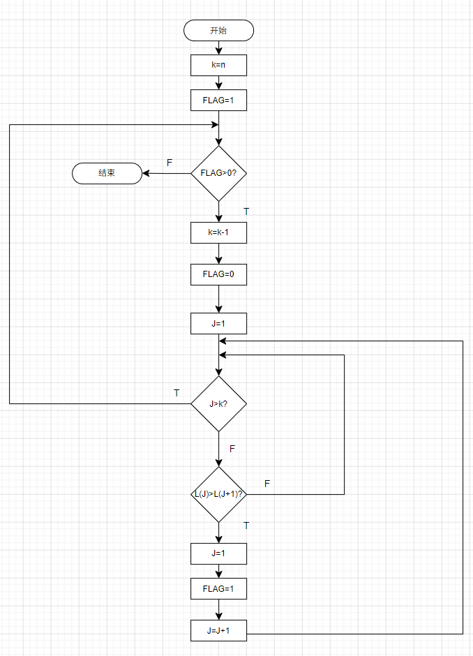
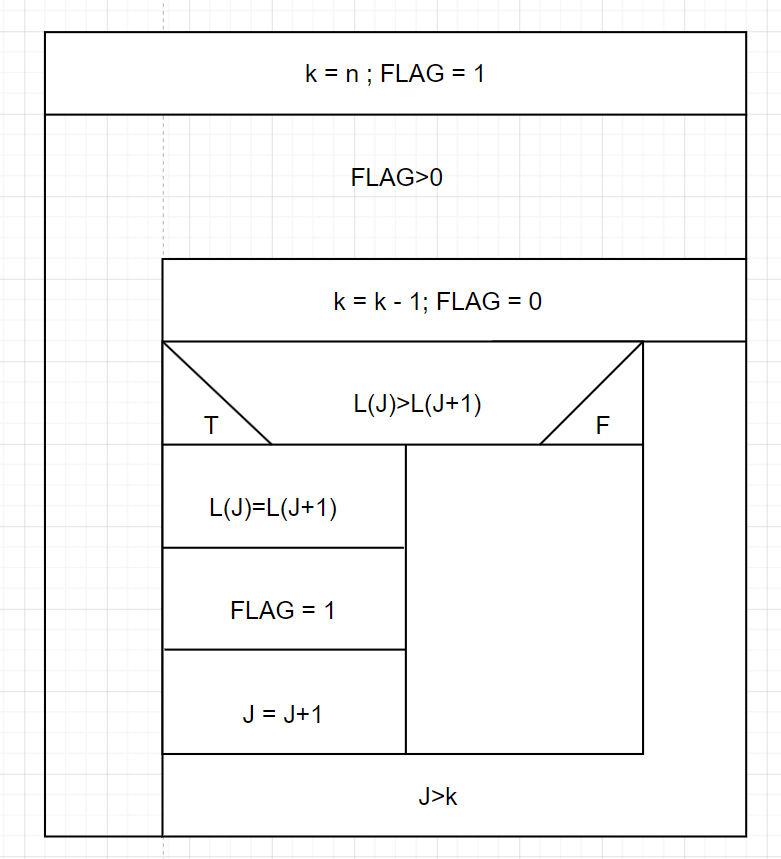
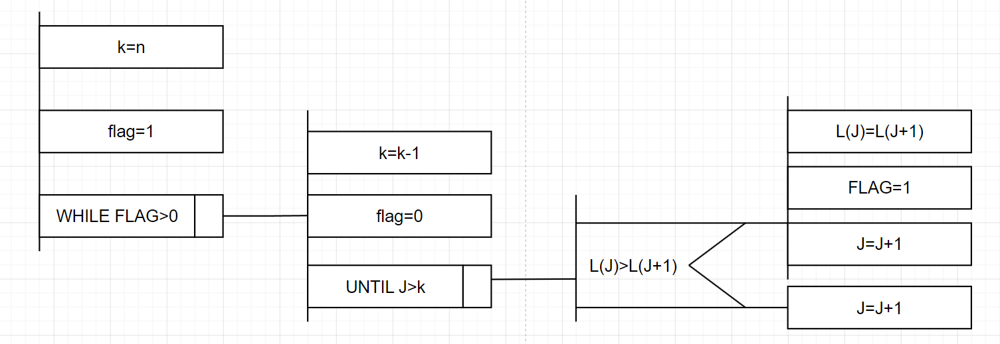
## 用例模型
创建用例模型的工作包括：**定义系统、确定参与者和用例、描述用例、定义用例间的关系、确认模型。**

参与者是系统的直接外部用户，是直接与系统通讯的一个对象或一组对象，但并不是系统的一部分。在用例图中，参与者用类似人的图形来表示。参与者就是系统的使用者。

### 用例图
#### 用例的组成
用例、边界、参与者、关联。
#### 用例关系
复杂用例可以用：**包含、扩展和泛化**关系自简单用例的基础上构建起来。
[怎么画用例图](https://www.bilibili.com/video/BV1qN41177fw)
#### 例题
在火车票预订系统中，客户可以进行购买车票、退订车票、查询余票和查询列车时刻四个操作。不管是购买车票还是退订车票，用户都必须先进行登录系统操作。其中查询列车时刻主要包括按站站查询和按车次查询两种方式。如果在登录系统的过程中忘记密码，则还可使用找回密码功能。

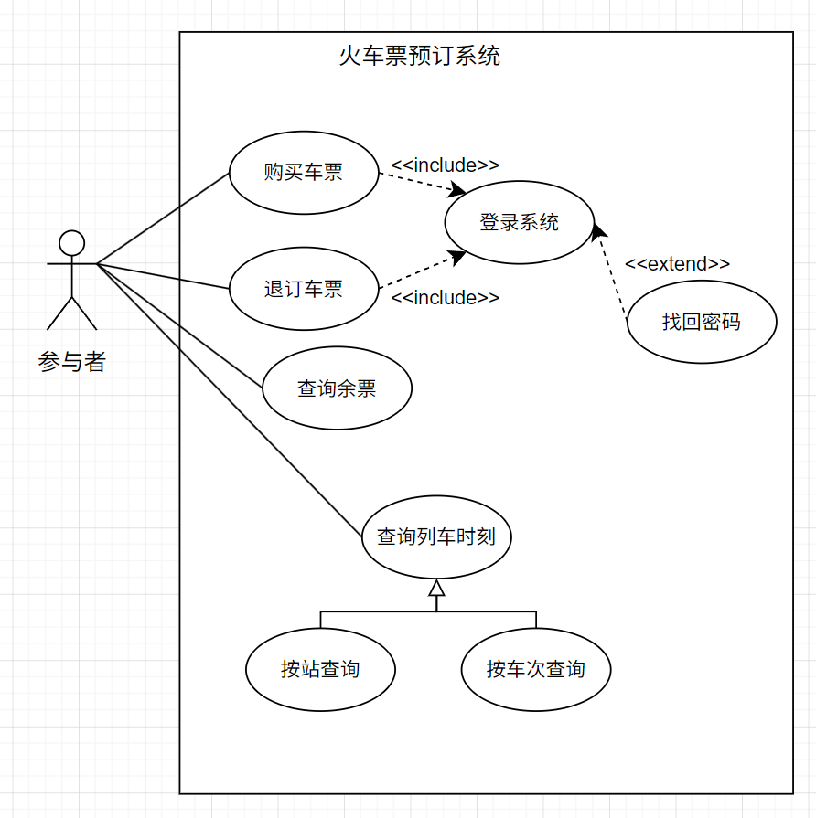
## 面向对象开发技术
### 对象模型要素
面向对象模型有4个主要要素：
**抽象、封装、模块化、层次结构**
面向对象模型有3个次要要素：
类型、并发、持久
#### 各要素定义（能根据定义写出来要素）
- **抽象**描述了一个对象的基本特征，可以**将这个对象与所有其他类型的对象区分开来**，因此提供了清晰定义的概念边界，但它与观察者的视角有关。
- *抽象是从众多的事物中抽取出共同的、本质性的特征，而舍弃其非本质的特征。例如苹果、香蕉、生梨、葡萄、桃子等，它们共同的特性就是水果。得出水果概念的过程，就是一个抽象的过程。（来自百度百科）*
- **封装**：是一个过程，它分隔构成抽象的结构和行为的元素，封装的作用是**分离抽象的概念接口及其实现**。
- **模块化**是一个系统的属性，这个系统被分解为一组**高内聚、低耦合的模块。**
- **层次结构**是抽象的一种**分级或排序**。
- **类型**是**关于一个对象的类的强制规定**，这样一来，不同类型的对象不能够互换使用，或者至少它们的互换使用受到非常严格的限制。
- **并发**是一种属性，它**区分主动对象和非主动对象**。
- **持久**是对象的一种属性，利用这种属性，对象跨越**时间**（例如，当对象的创建不存在时，对象仍然存在）和**空间**（例如，对象的位置从它被创建的地址空间移开，存入数据库）而存在。
### 对象的本质
一个对象是一个具有**状态、行为、标识符**的实体
### 类之间的关系
- **继承关系**：一般/特殊关系，表示“**是一种**”关系。例如：玫瑰是一种花，这意味着玫瑰类是花类的子类。
- **聚合关系**：整体/部分关系，表示“**组成部分**”关系。例如：花瓣不是一种花它是花的一个组成部分。
- **关联关系**：一种语义上的依赖关系，如果没有这层关系，这些类就毫无关联了。如飘虫和花之间的共生关系，飘虫保护花免遭害虫侵害，花为瓢虫提供食物来源。
- **依赖关系**：处于这种关系一端的元素以某种方式依赖于处于另一端的元素。**如果其中一个元素发生了改变，可能会影响到另一种元素。**
## 基于UML的面向对象建模
### UML
用面向对象方法开发软件，通常需要建立3种形式的模型，它们分别是：
**功能模型、静态模型、动态模型**

功能模型：用例图
静态模型：类图、对象图
动态模型：状态图、顺序图、协作图、活动图
#### UML事物
结构事物、行为事物、分组事物、注释事物
”分 屎 喂 狗“
### 类图
[怎么画类图](https://www.bilibili.com/video/BV1Wu4y1Y7ya/?spm_id_from=333.337.search-card.all.click&vd_source=895080ef8388f98ec72414af7bdfb8ad)

除了视频提到的多重性之外，关联也可以有多重性
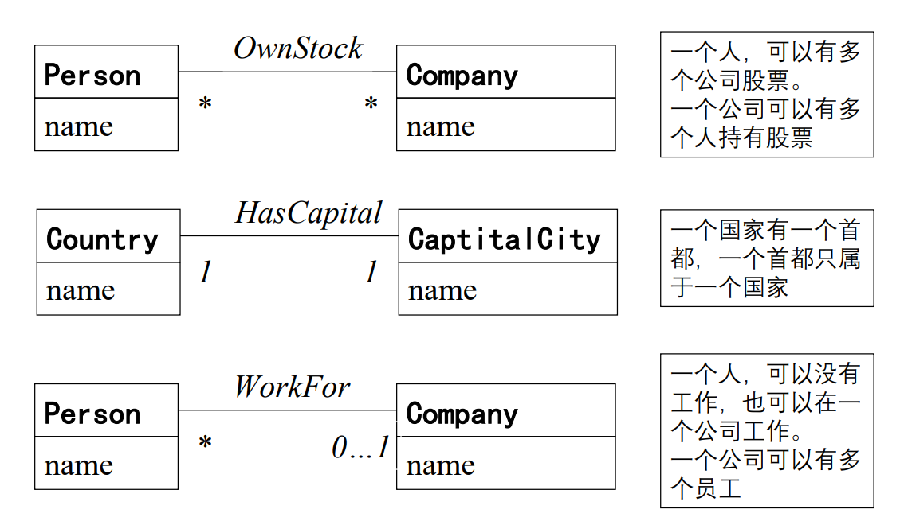
### 状态图
#### 转换五要素
源状态、目标状态、触发事件、监视条件、动作
#### 模板
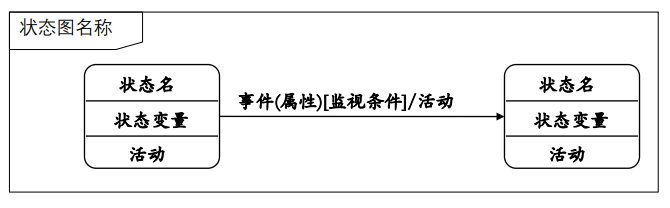

事件：触发状态转换发生的事件
监视条件：布尔表达式，决定是否激活转换
活动：状态转换时的操作
属性、状态变量不用管，不写就行
#### 事件
分为信号事件、变更事件、时间事件
#### 活动
状态框里的活动分为do, entry和exit，一般就只用到do

do活动指某个状态内持续的动作，用`do/活动名`表示
entry指进入一个状态时，执行某个动作，用`entry/活动名`表示
exit指退出某个状态时，执行什么动作，用`exit/活动名`表示
#### 示例1
汽车倒车雷达开始于闲置状态，当汽车挂倒挡倒车，雷达进入工作状态，检测车后障碍物的距离；当车距离障碍物小于1.2米时，发出低频声音警告的预备报警；当车距离障碍物小于0.6米时，发出高频声音警告的紧急报警；汽车挂前进档或者空挡，雷达进入闲置状态。

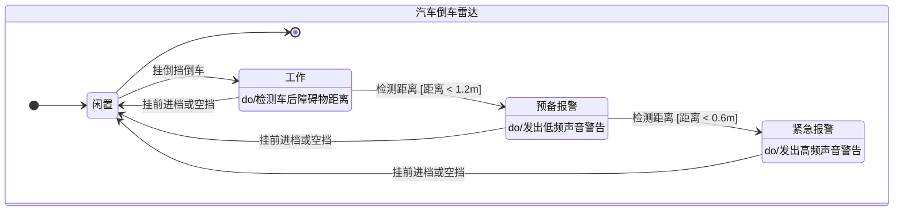
```mermaid
stateDiagram-v2
    direction LR
    state "汽车倒车雷达" as Radar {
        direction LR
        [*] --> 闲置
        闲置 --> [*]
        state "工作" as Working
        Working: do/检测车后障碍物距离
        state "预备报警" as Warning
        Warning: do/发出低频声音警告
        state "紧急报警" as Emergency
        Emergency: do/发出高频声音警告
        闲置 --> Working: 挂倒挡倒车
        Working --> Warning: 检测距离 [距离 < 1.2m]
        Warning --> Emergency: 检测距离 [距离 < 0.6m]
        Working --> 闲置: 挂前进档或空挡
        Warning --> 闲置: 挂前进档或空挡
        Emergency --> 闲置: 挂前进档或空挡
    }
```

你可能会看到把`检测距离[距离<1.2m]`直接写成`距离小于1.2米`或者`when(距离<1.2m)`等五花八门的写法，经过我的研究，结论是你想怎么写怎么写。
记得把标题写到左上角。
#### 嵌套状态
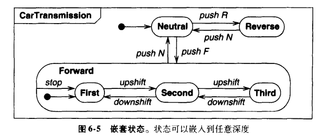
车挂挡的嵌套状态
### 顺序图
[如何画顺序图](https://www.bilibili.com/video/BV1YM411f7dr/?spm_id_from=333.337.search-card.all.click&vd_source=895080ef8388f98ec72414af7bdfb8ad)

实际上，课件上的顺序图没有任何虚线和条件分支的要求，有条件分支的那个例子在网上没有找到任何与其一样的画法。应该掌握最简单的即可。
### 协作图
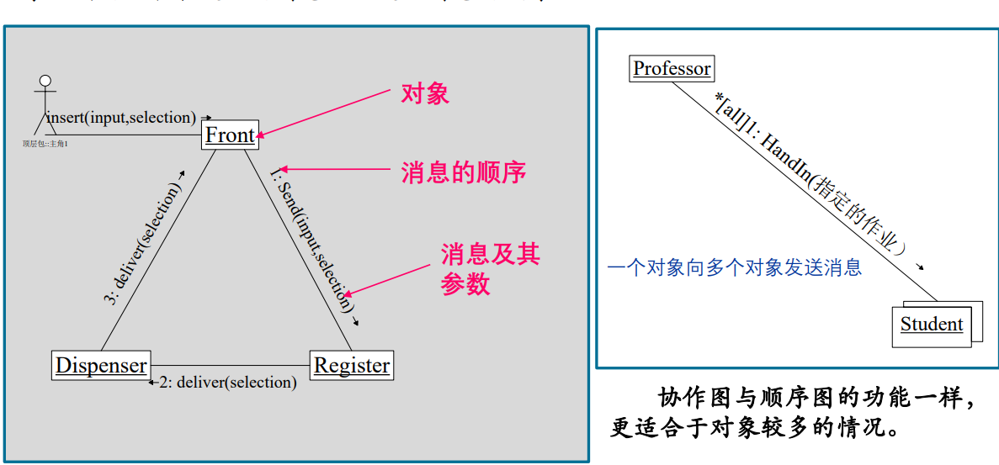
协作图比顺序图更简单，直接标明顺序即可。
### 活动图
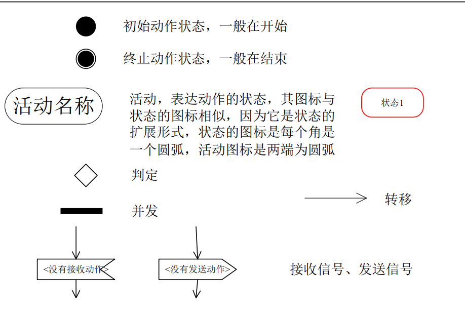

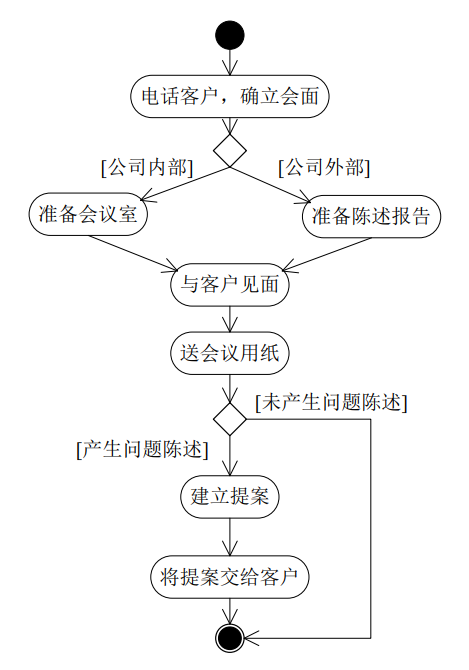

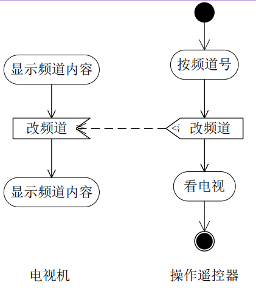

考虑一个咨询公司会见一个新客户的业务过程。活动可能是这样的：
1. 公司业务员打电话给客户，约定会面时间和地点；
2. 如果约定地点在公司之内，那么公司中的技术人员就要为会面准备一间会议室；
3. 如果约定地点在公司之外，那么咨询顾问就要用笔记本电脑准备一份陈述报告；
4. 咨询顾问和业务员与客户在约定的时间和地点见面；
5. 业务员随后给他们准备好会议用纸；
6. 如果会议产生了一个问题陈述，咨询顾问就根据问题陈述建立一个提案，并把该提案发给客户

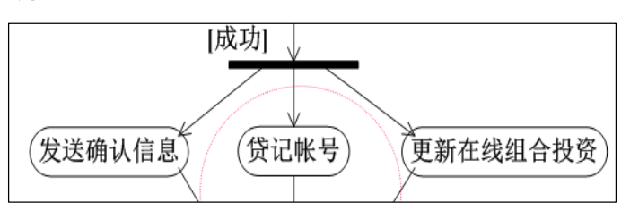
并发就是同时发生
## 第九章 面向对象分析技术
### 分析类
分析类包括3种类型：**边界类、控制类和实体类**。

鞭尸控
## 第十章 面向对象设计技术
### 子系统交互方式
客户-服务器关系（CS）、平等伙伴(PP)关系
### 子系统组织成完整系统的方案
层次组织和块状组织
### 典型体系结构风格-架构模式
1. 数据流风格
2. 主程序/子程序体系结构
3. 层次结构
4. 仓库风格
5. 客户/服务器结构
6. 浏览器/服务器结构
7. 模型-视图-控制器
8. 微内核架构
### 框架
MVC框架和MEF框架
