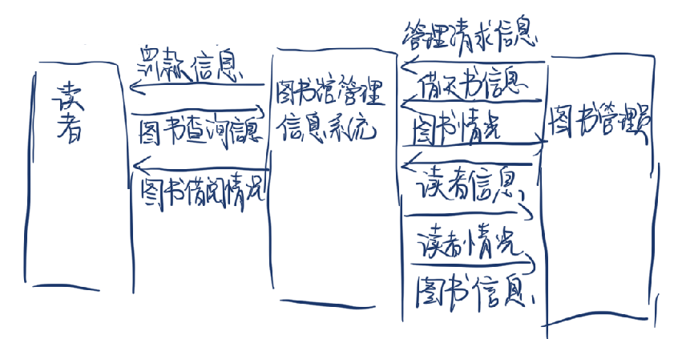
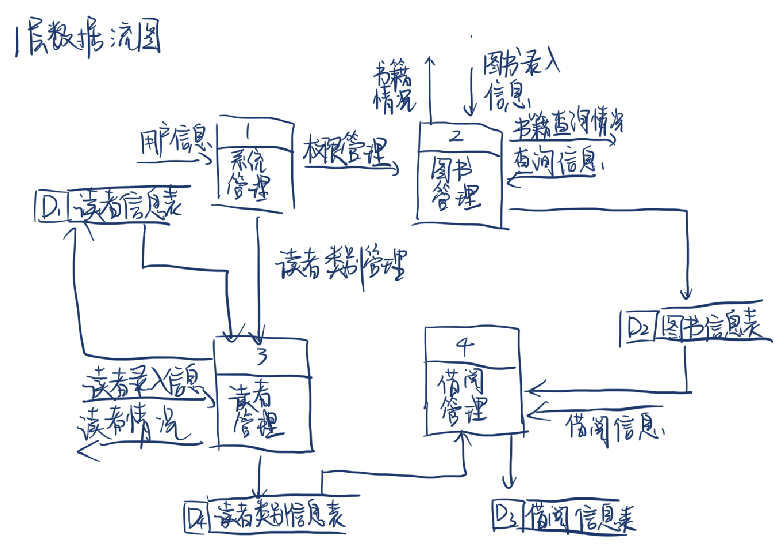
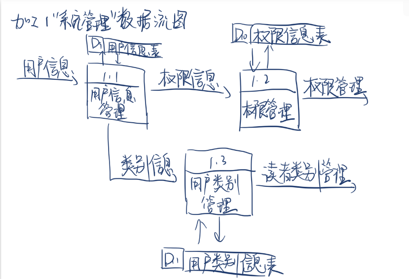
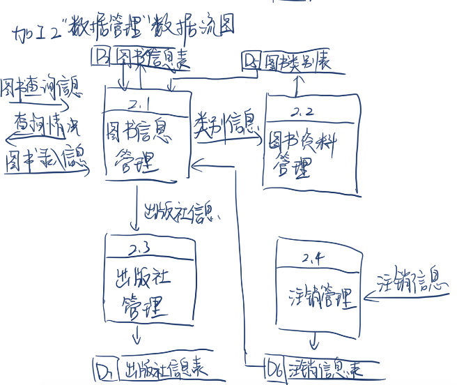
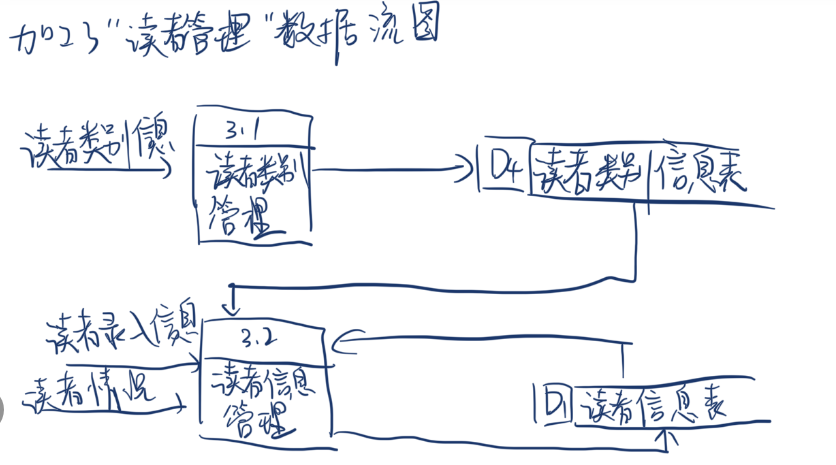
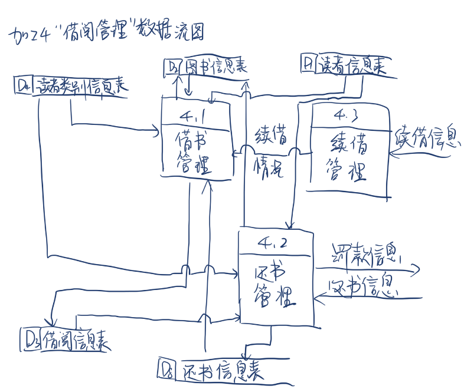
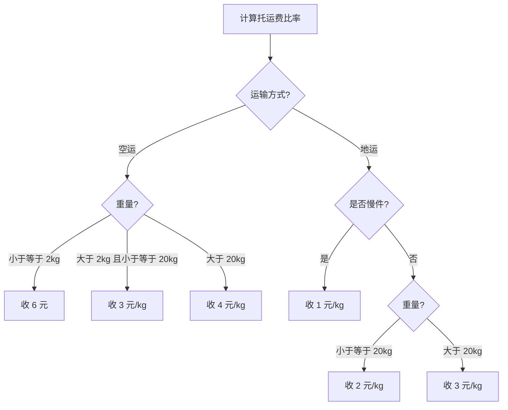

## [1] 需求分析阶段的主要任务是什么？怎样理解分析阶段的任务是决定“做什么”，而不是怎么做？

需求分析的任务是借助于当前系统的物理模型导出目标系统的逻辑模型，解决目标系统“做什么”的问题，并最终形成软件需求说明书。

对“做什么”而不是“怎么做”的理解：

需求分析的核心是明确系统必须实现的规格说明以及开发过程中的系统约束。它关注的是充分说明究竟要开发出具备什么功能和行为的产品，以满足用户的业务目标。至于具体的软件架构设计、代码实现细节、项目计划或测试方案等“如何去实现这些功能”的问题，则不属于需求分析的范畴。

## [2] 什么是结构化分析方法？要经过哪些步骤实现。

结构化分析是通过结构化的方式进行系统定义的分析方法。它采用自顶向下、逐层分解的系统分析方法来定义系统需求，利用“分解”和“抽象”两个基本手段，按照软件内部数据传递和变换的关系，建立目标系统的逻辑模型。

实现步骤：

1. 理解当前现实环境，获得当前人工系统的具体模型。
2. 从当前系统的具体模型中抽象出当前系统的逻辑模型。
3. 分析目标系统与当前系统逻辑上的差别，建立目标系统的逻辑模型。
4. 为目标系统的逻辑模型作补充，并编写需求规格说明书。

## [3] 为什么 DFD 要分层，画分层 DFD 图时要遵循哪些原则？

分层的原因：

对于复杂的实际问题，如果将所有内容绘制在一张数据流图上，会出现几十甚至上百个加工，导致图面极不清晰。采用层次结构的 DFD 能够有控制地逐步增加细节，避免一下子引入过多复杂性，实现从抽象到具体的逐步过渡，这符合人类的自然思考习惯。

画分层 DFD 图时应遵循的原则：

1. 由外向里，逐层细化：首先画出整个系统的输入和输出数据流（顶层图），确定系统边界，然后再逐步画出系统的内部组件和更深层次的加工。
2. 父图和子图平衡：子图的输入输出数据流必须和父图完全一致。
3. 保持分解的均匀性：避免在同一张图上出现抽象层级差距过大的加工，确保同层面的加工处于相近的细节层次。
4. 简化加工间的联系：尽量减少加工之间的数据流数量，每个加工的输入和输出数据流数目应尽可能少。
5. 规范编号与适当命名：对不同的加工和 DFD 子图进行规范编号（如 1.1、1.2 等），并为各成分准确命名以提高图的易理解性。

## [4] 自己从以下选项中选择一个系统，用 SA 的方法对它进行分析，画出系统的分层数据流图，并建立相应的数据词典。

下面以“图书馆管理信息系统”为例

### 4.1 顶层数据流图

### 4.2 0 层数据流图

### 4.3 加工 1“系统管理”数据流图

### 4.4 加工 2“图书管理”数据流图

### 4.5 加工 3“读者管理”数据流图

### 4.6 加工 4“借阅管理”数据流图

### 4.7 数据词典

以下数据词典根据前述分层数据流图整理，流量为按高校图书馆日常业务量估算的日均值。

#### 4.7.1 数据流条目

| 数据流名 | 用户信息 |
|---|---|
| 描述 | 系统管理员录入或维护的账号信息 |
| 组成 | 用户编号 + 用户名 + 密码 + 用户类别编号 + 状态 |
| 来源 | 图书管理员 |
| 去向 | 加工 1.1 用户信息管理 |
| 流量 | 100 次/天 |
| 注释 | 用于系统登录与人员维护 |

| 数据流名 | 权限信息 |
|---|---|
| 描述 | 用户权限配置数据 |
| 组成 | 用户类别编号 + 权限编号 + 权限说明 |
| 来源 | 加工 1.1 用户信息管理 |
| 去向 | 加工 1.2 权限管理 |
| 流量 | 100 次/天 |
| 注释 | 用于生成权限控制结果 |

| 数据流名 | 权限管理 |
|---|---|
| 描述 | 分配给业务模块的权限控制结果 |
| 组成 | 用户类别编号 + 可执行操作 + 权限范围 |
| 来源 | 加工 1.2 权限管理 |
| 去向 | 加工 2 图书管理 |
| 流量 | 100 次/天 |
| 注释 | 对图书管理功能进行授权 |

| 数据流名 | 类别信息 |
|---|---|
| 描述 | 用户所属类别的定义信息 |
| 组成 | 用户类别编号 + 类别名称 + 权限范围 |
| 来源 | 加工 1.1 用户信息管理 |
| 去向 | 加工 1.3 用户类别管理 |
| 流量 | 50 次/天 |
| 注释 | 系统管理内部数据流 |

| 数据流名 | 读者类别管理 |
|---|---|
| 描述 | 读者类别管理规则和权限 |
| 组成 | 读者类别编号 + 可借册数 + 可借天数 + 罚款标准 |
| 来源 | 加工 1.3 用户类别管理 |
| 去向 | 加工 3 读者管理 |
| 流量 | 50 次/天 |
| 注释 | 用于限制读者借阅权限 |

| 数据流名 | 管理请求信息 |
|---|---|
| 描述 | 图书管理员发出的业务管理请求 |
| 组成 | 请求编号 + 请求类型 + 请求时间 + 经办人 |
| 来源 | 图书管理员 |
| 去向 | 图书馆管理信息系统 |
| 流量 | 300 次/天 |
| 注释 | 顶层图外部输入 |

| 数据流名 | 图书录入信息 |
|---|---|
| 描述 | 图书采编录入信息 |
| 组成 | 图书编号 + 图书类别 + 书名 + 作者 + 译者 + 出版社 + 单价 + 出版日期 + 购买数量 |
| 来源 | 图书管理员 |
| 去向 | 加工 2.1 图书信息管理 |
| 流量 | 50 本/天 |
| 注释 | 图书购买后统一整理录入 |

| 数据流名 | 图书查询信息 |
|---|---|
| 描述 | 读者提交的图书查询条件 |
| 组成 | 图书编码 \| 书名 \| 作者 \| 出版社 |
| 来源 | 读者 |
| 去向 | 加工 2.1 图书信息管理 |
| 流量 | 2000 次/天 |
| 注释 | 顶层图与 2.1 图均出现 |

| 数据流名 | 查询信息 |
|---|---|
| 描述 | 图书查询条件的内部名称 |
| 组成 | 图书编码 \| 书名 \| 作者 \| 出版社 |
| 来源 | 外部查询请求 |
| 去向 | 加工 2 图书管理 |
| 流量 | 2000 次/天 |
| 注释 | 与“图书查询信息”含义一致 |

| 数据流名 | 查询情况 |
|---|---|
| 描述 | 返回给读者的查询结果 |
| 组成 | 查无此书 \| 符合条件的图书数量 + {图书馆藏号 + 图书类别 + 书名 + 作者 + 出版社 + 出版日期 + 在库册数} |
| 来源 | 加工 2.1 图书信息管理 |
| 去向 | 读者 |
| 流量 | 2000 次/天 |
| 注释 | 2.1 图中的主要输出 |

| 数据流名 | 书籍查询情况 |
|---|---|
| 描述 | 图书查询结果的系统内部名称 |
| 组成 | 图书编号 + 书名 + 作者 + 出版社 + 在库状态 |
| 来源 | 加工 2 图书管理 |
| 去向 | 外部查询方 |
| 流量 | 2000 次/天 |
| 注释 | 与“查询情况”相对应 |

| 数据流名 | 图书情况 |
|---|---|
| 描述 | 图书当前状态信息 |
| 组成 | 图书编号 + 书名 + 借阅状态 + 在库册数 + 书架位置 |
| 来源 | 图书馆管理信息系统 / 加工 2 图书管理 |
| 去向 | 图书管理员 |
| 流量 | 500 次/天 |
| 注释 | 顶层图中的系统输出 |

| 数据流名 | 书籍情况 |
|---|---|
| 描述 | 图书情况的内部名称 |
| 组成 | 图书编号 + 馆藏状态 + 在库册数 + 馆藏位置 |
| 来源 | 加工 2 图书管理 |
| 去向 | 外部业务请求方 |
| 流量 | 500 次/天 |
| 注释 | 0 层图中的输出名称 |

| 数据流名 | 图书信息 |
|---|---|
| 描述 | 图书资料维护信息 |
| 组成 | 图书编号 + 书名 + ISBN + 类别编号 + 出版社 + 价格 + 库存信息 |
| 来源 | 图书管理员 |
| 去向 | 图书馆管理信息系统 |
| 流量 | 300 次/天 |
| 注释 | 顶层图输入 |

| 数据流名 | 出版社信息 |
|---|---|
| 描述 | 出版社基础资料 |
| 组成 | 出版社编号 + 出版社名称 + 地址 + 联系方式 |
| 来源 | 加工 2.1 图书信息管理 |
| 去向 | 加工 2.3 出版社管理 |
| 流量 | 30 次/天 |
| 注释 | 图书信息维护的从属数据 |

| 数据流名 | 注销信息 |
|---|---|
| 描述 | 图书注销处理数据 |
| 组成 | 注销编号 + 图书编号 + 注销原因 + 注销日期 + 经办人 |
| 来源 | 图书管理员 |
| 去向 | 加工 2.4 注销管理 |
| 流量 | 5 次/天 |
| 注释 | 用于处理损坏、遗失或淘汰图书 |

| 数据流名 | 读者类别信息 |
|---|---|
| 描述 | 读者类别定义信息 |
| 组成 | 读者类别编号 + 类别名称 + 可借册数 + 可借天数 + 罚款标准 |
| 来源 | 图书管理员 / 加工 1.3 用户类别管理 |
| 去向 | 加工 3.1 读者类别管理 |
| 流量 | 50 次/天 |
| 注释 | 维护读者借阅权限 |

| 数据流名 | 读者录入信息 |
|---|---|
| 描述 | 读者注册或维护信息 |
| 组成 | 读者ID + 读者编号 + 读者姓名 + 读者性别 + 出生日期 + 办证日期 + 读者状态 + 已借书数 + 证件名称 + 证件号码 + 读者单位 + 读者部门 + 联系电话 + 联系地址 + 电子邮件 + 备注 |
| 来源 | 图书管理员 |
| 去向 | 加工 3.2 读者信息管理 |
| 流量 | 80 人次/天 |
| 注释 | 新办证、换证、信息更新时产生 |

| 数据流名 | 读者信息 |
|---|---|
| 描述 | 读者详细信息 |
| 组成 | 读者编号 + 姓名 + 类别 + 联系方式 + 当前状态 |
| 来源 | 图书馆管理信息系统 / 读者信息表 |
| 去向 | 图书管理员 / 加工 4.3 续借管理 |
| 流量 | 600 次/天 |
| 注释 | 顶层图输出，也是续借判断依据 |

| 数据流名 | 读者情况 |
|---|---|
| 描述 | 读者借阅与欠费状态 |
| 组成 | 读者编号 + 已借册数 + 欠费金额 + 证件状态 |
| 来源 | 图书馆管理信息系统 / 加工 3.2 读者信息管理 |
| 去向 | 读者 / 图书管理员 |
| 流量 | 1000 次/天 |
| 注释 | 顶层图与 3.2 图均出现 |

| 数据流名 | 图书借阅情况 |
|---|---|
| 描述 | 读者查看的借阅结果 |
| 组成 | 图书编号 + 借阅日期 + 应还日期 + 续借次数 + 当前状态 |
| 来源 | 图书馆管理信息系统 |
| 去向 | 读者 |
| 流量 | 1500 次/天 |
| 注释 | 顶层图输出 |

| 数据流名 | 借还书信息 |
|---|---|
| 描述 | 借书与还书业务请求 |
| 组成 | 业务类型 + 读者编号 + 图书编号 + 办理日期 + 经办人 |
| 来源 | 图书管理员 |
| 去向 | 图书馆管理信息系统 |
| 流量 | 1200 次/天 |
| 注释 | 顶层图外部输入 |

| 数据流名 | 借阅信息 |
|---|---|
| 描述 | 借书业务数据 |
| 组成 | 读者编号 + 图书编号 + 借阅日期 + 应还日期 + 借阅数量 |
| 来源 | 图书管理员 / 加工 4.1 借书管理 |
| 去向 | 加工 4.1 借书管理 / 加工 2 图书管理 |
| 流量 | 600 次/天 |
| 注释 | 借书登记与状态更新使用 |

| 数据流名 | 还书信息 |
|---|---|
| 描述 | 还书业务数据 |
| 组成 | 借阅编号 + 读者编号 + 图书编号 + 还书日期 + 图书状态 |
| 来源 | 图书管理员 |
| 去向 | 加工 4.2 还书管理 |
| 流量 | 600 次/天 |
| 注释 | 用于归还、罚款和库存恢复 |

| 数据流名 | 续借信息 |
|---|---|
| 描述 | 读者续借申请 |
| 组成 | 借阅编号 + 读者编号 + 图书编号 + 续借天数 + 申请日期 |
| 来源 | 读者 / 图书管理员 |
| 去向 | 加工 4.3 续借管理 |
| 流量 | 120 次/天 |
| 注释 | 发起续借审核 |

| 数据流名 | 续借情况 |
|---|---|
| 描述 | 续借审核结果 |
| 组成 | 借阅编号 + 是否允许续借 + 新应还日期 + 续借次数 |
| 来源 | 加工 4.3 续借管理 |
| 去向 | 加工 4.1 借书管理 |
| 流量 | 120 次/天 |
| 注释 | 用于更新借阅记录 |

| 数据流名 | 罚款信息 |
|---|---|
| 描述 | 超期或遗失罚款结果 |
| 组成 | 读者编号 + 图书编号 + 超期天数 + 罚款金额 + 罚款原因 |
| 来源 | 加工 4.2 还书管理 / 图书馆管理信息系统 |
| 去向 | 读者 |
| 流量 | 40 次/天 |
| 注释 | 顶层图和 4.2 图均出现 |

#### 4.7.2 加工条目

| 加工名 | 系统管理 |
|---|---|
| 加工编号 | 1 |
| 输入数据 | 用户信息 |
| 输出数据 | 权限管理、读者类别管理 |
| 加工说明 | 对系统用户、权限及用户类别进行统一管理，为后续业务模块提供访问控制和类别约束 |
| 激发条件 | 管理员维护系统账号或权限时 |
| 注释 | 0 层总体加工 |

| 加工名 | 用户信息管理 |
|---|---|
| 加工编号 | 1.1 |
| 输入数据 | 用户信息、D9 用户信息表 |
| 输出数据 | 权限信息、类别信息 |
| 加工说明 | 接收用户信息录入或修改请求，校验账号完整性后写入用户信息表，并向后续加工提供权限与类别基础数据 |
| 激发条件 | 接收到用户信息时 |
| 注释 | 系统管理子加工 |

| 加工名 | 权限管理 |
|---|---|
| 加工编号 | 1.2 |
| 输入数据 | 权限信息、D10 权限信息表 |
| 输出数据 | 权限管理 |
| 加工说明 | 根据用户类别和权限配置生成可执行功能集合，并更新权限信息表 |
| 激发条件 | 接收到权限配置或角色变更时 |
| 注释 | 控制图书管理等模块访问范围 |

| 加工名 | 用户类别管理 |
|---|---|
| 加工编号 | 1.3 |
| 输入数据 | 类别信息、D11 用户类别信息表 |
| 输出数据 | 读者类别管理 |
| 加工说明 | 维护用户类别及其借阅权限范围，将类别管理结果传递给读者管理模块 |
| 激发条件 | 接收到类别维护请求时 |
| 注释 | 对读者类别进行约束 |

| 加工名 | 图书管理 |
|---|---|
| 加工编号 | 2 |
| 输入数据 | 权限管理、图书录入信息、查询信息、借阅信息 |
| 输出数据 | 图书情况、书籍查询情况、出版社信息、类别信息 |
| 加工说明 | 完成图书资料维护、查询、状态更新、出版社及类别维护等处理 |
| 激发条件 | 管理员维护图书或读者发起查询时 |
| 注释 | 0 层总体加工 |

| 加工名 | 图书信息管理 |
|---|---|
| 加工编号 | 2.1 |
| 输入数据 | 图书录入信息、图书查询信息、D2 图书信息表 |
| 输出数据 | 查询情况、类别信息、出版社信息 |
| 加工说明 | 录入或修改图书基础资料，执行查询并返回结果，同时提取类别和出版社信息供后续加工使用 |
| 激发条件 | 接收到图书录入或查询请求时 |
| 注释 | 图书管理核心子加工 |

| 加工名 | 图书资料管理 |
|---|---|
| 加工编号 | 2.2 |
| 输入数据 | 类别信息、D5 图书类别表 |
| 输出数据 | 图书类别维护结果 |
| 加工说明 | 维护图书类别数据，保证图书信息中的类别编号和类别名称一致 |
| 激发条件 | 接收到类别变更请求时 |
| 注释 | 支撑图书分类管理 |

| 加工名 | 出版社管理 |
|---|---|
| 加工编号 | 2.3 |
| 输入数据 | 出版社信息、D7 出版社信息表 |
| 输出数据 | 出版社维护结果 |
| 加工说明 | 维护出版社基础资料，供图书录入与查询引用 |
| 激发条件 | 接收到出版社维护请求时 |
| 注释 | 图书基础信息子加工 |

| 加工名 | 注销管理 |
|---|---|
| 加工编号 | 2.4 |
| 输入数据 | 注销信息、D6 注销信息表 |
| 输出数据 | 注销处理结果 |
| 加工说明 | 对遗失、损坏或淘汰图书执行注销登记，并保存注销记录 |
| 激发条件 | 接收到注销申请时 |
| 注释 | 影响图书库存状态 |

| 加工名 | 读者管理 |
|---|---|
| 加工编号 | 3 |
| 输入数据 | 读者类别管理、读者录入信息 |
| 输出数据 | 读者信息、读者情况 |
| 加工说明 | 维护读者类别与读者基础信息，为借阅和续借提供读者身份与权限依据 |
| 激发条件 | 管理员录入或修改读者信息时 |
| 注释 | 0 层总体加工 |

| 加工名 | 读者类别管理 |
|---|---|
| 加工编号 | 3.1 |
| 输入数据 | 读者类别信息、D4 读者类别信息表 |
| 输出数据 | 读者类别维护结果 |
| 加工说明 | 维护读者类别及借阅规则，并写入读者类别信息表 |
| 激发条件 | 接收到读者类别维护请求时 |
| 注释 | 影响借阅册数和期限 |

| 加工名 | 读者信息管理 |
|---|---|
| 加工编号 | 3.2 |
| 输入数据 | 读者录入信息、D1 读者信息表、D4 读者类别信息表 |
| 输出数据 | 读者信息、读者情况 |
| 加工说明 | 接收读者信息录入并检查有无错误，如果没有错误，则将数据存入读者信息表，并生成读者状态信息 |
| 激发条件 | 接收到读者信息时 |
| 注释 | 参考答案中的核心加工 |

| 加工名 | 借阅管理 |
|---|---|
| 加工编号 | 4 |
| 输入数据 | 借阅信息、还书信息、续借信息、D1、D2、D3、D4 |
| 输出数据 | 罚款信息、借阅状态更新、还书记录、续借情况 |
| 加工说明 | 处理借书、还书、续借等流通业务，并维护借阅记录与图书库存状态 |
| 激发条件 | 接收到借还书业务请求时 |
| 注释 | 0 层总体加工 |

| 加工名 | 借书管理 |
|---|---|
| 加工编号 | 4.1 |
| 输入数据 | 借阅信息、D2 图书信息表、D3 借阅信息表、D4 读者类别信息表 |
| 输出数据 | 借阅记录、图书状态更新、续借情况 |
| 加工说明 | 校验读者借阅资格和图书在库状态，生成借阅记录，更新图书库存与借阅表 |
| 激发条件 | 接收到借阅信息时 |
| 注释 | 借阅处理入口 |

| 加工名 | 还书管理 |
|---|---|
| 加工编号 | 4.2 |
| 输入数据 | 还书信息、D3 借阅信息表、D4 读者类别信息表 |
| 输出数据 | 罚款信息、D8 还书信息表记录、图书状态恢复 |
| 加工说明 | 在借阅信息表查找应还日期；若当前日期超过应还日期或图书丢失，则产生罚款信息，否则将还书信息存入还书信息表并恢复图书状态 |
| 激发条件 | 接收到还书信息时 |
| 注释 | 参考答案中的核心加工 |

| 加工名 | 续借管理 |
|---|---|
| 加工编号 | 4.3 |
| 输入数据 | 续借信息、D1 读者信息表 |
| 输出数据 | 续借情况 |
| 加工说明 | 检查读者状态、欠费情况和续借次数，若满足条件则延长应还日期并返回续借结果 |
| 激发条件 | 接收到续借申请时 |
| 注释 | 与 4.1 联动更新借阅记录 |

#### 4.7.3 数据存储条目

| 数据存储名 | D1 读者信息表 |
|---|---|
| 描述 | 存储读者详细信息 |
| 组成 | 读者ID + 读者编号 + 读者姓名 + 读者性别 + 出生日期 + 办证日期 + 读者状态 + 已借书数 + 证件名称 + 证件号码 + 读者单位 + 读者部门 + 联系电话 + 联系地址 + 电子邮件 + 备注 |
| 数量 | 约 50000 条 |
| 关键字 | 读者ID |
| 存储方式 | 索引文件，以读者ID为关键字 |
| 存取 | 读多写少，日均访问约 2000 次 |
| 相关处理 | 加工 3.2、加工 4.1、加工 4.2、加工 4.3 |
| 注释 | 读者基础主文件 |

| 数据存储名 | D2 图书信息表 |
|---|---|
| 描述 | 存储图书详细信息 |
| 组成 | 图书编号 + 图书名称 + 标准ISBN + 类别编号 + 类别名称 + 书架位置 + 作者 + 译者 + 出版社名 + 出版地点 + 图书页数 + 图书价格 + 现存量 + 库存总量 + 借阅次数 + 是否注销 + 入库日期 + 出版日期 + 内容简介 + 备注 |
| 数量 | 约 200000 条 |
| 关键字 | 图书编号 |
| 存储方式 | 索引文件，以图书编号为关键字 |
| 存取 | 高读写频率，日均访问约 5000 次 |
| 相关处理 | 加工 2.1、加工 4.1、加工 4.2 |
| 注释 | 图书资料主文件 |

| 数据存储名 | D3 借阅信息表 |
|---|---|
| 描述 | 存储借书情况的详细信息 |
| 组成 | 借阅编号 + 图书编号 + 图书名称 + 读者编号 + 读者姓名 + 借阅数量 + 借阅日期 + 应还日期 + 续借次数 |
| 数量 | 约 30000 条 |
| 关键字 | 借阅编号 |
| 存储方式 | 顺序文件或普通业务文件 |
| 存取 | 日均访问约 1500 次 |
| 相关处理 | 加工 4.1、加工 4.2 |
| 注释 | 借书记录文件 |

| 数据存储名 | D4 读者类别信息表 |
|---|---|
| 描述 | 存储读者类别与借阅权限信息 |
| 组成 | 读者类别编号 + 类别名称 + 可借册数 + 可借天数 + 罚款标准 + 备注 |
| 数量 | 约 10 条 |
| 关键字 | 读者类别编号 |
| 存储方式 | 索引文件 |
| 存取 | 日均访问约 800 次 |
| 相关处理 | 加工 3.1、加工 3.2、加工 4.1、加工 4.2 |
| 注释 | 读者权限依据 |

| 数据存储名 | D5 图书类别表 |
|---|---|
| 描述 | 存储图书分类信息 |
| 组成 | 图书类别编号 + 图书类别名称 + 类别说明 + 排架规则 |
| 数量 | 约 100 条 |
| 关键字 | 图书类别编号 |
| 存储方式 | 索引文件 |
| 存取 | 日均访问约 300 次 |
| 相关处理 | 加工 2.2 |
| 注释 | 图书分类基础表 |

| 数据存储名 | D6 注销信息表 |
|---|---|
| 描述 | 存储图书注销记录 |
| 组成 | 注销编号 + 图书编号 + 注销原因 + 注销日期 + 经办人 + 审批说明 |
| 数量 | 约 1000 条 |
| 关键字 | 注销编号 |
| 存储方式 | 顺序文件 |
| 存取 | 日均访问约 20 次 |
| 相关处理 | 加工 2.4 |
| 注释 | 用于图书报废、遗失处理 |

| 数据存储名 | D7 出版社信息表 |
|---|---|
| 描述 | 存储出版社基础信息 |
| 组成 | 出版社编号 + 出版社名称 + 联系电话 + 地址 + 邮编 + 联系人 |
| 数量 | 约 500 条 |
| 关键字 | 出版社编号 |
| 存储方式 | 索引文件 |
| 存取 | 日均访问约 100 次 |
| 相关处理 | 加工 2.3 |
| 注释 | 图书录入的辅助基础表 |

| 数据存储名 | D8 还书信息表 |
|---|---|
| 描述 | 存储还书业务记录 |
| 组成 | 还书编号 + 借阅编号 + 读者编号 + 图书编号 + 还书日期 + 罚款金额 + 经办人 + 图书状态 |
| 数量 | 约 30000 条 |
| 关键字 | 还书编号 |
| 存储方式 | 顺序文件 |
| 存取 | 日均访问约 1200 次 |
| 相关处理 | 加工 4.2 |
| 注释 | 还书历史记录 |

| 数据存储名 | D9 用户信息表 |
|---|---|
| 描述 | 存储系统用户账号信息 |
| 组成 | 用户编号 + 用户名 + 密码 + 用户类别编号 + 状态 + 创建日期 |
| 数量 | 约 100 条 |
| 关键字 | 用户编号 |
| 存储方式 | 索引文件 |
| 存取 | 日均访问约 200 次 |
| 相关处理 | 加工 1.1 |
| 注释 | 系统内部管理表 |

| 数据存储名 | D10 权限信息表 |
|---|---|
| 描述 | 存储系统权限定义 |
| 组成 | 权限编号 + 权限名称 + 权限说明 + 功能范围 |
| 数量 | 约 50 条 |
| 关键字 | 权限编号 |
| 存储方式 | 索引文件 |
| 存取 | 日均访问约 100 次 |
| 相关处理 | 加工 1.2 |
| 注释 | 用于权限控制 |

| 数据存储名 | D11 用户类别信息表 |
|---|---|
| 描述 | 存储用户类别定义信息 |
| 组成 | 用户类别编号 + 类别名称 + 权限范围 + 类别说明 |
| 数量 | 约 10 条 |
| 关键字 | 用户类别编号 |
| 存储方式 | 索引文件 |
| 存取 | 日均访问约 80 次 |
| 相关处理 | 加工 1.3 |
| 注释 | 与用户和权限对应 |

#### 4.7.4 数据项条目

| 数据项名 | 用户编号 |
|---|---|
| 别名 | 账号编号 |
| 描述 | 系统用户的唯一标识 |
| 组成 | 年份码 + 流水号 |
| 类型 | 字符串 |
| 长度 | 8 位 |
| 取值范围 | 00000000-99999999 |
| 注释 | 对应 D9 主键 |

| 数据项名 | 用户名 |
|---|---|
| 别名 | 登录名 |
| 描述 | 用户登录系统时使用的名称 |
| 组成 | 字母/数字组合 |
| 类型 | 字符串 |
| 长度 | 4-20 位 |
| 取值范围 | 合法字符组合 |
| 注释 | 不允许重复 |

| 数据项名 | 用户类别编号 |
|---|---|
| 别名 | 角色编号 |
| 描述 | 标识用户所属管理类别 |
| 组成 | 类别代码 |
| 类型 | 字符串 |
| 长度 | 2 位 |
| 取值范围 | 01-99 |
| 注释 | 对应 D11 |

| 数据项名 | 权限编号 |
|---|---|
| 别名 | 功能编号 |
| 描述 | 系统权限的唯一标识 |
| 组成 | 模块代码 + 流水号 |
| 类型 | 字符串 |
| 长度 | 4 位 |
| 取值范围 | 0001-9999 |
| 注释 | 对应 D10 |

| 数据项名 | 读者ID |
|---|---|
| 别名 | 内部编号 |
| 描述 | 系统内部用于定位读者记录的主键 |
| 组成 | 年份码 + 流水号 |
| 类型 | 字符串 |
| 长度 | 8 位 |
| 取值范围 | 00000000-99999999 |
| 注释 | 对应 D1 主键 |

| 数据项名 | 读者编号 |
|---|---|
| 别名 | 证号 |
| 描述 | 给每个读者的一个唯一的、作标识用的号码 |
| 组成 | 单位代码 + 流水号码 |
| 类型 | 字符串 |
| 长度 | 6 位 |
| 取值范围 | 000000-999999 |
| 注释 | 借书证编号 |

| 数据项名 | 读者姓名 |
|---|---|
| 别名 | 姓名 |
| 描述 | 读者真实姓名 |
| 组成 | 姓 + 名 |
| 类型 | 字符串 |
| 长度 | 2-20 位 |
| 取值范围 | 合法汉字或字母 |
| 注释 | 无 |

| 数据项名 | 读者类别 |
|---|---|
| 别名 | 身份类别 |
| 描述 | 读者在图书流通管理中的身份和借出权限类型 |
| 组成 | [教师 \| 行政人员 \| 学生] |
| 类型 | 字符型 |
| 长度 | 1 位 |
| 取值范围 | [0 \| 1 \| 2] |
| 注释 | 与 D4 对应 |

| 数据项名 | 办证日期 |
|---|---|
| 别名 | 发证日期 |
| 描述 | 给读者签发借书证的日期 |
| 组成 | 年 + 月 + 日 |
| 类型 | 日期型/字符串 |
| 长度 | 8 位 |
| 取值范围 | 有意义的日期值 |
| 注释 | 例如 20240520 |

| 数据项名 | 图书编号 |
|---|---|
| 别名 | 馆藏号 |
| 描述 | 每种馆藏图书的唯一标识 |
| 组成 | 分类号 + 流水号 |
| 类型 | 字符串 |
| 长度 | 10-20 位 |
| 取值范围 | 合法馆藏编码 |
| 注释 | 对应 D2 主键 |

| 数据项名 | 标准ISBN |
|---|---|
| 别名 | ISBN |
| 描述 | 图书国际标准书号 |
| 组成 | 组号 + 出版者号 + 书序号 + 校验码 |
| 类型 | 字符串 |
| 长度 | 13 位 |
| 取值范围 | 合法 ISBN-13 |
| 注释 | 可用于检索 |

| 数据项名 | 图书类别编号 |
|---|---|
| 别名 | 分类号 |
| 描述 | 标识图书所属类别的编码 |
| 组成 | 中图分类代码或自定义代码 |
| 类型 | 字符串 |
| 长度 | 2-10 位 |
| 取值范围 | 合法类别代码 |
| 注释 | 对应 D5 |

| 数据项名 | 出版社编号 |
|---|---|
| 别名 | 出版码 |
| 描述 | 标识出版社的唯一代码 |
| 组成 | 地区码 + 流水号 |
| 类型 | 字符串 |
| 长度 | 6 位 |
| 取值范围 | 000001-999999 |
| 注释 | 对应 D7 |

| 数据项名 | 借阅编号 |
|---|---|
| 别名 | 借书单号 |
| 描述 | 一次借阅业务的唯一标识 |
| 组成 | 日期码 + 流水号 |
| 类型 | 字符串 |
| 长度 | 12 位 |
| 取值范围 | 合法业务编号 |
| 注释 | 对应 D3 主键 |

| 数据项名 | 借阅日期 |
|---|---|
| 别名 | 借书日期 |
| 描述 | 读者完成借书的日期 |
| 组成 | 年 + 月 + 日 |
| 类型 | 日期型 |
| 长度 | 8 位 |
| 取值范围 | 有意义的日期值 |
| 注释 | 与应还日期联动 |

| 数据项名 | 应还日期 |
|---|---|
| 别名 | 到期日期 |
| 描述 | 读者应归还图书的日期 |
| 组成 | 年 + 月 + 日 |
| 类型 | 日期型 |
| 长度 | 8 位 |
| 取值范围 | 不早于借阅日期 |
| 注释 | 用于超期判断 |

| 数据项名 | 续借次数 |
|---|---|
| 别名 | 续借次数 |
| 描述 | 当前借阅记录已办理续借的次数 |
| 组成 | 数值 |
| 类型 | 整型 |
| 长度 | 1-2 位 |
| 取值范围 | 0-9 |
| 注释 | 用于续借限制 |

| 数据项名 | 还书编号 |
|---|---|
| 别名 | 还书单号 |
| 描述 | 一次还书业务的唯一标识 |
| 组成 | 日期码 + 流水号 |
| 类型 | 字符串 |
| 长度 | 12 位 |
| 取值范围 | 合法业务编号 |
| 注释 | 对应 D8 主键 |

| 数据项名 | 罚款金额 |
|---|---|
| 别名 | 应缴金额 |
| 描述 | 读者因超期或遗失产生的金额 |
| 组成 | 单价 × 天数或赔偿规则 |
| 类型 | 数值型 |
| 长度 | 8 位以内 |
| 取值范围 | 大于等于 0 |
| 注释 | 单位为元 |

## [5] 请画出对应于计算托运费比率的判定树和判定表。

### 5.1 判定表

| 条件/操作 | 规则1 | 规则2 | 规则3 | 规则4 | 规则5 | 规则6 |
|---|---|---|---|---|---|---|
| 运输方式 | 空运 | 空运 | 空运 | 地运 | 地运 | 地运 |
| 是否慢件 | - | - | - | 是 | 否 | 否 |
| 重量 `<= 2kg` | 是 | 否 | 否 | - | 否 | 否 |
| 重量 `2kg < 重量 <= 20kg` | 否 | 是 | 否 | - | 是 | 否 |
| 重量 `> 20kg` | 否 | 否 | 是 | - | 否 | 是 |
| 收费标准 | 6 元/票 | 3 元/kg | 4 元/kg | 1 元/kg | 2 元/kg | 3 元/kg |

### 5.2 判定树

