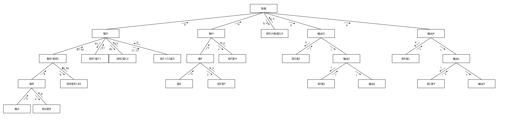
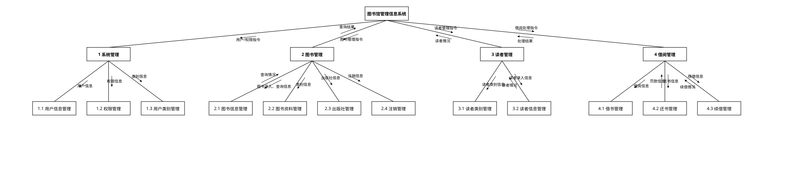
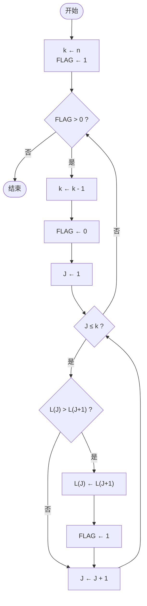
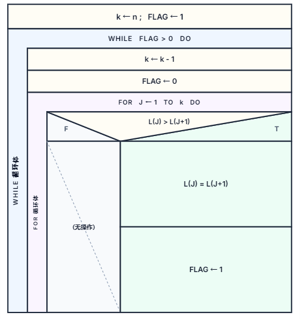
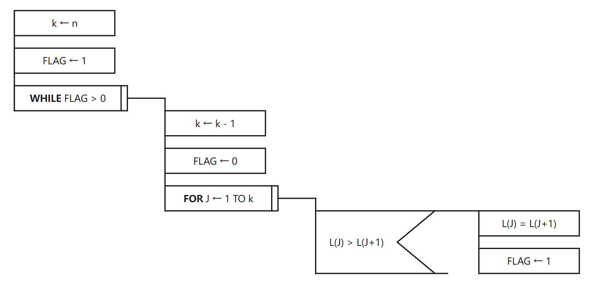

# 作业 3：由数据流图导出结构图
## 第一题
已知有一抽象的数据流图如下所示，用SD方法画出其相应的结构图。

## 第二题
在上次作业中的数据流图的基础上画出其程序结构图。

## 第三题
画出与下列用伪码书写的程序对应的程序流程图、NS图和PAD图。

### 程序流程图

```mermaid
flowchart TD
    A([开始]) --> B["k ← n<br/>FLAG ← 1"]
    B --> C{"FLAG > 0 ?"}
    C -- 否 --> Z([结束])
    C -- 是 --> D["k ← k - 1"]
    D --> E["FLAG ← 0"]
    E --> F["J ← 1"]
    F --> G{"J ≤ k ?"}
    G -- 否 --> C
    G -- 是 --> H{"L(J) > L(J+1) ?"}
    H -- 否 --> N["J ← J + 1"]
    H -- 是 --> I["L(J) ← L(J+1)"]
    I --> J["FLAG ← 1"]
    J --> N
    N --> G
```
### NS图

### PAD图
