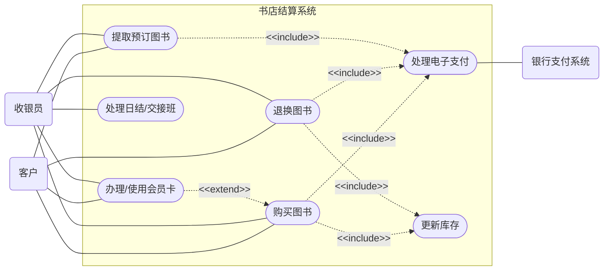

# 作业4
## （1）
列出结帐系统设计中会涉及到的三类参与者，解释每一类参与者的相关性。
- 收银员：主参与者。他们是系统最直接的操作者，使用系统的主要功能（如扫描条码、计算总价、处理退换货）来完成日常工作任务。
- 客户：副参与者。虽然客户通常不直接敲击结账系统的键盘（除非是自助结账，但传统场景多为收银员操作），但他们是系统服务的接受者，提供交易所需的输入（如出示会员卡、付款），并获取系统产生的结果（如收据、找零）。  
- 银行支付系统 / 第三方支付：外部系统参与者。当客户使用信用卡、借记卡或移动支付（如支付宝/微信）时，结账系统需要与这个外部系统进行交互，以验证账户并完成资金的扣款与划转。
## (2)
一个用例是购买图书，从客户的角度，列出在类似的抽象层次上的其他用例，并用一句话来总结每个用例的意图。
- 用例：退换图书 
意图： 客户将之前购买且符合退换规定的图书退回，以获取全额退款或换取等价/差价的其他商品。

- 用例：办理/使用会员卡 
意图： 客户在结账前注册成为书店会员，或者出示现有会员凭证以累计积分并享受专属折扣。

- 用例：提取预订图书 
意图： 客户在收银台验证身份后，支付尾款并领取之前通过线上或线下缺货登记预订的图书。  
## （3）
给书店的结算系统绘制一张完整的用例图

## （4）
给每个用例编制一个普通的场景。
- 购买图书： 客户将几本书放在收银台；收银员逐一扫描图书条码；系统显示每本书的价格和总计金额；客户递交现金；收银员在系统中输入实收金额；系统计算找零并打开钱箱；收银员将找零和打印出的收据交给客户。

- 退换图书： 客户携带一本书和原始收据来到收银台要求退货；收银员扫描收据上的条码和图书条码；系统验证该交易在允许的退货期限内；收银员确认退款；系统将资金退回客户的原支付账户，更新库存记录，并打印退货凭证。

- 办理/使用会员卡： 客户在结账时表示需要注册会员；收银员在系统中选择“新建会员”；客户提供手机号码和姓名；收银员录入信息；系统创建会员档案并生成会员号；收银员将此次购买的积分记入该新账户中。

- 提取预订图书： 客户提供预订时的手机号；收银员在系统中查询；系统显示预订记录及存放位置；收银员取出图书并扫描；客户支付剩余款项；系统打印收据并更新该预订订单为“已完成”。
## （5）
给每个用例编制一个异常场景。
- 购买图书： 收银员扫描某本书时，系统提示“条码无法识别”或“商品库中无此记录”。收银员尝试手动输入 ISBN 码，如果仍无效，需呼叫主管处理或取消该本书的计价。

- 退换图书： 收银员扫描原始收据后，系统提示“该订单已超过 30 天无理由退换货期限”。收银员向客户解释书店政策，系统拒绝执行退款流程，终止该操作。

- 办理/使用会员卡： 收银员录入客户提供的手机号码进行注册时，系统提示“该手机号码已被注册”。收银员询问客户是否直接使用该号码登录积分，而不是新建账户。

- 提取预订图书： 收银员输入客户的手机号后，系统显示“无此预订记录”或“预订图书尚未到货”。收银员核对客户信息，告知客户当前物流状态，结束本次交互。
