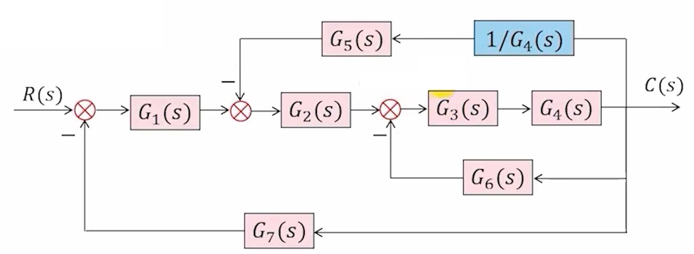
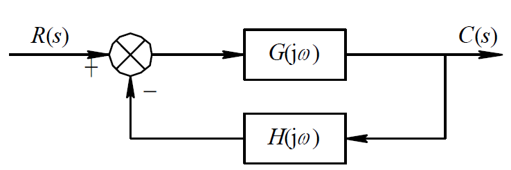

## 第二章 控制系统的动态数学模型
### 线性微分方程
1. 未知函数的各阶导数都是一次；
2. 各阶导数的系数可以是常数或是自变量的已知函数；
$$\frac{d^2\theta(t)}{dt^2} + 2\frac{d\theta(t)}{dt} = 1\\\frac{d^2\theta(t)}{dt^2} + 2\theta(t)\frac{d\theta(t)}{dt} = 1\\t\frac{d^2\theta(t)}{dt^2} + 2e^{3t}\frac{d\theta(t)}{dt} = \cos(4t) + 1\\\frac{d^2\theta(t)}{dt^2} + 2\left(\frac{d\theta(t)}{dt}\right)^2 = \cos(4t) + 1$$

从上至下为
线性、非线性、线性、非线性
### 拉普拉斯变换
对于指数级函数$x(t)$，有$\displaystyle\int_{0}^{\infty} x(t)e^{-\sigma t} dt < \infty$，则可定义$x(t)$的拉氏变换$X(s)$：
$$X(s) = L[x(t)] \triangleq \int_{0}^{\infty} x(t)e^{-st} dt$$
式中，称$X(s)$为象函数，$x(t)$为原函数。$s$为复变数，其量纲为时间的倒数，即频率。象函数$X(s)$的量纲为$x(t)$的量纲与时间量纲的乘积。
#### 常用的拉氏变换和反变换
| 时间函数 | 象函数 (Laplace) |
|:---:|:---:|
| 单位脉冲函数$\delta(t)=\begin{cases}\displaystyle\lim_{t_{0}\to0}\dfrac{1}{t_{0}}, & 0<t<t_{0}\\[6pt]0, & t\ge t_{0}\end{cases}$ | $1$ |
| 单位阶跃函数$1(t)=\begin{cases}0, & t<0\\[6pt]1, & t\ge 0\end{cases}$ | $\dfrac{1}{s}$ |
| $t^{n}\ (n\ge 0)$ | $\dfrac{n!}{s^{n+1}}$ |
| $\sin(\omega t)$ | $\dfrac{\omega}{s^{2}+\omega^{2}}$ |
| $\cos(\omega t)$ | $\dfrac{s}{s^{2}+\omega^{2}}$ |
|  $e^{at}$（t<0时函数值为0） | $\dfrac{1}{s-a}$ |
| 常数倍 $a\,x(t)$ | $a\,X(s)$ |
| 叠加定理 $a\,x_{1}(t)+b\,x_{2}(t)$ | $a\,X_{1}(s)+b\,X_{2}(s)$ |
| 微分 $\dfrac{d}{dt}x(t)$ | $s\,X(s)-x(0^{+})$ |
| 积分 $\displaystyle\int_{0}^{t} x(\tau)\,d\tau$ | $\dfrac{X(s)}{s}+\dfrac{x^{-1}(0^{+})}{s}$ |
| 衰减定理 $e^{-at}x(t)$ | $X(s+a)$ |
| 延时定理 $x(t-a)\cdot 1(t-a)$ | $e^{-as}X(s)$ |
#### 信号的截取与时移
|图像|表达式|
|:---:|:---:|
||$f_1(t)=\sin(\omega t)\cdot 1(t)$ |
||$f_2(t)=\sin(\omega t)\cdot 1(t-t_0)$ |
||$f_3(t)=\sin\big(\omega (t-t_0)\big)\cdot 1(t-t_0)$ |
#### 拉氏变换的常用基本性质
##### 叠加原理
若$L[f_1(t)]=F_1(s)$，$L[f_2(t)]=F_2(s)$，则有
$$L[af_1(t)+bf_2(t)]=aF_1(s)+bF_2(s)$$
##### 微分定理
$$L\left[\frac{df(t)}{dt}\right]=sF(s)-f(0)$$
根据数学归纳法不难推出
$$L\left[\frac{d^n}{dt^n}f(t)\right] = s^n F(s) - s^{n-1}f(0) - s^{n-2}\dot{f}(0) - \dots - sf^{(n-2)}(0) - f^{(n-1)}(0)$$
若$f(0)=\dot{f}(0)=\dots=f^{(n-2)}(0)=f^{(n-1)}(0)=0$，则有
$$L\left[\frac{d^n}{dt^n}f(t)\right] = s^n F(s)$$
##### 积分定理

这里$\displaystyle f^{-1}(t) \triangleq \int f(t)dt$
$$L\left[\int f(t)dt\right] = \frac{F(s)}{s} + \frac{f^{-1}(0)}{s}$$
同理有
$$ L\left[\underbrace{\int \dots \int}_{n} f(t)(dt)^n\right] = \frac{F(s)}{s^n} + \frac{f^{-1}(0)}{s^n} + \frac{f^{-2}(0)}{s^{n-1}} + \dots + \frac{f^{-n}(0)}{s}$$

若$f^{-1}(0) = f^{-2}(0) = \dots = f^{-n}(0) = 0$，则有
$$ L\left[\underbrace{\int \dots \int}_{n} f(t)(dt)^n\right] = \frac{F(s)}{s^n}$$
##### 衰减定理
$$L[e^{-at}f(t)]=F(s+a)$$
##### 延时定理
$$L\left[f(t-a) \cdot 1(t-a)\right] = e^{-as}F(s)$$
##### 初值定理
$$ \lim_{t \to 0} f(t)=\lim_{s \to \infty} sF(s) $$
##### 终值定理
$$ \lim _{t \rightarrow \infty} f(t)=\lim _{s \rightarrow 0} s F(s) $$
### 拉氏反变换
直接积分求拉氏反变换通常较繁，对于一般的问题，都可以避免积分，而通过将象函数转化为拉氏变换表中包含的形式（一般是分式）。
#### 例题
求$F(s)=\dfrac{s+1}{s^2+5s+6}$的反拉氏变换

易知$F(s)=\dfrac{2}{s+3}-\dfrac{1}{s+2}$
查表可得
$$f(t) = 2e^{-3t}-e^{-2t}$$

### 传递函数
传递函数为**在零起始条件**下，线性定常系统输出象函数$X_o(s)$与输入象函数$X_i(s)$之比
$$G(s)\triangleq\frac{X_o(s)}{X_i(s)}$$

具体地说，设线性定常系统的微分方程为：
$$a_0 x_o^{(n)}(t) + a_1 x_o^{(n-1)}(t) + \cdots + a_{n-1} \dot{x}_o(t) + a_n x_o(t) = b_0 x_i^{(m)}(t) + b_1 x_i^{(m-1)}(t) + \cdots + b_{m-1} \dot{x}_i(t) + b_m x_i(t) \quad (n \ge m)$$
设系统的输入输出函数及其各阶导数**初始值均为零**，将上式拉氏变换，由微分定理推论：
$$\left(a_0 s^n + a_1 s^{n-1} + \cdots + a_{n-1}s + a_n\right)X_o(s) = \left(b_0 s^m + b_1 s^{m-1} + \cdots + b_{m-1}s + b_m\right)X_i(s)$$
传递函数为
$$G(s) = \frac{X_o(s)}{X_i(s)} = \frac{b_0 s^m + b_1 s^{m-1} + \cdots + b_{m-1}s + b_m}{a_0 s^n + a_1 s^{n-1} + \cdots + a_{n-1}s + a_n}$$
#### 传递函数的特性
1. 传递函数是系统的固有特性，与输入情况无关。
2. 零点：传递函数分子为零时的s值
3. 极点：传递函数分母为零时的s值
#### 典型环节的传递函数
|环节|时间函数|相函数|传递函数|例子|
|:-:|:-:|:-:|:-:|:-:|
|比例环节|$x_o(t)=kx_i(t)$|$X_o(s)=kX_i(s)$|$G(s)=k$|运算放大器、齿轮传动副|
|积分环节|$x_o(t)=\displaystyle\int_{0}^{t} x_i(t)\,dt$|$X_o(s)=\dfrac{1}{s}X_i(s)$|$G(s)=\dfrac{1}{s}$|RC 有源积分网络|
|微分环节|$x_o(t)=\dfrac{d}{dt}x_i(t)$|$X_o(s)=sX_i(s)$| $G(s)=s$|永磁式直流测速机、阻尼器|
|一阶惯性环节（机械系统）|$T\dfrac{dx_o(t)}{dt}+x_o(t)=x_i(t)$|$X_o(s)=\dfrac{1}{T s+1}X_i(s)$|$G(s)=\dfrac{1}{T s+1}$|弹簧-阻尼系统|
|一阶惯性环节（滤波电路）|$\begin{cases}u_i(t)=i(t)R+\dfrac{1}{C}\displaystyle\int i(t)\,dt\\[4pt]u_o(t)=\dfrac{1}{C}\displaystyle\int i(t)\,dt\end{cases}$|$\begin{cases}U_i(s)=\left(R+\dfrac{1}{Cs}\right)I(s)=\dfrac{RCs+1}{Cs}I(s)\\[4pt]U_o(s)=\dfrac{1}{Cs}I(s)\\[4pt]\Rightarrow U_o(s)=\dfrac{1}{RCs+1}U_i(s)\end{cases}$|$G(s)=\dfrac{1}{RCs+1}$|RC 低通滤波电路（无源）|
|二阶振荡环节|$T^2\displaystyle\frac{d^2 x_o(t)}{dt^2} + 2\zeta T \displaystyle\frac{d x_o(t)}{dt} + x_o(t) = x_i(t)$|$X_o(s)=\dfrac{1}{T^2 s^2 + 2\zeta T s + 1}\,X_i(s)$|$G(s)=\dfrac{1}{T^2 s^2 + 2\zeta T s + 1}$|满足 $0<\zeta<1$ 时为振荡系统（弹簧-质量-阻尼、二阶滤波器）|
|近似微分环节|$T\displaystyle\frac{dx_o(t)}{dt}+x_o(t)=\displaystyle\frac{dx_i(t)}{dt}$|$X_o(s)=\dfrac{s}{Ts+1}X_i(s)$|$G(s)=\dfrac{s}{Ts+1}$|无源微分网络|
### 方块图
#### 组成部分
|组成部分|描述|图示|
|:-:|:-:|:-:|
|基本单元|图中指向方块的箭头表示输入，从方块出来的箭头表示输出，$G(s)$表示其传递函数。||
|比较点|代表两个或两个以上的输入信号进行相加或相减的元件||
|引出点|它表示信号引出和测量的位置，同一位置引出的几个信号，其大小和性质完全一样。||
#### 环节连接方式
|连接方式|原框图|等效|
|:-:|:-:|:-:|
|串联|||
|并联|||
|反馈|||
#### 变换法则

|变换方式|原框图|等效|
|:-:|:-:|:-:|
|引出点前移|||
|引出点后移|||

1. 各**前向通路传递函数的乘积保持不变**；
2. 各**反馈回路传递函数的乘积保持不变**

如上图，前向通路指的就是“主干道”$G_1G_2G_3G_4$，反馈回路指的就是$G_2G_3G_5$这样的环，上图将$G_2G_3G_5$回路的引入点$D$调至$E$则得到下图

为了使前向通路传递函数和反馈回路传递函数的乘积保持不变，在反馈回路中加入$\dfrac{1}{G_4}$的环节即可。

方块图简化简单来说就是从小圈到大圈依次用上面“反馈”环节的公式进行化简知道最后得到传递函数。
## 第三章 时域瞬态响应分析
### 机电控制系统里的典型输入信号函数

### 一阶系统的瞬态响应
能够用一阶微分方程（只含有未知函数的一阶导数的微分方程）描述的系统。它的典型形式是**一阶惯性环节**。
$$X_i(s)\rightarrow\boxed{\dfrac{1}{Ts+1}}\rightarrow X_o(s)$$
#### 单位脉冲响应

$x_i(t) = \delta(t)\Rightarrow X_i(s) = 1$
$X_o(s) = \dfrac{1}{Ts+1}=\dfrac{\dfrac{1}{T}}{s+\dfrac{1}{T}}\Rightarrow x_o(t) = (\dfrac{1}{T}e^{-\dfrac{1}{T}t})\cdot 1(t)$

$t = T$时$e^{-\dfrac{1}{T}t}=0.368$，衰减了0.632

#### 单位阶跃响应

$x_i(t) = 1(t)\Rightarrow X_i(s) = \dfrac{1}{s}$
$X_o(s)=\dfrac{1}{Ts+1}X_i(s)=\dfrac{1}{s(Ts+1)}=\dfrac{1}{s}-\dfrac{1}{s+\dfrac{1}{T}}\Rightarrow x_o(t)=(1-e^{-\dfrac{1}{T}t})\cdot 1(t)$

1. 一阶惯性系统总是稳定的，无振荡;
2. 经过时间T曲线上升到0.632的高度，据此用实验的方法测出响应曲线达到稳态
值的63.2%高度点所用的时间，即是惯性环节的时间常数$T$;
3. 经过时间$(3 \sim 4)T$，响应曲线已达稳态值的95%~98%，可以认为其调整过程已经
基本完成·故一般取调整时间为$(3 \sim 4)T$；

4. 在t=0处，响应曲线的切线斜率为$\dfrac{1}{T}$;

#### 单位斜坡响应
$\displaystyle X_{\mathrm{o}}(s)=\frac{X_{\mathrm{o}}(s)}{X_{\mathrm{i}}(s)} X_{\mathrm{i}}(s)=\frac{1}{T s+1}\frac{1}{s^{2}}=\frac{1}{s^{2}}-\frac{T}{s}+\frac{T}{s+\dfrac{1}{T}}$

#### 总结
**系统对输入信号导数的响应，就等于系统对该输入信号响应的导数；**
**系统对输入信号积分的响应，就等于系统对该输入信号响应的积分。**
### 二阶系统的瞬态响应
用二阶微分方程描述的系统称为二阶系统。它的典型形式是二阶振荡环节。
$$X_i(s)\rightarrow\boxed{\dfrac{\omega_n^2}{s^2 + 2\zeta \omega_n s + \omega_n^2}}\rightarrow X_o(s)$$
其中$\zeta$为阻尼比，$\omega_n$为无自振角频率

对于任意二阶系统，将分母的二次项化为1，通过其他系数列方程即可求得$\zeta$和$\omega_n$

把$s^2 + 2\zeta \omega_n s + \omega_n^2=0$称为该二阶系统的特征方程，则两个特征根为$s_{1,2}=-\zeta \omega_n \pm  j\omega_n\sqrt{1-\zeta^2}$

将

根据$\zeta$和1的大小关系将系统分为欠阻尼、临界阻尼和过阻尼。

|状态|$\zeta$大小|单位阶跃响应|特性|
|:-:|:-:|:-:|:-:|
|欠阻尼|$0<\zeta<1$|稳定衰减震荡|振荡，$\zeta$愈小，振荡愈严重但响应愈快|
|临界阻尼|$\zeta = 1$|稳定单调上升|无振荡、无超调，过渡过程长;|
|过阻尼|$\zeta > 1$|稳定单调上升|无振荡、无超调，过渡过程长;|
|无阻尼|$\zeta = 0$|等幅周期振荡|等幅振荡|
|负阻尼|$-1<\zeta < 0$|发散震荡上升|阶跃响应发散，系统不稳定|
|负阻尼|$\zeta < -1$|发散单调上升|阶跃响应发散，系统不稳定|

  
  
  

#### 单位阶跃响应
|状态|单位阶跃响应|
|:-:|:-:|
|欠阻尼|$x_o(t) = 1 - \frac{e^{-\zeta \omega_n t}}{\sqrt{1-\zeta^2}} \sin(\omega_d t + \arctan \frac{\sqrt{1-\zeta^2}}{\zeta})$，其中**有阻尼自然频率**$\omega_d = \omega_n\sqrt{1-\zeta^2}$|
|临界阻尼|$x_o(t) = 1 - (1+\omega_n t)e^{-\omega_n t}$|
|过阻尼|$x_o(t) = 1 - \dfrac{s_1 e^{s_2 t} - s_2 e^{s_1 t}}{s_1 - s_2}$，其中$s_1$和$s_2$为特征方程的两个实根。|
|零阻尼|$x_o(t) = 1 - \cos(\omega_n t)$|
#### 时域瞬态响应性能指标

|指标|公式|
|:-:|:-:|
|上升时间|$t_r = \dfrac{\pi - \arccos(\zeta)}{\omega_d}$|
|峰值时间|$t_p = \dfrac{\pi}{\omega_d}$|
|最大超调量|$M_p = e^{-\dfrac{\zeta \pi}{\sqrt{1-\zeta^2}}}$|
|调节时间|$t_s \approx \dfrac{3}{\zeta \omega_n}(\Delta = \pm 5 \%)\\ t_s \approx \dfrac{4}{\zeta \omega_n}(\Delta = \pm 2 \%)$ |

## 第四章 控制系统频率特性
### 系统频率响应

频率响应是指控制系统或元件对**正弦输入信号**的**稳态响应**
$$G(j\omega) = A(\omega) e^{j\phi(\omega)}$$
|概念|定义|公式|
|:-:|:-:|:-:|
|幅频特性|输出信号幅值与输入信号幅值之比随频率变化的规律|$A(\omega) = \|G(j\omega)\|$|
|相频特性|输出信号相位与输入信号相位之差随频率变化的规律|$\phi(\omega) = \angle G(j\omega)$|

由复数的性质可知，对于一般系统，幅值比相乘、相位差相加。

幅值比$$\frac{A_o}{A_i}=|G_1(j\omega)|\cdot|G_2(j\omega)|\cdots |G_n(j\omega)|$$
相位差$$\varphi = \angle G_1(j\omega)+\angle G_2(j\omega)+\cdots+\angle G_n(j\omega)$$
### 乃氏图

对于图示的系统, 其开环频率特性为$G(jω)H(jω)$。乃氏图用于研究开环频率特性，又叫做**开环幅相曲线**。它是极坐标系下以 **（**$G(jω)H(jω)$ **的）**$A(\omega)$为极径，以$\phi(\omega)$为极角的图像。（实际上也是$R(j\omega)$为实轴值，$I(j\omega)$为虚轴值的图像）。
#### 乃氏图作图
1. 由$G(j\omega)$写出其实部$R(j\omega)$和虚部$I(j\omega)$，从而写出幅频特性$A(\omega)$和相频特性$\phi(\omega)$。
2. 求出$\omega = 0,\omega=+\infty$时的$G(j\omega)$，标注在乃氏图上作为起点和终点。
3. 求乃氏图与实轴与虚轴的交点并标注于图上。
4. 将这些点通过平滑的曲线连在一起。