# ~~自动控制原理~~  控制工程基础 补天笔记
## 第二章 控制系统的动态数学模型
### 线性微分方程
1. 未知函数的各阶导数都是一次；
2. 各阶导数的系数可以是常数或是自变量的已知函数；
$$\frac{d^2\theta(t)}{dt^2} + 2\frac{d\theta(t)}{dt} = 1\\\frac{d^2\theta(t)}{dt^2} + 2\theta(t)\frac{d\theta(t)}{dt} = 1\\t\frac{d^2\theta(t)}{dt^2} + 2e^{3t}\frac{d\theta(t)}{dt} = \cos(4t) + 1\\\frac{d^2\theta(t)}{dt^2} + 2\left(\frac{d\theta(t)}{dt}\right)^2 = \cos(4t) + 1$$

从上至下为
线性、非线性、线性、非线性
### 拉普拉斯变换
对于指数级函数$x(t)$，有$\displaystyle\int_{0}^{\infty} x(t)e^{-\sigma t} dt < \infty$，则可定义$x(t)$的拉氏变换$X(s)$：
$$X(s) = L[x(t)] \triangleq \int_{0}^{\infty} x(t)e^{-st} dt$$
式中，称$X(s)$为象函数，$x(t)$为原函数。$s$为复变数，其量纲为时间的倒数，即频率。象函数$X(s)$的量纲为$x(t)$的量纲与时间量纲的乘积。
#### 常用的拉氏变换和反变换
| 时间函数 | 象函数 (Laplace) |
|:---:|:---:|
| 单位脉冲函数$\delta(t)=\begin{cases}\displaystyle\lim_{t_{0}\to0}\dfrac{1}{t_{0}}, & 0<t<t_{0}\\[6pt]0, & t\ge t_{0}\end{cases}$ | $1$ |
| 单位阶跃函数$1(t)=\begin{cases}0, & t<0\\[6pt]1, & t\ge 0\end{cases}$ | $\dfrac{1}{s}$ |
| $t^{n}\ (n\ge 0)$ | $\dfrac{n!}{s^{n+1}}$ |
| $\sin(\omega t)$ | $\dfrac{\omega}{s^{2}+\omega^{2}}$ |
| $\cos(\omega t)$ | $\dfrac{s}{s^{2}+\omega^{2}}$ |
|  $e^{at}$（t<0时函数值为0） | $\dfrac{1}{s-a}$ |
| 常数倍 $a\,x(t)$ | $a\,X(s)$ |
| 叠加定理 $a\,x_{1}(t)+b\,x_{2}(t)$ | $a\,X_{1}(s)+b\,X_{2}(s)$ |
| 微分 $\dfrac{d}{dt}x(t)$ | $s\,X(s)-x(0^{+})$ |
| 积分 $\displaystyle\int_{0}^{t} x(\tau)\,d\tau$ | $\dfrac{X(s)}{s}+\dfrac{x^{-1}(0^{+})}{s}$ |
| 衰减定理 $e^{-at}x(t)$ | $X(s+a)$ |
| 延时定理 $x(t-a)\cdot 1(t-a)$ | $e^{-as}X(s)$ |
#### 信号的截取与时移
|图像|表达式|
|:---:|:---:|
|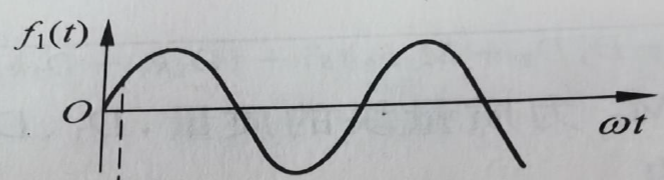|$f_1(t)=\sin(\omega t)\cdot 1(t)$ |
|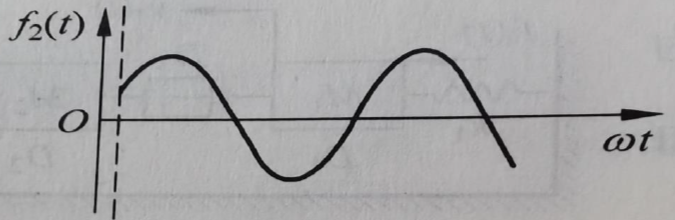|$f_2(t)=\sin(\omega t)\cdot 1(t-t_0)$ |
|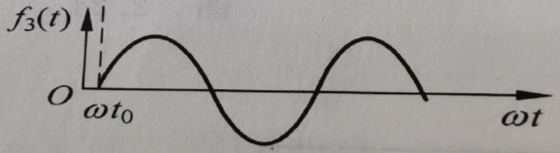|$f_3(t)=\sin\big(\omega (t-t_0)\big)\cdot 1(t-t_0)$ |
#### 拉氏变换的常用基本性质
##### 叠加原理
若$L[f_1(t)]=F_1(s)$，$L[f_2(t)]=F_2(s)$，则有
$$L[af_1(t)+bf_2(t)]=aF_1(s)+bF_2(s)$$
##### 微分定理
$$L\left[\frac{df(t)}{dt}\right]=sF(s)-f(0)$$
根据数学归纳法不难推出
$$L\left[\frac{d^n}{dt^n}f(t)\right] = s^n F(s) - s^{n-1}f(0) - s^{n-2}\dot{f}(0) - \dots - sf^{(n-2)}(0) - f^{(n-1)}(0)$$
若$f(0)=\dot{f}(0)=\dots=f^{(n-2)}(0)=f^{(n-1)}(0)=0$，则有
$$L\left[\frac{d^n}{dt^n}f(t)\right] = s^n F(s)$$
##### 积分定理

这里$\displaystyle f^{-1}(t) \triangleq \int f(t)dt$
$$L\left[\int f(t)dt\right] = \frac{F(s)}{s} + \frac{f^{-1}(0)}{s}$$
同理有
$$ L\left[\underbrace{\int \dots \int}_{n} f(t)(dt)^n\right] = \frac{F(s)}{s^n} + \frac{f^{-1}(0)}{s^n} + \frac{f^{-2}(0)}{s^{n-1}} + \dots + \frac{f^{-n}(0)}{s}$$

若$f^{-1}(0) = f^{-2}(0) = \dots = f^{-n}(0) = 0$，则有
$$ L\left[\underbrace{\int \dots \int}_{n} f(t)(dt)^n\right] = \frac{F(s)}{s^n}$$
##### 衰减定理
$$L[e^{-at}f(t)]=F(s+a)$$
##### 延时定理
$$L\left[f(t-a) \cdot 1(t-a)\right] = e^{-as}F(s)$$
##### 初值定理
$$ \lim_{t \to 0} f(t)=\lim_{s \to \infty} sF(s) $$
##### 终值定理
$$ \lim _{t \rightarrow \infty} f(t)=\lim _{s \rightarrow 0} s F(s) $$
### 拉氏反变换
直接积分求拉氏反变换通常较繁，对于一般的问题，都可以避免积分，而通过将象函数转化为拉氏变换表中包含的形式（一般是分式）。
#### 例题
求$F(s)=\dfrac{s+1}{s^2+5s+6}$的反拉氏变换

易知$F(s)=\dfrac{2}{s+3}-\dfrac{1}{s+2}$
查表可得
$$f(t) = 2e^{-3t}-e^{-2t}$$

### 传递函数
传递函数为**在零起始条件**下，线性定常系统输出象函数$X_o(s)$与输入象函数$X_i(s)$之比
$$G(s)\triangleq\frac{X_o(s)}{X_i(s)}$$

具体地说，设线性定常系统的微分方程为：
$$a_0 x_o^{(n)}(t) + a_1 x_o^{(n-1)}(t) + \cdots + a_{n-1} \dot{x}_o(t) + a_n x_o(t) = b_0 x_i^{(m)}(t) + b_1 x_i^{(m-1)}(t) + \cdots + b_{m-1} \dot{x}_i(t) + b_m x_i(t) \quad (n \ge m)$$
设系统的输入输出函数及其各阶导数**初始值均为零**，将上式拉氏变换，由微分定理推论：
$$\left(a_0 s^n + a_1 s^{n-1} + \cdots + a_{n-1}s + a_n\right)X_o(s) = \left(b_0 s^m + b_1 s^{m-1} + \cdots + b_{m-1}s + b_m\right)X_i(s)$$
传递函数为
$$G(s) = \frac{X_o(s)}{X_i(s)} = \frac{b_0 s^m + b_1 s^{m-1} + \cdots + b_{m-1}s + b_m}{a_0 s^n + a_1 s^{n-1} + \cdots + a_{n-1}s + a_n}$$
#### 传递函数的特性
1. 传递函数是系统的固有特性，与输入情况无关。
2. 零点：传递函数分子为零时的s值
3. 极点：传递函数分母为零时的s值
#### 典型环节的传递函数
|环节|时间函数|相函数|传递函数|例子|
|:-:|:-:|:-:|:-:|:-:|
|比例环节|$x_o(t)=kx_i(t)$|$X_o(s)=kX_i(s)$|$G(s)=k$|运算放大器、齿轮传动副|
|积分环节|$x_o(t)=\displaystyle\int_{0}^{t} x_i(t)\,dt$|$X_o(s)=\dfrac{1}{s}X_i(s)$|$G(s)=\dfrac{1}{s}$|RC 有源积分网络|
|微分环节|$x_o(t)=\dfrac{d}{dt}x_i(t)$|$X_o(s)=sX_i(s)$| $G(s)=s$|永磁式直流测速机、阻尼器|
|一阶惯性环节（机械系统）|$T\dfrac{dx_o(t)}{dt}+x_o(t)=x_i(t)$|$X_o(s)=\dfrac{1}{T s+1}X_i(s)$|$G(s)=\dfrac{1}{T s+1}$|弹簧-阻尼系统|
|一阶惯性环节（滤波电路）|$\begin{cases}u_i(t)=i(t)R+\dfrac{1}{C}\displaystyle\int i(t)\,dt\\[4pt]u_o(t)=\dfrac{1}{C}\displaystyle\int i(t)\,dt\end{cases}$|$\begin{cases}U_i(s)=\left(R+\dfrac{1}{Cs}\right)I(s)=\dfrac{RCs+1}{Cs}I(s)\\[4pt]U_o(s)=\dfrac{1}{Cs}I(s)\\[4pt]\Rightarrow U_o(s)=\dfrac{1}{RCs+1}U_i(s)\end{cases}$|$G(s)=\dfrac{1}{RCs+1}$|RC 低通滤波电路（无源）|
|二阶振荡环节|$T^2\displaystyle\frac{d^2 x_o(t)}{dt^2} + 2\zeta T \displaystyle\frac{d x_o(t)}{dt} + x_o(t) = x_i(t)$|$X_o(s)=\dfrac{1}{T^2 s^2 + 2\zeta T s + 1}\,X_i(s)$|$G(s)=\dfrac{1}{T^2 s^2 + 2\zeta T s + 1}$|满足 $0<\zeta<1$ 时为振荡系统（弹簧-质量-阻尼、二阶滤波器）|
|近似微分环节|$T\displaystyle\frac{dx_o(t)}{dt}+x_o(t)=\displaystyle\frac{dx_i(t)}{dt}$|$X_o(s)=\dfrac{s}{Ts+1}X_i(s)$|$G(s)=\dfrac{s}{Ts+1}$|无源微分网络|
### 方块图
#### 组成部分
|组成部分|描述|图示|
|:-:|:-:|:-:|
|基本单元|图中指向方块的箭头表示输入，从方块出来的箭头表示输出，$G(s)$表示其传递函数。|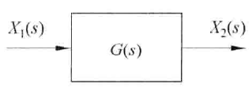|
|比较点|代表两个或两个以上的输入信号进行相加或相减的元件||
|引出点|它表示信号引出和测量的位置，同一位置引出的几个信号，其大小和性质完全一样。|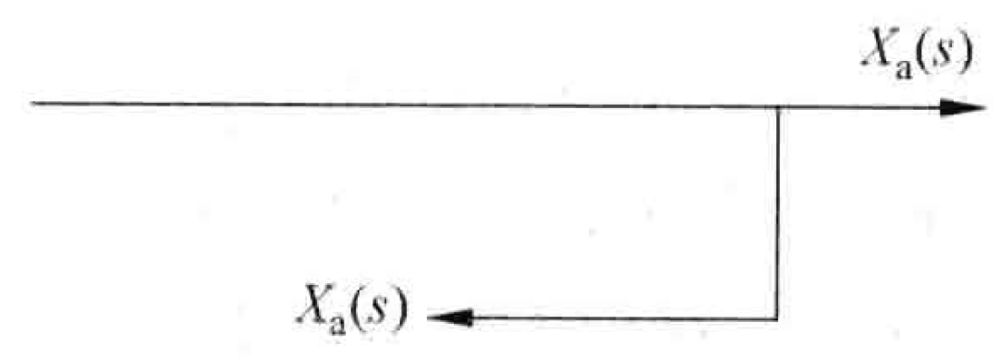|
#### 环节连接方式
|连接方式|原框图|等效|
|:-:|:-:|:-:|
|串联||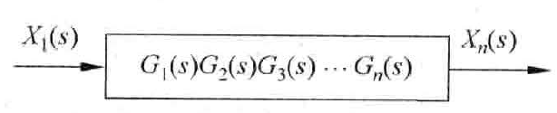|
|并联|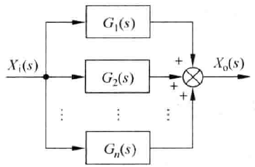||
|反馈||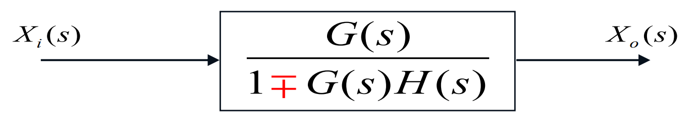|
#### 变换法则

|变换方式|原框图|等效|
|:-:|:-:|:-:|
|引出点前移|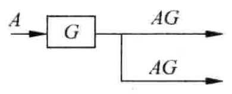|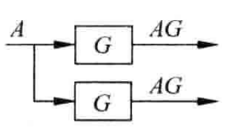|
|引出点后移|||
|比较点前移|||
|比较点后移|||

1. 各**前向通路传递函数的乘积保持不变**；
2. 各**反馈回路传递函数的乘积保持不变**
3. 避免比较点移动后穿过引入点，或者引入点移动后穿过比较点。

   
#### 例题1：大圈套小圈
从小圈到大圈化简反馈回路即可。

#### 例题2：闭环交叉

如上图，前向通路指的就是“主干道”$G_1G_2G_3$，反馈回路指的就是$G_2G_3G_4$这样的环。
我们想要化简$G_2G_3G_4$这个环，但是环内有一个引出点（$G_2,G_3$中间），我们需要将这个引入点移出环外，如果向后（右）移那么这个引入点需要穿过比较点，因此我们将其向左移到$G_2$之前，如下左图。此时为了保持这个反馈回路传递函数的乘积$G_1G_2H_1$保持不变，反馈这一路传递函数变为$H_1G_2$。
这时$G_2G_3G_4$就成为一个纯净的环（没有引入引出比较点），等价为$G_2G_3+G_4$的环节。

  
  

这时$G_1 H_1G_2$回路和$(G_2G_3+G_4)H_2$回路又有交叉了，将$H_1G_2$前的引出点移动到最右端即可，此时为了保持这个反馈回路传递函数的乘积不变，变为$\dfrac{H_1G_2}{G_2G_3+G_4}$，如上右图。
然后将回路从小到大化简即可。最终答案是$$\frac{G_1 (G_2 G_3 + G_4)}{1 + (G_2 G_3 + G_4)(G_1 + H_2) + G_1 G_2 H_1}$$

#### 比较点的一些特殊情况
以下左右两图等价。
1. 多个输入的比较点可以根据其逻辑关系拆成多个比较点

  
  

2. 多个连在一起的比较点也可以根据其逻辑关系进行移动便于化简

  
  

### 梅森公式
考纲没有，但建议学习
#### 信号流图
方块图可以转换为信号流图，信号流图由节点和支路构成。在信号流图有四种节点：输入、输出、比较点和引入/引出点。支路用箭头表示，箭头上的值表示支路增益，总体和方块图类似。
方块图和信号流图的转换如下图

  
  

#### 重要概念
- 前向通路：从输入节点到输出节点，沿着信号流动的方向，且与通路上的任意节点只相交1次的路径称为前向通路。可能有多条前向通路。
- 回路：从一个节点出发，沿着信号流动的方向，又回到该节点且与回路上的任意节点只相交1次的路径称为回路。不相邻回路指的是不共享任何节点的回路。

#### 梅森公式的概念
$$T = \frac{\displaystyle\sum_{i=1}^n T_i \Delta_i}{\Delta}$$

其中，$T$为输入到输出的传递函数，$T_i$为第$i$条前向通路的增益，
$\Delta$为信号流图的特征式，$\Delta_i$为$\Delta$中去掉与第$i$条前向通路相交的回路后的特征式。（其实就是去掉所有与第$i$条前向通路相交的回路相关的项）
#### 信号流图的特征式
$$\Delta = 1 - \sum_a L_a +\sum_{b,c} L_b L_c-\sum_{d,e,f} L_d L_e L_f+\cdots$$
其中$\displaystyle\sum_a L_a$表示所有回路的增益之和，$\displaystyle\sum_{b,c} L_b L_c$表示所有不相邻回路两两增益之积的和，$\displaystyle\sum_{d,e,f} L_d L_e L_f$表示所有不相邻回路三三增益之积的和，依此类推。
#### 例题（多输入）

如图有两个输入$R(s)$和$N(s)$，求$\dfrac{C(s)}{N(s)}$与$\dfrac{C(s)}{R(s)}$

图中有两个回路
$L_1 = -G_1G_2H_1,L_2 = -G_1G_2$
这两个函数有公共节点，因此没有不相邻回路。
$$\Delta = 1 - (L_1 + L_2) = 1 + G_1G_2H_1+G_1G_2$$
注意：对于同一个信号流图，$\Delta$不会随着输入的改变而改变，但是前向通路的条数和增益会改变。
对于$N(s)$输入，有两条前向通路，$T_1 = -1,T_2 = G_3G_2,\Delta_1 = 1+G_1G_2H_1,\Delta_2 = 1$
代入梅森公式
$$\frac{C(s)}{N(s)} = \frac{T_1 \Delta_1 + T_2 \Delta_2}{\Delta} = \frac{-1 \cdot (1+G_1G_2H_1) + G_3G_2 \cdot 1}{1 + G_1G_2H_1 + G_1G_2}$$
同理可以求得$\dfrac{C(s)}{R(s)}$，此处不再赘述。
### 机械系统转方块图
注：这是我自己摸索的比较容易记忆的方法，很难找到对应的理论依据
#### 准则
1. 在机械系统转方块图时，质量块$M$对应$\dfrac{1}{Ms^2}$，阻尼器$D$对应$Ds$，弹簧$K$对应$K$。
2. 一个力$F$经过$\dfrac{1}{Ms^2}$后量纲变为位移$x$，位移$x$经过$Ds$或$K$后量纲变为力$F$。力只能经过$\dfrac{1}{Ms^2}$变为位移，位移只能经过$Ds$或$K$变为力。这里$Ds$称为阻尼器的等效刚度。也就是说，阻尼器视为弹簧即可。
3. 先写出从输入到输出的前向通路
4. 对各个质量块进行受力分析，观察其加速度是否由两力之差决定，同样的，对各个阻尼器和弹簧进行受力分析，观察其力是否由位移差决定。从而决定负反馈回路。
#### 例1

如图，求$\dfrac{Y_o(s)}{F_i(s)}$

输入是力$F_i$，且作用的对象是M，力必须通过$\dfrac{1}{Ms^2}$变为对应的位移，也就是$y_o$，这是前向通路。
显然$M$的加速度不是由$F_i$单独决定，而是$F_i$与弹簧/阻尼器造成力的差，因此有这样一个比较点，这个点上输出的值是$F_i-y_o(k+Ds)$，并且又输入到$\dfrac{1}{Ms^2}$中，从而得到$y_o$的真实值。而弹簧/阻尼器的力完全由$F_i$决定。

我的画图流程如右图所示，最后化简得到结果为
$$\displaystyle\frac{Y_o(s)}{F_i(s)} = \frac{\dfrac{1}{Ms^2}}{1 + \dfrac{1}{Ms^2}(Ds + k)} = \frac{1}{Ms^2 + Ds + k}$$

从而我们也得到一个很重要的单元：当质量块$M$与阻尼器$D$和弹簧$K$串联，且阻尼器$D$和弹簧$K$固结于地面时，其等效传递函数为$$\dfrac{1}{Ms^2 + Ds + K}$$这个单元的输入是作用在质量块上的力，输出是质量块的位移。

在使用这个单元做题的时候将其整体视为一个质量块即可。
 

#### 例2

我们看到这里有两个我们刚才推出的单元，将其等效为$M_1',M_2'$两个质量块，按照刚才的方法画出方块图，首先输入是力，经过一个$\dfrac{1}{Ms^2 + Ds + k}$之后变为$y_1$，然后$y_1$经过阻尼器$D_3$变为阻尼器的力$F_3$，然后经过另一个$\dfrac{1}{Ms^2 + Ds + k}$变为$y_2$，这是前向通路。

### 开环/闭环传递函数

对于右图所示的系统，顾名思义，我们称$G(s)H(s)$为**开环传递函数**，称$\dfrac{G(s)}{1+G(s)H(s)}$为**闭环传递函数**。
#### 开环增益
将开环传递函数 $G(s)H(s)$ 写成标准形式（或称“尾1形式”），此时 $G(s)H(s)$ 表达式最前面的那个常数就是开环增益 $K$。
标准形式为将 $G(s)H(s)$ 分子和分母中所有的一阶和二阶因式都写成 $(Ts+1)$ 或 $(T^2s^2 + 2\zeta Ts + 1)$ 的形式。

例如：假设一个系统的开环传递函数为：$$G(s)H(s) = \frac{100}{s(s+5)}$$
为了找到 $K$，我们将其改写为标准形式：$$G(s)H(s) = \frac{100}{s \cdot 5(\frac{s}{5} + 1)} = \frac{20}{s(0.2s+1)}$$在这个标准形式中，开环增益 $K = 20$。
## 第三章 时域瞬态响应分析
### 机电控制系统里的典型输入信号函数
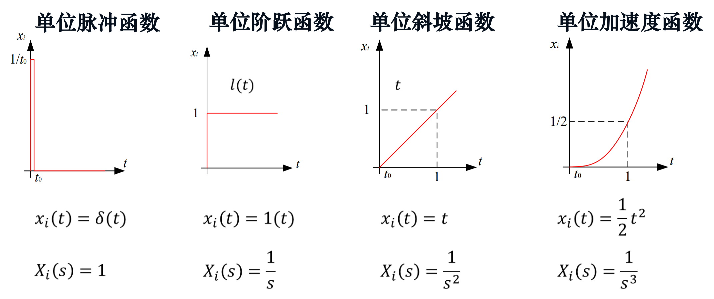
### 一阶系统的瞬态响应
能够用一阶微分方程（只含有未知函数的一阶导数的微分方程）描述的系统。它的典型形式是**一阶惯性环节**。
$$X_i(s)\rightarrow\boxed{\dfrac{1}{Ts+1}}\rightarrow X_o(s)$$
#### 单位脉冲响应

$x_i(t) = \delta(t)\Rightarrow X_i(s) = 1$
$X_o(s) = \dfrac{1}{Ts+1}=\dfrac{\dfrac{1}{T}}{s+\dfrac{1}{T}}\Rightarrow x_o(t) = (\dfrac{1}{T}e^{-\dfrac{1}{T}t})\cdot 1(t)$

$t = T$时$e^{-\dfrac{1}{T}t}=0.368$，衰减了0.632

#### 单位阶跃响应

$x_i(t) = 1(t)\Rightarrow X_i(s) = \dfrac{1}{s}$
$X_o(s)=\dfrac{1}{Ts+1}X_i(s)=\dfrac{1}{s(Ts+1)}=\dfrac{1}{s}-\dfrac{1}{s+\dfrac{1}{T}}\Rightarrow x_o(t)=(1-e^{-\dfrac{1}{T}t})\cdot 1(t)$

1. 一阶惯性系统总是稳定的，无振荡;
2. 经过时间T曲线上升到0.632的高度，据此用实验的方法测出响应曲线达到稳态
值的63.2%高度点所用的时间，即是惯性环节的时间常数$T$;
3. 经过时间$(3 \sim 4)T$，响应曲线已达稳态值的95%~98%，可以认为其调整过程已经
基本完成·故一般取调整时间为$(3 \sim 4)T$；

4. 在t=0处，响应曲线的切线斜率为$\dfrac{1}{T}$;

#### 单位斜坡响应
$\displaystyle X_{\mathrm{o}}(s)=\frac{X_{\mathrm{o}}(s)}{X_{\mathrm{i}}(s)} X_{\mathrm{i}}(s)=\frac{1}{T s+1}\frac{1}{s^{2}}=\frac{1}{s^{2}}-\frac{T}{s}+\frac{T}{s+\dfrac{1}{T}}$

#### 总结
**系统对输入信号导数的响应，就等于系统对该输入信号响应的导数；**
**系统对输入信号积分的响应，就等于系统对该输入信号响应的积分。**
### 二阶系统的瞬态响应
用二阶微分方程描述的系统称为二阶系统。它的典型形式是二阶振荡环节。
$$X_i(s)\rightarrow\boxed{\dfrac{\omega_n^2}{s^2 + 2\zeta \omega_n s + \omega_n^2}}\rightarrow X_o(s)$$
其中$\zeta$为阻尼比，$\omega_n$为无自振角频率

对于任意二阶系统，将分母的二次项化为1，通过其他系数列方程即可求得$\zeta$和$\omega_n$

把$s^2 + 2\zeta \omega_n s + \omega_n^2=0$称为该二阶系统的特征方程，则两个特征根为$s_{1,2}=-\zeta \omega_n \pm  j\omega_n\sqrt{1-\zeta^2}$

将

根据$\zeta$和1的大小关系将系统分为欠阻尼、临界阻尼和过阻尼。

|状态|$\zeta$大小|单位阶跃响应|特性|
|:-:|:-:|:-:|:-:|
|欠阻尼|$0<\zeta<1$|稳定衰减震荡|振荡，$\zeta$愈小，振荡愈严重但响应愈快|
|临界阻尼|$\zeta = 1$|稳定单调上升|无振荡、无超调，过渡过程长;|
|过阻尼|$\zeta > 1$|稳定单调上升|无振荡、无超调，过渡过程长;|
|无阻尼|$\zeta = 0$|等幅周期振荡|等幅振荡|
|负阻尼|$-1<\zeta < 0$|发散震荡上升|阶跃响应发散，系统不稳定|
|负阻尼|$\zeta < -1$|发散单调上升|阶跃响应发散，系统不稳定|

  
  
  

#### 单位阶跃响应
|状态|单位阶跃响应|
|:-:|:-:|
|欠阻尼|$x_o(t) = 1 - \frac{e^{-\zeta \omega_n t}}{\sqrt{1-\zeta^2}} \sin(\omega_d t + \arctan \frac{\sqrt{1-\zeta^2}}{\zeta})$，其中**有阻尼自然频率**$\omega_d = \omega_n\sqrt{1-\zeta^2}$|
|临界阻尼|$x_o(t) = 1 - (1+\omega_n t)e^{-\omega_n t}$|
|过阻尼|$x_o(t) = 1 - \dfrac{s_1 e^{s_2 t} - s_2 e^{s_1 t}}{s_1 - s_2}$，其中$s_1$和$s_2$为特征方程的两个实根。|
|零阻尼|$x_o(t) = 1 - \cos(\omega_n t)$|
#### 时域瞬态响应性能指标

|指标|公式|
|:-:|:-:|
|上升时间|$t_r = \dfrac{\pi - \arccos(\zeta)}{\omega_d}$|
|峰值时间|$t_p = \dfrac{\pi}{\omega_d}$|
|最大超调量|$M_p = e^{-\dfrac{\zeta \pi}{\sqrt{1-\zeta^2}}}$|
|调节时间|$t_s \approx \dfrac{3}{\zeta \omega_n}(\Delta = \pm 5 \%)\\ t_s \approx \dfrac{4}{\zeta \omega_n}(\Delta = \pm 2 \%)$ |

## 第四章 控制系统频率特性
### 系统频率响应

频率响应是指控制系统或元件对**正弦输入信号**的**稳态响应**
$$G(j\omega) = A(\omega) e^{j\phi(\omega)}$$
|概念|定义|公式|
|:-:|:-:|:-:|
|幅频特性|输出信号幅值与输入信号幅值之比随频率变化的规律|$A(\omega) = \|G(j\omega)\|$|
|相频特性|输出信号相位与输入信号相位之差随频率变化的规律|$\phi(\omega) = \angle G(j\omega)$|

由复数的性质可知，对于一般系统，幅值比相乘、相位差相加。

幅值比$$\frac{A_o}{A_i}=|G_1(j\omega)|\cdot|G_2(j\omega)|\cdots |G_n(j\omega)|$$
相位差$$\varphi = \angle G_1(j\omega)+\angle G_2(j\omega)+\cdots+\angle G_n(j\omega)$$
### 乃氏图

对于图示的系统, 其开环频率特性为$G(jω)H(jω)$。乃氏图用于研究开环频率特性，又叫做**开环幅相曲线**。它是极坐标系下以 **（**$G(jω)H(jω)$ **的）**$A(\omega)$为极径，以$\phi(\omega)$为极角的图像。（实际上也是$R(j\omega)$为实轴值，$I(j\omega)$为虚轴值的图像）。乃氏图与负实轴的交点处的频率称为**穿越频率**$\omega_x$。
#### 乃氏图作图
1. 由$G(j\omega)$写出其实部$R(j\omega)$和虚部$I(j\omega)$，从而写出幅频特性$A(\omega)$和相频特性$\phi(\omega)$。
2. 求出$\omega = 0,\omega = 0^+,\omega=+\infty$时的$G(j\omega)$，若$G(j0)\neq G(j0^+)$则将这两点在复平面用平滑的虚线连接
3. 求乃氏图与实轴与虚轴的交点并标注于图上（$R(j\omega)=0,I(j\omega)=0$或$\phi(\omega)= n \cdot 90^\circ$）。
4. 将这些点通过平滑的曲线连在一起。
### 伯德图

在控制学领域，任何一个数N都可以用分贝值n来表示，二者的关系为
$$n = 20 \lg |N|$$
半对数坐标系中绘制的对数幅频特性曲线和对数相频特性曲线，合称为伯德图。其中
- 对数幅频特性$L(\omega) = 20 \lg |G(j\omega)|=20\lg A(\omega)$，单位为分贝dB
- 对数相频特性$\varphi(\omega) = \angle G(j\omega)$

如右图，伯德图分为两张图：$L(\omega)$关于$\omega$的图和$\varphi(\omega)$关于$\omega$的图。半对数坐标系采用十倍频程分度，可以理解为横坐标为$\lg \omega$，也就是说如果$\omega_2 = 10 \omega_1,\omega_3=10\omega_2$，那么在坐标轴上$\omega_3,\omega_2$之间的距离和$\omega_2,\omega_1$之间的距离是相等的，且称为一个**十倍频程**，英语写作$dec$。但是横坐标坐标轴上标注的数据仍为$\omega$而不是$\lg \omega$。
#### 典型环节的伯德图
##### 比例环节

$$A(\omega) = K,\varphi(\omega) = 0 \Rightarrow L(\omega) = 20 \lg K$$
 
 

##### 积分环节

$$G(s) = \frac{1}{s},G(j\omega) = \frac{1}{j\omega}\Rightarrow A(\omega) = \frac{1}{\omega},\varphi(\omega) = -90^\circ \\ \Rightarrow L(\omega) = -20 \lg \omega$$

 
 

### 最小相位系统
传递函数在右半s平面没有零点和极点(即**传递函数零、极点的实部均小于等于零**)且不含延时环节，这种传递函数称之为**最小相位传递函数**，该传递函数所描述的系统，称为**最小相位系统**。

例如下面两个传递函数
$$G_1(s) = \frac{1+T_2s}{1+T_1s},G_2(s) = \frac{1-T_2s}{1+T_1s}(T_1,T_2>0)$$
$G_1(s)$零点和极点都小于0，是最小相位系统；$G_2(s)$零点大于0，不是最小相位系统。
顾名思义，最小相位系统的相位滞后最小。
#### 最小相位系统的性质
最小相位系统的对数幅频特性与相频特性之间存在着唯一的对应关系。这就是说根据系统的对数幅频特性，可以唯一地确定相应的相频特性和传递函数。反之亦然。

## 第五章 控制系统稳定性分析
### 劳斯判据

对于右图所示系统，**闭环传递函数**$G(s) = \dfrac{G(s)}{1+G(s)H(s)}$。闭环传递函数的分母$1+G(s)H(s)=0$为系统的特征方程。
设特征方程为
$$a_0 s^n + a_1 s^{n-1} + \dots + a_{n-1} s + a_n = 0$$

判断系统是否稳定前先检查其必要条件：**所有系数$a_0,a_1,\dots,a_n > 0$（或均<0）**，如果不满足系统就不稳定。
#### 劳斯阵列的构造方法

列出如右图所示劳斯阵列，步骤如下：
1. 根据特征方程的系数，按图示方法填写阵列的第一、二行；
2. 从第三行起，每个元素的分母为其**上一行的第一个元素**，分子为**其前两行的第一列两个元素和其前两行的下一列两个元素合成的2x2矩阵行列式值的相反数**（见下公式）
具体地说，有$$b_1 = \frac{a_1 a_2 - a_0 a_3}{a_1},b_2 = \frac{a_1 a_4 - a_0 a_5}{a_1}$$
3. 依此类推，直到阵列的第n+1行；即$s_0$行

#### 劳斯稳定判据判断系统的稳定性
1. 劳斯阵列第一列所有项> 0 $\Rightarrow$ 系统稳定
2. 劳斯阵列第一列存在<0的项 $\Rightarrow$ 系统不稳定
3. 劳斯阵列第一列存在=0的项 $\Rightarrow$ 系统处于临界稳定状态
### 奈斯奎特判据
$$Z = P-2(N^+-N^-)$$
### 稳定裕量

稳定裕量的概念适用于“开环是最小相位系统”的闭环系统。

#### 截止频率
截止频率$\omega_c$是使得$|G(j\omega_c)|=1$的频率，在乃氏图上表示为乃氏图与单位圆的交点处的频率。
#### 穿越频率
穿越频率$\omega_g$是使得$\angle G(j\omega_g) = -180^\circ$的频率，在乃氏图上表示为乃氏图与负实轴的交点处的频率。
#### 相角裕度
$$r = 180^\circ + \angle G(j\omega_c)$$
#### 幅值裕度
$$h = \frac{1}{|G(j\omega_g)|}$$

|h大小|r大小|系统稳定性|
|:-:|:-:|:-:|
|h>1|r>0|系统稳定|
|h=1|r=0|系统临界稳定|
|h<1|r<0|系统不稳定|
## 第六章 控制系统的误差分析和计算
### 
## 第七章 控制系统的综合与校正

## 第八章 根轨迹法

### 根轨迹的定义
图示系统中开环传递函数为$G(s)H(s)$，将其写为标准的零极点形式（又称为首1标准型）：
$$
G(s)H(s) = \frac{K^* (s-z_1) (s-z_2) \cdots (s-z_m)}{(s-p_1) (s-p_2) \cdots (s-p_n)} = \frac{K^* \prod_{i=1}^{m} (s-z_i)}{\prod_{j=1}^{n} (s-p_j)}
$$
其中$K^*$称为根轨迹增益。
该系统的闭环传递函数为$G(s) = \dfrac{G(s)H(s)}{1+G(s)H(s)}$，特征方程为$1 + G(s)H(s) = 0$
根轨迹是指**随着根轨迹增益$K^*$的变化，闭环系统特征方程的根在复平面上所描绘的轨迹**。