# ~~自动控制原理~~  控制工程基础 补天笔记 part1 
## 第二章 控制系统的动态数学模型
<!-- ### 线性微分方程
1. 未知函数的各阶导数都是一次；
2. 各阶导数的系数可以是常数或是自变量的已知函数；
$$\frac{d^2\theta(t)}{dt^2} + 2\frac{d\theta(t)}{dt} = 1\\\frac{d^2\theta(t)}{dt^2} + 2\theta(t)\frac{d\theta(t)}{dt} = 1\\t\frac{d^2\theta(t)}{dt^2} + 2e^{3t}\frac{d\theta(t)}{dt} = \cos(4t) + 1\\\frac{d^2\theta(t)}{dt^2} + 2\left(\frac{d\theta(t)}{dt}\right)^2 = \cos(4t) + 1$$

从上至下为
线性、非线性、线性、非线性 -->
### 拉普拉斯变换
对于指数级函数$x(t)$，有$\displaystyle\int_{0}^{\infty} x(t)e^{-\sigma t} dt < \infty$，则可定义$x(t)$的拉氏变换$X(s)$：
$$X(s) = L[x(t)] \triangleq \int_{0}^{\infty} x(t)e^{-st} dt$$
式中，称$X(s)$为象函数，$x(t)$为原函数。$s$为复变数，其量纲为时间的倒数，即频率。象函数$X(s)$的量纲为$x(t)$的量纲与时间量纲的乘积。
#### 欧拉公式
$$e^{i\theta} = \cos\theta + i \sin \theta$$
#### 常用的拉氏变换和反变换
|                                                             时间函数                                                             |              象函数 (Laplace)              |
| :------------------------------------------------------------------------------------------------------------------------------: | :----------------------------------------: |
| 单位脉冲函数$\delta(t)=\begin{cases}\displaystyle\lim_{t_{0}\to0}\dfrac{1}{t_{0}}, & 0<t<t_{0}\\[6pt]0, & t\ge t_{0}\end{cases}$ |                    $1$                     |
|                              单位阶跃函数$1(t)=\begin{cases}0, & t<0\\[6pt]1, & t\ge 0\end{cases}$                               |               $\dfrac{1}{s}$               |
|                                                        $t^{n}\ (n\ge 0)$                                                         |           $\dfrac{n!}{s^{n+1}}$            |
|                                                         $\sin(\omega t)$                                                         |     $\dfrac{\omega}{s^{2}+\omega^{2}}$     |
|                                                         $\cos(\omega t)$                                                         |       $\dfrac{s}{s^{2}+\omega^{2}}$        |
|                                                    $e^{at}$（t<0时函数值为0）                                                    |              $\dfrac{1}{s-a}$              |
|                                                         常数倍 $a\,x(t)$                                                         |                 $a\,X(s)$                  |
|                                                叠加定理 $a\,x_{1}(t)+b\,x_{2}(t)$                                                |         $a\,X_{1}(s)+b\,X_{2}(s)$          |
|                                                     微分 $\dfrac{d}{dt}x(t)$                                                     |             $s\,X(s)-x(0^{+})$             |
|                                         积分 $\displaystyle\int_{0}^{t} x(\tau)\,d\tau$                                          | $\dfrac{X(s)}{s}+\dfrac{x^{-1}(0^{+})}{s}$ |
|                                                      衰减定理 $e^{-at}x(t)$                                                      |                  $X(s+a)$                  |
|                                                  延时定理 $x(t-a)\cdot 1(t-a)$                                                   |               $e^{-as}X(s)$                |
#### 信号的截取与时移
|       图像       |                       表达式                        |
| :--------------: | :-------------------------------------------------: |
| 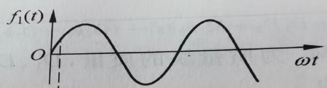 |          $f_1(t)=\sin(\omega t)\cdot 1(t)$          |
| 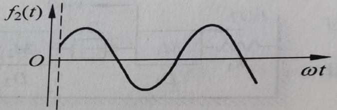 |        $f_2(t)=\sin(\omega t)\cdot 1(t-t_0)$        |
| 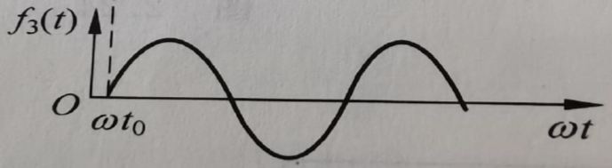 | $f_3(t)=\sin\big(\omega (t-t_0)\big)\cdot 1(t-t_0)$ |
#### 拉氏变换的常用基本性质
##### 叠加原理
若$L[f_1(t)]=F_1(s)$，$L[f_2(t)]=F_2(s)$，则有
$$L[af_1(t)+bf_2(t)]=aF_1(s)+bF_2(s)$$
##### 微分定理
$$L\left[\frac{df(t)}{dt}\right]=sF(s)-f(0)$$
根据数学归纳法不难推出
$$L\left[\frac{d^n}{dt^n}f(t)\right] = s^n F(s) - s^{n-1}f(0) - s^{n-2}\dot{f}(0) - \dots - sf^{(n-2)}(0) - f^{(n-1)}(0)$$
若$f(0)=\dot{f}(0)=\dots=f^{(n-2)}(0)=f^{(n-1)}(0)=0$，则有
$$L\left[\frac{d^n}{dt^n}f(t)\right] = s^n F(s)$$
##### 积分定理

这里$\displaystyle f^{-1}(t) \triangleq \int f(t)dt$
$$L\left[\int f(t)dt\right] = \frac{F(s)}{s} + \frac{f^{-1}(0)}{s}$$
同理有
$$ L\left[\underbrace{\int \dots \int}_{n} f(t)(dt)^n\right] = \frac{F(s)}{s^n} + \frac{f^{-1}(0)}{s^n} + \frac{f^{-2}(0)}{s^{n-1}} + \dots + \frac{f^{-n}(0)}{s}$$

若$f^{-1}(0) = f^{-2}(0) = \dots = f^{-n}(0) = 0$，则有
$$ L\left[\underbrace{\int \dots \int}_{n} f(t)(dt)^n\right] = \frac{F(s)}{s^n}$$
##### 衰减定理
$$L[e^{-at}f(t)]=F(s+a)$$
##### 延时定理
$$L\left[f(t-a) \cdot 1(t-a)\right] = e^{-as}F(s)$$
##### 初值定理
$$ \lim_{t \to 0} f(t)=\lim_{s \to \infty} sF(s) $$
##### 终值定理
$$ \lim _{t \rightarrow \infty} f(t)=\lim _{s \rightarrow 0} s F(s) $$
### 拉氏反变换
直接积分求拉氏反变换通常较繁，对于一般的问题，都可以避免积分，而通过将象函数转化为拉氏变换表中包含的形式（一般是分式）。
#### 例题
求$F(s)=\dfrac{s+1}{s^2+5s+6}$的反拉氏变换

易知$F(s)=\dfrac{2}{s+3}-\dfrac{1}{s+2}$
查表可得
$$f(t) = 2e^{-3t}-e^{-2t}$$

### 传递函数
传递函数为**在零起始条件**下，线性定常系统输出象函数$X_o(s)$与输入象函数$X_i(s)$之比
$$G(s)\triangleq\frac{X_o(s)}{X_i(s)}$$

具体地说，设线性定常系统的微分方程为：
$$a_0 x_o^{(n)}(t) + a_1 x_o^{(n-1)}(t) + \cdots + a_{n-1} \dot{x}_o(t) + a_n x_o(t) = b_0 x_i^{(m)}(t) + b_1 x_i^{(m-1)}(t) + \cdots + b_{m-1} \dot{x}_i(t) + b_m x_i(t) \quad (n \ge m)$$
设系统的输入输出函数及其各阶导数**初始值均为零**，将上式拉氏变换，由微分定理推论：
$$\left(a_0 s^n + a_1 s^{n-1} + \cdots + a_{n-1}s + a_n\right)X_o(s) = \left(b_0 s^m + b_1 s^{m-1} + \cdots + b_{m-1}s + b_m\right)X_i(s)$$
传递函数为
$$G(s) = \frac{X_o(s)}{X_i(s)} = \frac{b_0 s^m + b_1 s^{m-1} + \cdots + b_{m-1}s + b_m}{a_0 s^n + a_1 s^{n-1} + \cdots + a_{n-1}s + a_n}$$
#### 传递函数的特性
1. 传递函数是系统的固有特性，与输入情况无关。
2. 零点：传递函数分子为零时的s值
3. 极点：传递函数分母为零时的s值
#### 典型环节的传递函数
|           环节           |                                                             时间函数                                                              |                                                                                 相函数                                                                                 |                  传递函数                  |                            例子                             |
| :----------------------: | :-------------------------------------------------------------------------------------------------------------------------------: | :--------------------------------------------------------------------------------------------------------------------------------------------------------------------: | :----------------------------------------: | :---------------------------------------------------------: |
|         比例环节         |                                                         $x_o(t)=kx_i(t)$                                                          |                                                                            $X_o(s)=kX_i(s)$                                                                            |                  $G(s)=k$                  |                   运算放大器、齿轮传动副                    |
|         积分环节         |                                           $x_o(t)=\displaystyle\int_{0}^{t} x_i(t)\,dt$                                           |                                                                      $X_o(s)=\dfrac{1}{s}X_i(s)$                                                                       |            $G(s)=\dfrac{1}{s}$             |                       RC 有源积分网络                       |
|         微分环节         |                                                   $x_o(t)=\dfrac{d}{dt}x_i(t)$                                                    |                                                                            $X_o(s)=sX_i(s)$                                                                            |                  $G(s)=s$                  |                  永磁式直流测速机、阻尼器                   |
| 一阶惯性环节（机械系统） |                                               $T\dfrac{dx_o(t)}{dt}+x_o(t)=x_i(t)$                                                |                                                                    $X_o(s)=\dfrac{1}{T s+1}X_i(s)$                                                                     |          $G(s)=\dfrac{1}{T s+1}$           |                        弹簧-阻尼系统                        |
| 一阶惯性环节（滤波电路） | $\begin{cases}u_i(t)=i(t)R+\dfrac{1}{C}\displaystyle\int i(t)\,dt\\[4pt]u_o(t)=\dfrac{1}{C}\displaystyle\int i(t)\,dt\end{cases}$ | $\begin{cases}U_i(s)=\left(R+\dfrac{1}{Cs}\right)I(s)=\dfrac{RCs+1}{Cs}I(s)\\[4pt]U_o(s)=\dfrac{1}{Cs}I(s)\\[4pt]\Rightarrow U_o(s)=\dfrac{1}{RCs+1}U_i(s)\end{cases}$ |          $G(s)=\dfrac{1}{RCs+1}$           |                   RC 低通滤波电路（无源）                   |
|       二阶振荡环节       |              $T^2\displaystyle\frac{d^2 x_o(t)}{dt^2} + 2\zeta T \displaystyle\frac{d x_o(t)}{dt} + x_o(t) = x_i(t)$              |                                                          $X_o(s)=\dfrac{1}{T^2 s^2 + 2\zeta T s + 1}\,X_i(s)$                                                          | $G(s)=\dfrac{1}{T^2 s^2 + 2\zeta T s + 1}$ | 满足 $0<\zeta<1$ 时为振荡系统（弹簧-质量-阻尼、二阶滤波器） |
|       近似微分环节       |                             $T\displaystyle\frac{dx_o(t)}{dt}+x_o(t)=\displaystyle\frac{dx_i(t)}{dt}$                             |                                                                     $X_o(s)=\dfrac{s}{Ts+1}X_i(s)$                                                                     |           $G(s)=\dfrac{s}{Ts+1}$           |                        无源微分网络                         |
### 方块图
#### 组成部分
| 组成部分 |                                     描述                                     |       图示       |
| :------: | :--------------------------------------------------------------------------: | :--------------: |
| 基本单元 | 图中指向方块的箭头表示输入，从方块出来的箭头表示输出，$G(s)$表示其传递函数。 | 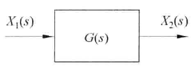 |
|  比较点  |               代表两个或两个以上的输入信号进行相加或相减的元件               | 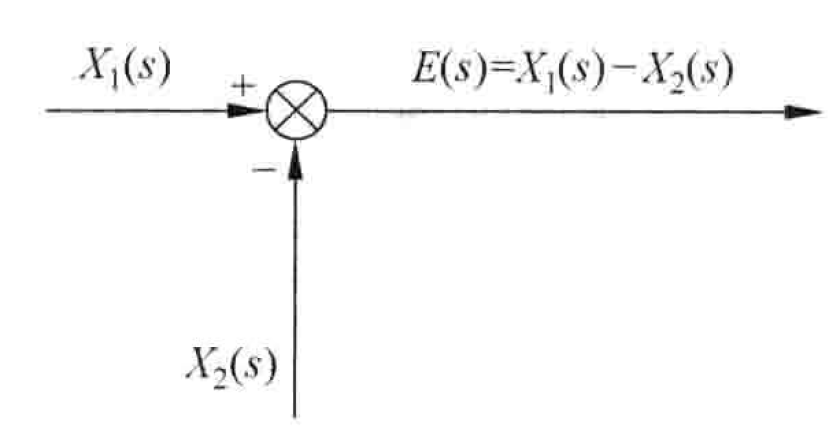 |
|  引出点  |  它表示信号引出和测量的位置，同一位置引出的几个信号，其大小和性质完全一样。  | 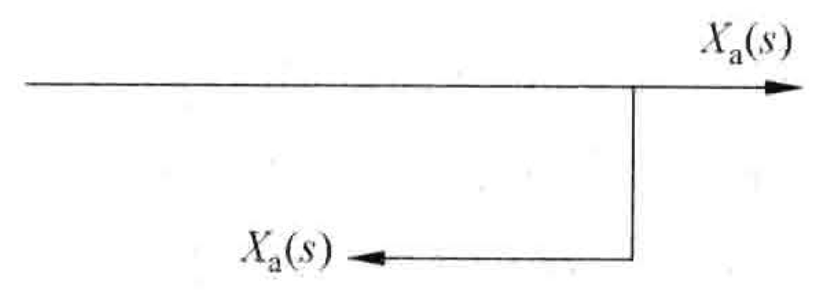 |
#### 环节连接方式
| 连接方式 |      原框图       |       等效        |
| :------: | :---------------: | :---------------: |
|   串联   | 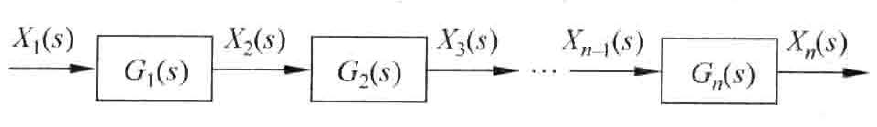  | 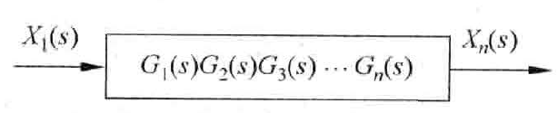  |
|   并联   | 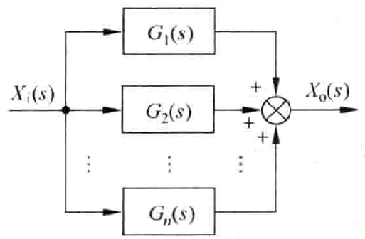  | 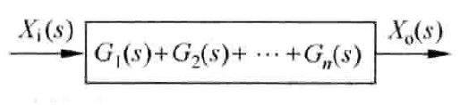 |
|   反馈   | 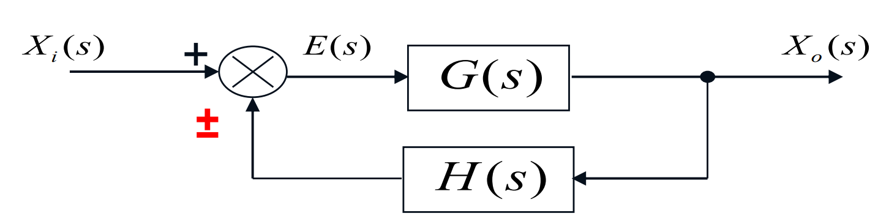 | 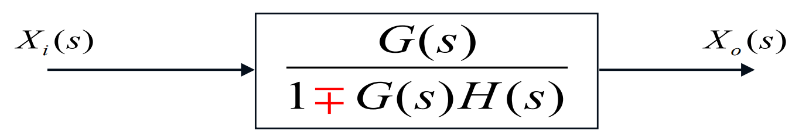 |
#### 变换法则

|  变换方式  |      原框图       |       等效        |
| :--------: | :---------------: | :---------------: |
| 引出点前移 | 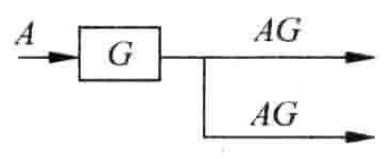 | 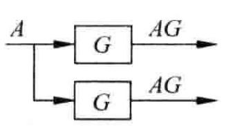 |
| 引出点后移 | 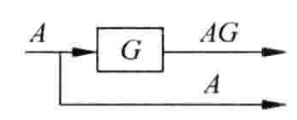 |  |
| 比较点前移 | 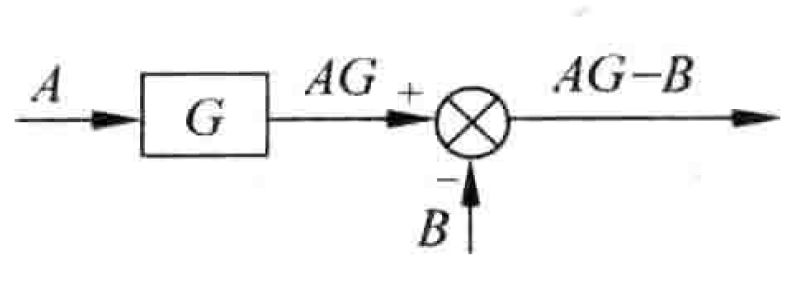 | 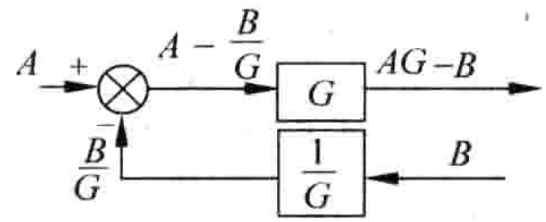 |
| 比较点后移 | 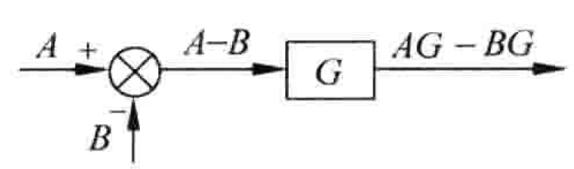 | 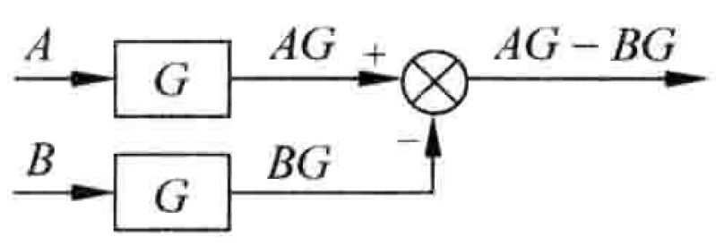 |

1. 各**前向通路传递函数的乘积保持不变**；
2. 各**反馈回路传递函数的乘积保持不变**
3. 避免比较点移动后穿过引入点，或者引入点移动后穿过比较点。

   
#### 例题1：大圈套小圈
从小圈到大圈化简反馈回路即可。

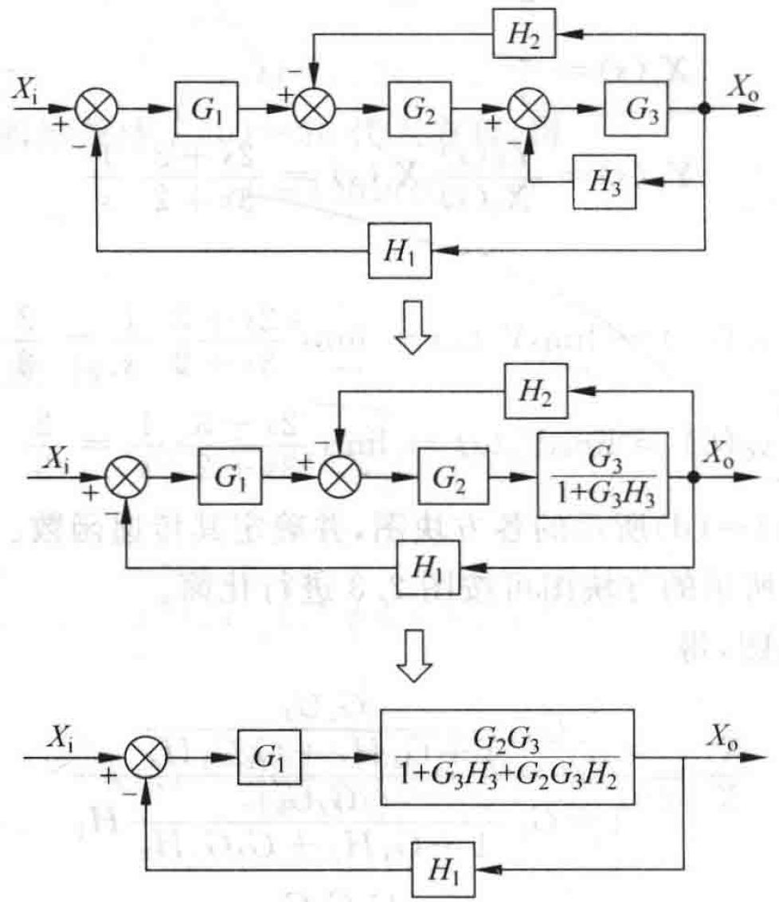

#### 例题2：闭环交叉

如上图，前向通路指的就是“主干道”$G_1G_2G_3$，反馈回路指的就是$G_2G_3G_4$这样的环。
我们想要化简$G_2G_3G_4$这个环，但是环内有一个引出点（$G_2,G_3$中间），我们需要将这个引入点移出环外，如果向后（右）移那么这个引入点需要穿过比较点，因此我们将其向左移到$G_2$之前，如下左图。此时为了保持这个反馈回路传递函数的乘积$G_1G_2H_1$保持不变，反馈这一路传递函数变为$H_1G_2$。
这时$G_2G_3G_4$就成为一个纯净的环（没有引入引出比较点），等价为$G_2G_3+G_4$的环节。

  
  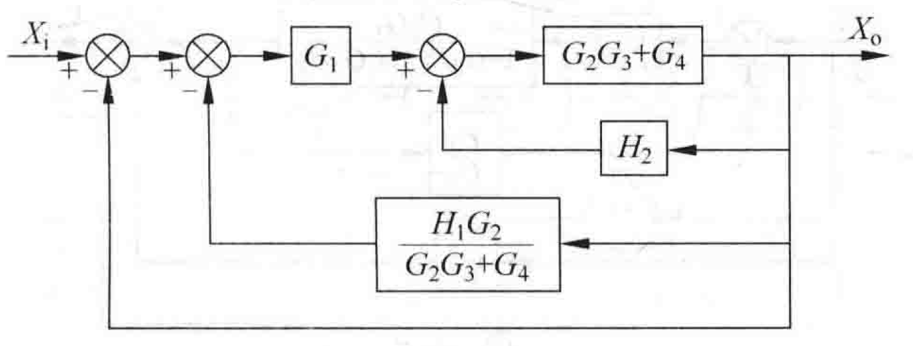

这时$G_1 H_1G_2$回路和$(G_2G_3+G_4)H_2$回路又有交叉了，将$H_1G_2$前的引出点移动到最右端即可，此时为了保持这个反馈回路传递函数的乘积不变，变为$\dfrac{H_1G_2}{G_2G_3+G_4}$，如上右图。
然后将回路从小到大化简即可。最终答案是$$\frac{G_1 (G_2 G_3 + G_4)}{1 + (G_2 G_3 + G_4)(G_1 + H_2) + G_1 G_2 H_1}$$

#### 比较点的一些特殊情况
以下左右两图等价。
1. 多个输入的比较点可以根据其逻辑关系拆成多个比较点

  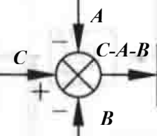
  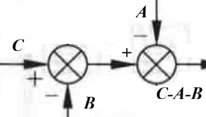

2. 多个连在一起的比较点也可以根据其逻辑关系进行移动便于化简

  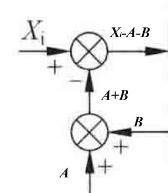
  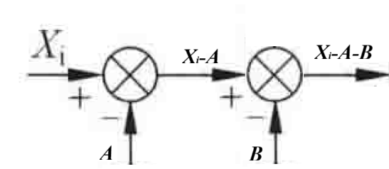

### 梅森公式
考纲没有，但建议学习
#### 信号流图
方块图可以转换为信号流图，信号流图由节点和支路构成。在信号流图有四种节点：输入、输出、比较点和引入/引出点。支路用箭头表示，箭头上的值表示支路增益，总体和方块图类似。
方块图和信号流图的转换如下图

  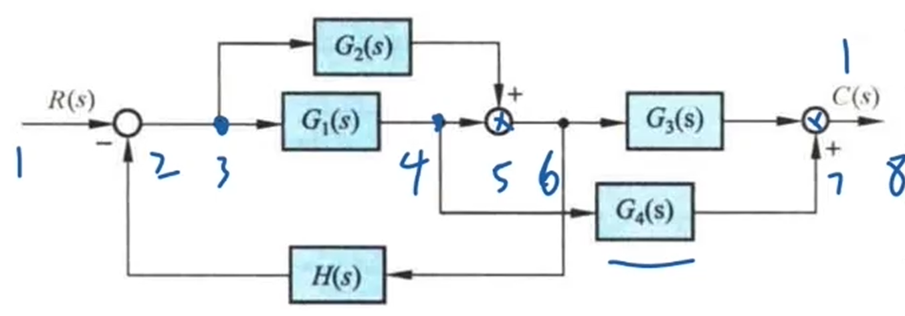
  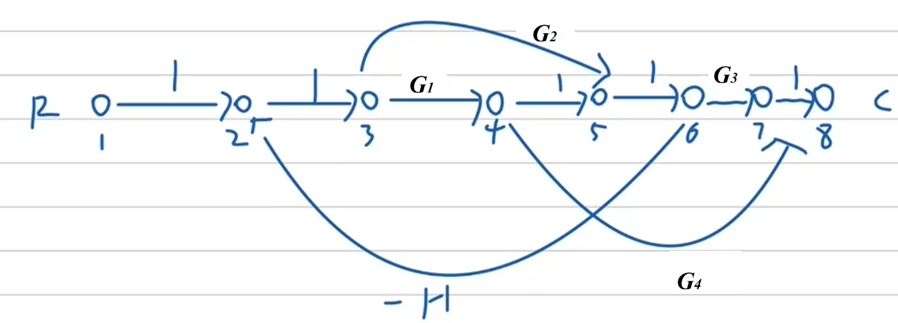

#### 重要概念
- 前向通路：从输入节点到输出节点，沿着信号流动的方向，且与通路上的任意节点只相交1次的路径称为前向通路。可能有多条前向通路。
- 回路：从一个节点出发，沿着信号流动的方向，又回到该节点且与回路上的任意节点只相交1次的路径称为回路。不相邻回路指的是不共享任何节点的回路。

#### 梅森公式的概念
$$T = \frac{\displaystyle\sum_{i=1}^n T_i \Delta_i}{\Delta}$$

其中，$T$为输入到输出的传递函数，$T_i$为第$i$条前向通路的增益，
$\Delta$为信号流图的特征式，$\Delta_i$为$\Delta$中去掉与第$i$条前向通路相交的回路后的特征式。（其实就是去掉所有与第$i$条前向通路相交的回路相关的项）
#### 信号流图的特征式
$$\Delta = 1 - \sum_a L_a +\sum_{b,c} L_b L_c-\sum_{d,e,f} L_d L_e L_f+\cdots$$
其中$\displaystyle\sum_a L_a$表示所有回路的增益之和，$\displaystyle\sum_{b,c} L_b L_c$表示所有不相邻回路两两增益之积的和，$\displaystyle\sum_{d,e,f} L_d L_e L_f$表示所有不相邻回路三三增益之积的和，依此类推。
#### 例题（多输入）
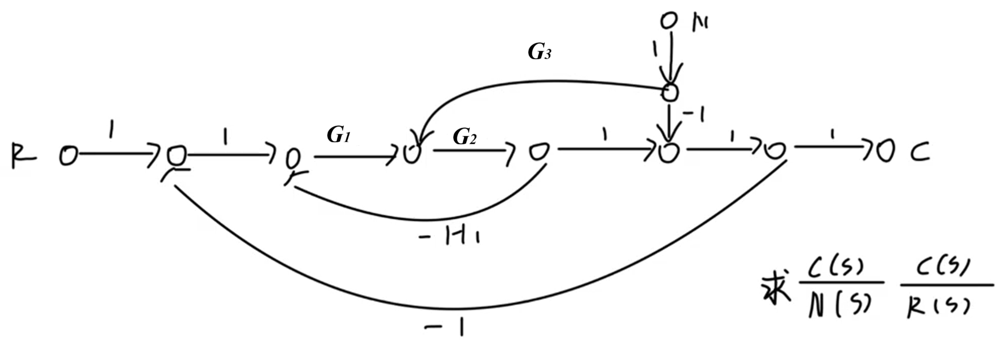

如图有两个输入$R(s)$和$N(s)$，求$\dfrac{C(s)}{N(s)}$与$\dfrac{C(s)}{R(s)}$

图中有两个回路
$L_1 = -G_1G_2H_1,L_2 = -G_1G_2$
这两个函数有公共节点，因此没有不相邻回路。
$$\Delta = 1 - (L_1 + L_2) = 1 + G_1G_2H_1+G_1G_2$$
注意：对于同一个信号流图，$\Delta$不会随着输入的改变而改变，但是前向通路的条数和增益会改变。
对于$N(s)$输入，有两条前向通路，$T_1 = -1,T_2 = G_3G_2,\Delta_1 = 1+G_1G_2H_1,\Delta_2 = 1$
代入梅森公式
$$\frac{C(s)}{N(s)} = \frac{T_1 \Delta_1 + T_2 \Delta_2}{\Delta} = \frac{-1 \cdot (1+G_1G_2H_1) + G_3G_2 \cdot 1}{1 + G_1G_2H_1 + G_1G_2}$$
同理可以求得$\dfrac{C(s)}{R(s)}$，此处不再赘述。
### 机械系统转方块图
#### 准则
1. 在机械系统转方块图时，质量块$M$对应$\dfrac{1}{Ms^2}$，阻尼器$D$对应$Ds$，弹簧$K$对应$K$。
2. 一个力$F$经过$\dfrac{1}{Ms^2}$后量纲变为位移$x$，位移$x$经过$Ds$或$K$后量纲变为力$F$。力只能经过$\dfrac{1}{Ms^2}$变为位移，位移只能经过$Ds$或$K$变为力。这里$Ds$称为阻尼器的等效刚度。也就是说，阻尼器视为弹簧即可。
3. 先写出从输入到输出的前向通路
4. 对各个质量块进行受力分析，观察其加速度是否由两力之差决定，同样的，对各个阻尼器和弹簧进行受力分析，观察其力是否由位移差决定。从而决定负反馈回路。注意：你在管某一环节的加速度是否由两力之差决定，或者是力是否由位移差决定时，只需要管前向通路
#### 例1
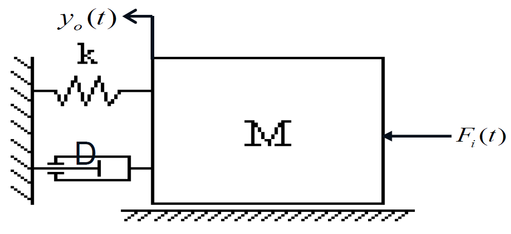

如图，求$\dfrac{Y_o(s)}{F_i(s)}$

输入是力$F_i$，且作用的对象是M，力必须通过$\dfrac{1}{Ms^2}$变为对应的位移，也就是$y_o$，这是前向通路。
显然$M$的加速度不是由$F_i$单独决定，而是$F_i$与弹簧/阻尼器造成力的差，因此有这样一个比较点，这个点上输出的值是$F_i-y_o(k+Ds)$，并且又输入到$\dfrac{1}{Ms^2}$中，从而得到$y_o$的真实值。而弹簧/阻尼器的力完全由$F_i$决定。

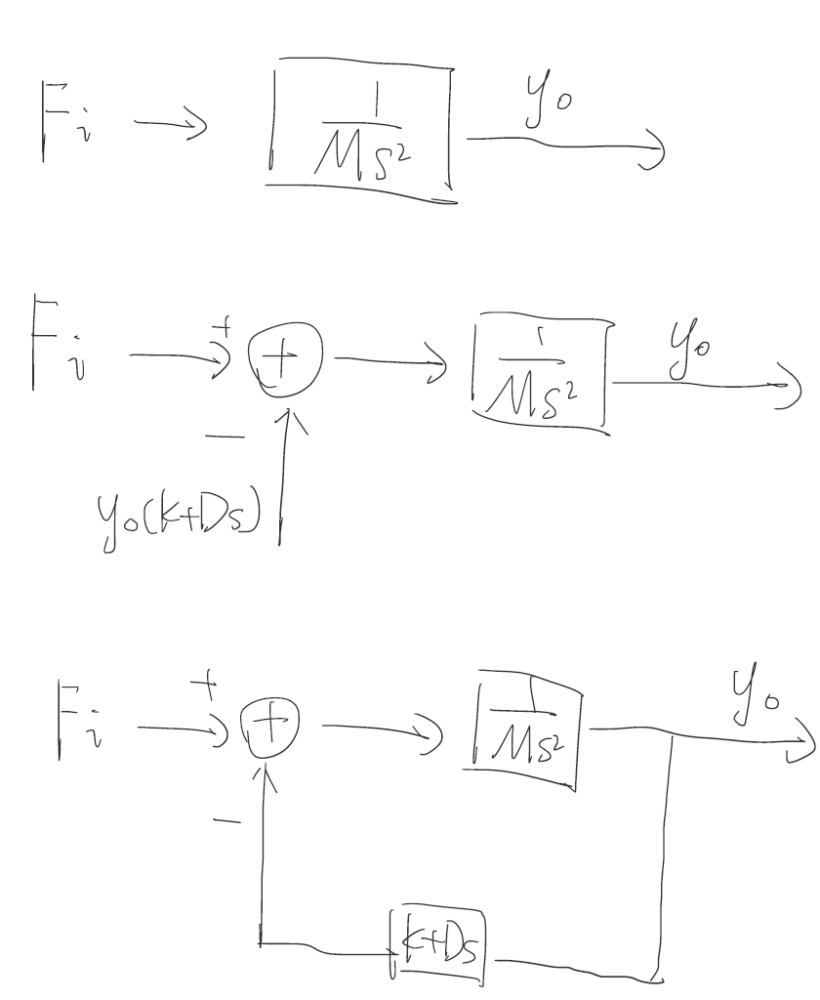

我的画图流程如右图所示，最后化简得到结果为
$$\displaystyle\frac{Y_o(s)}{F_i(s)} = \frac{\dfrac{1}{Ms^2}}{1 + \dfrac{1}{Ms^2}(Ds + k)} = \frac{1}{Ms^2 + Ds + k}$$

从而我们也得到一个很重要的单元：当质量块$M$与阻尼器$D$和弹簧$K$串联，且阻尼器$D$和弹簧$K$固结于地面时，其等效传递函数为$$\dfrac{1}{Ms^2 + Ds + K}$$这个单元的输入是作用在质量块上的力，输出是质量块的位移。

在使用这个单元做题的时候将其整体视为一个质量块即可。
 

#### 例2
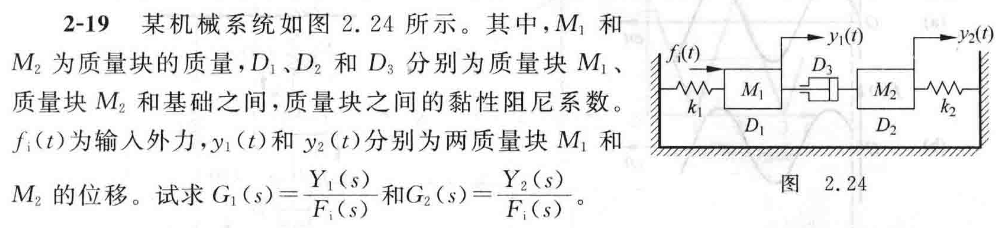

我们看到这里有两个我们刚才推出的单元，将其等效为$M_1',M_2'$两个质量块，按照刚才的方法画出方块图，首先输入是力，经过一个$\dfrac{1}{Ms^2 + Ds + k}$之后变为$y_1$，然后$y_1$经过阻尼器$D_3$变为阻尼器的力$F_3$，然后经过另一个$\dfrac{1}{Ms^2 + Ds + k}$变为$y_2$，这是前向通路。

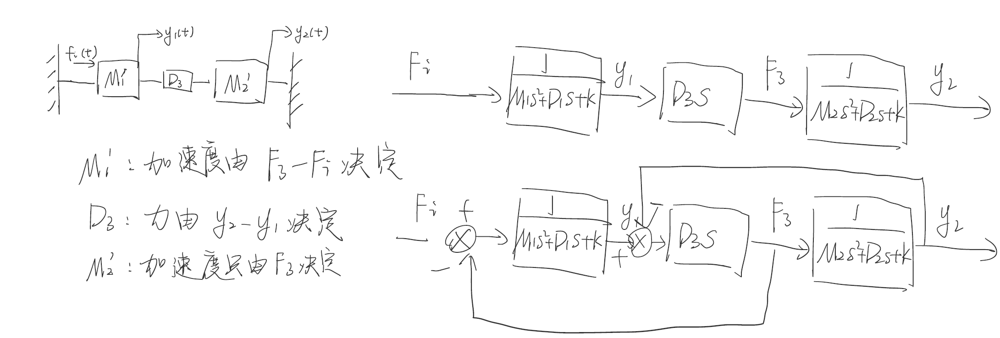
### 开环/闭环传递函数
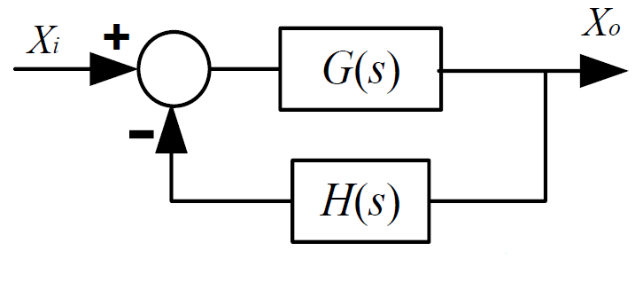

对于右图所示的系统，顾名思义，我们称$G(s)H(s)$为**开环传递函数**，称$\dfrac{G(s)}{1+G(s)H(s)}$为**闭环传递函数**。
#### 开环增益
将开环传递函数 $G(s)H(s)$ 写成尾1形式，此时 $G(s)H(s)$ 表达式最前面的那个常数就是开环增益 $K$。
尾1形式为将 $G(s)H(s)$ 分子和分母中所有的一阶和二阶因式都写成 $(Ts+1)$ 或 $(T^2s^2 + 2\zeta Ts + 1)$ 的形式。

例如：假设一个系统的开环传递函数为：$$G(s)H(s) = \frac{100}{s(s+5)}$$
为了找到 $K$，我们将其改写为尾1形式：$$G(s)H(s) = \frac{100}{s \cdot 5(\frac{s}{5} + 1)} = \frac{20}{s(0.2s+1)}$$在这个标准形式中，开环增益 $K = 20$。
#### 单位反馈
如果图示系统中$H(s)=1$，则称该系统为单位负反馈系统。
## 第三章 时域瞬态响应分析
### 机电控制系统里的典型输入信号函数
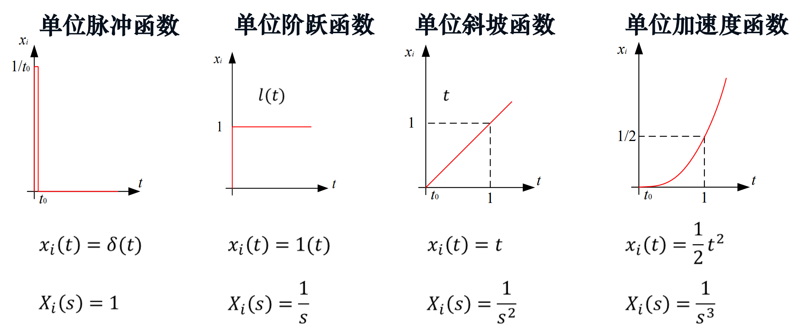
### 一阶系统的瞬态响应（了解过程即可）
能够用一阶微分方程（只含有未知函数的一阶导数的微分方程）描述的系统。它的典型形式是**一阶惯性环节**。
$$X_i(s)\rightarrow\boxed{\dfrac{1}{Ts+1}}\rightarrow X_o(s)$$
#### 单位脉冲响应
<!-- 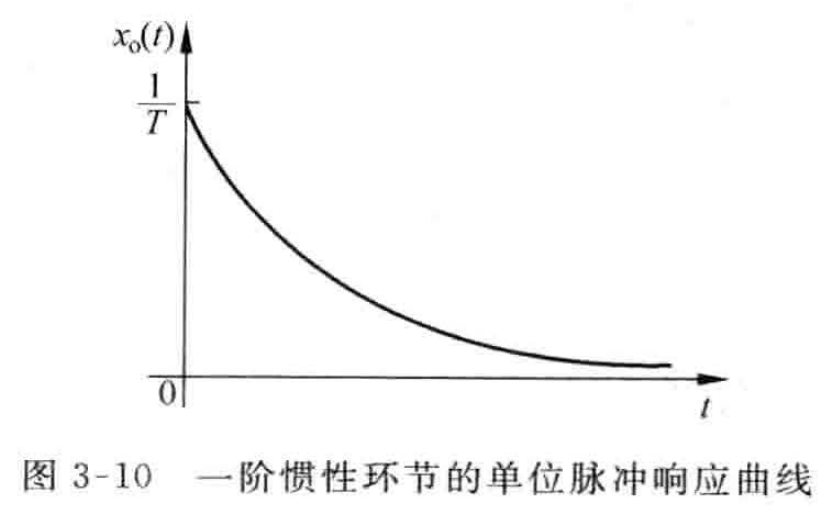 -->

$x_i(t) = \delta(t)\Rightarrow X_i(s) = 1$
$X_o(s) = \dfrac{1}{Ts+1}=\dfrac{\dfrac{1}{T}}{s+\dfrac{1}{T}}\Rightarrow x_o(t) = (\dfrac{1}{T}e^{-\dfrac{1}{T}t})\cdot 1(t)$

#### 单位阶跃响应
<!-- 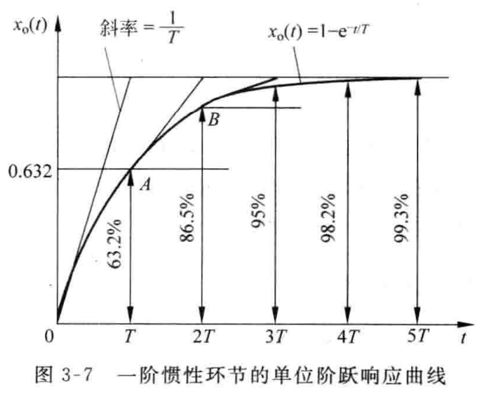 -->

$x_i(t) = 1(t)\Rightarrow X_i(s) = \dfrac{1}{s}$
$X_o(s)=\dfrac{1}{Ts+1}X_i(s)=\dfrac{1}{s(Ts+1)}=\dfrac{1}{s}-\dfrac{1}{s+\dfrac{1}{T}}\Rightarrow x_o(t)=(1-e^{-\dfrac{1}{T}t})\cdot 1(t)$

#### 单位斜坡响应
<!-- 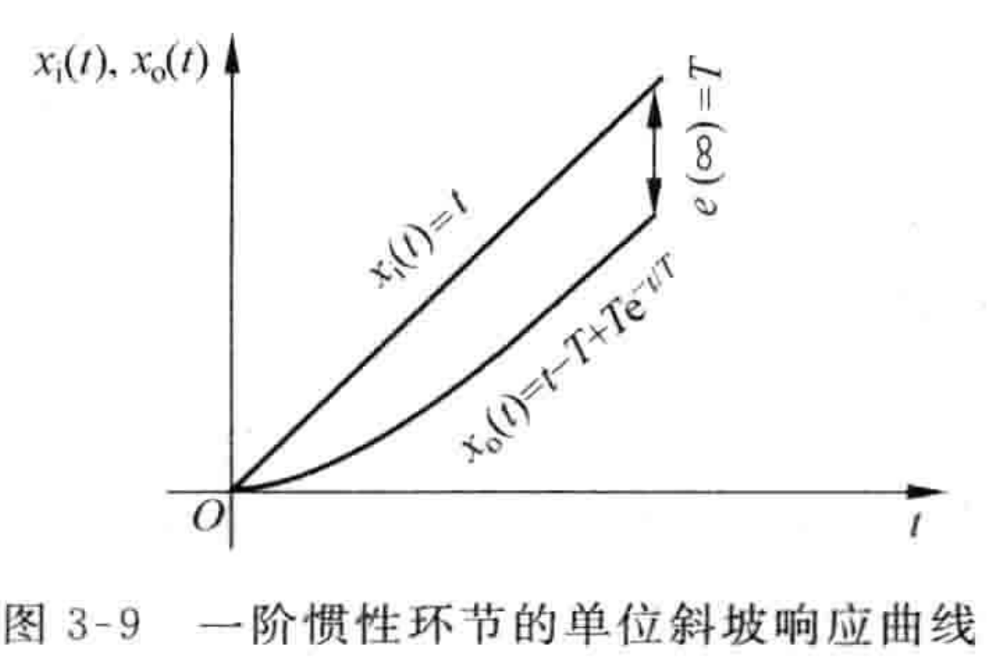 -->

$\displaystyle X_{\mathrm{o}}(s)=\frac{X_{\mathrm{o}}(s)}{X_{\mathrm{i}}(s)} X_{\mathrm{i}}(s)=\frac{1}{T s+1}\frac{1}{s^{2}}=\frac{1}{s^{2}}-\frac{T}{s}+\frac{T}{s+\dfrac{1}{T}}$

#### 总结
**系统对输入信号导数的响应，就等于系统对该输入信号响应的导数；**
**系统对输入信号积分的响应，就等于系统对该输入信号响应的积分。**
### 二阶系统的瞬态响应
用二阶微分方程描述的系统称为二阶系统。它的典型形式是二阶振荡环节。
$$X_i(s)\rightarrow\boxed{\dfrac{\omega_n^2}{s^2 + 2\zeta \omega_n s + \omega_n^2}}\rightarrow X_o(s)$$
其中$\zeta$为阻尼比，$\omega_n$为无自振角频率

对于任意二阶系统，将分母的二次项化为1，通过其他系数列方程即可求得$\zeta$和$\omega_n$

把$s^2 + 2\zeta \omega_n s + \omega_n^2=0$称为该二阶系统的特征方程，则两个特征根为$s_{1,2}=-\zeta \omega_n \pm  j\omega_n\sqrt{1-\zeta^2}$

将$\omega_d = \omega_n\sqrt{1-\zeta^2}$称为阻尼自然频率。

根据$\zeta$和1的大小关系将系统分为欠阻尼、临界阻尼和过阻尼。

|   状态   |  $\zeta$大小   | 单位阶跃响应 |                  特性                   |
| :------: | :------------: | :----------: | :-------------------------------------: |
|  欠阻尼  |  $0<\zeta<1$   | 稳定衰减震荡 | 振荡，$\zeta$愈小，振荡愈严重但响应愈快 |
| 临界阻尼 |  $\zeta = 1$   | 稳定单调上升 |       无振荡、无超调，过渡过程长;       |
|  过阻尼  |  $\zeta > 1$   | 稳定单调上升 |       无振荡、无超调，过渡过程长;       |
|  无阻尼  |  $\zeta = 0$   | 等幅周期振荡 |                等幅振荡                 |
|  负阻尼  | $-1<\zeta < 0$ | 发散震荡上升 |        阶跃响应发散，系统不稳定         |
|  负阻尼  |  $\zeta < -1$  | 发散单调上升 |        阶跃响应发散，系统不稳定         |

  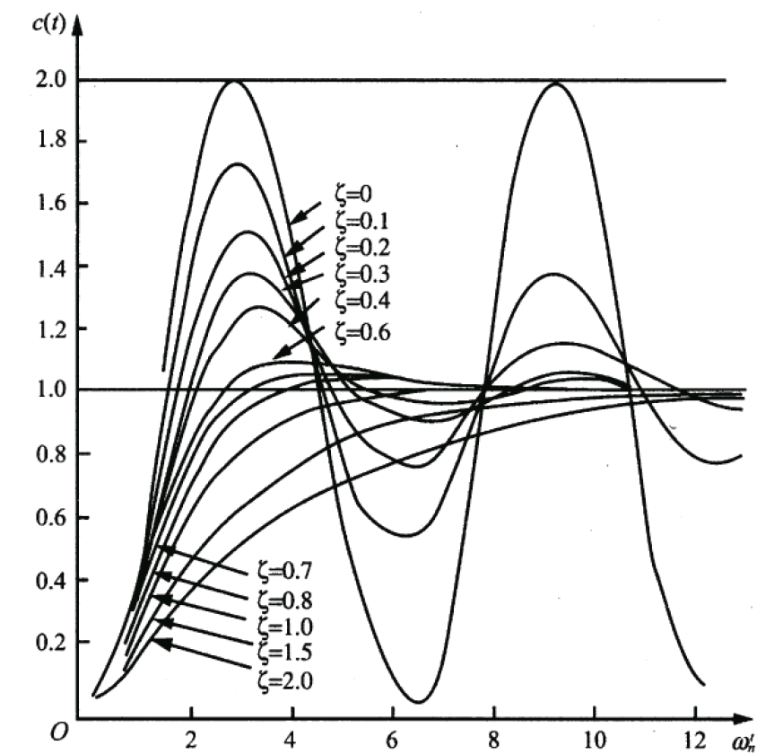
  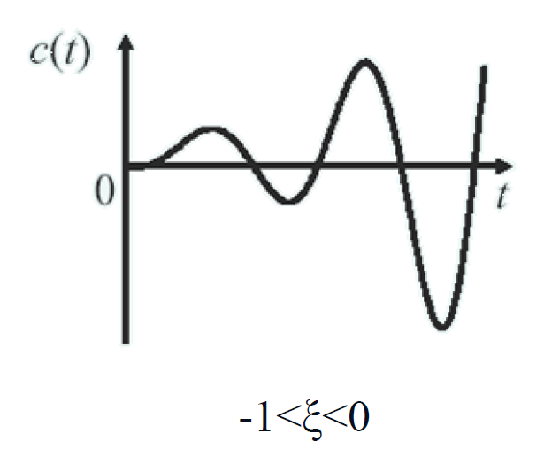
  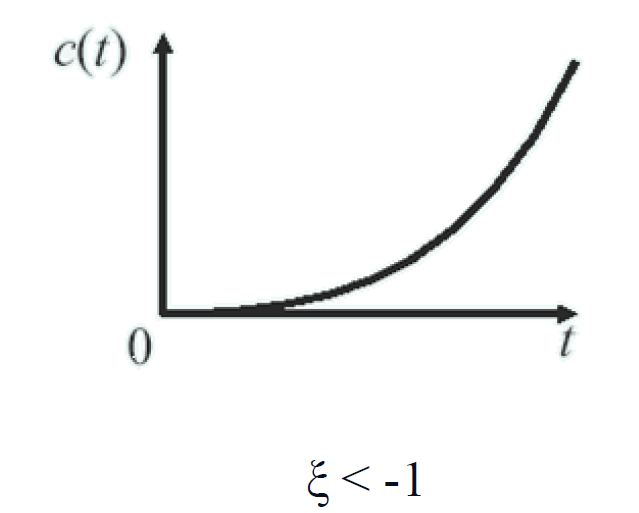

<!-- #### 单位阶跃响应
|   状态   |                                                                                     单位阶跃响应                                                                                     |
| :------: | :----------------------------------------------------------------------------------------------------------------------------------------------------------------------------------: |
|  欠阻尼  | $x_o(t) = 1 - \frac{e^{-\zeta \omega_n t}}{\sqrt{1-\zeta^2}} \sin(\omega_d t + \arctan \frac{\sqrt{1-\zeta^2}}{\zeta})$，其中**有阻尼自然频率**$\omega_d = \omega_n\sqrt{1-\zeta^2}$ |
| 临界阻尼 |                                                                     $x_o(t) = 1 - (1+\omega_n t)e^{-\omega_n t}$                                                                     |
|  过阻尼  |                                       $x_o(t) = 1 - \dfrac{s_1 e^{s_2 t} - s_2 e^{s_1 t}}{s_1 - s_2}$，其中$s_1$和$s_2$为特征方程的两个实根。                                        |
|  零阻尼  |                                                                           $x_o(t) = 1 - \cos(\omega_n t)$                                                                            | --> |
#### 二阶系统阶跃响应的性能指标
注意：不需要是单位阶跃响应

|    指标    |                                                            公式                                                             |
| :--------: | :-------------------------------------------------------------------------------------------------------------------------: |
|  上升时间  |                                       $t_r = \dfrac{\pi - \arccos(\zeta)}{\omega_d}$                                        |
|  峰值时间  |                                                $t_p = \dfrac{\pi}{\omega_d}$                                                |
| 最大超调量 |                                      $M_p = e^{-\dfrac{\zeta \pi}{\sqrt{1-\zeta^2}}}$                                       |
|  调节时间  | $t_s \approx \dfrac{3}{\zeta \omega_n}(\Delta = \pm 5 \%，默认)\\ t_s \approx \dfrac{4}{\zeta \omega_n}(\Delta = \pm 2 \%)$ |

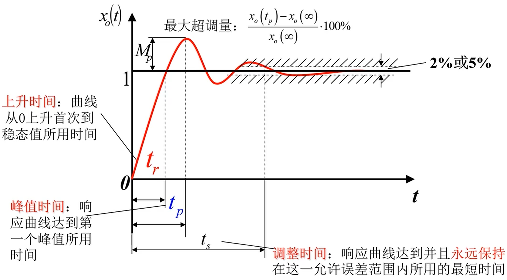

### 例题

(1)
闭环传递函数$$G(s) = \dfrac{\dfrac{L}{Js^2}}{1+\dfrac{L}{Js^2}}=\frac{\dfrac{L}{J}}{s^2+\dfrac{L}{J}}$$
输入为单位阶跃响应，输出为$$X_o(s)=X_i(s)G(s)=\frac{1}{s}\frac{\dfrac{L}{J}}{s^2+\dfrac{L}{J}}=\frac{1}{s}-\frac{s}{s^2+\dfrac{L}{J}}$$
$$x_o(t)=\left(1-\cos\sqrt{\frac{L}{J}}t\right)\cdot 1(t)$$
响应为等幅震荡，$L$增大，$J$减小时，角频率$\omega$增大。
(2)
闭环传递函数$$G(s) = \dfrac{\dfrac{L}{Js^2}(1+T_d s)}{1+\dfrac{L}{Js^2}(1+T_d s)}=\frac{\cdots}{s^2+\dfrac{LT_d}{J}s+\dfrac{L}{J}}$$
分母对比$s^2+2\zeta\omega_n+\omega_n^2$
可知$\omega_n = \sqrt{\dfrac{L}{J}},\zeta = \dfrac{T_d}{2}\sqrt{\dfrac{L}{J}}=1$
求得$T_d = 2\sqrt{\dfrac{J}{L}}=20$
(3)
由第1小题可知$\zeta = 0$，峰值时间$t_1 = \dfrac{\pi}{\omega_d}=10\pi$
最后的稳态$1$值可以视作$k$阶跃响应在时间$t$造成的影响和$1-k$阶跃响应在时间$(t-t_1)$共同造成的结果
$$1 =k \left(1-\cos\sqrt{\frac{L}{J}}t\right)+(1-k)\left(1-\cos\sqrt{\frac{L}{J}}(t-t_1)\right)$$
取$t=t_1=10\pi$代入方程，可以解得
$$k=0.5$$

### 主导极点法
对于二阶以上的系统，如果我们想要计算类似上升时间、峰值时间这样的性能指标，就会非常复杂。因此我们采用主导极点法。

#### 主导极点的相关概念
##### 主导极点，非主导极点和非主导零点
1. 主导极点是指距离虚轴最近，周围没有其他**闭环**零点或极点的点。主导极点可以是一个，此时该极点在实轴上，也可以是一对，此时这一对极点关于实轴对称。
2. “周围”是一个模糊的概念，由以下的定义决定：如果一个极点/零点的实部绝对值大于主导极点的5倍，则该极点为非主导极点/零点。也就是说，如果一个闭环零点/极点的实部绝对值在距离虚轴最近的极点的5倍以内，那么就没有主导极点。
##### 偶极子
一对靠的很近的**闭环**零极点（一个零点一个极点），两点的距离小于自身模的数量级。
#### 例题
在使用主导极点法时，先将偶极子近似相等消去，然后仅保留主导极点对应的因式，并保证闭环增益不变。闭环增益类似开环增益，即将闭环传函分子分母中各因式化为“尾1型”后得到的系数。

某系统闭环传递函数为
$$\Phi(s) = \dfrac{0.24s+1}{(0.25s+1)(0.04s^2+0.24s+1)(0.0625s+1)}$$
用主导极点法求其超调量。

列出零点与极点
零点：$-4.17$，极点：$-4,-3\pm 4 j,-16$
显然$-4.17$和$-4$是一对偶极子，可以消去，剩下的极点中有$\dfrac{|-16|}{|-3|}>5$，可知$-3\pm4j$为主导极点，仅保留$0.04s^2+0.24s+1$的因式
则原函数化为
$$\Phi(s) = \dfrac{1}{0.04s^2+0.24s+1}$$
化为首1型后得到
$$\Phi(s) = \dfrac{25}{s^2+6s+25}$$
那么很容易可以求出
$$\omega_n = 5,\zeta = \dfrac{3}{5}$$
超调量$M_r = e^\dfrac{-\pi\zeta}{\sqrt{1-\zeta^2}}=0.0948$
## 第四章 控制系统频率特性
### A阶B型系统
#### 阶
“阶”是指系统闭环传递函数的**分母多项式（即特征方程）的最高次幂**。这等同于描述该系统动态行为的微分方程的阶数。
#### 型
“型”是指系统开环传递函数 $G(s)H(s)$ 在 $s=0$ 处的极点个数。换句话说，它是在开环传递函数中“积分环节” $\dfrac{1}{s}$ 的数量。
#### 例子
开环传递函数
$$G(s)H(s)=\frac{s-5}{s^2(s-2)(s-0.2)}$$
对应的系统为四阶II型系统
### 系统频率响应
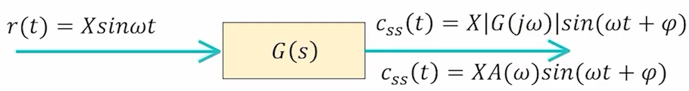

频率响应是指控制系统或元件对**正弦输入信号**的**稳态响应**
$$G(j\omega) = A(\omega) e^{j\phi(\omega)}$$
|   概念   |                      定义                      |                公式                |
| :------: | :--------------------------------------------: | :--------------------------------: |
| 幅频特性 | 输出信号幅值与输入信号幅值之比随频率变化的规律 |    $A(\omega) = \|G(j\omega)\|$    |
| 相频特性 | 输出信号相位与输入信号相位之差随频率变化的规律 | $\phi(\omega) = \angle G(j\omega)$ |

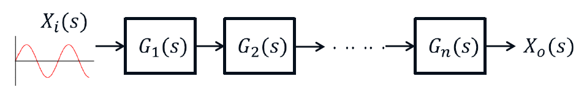
由复数的性质可知，对于一般系统，幅值比相乘、相位差相加。

幅值比$$\frac{A_o}{A_i}=|G_1(j\omega)|\cdot|G_2(j\omega)|\cdots |G_n(j\omega)|$$
相位差$$\varphi = \angle G_1(j\omega)+\angle G_2(j\omega)+\cdots+\angle G_n(j\omega)$$
#### 例题
求某单位反馈系统的开环传递函数为$G(s) = \dfrac{10}{s+1}$,试求输入$x_i = 2\cos(2 t - 45^\circ)$时输出$x_o$的稳态响应表达式。

闭环传递函数$\Phi(s) = \dfrac{\dfrac{10}{s+1}}{1+\dfrac{10}{s+1}}=\dfrac{10}{s+11}$
$$A(\omega) = |\Phi(j\omega)|=\dfrac{10}{\sqrt{\omega^2+11^2}},\varphi(\omega) = \angle\Phi(j\omega)=-\arctan \dfrac{\omega}{11}$$

由题可知$\omega = 2$，$A(2) = \dfrac{2 \sqrt 5}{5},\varphi(2) = -10.3^\circ$
从而$x_o(t) =  \dfrac{4 \sqrt 5}{5}\cos(2t-55.3^\circ)$
### 乃氏图

对于图示的系统, 其开环频率特性为$G(jω)H(jω)$。乃氏图用于研究开环频率特性，又叫做**开环幅相曲线**。它是极坐标系下以 **（**$G(jω)H(jω)$ **的）**$A(\omega)$为极径，以$\phi(\omega)$为极角的图像，$\omega \in (0,+\infty)$。（实际上也是$R(j\omega)$为实轴值，$I(j\omega)$为虚轴值的图像）。乃氏图与负实轴的交点处的频率称为**穿越频率**$\omega_x$。
#### 乃氏图作图
1. 由$G(j\omega)$写出幅频特性$A(\omega)$和相频特性$\phi(\omega)$。
2. 求出$\omega = 0,\omega = 0^+,\omega=+\infty$时的$G(j\omega)$，若$G(j0)\neq G(j0^+)$，则将这两点在复平面用虚线半圆连接
3. 求乃氏图与实轴与虚轴的交点并标注于图上（由$\phi(\omega)$等于特定角度求出）。
4. 将这些点通过平滑的曲线连在一起，虚线的箭头从$\omega = 0$指向$\omega = 0^+$，实线的箭头从$\omega = 0^+$指向$\omega = +\infty$ 。
##### 例题
试画出以下系统的奈氏图
$$G(s) = \frac{(0.2s+1)(0.025s+1)}{s^2(0.005s+1)(0.001s+1)}$$

易知$$A(\omega) = |G(j\omega)| = \dfrac{\sqrt{1+0.04\omega^2}\sqrt{1+(0.025\omega)^2}}{\omega^2\sqrt{1+(0.005\omega)^2}\sqrt{1+(0.001\omega)^2}} \\ \varphi(\omega) = -\pi + \arctan 0.2\omega+ \arctan 0.025\omega-\arctan 0.005\omega - \arctan 0.001\omega(\omega>0)$$
为什么说要分开考虑$0$和$0^+$的值，因为$\omega = 0$时$j\omega$的相角不是$90^\circ$，而是$0^\circ$，所以$\varphi$发生了改变。你也可以按照积分环节的个数来确定虚线的位置。一个积分环节相当于$-90^\circ$
$$\varphi(0) = 0,\varphi(0^+)=(-\pi)^+,\varphi(+\infty)=-\pi  \\ A(0)=A(0^+) = +\infty,A(+\infty) = 0$$
此处的$(-\pi)^+$我用来表示比$-\pi$大一个微小量的数。不然你不知道无穷远处的图像在实轴上方还是下方。这里明显是下方。实际上从$\varphi$很容易看出这个图形始终在实轴的下方。
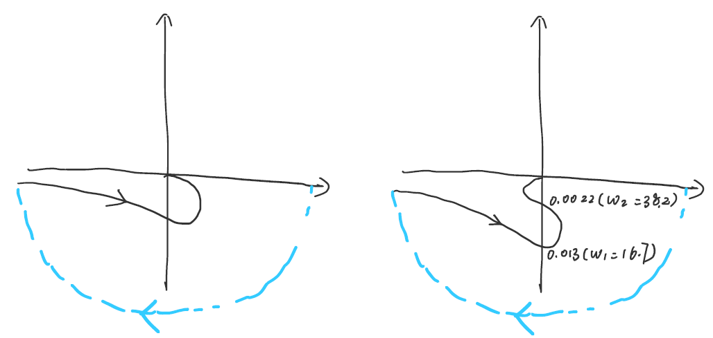

虚线从$\varphi(0)$画到$\varphi(0^+)$，如左图蓝色虚线，出头代表了$\varphi(0^+)$比$-\pi$稍大一些。由于最终$A(+\infty)=0$,最后还是回到原点，我们可以知道图像类似左图，但是不知道图像与虚轴有几个交点，可能是左图也可能是右图（当然我们知道答案是右图）
令$\varphi(\omega) = -\dfrac{\pi}{2}$，则有$$\frac{\pi}{2}+\arctan0.005\omega + \arctan 0.001\omega = \arctan 0.2\omega + \arctan 0.025\omega$$
两边取正切
$$-\frac{1}{\tan (\arctan0.005\omega + \arctan 0.001\omega)}=\tan(\arctan 0.2\omega + \arctan 0.025\omega)\\ - \frac{1-0.005\omega\cdot 0.001\omega}{0.005\omega+0.001\omega}=\frac{0.2\omega+0.025\omega}{1-0.2\omega\cdot0.025\omega}$$
解得
$$\omega_1 = 16.7,|G(j\omega_1)| = 0.013\\ \omega_2 = 38.2,|G(j\omega_2)| =0.0022$$
值得一提的是，控制工程基础这门课，只是让你画奈氏图的时候，虚线好像可以不用画。但是当你使用后面的奈奎斯特判据的时候却是必不可少的。
### 伯德图
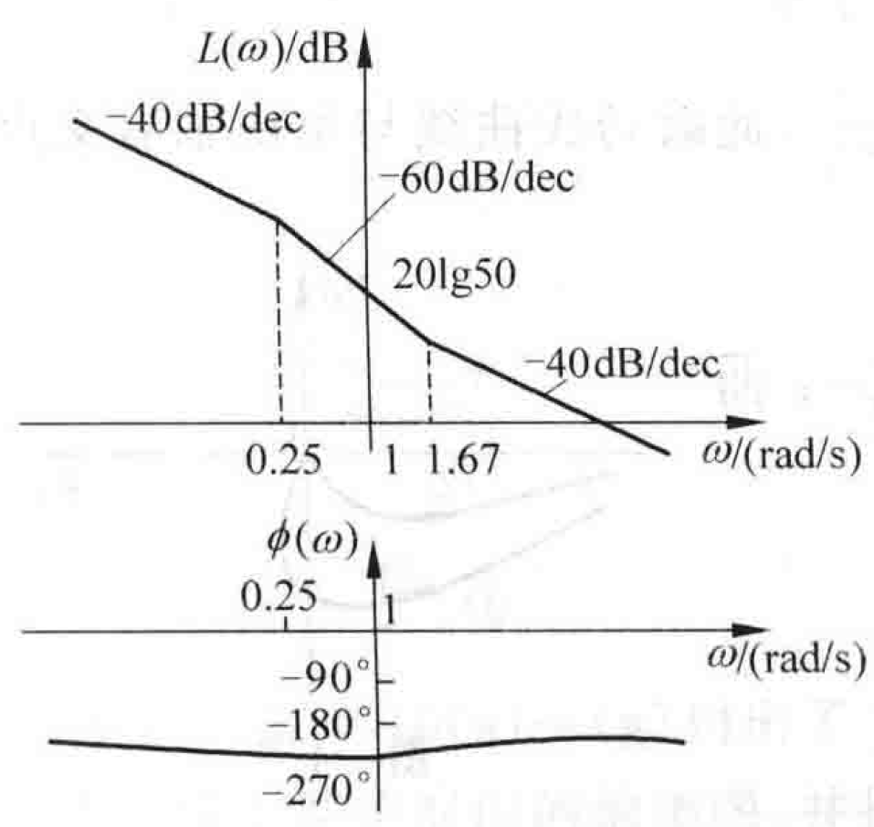

在控制学领域，任何一个数N都可以用分贝值n来表示，二者的关系为
$$n = 20 \lg |N|$$
半对数坐标系中绘制的对数幅频特性曲线和对数相频特性曲线，合称为伯德图。其中
- 对数幅频特性$L(\omega) = 20 \lg |G(j\omega)|=20\lg A(\omega)$，单位为分贝dB
- 对数相频特性$\varphi(\omega) = \angle G(j\omega)$

如右图，伯德图分为两张图：$L(\omega)$关于$\omega$的图和$\varphi(\omega)$关于$\omega$的图。半对数坐标系采用十倍频程分度，可以理解为横坐标为$\lg \omega$，也就是说如果$\omega_2 = 10 \omega_1,\omega_3=10\omega_2$，那么在坐标轴上$\omega_3,\omega_2$之间的距离和$\omega_2,\omega_1$之间的距离是相等的，且称为一个**十倍频程**，英语写作$dec$。但是横坐标坐标轴上标注的数据仍为$\omega$而不是$\lg \omega$。
注意：伯德图横坐标没有0
#### 典型环节的伯德图
##### 比例环节
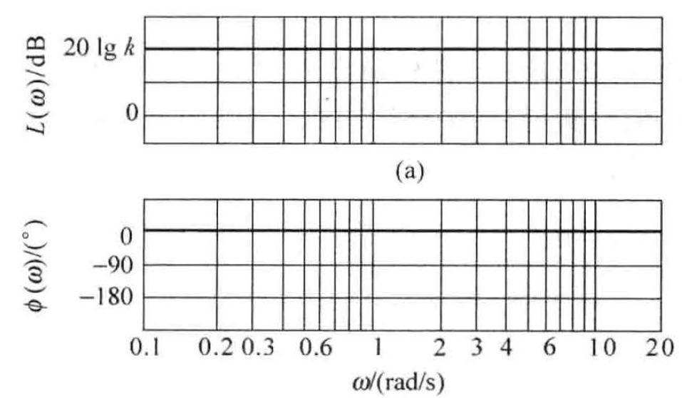

$$A(\omega) = K,\varphi(\omega) = 0 \Rightarrow L(\omega) = 20 \lg K$$
 
 

##### 积分环节
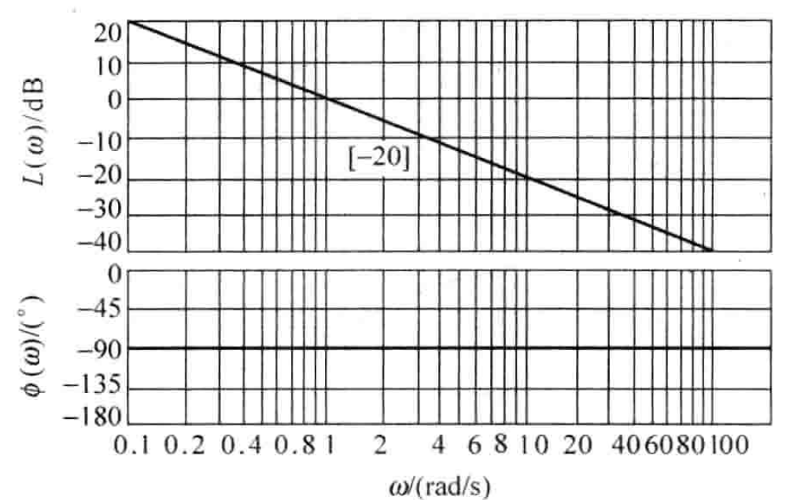

$$G(s) = \frac{1}{s},G(j\omega) = \frac{1}{j\omega}\Rightarrow A(\omega) = \frac{1}{\omega},\varphi(\omega) = -90^\circ \\ \Rightarrow L(\omega) = -20 \lg \omega$$

显然$\omega = 1$时幅频特性曲线经过零点

不难推出，如果是多重积分环节，即$G(s) = \dfrac{1}{s^v}$，那么幅频特性曲线的斜率就是$[-20v]$；如果$G(s) = \dfrac{K}{s^v}$，那么$L(\omega) = 20\lg K-20 v \lg \omega$，也就是说，幅频特性曲线一定经过$(1,20\lg K)$

注：伯德图上的斜率可以标dB/dec，也可以简写为中括号，就代表了dB/dec这个单位，如右图。

##### 一阶惯性环节
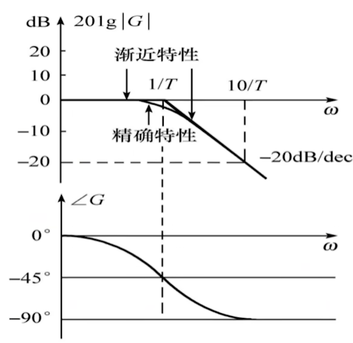

$$G(s)=\frac{1}{1+Ts},G(j\omega) = \frac{1}{1+T\omega j}\\ L(\omega) = 20\lg \frac{1}{\sqrt{1+T^2\omega^2}}=-20\lg \sqrt{1+T^2\omega^2}$$
在处理伯德图时，我们总是将$T\omega$作为一个整理来考虑
容易得到
当$\omega T \ll 1$，即$\omega \ll \dfrac{1}{T}$时，$ L(\omega) =-20\lg \sqrt{1+T^2\omega^2}\approx -20\lg 1 = 0$
当$\omega T \gg 1$，即$\omega \gg \dfrac{1}{T}$时，
当$\omega T \ll 1$，即$\omega \ll \dfrac{1}{T}$时，$ L(\omega) =-20\lg \sqrt{1+T^2\omega^2}\approx -20\lg T\omega $
如图所示，我们用渐近线来近似代表幅频特性曲线，即近似认为
$\omega < \dfrac{1}{T}$时，$ L(\omega) =0,\ \ \omega > \dfrac{1}{T}$时，$  L(\omega) =-20\lg T\omega$
这里$\omega = \dfrac{1}{T}$称为转折频率。
对于相频特性，相角从$0^\circ$变为$-90^\circ$，转折频率时相角为$-45^\circ$
##### 一阶微分环节
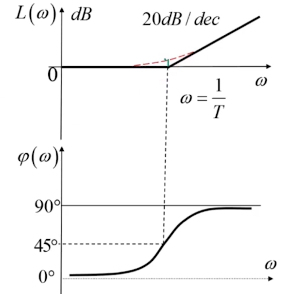

$$G(s) = 1+Ts,G(j\omega)=1+T\omega j\\ L(\omega) =20\lg \sqrt{1+T^2\omega^2}$$
同上分析，$\omega<\dfrac{1}{T}$时，$L(\omega) = 0$；$\omega>\dfrac{1}{T}$时，$L(\omega) = 20\lg T\omega$
$\omega = \dfrac{1}{T}$称为转折频率。

对于相频特性，相角从$0^\circ$变为$90^\circ$，转折频率时相角为$45^\circ$
 
 

##### 二阶振荡环节
$$G(s) = \frac{1}{T^2s^2+2\zeta T s+1},G(j\omega) = \frac{1}{1-T^2\omega^2+2\zeta T\omega j}\\ L(\omega) = 20 \lg \frac{1}{\sqrt{(1-T^2\omega^2)^2+4\zeta^2T^2\omega^2}}$$

  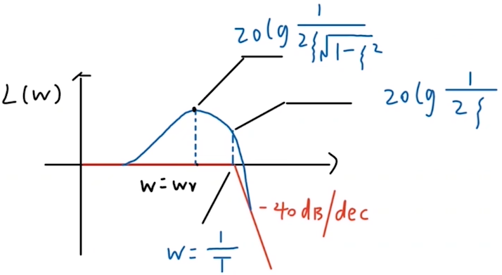
  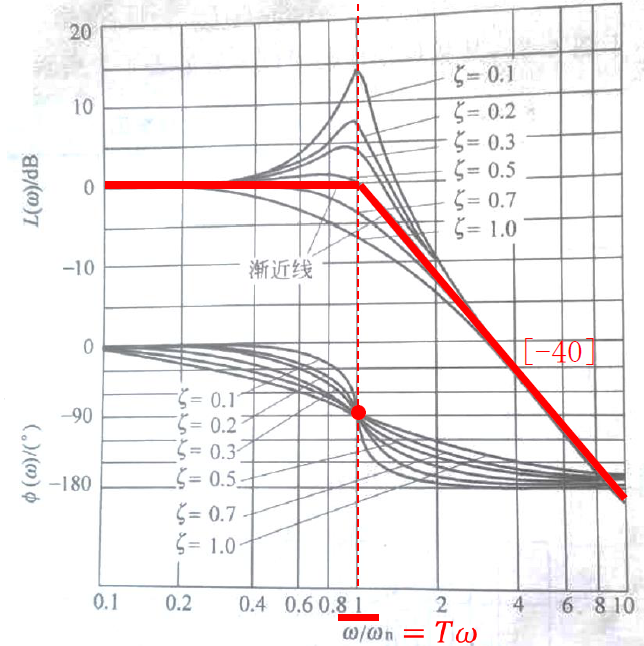

同上分析，$\omega<\dfrac{1}{T}$时，$L(\omega) = 0$
$\omega>\dfrac{1}{T}$时，$L(\omega) = -20\lg (\omega T)^2=-40\lg \omega T$

很容易分析出，当$\zeta\geq\dfrac{\sqrt 2}{2}$时，$L(\omega)$单调递减，而当$\zeta<\dfrac{\sqrt 2}{2}$时，增益曲线存在最大值，如左图。$\omega = \omega_r = \omega_n(1-2\zeta^2)$时$L(\omega)$最大，该频率称为谐振频率，此时的$A(\omega)$值称为谐振峰值$M_r= \dfrac{1}{2\zeta\sqrt{1-\zeta^2}}$。

对于相频特性，相角从$0^\circ$变为$-180^\circ$，转折频率时相角为$90^\circ$
#### 伯德图的绘制
1. 将开环传递函数写成尾1形式
2. 分出各典型环节，确定基准线。根据积分环节的个数可以确定基准线的斜率，根据开环增益可以确定基准线的位置，因为基准线总是经过$(1,20\lg K)$
3. 列出各环节的转折频率
4. 将各环节叠加作图。

##### 例题
作出以下传递函数的伯德图
$$G(s) = \frac{7.5(0.2s + 1)(s + 1)}{s(s^2 + 16s + 100)}$$

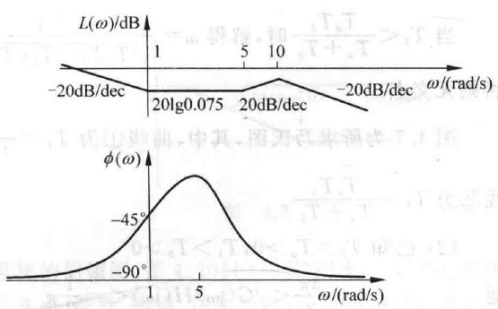

先画幅频图。首先，将该函数化为尾1形式
$$G(s) = \frac{\dfrac{3}{400}(0.2s + 1)(s + 1)}{s(\dfrac{s^2}{100} + \dfrac{16}{100}s + 1)}$$
可以看出积分环节个数为1.因此基准线斜率为$[-20]$，且经过点$(1,20\lg \dfrac{3}{400})$
接下来分出各典型环节。除了积分环节，还有一阶微分环节$(0.2s+1),(s+1)$和二阶震荡环节$\dfrac{1}{\dfrac{s^2}{100} + \dfrac{16}{100}s + 1}$

其转折频率分别为5,1,10
从小到大进行分析。到达转折频率1时微分环节$s+1$让幅频曲线斜率上升$[20]$，到达转折频率5时微分环节$0.2s+1$让幅频曲线斜率上升$[20]$，到达转折频率10时二阶振荡环节$\dfrac{1}{\dfrac{s^2}{100} + \dfrac{16}{100}s + 1}$让幅频曲线斜率$[-40]$，从而可以画出幅频图如上。
对于相频图，同样先考虑积分环节。一个积分环节提供$-90^\circ$的相角，所以初始值为$-90^\circ$。微分环节$s+1$相角从$0^\circ$到$90^\circ$，到达转折频率1时提供$45^\circ$的相角。微分环节$0.2s+1$到达转折频率5时提供$45^\circ$的相角，这时还同时受到微分环节$s+1$和二阶振荡环节$\dfrac{1}{\dfrac{s^2}{100} + \dfrac{16}{100}s + 1}$的作用，总体来说是先向上后向下，最后的相角趋于$-90^\circ+90^\circ+90^\circ-180^\circ=-90^\circ$
#### 开环频域指标
应对考试中“系统性能会如何变化”的回答。
##### 低频段
低频段表征闭环系统的稳态性能。相关的指标有开环增益$K$，静态误差系数$K_p,K_v,K_a$。$K$ 值越大，低频幅值越高，系统的稳态误差越小，稳态精度越高。
##### 中频段
中频段表征闭环系统的动态性能。
- 剪切频率 / 截止频率$\omega_c$：反映系统响应速度，$\omega_c$越大，系统响应越快。
- 相位裕度 $\gamma$：反映系统稳定性，$\gamma$越大，系统越稳定。
##### 高频段
高频段表征闭环系统的复杂性和噪声抑制性.
- 幅值裕量 $K_g$ ：它和相位裕度一起构成了系统的稳定裕度指标，衡量系统离不稳定还有多远。
##### 其他
高频段幅频特性曲线下降要快（抗干扰）
穿越剪切率-20dB/dec（稳定性好）
### 最小相位系统
传递函数在右半s平面没有零点和极点(即**传递函数零、极点的实部均小于等于零**)且不含延时环节，这种传递函数称之为**最小相位传递函数**，该传递函数所描述的系统，称为**最小相位系统**。

例如下面两个传递函数
$$G_1(s) = \frac{1+T_2s}{1+T_1s},G_2(s) = \frac{1-T_2s}{1+T_1s}(T_1,T_2>0)$$
$G_1(s)$零点和极点都小于0，是最小相位系统；$G_2(s)$零点大于0，不是最小相位系统。
顾名思义，最小相位系统的相位滞后最小。
#### 最小相位系统的性质
最小相位系统的对数幅频特性与相频特性之间存在着唯一的对应关系。这就是说根据系统的对数幅频特性，可以唯一地确定相应的相频特性和传递函数。反之亦然。
#### 最小相位系统伯德图求传递函数
1. 根据低频段图像（第一个转折点之前）求出积分环节的个数
2. 根据斜率变化和转折频率写出其他环节
3. 根据积分环节通过点$(1,20\lg K)$求出开环增益$K$
##### 例题
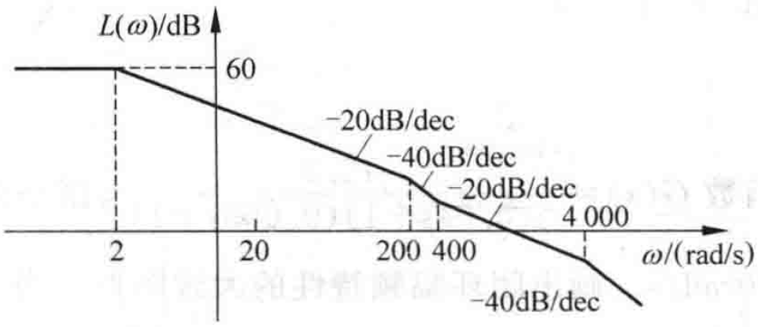

根据每一个积分环节$\dfrac{1}{s}$在最开始会提供$-20dB/dec$的斜率，可以看出该系统没有积分环节。
接下来观察转折频率和斜率变化，可以看出该系统按转折频率从小到大依次包含以下环节：一阶惯性、一阶惯性、一阶微分、一阶惯性
可以将传递函数写为
$$G(s) = \frac{K(\dfrac{s}{400}+1)}{(\dfrac{s}{2}+1)(\dfrac{s}{200}+1)(\dfrac{s}{4000}+1)}$$
所以也可以这么说，斜率变化为$[+20]$时在分子上乘一个$\dfrac{s}{\omega}+1$，斜率变化为$[-20]$时在分母上乘一个$\dfrac{s}{\omega}+1$，这里的$\omega$为对应的转折频率。
低频段$\dfrac{K}{s^0}$经过点$(1,20\lg K)$，即$60 = 20\lg K,K=1000$
### 二阶系统系统闭环频域指标
|           指标           |                               公式                               |
| :----------------------: | :--------------------------------------------------------------: |
|         谐振频率         |              $\omega_r = \omega_n\sqrt{1-2\zeta^2}$              |
|         谐振峰值         |            $M_r = \dfrac{1}{2\zeta\sqrt{1-\zeta^2}}$             |
| 截止频率/带宽频率/频带宽 | $\omega_b = \omega_n\sqrt{\sqrt{(1-2\zeta^2)^2+1}+(1-2\zeta^2)}$ |