# ~~自动控制原理~~  控制工程基础 补天笔记 part2
## 第五章 控制系统稳定性分析
### 稳定的充要条件
系统稳定与以下条件等价
1. 系统的所有闭环极点，均具有负的实部
2. 所有闭环极点，均严格位于左半S平面
3. 闭环特征方程的根均具有负的实部
### 劳斯判据

对于右图所示系统，**闭环传递函数**$G(s) = \dfrac{G(s)}{1+G(s)H(s)}$。闭环传递函数的分母$1+G(s)H(s)=0$为系统的特征方程。
设特征方程为
$$a_0 s^n + a_1 s^{n-1} + \dots + a_{n-1} s + a_n = 0$$

判断系统是否稳定前先检查其必要条件：**所有系数$a_0,a_1,\dots,a_n > 0$（或均<0）**，如果不满足系统就不稳定。
#### 劳斯阵列的构造方法

列出如右图所示劳斯阵列，步骤如下：
1. 根据特征方程的系数，按图示方法填写阵列的第一、二行；
2. 从第三行起，每个元素的分母为其**上一行的第一个元素**，分子为**其前两行的第一列两个元素和其前两行的下一列两个元素合成的2x2矩阵行列式值的相反数**（见下公式）
具体地说，有$$b_1 = \frac{a_1 a_2 - a_0 a_3}{a_1},b_2 = \frac{a_1 a_4 - a_0 a_5}{a_1}$$
3. 依此类推，直到阵列的第n+1行；即$s_0$行
#### 劳斯稳定判据判断系统的稳定性
1. 劳斯阵列第一列所有项> 0 $\Rightarrow$ 系统稳定
2. 劳斯阵列第一列存在<0的项 $\Rightarrow$ 系统不稳定
3. 劳斯阵列第一列存在=0的项 $\Rightarrow$ 系统处于临界稳定状态
4. 对于二阶系统，有一个很好的结论：系数均大于0即稳定。
5. 对于三阶系统，若其特征根方程为$Ax^3+Bx^2+Cx+D=0$，则劳斯判据等价为$A>0,B>0,D>0,BC-AD>0$
#### 例题
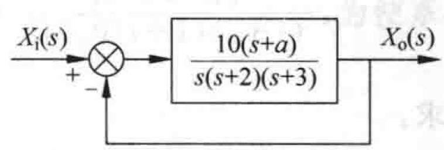

对于右图系统，确定使系统特征值均落在$s$平面中$Re=-1$这条线左边的$a$值。

$$\frac{X_o}{X_i} = \dfrac{\dfrac{10(s+a)}{s(s+2)(s+3)}}{1+\dfrac{10(s+a)}{s(s+2)(s+3)}}=\frac{\cdots}{s^3+5s^2+16s+10a}$$
令$s = z-1$，那么如果对于$z$来说所有的特征根实部均小于0，那么对于$s$来说所有的特征根实部都小于-1
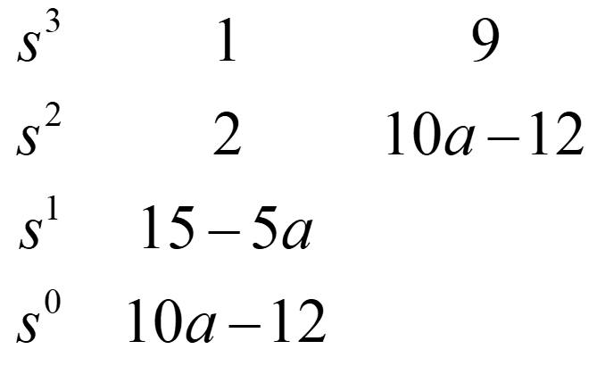

代入特征方程，化简得
$$z^3 + 2z^2 +9z + 10a-12 = 0$$
列出劳斯阵列，第一列所有项都大于0
解得$1.2<a<3$
### 奈奎斯特判据
$$Z = P-2(N^+-N^-)=0$$
这里$Z$为右半$s$平面中闭环特征根的个数
$P$为右半$s$平面中开环极点的个数
在$s$平面上，我们只看$Re=-1$线的左边，在这个区域内，如果奈氏图（包括虚线）顺时针穿越实轴，记为一次负穿越，即$N^-$，如果逆时针穿越实轴，记为一次正穿越，即$N^+$，如果奈氏图是从实轴出发的，那么叫做半穿越，同样是逆正顺负，但是一次半穿越只记$\dfrac{1}{2}$

  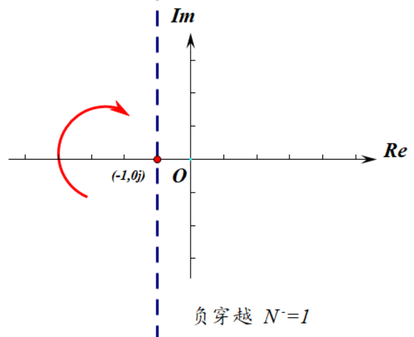
  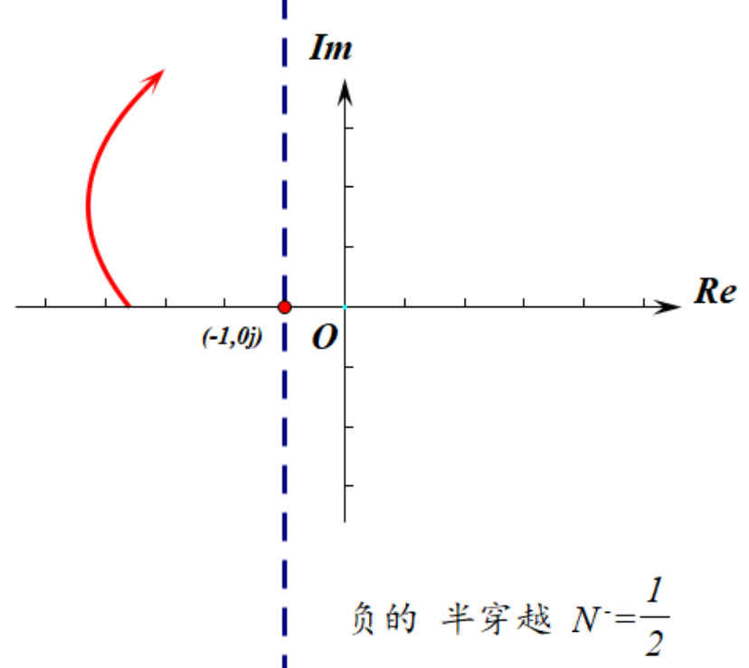
    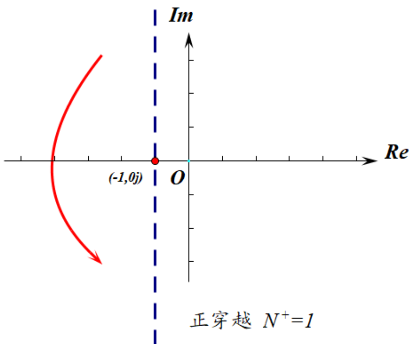
      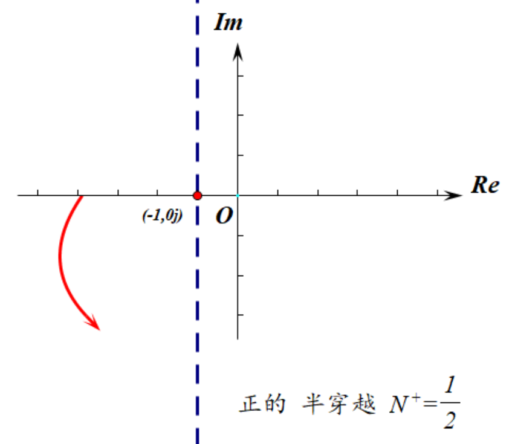  

如果奈氏图穿过$(-1,0)$点，那么系统临界稳定
系统稳定与闭环特征方程的根均具有负的实部等价，也就是说$Z=0$时系统稳定。
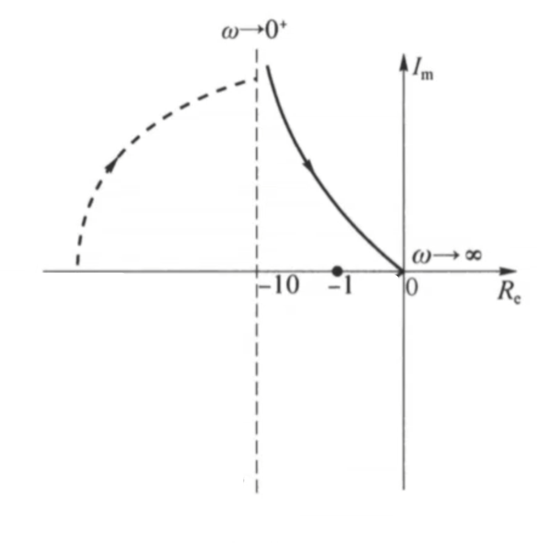

#### 例题
系统开环传递函数$G(s) = \dfrac{10(s+0.5)}{s(s+1)(s-1)}$，用奈奎斯特判据判断闭环系统稳定性。

容易得到$P=1$
画出右图所示奈奎斯特图，发现只有一个负的半穿越
$$Z = P-2(N^+-N^-)=2\neq 0$$
系统不稳定。
### 稳定裕量

稳定裕量的概念适用于“开环是最小相位系统”的闭环系统。

#### 剪切频率/截止频率
剪切频率$\omega_c$是使得$|G(j\omega_c)|=1$的频率，在乃氏图上表示为乃氏图与单位圆的交点处的频率。在伯德图上表现为伯德图与横轴的交点。
#### 穿越频率
穿越频率$\omega_g$是使得$\angle G(j\omega_g) = -180^\circ$的频率，在乃氏图上表示为乃氏图与负实轴的交点处的频率。
#### 相角裕度
$$\gamma = 180^\circ + \angle G(j\omega_c)$$
#### 幅值裕度/增益裕度
$$K_g = \frac{1}{|G(j\omega_g)|}$$

| $K_g$大小 | $\gamma$大小 |  系统稳定性  |
| :-------: | :----------: | :----------: |
|  $K_g>1$  |  $\gamma>0$  |   系统稳定   |
|  $K_g=1$  |  $\gamma=0$  | 系统临界稳定 |
|  $K_g<1$  |  $\gamma<0$  |  系统不稳定  |
## 第六章 控制系统的误差分析和计算
**偏差**（按输入定义的误差）定义为
$$\epsilon(t) = x_i(t)-y(t)$$
其中$x_i(t)$为输入信号，$y(t)$为反馈信号
**误差**（按输出定义的误差）定义为
$$e(t) = x_{oi}(t)-x_o(t)$$
其中$x_{oi}(t)$为期望输出的信号，$x_o(t)$是实际输出的信号。误差信号的稳态分量即为稳态误差，记为$e_{ss}$
根据终值定理，有
$$e_{ss} = \lim_{t\rightarrow \infty}e(t) = \lim_{s\rightarrow 0}sE(s)$$
### 负反馈系统的稳态误差
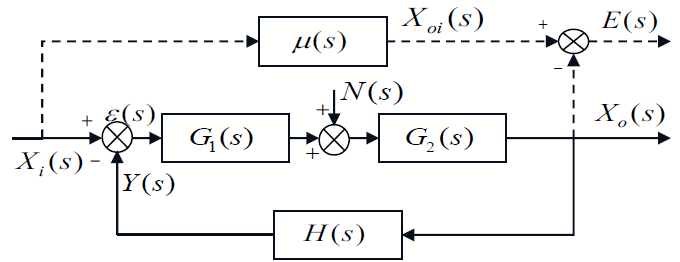

求稳态误差之前**一定要先判稳**。稳定的系统才有稳态误差。
如右图，根据定义，偏差为
$$\epsilon(s) = X_i(s)-Y(s)=X_i(s)-X_o(s)H(s)$$
$X_i(s)$通过负反馈系统得到$X_o(s)$,等价于经过一个理想传函$\mu(s)$,得到一个理想的输出$X_{oi}(s)$，根据误差的定义，误差$E(s) = X_{oi}(s) - X_o(s) = \mu(s)X_i(s)-X_o(s)$。在实际负反馈控制系统中，偏差$\epsilon(s)$趋近于零，从而有$\mu(s)X_i(s)=X_o(s)=\dfrac{Y(s)}{H(s)}=\dfrac{X_i(s)}{H(s)}$，从而得到$\mu(s) = \dfrac{1}{H(s)}$
$$E(s) = \mu(s)X_i(s)-X_o(s)=\dfrac{1}{H(s)}X_i(s)-X_o(s) = \dfrac{\epsilon(s)}{H(s)}$$
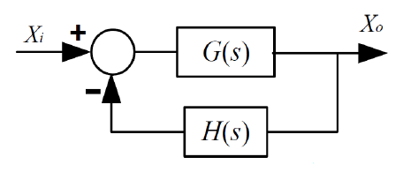

考虑右图这种最简单的负反馈系统，根据终值定理，有稳态误差
$$\boxed{e_{ss}(t) = \lim_{s\rightarrow 0}s\dfrac{E(s)}{X_i(s)}X_i(s)= \lim_{s\rightarrow 0}s\dfrac{1}{H(s)(1+G(s)H(s))}X_i(s)}$$
稳态偏差
$$\epsilon_{ss}(t) = \lim_{s\rightarrow 0}s\dfrac{\epsilon(s)}{X_i(s)}X_i(s)= \lim_{s\rightarrow 0}s\dfrac{1}{1+G(s)H(s)}X_i(s)$$
特别的，当系统为单位负反馈系统，即$H(s) = 1$时，偏差与误差相等，有稳态误差
$$\boxed{e_{ss}(t) =\epsilon_{ss}(t)= \lim_{s\rightarrow 0}s\dfrac{1}{1+G(s)}X_i(s)}$$
注：简单来说，偏差$\epsilon$就是比较点后的那个值，而误差就是$\dfrac{\epsilon}{H(s)}$
### 静态误差系数法
值得一提的是，静态误差系数法求得的是**稳态偏差（即按输入定义的误差）**，而我们一般所说的稳态误差只有在单位反馈系统才与稳态偏差相等。

使用该方法首先要将开环传递函数$G(s)H(s)$化为尾1型，即$G(s)H(s) = \dfrac{K(T_1s+1)\cdots}{s^v(T_2s+1)\cdots}$，设$G(s)H(s) = \dfrac{K}{s^v}G(0)$，则易知$\displaystyle\lim_{s\rightarrow 0}G_0 = 1$
由终值定理
$$\epsilon_{ss} = \lim_{s\rightarrow 0} s\dfrac{1}{1+G(s)H(s)}X_i(s) =\lim_{s\rightarrow 0} s\dfrac{1}{1+\dfrac{K}{s^v}G_0}X_i(s) =\lim_{s\rightarrow 0} s\dfrac{1}{1+\dfrac{K}{s^v}}X_i(s)$$

以输入为单位阶跃响应为例，此时$X_i(s) = \dfrac{1}{s}$
$$\epsilon_{ss} = =\lim_{s\rightarrow 0}\dfrac{1}{1+\dfrac{K}{s^v}}$$
我们仅对$v=0,1,2$进行讨论，可知$v=0$时，$\epsilon_{ss} = \dfrac{1}{1+K}$
$v=1,2$时，$\epsilon_{ss} =0$

可以列出以下表格
| 系统类别 |  单位阶跃$1(t)$  |  等速输入$t$   | 加速度输入$\dfrac{1}{2}t^2$ |
| :------: | :--------------: | :------------: | :-------------------------: |
|   0型    | $\dfrac{1}{1+K}$ |    $\infty$    |          $\infty$           |
|   I型    |        0         | $\dfrac{1}{K}$ |          $\infty$           |
|   II型   |        0         |       0        |       $\dfrac{1}{K}$        |

由于$$\epsilon_{ss} =\lim_{s\rightarrow 0} s\dfrac{1}{1+\dfrac{K}{s^v}}X_i(s)=\lim_{s\rightarrow 0} \dfrac{1}{\dfrac{1}{sX_i (s)}+\dfrac{K}{s^{v+1}X_i(s)}}$$
该式的值完全由$\displaystyle\lim_{s\rightarrow 0}\dfrac{K}{s^{v+1}X_i(s)}$决定，将该式定义为静态误差系数，得到表格如下

| 系统类别 |  静态位置误差系数$K_p$   |   静态速度误差系数$K_v$   |  静态加速度误差系数$K_a$ |
| :------: | :------: | :------: | :---: |
|   0型    |   $K$    |    0     |   0   |
|   I型    | $\infty$ |   $K$    |   0   |
|   II型   | $\infty$ | $\infty$ |  $K$  |

综上，对于典型输入信号组合$x_i(t) = A \cdot 1(t) + Bt + \dfrac{1}{2} C t^{2}$
稳态偏差为
$$\boxed{\epsilon_{ss} = \frac{A}{1 + K_p} + \frac{B}{K_v} + \frac{C}{K_a}}$$
### 干扰引起的稳态误差
干扰其实就是另一个输入。当系统存在多个输入时，将各个输入的稳态误差相加即可得到系统的稳态误差。即
$$e_{ss} = e_{ssr}+e_{ssn}$$
需要注意的是，我们的误差是由题目中的输入$R(s)$决定，而不是干扰$N(s)$，这一点上他们不能等同看待。
## 第七章 控制系统的综合与校正
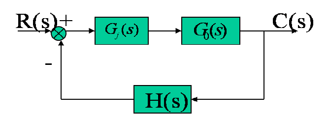

在此章中学到的校正均为串联校正，即在需要校正的系统中，将校正器$G_c(s)$与被校正系统$G_0(s)$串联，从而达到改善系统性能的目的。
### 超前校正

相位超前校正，顾名思义，是为了提高相位角。因此，超前校正环节的伯德图中，相位角是大于0的，从而增加系统的相位裕度。
超前校正环节的传递函数为
$$G_j(s) = \frac{\alpha T s + 1}{T s + 1},\alpha > 1$$
伯德图如右图，其中$\omega_1 = \dfrac{1}{\alpha T},\omega_m = \dfrac{1}{\sqrt{\alpha}T},\omega_2 = \dfrac{1}{T}$，$\omega_m$为最大超前角频率
相频图中最大相角$\varphi_m$与$\alpha$的关系是
$$\alpha = \dfrac{1+\sin \varphi_m}{1-\sin\varphi_m}$$
记$\omega_{c0}$为未校正截止频率，$\gamma_0$为未校正相角裕度，$\omega_{c}^*$为题目要求截止频率，$\gamma^*$为题目要求相角裕度
那么使用超前校正有以下两点要求
1. $\omega_{c0}<\omega_c^*,\gamma_0<\gamma^*$时优先考虑超前校正
2. 校正系统所需要的最大超前角$\varphi_m$需要小于$60^\circ$
#### 超前校正的具体步骤
下面通过一个例题来说明超前校正的具体步骤。
设单位反馈系统的开环传递函数
$$G_0(s) = \frac{K}{s(s+1)}$$
试设计校正装置$G_j(s)$，使得校正后系统满足下列指标：
1. 当输入$r = t$时，稳态误差$e_{ss}^* \leq 0.1$
2. 开环系统截止频率$\omega_c^* \geq 6 rad/s$
3. 相角裕度$\gamma^* \geq 60^\circ$
4. 幅值裕度$h^* \geq 10 dB$

**第一步：根据稳态误差校正低频段，即求得开环增益$K$**
注意到是I型系统，输入为单位斜坡（等速输入），根据静态误差系数，$e_{ss} = \dfrac{1}{K}$，从而有$\dfrac{1}{K} \leq 0.1$，得到$K \geq 10$。取$K = 10$，从而开环传递函数为$$G(s) = \dfrac{10}{s(s+1)}$$
**第二步：画出未校正系统的伯德图，求出截止频率$\omega_{c0}$和相角裕度$\gamma_0$**

画图可以得到$\omega_{c0} = 3.16rad/s<\omega_c^*$，$\gamma_0 =  180^\circ+\angle G(j\omega_c)=17.56^\circ<\gamma^*=60^\circ$，因此需要进行超前校正。
**最大超前角应该比目标相角裕度和未校正相角裕度的差大$5^\circ-12^\circ$**，因为校正过程中会有一些损失。我们一般就取$10^\circ$*(注意，如果你最后校正失败了，把这个角度提一提，再试几次)*
$$\varphi_m = \gamma^*-\gamma_0+10^\circ=52.44^\circ<60^\circ$$
可以使用超前校正。

**第三步：根据最大超前角$\varphi_m$求出$\alpha$，从而得到$\omega = \omega_m$得到校正环节给予的幅频增益$10 \lg \alpha$，从而求出按理想情况下校正的截止频率$\omega_m$**

**相角裕度$\gamma = 180^\circ + \angle G(j\omega_c)$完全由$\omega_c$时的相角决定，因此在理想状态下，最大超前角要加在$\omega=\omega_c$处，因此要让$\omega_m = \omega_c$**，此处$\omega_c$为校正后的截止频率

$$\alpha = \dfrac{1+\sin \varphi_m}{1-\sin\varphi_m}=8.65,10\lg \alpha = 9.37dB$$

要让$\omega_m = \omega_c$，需要让$L(\omega_c)+L(\omega_m) = 0$，因此有$$L(\omega_c) = -10\lg \alpha = -9.37 dB$$
由图像可以列出
$$\dfrac{-9.37-0}{\lg\omega_m-\lg 3.16} = -40 \Rightarrow \omega_m = 5.42rad /s$$

**第四步：对比$\omega_m$与$\omega_c^*$的大小，若$\omega_m<\omega_c^*$则取$\omega_c = \omega_m$，若$\omega_m<\omega_c^*$则取$\omega_c = \omega_c^*$，否则不符合题意。也即取$\omega_c = \max\{\omega_m,\omega_c^*\}$**

此题中$\omega_c =\max\{\omega_m,\omega_c^*\} = 6rad/s$
取校正环节的$\omega_m' = \omega_c=6rad/s$
如右图，蓝色曲线为校正环节的伯德图，那么在$\omega = 6$时，$L_1(6)+L_2(6)=0$。把图中两个阴影三角形提出来，数据如伯德图上方的两个三角形所示，有
$$h = 20(\lg 6 - \lg \omega_1) = 40(\lg 6 - \lg 3.16)$$
解得$\omega_1 = 1.67rad/s$，从而很容易求出$\omega_2 = 21.6rad/s$
得到校正环节传递函数$$G_j(s) = \dfrac{\dfrac{1}{1.67}s+1}{\dfrac{1}{21.6}s+1}$$

**注：如果最后取$\omega_c = \omega_m$，那么$\omega_1 = \omega_m\cdot \dfrac{1}{\sqrt{a}},\omega_2 = \omega_m\cdot \sqrt{a}$**
**第五步：验算**
校正后的开环传递函数$$G(s) = G_0(s)G_j(s) =\dfrac{10}{s(s+1)}\cdot \dfrac{\dfrac{1}{1.67}s+1}{\dfrac{1}{21.6}s+1}$$
$$|G(j\omega)|= \dfrac{10 \sqrt{(\dfrac{\omega}{1.67})^2+1}}{\omega \sqrt{\omega^2+1} \sqrt{(\dfrac{\omega}{21.6})^2+1}}$$
$$|G(j\omega_c)| = 1$$
解得$\omega_c = 6rad/s$
相角裕度$$\gamma = 180+\angle G(j\omega_c) = 68.38^\circ>60^\circ $$
$$\angle G(j\omega_g) = -\pi$$
你会发现这个方程是没有实根的，原因是
$$G(j\omega_g) = -90^\circ - \arctan(\omega) + \arctan\left(\frac{\omega}{1.67}\right) - \arctan\left(\frac{\omega}{21.6}\right) >-180^\circ \\ \Leftrightarrow  \arctan(\omega) - \arctan\left(\frac{\omega}{1.67}\right) + \arctan\left(\frac{\omega}{21.6}\right)<90^\circ$$
显然是成立的
$\omega\rightarrow +\infty$时$G(j\omega_g)\rightarrow -180^\circ$，不妨认为$\omega_g = +\infty$，此时$|G(j\omega_g)| = 0^+$，也就是说，幅值裕度$K_g = +\infty$，显然满足要求。
### 滞后校正

滞后环节的传递函数为
$$G_j(s) = \frac{\beta T s + 1}{T s + 1},\beta < 1$$
伯德图如右图，其中$\omega_1 = \dfrac{1}{ T},\omega_m = \dfrac{1}{\sqrt{\beta}T},\omega_2 = \dfrac{1}{\beta T}$，$\omega_m$为最大滞后角频率
记$\omega_{c0}$为未校正截止频率，$\gamma_0$为未校正相角裕度，$\omega_{c}^*$为题目要求截止频率，$\gamma^*$为题目要求相角裕度，$G_0$为未校正前开环传函
那么使用超前校正有以下两点要求
1. $\omega_{c0}>\omega_c^*,\gamma_0<\gamma^*$时优先考虑滞后校正
2. $\gamma_0(\omega_c^*) = 180^\circ + \angle G_0(j\omega_c)>\gamma^* + 6^\circ$
原理解释是，相信你已经知道了串联校正就是简单的伯德图叠加，那么由相频曲线可以看到始终小于0，我们即便用相角比较大的部分去校正，也会损失一部分相角，因此需要留出一些裕量，一般取$6^\circ$即可。
#### 滞后校正的具体步骤
下面通过一个例题来说明滞后校正的具体步骤。
设单位反馈系统的开环传递函数
$$G_{0}(s) = \frac{K}{s(0.1s+1)(0.2s+1)}$$

试设计校正装置$G_j(s)$，使得校正后系统满足下列指标：
(1) 速度误差系数$K_v^* = 30$
(2) 开环系统截止频率$\omega_c^* \geq 2.3 rad/s$
(3) 相角裕度$\gamma^* \geq 40^\circ$
(4) 幅值裕度$h^* \geq 10 dB$

**第一步：校正低频段，即求得开环增益$K$**
显然有$K=K_v^* = 30$
**第二步：画出未校正系统的伯德图，求出截止频率$\omega_{c0}$和相角裕度$\gamma_0$**

$$|G_0(j\omega_{c0})| = 1\Rightarrow \omega_{c0} = 11.45 > \omega_c^* \\ \gamma_0 = 180^\circ + \angle G_0(j\omega_{c0}) = -25.28^\circ<\gamma^*$$
因此我们可以考虑滞后校正。此时我们判断一下前提条件
$$\gamma_0(\omega_c^*) = 180^\circ + \angle G_0(j\omega_c^*) = 52.345^\circ > \gamma^* + 6^\circ$$
可以使用滞后校正
**第三步：由$\gamma_0(\omega_c) = \gamma^*+6^\circ$求出$\omega_c$，作为最终的截止频率，从而求出$\omega_2$，进而求得$\beta$**

$$\gamma_0(\omega_c) = \gamma^*+6^\circ \Rightarrow \omega_c = 2.7rad/s$$
将其作为最终的截止频率，为了让相角落在比较大的位置，我们一般取$\omega_2 = \dfrac{1}{10}\omega_c$，这里$\omega_2 = 0.27rad/s$
将滞后校正的伯德图画在原伯德图上，如右图所示.
设$A(2.7,y)$,由第一段曲线过$(1,20\lg 30)$可以列出
$$\dfrac{y-20\lg 30}{\lg 2.7 - \lg 1} = -20$$
解得$y = 20.915dB$，又有$20\lg \beta =- y = -20.915$
解得$\beta = 0.09$
从而有$\omega_1 = \omega_2 \beta= 0.0243rad/s$
解得校正环节传递函数$$G_j(s) = \dfrac{\dfrac{1}{0.27}s+1}{\dfrac{1}{0.0243}s+1}$$
**第四步：验算**
此处不再赘述。

#### 经验公式
其实滞后校正时有一个经验公式，适用于需要校正的$I$型系统
$$K_v = \dfrac{1}{\beta} w_c$$
这里$\omega_c$任取符合题目条件的截止频率
然后$\omega_2 = \dfrac{1}{10}\omega_c$
可以尝试用它快速求出滞后校正环节的传递函数并验算。
## 第八章 根轨迹法

### 根轨迹的定义
图示系统中开环传递函数为$G(s)H(s)$，将其写为标准的零极点形式（又称为首1标准型）：
$$
G(s)H(s) = \frac{K^* (s-z_1) (s-z_2) \cdots (s-z_m)}{(s-p_1) (s-p_2) \cdots (s-p_n)} = \frac{K^* \prod_{i=1}^{m} (s-z_i)}{\prod_{j=1}^{n} (s-p_j)}
$$
其中$K^*$称为根轨迹增益。
该系统的闭环传递函数为$G(s) = \dfrac{G(s)}{1+G(s)H(s)}$，特征方程为$1 + G(s)H(s) = 0$
根轨迹是指**随着根轨迹增益$K^*$的变化，闭环系统特征方程的根在复平面上所描绘的轨迹**。
### 根轨迹的绘制法则
1. 根轨迹的起点和终点:根轨迹起始于**开环极点**,终止于**开环零点**;如果开环零点个数m少于开环极点个数n,则有n-m条根轨迹终止于无穷远处。注意：这句话的意思是，一个开环极点只能指向一个开环零点（或者指向无穷远），一个开环零点也只能被一个开环极点指向。**在根轨迹图上极点用x表示，零点用o表示。**
2. 根轨迹的分支数、对称性和连续性：根轨迹的分支数与**开环零点数m、开环极点数n中的大者**相等，根轨迹连续并且**对称于实轴**。（因为复数闭环特征根是共轭的）
3.  实轴上的根轨迹：**实轴**上的某一区域，若其右边开环**实数**零、极点个数之和为奇数，则该区域必是根轨迹。
4.  根轨迹的渐近线:当系统开环极点个数$n$大于开环零点个数$m$时,有$n-m$条根轨迹分支沿着与实轴夹角为$\varphi_a$、交点为$\sigma_a$的一组渐近线趋向于无穷远处,且有
$$\left\{
\begin{aligned}
\varphi_{\mathrm{a}} &= \frac{(2k+1)\pi}{n-m} \\[10pt]
\sigma_{\mathrm{a}} &= \frac{\sum\limits_{j=1}^{n} p_j - \sum\limits_{i=1}^{m} z_i}{n-m}
\end{aligned}
\right.
\qquad (k=0, \pm 1, \pm 2, \cdots, n-m-1)$$
其中$\sum\limits_{j=1}^{n} p_j$为开环极点的和，$\sum\limits_{i=1}^{m} z_i$为开环零点的和。
渐近线也是对称于实轴的，将平面平均分为$n-m$份。
#### 例题

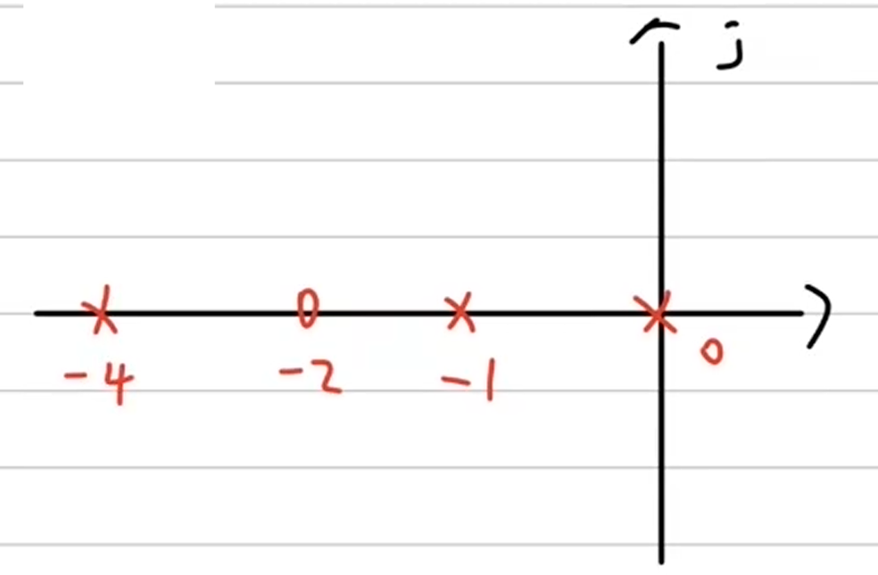

系统的开环传递函数为
$$G(s) = \dfrac{K^*(s+2)}{s(s+1)(s+4)}$$
绘制根轨迹图。

列出开环极点与开环零点，并标注在图中。
$$p_1 = 0,p_2 = -1,p_3 = -4;z_1 = -2$$

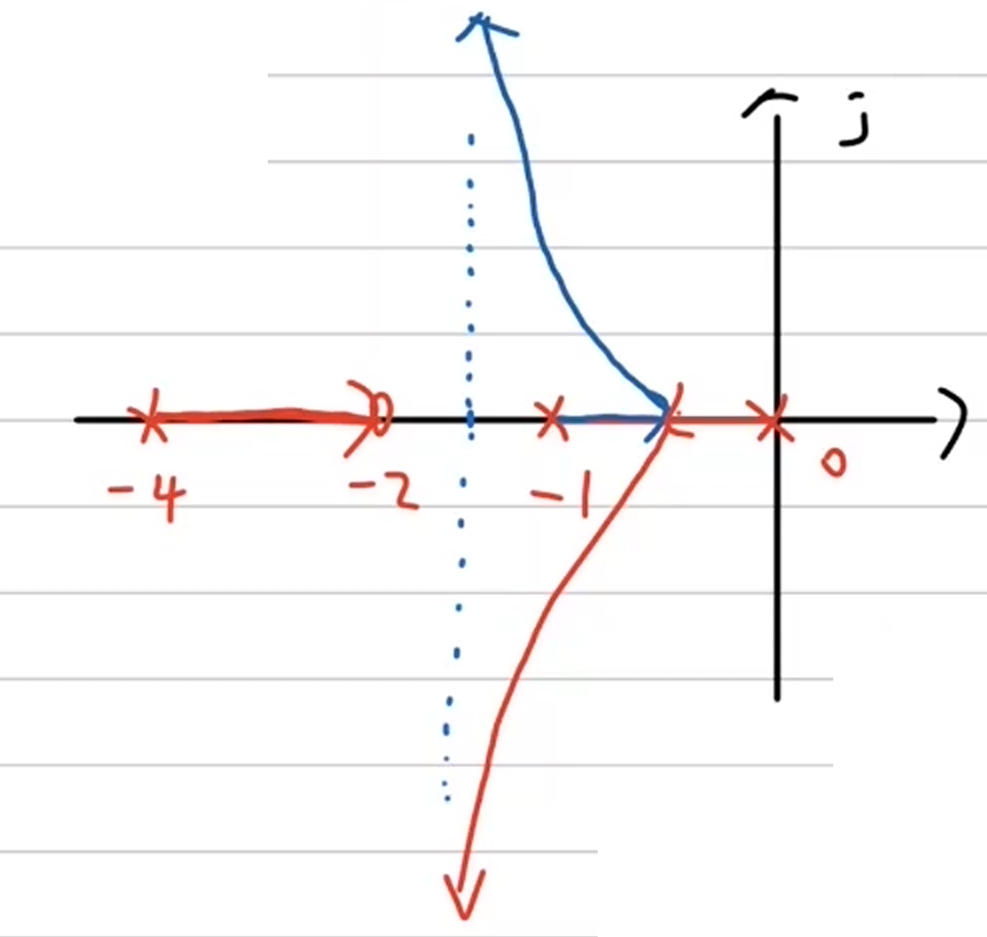

确定分支数，根轨迹的分支数与开环零点数m、开环极点数n中的大者相等，这里是3
确定实轴上的根轨迹，对于区间$(-\infty,-4)$来说，其右边有4个开环极点与零点，因此不是根轨迹。其他区间同理，从而得到实轴上根轨迹的区间为$(-4,-2)$与$(-1,0)$
确定是哪个极点指向-2.如果是0或-1指向-2.由以上推测出来的实轴上的根轨迹，根轨迹不能在实轴上。会导致根轨迹关于实轴不对称，因此不成立。
所以是-4指向-2，其余两个极点出发的根轨迹分支指向无穷远处。
确定渐近线，有$n-m=2$条渐近线，其夹角为$\dfrac{\pi}{2},\dfrac{3}{2}\pi$，与实轴的交点为$\sigma_a = \dfrac{0-1-4-(-2)}{3-1} = -\dfrac{3}{2}$.据此绘图即可。
右图即为该根轨迹图。
### 根轨迹的分离点
两条或两条以上根轨迹分支在s平面上相遇又立即分开的点（例如上图中红蓝交界的点），称为根轨迹的分离点，分离点的坐标$d$是下列方程的解:
$$\sum_{j=1}^{m} \frac{1}{d - z_j} = \sum_{i=1}^{n} \frac{1}{d - p_i}$$
式中，$z_j$为各开环零点的数值;$p_i$为各开环极点的数值;分离角为$\dfrac{(2k+1)\pi}{l}$。

这个求分离点的方法等价于，将开环特征方程写成$\dfrac{K^*A(s)}{B(s)}$的形式，然后解方程$A'(s)B(s)-A(s)B'(s)=0$，如果开环传递函数分母中含有二阶及以上的因式时，可以使用这种方法求解分离点。
### 根轨迹与虚轴的交点
将$s = j\omega$代入开环特征方程，求得的$\omega$即为根轨迹与虚轴的交点处的虚部。
#### 例题
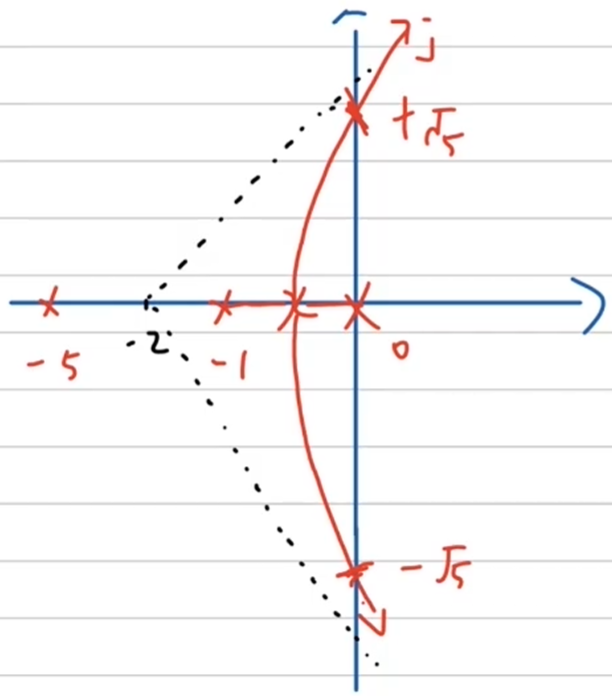

某单位反馈系统开环传递函数
$$G(s) = \frac{K^*}{s(s+1)(s+5)}$$
绘制系统根轨迹。

记得求出分离点并标注于图上。
这里只介绍根轨迹与虚轴交点的求解方法。将$s = j\omega$代入特征方程，得到
$$j\omega(j\omega+1)(j\omega+5) = 0$$
化简得到
$$-6\omega^2+K^*+(-\omega^3+5\omega)j = 0$$
由此可知$$-6\omega^2+K^* = 0,-\omega^3+5\omega = 0$$
解得$\omega = \pm\sqrt{5},K^* = 30$
### 根轨迹的起始角与终止角
根轨迹离开开环复数极点处的切线与正实轴的夹角，称为起始角，以$\theta_{p_i}$标志;根轨迹进入开环复数零点处的切线与正实轴的夹角，称为终止角，以$\varphi_{z_i}$表示。这些角度可按如下关系式求出
$$\begin{align*}
\theta_{p_i} &= (2k+1)\pi + \left( \sum_{j=1}^{m} \varphi_{z_j p_i} - \sum_{\substack{j=1 \\ (j\neq i)}}^{n} \theta_{p_j p_i} \right); & k=0, \pm 1, \pm 2, \cdots \\
\varphi_{z_i} &= (2k+1)\pi - \left( \sum_{\substack{j=1 \\ (j\neq i)}}^{m} \varphi_{z_j z_i} - \sum_{j=1}^{n} \theta_{p_j z_i} \right); & k=0, \pm 1, \pm 2, \cdots
\end{align*}$$

这看起来很恐怖，但是有简单的记忆方法
我们都知道对于一个传递函数来说，它的相角是根据分子各复数的相角减去分母各复数的相角。分子对应的是零点，分母对应的是极点。
那么以上两个公式我们可以简单记忆为
$$\text{零点角}-\text{极点角}=(2k+1)\pi$$，这里$(2k+1)\pi$通常取$-\pi$比较合适。下面我们通过例题来说明。
#### 起始角（入射角）
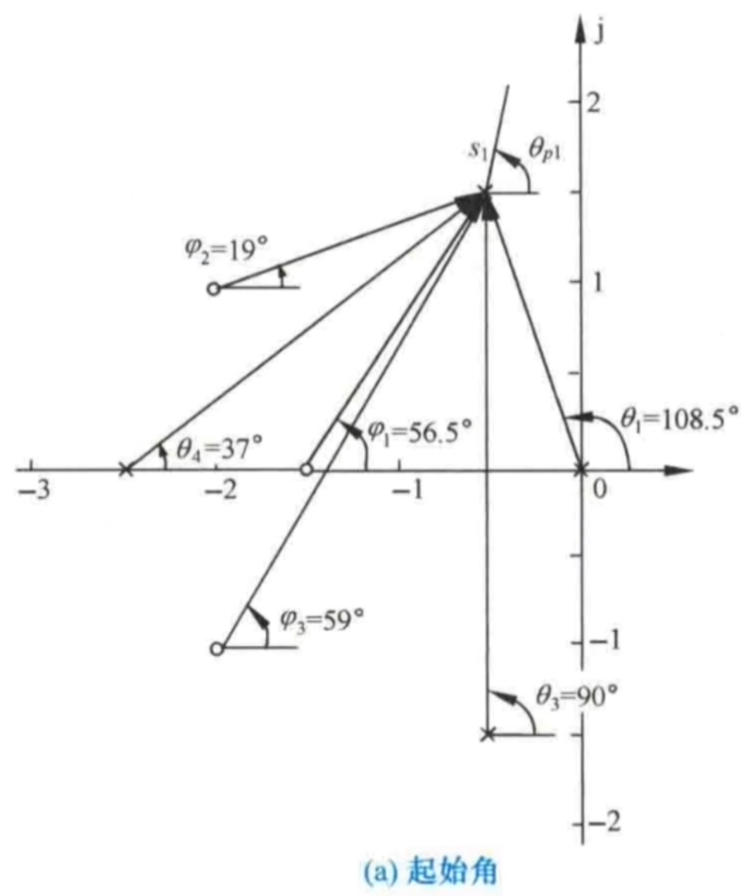

开环传函的各零点和极点都标注于图上。求出$\theta_{p1}$
求起始角的步骤：
各零点与极点与求起始角的极点连线，**从零点向该极点连线与实轴正半轴的夹角是“零点角”，从极点向该极点连线与实轴正半轴的夹角是“极点角”，同时，由于所求起始角从极点发出，我们将起始角也认为是“极点角”**
$$\varphi_1+\varphi_2+\varphi_3-\theta_1-\theta_3-\theta_4 - \theta_{p1} = -180^\circ$$
即可求出起始角。
 
 

#### 终止角（出射角）
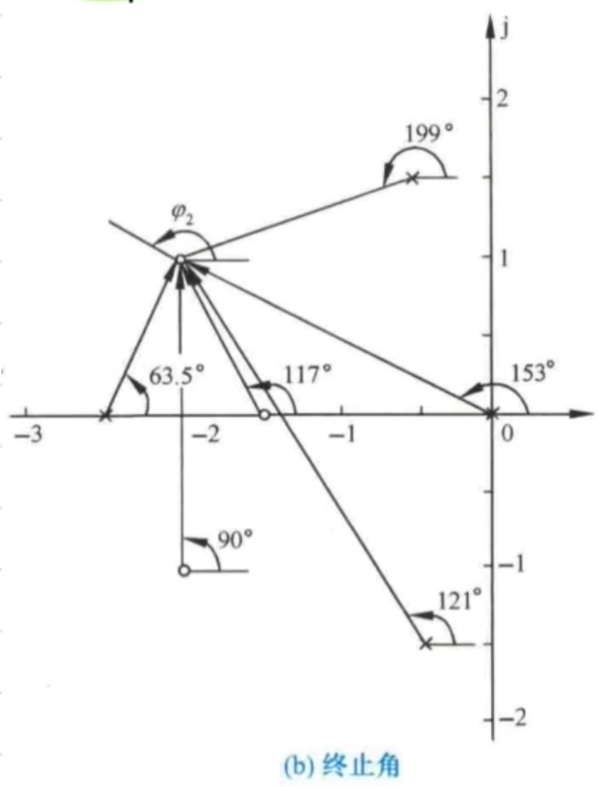

各零点与极点与求终止角的零点连线，**从零点向该零连线与实轴正半轴的夹角是“零点角”，从极点向该零点连线与实轴正半轴的夹角是“极点角”，同时，由于所求终止角从零点结束，我们将终止角也认为是“零点角”**
$$\varphi_2+90^\circ+117^\circ-63.5^\circ-121^\circ-199^\circ-153^\circ= -180^\circ$$