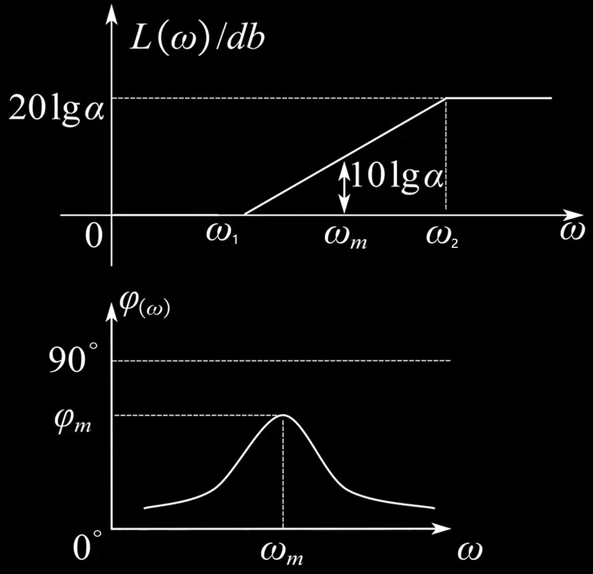
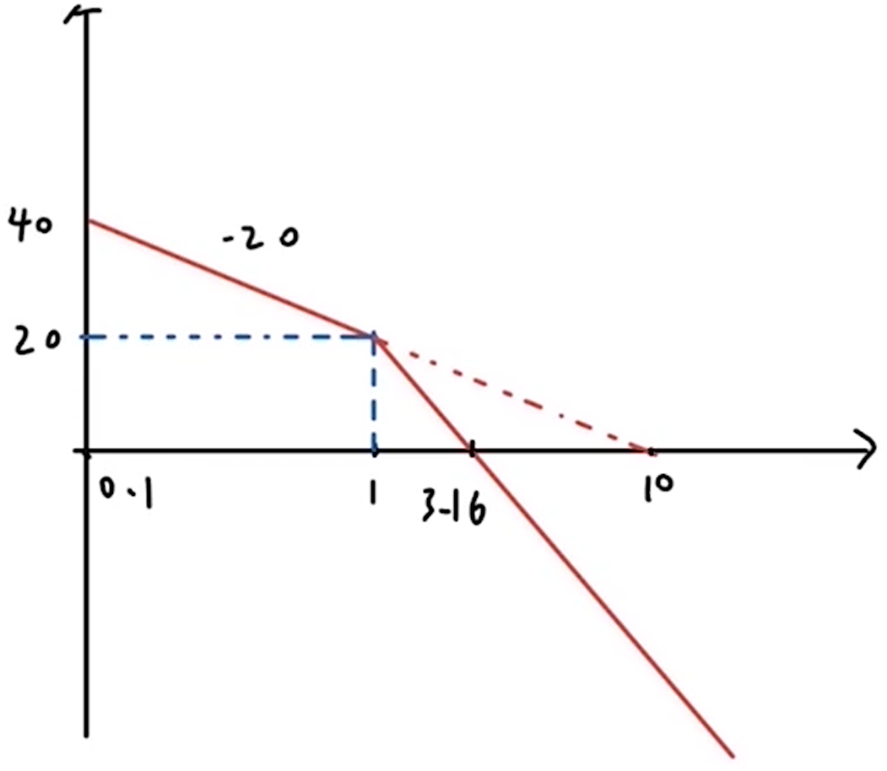
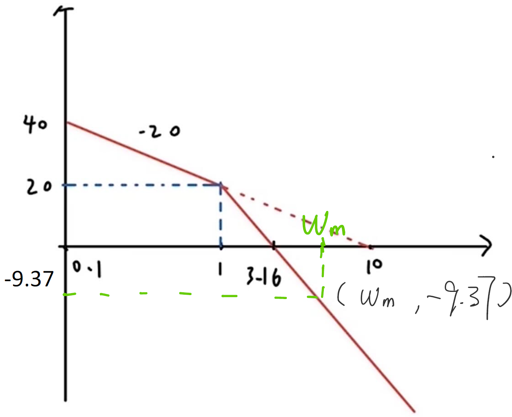
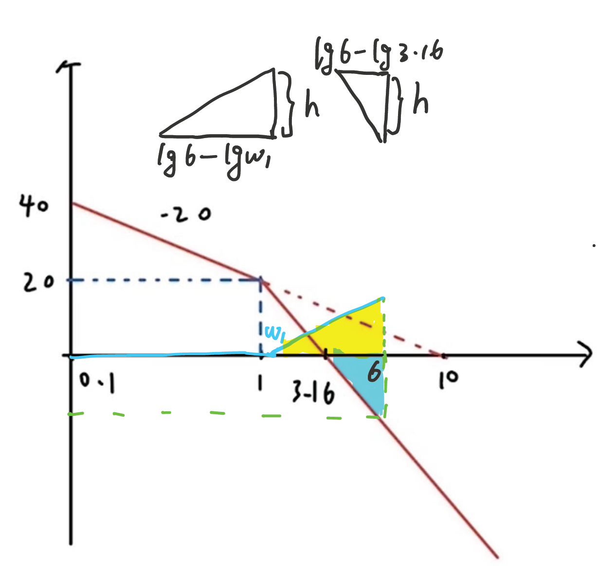
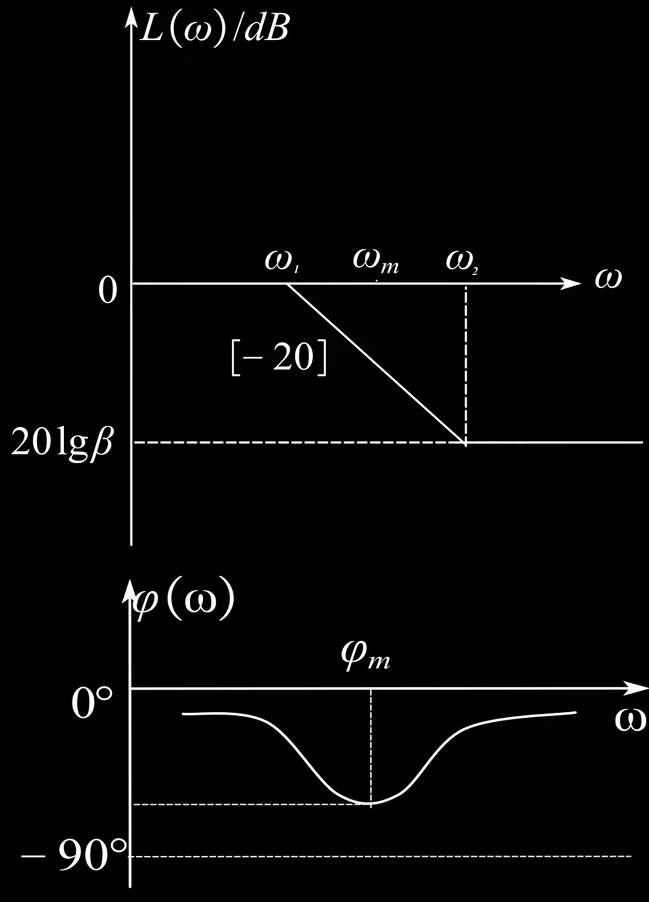
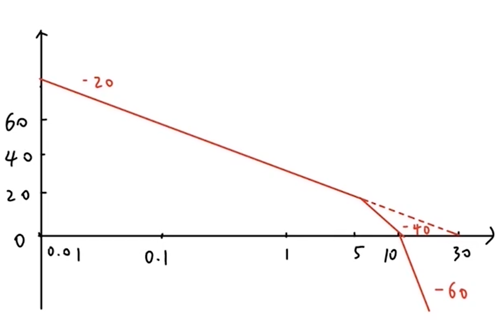
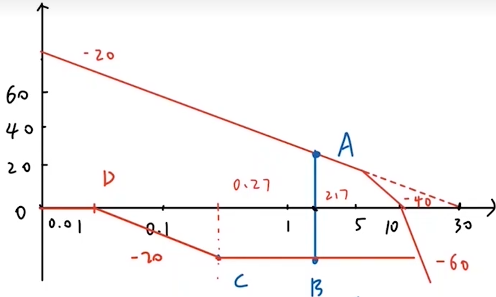

### 超前校正

相位超前校正，顾名思义，是为了提高相位角。因此，超前校正环节的伯德图中，相位角是大于0的，从而增加系统的相位裕度。
超前校正环节的传递函数为
$$G_j(s) = \frac{\alpha T s + 1}{T s + 1},\alpha > 1$$
伯德图如右图，其中$\omega_1 = \dfrac{1}{\alpha T},\omega_m = \dfrac{1}{\sqrt{\alpha}T},\omega_2 = \dfrac{1}{T}$，$\omega_m$为最大超前角频率
相频图中最大相角$\varphi_m$与$\alpha$的关系是
$$\alpha = \dfrac{1+\sin \varphi_m}{1-\sin\varphi_m}$$
记$\omega_{c0}$为未校正截止频率，$\gamma_0$为未校正相角裕度，$\omega_{c}^*$为题目要求截止频率，$\gamma^*$为题目要求相角裕度
那么使用超前校正有以下两点要求
1. $\omega_{c0}<\omega_c^*,\gamma_0<\gamma^*$时优先考虑超前校正
2. 校正系统所需要的最大超前角$\varphi_m$需要小于$60^\circ$
#### 超前校正的具体步骤
下面通过一个例题来说明超前校正的具体步骤。
设单位反馈系统的开环传递函数
$$G_0(s) = \frac{K}{s(s+1)}$$
试设计校正装置$G_j(s)$，使得校正后系统满足下列指标：
1. 当输入$r = t$时，稳态误差$e_{ss}^* \leq 0.1$
2. 开环系统截止频率$\omega_c^* \geq 6 rad/s$
3. 相角裕度$\gamma^* \geq 60^\circ$
4. 幅值裕度$h^* \geq 10 dB$

**第一步：根据稳态误差校正低频段，即求得开环增益$K$**
注意到是I型系统，输入为单位斜坡（等速输入），根据静态误差系数，$e_{ss} = \dfrac{1}{K}$，从而有$\dfrac{1}{K} \leq 0.1$，得到$K \geq 10$。取$K = 10$，从而开环传递函数为$$G(s) = \dfrac{10}{s(s+1)}$$
**第二步：画出未校正系统的伯德图，求出截止频率$\omega_{c0}$和相角裕度$\gamma_0$**

画图可以得到$\omega_{c0} = 3.16rad/s<\omega_c^*$，$\gamma_0 =  180^\circ+\angle G(j\omega_c)=17.56^\circ<\gamma^*=60^\circ$，因此需要进行超前校正。
**最大超前角应该比目标相角裕度和未校正相角裕度的差大$5^\circ-12^\circ$**，因为校正过程中会有一些损失。我们一般就取$10^\circ$
$$\varphi_m = \gamma^*-\gamma_0+10^\circ=52.44^\circ<60^\circ$$
可以使用超前校正。

**第三步：根据最大超前角$\varphi_m$求出$\alpha$，从而得到$\omega = \omega_m$得到校正环节给予的幅频增益$10 \lg \alpha$，从而求出按理想情况下校正的截止频率$\omega_m$**

**相角裕度$\gamma = 180^\circ + \angle G(j\omega_c)$完全由$\omega_c$时的相角决定，因此在理想状态下，最大超前角要加在$\omega=\omega_c$处，因此要让$\omega_m = \omega_c$**，此处$\omega_c$为校正后的截止频率

$$\alpha = \dfrac{1+\sin \varphi_m}{1-\sin\varphi_m}=8.65^\circ,10\lg \alpha = 9.37dB$$

要让$\omega_m = \omega_c$，需要让$L(\omega_c)+L(\omega_m) = 0$，因此有$$L(\omega_c) = -10\lg \alpha = -9.37 dB$$
由图像可以列出
$$\dfrac{-9.37-0}{\lg\omega_m-\lg 3.16} = -40 \Rightarrow \omega_m = 5.42rad /s$$

**第四步：对比$\omega_m$与$\omega_c^*$的大小，若$\omega_m<\omega_c^*$则取$\omega_c = \omega_m$，若$\omega_m<\omega_c^*$则取$\omega_c = \omega_c^*$，否则不符合题意。也即取$\omega_c = \max\{\omega_m,\omega_c^*\}$**

此题中$\omega_c =\max\{\omega_m,\omega_c^*\} = 6rad/s$
取校正环节的$\omega_m' = \omega_c=6rad/s$
如右图，蓝色曲线为校正环节的伯德图，那么在$\omega = 6$时，$L_1(6)+L_2(6)=0$。把图中两个阴影三角形提出来，数据如伯德图上方的两个三角形所示，有
$$h = 20(\lg 6 - \lg \omega_1) = 40(\lg 6 - \lg 3.16)$$
解得$\omega_1 = 1.67rad/s$，从而很容易求出$\omega_2 = 21.6rad/s$
得到校正环节传递函数$$G_j(s) = \dfrac{\dfrac{1}{1.67}s+1}{\dfrac{1}{21.6}s+1}$$

**注：如果最后取$\omega_c = \omega_m$，那么$\omega_1 = \omega_m\cdot \dfrac{1}{\sqrt{a}},\omega_2 = \omega_m\cdot \sqrt{a}$**
**第五步：验算**
校正后的开环传递函数$$G(s) = G_0(s)G_j(s) =\dfrac{10}{s(s+1)}\cdot \dfrac{\dfrac{1}{1.67}s+1}{\dfrac{1}{21.6}s+1}$$
$$|G(j\omega)|= \dfrac{10 \sqrt{(\dfrac{\omega}{1.67})^2+1}}{\omega \sqrt{\omega^2+1} \sqrt{(\dfrac{\omega}{21.6})^2+1}}$$
$$|G(j\omega_c)| = 1$$
解得$\omega_c = 6rad/s$
相角裕度$$\gamma = 180+\angle G(j\omega_c) = 68.38^\circ>60^\circ $$
$$\angle G(j\omega_g) = -\pi$$
你会发现这个方程是没有实根的，原因是
$$G(j\omega_g) = -90^\circ - \arctan(\omega) + \arctan\left(\frac{\omega}{1.67}\right) - \arctan\left(\frac{\omega}{21.6}\right) >-180^\circ \\ \Leftrightarrow  \arctan(\omega) - \arctan\left(\frac{\omega}{1.67}\right) + \arctan\left(\frac{\omega}{21.6}\right)<90^\circ$$
显然是成立的
$\omega\rightarrow +\infty$时$G(j\omega_g)\rightarrow -180^\circ$，不妨认为$\omega_g = +\infty$，此时$|G(j\omega_g)| = 0^+$，也就是说，幅值裕度$K_g = +\infty$，显然满足要求。
### 滞后校正

滞后环节的传递函数为
$$G_j(s) = \frac{\beta T s + 1}{T s + 1},\beta < 1$$
伯德图如右图，其中$\omega_1 = \dfrac{1}{ T},\omega_m = \dfrac{1}{\sqrt{\beta}T},\omega_2 = \dfrac{1}{\beta T}$，$\omega_m$为最大滞后角频率
记$\omega_{c0}$为未校正截止频率，$\gamma_0$为未校正相角裕度，$\omega_{c}^*$为题目要求截止频率，$\gamma^*$为题目要求相角裕度，$G_0$为未校正前开环传函
那么使用超前校正有以下两点要求
1. $\omega_{c0}>\omega_c^*,\gamma_0<\gamma^*$时优先考虑滞后校正
2. $\gamma_0(\omega_c^*) = 180^\circ + \angle G_0(j\omega_c)>\gamma^* + 6^\circ$
原理解释是，相信你已经知道了串联校正就是简单的伯德图叠加，那么由相频曲线可以看到始终小于0，我们即便用相角比较大的部分去校正，也会损失一部分相角，因此需要留出一些裕量，一般取$6^\circ$即可。
#### 滞后校正的具体步骤
下面通过一个例题来说明滞后校正的具体步骤。
设单位反馈系统的开环传递函数
$$G_{0}(s) = \frac{K}{s(0.1s+1)(0.2s+1)}$$

试设计校正装置$G_j(s)$，使得校正后系统满足下列指标：
(1) 速度误差系数$K_v^* = 30$
(2) 开环系统截止频率$\omega_c^* \geq 2.3 rad/s$
(3) 相角裕度$\gamma^* \geq 40^\circ$
(4) 幅值裕度$h^* \geq 10 dB$

**第一步：校正低频段，即求得开环增益$K$**
显然有$K=K_v^* = 30$
**第二步：画出未校正系统的伯德图，求出截止频率$\omega_{c0}$和相角裕度$\gamma_0$**

$$|G_0(j\omega_{c0})| = 1\Rightarrow \omega_{c0} = 11.45 > \omega_c^* \\ \gamma_0 = 180^\circ + \angle G_0(j\omega_{c0}) = -25.28^\circ<\gamma^*$$
因此我们可以考虑滞后校正。此时我们判断一下前提条件
$$\gamma_0(\omega_c^*) = 180^\circ + \angle G_0(j\omega_c^*) = 52.345^\circ > \gamma^* + 6^\circ$$
可以使用滞后校正
**第三步：由$\gamma_0(\omega_c) = \gamma^*+6^\circ$求出$\omega_c$，作为最终的截止频率，从而求出$\omega_2$，进而求得$\beta$**

$$\gamma_0(\omega_c) = \gamma^*+6^\circ \Rightarrow \omega_c = 2.7rad/s$$
将其作为最终的截止频率，为了让相角落在比较大的位置，我们一般取$\omega_2 = \dfrac{1}{10}\omega_c$，这里$\omega_2 = 0.27rad/s$
将滞后校正的伯德图画在原伯德图上，如右图所示.
设$A(2.7,y)$,由第一段曲线过$(1,20\lg 30)$可以列出
$$\dfrac{y-20\lg 30}{\lg 2.7 - \lg 1} = -20$$
解得$y = 20.915dB$，又有$20\lg \beta =- y = -20.915$
解得$\beta = 0.09$
从而有$\omega_1 = \omega_2 \beta= 0.0243rad/s$
解得校正环节传递函数$$G_j(s) = \dfrac{\dfrac{1}{0.27}s+1}{\dfrac{1}{0.0243}s+1}$$
**第四步：验算**
此处不再赘述。