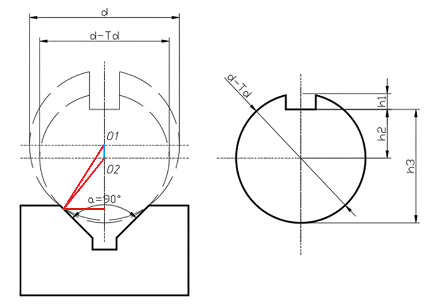
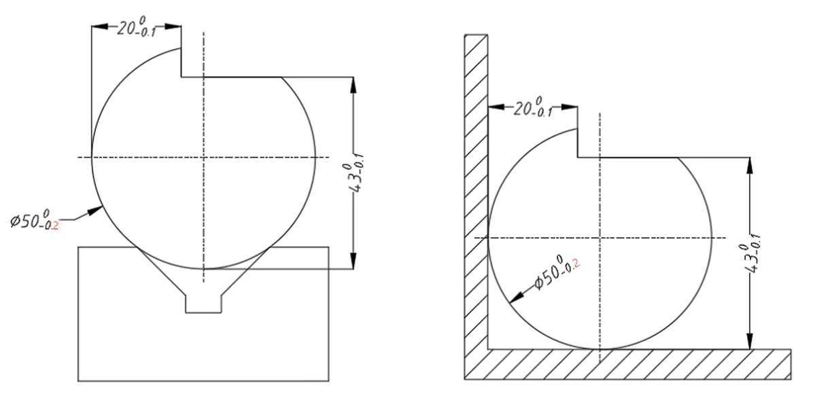
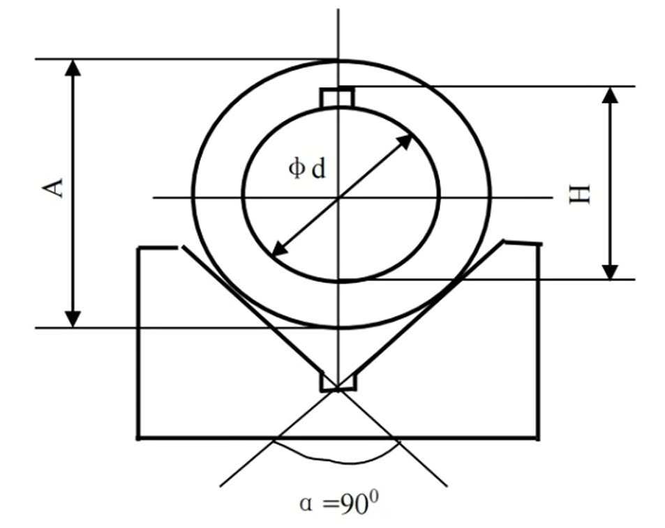
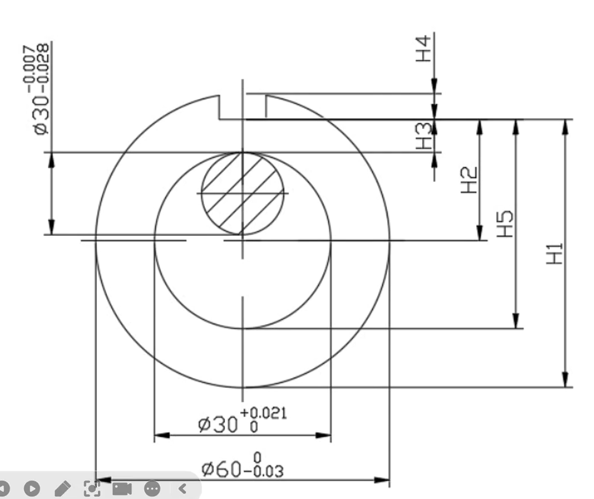

### 定位误差
#### 定位误差$\Delta_{dw}$
两个字母即定位的首字母，指的是工件的**被加工表面**相对其**工序基准**的位置误差。
#### 基准位移误差$\Delta_{jw}$
两个字母即基位的首字母，指由于定位副的制造误差或定位方式而导致的**定位基准**的误差。也即**定位基准相对于定位副的误差。**
#### 基准不重合误差$\Delta_{jb}$
由于**定位基准**与**工序基准**不一致所引起的定位误差，即**工序基准相对于定位基准的误差**。

$$\Delta_{dw} = \Delta_{jw} \pm \Delta_{jb}$$

其中的正负号取决于定位尺寸（即定位基准与工序基准之间的尺寸）对加工尺寸的影响。
#### V型块定位

如图所示为圆柱形工件在V形块上定位铣削键槽，对于键槽的深度尺寸可以有$h_1$,$h_2$,$h_3$三种标注方法。其工序基准分别是工件的中心线、上母线和下母线。分析三个工序尺寸的定位误差分别是多少？

使用V型块定位时，**定位基准为圆柱的轴心线，定位副为接触点**。记工件直径的公差为$T_d$，则如图中$O_1O_2$的变化范围，**基准位移误差**即为图中蓝色的一段，即

$$\Delta_{jw}=\frac{d}{2}\cos(\frac{\pi}{2}-\frac{\alpha}{2})-\frac{d-T_d}{2}\cos(\frac{\pi}{2}-\frac{\alpha}{2})=\frac{T_d}{2\sin\frac{\alpha}{2}}$$

由于我们需要加工的是铣削键槽，所以尺寸线的两个边界，除了被加工对象（铣削键槽）以外的就是工序基准。

对于$h_1$，**工序基准是外圆的上母线**，其与**定位基准（圆柱轴心线）**的相对误差即为**一个半径的公差**，从而有
$$\Delta_{jb}=\frac{T_d}{2}$$

**让待加工面位置不变**，定位基准的上升与工序基准与定位基准的距离增大会导致上母线高度变高，**从而$h_1$增大**，因此他们对$h_1$的影响都是正向的，因此有
$$\Delta_{dw}=\Delta_{jw}+\Delta_{jb}=\frac{T_d}{2}(\frac{1}{2\sin\frac{\alpha}{2}}+1)$$

对于$h_2$，工序基准为外圆轴心，工序基准与定位基准相同，从而$\Delta_{jb}=0$
$$\Delta_{dw}=\Delta_{jw}=\frac{T_d}{2\sin\frac{\alpha}{2}}$$

对于$h_3$，工序基准为下母线，当工序基准与定位基准的距离增大，即圆的半径增大时，下母线会向上抬，从而减小$h_3$的值。因此
$$\Delta_{dw} = \Delta_{jw}-\Delta_{jb}=\frac{T_d}{2}(\frac{1}{2\sin\frac{\alpha}{2}}-1)$$

#### 定位板定位

某批环形零件在铣床上采用调整法铣削一缺口，其尺寸见下面零件图，要求保证尺寸$20^0_{-0.1}$mm。现采用90°的V 形块和支承板两种定位方案,试分别求它们的定位误差,并判断能否满足加工要求。(已知铣削加工的$\omega=0.05$mm)。

由上面的推导我们知道，V型板的基准位移误差$\Delta_{jw}$效果是**让外圆轴线（定位基准）向上抬升**，而图中的$20^0_{-0.1}$mm是水平方向的尺寸，基准位移误差对其没有影响，$\Delta_{jw} = 0$。显然工序基准是左母线，基准不重合误差即为**定位基准（外圆轴线）到工序基准（左母线）尺寸的公差**，即半径的公差。
$$\Delta_{dw}=\Delta_{jw}=\frac{0-(-0.2)}{2}=0.1mm>0.05mm$$
因此不能满足加工要求。

对于定位板，**定位基准为外圆与定位板的接触点/线**。显然对于定位板，**基准位移误差$\Delta_{jw}$恒为**0。而所研究尺寸的工序基准恰好是定位板的面，也就是说工序基准与定位基准相同,$\Delta_{jb}=0$
$$\Delta_{dw}=\Delta_{jw}+\Delta_{jb}=0$$

满足加工要求。
（如果该尺寸的工序基准为竖直的这条直径的话，虽然$\Delta_{jw}=0$，但是$\Delta_{jb}=\dfrac{0-(-0.2)}{2}=0.1mm$）

#### 2024-2025真题

如图所示，以外圆柱面在V形块上定位，在插床上插内键槽，已知外径$A=50^0_{-0.03}$，内径$d=30^{+0.05}_0$，外径A对内径d 的同轴度误差为$0.02$mm,试计算加工尺寸$H$的定位误差。

**当引起$\Delta_{jb}$和$\Delta_{jw}$的不是同一个公差的时候，直接相加即可。因为只有同一个公差引起的误差才有可能是“反向”的。**

$$\Delta_{jb} = \frac{T_d}{2}=0.025mm\\ \ \\\Delta_{jw} = \frac{T_D}{2\sin\frac{\alpha}{2}}=0.0212mm$$
还要加上同轴度误差，与另外两个误差都毫不相关，直接相加即可

$$\Delta_{dw}=\Delta_{jb}+\Delta_{jw}=0.0662mm$$
 
#### 心轴定位
套类零件铣槽时，其工序尺寸有五种标注方法，若定位心轴水平放置，分别计算H1，H2，H3，H4，H5的定位误差。

以心轴定位时，定位基准在零件的轴心线。因此
$$\Delta_{jb}=\frac{T_D}{2}=0.015$$