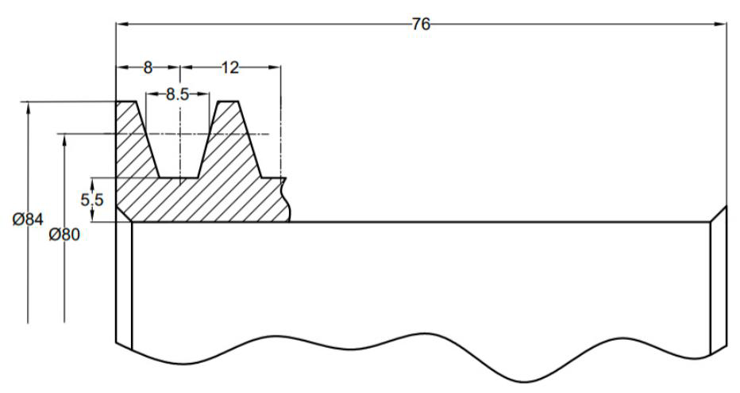

## T9-5：普通 V 带传动设计计算

### 1. 确定 V 带型号
查阅工况系数表（表 9-6），考虑每天工作 16 小时，选取工况系数 $K_A = 1.3$。
计算设计功率：
$$P_c = K_A \cdot P = 1.3 \times 1.7 = 2.21\text{kW}$$
结合 $P_c$ 和 $n_1 = 1430\text{r/min}$，查图 9-11 选用 **Z 型普通 V 带**。

### 2. 确定带轮基准直径 ($d_{d1}, d_{d2}$)
* **小带轮：** 查表 9-7 选取 $d_{d1} = 80\text{mm}$。
* **大带轮：** 计算 $d_{d2} = i d_{d1} = \frac{1430}{285} \times 80 = 401.4\text{mm}$。查标准系列选取 $d_{d2} = 400\text{mm}$。
* **验算：** 取滑动率 $\varepsilon = 0.015$，实际传动比 $i = 5.076$，误差小于 5%，合格。

### 3. 验算带速 ($v$)
$$v = \frac{\pi d_{d1} n_1}{60 \times 1000} = \frac{1430 \times 80 \pi}{60 \times 1000} = 5.99\text{m/s}$$
**结果：** 速度在 $5 \sim 25\text{m/s}$ 范围内，合格。

### 4. 确定中心距 ($a$) 和基准带长 ($L_d$)
* **初选中心距：** 题目要求 $a_0 = 500\text{mm}$（满足 $0.7(d_{d1}+d_{d2}) \le a_0 \le 2(d_{d1}+d_{d2})$ 的范围）。
* **初算带长：**
    $$L_{d0} = 2a_0 + \frac{\pi}{2}(d_{d1} + d_{d2}) + \frac{(d_{d2} - d_{d1})^2}{4a_0} = 1805.2\text{mm}$$
* **选定带长：** 查表 9-2，选取最接近的标准基准长度 **$L_d = 1800\text{mm}$**。
* **实际中心距：**
    $$a \approx a_0 + \frac{L_d - L_{d0}}{2} = 500 + \frac{1800 - 1805}{2} = 497.5\text{mm}$$

### 5. 验算小带轮包角 ($\alpha_1$)
$$\alpha_1 = 180^\circ - \frac{d_{d2}-d_{d1}}{a} \cdot \frac{180^\circ}{\pi} = 180^\circ - \frac{400-80}{497.5} \cdot \frac{180^\circ}{\pi} = 143.15^\circ$$
**结果：** $\alpha_1 > 120^\circ$，满足要求。

### 6. 确定带的根数 ($z$)
* **参数查取：**
    * 单根带额定功率 $P_0 = 0.35\text{kW}$ (查表 9-3)。
    * 功率增量 $\Delta P_0$ (计算采用值 $0.03\text{kW}$)。
    * 包角系数 $K_\alpha = 0.90$ (查表 9-4)。
    * 带长系数 $K_L = 1.18$ (查表 9-2)。
* **计算根数：**
    $$z \ge \frac{P_c}{[P_0]} = \frac{1.3 \times 1.7}{(0.35+0.03) \times 0.9 \times 1.18} = 5.48$$
**结果：** 取整选用 **6 根 Z 型普通 V 带**。

### 7. 确定带的预拉力 ($F_0$)
查表 9-1 得 Z 型带每米质量 $q = 0.06\text{kg/m}$。
$$F_0 = \frac{500P_c}{zv}(\frac{2.5}{K_\alpha}-1) + qv^2$$
代入数据得：
$$F_0 = \frac{500 \times 2.21}{6 \times 5.99}(\frac{2.5}{0.9}-1) + 0.06 \times 5.99^2 = 56.8\text{N}$$

### 8. 计算作用在轴上的力 ($F_Q$)
$$F_Q = 2zF_0 \sin\left(\frac{\alpha_1}{2}\right) = 2 \times 6 \times 56.8 \times \sin\left(\frac{143.15^\circ}{2}\right) = 646.7\text{N}$$

### 小带轮轮缘部分视图
