# 机械工程测试技术
## 傅里叶级数
傅里叶级数用于描述描述周期信号。周期信号的幅频谱是离散的。简单来说，周期信号由离散的不同频率的信号合成。
### 傅里叶三角级数（单边谱）
$$x(t) = \dfrac{a_0}{2} + \sum_{n=1}^{\infty} \left( a_n \cos n\omega_0 t + b_n \sin n\omega_0 t \right)$$
或者
$$x(t) = \dfrac{a_0}{2} + \sum_{n=1}^{\infty} \left(\sqrt{a_n^2+b_n^2} \sin \left(n\omega_0 t + \mathrm{atan2} (a_n,b_n)\right)\right)$$
其中
$$\begin{cases}
\omega_0 = \dfrac{2\pi}{T} \\
\\
\displaystyle a_0 = \dfrac{2}{T} \int_{-\frac{T}{2}}^{\frac{T}{2}} x(t) dt \\
\\
\displaystyle a_n = \dfrac{2}{T} \int_{-\frac{T}{2}}^{\frac{T}{2}} x(t) \cos n\omega_0 t dt \\
\\
\displaystyle b_n = \dfrac{2}{T} \int_{-\frac{T}{2}}^{\frac{T}{2}} x(t) \sin n\omega_0 t dt
\end{cases}$$

显然当$x(t)$为奇函数时$a_0 = a_n = 0$，当$x(t)$为偶函数时$b_n = 0$。
### $\mathrm{atan2}$与$\arctan$
$\arctan$接受一个参数，其值域为$(-\dfrac{\pi}{2}, \dfrac{\pi}{2})$，也就是说，它没法识别$-135^\circ$这样的角度，而一个信号完全可能落后另一个信号$135^\circ$（因为$\sin$的周期是$2\pi$）。
因此需要一个能够识别角度象限的$\mathrm{atan2}$函数，它接受两个参数，即$a_n$和$b_n$。它能根据 $a_n$ 和 $b_n$ 的正负号，准确地判断出相位角所在的四个象限。
$a_n = -1$, $b_n = -1$时，
$\arctan(1) = \pi/4$ ；$\text{atan2}(a_n, b_n) = \text{atan2}(-1, -1) = -3\pi/4$。
#### 例题（幅频谱和相角谱）
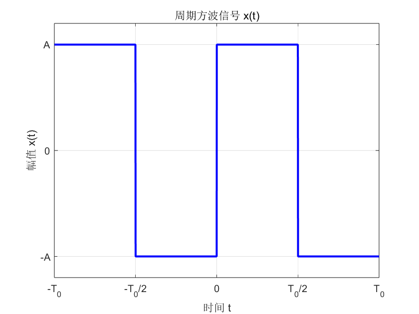

求图所示周期方波信号的傅里叶级数的三角函数展开式，并画出其幅频谱和相角谱。

$$x(t) =
\begin{cases}
-A & -T_0/2 \le t < 0 \\
A & 0 \le t \le T_0/2
\end{cases}$$因为 $x(t)$ 是奇函数，所以：$$a_0 = 0$$$$a_n = 0 \quad (\text{for } n \ge 1)$$计算 $b_n$（令 $\omega_0 = 2\pi/T_0$）：$$\begin{aligned}
b_n &= \dfrac{2}{T_0} \int_{-T_0/2}^{T_0/2} x(t) \sin(n\omega_0 t) dt \\
&= \dfrac{2}{T_0} \cdot 2 \int_{0}^{T_0/2} A \sin(n\omega_0 t) dt \\
&= \dfrac{4A}{T_0} \left[ -\dfrac{\cos(n\omega_0 t)}{n\omega_0} \right]_{0}^{T_0/2} \\
&= -\dfrac{4A}{n\omega_0 T_0} \left[ \cos\left(n\omega_0 \dfrac{T_0}{2}\right) - \cos(0) \right]
\end{aligned}$$因为 $\omega_0 T_0 = 2\pi$，所以 $\omega_0 \dfrac{T_0}{2} = \pi$：$$\begin{aligned}
b_n &= -\dfrac{4A}{n(2\pi)} [\cos(n\pi) - 1] \\
&= -\dfrac{2A}{n\pi} (\cos(n\pi) - 1)
\end{aligned}$$分析 $b_n$ 的值：当 $n$ 为偶数时 (n = 2, 4, ...): $\cos(n\pi) = 1$，所以 $b_n = 0$。当 $n$ 为奇数时 (n = 1, 3, ...): $\cos(n\pi) = -1$，所以 $b_n = -\dfrac{2A}{n\pi} (-1 - 1) = \dfrac{4A}{n\pi}$。总结 $b_n$：$$b_n =
\begin{cases}
\dfrac{4A}{n\pi} & n \text{ 为奇数} \\
0 & n \text{ 为偶数}
\end{cases}$$
三角函数展开式将 $a_n$ 和 $b_n$ 代入傅里叶级数：$$x(t) = \dfrac{a_0}{2} + \sum_{n=1}^{\infty} (a_n \cos(n\omega_0 t) + b_n \sin(n\omega_0 t))$$$$x(t) = \sum_{n=1, 3, 5...}^{\infty} \dfrac{4A}{n\pi} \sin(n\omega_0 t)$$展开为：$$x(t) = \dfrac{4A}{\pi} \left( \sin(\omega_0 t) + \dfrac{1}{3}\sin(3\omega_0 t) + \dfrac{1}{5}\sin(5\omega_0 t) + \dots \right)$$

幅频谱 $A_n$ 是信号在第 $n$ 次谐波频率 $n\omega_0$ 上的幅值。$$A_n = \sqrt{a_n^2 + b_n^2} \quad (n \ge 1)$$幅频谱是 $A_n$ 关于 $n\omega_0$的离散函数图。
相频谱 $\phi_n$ 是信号在第 $n$ 次谐波频率 $n\omega_0$ 上的相位。
$$\phi_n = \text{atan2}(a_n, b_n) \quad (n \ge 1)$$
相频谱是 $\phi_n$ 关于 $n\omega_0$的离散函数图。

  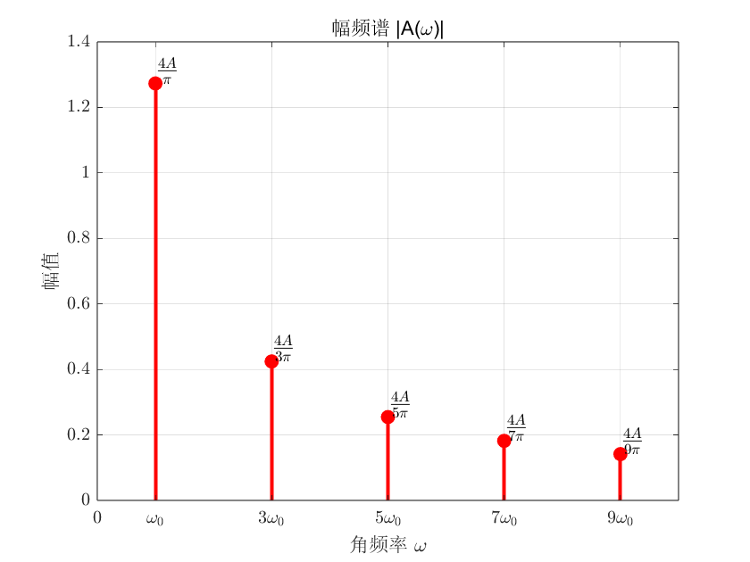
  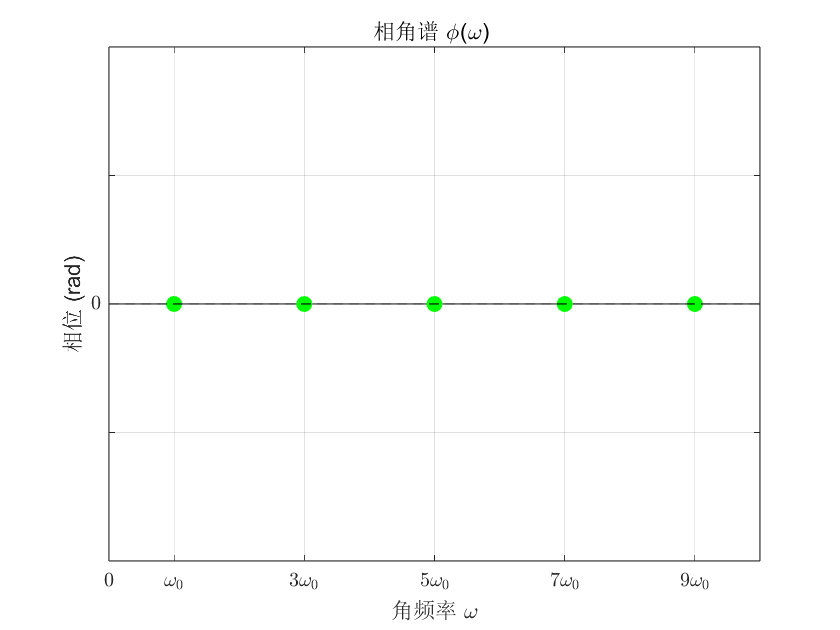

应用傅里叶级数的三角函数展开式得到的是周期信号的单边频谱。
### 傅里叶复指数级数（双边谱）
$$x(t) = \sum_{n=-\infty}^{\infty} C_n e^{j n \omega_0 t}  \quad n=0, \pm 1, \pm 2, \pm 3, \dots$$
其中
$$ \begin{cases}
\displaystyle C_n = \dfrac{1}{T} \int_{-\frac{T}{2}}^{\frac{T}{2}} x(t) e^{-j n \omega_0 t} dt \\
\\
|C_n| = \sqrt{\mathrm{Re}(C_n)^2+\mathrm{Im}(C_n)^2} \\
\\
\displaystyle \varphi_n = \mathrm{argz}(C_n)= \mathrm{atan2}(\mathrm{Im}(C_n),\mathrm{Re}(Cn)) 
\end{cases}$$

欧拉公式
$$\cos \varphi = \dfrac{e^{j\varphi} + e^{-j\varphi}}{2}$$$$\sin \varphi = \dfrac{e^{j\varphi}-e^{-j\varphi} }{2j}$$
#### 负指数级数展开的双边谱性质
双边幅频谱是偶函数，双边相频谱为奇函数
$$\begin{align*}
x(t) &= \dfrac{a_0}{2} + \sum_{n=1}^{\infty} \left( a_n \cos n\omega_0 t + b_n \sin n\omega_0 t \right) \\
&= \dfrac{a_0}{2} + \sum_{n=1}^{\infty} \left( a_n \dfrac{e^{jn\omega_0 t}+e^{-jn\omega_0 t}}{2} + b_n \dfrac{e^{jn\omega_0 t}-e^{-jn\omega_0 t}}{2j}\right) \\
&= \dfrac{a_0}{2} + \sum_{n=1}^{\infty} \left( \dfrac{a_n-b_n j }{2}e^{jn\omega_0 t}+\dfrac{a_n+b_nj }{2}e^{-jn\omega_0 t}\right)
\end{align*}$$
对比各项可知
$$C_0 = \dfrac{a_0}{2},C_n = \dfrac{a_n-b_nj}{2},C_{-n} = \dfrac{a_n+b_nj}{2}$$
很容易看出双边幅频谱是偶函数，双边相频谱为奇函数。
#### 例题
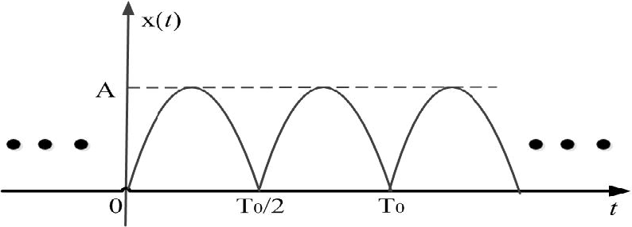

正弦整流信号如下图所示，请对其进行复指数基展开，并绘出双边谱。

周期$T=\dfrac{T_0}{2}$
$$C_n  = \frac{1}{\dfrac{T_0}{2}} \int_{0}^{\frac{T_0}{2}} A \sin(\omega_0 t) \cdot e^{-j n (2\omega_0) t} dt =  \frac{2A}{T_0} \int_{0}^{\frac{T_0}{2}} \sin(\omega_0 t) e^{-j 2n\omega_0 t} dt$$
用欧拉公式代换
$$\begin{align*}
C_n &= \frac{2A}{T_0} \int_{0}^{\frac{T_0}{2}} \left( \frac{e^{j\omega_0 t} - e^{-j\omega_0 t}}{2j} \right) e^{-j 2n\omega_0 t} dt \\
&= \frac{A}{jT_0} \int_{0}^{\frac{T_0}{2}} \left( e^{j\omega_0 (1-2n)t} - e^{-j\omega_0 (1+2n)t} \right) dt \\
&= \frac{A}{jT_0} \left[ \frac{e^{j\omega_0 (1-2n)t}}{j\omega_0 (1-2n)} - \frac{e^{-j\omega_0 (1+2n)t}}{-j\omega_0 (1+2n)} \right]_{0}^{\frac{T_0}{2}} \\
&= \frac{A}{jT_0 \cdot j\omega_0} \left[ \frac{e^{j\omega_0 (1-2n)t}}{1-2n} + \frac{e^{-j\omega_0 (1+2n)t}}{1+2n} \right]_{0}^{\frac{T_0}{2}}\\
&\overset{\omega_0 = \frac{2\pi}{T_0}}{=}\frac{A}{-2\pi} \left[ \frac{e^{j\omega_0 (1-2n)t}}{1-2n} + \frac{e^{-j\omega_0 (1+2n)t}}{1+2n} \right]_{0}^{\frac{T_0}{2}}\\
&=\frac{2A}{\pi (1 - 4n^2)}
\end{align*}$$
（最后一步通常求出来是一个$e^{j\varphi}$形式，用欧拉公式代换即可。）
$C_n$在$n\neq 0 $时是负数，$n = 0$时为正数。因此其相角在$n=0$时为0，$n\neq 0 $时是$\pm\pi$。

由双边幅频谱为偶函数，而双边相频谱为奇函数的原则作图。
$$ 
|C_n| = \dfrac{2A}{\pi (1 - 4n^2)} \\
\\
\displaystyle \varphi_n =\begin{cases}0 \quad n=0\\ \pi \quad n>0 \\ -\pi \quad n<0\end{cases}
$$

  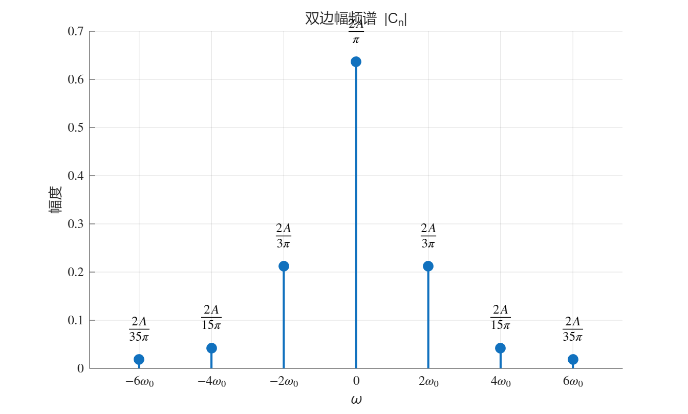
  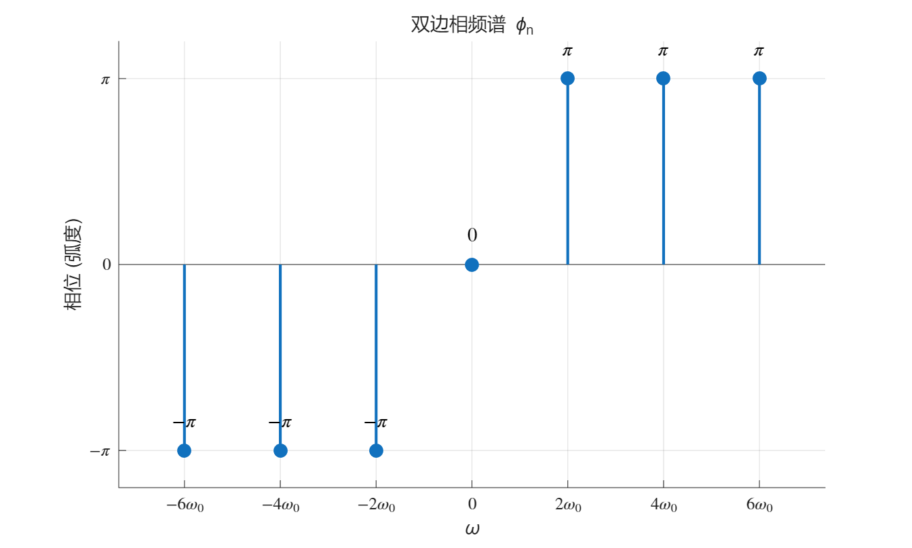

## 傅里叶变换
傅里叶变换用于描述描述非周期信号。非周期信号的幅频谱是连续的。简单来说，非周期信号由连续的不同频率的信号合成。
### 傅里叶变换与傅里叶逆变换
傅里叶变换为
$$X(\omega) = \int_{-\infty}^{+\infty}x(t)e^{-j\omega t} \mathrm{d}t$$
由$\omega = 2\pi f$，上式也可以写作
$$X(f)=\int_{-\infty}^{+\infty}x(t)e^{-2j\pi ft} \mathrm{d}t$$
傅里叶逆变换为
$$x(t) = \dfrac{1}{2\pi}\int_{-\infty}^{+\infty}X(\omega)e^{j\omega t} \mathrm{d}\omega$$
对应的，也可以写作
$$x(t) = \int_{-\infty}^{+\infty}X(\omega)e^{2j \pi f t} \mathrm{d}f$$
则称二者互为傅里叶变换对，记作$x(t) \rightleftharpoons X(\omega)$或$x(t) \rightleftharpoons X(f)$
傅里叶变换可以记作$X(f) = F[x(t)]$
### 傅里叶变换的性质
#### 对称性质
若$x(t) \rightleftharpoons X(f)$，则$ x(-f)\rightleftharpoons X(t)$
#### 时间尺度改变性质
若$x(t) \rightleftharpoons X(f)$，则$x(kt) \rightleftharpoons \dfrac{1}{|k|}X(\dfrac{1}{k}f)$
#### 时移性质
若$x(t) \rightleftharpoons X(f)$，则$x(t\pm t_0)\rightleftharpoons e^{\pm 2j\pi f t_0}X(f) $
#### 频移性质
若$x(t) \rightleftharpoons X(f)$，则$e^{\pm 2j\pi f_0 t}x(t)\rightleftharpoons X(f\mp f_0) $
#### 微分性质
若 $x(t) \rightleftharpoons X(f)$
$$F\left[\frac{d x(t)}{dt}\right] = (j2\pi f) X(f)$$
即
$$F\left[x(t)\right]^{(n)} = (j2\pi f)^n X(f)$$
#### 积分性质
若 $x(t) \rightleftharpoons X(f)$
$$F\left[\int_{-\infty}^{t} x(\tau) d\tau\right] = \frac{1}{j2\pi f} X(f)$$
同理，左边积几次分，右边分母上的$j2\pi f$就是几次。
### 卷积定理
卷积定义为
$$x_1(t) * x_2(t)= \int_{-\infty}^{+\infty} x_1(\tau) x_2(t-\tau) d\tau$$
#### 时域卷积定理
如果$x_1(t) \rightleftharpoons X_1(f),x_2(t) \rightleftharpoons X_2(f)$
$$F[x_1(t) * x_2(t)] = X_1(f) \cdot X_2(f)$$
或者写成
$$F[x_1(t) * x_2(t)] = X_1(\omega) \cdot X_2(\omega)$$
#### 频域卷积定理
如果$x_1(t) \rightleftharpoons X_1(f),x_2(t) \rightleftharpoons X_2(f)$
$$F[x_1(t) \cdot x_2(t)] = X_1(f) * X_2(f)$$
或者写成
$$F[x_1(t) \cdot x_2(t)] = \frac{1}{2\pi} [X_1(\omega) * X_2(\omega)]$$
## 单位脉冲函数$\delta(t)$
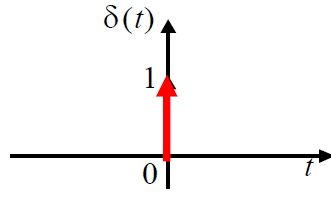

单位脉冲函数的定义
$$\delta(t) = \begin{cases} \infty & t=0 \\ 0 & t \neq 0 \end{cases}$$
且有
$$\int_{-\infty}^{+\infty} \delta(t) dt = 1$$
### 频谱
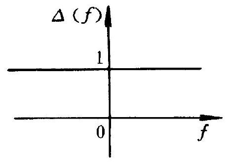

$\delta(t)$函数的频谱（即傅里叶变换）为
$$\Delta(f) = \int_{-\infty}^{+\infty} \delta(t) e^{-j2\pi ft} dt = e^0 = 1$$
因此$\delta(t)$ 的频谱是均匀谱，等强度，无限宽。
注：这里的频谱指的是幅频谱，因为这里傅里叶变换后始终为实数，所以相角一直是$0^\circ$。
如果需要画相频谱，那么就要找到每一个$f$值所对应的傅里叶变换后的$X(f)$的辐角主值并相连。
### 乘积性质
$$ x(t) \delta(t-t_0) = x(t_0) \delta(t-t_0)$$
$t\neq t_0$时，式子两边都是0；$t=t_0$时，两边显然相等。
这个式子的意思是：用 $x(t)$ 去乘以 $\delta(t-t_0)$，其效果等同于把 $x(t)$ 在 $t=t_0$ 时的值 $x(t_0)$（这是一个常数）**采样**出来，然后乘以 $\delta(t-t_0)$。
### 采样性质
由以上的乘积性质我们很容易得到
$$\int_{-\infty}^{+\infty}x(t)\delta(t-t_0)\mathrm{d}t = \int_{-\infty}^{+\infty}x(t_0)\delta(t-t_0)\mathrm{d}t = x(t_0)\int_{-\infty}^{+\infty}\delta(t-t_0)dt=x(t_0)$$
### 卷积性质
$$x(t)*\delta(t-t_0) = \int_{-\infty}^{+\infty}x(\tau)\delta(t-t_0-\tau)\mathrm{d}\tau = x(t-t_0)$$
## 常见函数的频谱
### 傅里叶变换的双边谱
同样的，对于实信号$x(t)$，傅里叶变换的双边谱也满足双边幅频谱为偶函数，而双边相频谱为奇函数。核心在于证明
$$X(-\omega) = X^*(\omega)$$
这里$X^*(\omega)$为$X(\omega)$的共轭。

$$X(-\omega) = \int^{+\infty}_{-\infty}x(t)e^{j\omega t}\mathrm{d}t$$
$$X^*(\omega) = \left( \int^{+\infty}_{-\infty}x(t)e^{-j\omega t}\mathrm{d}t\right)^* =  \int^{+\infty}_{-\infty}x(t)(e^{-j\omega t})^*\mathrm{d}t =  \int^{+\infty}_{-\infty}x(t)e^{j\omega t}\mathrm{d}t$$
得证。
从而有
$$|X(-\omega)|=|X^*(\omega)| = |X(\omega)|$$
可知双边幅频谱为偶函数
而
$$\angle X(\omega) = -\angle X^*(\omega) = -\angle X(-\omega)$$
可知双边相频谱为奇函数
### 矩形窗函数
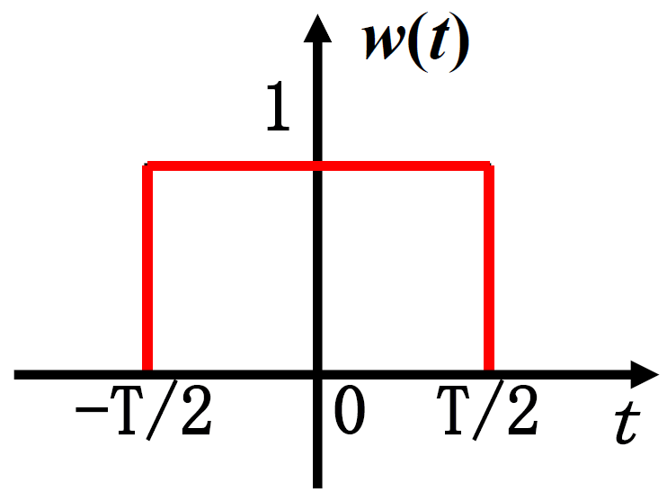

$$w(t) = \begin{cases} 1 & |t| \le T/2 \\ 0 & |t| > T/2 \end{cases}$$

其频谱为
$$w(t) \rightleftharpoons T \cdot \text{sinc}(\pi f T)$$

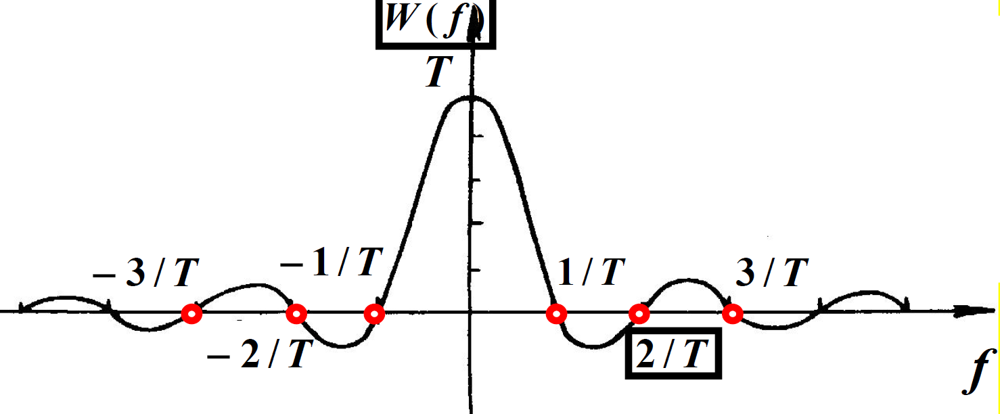

其中$\text{sinc}(x) = \dfrac{\sin x}{x}$

当$T\rightarrow +\infty$，矩形窗函数变为$x(t) = 1$
此时其频谱为
$$1 \rightleftharpoons \delta(f)$$
### 正弦函数
#### 傅里叶变换？（帮助理解，无需掌握）
我们曾经说过傅里叶变换用来处理非周期函数。但是什么我们又能对 $\sin(t)$ 这个周期函数进行傅里叶变换呢？**答案是：从严格的数学定义上讲，我们不能。**
傅里叶变换的定义是一个积分：$$X(f) = \int_{-\infty}^{+\infty} x(t) e^{-j2\pi ft} dt$$
这个积分能存在的（即“收敛”的）一个关键条件是，信号 $x(t)$ 必须是**绝对可积**的，即：$$\int_{-\infty}^{+\infty} |x(t)| dt < \infty$$

这代表信号的总能量或总面积是有限的。
但是
$$\int_{-\infty}^{+\infty} |\sin(2\pi f_0 t)| dt = \infty$$
照经典的傅里叶变换定义，像 $\sin(t)$, $\cos(t)$ 或常数 "1" 这样的永恒存在的周期信号，它们的傅里叶变换不存在。
为了实现一种方法来统一处理所有信号，工程师扩展了傅里叶变换的定义。傅里叶级数告诉我们 $\sin(t)$ 的所有能量集中在 $+f_0$ 和 $-f_0$ 这两个离散的频率点上（参见复指数的幅频图），其他所有频率的能量都是0。而傅里叶变换必须在一个连续的频率轴 $f$ 上来表达。因此只需引入$\delta(f-f_0)$ 这个函数，它在所有 $f \neq f_0$ 的地方都等于 0，只在 $f=f_0$ 这一个点上拥有所有的面积。这就可以描述了 $\sin(t)$ 的频谱。
#### 正弦函数的频谱
求函数$x(t) = \sin 2\pi f_0t$的频谱。
由欧拉公式
$$\sin 2\pi f_0 t = \dfrac{e^{j2\pi f_0 t}-e^{-j2\pi f_0 t} }{2j}$$
由频移性质可以得到
$$F(e^{j2\pi f_0 t}) = F(1 \cdot e^{j2\pi f_0 t}) = \delta(f-f_0),F(e^{-j2\pi f_0 t}) = F(1 \cdot e^{-j2\pi f_0 t}) = \delta(f+f_0)$$
即
$$F(\sin 2\pi f_0t ) = \dfrac{1}{2j}[\delta(f-f_0) - \delta(f+f_0)] = \dfrac{j}{2}[\delta(f+f_0) - \delta(f-f_0)]$$
结果为纯虚数，我们又可以引出实频谱和虚频谱的概念。原先的幅频谱明显不能表示复数，因此可以分为实频谱和虚频谱来表征信号实数部分和虚数部分的幅频。

  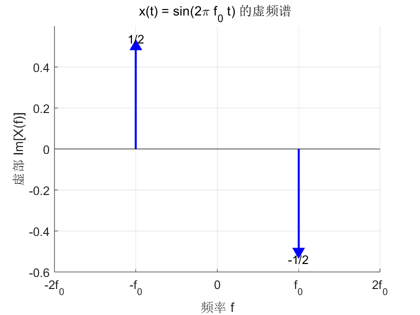
  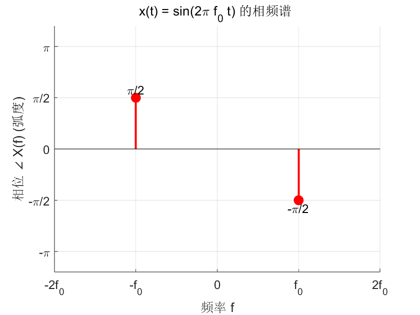

#### 余弦函数的频谱
$$\cos 2\pi f_0 t \rightleftharpoons \frac{1}{2} \left[ \delta(f + f_0) + \delta(f - f_0) \right]$$

## 随机信号及相关函数
### 均值
设$x(t)$的周期为$T_0$
$$\mu_x =\frac{1}{T_0} \int_0^{T_0} x(t) dt$$
### 绝对均值
设$x(t)$的周期为$T_0$
$$\mu_{|x|} =\frac{1}{T_0} \int_0^{T_0} |x(t)| dt$$
### 有效值
$$X_{rms} = \sqrt{\frac{1}{T_0} \int_0^{T_0} x^2(t) dt}$$
### 平均功率
$$P_{av} = \frac{1}{T_0} \int_0^{T_0} x^2(t) dt$$
### 相关系数
$$\rho_{xy} = \frac{E[(x-\mu_x)(y-\mu_y)]}{\sigma_x \sigma_y}$$
表示两个随机变量 $x$ 和 $y$ 的**线性**关联程度。$|\rho_{xy}| \le 1$。$|\rho_{xy}|=1$ 表示完全线性相关；$|\rho_{xy}|=0$ 表示线性无关。
### 自相关函数
描述信号在 $t$ 时刻和 $t+\tau$ 时刻的相似性。
$$  R_x(\tau) = E[x(t)x(t+\tau)] = \lim_{T\to\infty} \frac{1}{T} \int_0^T x(t) x(t+\tau) dt$$
#### 性质
1. $\mu_x^2 - \sigma_x^2 \le R_x(\tau) \le \mu_x^2 + \sigma_x^2$
2. 在 $\tau = 0$ 时最大 $R_x(0) = \lim_{T \to \infty} \frac{1}{T} \int_0^T x^2(t) dt = \psi_x^2$
3. $\lim_{\tau \to \infty} \rho_x(\tau) \to 0$ , $\lim_{\tau \to \infty} R_x(\tau) \to \mu_x^2$
4. 自相关函数为偶函数
5. 周期函数的自相关函数仍为同频周期函数
### 互相关函数
描述信号 $x(t)$ 和信号 $y(t)$ 在 $\tau$ 时移下的相似性。
$$  R_{xy}(\tau) = E[x(t)y(t+\tau)] = \lim_{T\to\infty} \frac{1}{T} \int_0^T x(t) y(t+\tau) dt$$
1. $\mu_x\mu_y - \sigma_x\sigma_y \le R_{xy}(\tau) \le \mu_x\mu_y + \sigma_x\sigma_y$
2. 同频相关不同频不相关
3. 互相关函数非偶函数、亦非奇函数
4. 互相关函数峰值不在 $\tau=0$ 处，其峰值偏离原点的位置反映了两个信号时移的大小。
### 自功率谱(维纳-辛钦定理)
信号的平均功率在频率上的分布密度。
$$ S_x(f) = \int_{-\infty}^{\infty} R_x(\tau) e^{-j2\pi f\tau} d\tau$$
### 互功率谱
$$  S_{xy}(f) = \int_{-\infty}^{\infty} R_{xy}(\tau) e^{-j2\pi f\tau} d\tau$$
### 相干函数
表示在 $f$ 频率上，输出 $y(t)$ 中有多大比例的功率是由输入 $x(t)$ 引起的。
$$  \gamma_{xy}^2(f) = \frac{|S_{xy}(f)|^2}{S_x(f) S_y(f)}$$
### Parseval公式
$$  \int_{-\infty}^{\infty} x^2(t) dt = \int_{-\infty}^{\infty} |X(f)|^2 df$$
### 广义 Parseval 公式
$$  \int_{-\infty}^{\infty} x_1(t) x_2(t) dt = \int_{-\infty}^{\infty} X_1(f) X_2(-f) df$$