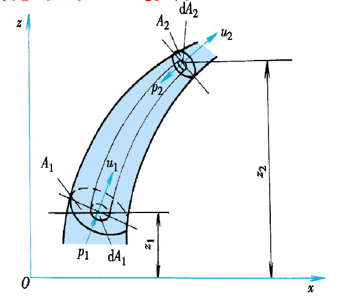
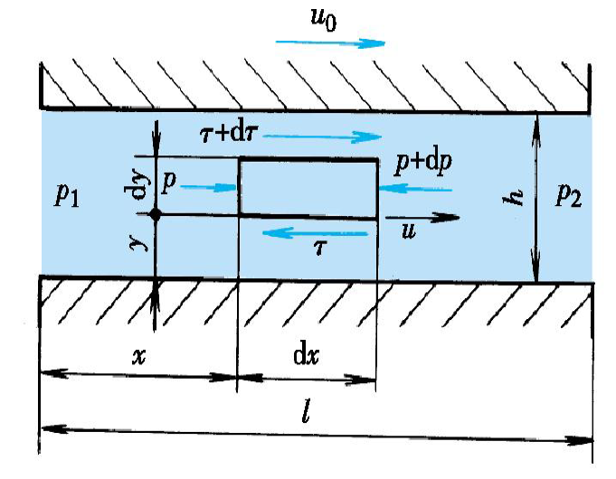
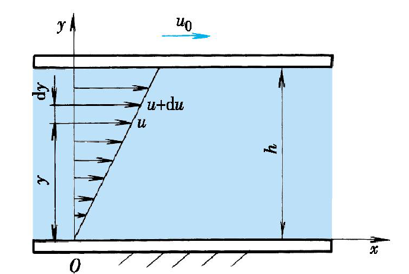

# 液压课程及考试事宜会议详细记录
## 一、流体力学公式相关
### （一）需重点掌握的公式
1. **薄壁小孔流量方程**
    - 核心地位：是节流控制的核心基础公式，后续节流阀、调速阀的相关原理及回路解释均基于此公式。
    - 应用场景：用于分析节流元件的流量特性，明确流量与阀口开度、前后压差等因素的关系。
$$q = C_d A_T\sqrt{\frac{2\Delta p}{\rho}}$$
2. **流量可压缩性方程**
    - 核心内容：清晰描述封闭容腔的压力变化率与进流量之间的关联规律。
    - 学习要求：需理解方程中各参数的物理意义，明确压力变化与进流量的相互影响机制。
$$K = \frac{1}{\kappa} = - \Delta p \cdot \frac{V_0}{\Delta V}$$
$K$为液体体积弹性模量，$\kappa$为液体压缩率（体积压缩系数）
压力为$p_0$时液体的体积为$V_0$，压力增加$\Delta p$，液体的体积减小$\Delta V$
封闭在容器内的液体在外力作用下的情况像一个弹簧，刚度为
$$k_h = \frac{A^2K}{V}$$

1. **伯努利方程**
    - 重要性：流体力学核心方程之一，应用广泛。
    - 关键应用：用于解释泵吸油过程中出现的气穴现象，可通过该方程理论计算泵吸入口的负压值，判断是否会发生气蚀；而气穴现象会导致泵工作不平稳、出现异常，严重影响元件运行可靠性。

$$\frac{p_1}{\rho g} + z_1 + \frac{\alpha_1 v_1^2}{2g} = \frac{p_2}{\rho g} + z_2 + \frac{\alpha_2 v_2^2}{2g} + h_w$$

其中$\alpha$为实际动能和按平均流速计算出的动能之比，即动能修正系数
$h_w$是平均能量损耗

1. **平行板流量公式**
    - 公式构成：包含压差流量和速度带来的流量两部分，形式不复杂。
    - 关联公式：掌握该公式后，可推导得出圆环缝隙流动的计算公式，二者核心逻辑一致。
    - 学习场景：作业题中常出现平行板缝隙流动相关题目，需结合公式灵活解题。

$$q = \frac{bh^3}{12\mu l} \Delta p + \frac{bh}{2} u_0$$
$\frac{bh^3}{12\mu l} \Delta p$：压力流项。
$b$：缝隙的宽度。
$h$：缝隙的高度（间隙距离）。
$\mu$：流体的动力粘度。
$l$：缝隙的长度。
$\Delta p$：缝隙两端的压力差。
第二项 $\frac{bh}{2} u_0$：剪切流项。
$u_0$：其中一个平板相对于另一个平板的运动速度。
$b=\pi D$即为圆环缝隙流动的计算公式。

1. **雷诺数公式**
    - 学习重点：需明确雷诺数与相关物理量的正反比关系，理解其对流体流动状态的影响。
    - 应用价值：是判断流体流动是层流还是湍流的关键依据，后续分析管道流动等内容时会用到。

$$R_e = \frac{vd}{\nu}$$
- 管内的平均流速$v$
- 管径$d$
- 液体的运动粘度$\nu$

临界雷诺数$R_{e_{cr}}=2320$，$R_e<2300$为层流
层流时动能修正系数$\alpha = 2$
可以判断沿程阻力系数：
$$\lambda = 
\begin{cases} 
\dfrac{75}{Re} & \text{（适用于液压油）} \\ \\
\dfrac{64}{Re} & \text{（适用于水）} 
\end{cases}$$

损失分为以下两块
- 沿程压力损失
$$\Delta p_\lambda = \lambda \frac{l}{d} \frac{\rho v^2}{2}$$
- 局部压力损失
$$\Delta p_{\zeta} = \zeta \frac{\rho v^2}{2}$$

1. 牛顿内摩擦定律
$$F  = A\mu \frac{\text{d}u}{\text{d}y}$$
### （二）无需刻意记忆的公式
管道损失相关公式无需重点记忆，因其包含较多通过实验测得的系数，属于工程应用类公式，实际考试和应用中可结合具体场景参考相关资料。

## 二、液压泵和马达章节
### （一）核心计算内容
1. 需熟练掌握的参数计算：排量、压力、转速、流量、机械效率、容积效率、总效率。
2. 关键关联关系：
    - 排量与流量、转速的关联逻辑，明确三者之间的计算公式推导。
    - 排量与压力、转矩的对应关系，掌握相关换算方法。
3. 效率计算要点：
    - 机械效率、容积效率的定义需精准理解，且所有效率定义均满足小于等于1的原则，可依据该原则判断效率计算公式中分子分母的取值。
    - 泵和马达的效率计算公式存在差异，尤其是马达效率在公式中的分子分母位置可能变化，需重点区分。

### （二）各类泵的核心知识点
1. **齿轮泵**
    - 基本原理：需掌握油液流动方向与齿轮转向的对应关系，明确吸油口和出油口的位置判断方法。
    - 流量调节特性：原则上普通齿轮泵无法调节流量。
2. **柱塞泵**
    - 泄漏位置：需清楚其主要泄漏部位，这对理解泵的容积效率至关重要。
    - 排量调节：掌握轴向柱塞泵和径向柱塞泵的排量调节方式，柱塞泵具备良好的流量调节能力。
3. **叶片泵**
    - 分类及原理：区分单作用式和双作用式叶片泵的工作原理，明确单作用式可调节流量，双作用式无法调节流量。
    - 单作用式调节方式：需理解其通过改变偏心距等方式实现排量和流量调节的机制。
4. **限压式变量泵**
    - 重要性：与后续容积节流调速回路密切相关，是泵章节中需重点掌握特性的泵型。
    - 工作原理：需掌握其压力-流量特性曲线的两段特征，第一段为恒流量区，第二段为恒功率区。
    - 命名原因：当系统压力达到设定值后，泵的排量会自动减小，从而限制系统压力继续升高，因此称为限压式变量泵。

### （三）参数对效率的影响（定性要求）
1. 粘度影响：粘度增加时，机械效率会上升（需结合流体摩擦阻力变化逻辑理解）。
2. 转速影响：转速升高时，容积效率会增加（需考虑泄漏量与转速的关联关系）。
3. 学习要求：无需掌握定量计算，只需明确上述定性结论，该部分知识在教材中梳理较少，但在实际工程应用中意义重大。

## 三、液压缸章节
### （一）核心计算内容
1. 基础计算：流量、速度、力、负载力的计算是重点，需熟练掌握相关计算公式。
2. 稳态关系分析：明确稳态情况下，流量、速度、压力、负载力之间的内在关联，能根据已知参数推导未知参数。

### （二）关键回路知识
1. 差动回路：需深入理解差动回路的工作原理，明确其与后续复杂回路的关联，掌握差动连接时液压缸的运动特性。
2. 结构学习要求：对液压缸本身的结构仅需简单了解，因其偏工程化，且不适宜作为考题重点，考试核心集中在计算和回路关联知识点。

## 四、辅助装置
### （一）蓄能器
1. 核心公式：压力和流量的计算依据气体状态方程，需理解方程在蓄能器中的具体应用场景。
2. 皮囊式蓄能器：
    - 结构认知：需清楚其基本构造和工作原理。
    - 计算要求：掌握其在不同压力、体积下的相关计算方法，这是辅助装置中唯一涉及计算的重点内容。

### （二）其他附件
过滤器、热交换器等附件仅需简单了解其功能和基本应用场景，无需深入掌握结构和复杂原理，考试中涉及较少。

## 五、阀类相关知识
### （一）压力阀
1. 主要类型：重点掌握溢流阀和减压阀，压力继电器因本质类似传感器，无需重点深入。
2. 工作原理：
    - 需分别理解直动式和先导式溢流阀、减压阀的结构和工作机制。
    - 压力-流量特性：明确溢流阀流量增加时压力升高，减压阀流量增加时压力降低的规律，并理解背后的原理（如阀芯受力平衡变化等）。

### （二）方向阀
1. 几位几通识别：需熟练识别3位4通、两位3通、两位4通、两位两通等常见方向阀类型，明确“位”和“通”的定义。
2. 电磁阀相关：
    - 基本认知：电磁阀属于电机转换器，开关电磁阀输入电信号后阀芯直接到位；比例电磁阀输出电磁力与输入电流成正比。
    - 默认位置判断：两侧均有电磁阀时，默认位置为两侧均不通电；单个电磁阀时，默认位置为弹簧侧。
3. 中位机能：重点掌握O型、H型、Y型、M型四种常用中位机能，明确每种机能的通断特点（如M型P和T通、A和B不通），这对后续回路分析至关重要。
4. 液动力分析：
    - 稳态液动力：无需记忆公式，需明确其方向始终促使阀口关闭，对系统有阻尼作用，能促使阀芯稳定，会加大电磁铁驱动力，且需掌握其方向判断方法。
    - 瞬态液动力：无需记忆公式，需知道其方向与阀的移动方向（打开或关闭）相关，需学会结合具体场景分析方向。

### （三）流量阀
1. 节流阀：
    - 特性：流量与阀口开度、前后压差相关，遵循薄壁小孔流量方程，压差会随负载变化而变化。
    - 学习要求：掌握其基本特性，能结合公式分析流量变化规律。
2. 调速阀：
    - 分类及结构：两通调速阀由定差减压阀与节流阀串联组成，三通调速阀由定差溢流阀与节流阀并联组成，需能从原理符号上识别，并理解其连接方式。
    - 核心特性：阀口开度一定时，流量基本保持稳定，需理解其实现流量稳定的机理（如定差减压阀的压力补偿作用）。
    - 学习重点：结合阀芯运动和阀的配合关系，理解两通调速阀（定差减压阀在前、节流阀在后）和三通调速阀的工作过程，掌握其符号、原理和特性。
3. 流量稳定机理：溢流阀、减压阀、调速阀等能保持压力或流量稳定的核心机理是弹簧预压缩量大（通常10-20毫米），阀芯实际移动量（1-2毫米）相对较小，因此弹簧总力变化不大，可维持压力或流量稳定。

### （四）电液比例阀和电液伺服阀
1. 电液比例阀：
    - 比例电磁铁：核心特性是输出推力与输入电流成正比，可使阀芯停在任意位置，与开关电磁铁（仅实现开关动作）有本质区别。
    - 分类及原理：分为比例方向阀、比例流量阀、比例压力阀，本质是将普通阀的手动弹簧调节改为电比例调节（如比例溢流阀、比例减压阀是替换了原弹簧结构）。
    - 比例方向阀：重点掌握其概念，可同时调节方向和流量，是三位四通电磁换向阀的连续版本，阀芯可在正负全开之间任意位置调节，正负方向对应不同的流体流动方向。
2. 电液伺服阀：
    - 典型结构：需掌握以力矩马达和喷嘴挡板为主阀（滑阀）的伺服阀结构和原理。
    - 力矩马达：属于电机转换器，输入电信号与驱动转矩成正比。
    - 学习要求：了解喷嘴挡板的工作原理，无需记忆复杂公式和系数（如增益系数），重点理解负载流量、负载压力与阀芯开度的关系，知道其特性曲线与进口节流、出口节流等回路的速度-刚度曲线相关联，需掌握第一、三象限的曲线特征。

## 六、调速回路章节
### （一）回路分类及核心特征
1. 节流调速回路：系统效率低，但调速特性好。
2. 容积调速回路：系统响应慢，节流少（部分无节流），效率高。
3. 容积节流调速回路：结合前两者特点，结构更复杂，是考试和学习的重点难点。

### （二）节流调速回路
1. 具体类型：包括进口节流、出口节流、进出口同时节流三种。
2. 进口节流调速回路：
    - 分析基础：所有分析基于稳态分析，无需记忆推导公式和最终结论公式。
    - 核心要求：掌握VF曲线（y轴为负载速度，x轴为负载力）的形状（先缓慢下降，后快速下降），理解回路刚度的定义、物理意义及判断方法（刚度大表示负载力变化时速度变化小）。
3. 出口节流调速回路：推导过程与进口节流类似，VF曲线特征与进口节流相反（负载力增加时速度下降趋势不同）。
4. 调速优化：将普通节流阀替换为调速阀后，VF曲线变为水平，即负载力增加时负载速度基本不变，显著改善回路速度刚度。
5. 定压与变压系统判断：
    - 核心原则：负载速度和负载力均为变化量；溢流阀溢流时，系统压力稳定，为定压系统；溢流阀不溢流（作为安全阀）时，系统压力变化，为变压系统。
    - 应用场景：进口节流、出口节流、旁路节流回路均需按此原则判断系统类型。

### （三）容积调速回路
1. 泵缸式回路：
    - 机械特性：VF曲线为直线，负载力增加时速度下降。
    - 调节方式：通过调节泵的排量实现油缸速度和位置调节。
    - 系统类型判断：通常无节流阀，可能有溢流阀（安全阀），系统压力随负载变化，多为变压系统。
    - 流量关系：泵的流量通过调节排量适应负载流量变化。
2. 泵马达式回路：
    - 分类：变量泵驱动定量马达、定量泵驱动变量马达、双变量（变量泵驱动变量马达）三种。
    - 调节特征：
        - 变量泵驱动定量马达：泵排量增加，马达速度升高。
        - 定量泵驱动变量马达：马达排量增加，速度下降；排量减小，速度上升，但转矩下降。
        - 双变量系统：工程中常用调节方式为，先将马达排量调至最大，再将泵排量从0调至最大（速度缓慢上升）；泵排量最大后，减小马达排量（速度进一步上升，转矩下降）。
    - 核心要求：该回路又称静压传动系统，需结合泵和马达的效率（容积效率、机械效率、总效率）计算回路效率，掌握输入功率、输出功率的计算方法，明确输入轴转速、转矩与泵压力、流量的关联关系。

### （四）容积节流调速回路
1. 核心特点：同时调节阀的开度和泵的排量，结合节流调速和容积调速的优势，结构最复杂。
2. 系统类型判断：仍依据负载速度、负载力变化及溢流阀工作状态（是否溢流）判断定压或变压系统。
3. 分类及要求：分为普通节流调速和采用调速阀（压力补偿）的调速回路，需掌握原理分析和相关计算（如压力、流量、效率计算），该部分是课程难点，需结合作业题强化练习。
4. 知识关联：整合泵、阀、缸、效率计算等所有前期知识，需先掌握原理，再通过作业题巩固计算能力。

## 七、基本回路章节
### （一）回路动作分析
1. 核心要求：
    - 已知系统状态，能判断电磁阀的通断情况（哪个电磁铁通电）。
    - 已知电磁阀通电顺序，能分析系统运行状态（如快速进给、慢速攻进、回退等）。
2. 学习方法：结合教材中机床相关实例，掌握功能回路与进口节流、出口节流、进出口同时节流回路的串联逻辑，重点练习作业题中类似场景的分析。

### （二）液压符号识别（核心基础）
1. 重要性：无法识别液压符号则无法判断元件类型和功能，后续回路分析无从谈起。
2. 重点符号区分：
    - 减压阀与溢流阀：符号相似，需注意进口、出口引线及中间箭头位置的差异。
    - 泵与马达：圆圈内三角形方向表示液流方向（向外为泵，向内为马达）；符号上有斜箭头表示变量，无则为定量。
    - 电磁铁：矩形内加斜杠为电磁铁符号；无斜箭头为开关电磁铁，有斜箭头为比例电磁铁。
    - 弹簧：带箭头表示可手动调节。
    - 液控单向阀：需识别液控口位置，明确其正常单向流通和双向流通的工作条件（如液压锁回路中，液控口接对方回路，实现双向锁紧）。
3. 参考资料：教材附录D（285-286页）包含常用液压传动图形符号，需结合元件原理和功能记忆（无需记忆所有符号，重点掌握课程涉及的元件符号）。