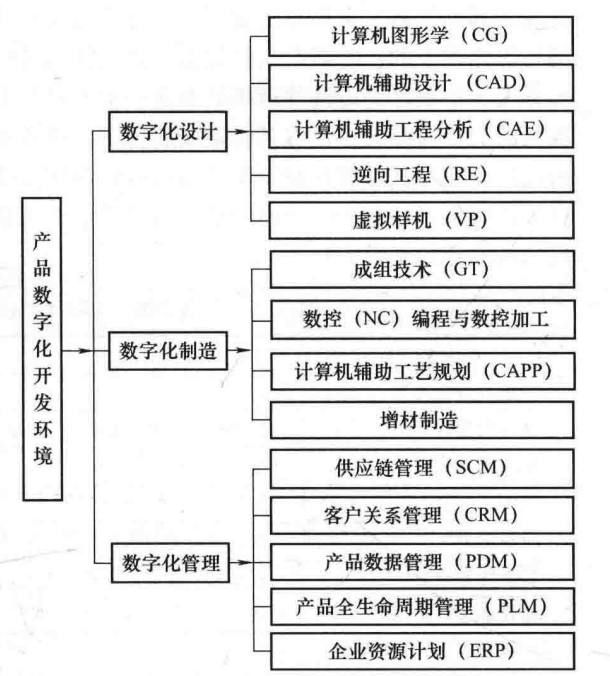
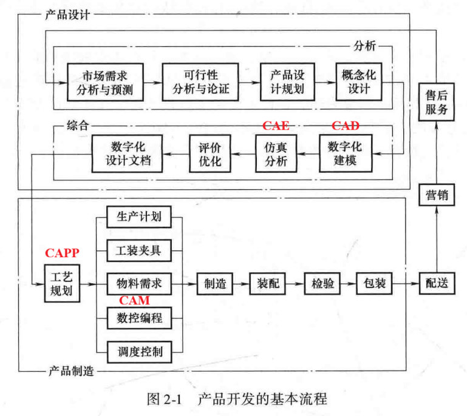
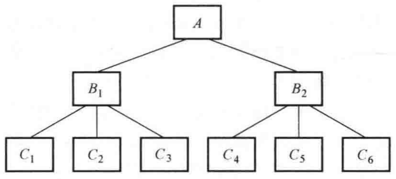
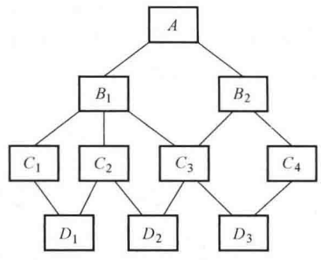
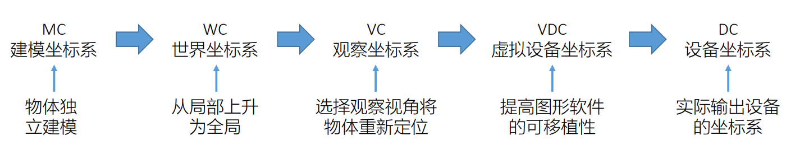
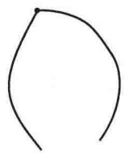
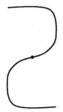
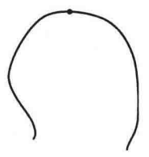

# 计算机辅助设计与制造
## 第一章 绪论
### 历年题导航
- 名词解释：PLM CAPP CAE
- 用图的形式叙述产品开发流程，并指出计算机辅助设计制造（CAD/CAM/CAE等）在环节中的应用 
### 名词解释
|缩写|全称|翻译|
|:-:|:-:|:-:|
|CG|Computer Graphics|计算机图形学|
|CAD|Computer Aided Design|计算机辅助设计|
|*CAE*|*Computer Aided Engineering*|*计算机辅助工程分析*|
|FEM|Finite Elements Method|有限元方法|
|VR|Virtual Reality|虚拟现实|
|VP|Virtual Prototype|虚拟样机|
|RE|Reverse Engineering|逆向工程|
|CAM|Computer Aided Manufacturing|计算机辅助制造|
|GT|Group Technology|成组技术|
|NC|Numerical Control|数字控制|
|PLC|Programmable Logic Controller|可编程序逻辑控制器|
|RPM|Rapid Prototyping Manufacturing|快速原型制造|
|AM|Additive Manufacturing|增材制造|
|*CAPP*|*Computer Aided Process Planning*|*计算机辅助工艺规划*|
|CRM|Customer Relationship Management|客户关系管理|
|PDM|Product Data Management|产品数据管理|
|*PLM*|*Product Lifecycle Management*|*产品全生命周期管理*|
|ERP|Enterprise Resource Planning|企业资源计划|
|MES|Manufacturing Execution System|制造执行系统|
|SCM|Supply Chain Management|供应链管理|
### 产品数字化开发环境及其学科体系

### *产品开发的基本流程*

### PLM系统的意义
CAD、CAE、CAPP和CAM系统的数据模型彼此不相容，出现信息中断。这导致企业资源不能有效共享，生产过程中文件不能有效管理。PLM系统是最好的CAx/ERP集成平台。
### 课后题 
阐述数字化设计、数字化仿真、数字化制造和数字化管理等技术在产品开发中的功能与作用,分析它们之间的相互关系。

#### 功能与作用
|技术|功能|作用|
|:-:|:-|:-|
|数字化设计|以新产品设计为目标,利用计算机软硬件进行概念化设计、几何造型、数字化装配。广义的数字化设计包括数字化仿真。|它是产品开发的起点,负责生成工程图及相关设计文档,确立产品的数字化定义(包括形状、尺寸、材料属性等),为后续环节提供唯一的数据源。|
|数字化仿真|属于计算机辅助工程分析(CAE)范畴,以数字化模型为基础,利用有限元分析(FEM)等方法模拟产品的未来性能。|在实物制造前对产品的静力学、动力学、流体力学等性能进行预测、评估和优化。它能尽早发现设计缺陷,减少昂贵的物理样机试验次数,从而缩短周期并提高可靠性。|
|数字化制造|以工艺规划和过程控制为核心,包含数控(NC)编程、CAPP(计算机辅助工艺规划)及增材制造(3D打印)等。|将数字化的设计意图转化为实物。它通过直接控制生产装备实现零部件的数字化加工、质量检测和装配,是实现产品从虚到实的关键转化环节。|
|数字化管理|涵盖PDM(产品数据管理)、PLM(产品全生命周期管理)、ERP(企业资源计划)等系统。|实现管理信息和管理方式的数字化。它负责整合订单、供应链、库存、人力和财务等环节,提高管理效率,降低生产成本,并确保数据在跨部门、跨地域流转时的准确性和一致性。|
#### 相互关系

1. 信息流动的递进关系: 数字化设计产生的模型是数字化仿真的基础,也是数字化制造的输入源。只有经过数字化制造,设计的模型信息才能被充分利用并转化为产品。
2. 仿真对设计的反馈优化关系: 仿真结果会直接反馈给设计环节,通过不断修改拓扑结构、材料配置等参数,实现设计方案的闭环优化。
3. 设计与制造的双向耦合关系: 一方面,设计人员在建模时需要考虑制造的难易程度和成本,体现可制造性设计; 另一方面,制造过程中发现的工艺问题或不合理之处,也会及时反馈给设计端进行方案调整。
4. 数字化管理的支撑与统领关系: 数字化管理如PDM、PLM等系统起到底座和粘合剂的作用,通过统一数据库和流程管理连接设计、仿真、制造等环节,消除信息孤岛,确保各部门在同一套最新数据下协同工作。
5. 面向全生命周期的集成关系: 随着技术发展,数字化设计、仿真、制造和管理逐步由单元应用走向集成应用,并借助网络技术与数据交换标准实现跨平台、跨阶段的信息贯通,共同构成完整的产品数字化开发环境。

## 第二章 工程数据和图形处理技术
### 历年题导航
- 名词解释：消隐
- 都有哪些坐标系，它们之间是如何转换的，如何实现从三维模型到二维图 
- 什么是齐次坐标表示法，它有什么优点
### 工程数据的类型
数表与线图。相比数表，线图不仅能表示设计参数之间的函数关系,还能够直观地反映数据的变化趋势,具有形象、生动等特点。
### 工程数据的数字化处理方法

|处理方法|说明|
|:-:|:-|
|工程数据的文件化处理|先将数据以一定的次序存储在数据文件中,之后再编制数表处理程序。|
|简单数表的程序化处理|以数组形式记录数表数据,程序运行时输入自变量,通过循环查得该自变量对应的数组下标,从而得到对应的函数值。|
|线图的表格化处理|在线图的横坐标上取一系列离散点,得到对应线图上的函数值,由此可将线图离散成一个数表。|
|列表函数数表的插值处理|不仅需要查询与自变量对应的因变量数据,还需要查询各自变量在节点区间内的对应值,通常需要采用插值方法。|
|线图的公式化处理|若是直线线图,可直接将其转化为线性方程并求得函数值; 若是曲线线图,可采用曲线拟合的方法求出线图曲线的经验公式。|
|数据库处理|将数表及经离散化处理的线图数据存储于数据库中,系统程序可直接访问数据库,数据更新方便。|
### 数据库技术
#### 数据模型

|模型名称|特点|图|
|:-:|:-|:-:|
|层次模型|层次模型中的数据元素之间是“一对一”或“一对多”的关系。它的特点是层次结构清晰、联系简单,在查询数据时只能从顶层逐层往下查询,不能倒查,也不能从中间插入。||
|网络模型|与层次模型相比,网络模型可以表示“多对多”的关系。该模型的每个节点可以与多个父节点相联系,整个网络也可以有多个根节点。||
|关系模型|是一种用表格数据来表示实体之间联系的数据模型。|/|

### 坐标系
#### 分类
|坐标系|含义|
|:-:|:-:|
|世界坐标系|用于描述现实世界的整体布局，即各种对象在所描述世界中的定位。|
|建模坐标系|用于描述世界坐标系中每个具体物体的形状，每个物体均由其自身的建模坐标系定义。|
|观察坐标系|由投影方式决定，通常采用透视投影和平行投影两种方式。|
|设备坐标系|用于在显示设备上定义位置，不同图形设备的设备坐标系可能不同，因此相同显示位置可能对应不同的二维坐标值。|
|虚拟设备坐标系|只存在于图形程序员的定义中，参照该坐标系指定的点无论设备类型如何，都会占据显示设备上相同的位置。|
#### 转换关系

#### 三维模型到二维图

### 齐次坐标表示法
由 $n+1$ 维向量表示一个 $n$ 维向量。

#### 优点
1. 提供了用矩阵运算把二维、三维甚至高维空间中的一个点集从一个坐标系变换到另一个坐标系的有效方法。
2. 可以表示无穷远点：在 $n+1$ 维中，当 $h=0$ 时，齐次坐标实际上表示了一个 $n$ 维的无穷远点。对于二维齐次坐标 $[a,b,h]$，当 $h$ 趋向 $0$ 时，表示直线 $ax+by=0$，即在直线上的连续点逐渐趋于无穷远。
### 几何形体渲染技术
#### 消隐
消隐是指在将三维实体投影至二维平面的过程中，为了消除因深度信息缺失而导致的图形二义性，通过剔除从特定视角观察时被遮挡的不可见线、面，从而实现物体真实感显示的计算机图形处理技术。
##### 主要算法

|算法|思路|缺陷|
|:-:|:-|:-:|
|背面消除法|通过判断物体表面的法向量方向来决定其可见性。如果一个面外部方向的法向量指向观察者，该面即为可见；否则不可见。|仅适用于单个凸对象。对于凹面对象或多个重叠的凸对象，指向观察者的面可能被其他面遮挡。|
|Z缓冲区算法|在像素级别比较不同表面的深度|/| 
|画家算法（深度排序法）|对象的表面按距离查看者的距离进行排序，并从最远的面到最近的面填充它们各自的颜色。如果较远的曲面必须占据屏幕中的相同区域，则它们会被较近的曲面自动隐藏。|难以处理多边形相互交叉或重叠的复杂情况 。| 
|扫描线法|/|/| 

##### 原理补充（补天可跳，仅帮助理解）
|比较维度|画家算法|Z缓冲区算法|
|:-:|:-|:-|
|原理|在渲染开始前，先对场景中所有的多边形按 $Z_v$ 坐标进行全局排序。排好序后，从最远的面开始，一个面一个面地往屏幕上“刷漆” 。|每当有一个像素要画到屏幕上时，系统会检查该像素的深度 $z$ 是否比当前缓冲区里记录的 depth(x, y) 更近；如果是，就替换掉它 。|
|是否需要排序|必须排序。需要提前对所有面进行深度排序。|无需排序。物体可以以任何顺序输入。|
|内存开销|较低。只需存储排序后的列表。|较高。需要额外的Z缓冲区存储空间来记录每个像素的深度。|
|处理复杂情况|无法处理多边形相互穿插或循环遮挡的问题。|可以正确处理复杂遮挡关系。因为它是像素级比较,即使面与面交叉也能正确显示。|
|核心公式|比较物体间的 $Z_0$ 坐标。|若当前像素深度值大于缓冲区中已存深度值,则更新该像素颜色和深度值。|
#### 光照/着色
##### 定义
是在计算机中模拟光照射到物体表面产生的反射或投射现象的渲染方法。
##### 计算机图形学中的基本光照模型
在模拟物体表面的亮度时，我们将物体反射出来的光简化为镜面反射和漫反射的叠加。漫反射用Lamber余弦定律计算，镜面反射用Phong模型计算。更进一步的，ppt中还给出了综合考虑环境光、镜面反射和漫反射的公式：
$$I = K_d I_a + \frac{E_p}{D + D_0} [K_d(N \cdot L) + K_s(V \cdot R)^n]$$
#### 纹理处理
##### 定义
将数字化的纹理图案覆盖或投射到物体表面,以增加物体表面细节的过程。
## 第三章 曲线、曲面的表示和建模
### 历年题导航
- 名词解释：插值，函数逼近
- C1连续和G1连续的含义，他们之间有什么异同点，有什么联系 
- 曲线曲面的点可以分为哪几种类型，它们各有什么作用 
- 求Hermite三次插值样条
### 分类

|分类|含义|
|:-:|:-|
|规则曲线和规则曲面|可以用数学方程式表示。|
|自由曲线和自由曲面|难以用数学方程式表示。|

### 曲线与曲面上的点
|名称|作用|
|:-:|:-:|
|控制点|用来确定曲线和曲面的位置与形状，但相应曲线和曲面不一定经过该点。|
|型值点|用来确定曲线和曲面的位置与形状，相应曲线和曲面一定要经过该点。|
|插值点|为提高曲线和曲面的输出精度，在型值点之间插入的一系列点。|
### 曲线、曲面设计相关术语
|名词|意义|
|:-:|:-:|
|逼近|用低次函数来定义和控制曲线或曲面，使曲线曲面在某种程度上尽量靠近所有型值点。|
|插值|构造一个函数严格地依次通过全部的点，且满足光顺要求。|
|拟合|误差在某种意义上最小。|
|光滑|曲线曲面在切矢量上的连续性或曲率的连续性。|
|光顺|曲线的拐点不能太多。口诀：顺拐|
### 曲线与曲面的表示
#### 非参数表示
非参数表示分为显式方程和隐式方程。
##### 显式方程
类似$y=f(x)$，给定一个$x$值，只能得到一个$y$值和一个$z$值，而不能对应多个$y$值或$z$值。
二维直线的显式方程$y=kx+b$
##### 隐式方程
类似$f(x,y,z)=0$，隐式方程中只规定了各坐标变量之间的关系，而不要求变量之间必须是一对一的，或是多对一的。
二维直线的隐式方程$Ax+By+C=0$
#### 参数表示
设参数为 $t$，则三维空间曲线的参数方程一般形式是：
$$\begin{cases}
x = x(t), \\
y = y(t), & t \in [a, b] \\
z = z(t),
\end{cases}$$
二维直线的参数方程$$\begin{cases}
x = x_0 + at \\
y = y_0 + bt
\end{cases}$$
一般地,将隐式方程转化为参
数方程称为**参数化**,而将参数方程转化为隐式方程称为**隐式化**

#### 知识补充（补天可跳）
计算机图形学中通常不再使用 $y = f(x)$ 来描述形状，而是使用参数方程。

在 $y = f(x)$ 中，导数 $\frac{dy}{dx}$ 算出来是一个单一的数值。它只告诉我们一种比例关系：如果 $x$ 前进 1 个单位，$y$ 随之上升或下降多少。

在参数方程中，曲线被描述为一个随参数 $u$（通常 $u \in [0, 1]$）变化的坐标点 $P(u) = [x(u), y(u), z(u)]$。你可以把 $u$ 想象成时间，把曲线想象成一个质点的飞行轨迹。对 $P(u)$ 求导，得到的是 $P'(u) = [x'(u), y'(u), z'(u)]$。这个结果是一个矢量（不仅有方向，还有大小），它在物理意义上相当于质点在这一瞬间的瞬时速度矢量。

在二维平面中，切矢量的纵向分量 $y'(u)$ 除以横向分量 $x'(u)$，刚好抵消了参数 $u$，算出来的就是斜率 $k = \frac{dy}{dx} = \frac{y'(u)}{x'(u)} = \tan\alpha$。也就是说，斜率仅仅是切矢量各个分量之间的一个比值。

切矢量的长度 $|P'(u)|$ 代表了曲线在此处的参数化“速度”。即使两条曲线在空间里的形状一模一样，如果它们的参数化方式不同（比如一个画得快，一个画得慢），它们在同一点的切矢量方向相同，但长度会不同。在工业设计建模（如扫掠、放样）时，切矢量的长度会直接影响曲面内部的张力和过渡的饱满程度。

当曲线出现垂直于 $x$ 轴的切线时，由于 $\Delta x = 0$，斜率 $k$ 会变成无穷大，这会导致计算机程序直接崩溃。而切矢量在这里依然是一个健康的坐标（例如 $[0, 1, 0]$），非常适合计算机进行矩阵运算。
#### 参数表示的优点
- 与坐标系无关
- 参数方程对变量个数不限
- 参数化方程可以更自由地控制曲线、曲面的形状
- 有利于减少计算量。
- 便于处理斜率为无限大的问题
#### 插值
##### 样条函数
用于插值和逼近的函数
##### 线性插值
对于一维列表函数数表，过两个相邻数据节点 $(x_i, y_j)$ 和 $(x_{i+1}, y_{j+1})$ 作一直线方程 $y = F(x)$ 代替原来的函数 $f(x)$
##### 抛物线插值
在列表函数数表中选取三个点 $(x_{i-1}, y_{j-1})$、$(x_i, y_j)$、$(x_{i+1}, y_{j+1})$，过三个点作抛物线方程 $y = F(x)$ 代替原来的函数 $f(x)$
##### 拉格朗日插值
对于给定的 $n+1$ 个点矢量 $\underline{P}_i$ 和对应的参数 $t_i$ ($i=0, \dots, n$)，拉格朗日插值参数化曲线公式为：$$\underline{P}(t) = \sum_{i=0}^{n} L_i^n(t) \underline{P}_i $$

拉格朗日插值基函数 $L_i^n(t)$ 的定义如下：$$L_i^n(t) = \prod_{j=0, j \neq i}^n \frac{t - t_j}{t_i - t_j} $$
##### Hermite 三次插值样条
若已知对于某曲线$y=f(x)$，有$$f(0)=R_1,f(1)=R_2,f'(0)=P_1,f'(1)=P_2$$

则设对该曲线的Hermite 三次插值样条为$f(u)=a_0+a_1u+a_2u^2+a_3u^3$
有$$\begin{cases}
f(0)=a_0=R_1, \\
f(1)=a_0+a_1+a_2+a_3=R_2 \\
f'(0)=a_1 = P_1,\\
f'(1)=3a_3+2a_2+a_1=P_2
\end{cases}$$
解该方程组即可得到
$$f(u)=R_1+P_1u+(-3R_1+3R_2-2P_1-P_2)u^2+(2R_1-2R_2+P_1+P_2)u^3$$
#### 常用的参数化曲线
##### Bezier 曲线

**优点：**
1. 端点插值：曲线严格通过第一个和最后一个控制点 。
2. 显式切线：起点和终点的切线方向分别与特征多边形的第一条边和最后一条边一致。
3. 凸包性：曲线始终位于控制多边形的凸包之内 。
4. 控制点有几何意义：如图。
5. 仿射不变性：对控制点进行平移、旋转、缩放等变换后，得到的曲线与先生成曲线再进行相同变换的结果是一致的。
6. 对称性：如果你把控制点的顺序完全颠倒（以最后一个点作为开始），生成的曲线轨迹是完全重合的 。

缺点：
1. 需要显式定义平滑连接：改变贝塞尔曲线中任何一个控制点的位置，整条曲线的形状都会发生变化，无法进行局部修改。因此贝塞尔曲线在处理复杂形状时，通常需要将多段曲线首尾相连。为了保证连接处是平滑的（即切矢量或曲率连续），必须人为地、显式地去计算并约束相邻曲线段的控制点位置 。
2. 当点数较多时，多项式次数过高会导致难以控制形状。
##### B-样条曲线

优点：

1. 局部修改性：移动一个控制点只影响曲线的一部分（受 $k$ 个点影响的特定段），这使得复杂形状的微调变得容易 。
2. 凸包性
3. 对称性
##### NURBS曲线（非均匀有理B样条曲线）
优点：

1. 加权：权重可以理解为控制点对曲线的“引力”大小。当某个控制点的权重增大时，曲线会被强烈地拉向该点权重越小，该点对曲线的影响越弱，曲线会远离该点，变得更“平缓” 。
2. 变动减小性：任何平面与曲线相交的次数最多与它与控制多边形相交的次数相同
3. 仿射不变性
4. **圆锥形截面可精确表示**，这是其他两者做不到的
##### 联系

**演进逻辑：**
- 为了解决 Bezier 曲线无法局部修改的问题，演化出了分段表示的 B样条。
- 为了在统一的数学框架内精确表达圆锥截面（解析几何形状），演化出了有理化的 NURBS。

**数学逻辑：**
- 从 Bezier 到 B样条：当 B样条曲线只有一个分段且节点向量仅包含端点时，它就退化为 Bezier 曲线。
- 从 B样条 到 NURBS：当 NURBS 曲线的所有权重因子 $W_i = 1$ 时，它就变成了非有理的 B样条曲线。
- 通用性：NURBS 是最通用的表达方式，它可以统一表达所有的解析曲线（如圆、直线）和自由曲线（如 Bezier）。
#### 常用的参数化曲面 
张量积曲面、双线性曲面、双三次曲面、Bezier 曲面、B-样条曲面
### 曲线连续性
#### 参数连续性
|符号|含义|解释|图|
|:-:|:-:|:-:|:-:|
|$C^0$|零阶参数连续性|指两条曲线段在其交点处的坐标值相等||
|$C^1$|一阶参数连续性|指两条曲线段在其交点处有相同的一阶导数，即切矢量方向相同、大小相等。||
|$C^2$|二阶参数连续性|指两条曲线段在其交点处的一阶和二阶导数的方向相同、大小相等。||
#### 几何连续性
|符号|含义|解释|
|:-:|:-:|:-:|
|$G^0$|零阶几何连续性|与零阶参数连续性相同，即两条曲线段在交点处有相同的坐标值。|
|$G^1$|一阶几何连续性|指两条曲线段在交点处的切矢量方向相同，但大小不等。|
|$G^2$|二阶几何连续性|指两条曲线段在交点处的一阶、二阶导数的方向相同，但大小不等。|
#### 参数连续性和几何连续性之间的关系与异同点
##### 关系
$C^1$连续必能保证$G^1$连续,但$G^1$连续不能保证$C^1$连续。
##### 异同点
二者生成的曲线形状有差别。曲线在连接处达到$C^1$和$G^1$连续的光滑程度相同,但变化趋势不同。
#### 二阶参数连续性与一阶参数连续性的区别
对于二阶参数连续性,由于交点处的切向量变化率相等,使得切线可以从一条曲线段平滑地变化到另一条曲线段。但是,对于一阶连续性,两条曲线段的切向量变化率可能会不同,因此两条相连曲线段的形状会有所突变。其他高阶参数的连续性依此类推。
