## 第四章 计算机辅助设计
### 历年题导航
- 正则形体的含义是什么，写出欧拉-庞加莱公式Euler-Poincare formula，并指出各参数含义
- 构造实体几何Constructive Solid Geometry(CSG)，给三视图，画出 CSG树
### 几何信息和拓扑信息
- 几何信息用以表示几何元素的性质和度量关系，如位置、大小、方向等。
- 拓扑信息用以表示各几何元素之间的连接关系。
### 产品造型技术
#### 线框造型
用顶点和边及其相互关系来描述三维物体
##### 缺点
1. 当产品形状复杂、棱线过多时,若显示所有棱线,将会导致模型观察困难,容易引起误解;
2. 由于缺少曲线棱廓,圆柱、球体等复杂曲面的表示困难
3. 线框模型存在“二义性”问题。
#### 曲面造型方法
曲面模型也称为表面模型。它以“面”来定义对象模型。
##### 扫描曲面
根据扫描方法的不同,又可分为旋转扫描法和轨迹扫描法两类。

|曲面形式|描述|图片|
|:-:|:-:|:-:|
|线性拉伸面|线性拉伸面是由一条曲线(母线)沿着一定的直线方向移动而形成的曲面|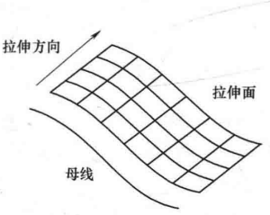|
|旋转面|旋转面是由一条曲线(母线)绕给定的轴线,按给定的旋转半径旋转一定的角度而形成的面|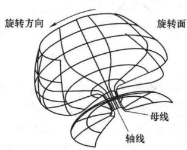|
|扫成面|扫成面是由一条曲线(母线)沿着另一条(或多条)曲线(轨迹线)扫描而成的面|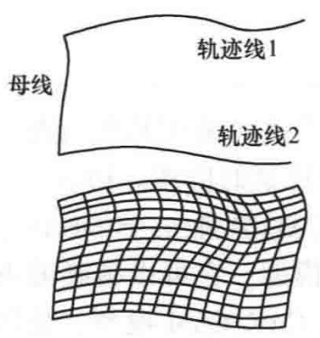|
##### 直纹面 
直纹面是以直线为母线,直线的端点在同一方向上沿着两条轨迹曲线移动所生成的曲面。圆柱面、圆锥面都是典型的直纹面。
##### 复杂曲面
复杂曲面的生成原理是先确定曲面上特定的离散点(型值点)的坐标位置,通过拟合使曲面通过或逼近给定的型值点,得到相应的曲面。

|曲面形式|描述|
|:-:|:-:|
|孔斯曲面|孔斯曲面是由四条封闭边界所构成的曲面。|
|贝塞尔曲面|以逼近为基础，先通过控制顶点的网格勾画出曲面的大体形状，再通过修改控制点的位置来修改曲面的形状。|
|B样条曲面|以B样条基函数来反映控制顶点对曲面形状的影响。|
#### 实体造型
曲面模型可以表达形体的表面信息,但是难以准确地表达产品的其他特性,如质量、质心、惯性矩等,这影响了计算机辅助工程分析(CAE)等技术的应用。实体模型是一种具有封闭空间的、能够提供三维形体完整几何信息的模型,它可以精确地表达零件的全部属性,具有完整性和无二义性。
##### 扫描变换法
将一个二维形体沿给定轴线方向平移一定距离或绕着给定轴旋转一定角度而形成的实体。实体扫描的前提条件是平面轮廓必须封闭。
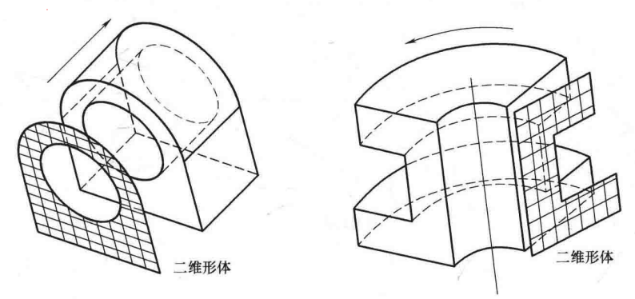
##### 边界表示法 (B-Rep)
边界表示法将实体定义为由封闭的边界表面围成的有限空间。
通常,以边界表示的建模系统中都采用翼边数据结构。它以边为核心,通过某条边可以检索到该边的左面和右面、两个端点及其上下左右四条邻边,从而确定各元素之间的连接关系。

    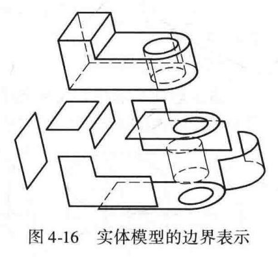
    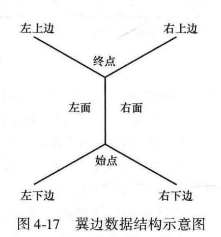

##### 体素构造法(CSG)
体素构造法也称实体构造法(Constructive Solid Geometry, CSG)。它是以基本实体体素为基础,通过交、并、差等布尔运算来构造复杂形体的一种方法。
采用体素构造法构成三维形体的过程,可采用一棵**二叉树**加以描述,也称为CSG 树。
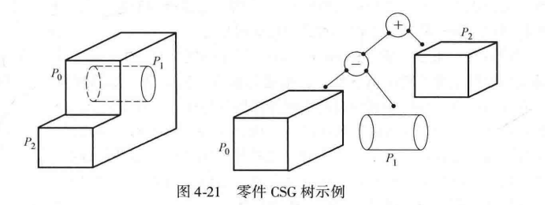

##### 脑筋急转弯（补天可跳）

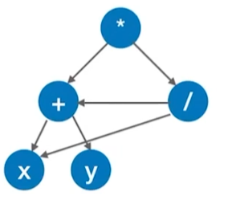

例题*（2019年408考研真题）

用有向无环图（元素可以复用的CSG树）描述表达式(x+y)((x+y)/x)，需要的顶点个数至少是()。

A.5   B. 6   C.8   D. 9

答案是A，如右图所示

##### CSG与B-rep比较

|比较项|CSG|B-rep|
|:-:|:-:|:-:|
|数据结构|简单|复杂|
|数据数量|小|大|
|有效性|基本体素保证|任何物体|
|数据交换|转换成B-rep可行|转换成CSG难|
|局部修改|困难|容易|
|显示速度|慢|快|
|曲面表示|困难|相对容易|

##### 分解表示法
分为体素表示法、单元格表示法、八叉树表示法
#### 特征造型
线框、表面和实体建模只是提供了产品三维形体的几何信息和拓扑信息，但产品几何模型尚不足以驱动产品生命周期的全过程。特征造型则关注如何更好、更完整地表达产品的技术、生产与管理方面的信息,以便建立产品的集成化信息模型。
##### 特点（感觉不用背）
1. 特征造型则着眼于如何更好地表达产品完整的技术及生产管理信息，以便为建立产品的集成信息模型服务。
2. 特征造型使产品数字化设计工作在更高的层次上进行，设计人员的操作对象不再是原始的线条和体素，而是产品的功能要素。
3. 特征造型有助于加强产品设计、分析、工艺准备、加工、装配、检验等各部门
之间的联系。
4. 特征造型有助于推行行业内产品设计和工艺方法的规范化、标准化和系列化。
5. 特征造型有利于推动行业及专业产品设计。
##### 特征分类

|特征类型|描述|
|:-:|:-:|
|形状特征|形状特征用于描述具有一定工程意义的几何形状信息。|
|装配特征|装配特征用于表达零部件的装配关系。|
|精度特征|精度特征用于描述产品几何形状、尺寸的许可变动量及其误差。|
|材料特征|材料特征用于描述产品的材料类型、性能和热处理等信息。|
|性能分析特征|性能分析特征也称为技术特征,用于表达零件在性能分析时所使用的信息,如有限元网格划分等。|
|补充特征|补充特征也称为管理特征,用于表达一些与上述特征无关的产品信息。|
##### 特征举例
拉伸特征，放样特征，扫描特征，圆角特征，旋转特征，倒角特征，抽壳特征，特征的镜像，筋特征及钻孔特征，特征的圆周阵列，拔模特，特征的线性阵列
##### 倒圆角
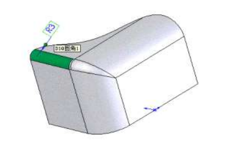

分为边倒圆、面倒圆、软倒圆

问题： 三边倒圆操作: 1）同时圆角过渡一个角点的所有相邻边；2）依次圆角过渡一条边
两种操作会有差异。什么差异？问题在哪里？

操作 1中软件会将角点处作为一个整体来计算，在三个圆角相交的顶点处生成一个光滑的、对称的过渡曲面，而操作 2中软件会基于当前的几何体依次计算。第一条边倒圆后，角点的原始拓扑结构被破坏；倒第二条和第三条边时，新的圆角必须“跨越”或“切割”已经存在的圆角面。在角点处会形成层叠、阶梯状或带有锐边的交汇面。最终形状不仅不对称，而且严格依赖于你选择倒圆角的先后顺序。

带来的问题是曲面质量差，角点处无法形成光顺的曲面过渡；引发应力集中；加工制造困难；容易导致建模失败（报错）。
#### 参数化造型
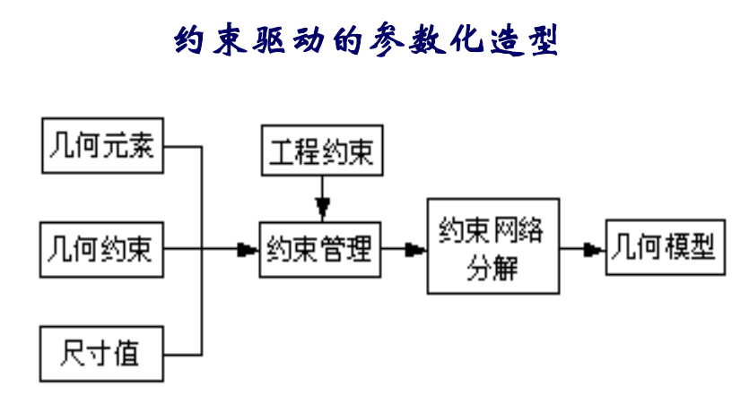

参数化造型使用约束来定义和修改几何模型。约束反映了设计时要考虑的因素，包括尺寸约束、拓扑约束及工程约束（如应力、性能）等。

参数化造型通常需要以下步骤：
(1)对草图的定义
(2)对设计元素之间的几何约束的定义
(3)约束求解
(4)通过改变参数来产生变化

### 形体在计算机内部的表示

    

        <table style="width: 100%; height: 100%; border-collapse: collapse; text-align: center;">
            <thead>
                <tr>
                    <th style="border: 1px solid #999; padding: 8px;">元素</th>
                    <th style="border: 1px solid #999; padding: 8px;">含义</th>
                </tr>
            </thead>
            <tbody>
                <tr>
                    <td style="border: 1px solid #999; padding: 8px;">点</td>
                    <td style="border: 1px solid #999; padding: 8px;">点是零维几何元素，也是几何造型中最基本的几何元素。</td>
                </tr>
                <tr>
                    <td style="border: 1px solid #999; padding: 8px;">边</td>
                    <td style="border: 1px solid #999; padding: 8px;">边是一维几何元素，它是指两个相邻面或多个相邻面之间的交界。</td>
                </tr>
                <tr>
                    <td style="border: 1px solid #999; padding: 8px;">面</td>
                    <td style="border: 1px solid #999; padding: 8px;">面是二维几何元素，它是形体表面一个有限、非零的区域。</td>
                </tr>
                <tr>
                    <td style="border: 1px solid #999; padding: 8px;">环</td>
                    <td style="border: 1px solid #999; padding: 8px;">环是由有序、有向边（直线段或曲线段）组成的面的封闭边界。</td>
                </tr>
                <tr>
                    <td style="border: 1px solid #999; padding: 8px;">体</td>
                    <td style="border: 1px solid #999; padding: 8px;">体是由封闭表面围成的三维几何空间</td>
                </tr>
                <tr>
                    <td style="border: 1px solid #999; padding: 8px;">壳</td>
                    <td style="border: 1px solid #999; padding: 8px;">壳是由一组连续的面围成。</td>
                </tr>
            </tbody>
        </table>
    

    

        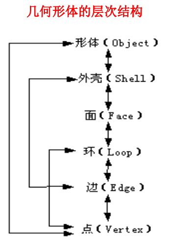
    

### 正则形体
**通常，把具有维数一致的边界所定义的形体称为正则形体。**
### 欧拉-庞加莱公式
对于正则形体有
$$v-e+f-h=2(b-p)$$
其中$v$为顶点数，$e$为边数，$f$为面数或外环数，$h$为形体表面的孔数，$b$为形体数，$p$为穿透形体的空洞数（通道数）
## 第五章 SolidWorks软件
### 历年题导航
- 列举至少五种配合，各有什么特点
- 给一个模型，说出这个模型在建模软件中的建模过程 
### 配合类型
“重合”配合、“平行”配合、“垂直”配合、 “相切”配合、“同轴心”配合、“距离”配合、“角度”配合
### 设计模式

| 设计模式 | 含义 | 优点 | 缺点 |
| --- | --- | --- | --- |
| 自下而上 | 先设计零件,再以零件模型为基础进行装配 | 零件的设计相对独立,设计人员可以专注于单个零件的设计。 | 只有在装配时才能够检验零件之间的配合是否合理、产品设计是否满足预期目标。可能造成设计过程的反复,影响了设计质量,增加了设计成本。 |
| 自上而下 | 先建立装配体,再在装配体中完成零件的造型和编辑。 | 可以参考一个零件的形状和几何尺寸来生成或修改其他相关零件,确保零件之间存在准确的尺寸和装配关系。当被参考零件的尺寸发生改变时,相关联的零件尺寸会自动发生改变,从而保证零件之间的配合关系不会发生改变。 | /|

## 第六章 计算机辅助工程分析
### 历年题导航
- 有限元分析的原理以及步骤，实际软件中包含哪些模块
- 什么是虚拟样机设计技术?与传统的物理样机试验相比，虚拟样机技术有哪些优点?
### 机械产品开发常用仿真软件

| 软件名称 | 功能 |
| --- | --- |
| Matlab | 数值计算、控制和通信等系统仿真 |
| ABAQUS | 隐式线性和非线性结构分析软件 |
| ANSYS | 隐式线性和非线性结构分析软件 |
| FLUENT | 流体力学分析软件 |
| FIRE | 流体力学分析软件 |

### 有限元分析
#### 原理
将物体分为简单而又相互作用的单元，使用以有限数量的未知量去逼近无限未知量的数学近似方法对真实物理系统（几何体和载荷工况）进行模拟。
#### 求解步骤
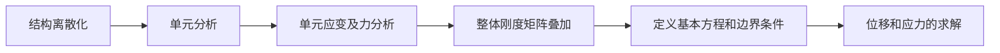
#### 有限元分析软件的体系架构与模块组成
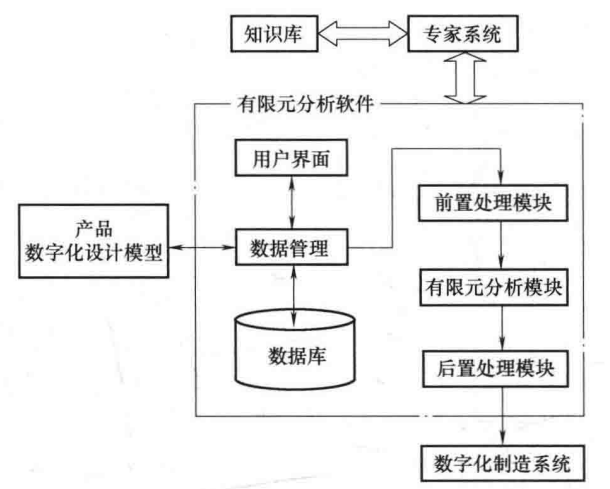
此外，有限元软件通常还提供以下模块:用户界面模块、数据管理模块
#### 虚拟样机
建立在计算机上的原型系统或子系统模型，它在一定程度上具有与物理样机相当的功能和真实度，可以代替物理样机以便对设计方案的各种特性进行测试和评价。
##### 特点
数字化 虚拟化 网络化
#### 对称性模型
##### 对称性条件
- 几何结构对称
- 材料特性对称
- 载荷与约束对称
##### 对称类型
- 轴对称
- 旋转对称
- 平面/镜面对称
- 重复或平移对称
#### 单元类型
点单元、线单元、面单元、体单元
*壳单元：面单元的特殊形式，每块面板的主尺寸不低于其厚度的10倍。
#### 载荷

| 载荷 | 含义 |
| --- | --- |
| 自由度约束 |给某个自由度指定一已知数值|
| 集中载荷 | 作用在模型的一个点上的载荷 |
| 面载荷 | 作用在单元表面上的分布载荷。 |
| 体载荷 |分布于整个体内或场内的载荷。  |
| 惯性载荷 | 由物体的惯性（质量矩阵）引起的载荷，例如重力加速度，加速度，以及角加速度。 |
