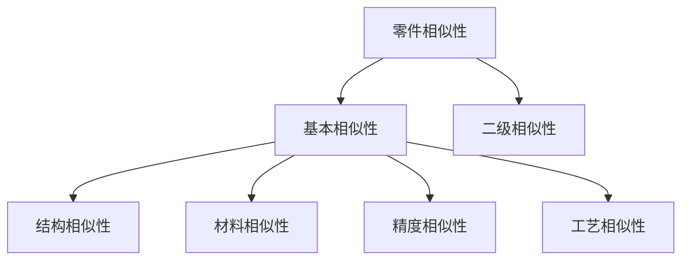
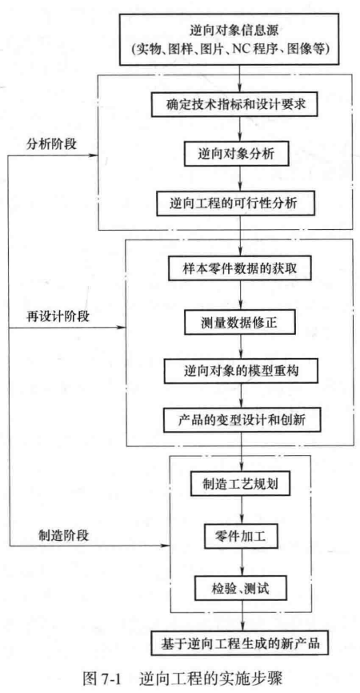
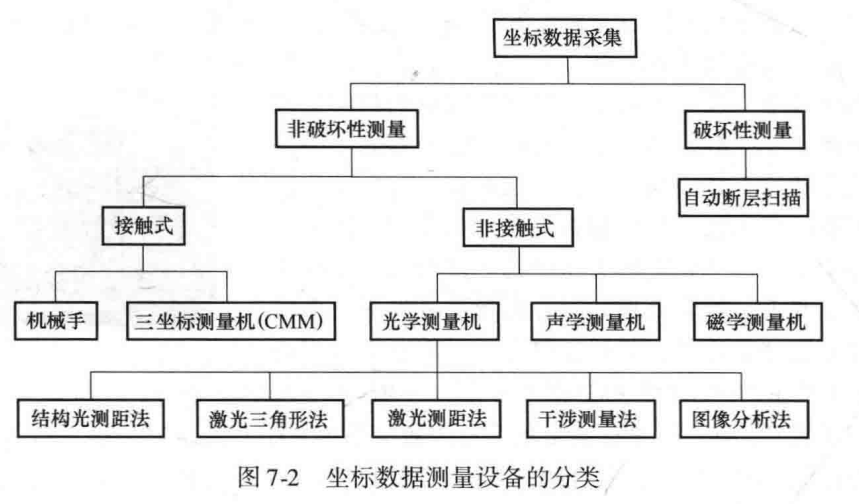

## 第七章 计算机辅助工艺规划(CAPP)与成组技术
### 历年题导航
- 零件相似性的含义，具体包含哪些方面 
### CAPP
CAPP是指利用计算机来制订零件加工工艺的方法和过程，通过向计算机输入被加工零件的几何信息、工艺信息、加工条件和加工要求等，由计算机自动输出经过优化的工艺路线和工序内容等。
#### CAPP的类型

| 类型 | 描述 |
| --- | --- |
| 派生型 | 派生型 CAPP 基于成组技术，利用零件的相似性，通过零件编码从标准库中检索相似工艺并进行修订，从而生成新零件的工艺规程。 |
| 交互型 | 交互式 CAPP 强调“人工决策为主、系统辅助为辅”，通过灵活的框架体系实现工艺设计的定制化与数据积累。它将工艺文件管理与自动化统计归档相结合，旨在实现工艺信息的集成共享并显著提升编制效率。 |
| 创成型 | 创成型 CAPP 通过模拟工艺人员的决策逻辑，在无需人工干预的情况下，依据零件信息与工艺数据库自动生成工艺规程。它不依赖于样板工艺，可独立完成机床选择、加工优化及工艺文件的全自动输出。 |
| 综合型 | 综合型 CAPP 集成了派生型与创成型的优势，采用“派生+决策”的混合模式。它首先通过检索并修订零件族样板工艺，再运用决策逻辑自动完成详细的工序设计与规划。 |
| 智能型 | 智能型 CAPP 在系统中运用了人工智能技术,使其成为 CAPP 的专家系统。它利用推理加知识的原理自动生成新零件的工艺规程。 |
#### CAPP的流程

    

        
1. 检索标准工艺文件

        
➝

        
2. 选择加工方法

        
➝

        
3. 安排加工路线

        
➝

        
4. 选择机床、刀具、量具、夹具

        
➝

        
5. 选择装夹方式和装夹表面

    

    

        
↓

    

    

        
6. 选择、优化切削用量

        
➝

        
7. 计算加工时间、加工费用

        
➝

        
8. 确定工序尺寸、公差和选择毛坯

        
➝

        
9. 绘制工序图、编写工艺卡

    

#### CAPP的意义
1. 改变了工艺设计依赖于个人经验的状况,有利于提高工艺设计的质量。
2. 有助于缩短工艺设计周期,加快产品开发速度。
3. 有利于总结和传承工艺设计人员的经验,逐步形成典型零件的标准工艺库,实现工艺设计的优化和标准化。
4. 是产品数字化造型和数控加工之间的桥梁。
### 成组技术
#### 概念
成组技术以零件相似性为基础，通过将结构与工艺相近的零件划分为“零件族”，实现将分散的小批量生产转化为准大批量生产模式。
#### 核心
按一定的相似性准则对产品零件分类成组。
#### 步骤
- 分类编组：基于相似性准则，将产品、部件和零件进行分类并形成零件族，这是成组技术的核心基础。
- 生产应用：将编组结果应用于产品设计、生产准备、设备布置及生产计划等各个环节，以大批量生产的方式处理相似问题。
- 实现合理化：通过上述过程，最终实现设计、工艺及管理的全面合理化，从而提升整体生产效率与经济效益。
#### 应用领域
- 产品设计
- 制造工艺
- 生产管理
#### 零件相似性
##### 含义
零件相似性是指零件具有的各种特征相似。零件的相似性可分解为**基本相似性**和**二次相似性**。其中零件在结构形状、尺寸、功能要素、精度、材料等方面的特征是零件的基本特征，因而其在这些方面的相似性为基本相似性；以基本相似性为基础，在制造、装配、生产经营、管理等方面导出的相似性为二次相似性。
##### 分类

##### 与成组技术的关系
成组技术的理论基础是相似性
##### 零件编码的分类

| 编码系统 | 特点 |
| --- | --- |
| Opitz 编码系统 | 结构简单、便于记忆和手工分类;偏重于零件的结构特征。但是,分类标准在严密性和准确性方面有不足之处。 |
| KK-3 编码系统 | 一个结构-工艺并重的分类编码系统。 |
| JLBM-1编码系统 | 吸收了Opitz 系统和 KK-3 系统的优点,克服了 Opitz 系统分类标志不全和 KK-3 系统环节过多的缺点。 |
| 柔性编码系统 | 柔性编码系统是指横向码位长度可以根据描述对象的复杂程度而变化的分类编码系统。 |

## 第八章 数控加工与数控机床
### 历年题导航
- 闭环机床的原理
- 数控机床由哪几部分组成，说说它们各自的作用 
- APT代码包含哪些部分 
### 数控机床的组成及其工作原理
|组成|功能与工作原理|
|:-:|:-:|
|控制介质（信息载体）|作为人与机床之间的联系介质，负责存储并向数控系统传输零件加工所需的几何信息、工艺参数及辅助运动指令。|
|数控系统|机床的控制核心，负责对输入的加工程序进行译码和运算，并向执行机构输出控制信号以协调各项加工动作。|
|伺服系统|接收数控系统的指令信号并进行功率放大，驱动机床运动部件实现高精度的定位和预定轨迹的运动。|
|机床本体|执行切削加工的机械结构及辅助装置，相比普通机床具有更高的刚度、精度以及更高效的传动系统。|

### 开环控制机床
这类机床的进给伺服驱动是开环的，即没有检测反馈装置.

这种控制方式的最大特点是控制方便、结构简单、价格便宜．数控系统发出的指令信号流是单向的，所以不存在控制系统的稳定性问题，但由于机械传动的误差不经过反馈校正，故位移精度不高。
### 闭环控制机床
#### 原理
配置位置反馈和速度反馈，在加工中随时检测移动部件的实际位移量，并及时反馈给数控系统中的比较器，它与插补运算所得到的指令信号进行比较，其差值又作为伺服驱动的控制信号，进而带动位移部件以消除位移误差。
#### 全闭环控制机床
其位置反馈装置采用直线位移检测元件，直接检测机床坐标的直线位移量，通过反馈可以消除从电动机到机床床鞍的整个机械传动链中的传动误差，从而得到很高的机床静态定位精度。
#### 半闭环控制机床
其位置反馈采用转角检测元件，直接安装在伺服电动机或丝杠端部。由于大部分机械传动环节未包括在系统闭环环路内，因此获得较稳定的控制特性。丝杠等机械传动误差不能通过反馈来随时校正，但是可采用软件定值补偿方法来适当提高其精度。目前，大部分数控机床采用半闭环控制方式。

### 数控程序的结构
数控程序由程序编号、程序内容和程序结束段组成。
#### 程序段格式
1. 程序开始符、结束符
2. 程序名
3. 程序主体
4. 程序结束指令
#### 功能字

| 字母 |辅助记忆 | 含义 |
| --- | --- | --- |
| N | Number | 顺序号字 |
| G | Get Ready | 准备功能字 |
| T | Tool | 刀具功能字 |
| S | Spindle speed | 主轴速度功能字 |
| M | / | 辅助功能字 |
| F | Feed | 进给功能字 |
#### 数控语言自动编程（APT）
由计算机自动地进行数值计算，编写零件加工程序单，自动地输出加工程序单。
##### 组成
几何定义语句、刀具运动语句、程序控制定义语句、后置处理语句和辅助语句等
## 第九章 逆向工程与增材制造
### 历年题导航
- 名词解释 逆向工程 增材制造
- 列举五种快速原型制造，分别用1-2句话简要说明之
- 逆向工程流程
### 产品开发模式

| 开发模式 | 定义 | 特点 |
| --- | --- | --- |
| 逆向工程 | 逆向工程以已有产品为蓝本，通过对其进行分析、消化和吸收，进而实现结构、材料或功能的改进与创新，最终开发出全新的产品或解决方案。 | 逆向工程有助于缩短产品的研发周期,降低新产品的开发成本,帮助企业赢得市场先机。 |
| 正向工程 | 正向工程是从无到有的产品开发过程，从市场需求出发，历经产品的概念设计、结构设计、加工制造、装配检验等环节。 | 产品正向开发方式的周期长,开发成本高。 |
### 逆向工程
#### 分类

| 类别 | 特点 |
| --- | --- |
| 实物逆向 | 信息源为产品实物。 |
| 软件逆向 | 以产品的工程图样、工艺流程等信息为基础，完成产品复制。 |
| 影像逆向 | 根据产品的图片、照片或影像等信息，完成产品复制。 |
| 局部逆向 | 不复制整个零件，对局部进行复原。 |
#### 基本步骤

#### 坐标数据采集设备的分类

### 增材制造（快速原型制造）
直接由产品的三维数字化模型驱动成型设备，以快速制造任意复杂形状的三维物理实体。其核心在于将三维模型分层离散，并逐层堆积原材料来构建实体。
#### 增材制造技术的主要方法
|方法|描述|
|:-:|:-:|
|立体光固化|通过紫外激光束按截面形状照射液态光敏树脂，使其发生光聚合反应并逐层固化，以其超高的尺寸精度和极其光滑的表面质量见长。|
|熔融沉积成形|将丝状热塑性材料加热至熔融状态，通过喷头挤出并按照路径沉积在底座上逐层堆积凝固，是目前普及度最高、成本最低的技术方案。|
|选择性激光烧结|利用高能激光束选择性地扫描并熔融铺设好的粉末材料（如尼龙、金属粉），使其逐层烧结成形，其最大特点是无需额外支撑结构，适合制造复杂几何实体。|
|叠层实体制造|将涂有热熔胶的薄片材料（如纸张、塑料箔）通过热压辊粘接，并利用激光或刀具切割出截面轮廓，最终叠加形成实体，具有制造大尺寸零件速度快、成本低的优势。|
|三维印刷|采用类似喷墨打印的技术，将液态粘结剂喷射在铺好的粉末层上，通过局部粘结粉末实现逐层成形，常用于全彩色模型展示和铸造原型的制作。|
#### 增材制造技术的优缺点

| 方法 | 优点 | 缺点 |
| --- | --- | --- |
| SLA（立体光固化） | 1. 尺寸精度高，表面质量好，可达微米级别； 2. 加工速度快，产品周期短，无需切削工具与模具； 3. 工艺成熟稳定，应用广泛； 4. 可加工结构外形复杂的原型或模具； 5. 可与逆向工程、CAD 技术、网络技术等联合，利于实现生产自动化。 | 1. 系统造价昂贵，使用和维护成本高； 2. 对工作环境要求苛刻； 3. 成型件多为树脂类，强度、刚度和耐热性有限，不利于长期保存； 4. 液体材料有轻微毒性，对部分人有过敏反应； 5. 光学器件控制算法复杂，与打印性能关联度大。 |
| FDM（熔融沉积成型） | 1. 成型设备简单、成本低，无需激光器及其电源，用户普及率高； 2. 设备运行可靠，维护较简单； 3. 环境污染较小，可在家或办公室使用； 4. 原材料以卷轴丝形式提供，易于运输和更换； 5. 常用于成型具有复杂内腔和孔的零件； 6. 可加入增强材料，打印件成品强度和韧性较高。 | 1. 喷头采用机械式结构，打印速度慢； 2. 尺寸精度较差，表面相对粗糙； 3. 层间界面性能较差； 4. 需要设计和制作支撑，打印复杂结构时支撑去除困难。 |
| SLS（选择性激光烧结） | 1. 材料选择广泛； 2. 打印过程无需支撑结构； 3. 可制造任意复杂结构，包括镂空、空心结构； 4. 材料利用率高，未使用的粉末还能继续利用。 | 1. 粉末烧结表面粗糙，需后续处理； 2. 增材制造过程耗时； 3. 设备制造和维护成本高； 4. 凝固组织与内部缺陷的质量控制要求高； 5. 晶粒尺寸、晶粒形态和取向的控制需要长期摸索。 |
| LOM（叠层实体制造） | 1. 仅切割外轮廓，内部无需加工，成型效率高； 2. 使用小功率 CO2 激光或低成本刀具，价格低且寿命长； 3. 造型材料成本低； 4. 不存在收缩和翘曲变形，无需支撑等辅助工艺。 | 1. 材料浪费严重，且材料种类少； 2. 表面质量差，制件性能不高； 3. 前、后处理费时费力； 4. 不能制造中空结构。 |
| 3DP（三维印刷） | 1. 无需激光器等昂贵器件，设备造价低； 2. 成型速度快，可用多个喷嘴； 3. 可使用多种粉末材料，也可使用彩色黏合剂； 4. 打印过程无需支撑材料； 5. 工作过程较为清洁； 6. 可实现大型件打印。 | 1. 模型精度和表面质量较差； 2. 强度、韧性相对较差，难以适用于功能性试验； 3. 原材料价格较贵。 |