# 大学物理实验
## 绪论
### 测量
测量是指按照某种规律,用数据来描述观察到的现象,从而对事物作出量化的描述。测量学是从人类生产实践中发展起来的一门历史悠久的科学,是人类与大自然作斗争的一种手段。**测量最基本的方式是比较,即将被测的未知物理量和预定的标准量进行比较而确定物理量的量值。** *(2023.2)* 由测量所得到的被测物理量的量值表示为数值和计量单位的乘积。
#### 测量四要素
测量四要素主要是指***被测对象、测量程序、测量准确度和计量单位*** *（填2023.1，2021）*
口诀：妒（测量准确度）忌（计量单位）程序（测量程序）对象（测量对象）
**程序都有对象，但是你没有。** 我当然说的是面向对象语言的Object（狗头）
#### 直接测量与间接测量
**测量可分为直接测量和间接测量。** *(2023.2)* 
直接测量是指被测量直接与标准量比较而得到测量值的方法。简单地说是指无需经过函数关系的计算,直接通过测量仪器得到被测量的值。
间接测量是指已知被测量与某一个或若干个其他量具有一定的函数关系,通过直接测量这些相关量值,然后用函数式计算出被测量值的测量方法。
一般情况下直接测量准确度会更高,但是多数物理量不是直接测量就能得到的,所以在一定条件下的间接测量就变得非常重要了。
### 误差
物理实验按其性质可分为**验证性实验和测量性实验**
物理实验包括**实验方案设计、实际测量操作和数据处理过程。**（感觉按尿性考这个也不是不可能）
根据误差的性质,把误差主要分为**系统误差、随机误差和粗大误差** *(2023.3)*
#### 系统误差
**在同等条件下,对同一个待测量进行多次测量,测量值和真值的偏离总是相同的那一部分误差分量称作已定系统误差。***(填定义，2020)*
**引起这部分误差的原因** *(填，举例2019,2020)* 有:**实验方案和依据的理论公式的不完善** *(2023.1)*,例如实验中依据的公式忽略了某些影响因素;仪器的准确度不够,例如测量器具的刻度不准,灵敏电流计的游丝弹性偏大或偏小、电子元件老化、机械零件移位、**仪表零点漂移** *(2023.3)* ;环境温度和湿度等条件发生变化;测量者的心理和习惯等人为因素等。由此可见,对同等条件下的测量,已定系统误差是不变的,不会因测量次数的多少而改变。要减小测量误差,首先就必须发现和了解实验中的已定系统误差并修正它。**系统误差有规律性**,可通过实验方法或引人修正值方法进行修正。
**在有些情况下,并不知道确切的系统误差值,只知道它处于一个范围,这种系统误差称作未定系统误差。** 例如**仪器的允差** *(2023.3)*,以游标卡尺为例,有的给出允差为±0.02mm或±0.05mm等。
#### 随机误差（偶然误差）
**在符合重复性或复现性条件下,对同一被测量进行多次测量,每次测量值相对于真值有一个无规律** *(2023.4)* **的涨落(大小,方向),这就是随机误差。** *(2023.1)* 在对涨落进行足够多次测量后,发现它们服从一定的统计规律,如 *(2023.4)*
**单峰性**:误差小的出现的概率大;
**对称性**:正负误差出现的概率相等;
**有界性**:在一定的测量条件下,误差大的出现概率为零。
随机误差是变差,但存在规律,大多数实验测量的误差集合符合**正态分布**。**随机误差是不可修正的** *(2023.2)*,**但可通过多次测量来减小它的影响。** *(2023.3)*
#### 粗大误差（过失误差）
粗大误差是明显超出规定条件下预期的误差。粗大误差产生的原因主要有读错、写错、结果求错、**仪器有缺陷和使用不正确** *(2023.1)*、环境有非常大的干扰等。在实验数据中如出现异常数据,应对其进行科学的评估,以决定是否剔除。
#### 相对误差
##### 量具测量问题
*2023.6*
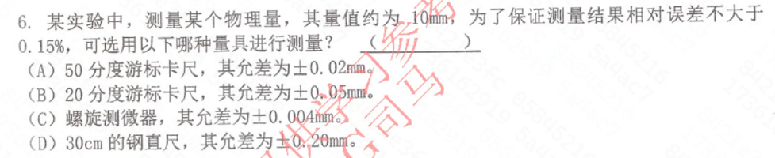
此类问题用允差除以量值即可
以$A$为例，相对误差为$E=\dfrac{0.02mm}{10mm}\times 100\%=0.20\%$
答案为$C$
#### 测量误差分布
##### 正态分布
$\displaystyle \sigma = \lim_{n \to \infty} \sqrt{\frac{1}{n} \sum_{i=1}^{n} (x_i - \mu)^2}$**称为正态分布的标准偏差,它表征了测量值的分散程度。**$σ$**越大,正态分布曲线就越平坦,即曲线越矮宽,测量值的离散性就越大,反映测量的精密度越低。** *(填2023.2)* 曲线与x轴之间所包围的面积表示置信概率。**测量值落在$[-\sigma,\sigma]$之间的置信概率$P=0.683$** *(2021)*
**测量值落在$[-2\sigma,2\sigma]$之间的置信概率$P=0.955$** 
**测量值落在$[-3\sigma,3\sigma]$之间的置信概率$P=0.997$** 
###### 随机误差正态分布的性质
1. **单峰性**：绝对值小的误差出现的可能性(概率)大,绝对值大的误差出现的可能性小。
2. **对称性**：大小相等的正误差和负误差出现的机会均等,对称分布于真值的两侧。
3. **有界性**：非常大的正误差或负误差出现的可能性几乎为零
4. **抵偿性**:当测量次数非常多时,正误差和负误差相互抵消,于是误差的数和趋向于零。

对于正态分布中测量次数有限时,一般用**贝塞尔公式**来表示实验的标准偏差。其公式为:
$$s=\sqrt{\frac{1}{n-1}\sum_{i=1}^{n}\left(x_{i}-\mu\right)^{2}}$$
##### 均匀分布
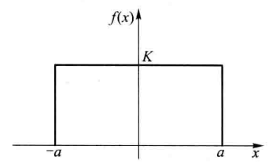

如图，$K=\dfrac{1}{2a}$
可以证明均匀分布的标准偏差为$\sigma=\dfrac{a}{\sqrt{3}}$

均匀分布表示测量值以等概率落入区间$[-\sqrt 3σ,+\sqrt 3σ]$中,而落在该区间外的概率为零。
#### 测量结果表达式
测量结果的完整表达式包括三个要素:**测得值、不确定度和单位。**
#### 测量的精密度、测量的正确度和测量的准确度
##### 精密度
各次测量的数据大小彼此接近的程度。测量精密度高不一定测量准确度就高。**是偶然误差的反映**
##### 正确度
测量数据的平均值偏离真值的程度。**是系统误差的反映。**
##### 准确度
测量的准确度是指测量数据集中于真值附近的程度。**是偶然误差和系统误差的反映。** **因此,测量的准确度才是对测量结果的综合评价**
#### 仪器误差
##### 游标卡尺和螺旋测微计
**游标卡尺和螺旋测微计使用前必须检查初读值**
##### 仪表 *(填2023.3)*
仪表一般分七个等级:0.1,0.2,0.5,1.0,1.5,2.5,5.0,其中数字越小准确度等级越高。其等级可表示为:
$$k=\frac{示值误差}{量程}\times 100$$
**示值误差即为允差，大题会考用等级来计算允差然后计算不确定度** *（2023）*
##### 填2023.3
量程为20mA的电流表，其等级为1.0，当读数为5.6mA时，该测量值的相对误差为()

示值误差=$\dfrac{k\times量程}{100}$=0.2mA

相对误差$E=\dfrac{0.2mA}{5.6mA}=4\%$
有效数字见“不确定度的修约法则”
### 有效数字
#### 有效数字特点
- **当被测量的量和测量仪器确定后，有效数字位数就已经确定（即有效数字位数与这二者有关）** *(2020)*
- 有效数字与单位换算无关
#### （存疑数）运算法则
1. **可靠数加、减、乘、除存疑数仍然是存疑数** *(2023.5)*
2. **诸数加减时，其结果的可疑数字位置与诸数中可疑数字最大的位置一致(与参与运算者的诸数有效数字无关)** *(2023.5)*
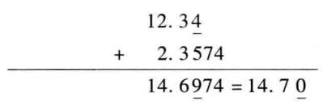
3. **诸数相乘除时,其结果的乘积或商的有效数字位数与参加运算者的诸数中有效数字位数最少者相同。** *(2023.5)*
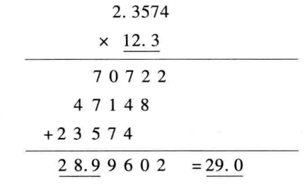
4. **函数运算的取位方法通过函数计算来确定。** *(2023.5)*
#### 测量不确定度的有效位数
##### 不确定度保留位数法则
**当合成标准不确定度和扩展不确定度最左边的第一位非零有效数字是1和2时,可取2位,而3以上则只可用一位有效数字。**
##### 不确定度的修约法则
**欲保留的最低位后的这位数不为零则进位,如为零则舍去。**

例如：$u_C=0.1234$最左边是1保留两位，预保留最后一位是2，后一位为3不为0，故进位，结果为0.13
**误差的修约法则与不确定度相同**
### 不确定度
### 测量不确定度的来源
1. 对被测量的定义不完整或不完善。
2. 实现被测量定义的方法不理想。
3. 取样的代表性不够,即被测量的样本不能完全代表所定义的被测量。
4. 对测量过程受环境影响的认识不周全,或对环境条件的测量与控制不
完善。
5. 对模拟式仪器的读数存在人为偏差。
6. 测量仪器计量性能(灵敏度、鉴别力阈、分辨力、死区及稳定性等)。
7. 赋予计量标准的值和标准物质的值不准确。
8. 引用的数据或其他参量的不确定度
9. 与测量方法和测量程序有关的近似性和假定性。
10. 在表面上看来完全相同的条件下,被测量重复观测值的变化:
#### 标准不确定度的$A$类分量评定
不确定度A类分量评定由**重复观测**引起,可利用统计学方法计算得到,记为$u_A$。A类评定结果**只包含给定重复(或复现)观测条件下的随机效应（对应随机误差）** *（2019）(2020)*,**A类评定结果的可靠程度决定于重复观测次数。**
$$u_{_A}=\frac{s(x_i)}{\sqrt{n}}=\sqrt{\frac{1}{n(n-1)}\sum_{i=1}^{n}(x_i-\overline{x})^2}$$
#### 标准不确定度的$B$类分量评定
B类分量评定结果包括所用信息的有关效应,**既可以是随机效应,也可以是系统效应或两者兼而有之（即对应随机误差和系统误差）** *（2019）*,B类分量评定结果可靠程度决定于信息的可靠程度。标准不确定度B类分量的信息来源有许多,在本教材中,直接测量时标准不确定度的B类分量一般只考虑测量仪器的允许误差限(最大允许误差),不同的测量仪器给出允许误差限的方式不一定相同,有时需对技术指标给出的信息进行转换才能得到允许误差限。**在大多数情况下,仪器的允许误差限是标准不确定度B类分量的主要来源。**
$$u_{_B}=\frac{\Delta_{_\text{仪}}}{\sqrt{3}}$$
#### 合成标准不确定度的评定 *(填2023.5)*
若有函数$$Y=f(X_1,X_2,...,X_n)$$
当$X_1,X_2,...,X_n$彼此独立或不相关，**且函数为和差形式时**，合成标准不确定度
$$u_c(y)^2=\sum_{i=1}^n\left(\frac{\partial f}{\partial x_i}\right)^2u_{x_i}^2$$
**函数为积商形式时**
$$\left(\frac{u_c(y)}{y}\right)^2=\sum_{i=1}^n\left(\frac{\partial\ln f}{\partial x_i}\right)^2u_{x_i}^2$$
#### (填2023.5)
若待测量为 \( M = \dfrac{Y^3Z}{X^2} \)，直接测量量分别为 \( X \pm \Delta X \)，\( Y \pm \Delta Y \)，\( Z \pm \Delta Z \)，请写出 \( M \) 的不确定度表达式 \( \Delta M \)。

解题步骤：
1. 先对函数式取对数$\ln M=3\ln Y+\ln Z-2\ln X$
2. 再对各自变量求导$$\frac{\partial \ln M}{\partial Y}=\frac{3}{Y},\frac{\partial \ln M}{\partial Z}=\frac{1}{Z},\frac{\partial \ln M}{\partial X}=-\frac{2}{X}$$
3. 代入不确定度传递公式$$\left(\frac{\Delta{M}}{M}\right)^2=\left(\frac{3}{Y}\right)^2\Delta Y^2+\left(\frac{1}{Z}\right)^2\Delta Z^2+\left(-\frac{2}{X}\right)^2\Delta {X}^2$$
4. 得到结果$$\Delta{M}=M\sqrt{\left(\frac{3}{Y}\right)^2\Delta Y^2+\left(\frac{1}{Z}\right)^2\Delta Z^2+\left(-\frac{2}{X}\right)^2\Delta {X}^2}$$
## 数据处理（考大题）
### 数据处理的方法 *(举例2020)*
数据计算，列表法，作图法，逐差法，最小二乘法
### 作图法
作图法可用来展示测量结果,也可用来计算数据,尤其是可以通过外延的方法得到无法实际测量的数据。
#### 作用和优点
1. 图法可以把一系列实验数据之间的关系很直观地从图纸上表达出来，
2. 通过作图,所作代表线可起到平均的作用,以减小随机效应引入的影响。
3. 可以从所作的代表线上求值,例如求斜率,求截距等。
4. 用有限个测量点作图,可在图上读出没有进行测量的点的数据。
5. 在一定的条件下,还可以将自变量外延到测量范围以外,以得到无法实际测量的对应值。
#### 规则
1. 手工作图一定要使用坐标纸,自己画方格子再作图是不允许的。坐标纸
的种类有直角坐标纸(毫米方格纸)、对数坐标纸、半对数坐标纸、极坐标纸等。
1. 非线性函数可以通过坐标变换将其线性化。
2. 参加作图的数据应是已修约数据,**如果作图的用途是为了定性地展示数据,以表现变量之间的关系,则作图纸张大小的选择适中即可。但在定量测量中,作图的目的还包括了计算某些物理量,如斜率、截距等,则作图纸张大小的选择应以能反映变量的不确定度为原则**,一般情况下,图纸的最小刻度可和变量的**有效位数的次末位**相对应。*(2023.10)*
3. 习惯上以自变量为横坐标,因变量为纵坐标,用粗线画出两坐标和方向，轴末端注明物理量名称和单位,每隔一定间距均匀地标出坐标值,通常以1,2,5进行分度,坐标原点不一定从零开始
4. 可用符号描点,用直尺或曲线板,根据不同内容连成光滑的直线或曲线。连线不能太粗,以免影响读数的准确度。原则上应使连线到各测量点的距离保持最近,测量点应均匀分布在连线两侧。
5. 如需用作图法来计算某些量值,则参加运算的点的坐标应在图上标出。
6. 应写上图名和图注。
## 示波器的使用
示波器是一种用途广泛的电子测量仪器,**不仅能观测电信号的波形(电压与时间关系),还能直接测量电信号的幅度、周期、频率和相位等参数。配合各种传感器,一切可以转化为电压的电学量(如电流、电功率、电抗等)和非电学量(如温度、位移、速度、压力、光强、磁场等)都可以用示波器来观测。** 采用双踪示波器还可以测量两个信号之间的时间差,一些性能较好的示波器甚至可以将输入的电信号存储起来进行分析和比较。

**示波器具有多种类型,就显示方式来说，主要有阴极射线示波器和液晶显示示波器两种,但它们的基本原理大致相同。**
### 波形扫描原理
**示波器工作时，需要在X轴偏转板(即水平偏转板)上加有一个周期性锯齿波形的电压，称为扫描电压**

**当正弦波形的周期$T_y$大于锯齿波形的周期T时,则波形会向右移动。
当正弦波形的周期$T_y$小于锯齿波形的周期T时,则波形会向左移动。** *(2019)*

**如果发生波形左移或右移，则通过调节触发电平幅值（TRIG LEVEL）按钮使其稳定下来**
#### *（2019）*
示波器实验中，扫描周期1ms波形向右移动，扫描周期5s时波形为一条竖直直线并向左移动，解释原因

当扫描周期为1ms时，**信号周期大于扫描周期，**波形会向右移动
当扫描周期为5s时，示波器的扫描频率非常低。**测信号的频率远高于扫描频率，示波器的水平扫描速度不足以捕捉到信号的完整周期**，屏幕上显示的波形会表现为一条竖直直线。此外，由于**信号周期小于扫描周期**，信号的相位变化会导致波形向左移动
### 实验仪器（示波器）
示波器由**示波管，放大器，扫描与触发同步系统和电源** *（2019）* 四个部分组成
#### 示波器字母解释 
1. $CH1,CH2$接口：用于输入信号的连接（其实是channel）
2. $CH1,CH2$按钮用于通道显示选择
3. $EXT$触发源接口
4. $POSITION$为水平或垂直位移调节
5. $GND$指接地选择
6. $DC/AC$指交直流耦合选择
7. $ADD$按钮指$CH1,CH2$两信号叠加
8. $INV$指倒向
9. $TIME/DIV$**指扫描速率和幅度选择（即调节横坐标量度，可以减少或增加屏幕上波形个数，改变一格代表的时间）** *（填2023.4，2021）*
10. $FINE$指水平位移微调
11. $MAG\times10$指光标在水平方向扫描速度扩大10倍
12. $ALT$指交替显示模式
13. $CHOP$指断续显示模式
14. $TRIG\quad LEVEL$指调节触发电平幅值
15. $SLOPE$指触发斜率选择
16. $SOURCE$指触发源选择
17. $COUPL$指触发耦合模式选择
18. $A$指单踪或双踪显示选择，$X-Y$指闭合曲线现实选择
19. $SWEEP\quad MODE$扫描模式选择
20. $FUNCTION$光标测量旋钮，旋转来使光标移动
21. $VOLTS/DIV$**指偏转因素选择（即调节纵坐标量度）** *（填2023.4）*
22. $INTEN$亮度按钮
23. $FOCUS$聚焦按钮
### 波形不稳的原因 *（2023）*
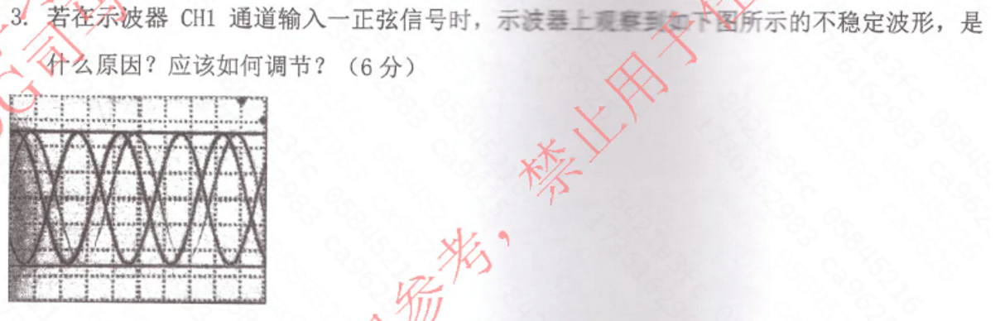
个人参考答案：扫描信号周期不是被测信号频率的整数倍，触发电平不正确；可以尝试将触发电平调整到信号的中点或过零点。
### 实验原理
#### 李萨如图形
如果在示波器的$X$轴和$Y$轴上都输入正弦变化的电压信号,两信号的频率$f_y$和$f_x$相同或成简单的整数比,则电子束的振动将是两个相互垂直的谐振动的合振动,荧光屏将描绘出合振动的图形,这种合成图形称为李萨如图形。
**理论推导表明李萨如图形满足以下关系:**
$$f_xN_x=f_yN_y$$

式中的$f_y、f_x$为$Y$方向与$X$方向的信号频率,$N_y$、$N_x$分别是$Y$方向与$X$方向的一条直线与李萨如图形**相交的最多交点个数**,或相切的最少切点个数。
若$f_y$和$f_x$之比**越接近整数比关系,则李萨如图翻转速度越慢,即越稳定。反之,则李萨如图翻转速度越快,即越不稳定。** *(填2019)*
**李萨如图形实验时如果图形显示为一个运动的椭圆的意思就是波形不稳** *(填2021)*
##### 李萨如图形测量信号频率 *(2023.8，2021)*

用李萨如图形测量未知信号的频率时，将未知信号接到示波器的CH1通道,信号发生器接到示波器的CH2通道:调节信号发生器的频率，调出李萨如图形如右图。信号发生器的频率为 600.0Hz,则该未知信号的频率为()Hz。

**CH1对应X，CH2对应Y**
由图中易知$N_x=6,N_y=4$
由$f_y=600Hz$，可知$f_x=400Hz$
### 实验内容
#### 电压测量
##### 直接测量法
即直接从示波器荧光屏上量出被测量电压波形的高度,然后转换成电压值，
$$U_{p-p}=Dh$$
$U_{p-p}$为被测电压的峰-峰值，$D$为示波器的偏转灵敏度（就你用VOLTS/DIV调的那个），$h$表示被测电压波形的高度
#### 二极管正向导通电压测量 *(2023)*
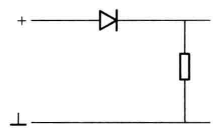

测量$CH1$信号峰-峰值$U_{1p-p}$
测量$CH2$的半波信号的峰值$U_{2p}$
正向导通电压为$\dfrac{U_{1p-p}}{2}-U_{2p}$
#### *(2023)*
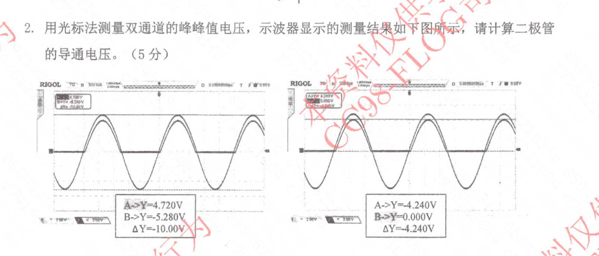
$\dfrac{U_{1p-p}}{2}-U_{2p}=\dfrac{10.000V}{2}-4.240V=0.760V$
## 分光计的调整和使用（原理很重要）
建议与书本对照观看
### 分光计简介
分光计是一种测量光线偏转角的精密光学仪器,因此又叫**测角仪**。由于不少物理量如光波波长、折射率、光栅常量等都可以通过测量相关角度来获得

### 实验装置 
常用的分光计主要由**望远镜、平行光管、载物平台、读数装置** *(填，2019)* 四部分构成
口诀：远行在读（留学去了确信）
#### 望远镜
望远镜用来观察和确定光线行进的方向,它由**物镜、目镜、全反射小棱镜和带“十”形叉丝的分划板**组成。其中,小棱镜紧贴分划板的一面刻有透光的十字,小灯珠发出的光经小棱镜反射后,再经物镜投射到载物平台上的反射镜反射回来的像是一亮十字像。**当望远镜光轴与载物平台上的反射镜镜面垂直时,反射回来的亮十字像应位于分划板的“十”形叉丝的上刻线处相重合。（对应关系搞清楚）**
#### 平行光管
平行光管用于产生平行光。狭缝至透镜的距离可调节。**当用光源照射狭缝时,若狭缝刚好位于透镜焦平面处,则由狭缝入射的光束经透镜后即为平行光束。**
#### 载物平台
载物平台是用来放置光学元件的。平台下有三个调节螺钉①、②、③,**用以改变平台的倾斜度**。一般来说,在调节平台面与转轴垂直时,反射镜位置有两种放置方法:一种是将反射镜置于**垂直于①、②脚连线且通过平台中心**的地方;另一种是将反射镜置于**平行于①、②脚连线且通过平台中心**的地方,具体放法如图
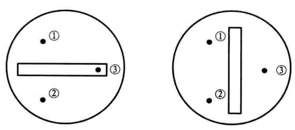
#### 读数装置 *填2023.6*
读数游标窗有I窗和II窗两个,**它们相隔180°**
角游标读法:读取刻度盘上某一刻线与角游标刻线对齐的角游标刻线上的角度数据:将这两个角度数据相加作为当前角度值。图中读得角度为105°20'+10'30"=105°30'30"。
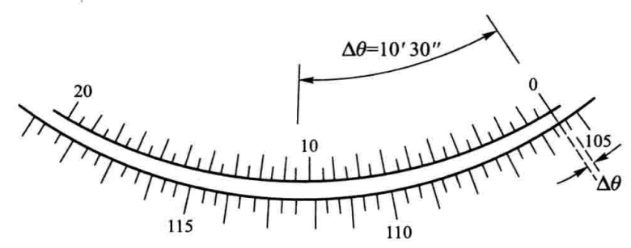
### 实验原理
#### 反射法测三棱镜棱角
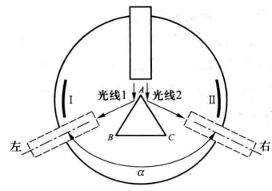

**三棱镜中相邻两个光学平面之间的夹角称为棱角**。*(2021)* 用一束**平行光**入射到三棱镜的棱角。两反射光线的夹角$\alpha$与棱角$\angle A$的关系

$$\angle A = \frac{\alpha}{2}$$

**为了消除仪器的偏心差** *(填2019)* ，使用左右两窗读数。
#### 自准直法 *图(2023.9)*
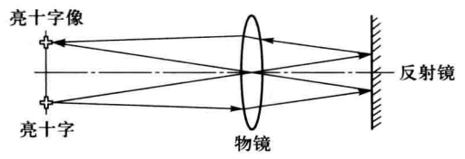

在载物平台上放一镜面垂直于望远镜光轴的平面反射镜。调节亮十字与物镜之间的距离(即调焦),如果亮十字恰好处于物镜的焦平面上,则**亮十字上任意一点发出的光经物镜变为平行光（意思就是看透镜右边有两对平行线就行）**,此平行光由反射镜反射回来,经物镜后所成亮十字像应准确地处在亮十字所在平面上。所以在调焦过程中只要在亮十字所在平面上看到反射回来的清晰的亮十字像时,望远镜已**调焦无穷远（自准直法的目的）** *(填，2019)* 了。这个调焦方法叫做自准直法。
##### 混淆项 *(2023.9)*
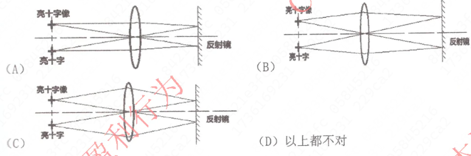
答案是C
### 实验内容（必考）
#### 分光计的调整
分光计在实验中通常用来测量光通过各种光学元件后的偏转角度,因此必须保证:
- 入射光线是平行光(即要求平行光管发射平行光);
- 望远镜能接收平行光(即要求望远镜调焦到无穷远);
- 平行光管和望远镜的光轴与分光计中心轴垂直即要求从三棱镜的AB和AC两面反射的光在同一平面上。
**分光镜实验中的三个垂直：**
**望远镜光轴、载物平台面、平行光管光轴与中心转轴垂直** *（填2020）*
##### 粗调
开启分光计电源,在载物平台上放一镜面垂直于望远镜光轴的平面反射镜，**通过目测法调节望远镜倾斜度调节螺钉,使望远镜光轴基本与分光计中心轴直**。**通过目测法调节载物平台下面三个倾斜度调节螺钉,使载物平台平面初步垂直分光计中心轴**。如果目测望远镜或载物平台明显不水平,在望远镜中就很难找到绿色亮十字反射像了,这是因为反射像超出了望远镜视场范围。
##### 将望远镜调焦无穷远
首先,将平面反射镜放置于载物平台上,反光面正对着望远镜。然后,调整目镜调节滚轮,直到清晰地看到“十”形叉丝为止。接着,**调节望远镜倾斜螺钉**，同时微微地左右移动,直到找到亮十字像为止。最后,**调节望远镜十字调焦螺钉**,直到看到清晰的亮十字像,并再次**调节望远镜倾斜螺钉**,使得亮十字像与“十”形叉丝的上刻线重合。这时,望远镜已经**调焦到无穷远**了。
**（总结一下，通过调节倾斜螺钉将望远镜调焦到无穷远，即自准直法）**
##### 调整望远镜光轴、载物平台面分别与分光计中心转轴垂直

###### 第一步

在载物台三只倾斜度调整螺钉①、②、③中任选两只,例如①、②,将反射镜面垂直平分①、②连线放置,并将望远镜正对反射镜的一个反射面,调节望远镜倾斜螺钉,同时微微地左右移动望远镜,直到找到亮十字像为止,然后,**微调望远镜倾斜螺钉,使得亮十字像处于“十”叉丝的上刻线偏上位置。** **接着将载物台转过180°(注意不要移动反射镜),这时反射镜的另一反射面正对望远镜。（1）**

这时,如果望远镜光轴、载物平台面分别与分光计中心转轴不垂直,那么会在望远镜中出现亮十字像偏上、偏下或看不到三种情况。

假如看不到亮十字像,则调节望远镜倾斜螺钉,确认亮十字像是太偏上出去还是太偏下出去:如果太偏上出去,则调望远镜倾斜脚,使亮十字像往下走目视大小1cm位移,然后再将载物台转过180°,观察此时的亮十字像要能在目镜观察窗内,否则调节望远镜倾斜螺丝,直到亮十字像还处在“十”形叉丝的上刻线偏上位置,重复上述步骤,直到用反射镜两反射面都能看到亮十字像为止;
**（如果太上就调望远镜倾角螺钉让像大概往下走1cm，然后转一圈还能看到是我们的目标，如果转一圈看不到了就重复（1）号步骤，再按这个步骤走）**

如果太偏下出去,则调载物**平台下倾斜螺钉①、②**,使亮十字像往上走目视大小1cm位移,然后再将载物台转过180°,观察此时的亮十字像要能在目镜观察窗内,否则调节载物平台下倾斜螺钉①、②,直到亮十字还处在“十”形叉丝的上刻线偏上位置,重复上述步骤,直到用反射镜两反射面都能看到亮十字像为止。
**（如果太下就调载物平台，太上就调望远镜倾角螺丝，下面也是一样）**
**直接记的话，太上调上面的螺丝（望远镜倾角螺丝），太下调下面的螺丝（载物平台）**

假如看到的亮十字像偏上(即在“一”形叉丝的上刻线上面),则反复转动载物平台,并调节望远镜倾斜螺钉,直到反射的亮十字像处在“十”形叉丝的上刻线上重合。

假如看到的亮十字像偏下(即在“一”形叉丝的上刻线下面),则调节载物**平台倾斜螺钉①、②**,使两面反射的亮十字像相对于“十”形叉丝的上刻线垂直距离各减小一半(这叫二分之一调节法),重复上述步骤,逐步逼近反射镜两面反射的亮十字像,直至重合在“十”形叉丝的上刻线上。

###### 第二步
将反射镜改放在与①、②脚连线平行的平台面的直径上,调节螺钉③,亮十字像与“一”形叉丝的上刻线重合。注意此时不能再调螺钉①、②及望远镜倾斜螺钉了。

**实验中,望远镜和载物台调好后,它们的倾斜螺钉都不能再动了。**
#### 调整平行光管光轴与分光计中心转轴垂直
移走载物平台上的反射镜,利用已调好的望远镜,**调节平行光管狭缝至透镜的距离**,使在望远镜中能看到狭缝清晰的像,即缝像与“十”形叉丝无视差,这时平行光管已发射平行光。然后,转动狭缝器,使平行光水平射出,再**调节平行光管倾斜度使平行光处于“十”形叉丝的下刻线上重合**。最后,再转动狭缝器,将平行光竖立放置并调节狭缝大小约目视2mm。此时平行光管光轴与分光计转轴也垂直了。
#### 测量三棱镜棱角
将三棱镜安放在载物平台上,**三棱镜顶角对准平行光管的中心**,使平行光分成两半,在AB和AC面上反射出去,并且**三棱镜顶角应接近平台中心偏上一点点位置,否则望远镜中会看不到反射光**。测量左右两反射光线的角位置,就可算得棱镜顶角大小。每次测量时稍微改变三棱镜顶角接近平台中心的位置。
## 大题举例 *(2023)*
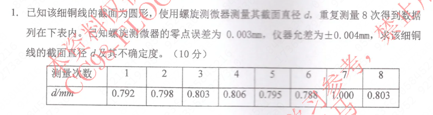
注意点：
1. 剔除粗大误差1.000
2. 减去零点误差