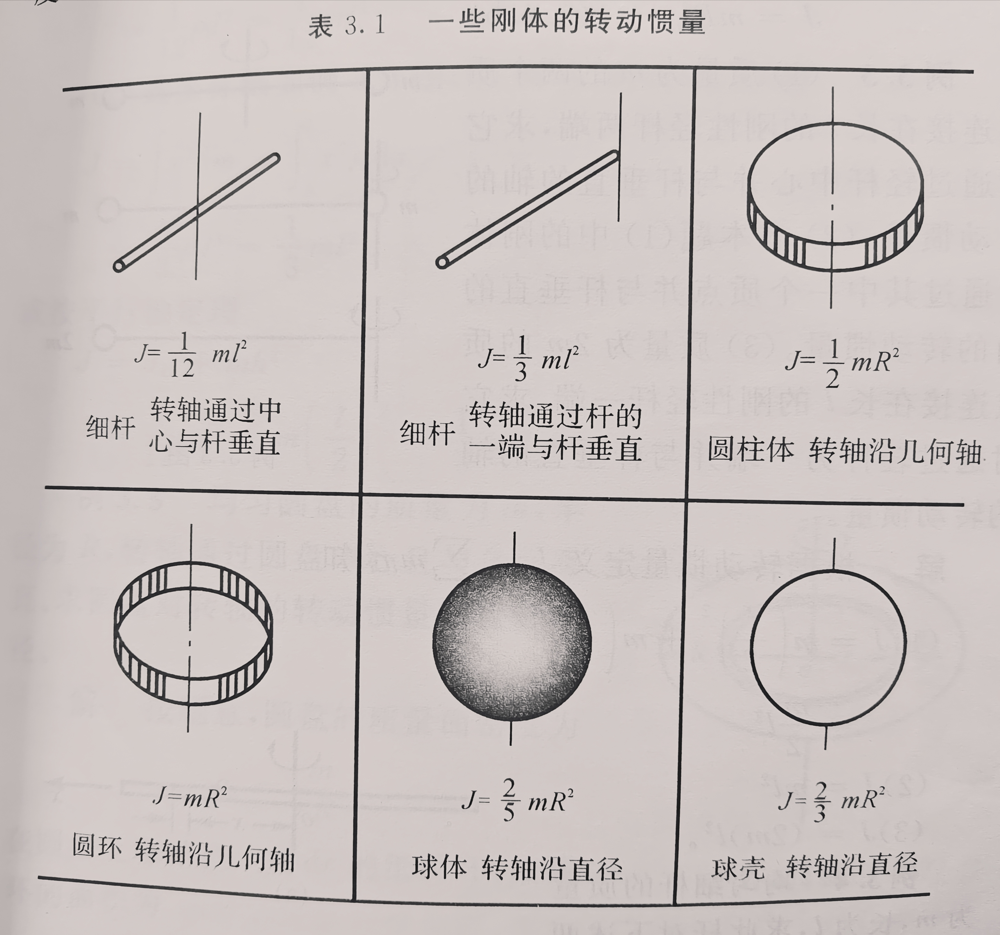
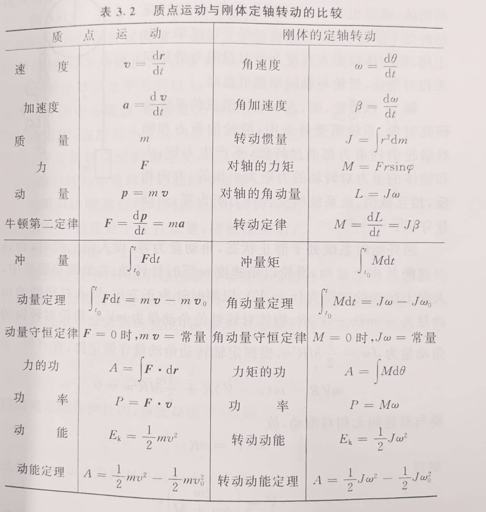
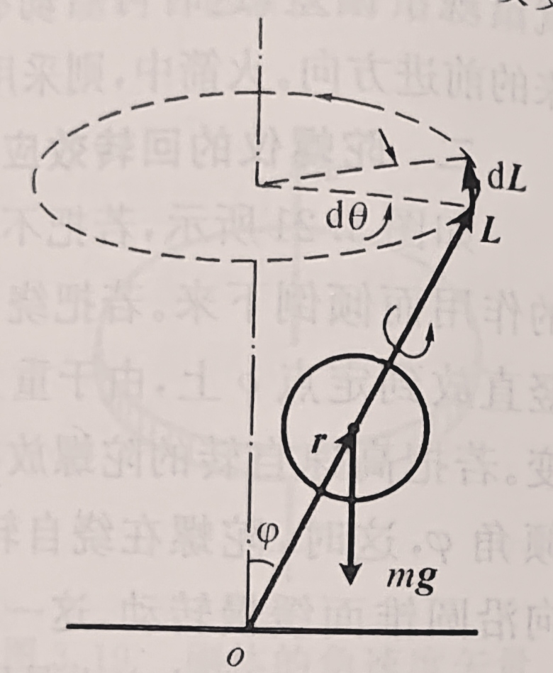
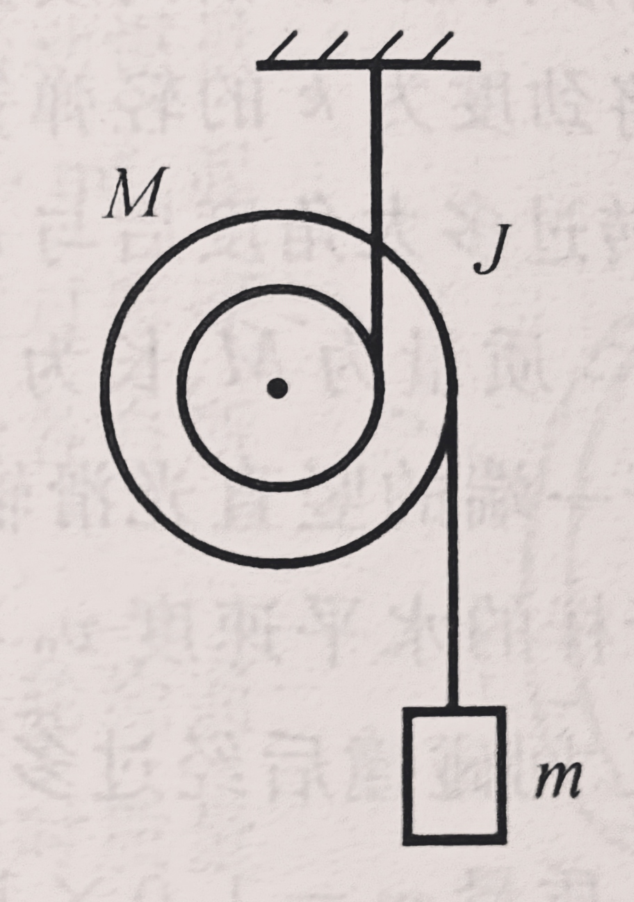

#! https://zhuanlan.zhihu.com/p/691635569
# 大学物理1期中复习
# 公式部分
## 刚体力学
### 转动惯量
</img>
### 平行轴定理
刚体对任一转轴的转动惯量为$J$，对通过质心的平行轴的转动惯量$J_C$，两轴之间的距离为$h$，则有
$$J=J_C+mh^2$$
### 垂直轴定理
若刚体薄板在$xy$平面内，对$x$轴和$y$轴的转动惯量分别为$J_x$和$J_y$，则薄板对$z$轴的转动惯量为
$$J_z=J_x+J_y$$
### 公式比较
</img>
### 陀螺仪
设$\varphi$为自转轴和竖直轴之间的夹角，$J$为陀螺绕自转轴的转动惯量，$\omega$为自转角速度，$r$为质心与定点$o$之间的距离  
</img>  
旋进角速度大小
$$\Omega = \frac{mgr}{J\omega}$$
自转方向与旋进方向相同。
## 流体力学简介
### 伯努利方程
设管道中完全不可压缩和完全无粘滞性的理想流体，则对任一截面
$$pV+\frac{1}{2}mv^2+mgh=C$$
$C$为常量  
也可以写成
$$p+\frac{1}{2}\rho v^2+\rho gh=C$$
### 压强和流速的关系
若管道是水平的
$$p+\frac{1}{2}\rho v^2=C$$
## 狭义相对论
### 洛伦兹变换
假设有两个惯性系$K$和$K'$,对应坐标轴互相平行，$K'$系相对$K$系以速度$u$沿$x$轴正方向做匀速直线运动，并设$t=t'=0$时两个原点$o$和$o'$恰好重合。若某事件在$K$系（一般是地面）中是$t$时刻发生在$(x,y,z)$处，而同一时间在$K'$系（一般是列车等相对地面高速运动的参考系）中是$t'$时刻发生在$(x',y',z')$处，则有
$$\begin{cases}
\displaystyle x'=\frac{x-ut}{\sqrt{1-\frac{u^2}{c^2}}}\\
\displaystyle y'=y\\
z'=z\\
\displaystyle t'=\frac{t-\frac{ux}{c^2}}{\sqrt{1-\frac{u^2}{c^2}}}
\end{cases}
$$
设想$K$系相对$K'$系以$-u$运动，即得其逆变换
$$\begin{cases}
\displaystyle x=\frac{x'+ut'}{\sqrt{1-\frac{u^2}{c^2}}}\\
\displaystyle y=y'\\
z=z'\\
\displaystyle t=\frac{t'+\frac{ux'}{c^2}}{\sqrt{1-\frac{u^2}{c^2}}}
\end{cases}
$$
### 爱因斯坦速度变换
$$\begin{cases}
\displaystyle v_x'=\frac{v_x-u}{1-\frac{uv_x}{c^2}}\\\\
\displaystyle v_y'=\frac{v_y\sqrt{1-\frac{u^2}{c^2}}}{1-\frac{uv_x}{c^2}}\\\\
\displaystyle v_z'=\frac{v_z\sqrt{1-\frac{u^2}{c^2}}}{1-\frac{uv_x}{c^2}}\end{cases}
$$
逆变换
$$
\begin{cases}
\displaystyle v_x=\frac{v_x'+u}{1+\frac{uv_x'}{c^2}}\\\\
\displaystyle v_y=\frac{v_y'\sqrt{1-\frac{u^2}{c^2}}}{1+\frac{uv_x'}{c^2}}\\\\
\displaystyle v_z=\frac{v_z'\sqrt{1-\frac{u^2}{c^2}}}{1+\frac{uv_x'}{c^2}}\end{cases}
$$
### 长度收缩
设$K$系中沿$x$轴有一静止的杆，两个端点的空间坐标分别为$x_1$和$x_2$，即杆在$K$系中的长度为$l_0=x_2-x_1$  
则在$K'$系中杆的长度$l'$为
$$l'=(x_2-x_1)\sqrt{1-\frac{u^2}{c^2}}$$
杆在与杆相对静止的参照系中的长度称为**固有长度**或者**静长**。  
从公式中可以看出  
**在相对杆静止的惯性系中，杆的长度最大，等于杆的固有长度$l_0$。  
在相对杆运动的惯性系中，杆沿运动方向的长度必小于固有长度。**
### 时间膨胀
设在$K$系中的同一地点先后发生两个事件，其时空坐标分别为$(x,t_1),(x,t_2)$，$K$系中两个事件的时间间隔为$\Delta t_0=t_2-t_1$  
在$K'$系中，这两个事件的时间间隔$\Delta t'$为
$$\Delta t'=\frac{\Delta t_0}{\sqrt{1-\frac{u^2}{c^2}}}$$
从公式中可以看出  
**若在某惯性系中，两个事件发生在同一地点，则在这个惯性系中测得这两个事件的时间间隔最短，为固有时间$\Delta t_0$  
在其他惯性系中，这两个事件发生在不同地点，测得这两个事件的时间间隔大于固有时间。**
### 质速关系
静止质量为$0$的物体以速度$v$运动时的质量$m$
$$m=\frac{m_0}{\sqrt{1-\frac{v^2}{c^2}}}$$
### 狭义相对论动力学方程
$$\mathbf{p}=m\mathbf{v}=\frac{m_0\mathbf{v}}{\sqrt{1-\frac{v^2}{c^2}}}$$
### 动能
$$E_k=m_0c^2(\frac{1}{\sqrt{1-\frac{v^2}{c^2}}}-1)$$
即物体的动能等于因运动而增加的质量与光速二次方的乘积
### 质能方程
$$E=mc^2$$
这里的$m$是运动质量，$E$是总能量  
物体的静止能量即
$$E_0=m_0c^2$$
### 能动关系
$$E^2=p^2c^2+m_0^2c^4$$

# 考题部分
## 质点运动学
### 关于$a,v,x$的求解
（2021 T1）一质点沿$x$轴运动，其加速度$a$与位置坐标$x$的关系为$a=2+6x^2$，如果质点在原点处的速度为$0$，求在任意位置处的速度。  
解： 
$$a=\frac{dv}{dx}\frac{dx}{dt}=v\frac{dv}{dx}$$
即
$$v\frac{dv}{dx}=2+6x^2$$
$$\displaystyle \int^v_0vdv=\int^x_0(2+6x^2)dx$$
解得$v=2\sqrt{x+x^3}$  
（2021 T17）飞机降落时的着地速度大小$v_0=90km/h$，方向与地面平行，飞机与地面间的摩擦系数$\mu=0.10$,迎面空气阻力为$C_xv^2$，升力为$C_yv^2$（$v$是飞机在跑道上的滑行速度，$C_x$和$C_y$为某两常量）.已知飞机的升阻比$K=\frac{C_y}{C_x}=5$.求飞机从着地到停止这段时间所滑行的距离。（设飞机刚着地时对地面无压力）
$$\begin{cases}
F_N=mg-C_yv^2\\
mg-C_yv_0^2=0\\
F_{f1}=\mu F_N\\
F_{f2}=C_xv^2\\
-F_{f1}-F_{f2}=ma\\
K=\frac{C_y}{C_x}
\end{cases}$$
解得
$$a=-\mu g-\frac{g(1-\mu K)}{Kv_0^2}v^2$$
$$a=\frac{dv}{dx}\frac{dx}{dt}=v\frac{dv}{dx}=-\mu g-\frac{g(1-\mu K)}{Kv_0^2}v^2$$
即
$$\displaystyle \int^0_{v_0}-\frac{v}{\mu +\frac{(1-\mu K)}{Kv_0^2}v^2}dv=\int^x_{0}gdx$$
解得
$$x=-\frac{Kv_0^2\ln \mu K}{2g(1-\mu K)}=211(m)$$
<<<<<<< HEAD
## 质点动力学
(2021 T8)一喷气式飞机以$200m/s$的速度在空中飞行，燃气轮机每秒钟吸入$50kg$空气，与$2kg$燃料混合燃烧后，相对飞机以$400m/s$的速度向后喷出，求该燃气轮机的推力。  
解：  
只要搞清楚各部分的速度变化。空气初速度为$0$，末速度为$-200m/s$;燃料初速度为$200m/s$，末速度为$-200m/s$  
由此可以列出动量定理：
$$F=\Delta v_{空}\frac{dm_{空}}{dt}+\Delta v_{燃}\frac{dm_{燃}}{dt}=200m/s\cdot50kg+400m/s\cdot2kg=10800N$$
## 刚体力学
### 滑轮问题
（2021 T18）半径为$r_1=0.04m$和$r_2=0.10m$的两个短圆柱同心地装在一起，总质量为$M=8.0kg$，绕对称轴的转动惯量为$J=0.03kg\cdot m^2$.小圆柱上绕有轻绳，绳的上端固定在天花板上。大圆柱上也绕有轻绳，绳的下端挂一质量为$m=6.0kg$的物体。求圆柱体的角加速度、质心加速度、物体的加速度和绳中的张力。
  
解：
最需要搞清楚的是绳子的状态  
上面的绳子是没有速度和加速度的，小圆柱和绳子进行紧紧贴合的滚动就好像圆柱在地面上做纯滚动一样。下面的绳子是有速度和加速度的。
   
假设上面的绳子张力为$F_{T1}$,下面的绳子张力为$F_{T2}$，质心的加速度为$a_c$，物体的加速度为$a$。  
对上面的绳子和小圆柱进行分析，可以列出
$$a_c=\beta r_1$$
对下面的绳子和大圆柱进行分析，由于绳子和圆柱直接没有摩擦，也就是说接触点上的加速度相同，有
$$\beta r2 -a_c=a$$
上式左边是轮子上接触点的加速度，右边是绳子的加速度。  
绳子的加速度就是物体的加速度。
$$mg-F_{T2}=ma$$
对圆柱分析   
转动定律
$$F_{T2}r_2-F_{T1}r_1=J\omega$$
质心运动定律
$$F_{T1}-F{T2}-Mg=Ma_c$$
解得
$$\begin{cases}
\beta = 6.09(rad/s^2)\\
a_c = 0.244(m/s^2)\\
a=0.365(m/s^2)\\
T_1 = 137(N)\\
T_2=56.6(N)
\end{cases}$$
