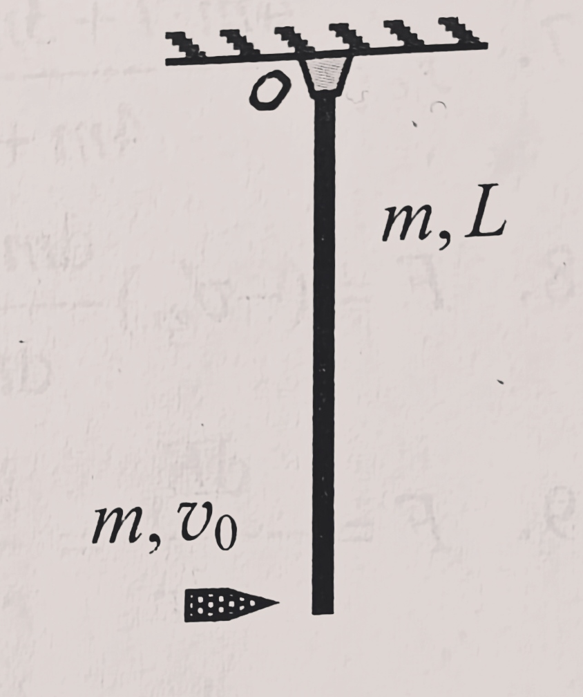
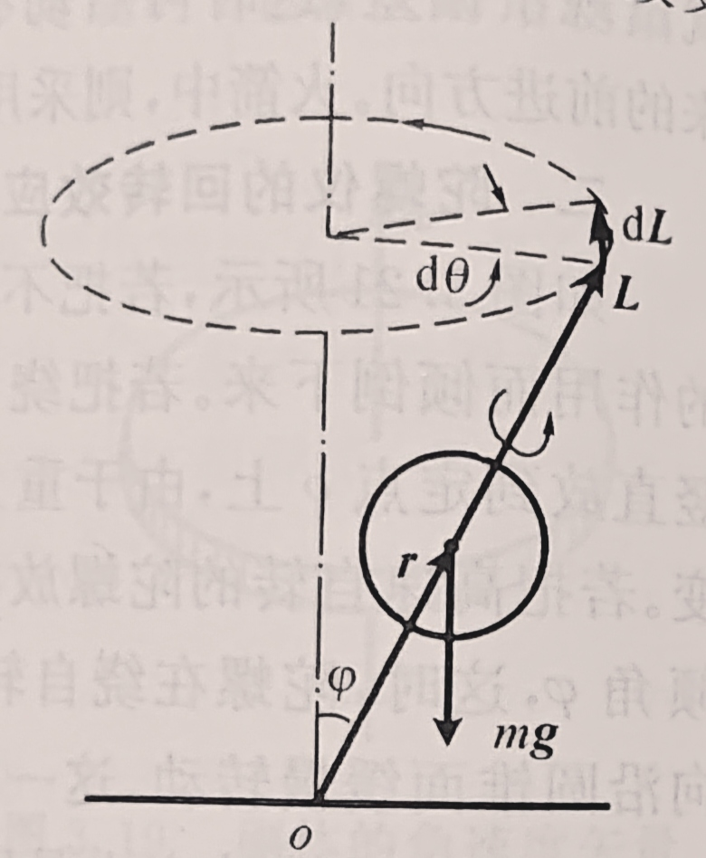

# 大学物理1期末复习
## 质点运动学
（2021 T1）一质点沿$x$轴运动，其加速度$a$与位置坐标$x$的关系为$a=2+6x^2$，如果质点在原点处的速度为$0$，求在任意位置处的速度。  
解： 
$$a=\frac{dv}{dx}\frac{dx}{dt}=v\frac{dv}{dx}$$
即
$$v\frac{dv}{dx}=2+6x^2$$
$$\displaystyle \int^v_0vdv=\int^x_0(2+6x^2)dx$$
解得$v=2\sqrt{x+x^3}$  
（2021 T17）飞机降落时的着地速度大小$v_0=90km/h$，方向与地面平行，飞机与地面间的摩擦系数$\mu=0.10$,迎面空气阻力为$C_xv^2$，升力为$C_yv^2$（$v$是飞机在跑道上的滑行速度，$C_x$和$C_y$为某两常量）.已知飞机的升阻比$K=\frac{C_y}{C_x}=5$.求飞机从着地到停止这段时间所滑行的距离。（设飞机刚着地时对地面无压力）
$$\begin{cases}
F_N=mg-C_yv^2\\
mg-C_yv_0^2=0\\
F_{f1}=\mu F_N\\
F_{f2}=C_xv^2\\
-F_{f1}-F_{f2}=ma\\
K=\frac{C_y}{C_x}
\end{cases}$$
解得
$$a=-\mu g-\frac{g(1-\mu K)}{Kv_0^2}v^2$$
$$a=\frac{dv}{dx}\frac{dx}{dt}=v\frac{dv}{dx}=-\mu g-\frac{g(1-\mu K)}{Kv_0^2}v^2$$
即
$$\displaystyle \int^0_{v_0}-\frac{v}{\mu +\frac{(1-\mu K)}{Kv_0^2}v^2}dv=\int^x_{0}gdx$$
解得
$$x=-\frac{Kv_0^2\ln \mu K}{2g(1-\mu K)}=211(m)$$
### 密舍尔斯基方程
以主体和流动物组成的质点系为研究对象，设$t$时刻，主体的质量为$m$，速度为$\mathbf{v}$，所受合外力为$\mathbf{F}$，流动物相对主体的速度为$\mathbf{v'}$
$$m\frac{d\mathbf{v}}{dt}=\mathbf{F}+\mathbf{v'}\frac{dm}{dt}$$
(2021 T8)一喷气式飞机以$200m/s$的速度在空中飞行，燃气轮机每秒钟吸入$50kg$空气，与$2kg$燃料混合燃烧后，相对飞机以$400m/s$的速度向后喷出，求该燃气轮机的推力。  
解：  
只要搞清楚各部分的速度变化。空气初速度为$0$，末速度为$-200m/s$;燃料初速度为$200m/s$，末速度为$-200m/s$  
由此可以列出动量定理：
$$F=\Delta v_{空}\frac{dm_{空}}{dt}+\Delta v_{燃}\frac{dm_{燃}}{dt}=200m/s\cdot50kg+400m/s\cdot2kg=10800N$$
## 刚体力学
### 转动惯量
</img>

### 平行轴定理
刚体对任一转轴的转动惯量为$J$，对通过质心的平行轴的转动惯量$J_C$，两轴之间的距离为$h$，则有
$$J=J_C+mh^2$$
### 垂直轴定理
若刚体薄板在$xy$平面内，对$x$轴和$y$轴的转动惯量分别为$J_x$和$J_y$，则薄板对$z$轴的转动惯量为
$$J_z=J_x+J_y$$
### 公式比较
</img>
(2021 T19) 一长度为$L$，质量为$m$的均匀细棒，可绕通过其一端的光滑轴$o$在竖直平面内转动，开始时静止在竖直位置，今有一质量也为$m$的子弹以水平速度$v_0$击中其下端，嵌入并留在细棒中。假定碰撞时间极短，求碰撞后瞬间$o$轴对棒和子弹系统的作用力。
  
解：  
明确这个力是什么样的，先看维持题目所说的运动状态需要什么力  
如果把杆和子弹看成一个质点，那么很明显，$o$轴提供的力应该是向心力  
虽然这里是刚体问题，但是也是一样的，而且看成质点的思想可以通过质心运动定律来实现。
$$F-2mg=F_n=2m\omega^2x_c$$
其中$x_c$相当容易求解
$$x_c=\frac{mL+m\cdot\frac{L}{2}}{2m}=\frac{3}{4}L$$
由碰撞，$\omega$由角动量守恒求出
$$mv_0L=J\omega$$
其中
$$J=\frac{1}{3}mL^2+mL^2=\frac{4}{3}mL^2$$
求得
$$\omega = \frac{3v_0}{4l}$$
代回第一个式子，可求得
$$F=2mg+\frac{27mv_0^2}{32L}$$
方向向上

（2021 T18）半径为$r_1=0.04m$和$r_2=0.10m$的两个短圆柱同心地装在一起，总质量为$M=8.0kg$，绕对称轴的转动惯量为$J=0.03kg\cdot m^2$.小圆柱上绕有轻绳，绳的上端固定在天花板上。大圆柱上也绕有轻绳，绳的下端挂一质量为$m=6.0kg$的物体。求圆柱体的角加速度、质心加速度、物体的加速度和绳中的张力。
  
解：  
最需要搞清楚的是绳子的状态  
上面的绳子是没有速度和加速度的，小圆柱和绳子进行紧紧贴合的滚动就好像圆柱在地面上做纯滚动一样。下面的绳子是有速度和加速度的。
   
假设上面的绳子张力为$F_{T1}$,下面的绳子张力为$F_{T2}$，质心的加速度为$a_c$，物体的加速度为$a$。  
对上面的绳子和小圆柱进行分析，可以列出
$$a_c=\beta r_1$$
对下面的绳子和大圆柱进行分析，由于绳子和圆柱直接没有摩擦，也就是说接触点上的加速度相同，有
$$\beta r_2 -a_c=a$$
上式左边是轮子上接触点的加速度，右边是绳子的加速度。  
绳子的加速度就是物体的加速度。
$$mg-F_{T2}=ma$$
对圆柱分析   
转动定律
$$F_{T2}r_2-F_{T1}r_1=J\omega$$
质心运动定律
$$F_{T1}-F{T2}-Mg=Ma_c$$
解得
$$\begin{cases}
\beta = 6.09(rad/s^2)\\
a_c = 0.244(m/s^2)\\
a=0.365(m/s^2)\\
T_1 = 137(N)\\
T_2=56.6(N)
\end{cases}$$
### 回转半径
$$R_G=\sqrt{\frac{J}{m}}$$
### 陀螺仪
设$\varphi$为自转轴和竖直轴之间的夹角，$J$为陀螺绕自转轴的转动惯量，$\omega$为自转角速度，$r$为质心与定点$o$之间的距离  
</img>  
旋进角速度大小
$$\Omega = \frac{mgr}{J\omega}$$
自转方向与旋进方向相同。

## 流体力学简介
### 伯努利方程
设管道中完全不可压缩和完全无粘滞性的理想流体，则对任一截面
$$pV+\frac{1}{2}mv^2+mgh=C$$
$C$为常量  
也可以写成
$$p+\frac{1}{2}\rho v^2+\rho gh=C$$
### 压强和流速的关系
若管道是水平的
$$p+\frac{1}{2}\rho v^2=C$$

(2021T16)  
两端开口的U形管一端在机外，空气相对该端口运动；另一端在机内，端口内空气相对速度为0.已知空气的密度为$1.36kg/m^3$，U形管内水银液面高度差为$20.0cm$，水银的密度为$13.6\times10^3kg/m^3$，本题重力加速度取$10m/s^2$，求飞机的速度。  
解：  
对空气用伯努利方程
$$p_1+\frac{1}{2}\rho v_1^2=p_2+\frac{1}{2}\rho v_2^2$$
由$v_2=0$知
$$v_1=\sqrt{\frac{2(p2-p1)}{\rho_{气}}}$$
而
$$p2-p1 =\rho _汞 g\Delta h$$
带入即得
$$v_1=200m/s$$

## 狭义相对论
### 洛伦兹变换
假设有两个惯性系$K$和$K'$,对应坐标轴互相平行，$K'$系相对$K$系以速度$u$沿$x$轴正方向做匀速直线运动，并设$t=t'=0$时两个原点$o$和$o'$恰好重合。若某事件在$K$系（一般是地面）中是$t$时刻发生在$(x,y,z)$处，而同一事件在$K'$系（一般是列车等相对地面高速运动的参考系）中是$t'$时刻发生在$(x',y',z')$处，则有
$$\begin{cases}
\displaystyle x'=\frac{x-ut}{\sqrt{1-\frac{u^2}{c^2}}}\\
\displaystyle y'=y\\
z'=z\\
\displaystyle t'=\frac{t-\frac{ux}{c^2}}{\sqrt{1-\frac{u^2}{c^2}}}
\end{cases}
$$
设想$K$系相对$K'$系以$-u$运动，即得其逆变换
$$\begin{cases}
\displaystyle x=\frac{x'+ut'}{\sqrt{1-\frac{u^2}{c^2}}}\\
\displaystyle y=y'\\
z=z'\\
\displaystyle t=\frac{t'+\frac{ux'}{c^2}}{\sqrt{1-\frac{u^2}{c^2}}}
\end{cases}
$$
### 爱因斯坦速度变换
$$\begin{cases}
\displaystyle v_x'=\frac{v_x-u}{1-\frac{uv_x}{c^2}}\\\\
\displaystyle v_y'=\frac{v_y\sqrt{1-\frac{u^2}{c^2}}}{1-\frac{uv_x}{c^2}}\\\\
\displaystyle v_z'=\frac{v_z\sqrt{1-\frac{u^2}{c^2}}}{1-\frac{uv_x}{c^2}}\end{cases}
$$
逆变换
$$
\begin{cases}
\displaystyle v_x=\frac{v_x'+u}{1+\frac{uv_x'}{c^2}}\\\\
\displaystyle v_y=\frac{v_y'\sqrt{1-\frac{u^2}{c^2}}}{1+\frac{uv_x'}{c^2}}\\\\
\displaystyle v_z=\frac{v_z'\sqrt{1-\frac{u^2}{c^2}}}{1+\frac{uv_x'}{c^2}}\end{cases}
$$
（2021T14）
一艘宇宙飞船的船身固有长度为$L_0=90m$，相对于地面以$v=0.8c$的速度在地面观测站上空飞过，求观测站测得飞船的船身通过观测站的时间间隔和船上宇航员测得船身通过观测站的时间间隔。  
解：  
在地面参考系中，飞船的长度
$$L=L_0\sqrt{1-\frac{v^2}{c^2}}=54m$$
时间
$$t_0=\frac{L}{v}=2.25\times 10^{-7}s$$
在飞船参考系中
$$t=\frac{t_0}{\sqrt{1-\frac{v^2}{c^2}}}=3.75\times 10^{-7}s$$
也可以是
$$t=\frac{L_0}{v}=3.75\times10^{-7}s$$
### 长度收缩
设$K$系中沿$x$轴有一静止的杆，两个端点的空间坐标分别为$x_1$和$x_2$，即杆在$K$系中的长度为$l_0=x_2-x_1$  
则在$K'$系中杆的长度$l'$为
$$l'=(x_2-x_1)\sqrt{1-\frac{u^2}{c^2}}$$
杆在与杆相对静止的参照系中的长度称为**固有长度**或者**静长**。  
从公式中可以看出  
**在相对杆静止的惯性系中，杆的长度最大，等于杆的固有长度$l_0$。  
在相对杆运动的惯性系中，杆沿运动方向的长度必小于固有长度。**
### 时间膨胀
设在$K$系中的同一地点先后发生两个事件，其时空坐标分别为$(x,t_1),(x,t_2)$，$K$系中两个事件的时间间隔为$\Delta t_0=t_2-t_1$  
在$K'$系中，这两个事件的时间间隔$\Delta t'$为
$$\Delta t'=\frac{\Delta t_0}{\sqrt{1-\frac{u^2}{c^2}}}$$
从公式中可以看出  
**若在某惯性系中，两个事件发生在同一地点，则在这个惯性系中测得这两个事件的时间间隔最短，为固有时间$\Delta t_0$  
在其他惯性系中，这两个事件发生在不同地点，测得这两个事件的时间间隔大于固有时间。**
### 质速关系
静止质量为$0$的物体以速度$v$运动时的质量$m$
$$m=\frac{m_0}{\sqrt{1-\frac{v^2}{c^2}}}$$
### 狭义相对论动力学方程
$$\mathbf{p}=m\mathbf{v}=\frac{m_0\mathbf{v}}{\sqrt{1-\frac{v^2}{c^2}}}$$
### 动能
$$E_k=m_0c^2(\frac{1}{\sqrt{1-\frac{v^2}{c^2}}}-1)$$
即物体的动能等于因运动而增加的质量与光速二次方的乘积
### 质能方程
$$E=mc^2$$
这里的$m$是运动质量，$E$是总能量  
物体的静止能量即
$$E_0=m_0c^2$$
### 能动关系
$$E^2=p^2c^2+m_0^2c^4$$

## 机械振动
### 简谐振动
振幅为$A$，角频率为$\omega$，初相为$\varphi$的简谐振动
$$x=A\cos(\omega t+\varphi),T=\frac{2\pi}{\omega}$$
$$v=\frac{dx}{dt}=-\omega A\sin(\omega t+\varphi)$$
$$a=\frac{d^2{x}}{dt^2}=-\omega^2A\cos(\omega t +\varphi)$$

### 振幅矢量图示法

### 谐振动的运动方程
振动系统中，$\omega$为振动系统的固有频率，$t=0$时的位移为$x_0$，速度为$v_0$。
$$\omega=\sqrt{\frac{k}{m}}$$
$$A=\sqrt{x_0^2+\left(\frac{v_0}{\omega}\right)^2}$$
$$\varphi = \arctan\frac{-v_0}{\omega x_0}$$
注意：可以解得两个$\varphi$值，一般借助参考圆方法来决定是哪个解

(2021 T13)一劲度系数为$k$的轻弹簧下端固定，上端系一轻绳。轻绳绕过定滑轮和质量为$m$的物体连接，如图所示。定滑轮可视为半径为$R$、质量为$M$的圆盘，可绕无摩擦的水平轴转动。试求该装置的振动周期

平衡状态下$mg=kx_0$，$x_0$为平衡状态下弹簧的形变量
$$\begin{cases}mg-F_T=ma\\F_TR-k(x_0+x)R=J\beta\\J=\frac{1}{2}MR^2\\a=\beta R \end{cases}$$
解得
$$a=-\frac{2k}{2m+M}x$$
$$\omega = \sqrt{\frac{2k}{2m+M}}$$
$$T=\frac{2\pi}{\omega}=2\pi\sqrt{\frac{2m+M}{2k}}$$
### 谐振动的能量
$$E=\frac{1}{2}kA^2$$
由
$$\frac{1}{2}kA^2=\frac{1}{2}mv^2+\frac{1}{2}kx^2$$
可得
$$x=\pm \sqrt{\frac{k}{m}(A^2-x^2)}$$

(书本例5.4)
设一个水平放置的弹簧振子，所系物体的质量为$m$，弹簧的劲度系数为$k$，质量为$m$，延长度均匀分布。证明在没有摩擦阻力的情况下该物体做简谐振动，并求振动的频率。
解：
距离弹簧左端$\xi$处的质量元$dm$的速度$v_s$与$\xi$成正比，即
$$v_s=\frac{v}{l}\xi$$
质量元具有的动能为
$$dE_{ks}=\frac{1}{2}dm_sv_s^2=\frac{1}{2}\left(\frac{m_s}{l}d\xi\right)\left(\frac{v}{l}\xi\right)^2$$
弹簧动能
$$E_{ks}=\displaystyle\int dE_s = \frac{1}{2}\frac{m_sv^2}{l^3}\int^l_0\xi^2d\xi=\frac{1}{2}\left(\frac{m_s}{3}\right)v^2$$
振动系统的总动能
$$E_k=\frac{1}{2}mv^2+E_{ks}=\frac{1}{2}\left(\frac{m_s}{3}+m\right)v^2$$
总振动能量
$$E=\frac{1}{2}kx^2+\frac{1}{2}\left(\frac{m_s}{3}+m\right)v^2$$
对比简谐运动的总能量公式，即
$$E=\frac{1}{2}mv^2+\frac{1}{2}kx^2$$
可等价为物体质量为$\frac{m_s}{3}+m$的（轻）弹簧振子。后略。
</img>

### 扭摆

扭摆产生的弹性恢复力矩与扭转角成正比，扭摆的运动也是谐振动。设物体相对平衡位置转过了角度$\theta$，则恢复力矩为
  

$$\tau=-k\theta$$

### 稳定平衡位置附近的振动
没有摩擦阻力的情况下，物体在稳定平衡位置附近的小振动均可近似看为简谐振动。在那个点处有
$$k=-\frac{dF}{dx}=\frac{d^2E_p}{dx^2}$$
### 单摆
$$\omega=\sqrt{\frac{g}{l}}$$
$$T=\frac{2\pi}{\omega}=2\pi\sqrt{\frac{l}{g}}$$
### 复摆
$$T=2\pi\sqrt{\frac{J}{mgl}}$$
其中$J$为转动惯量，$l$为重心到转轴的距离

### 振动合成
</img>

一般画图进行分析。
#### 同方向同频率的合成
$$A=\sqrt{A_1^2+A_2^2+2A_1A_2\cos(\varphi_2-\varphi_1)}$$
$$\varphi = \arctan\frac{A_1\sin\varphi_1+A_2\sin\varphi_2}{A_1\cos\varphi_1+A_2\cos\varphi_2}$$
特别的，若同相$A=A_1+A_2$，若反相$A=|A_1-A_2|$
#### 同方向不同频率的合成
为简便设初相为0
$$A=\sqrt{A_1^2+A_2^2+2A_1A_2\cos(\omega_2-\omega_1)t}$$
特别的，$A_1=A_2$时有
$$A=2A_1\cos\frac{\omega_2-\omega_1}{2}t$$
$$x=2A_1\cos\frac{\omega_2-\omega_1}{2}t\cos\frac{\omega_2+\omega_1}{2}t$$
</img>

合振动强弱交替的现象称为拍，单位时间内振动忽强的次数称为拍频
$$\nu_{拍}=\nu_2-\nu_1$$
拍频等于两个分振动频率之差
#### 相互垂直的谐振动的合成
$$x=A_1\cos(\omega t + \varphi_1)$$
$$y = A_2\cos(\omega t + \varphi_2)$$
如果初相相同，即$\varphi_1=\varphi_2$，有
$$y=\frac{A_2}{A_1}x$$
即运动轨迹是一条直线。物体相对原点的位移为
$$r=\sqrt{A_1^2+A_2^2}\cos\omega t$$
如果初相相反，即$\varphi_2-\varphi_1=\pm\pi$
则
$$y=-\frac{A_2}{A_1}x$$
$$r=\sqrt{A_1^2+A_2^2}\cos\omega t$$
相位差为$\frac{\pi}{2}$或$\frac{3\pi}{2}$时
$$\left(\frac{x}{A_1}\right)^2+\left(\frac{y}{A_2}\right)^2=1$$
即运动轨迹为一个椭圆。
$y$方向上的振动相位超前$\frac{\pi}{2}$的情况下，物体顺时针运动，超前$\frac{3\pi}{2}$或落后$\frac{\pi}{2}$的情况下，物体逆时针运动。
## 机械波
### 波函数
#### 平面简谐波  
当$y(0,t)=A\cos \omega t$，波速为$u$时，距离原点$x$的质点运动方程为
$$y(x,t)=A\cos\omega\left(t-\frac{x}{u}\right)$$
显然有
$$v=-A\omega \sin\omega(t-\frac{x}{u})$$
#### 球面简谐波
取离波源为单位距离处的振幅为$A_0$
$$y(r,t)=\frac{A_0}{r}cos\omega (t-\frac{r}{u})$$
### 一维波的运动方程
$F$为绳中张力，$\mu$为绳子的线密度，$u$为绳上横波速度，则有
$$u=\sqrt{\frac{F}{\mu}}$$
绳上纵波速度
$$u=\sqrt{\frac{Y}{\rho}}$$
其中$Y$为杨氏模量，反映棒子的弹性
$$Y=\frac{\dfrac{F}{s}}{\dfrac{\Delta l}{l_0}}$$
$\dfrac{F}{s}$表示棒上单位横截面积的压（拉）力，称为应力，$\dfrac{\Delta l}{l_0}$表示在应力作用下棒的相对长度变化，称为应变
### 波的能量与强度
绳子的平均线能量密度
$$\overline{\left(\frac{\Delta E}{\Delta x}\right)}=\frac{1}{2}\mu A^2\omega^2$$
平均（体）能量密度为
$$\overline{w}=\frac{1}{2}\rho A^2\omega^2$$
波的平均能流密度（**波的强度**）为
$$I=\frac{1}{2}\rho A^2 \omega^2 u$$
球面波的能流密度
$$I=\frac{P_0}{4\pi r^2}$$
### 波的干涉
相位差
$$\Delta \varphi = (\varphi_2-\varphi_1)-\frac{2\pi}{\lambda}(r_2-r_1)$$
振幅
$$A=\sqrt{A_1^2+A_2^2+2A_1A_2\cos\Delta \varphi}$$
当$\Delta \varphi = \pm 2k\pi,k=0,1,...$时干涉相长  
当$\Delta \varphi = \pm (2k+1)\pi,k=0,1,...$时干涉相消  

初相相同时，设波程差为$\delta$  
当$\delta = \pm k\lambda,k=0,1,2...$时干涉相长  
当$\delta = \pm (2k+1)\frac{\lambda}{2},k=0,1,2...$时干涉相消 
### 驻波
两列振幅相同的相干波分别沿$x$轴的正负方向传播
$$y_1=A\cos\left(\omega t -\frac{2\pi}{\lambda}x\right)$$
$$y_2=A\cos\left(\omega t +\frac{2\pi}{\lambda}x\right)$$
$$y=y_1+y_2=2A\cos\frac{2\pi x}{\lambda}\cos \omega t$$
$x=k\frac{\lambda}{2}$处称为波腹，振幅最大，$x=(2k+1)\frac{\lambda}{4}$处称为波腹处称为波节，振幅最小。
有相位差时
$$y=y_1+y_2=2A\cos\left(\frac{2\pi x}{\lambda}+\frac{\varphi_2 - \varphi_1}{2}\right)\cos \left(\omega t+\frac{\varphi_2+\varphi_1}{2}\right)$$
#### 绳子两端固定的驻波
设绳子两端固定点的坐标为0和L
驻波的方程改写为
$$y=2A\sin\frac{2\pi x}{\lambda}\cos \omega t$$
且
$$2\pi\frac{L}{\lambda}=n\pi(n=1,2,3...)$$
则有
$$\lambda_n=\frac{2L}{n},\nu_n=n\frac{u}{2L}$$
$\nu_1$叫做基频，$\nu_2$叫二次谐频，以此类推。
上式可改写为 
$$\nu_n = \frac{n}{2L}\sqrt{\frac{F}{\mu}}$$
#### 一端自由的驻波
特点
1. 振幅不变
2. 自由端是波腹。
$$L=n\frac{\lambda_n}{4},\nu_n=n\frac{u}{4L}(n=1,3,5,...)$$
基频$\nu_1=\frac{u}{4L}$，谐频是基频的奇数倍。
#### 驻波的共振
如上述，驻波也有其一系列固有频率。若驱动力含有这一固有频率则会引起共振。
### 多普勒效应
#### 波源不动，观察者动
设波源频率为$\nu_s$，相对介质的波速为$u$，观察者以相对介质$v_R$的速率朝着波源运动。观察者接收到的频率
$$\nu_R=\frac{u+v_R}{u}\nu_s$$
#### 观察者不动，波源动
波源向观察者运动
$$\nu_R=\frac{u}{u-v_s}\nu_s$$
#### 波源和观察者同一条直线上运动
$$\nu_R=\frac{u+v_R}{u-v_s}\nu_s$$
二者相向运动时速度取正值
#### 光源和接收器在同一直线上运动
$$\nu_R=\sqrt{\frac{c+u}{c-u}}\nu_s$$
$u$是光源和接收器的相对速度，相向运动时取正值

(课本6.52)  
一声源的频率是$10^3Hz$，它相对地面以$20m/s$的速率向右运动，其右方有一反射面相对于地面以$28m/s$的速率向左运动。空气中的声速为$340m/s$.  
(1)声源发出的在空气中传播的声波的波长  
(2)每秒到达反射面的波的数目  
(3)反射波的波长和频率  
解：  
(1)$\lambda_1=(u-v_a)T=\dfrac{u-v_a}{\nu_s}=0.32m$  
(2)$\nu_2 = \dfrac{u+v_b}{u-v_b}\nu_s=1150Hz$  
(3)$\lambda_3 = (u-v_b)T_2=\dfrac{u-v_b}{\nu_2}=0.271m$
$$\nu_3=\frac{u}{\lambda_3}=1253Hz$$

(2020 T9)火车驶过车站，站台边上观察者测得火车鸣笛声的频率由$1200Hz$变为$1000Hz$，已知空气中声速为$330m/s$，则火车的速度为$\underbar{\space\space\space\space\space\space\space\space\space\space\space\space\space\space}$
刚来时靠近，后来远离
$$\frac{330}{330-v}=1200\\\frac{330}{330+v}=1000$$
解得$v=30m/s$
## 气体动理论
### 理想气体的压强公式
$$p=\dfrac{1}{3}n\mu \bar{v^2}=\dfrac{2}{3}n\bar{\epsilon_t}$$
其中$\mu$为单个气体分子的质量，$\bar{\epsilon_t}=\dfrac{1}{2}\mu \bar{v^2}$是平均每一个气体分子所具有的平动动能。称为气体分子的平均平动动能,$n$为单位体积分子的数量 
### 温度与分子平均平动动能的关系
$$\bar{\epsilon_t}=\dfrac{3}{2}kT$$
其中$T$为热力学温度，$k=1.38\times 10^{-23}J/K$为玻尔兹曼常量
### 摩尔气体常量
$$R=N_Ak=8.31J/(mol\cdot K)$$
### 方均根速率
$$\displaystyle\sqrt{\bar{v^2}}=\sqrt{\int^{\infty}_{0}v^2f(v)dv}$$
$$\sqrt{\bar{v^2}}=\sqrt{\dfrac{3kT}{\mu}}=\sqrt{\dfrac{3RT}{M}}$$
$M$为气体的摩尔质量
### 最概然速率
$$v_p=\displaystyle\sqrt{\frac{2kT}{\mu}}=\sqrt{\frac{2RT}{M}}$$
### 平均速率
$$\displaystyle\bar{v}=\int^{\infty}_0vf(v)dv$$
$$\bar{v}=\displaystyle\sqrt{\frac{8kT}{\pi\mu}}=\sqrt{\frac{8RT}{\pi M}}$$
*速度在$0-v_0$之间的粒子的平均速率为$\displaystyle\frac{\displaystyle\int^{v_0}_{0}vf(v)dv}{\displaystyle\int^{v_0}_{0}f(v)dv}$
### 理想气体状态方程
$$p=nkT$$
或者
$$pV=\nu RT$$
### 分子平均能量
$$\bar{\epsilon}=\dfrac{i}{2}kT,i=\begin{cases}3,单原子分子\\5,刚性双原子分子\\6,刚性多原子分子\end{cases}$$
单原子分子平均能量全部属于平均平动动能
刚性双原子分子平均能量中平均平动动能$\dfrac{3}{2}kT$，平均转动动能$kT$
刚性多原子分子平均能量中平均平动动能$\dfrac{3}{2}kT$，平均转动动能$\dfrac{3}{2}kT$
### 理想气体的内能
物质的量为$\nu$的理想气体内能为
$$E=\nu N_A(\dfrac{i}{2}kT)=\nu \dfrac{i}{2}RT$$
### 等温气压公式
$$p=p_0e^{-\frac{Mgh}{RT}}$$
$p$为高度为$h$处气体的压强；$p_0$为高度$h=0$处气体的压强。
空气的平均摩尔质量$M=29\times 10^{-3}kg/mol$，在$T=298K,g=9.8m/s^2$。
### 分子数密度按高度的分布
$$n=\frac{p_0}{kT}e^{-\frac{Mgh}{kT}}=n_0e^{-\frac{\mu gh}{kT}}=n_0e^{-\frac{\epsilon_p}{kT}}$$
其中$n$为高度$h$处气体的分子数密度；$n_0$为高度$h=0$处气体的分子数密度；$\epsilon_p$为高度$h$处分子的重力势能
悬浮在液体和气体中的微粒同样适用。但是需要减去相同体积内介质的质量
例题：
设藤黄微粒为球形，悬浮于水中。已知水温为$17^\circ C$，水的密度为$\rho_0=1.00g/cm^3$；微粒半径$r = 0.210\mu m$，密度为$1.20g/cm^3$。今测得高度相差$\Delta h=30.0\mu m$的两层中粒子数密度之比$\alpha = 1.80$。求阿伏伽德罗常数。
解：
高$h$处粒子数密度为
$$n = n_0e^{-\frac{\epsilon_p}{kT}}=n_0e^{-\frac{4}{3}\pi r^3(\rho-\rho_0)\frac{gh}{kT}}$$
高$h+\Delta h$处粒子数密度为
$$n'=n = n_0e^{-\frac{\epsilon_p}{kT}}=n_0e^{-\frac{4}{3}\pi r^3(\rho-\rho_0)\frac{g(h+\Delta h)}{kT}}$$
两式相除得
$$\frac{n}{n'}=n = n_0e^{-\frac{\epsilon_p}{kT}}=n_0e^{-\frac{4}{3}\pi r^3(\rho-\rho_0)\frac{g\Delta h}{kT}}=\alpha$$
即$$\frac{4}{3}\pi r^3(\rho-\rho_0)g\Delta hN_A=N_AkT\ln\alpha=RT\ln\alpha$$
代入数据解得
$$N_A=6.20\times 10^{23}mol^{-1}$$
### 分子的平均碰撞频率
$$\bar{Z}=\sqrt{2}\pi d^2 n\bar{v}$$
$d$为气体的有效直径；$\bar{v}$为分子的平均速率；$n$为气体的分子数密度
### 分子的平均自由程
一个分子在两次连续的碰撞之间所走过的直线路程，称为分子的**自由程**。分子的平均自由程为
$$\bar{\lambda}=\frac{\bar{v}}{Z}=\frac{1}{\sqrt{2}\pi d^2 n}$$
对于理想气体
$$\bar{\lambda}=\frac{kT}{\sqrt 2 \pi d^2 p}$$
$p$为气体压强
### 气体的迁移现象
#### 热传导现象
热导率与微观量统计平均值之间的关系为
$$\kappa=\frac{1}{6}ikn\bar{v}\bar{\lambda}$$
$i$为自由度，$n$为分子数密度，$\bar{v}$为分子的平均速率，$\lambda$为平均自由程
#### 粘滞现象
$$dP=-\eta\frac{du}{dz}dSdt$$
其中$dP$为$dt$时间内沿$z$轴正方向通过$dS$所迁移的动量
粘度
$$\eta = \frac{1}{3}n\mu\bar{v}\bar{\lambda}=\frac{1}{3}\rho \bar{v}\bar{\lambda}$$
$n$为气体的分子数密度；$\mu$为分子质量；$\bar{v}$为分子平均速率；$\lambda$为分子平均自由程；$\rho$为气体密度
#### 扩散现象
$dt$时间内沿$z$轴正方向迁移的$CO$气体质量$dm$为
$$dm=-D\frac{d\rho}{dz}dSdt$$
$D$为气体的**扩散率**
$$D=\frac{1}{3}\bar{v}\bar{\lambda}$$
### 范德瓦尔斯方程
$$\left[p+a\left(\frac{\nu}{V}\right)^2\right](V-\nu b)=\nu RT$$
当气体的量$\nu = 1mol$，上式简化为
$$\left[p+\frac{a}{V^2}\right](V-b)=RT$$
## 热力学基础
### 热力学第一定律
$$\Delta E=Q+A$$
$\Delta E$是系统内能变化量，从外界吸收能量为$Q$，外界对系统做功为$A$
#### 准静态过程功的计算
$$(-A)=\displaystyle\int^{V_b}_{V_a}pdV$$
### 定体摩尔热容
$$C_{V,m}=\frac{iR}{2}$$
#### 等体过程中吸收的热量
$$Q_V=\Delta E = \nu C_{V,m}\Delta T$$
#### 理想气体内能的增量
$$\Delta E = \nu C_{V,m}\Delta T$$
### 定压摩尔热容
$$C_{p,m}=C_{V,m}+R$$
#### 等压过程中吸收的热量
气体吸收的热量$Q_p$可以表示为
$$Q_p=\nu C_{p,m}\Delta T$$
### 摩尔热容比
$$\gamma = \frac{C_{p,m}}{C_{V,m}}=1+\frac{2}{i}$$
### 等温过程中吸收的热量
$$Q_T=(-A)=\nu RT\ln\frac{V_b}{V_a}=\nu RT\ln\frac{p_a}{p_b}$$
其中$b$为末状态，$a$为初状态
### 绝热过程方程
$$(-A)=-(\Delta E)=-\nu C_{V,m}\Delta T=\frac{\Delta(pV)}{1-\gamma}$$
C为常数
$$\begin{cases}
    pV^{\gamma}=C\\
    V^{\gamma-1}T=C\\
    P^{\gamma-1}T^{-\gamma}=C
\end{cases}$$
### 多方过程
$$pV^n=C$$
等压过程中，$n=0,p=C$
等温过程中，$n=1,pV=C$
绝热过程中，$n=\gamma,pV^\gamma = C$
等体过程中，$n=\pm \infty,V=C$
#### 对外做功
$$-A=\frac{\Delta(pV)}{1-n}$$
除了等温均可以用上式计算
### 热机效率
$$\eta = \frac{-A}{Q_吸}=\frac{Q_吸-Q_放}{Q_吸}$$
### 制冷系数
$$e = \frac{Q_吸}{A}=\frac{Q_吸}{Q_放-Q_吸}$$
### 卡诺循环
#### 吸放热的数量关系
在一个正向卡诺循环中
$$\frac{Q_吸}{T_1}=\frac{Q_放}{T_2}$$
#### 卡诺热机的效率
$T_1$为高温热源温度，$T_2$为低温热源温度
$$\eta_C = \frac{T_1-T_2}{T_1}$$
#### 卡诺制冷机的制冷系数
$$e_C = \frac{T_2}{T_1-T_2}$$
(2020 T10)
一卡诺热机，工作物质在温度为$127^\circ C$和$27^\circ C$的两个热源间工作。在一个循环过程中，该热机的循环效率为$\underbar{\space\space\space\space\space\space\space\space\space\space\space}$；将此热机逆向运行（变为卡诺制冷机），如果每个循环要从低温热源抽走$1200J$的能量，则外界必须做的功为$\underbar{\space\space\space\space\space\space\space\space\space\space\space}$。

$$\eta_c = \frac{T_1-T_2}{T_1}=25\%\\\space\\e_c=\frac{T_2}{T_1-T_2}=3=\frac{Q_吸}{A}$$
可知$A=400J  $
### 熵变
#### 等体可逆
$$\Delta S = \nu C_{V,m}\ln\frac{T_b}{T_a}$$
#### 等压可逆
$$\Delta S = \nu C_{p,m}\ln\frac{T_b}{T_a}$$
#### 等温可逆
$$\Delta S = \nu R\ln\frac{V_b}{V_a}$$
#### 可逆相变化
$$\Delta S = \frac{Q}{T}$$
$T$为相平衡温度，$Q$为相平衡条件下的相变热
## 静电场
### 库仑定律
</img>
$$\mathbf{F} = \frac{1}{4\pi\epsilon_0}\frac{q_1q_2}{r_{12}^2}\mathbf{e_{12}}$$

#### 电偶极子
一对等量异号点电荷$+q$和$-q$，相距为$l$。当从观察点到两电荷连线的距离$x\gg l$时，则这一对点电荷称为电偶极子
定义电偶极矩$\mathbf{p_e}=q\mathbf{l}$，$\mathbf{l}$的方向由负电荷指向正电荷
电偶极子中垂线上距两电荷中点$O$距离为$x$处的场强为
$$\mathbf{E}=-\frac{1}{4\pi \epsilon_0}\frac{\mathbf{p_e}}{x^3}$$

#### 均匀带电直线外任意一点的场强（2021 T12）
</img>

一均匀带电直线，长为$L$，带电量为$q$，线外一点$P$到直线的垂直距离为$a$，$P$与直线两端的连线与直线间的夹角分别为$\theta_1,\theta_2$，如图所示。求$P$点的场强
解：
选取如图所示的坐标系，有$dq=\frac{q}{L}dx$
该电荷元在$P$点产生的场强的大小为
$$dE=\frac{1}{4\pi\epsilon_0}\frac{qdx}{Lr^2}$$
有$dE_x=dE\cos\theta,dE_y=dE\sin\theta$
$$\displaystyle E_x=\int dE_x=\int dE\cos\theta=\int\frac{1}{4\pi\epsilon_0}\frac{q\cos\theta}{Lr^2}dx\\\displaystyle E_y=\int dE_y=\int dE\sin\theta=\int\frac{1}{4\pi\epsilon_0}\frac{q\sin\theta}{Lr^2}dx$$
$$r=\frac{a}{\sin\theta},x=-a\cot\theta,dx=\frac{a}{\sin^2\theta}d\theta$$
$$\displaystyle E_x=\int^{\theta_2}_{\theta_1}\frac{q}{4\pi L\epsilon_0 a}\cos\theta d \theta=\frac{q}{4\pi L\epsilon_0 a}(\sin\theta_2-\sin\theta_1)\\\displaystyle E_y=\int^{\theta_2}_{\theta_1}\frac{q}{4\pi L\epsilon_0 a}\sin\theta d \theta=\frac{q}{4\pi L\epsilon_0 a}(\cos\theta_1-\cos\theta_2)$$
### 电通量
$$\Phi_e =\displaystyle\int_s\mathbf{E} \cdot d \mathbf{S}$$
### 高斯定理
通过任意闭合曲面的电通量等于该曲面所包围的所有电量的代数和除以$\epsilon_0$
$$\Phi_e = \displaystyle\int_s\mathbf{E} \cdot d \mathbf{S}=\frac{1}{\epsilon_0}\sum_iq_i$$

