## 第九章 真空中的静电场
### 库仑定律
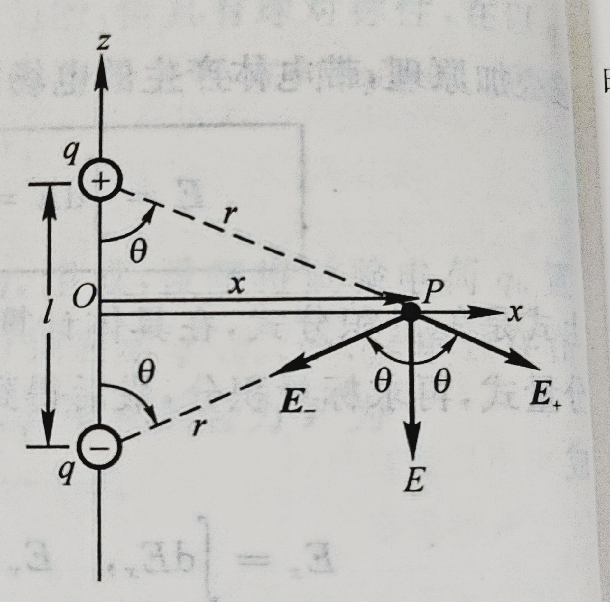</img>
$$\mathbf{F} = \frac{1}{4\pi\epsilon_0}\frac{q_1q_2}{r_{12}^2}\mathbf{e_{12}}$$

#### 电偶极子
一对等量异号点电荷$+q$和$-q$，相距为$l$。当从观察点到两电荷连线的距离$x\gg l$时，则这一对点电荷称为电偶极子
定义电偶极矩$\mathbf{p_e}=q\mathbf{l}$，$\mathbf{l}$的方向由负电荷指向正电荷
电偶极子中垂线上距两电荷中点$O$距离为$x$处的场强为
$$\mathbf{E}=-\frac{1}{4\pi \epsilon_0}\frac{\mathbf{p_e}}{x^3}$$
### 常见场强公式

#### 均匀带电直线外任意一点的场强（2021 T12）
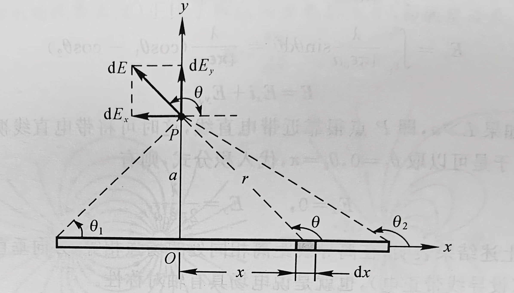</img>

一均匀带电直线，长为$L$，带电量为$q$，线外一点$P$到直线的垂直距离为$a$，$P$与直线两端的连线与直线间的夹角分别为$\theta_1,\theta_2$，如图所示。求$P$点的场强
解：
选取如图所示的坐标系，有$dq=\frac{q}{L}dx$
该电荷元在$P$点产生的场强的大小为
$$dE=\frac{1}{4\pi\epsilon_0}\frac{qdx}{Lr^2}$$
有$dE_x=dE\cos\theta,dE_y=dE\sin\theta$
$$\displaystyle E_x=\int dE_x=\int dE\cos\theta=\int\frac{1}{4\pi\epsilon_0}\frac{q\cos\theta}{Lr^2}dx\\\displaystyle E_y=\int dE_y=\int dE\sin\theta=\int\frac{1}{4\pi\epsilon_0}\frac{q\sin\theta}{Lr^2}dx$$
$$r=\frac{a}{\sin\theta},x=-a\cot\theta,dx=\frac{a}{\sin^2\theta}d\theta$$
$$\displaystyle E_x=\int^{\theta_2}_{\theta_1}\frac{q}{4\pi L\epsilon_0 a}\cos\theta d \theta=\frac{q}{4\pi L\epsilon_0 a}(\sin\theta_2-\sin\theta_1)\\\displaystyle E_y=\int^{\theta_2}_{\theta_1}\frac{q}{4\pi L\epsilon_0 a}\sin\theta d \theta=\frac{q}{4\pi L\epsilon_0 a}(\cos\theta_1-\cos\theta_2)$$

#### 常见带电体的电场强度公式

##### 均匀带电球面
总电量为$Q$，半径为$R$的均匀带电球面：
$$E = \begin{cases}
\dfrac{Q}{4\pi\epsilon_0r^2}, & \text{球面外}\\
0, & \text{球面内}
\end{cases}$$

##### 均匀带电球体
总电量为$Q$，半径为$R$的均匀带电球体：
$$E = \begin{cases}
\dfrac{Q}{4\pi\epsilon_0r^2}, & r>R\\
\dfrac{Qr}{4\pi\epsilon_0R^3}, & r<R
\end{cases}$$

##### 无限长均匀带电圆柱面
线电荷密度为$\lambda$，半径为$R$的无限长均匀带电圆柱面：
$$E = \begin{cases}
\dfrac{\lambda}{2\pi\epsilon_0r}, & \text{柱面外}\\
0, & \text{柱面内}
\end{cases}$$

##### 无限长均匀带电圆柱体
线电荷密度为$\lambda$，半径为$R$的无限长均匀带电圆柱体：
$$E = \begin{cases}
\dfrac{\lambda}{2\pi\epsilon_0r}, & \text{柱体外}\\
\dfrac{r\lambda}{2\pi\epsilon_0R^2}, & \text{柱体内}
\end{cases}$$

##### 无限大均匀带电平面
面电荷密度为$\sigma$的无限大均匀带电平面：
$$E = \frac{\sigma}{2\epsilon_0}$$

### 电通量
$$\Phi_e =\displaystyle\int_s\mathbf{E} \cdot d \mathbf{S}$$
### 高斯定理
通过任意闭合曲面的电通量等于该曲面所包围的所有电量的代数和除以$\epsilon_0$
$$\Phi_e = \displaystyle\int_s\mathbf{E} \cdot d \mathbf{S}=\frac{1}{\epsilon_0}\sum_iq_i$$
### 常见电势公式
#### 球壳
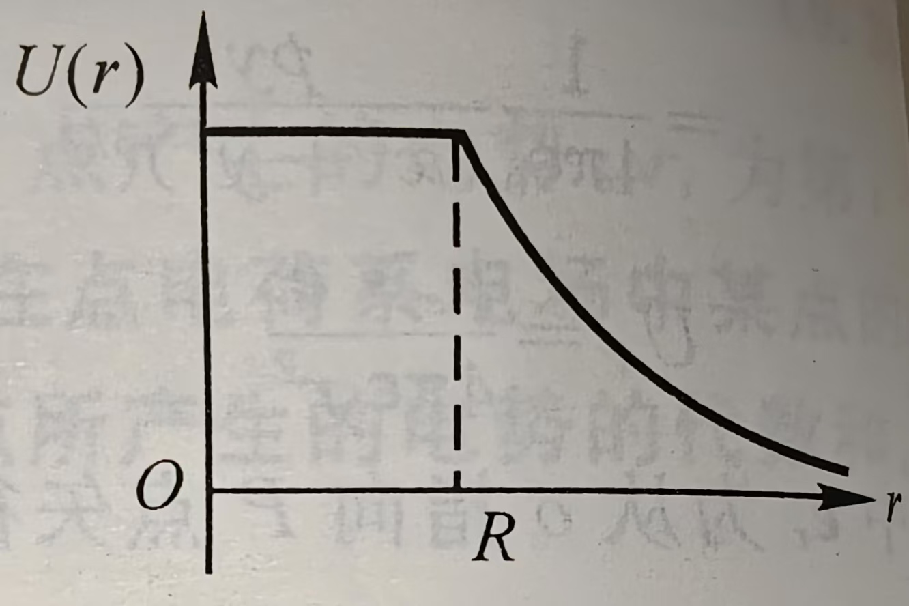

半径为$R$，总电量为$q$的均匀带电球面形成电场中电势的分布情况为
$$U(r)=\begin{cases}
\dfrac{q}{4\pi \epsilon_0 R},r\leq R\\
    \dfrac{q}{4\pi \epsilon_0 r},r>R
\end{cases}$$
#### 均匀带电球体
半径为$R$，总电量为$q$的均匀带电球体形成电场中电势的分布情况为
$$U(r)=\begin{cases}
\dfrac{q}{4\pi\epsilon_0 r}, & r>R\\
\dfrac{q}{8\pi\epsilon_0 R}\left(3-\dfrac{r^2}{R^2}\right), & r\le R
\end{cases}$$
#### 电偶极子
两点电荷为$\pm q$，相距为$l$的电偶极子电场中任一点$P$的电势
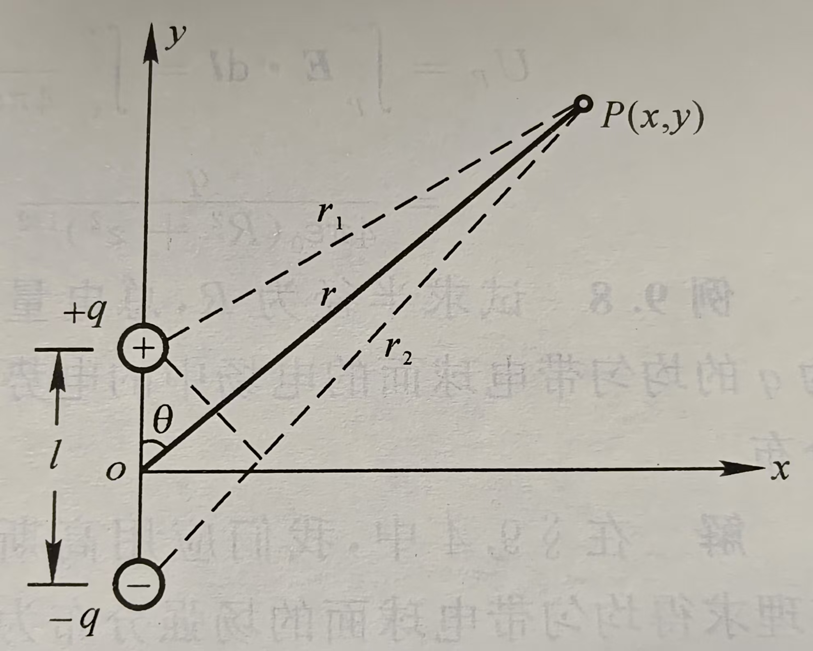

$$U_p=\frac{1}{4\pi\epsilon_0}\frac{ql\cos\theta}{x^2+y^2}$$

证明
$$U_P=U_1+U_2=\frac{1}{4\pi\epsilon_0}\left(\frac{q}{r_1}-\frac{q}{r_2}\right)=\frac{q}{4\pi\epsilon_0}\left(\frac{r_2-r_1}{r_1r_2}\right)$$
因为$r\gg l$,则有$r_2-r_1\approx l\cos\theta,r_1r_2=r^2$
因而
$$U_p=\frac{q}{4\pi \epsilon_0}\frac{l\cos\theta}{r^2}=\frac{1}{4\pi\epsilon_0}\frac{ql\cos\theta}{x^2+y^2}$$
#### 无限长均匀带电直线
电荷线密度为$\lambda$的无限长均匀带电直线，距带电直线$r$的$p$点的电势为
$$U_p=-\frac{\lambda}{2\pi\epsilon_0}\ln r+C$$
证明
无限长均匀带电直线周围的电场强度为
$$E=\frac{\lambda}{2\pi \epsilon_0 r}$$
如果选无穷远处作为电势零点，经过积分可知各点电势都是无穷大。
我们可以选取距带电直线$r_0$处的$p_0$点的电势为零参考点。
$$\displaystyle U_p=\int^{p_0}_p\mathbf{E}d\mathbf{l}=\int^{p_0}_p\frac{\lambda}{2\pi \epsilon_0 r}dr=-\frac{\lambda}{2\pi\epsilon_0}\ln r+\frac{\lambda}{2\pi\epsilon_0}\ln r_0$$
可以表示为
$$U_p= -\frac{\lambda}{2\pi\epsilon_0}\ln r+C$$
### 电场强度和电势的关系
$$\mathbf{E}=-\nabla U$$
## 第十章 静电场中的导体和电介质
### 静电平衡
#### 基本性质
1. 导体内部场强处处为0
2. 导体表面外侧，紧靠表面处的场强处处与表面垂直
3. 导体是个等势体，导体表面是个等势面
#### 带空腔的导体
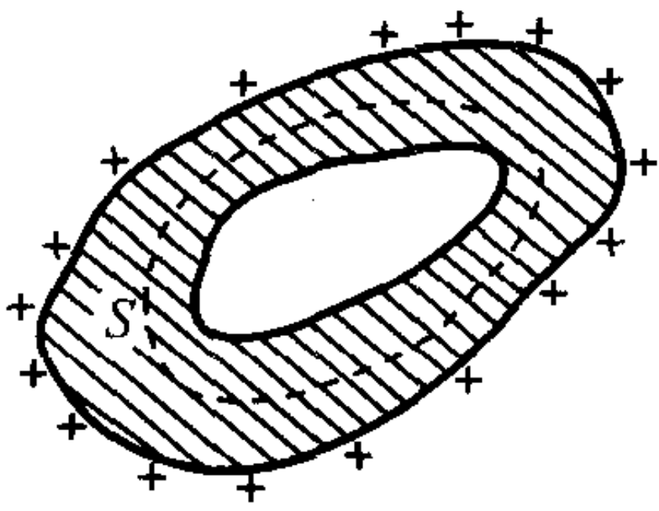

若导体内有空腔,而腔内无其他带电体（如右图），则不难证明
1. 导体空腔内表面无电荷存在
2. 导体空腔内场强处处为0
### 电容器的电容
两导体带有等量异号的电荷$Q$，导体间的电势差为$U_A-U_B$
$$C=\frac{Q}{U_A-U_B}$$
#### 平行板电容器
$$C=\epsilon_0\frac{S}{d}$$
#### 圆柱形电容器
两半径分别为$R_A$和$R_B$，长为$l$的圆柱面的电容
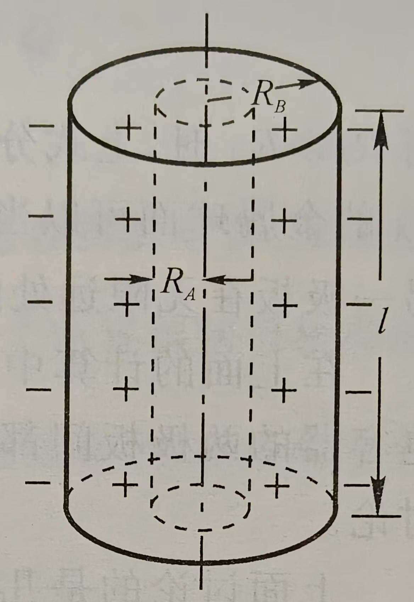

$$C=\frac{2\pi\epsilon_0l}{\ln\dfrac{R_B}{R_A}}$$
证明
令内外圆柱面单位长度的带电量分别为$+\lambda$和$-\lambda$
由高斯定理，取半径为$r$的圆柱面$(R_A<r<R_B)$
$$E=\frac{\lambda}{2\pi\epsilon_0 r}$$
$$U_A-U_B=\displaystyle\int^{R_B}_{R_A}\mathbf{E}d\mathbf{r}=\int^{R_B}_{R_A}\frac{\lambda}{2\pi\epsilon_0r}dr=\frac{\lambda}{2\pi\epsilon_0}\ln\frac{R_B}{R_A}$$
$$C=\frac{Q}{U_A-U_B}=\frac{\lambda l}{U_A-U_B}=\frac{2\pi\epsilon_0l}{\ln\dfrac{R_B}{R_A}}$$
#### 球形电容器
半径分别为$R_A$和$R_B$的同心的金属球壳组成的球形电容器的电容
$$C=\frac{4\pi\epsilon_0R_AR_B}{R_B-R_A}$$
证明
设内外球壳带电荷$+Q$和$-Q$
由高斯定理，取半径为$r$的球面$(R_A<r<R_B)$
$$E=\frac{Q}{4\pi\epsilon_0r^2}$$
$$U_A-U_B=\displaystyle\int^{R_B}_{R_A}\mathbf{E}d\mathbf{r}=\int^{R_B}_{R_A}\frac{Q}{4\pi\epsilon_0r^2}=\frac{Q}{4\pi\epsilon_0}\left(\frac{1}{R_A}-\frac{1}{R_B}\right)$$
$$C=\frac{Q}{U_A-U_B}=\frac{4\pi\epsilon_0R_AR_B}{R_B-R_A}$$
### 电介质
#### 电介质对电场的影响
$$U=\frac{U_0}{\epsilon_r}$$
$$C=\epsilon_rC_0$$
$$E=\frac{E_0}{\epsilon_r}$$
$\epsilon_r$为仅与电介质有关的常数，称为电介质的**相对介电常数**
#### 电极化强度
对大多数各项同性电介质来说，$\mathbf{P}$和$\mathbf{E}$有如下关系
$$\mathbf{P}=\epsilon_0\chi_e\mathbf{E}$$
#### 极化面密度
均匀电介质极化时，极化电荷面密度$\sigma'$等于极化强度在该点表面处的法向分量。即
$$\sigma'=|\mathbf{P}|\cos\theta=\mathbf{P} \cdot \mathbf{e}_n$$
其中$\mathbf{P}$为极化强度，$\mathbf{e}_n$为该点法线方向单位矢量
#### 电介质中的场强
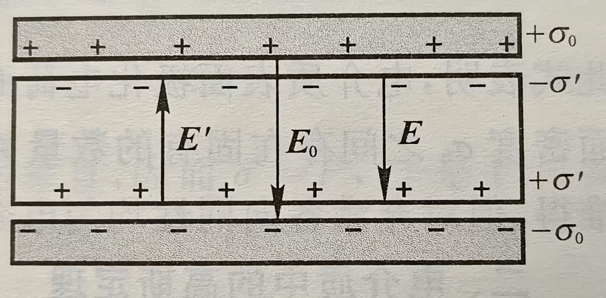

$\chi_e$为电极化率
$$1+\chi_e=\epsilon_r$$
$$\sigma'=\sigma_0\left(1-\frac{1}{\epsilon_r}\right)$$
从而
$$\mathbf{P}=\epsilon_0\chi_e\mathbf{E}=\epsilon_0(\epsilon_r-1)\mathbf{E}$$
#### 电介质中的高斯定理
通过电场中任意闭合曲面的电位移通量，等于该闭合面所包围的自由电荷的代数和
$$\oint\mathbf{D}d\mathbf{S}=\sum q_0$$
其中$\mathbf{D}$为电位移
$$\mathbf{D}=\epsilon_0\mathbf{E}+\mathbf{P}=(1+\chi_e)\epsilon_0\mathbf{E}=\epsilon_r\epsilon_0\mathbf{E}=\epsilon \mathbf{E}$$
其中$\epsilon$称为电介质的介电常数或电容率
### 电场的能量
#### 能量密度积分法
单位体积电场贮存的能量$w_e$为
$$w_e=\frac{1}{2}\epsilon E^2=\frac{1}{2}DE$$
从而整个电场贮存的能量为
$$W=\int_{V}w_edv$$
#### 等效电容能量公式法
$$W=\frac{1}{2}\frac{Q^2}{C}=\frac{1}{2}QU=\frac{1}{2}CU^2$$
#### 带电体的静电能公式
$$W=\frac{1}{2}\int_qUdq$$
#### 例
均匀带电球面，半径为$R$，总电量为$Q$，求这一带电系统的能量。
解一：
带电球面在球外产生电场，电场和能量密度分别为
$$E=\frac{Q}{4\pi\epsilon_0r^2},w=\frac{1}{2}\epsilon_0E^2$$
$$dV=4\pi r^2dr$$
$$W=\int^{\infty}_{R}wdV=\frac{Q^2}{8\pi\epsilon_0R}$$
解二：
$$C=4\pi\epsilon_0R,W=\frac{1}{2}\frac{Q^2}{C}=\frac{Q^2}{8\pi\epsilon_0R}$$
解三：
$$W=\frac{1}{2}\int Udq=\frac{1}{2}\int^{Q}_0\frac{Q}{4\pi\epsilon_0R}dq=\frac{Q^2}{8\pi\epsilon_0 R}$$
### 例题
#### 例1
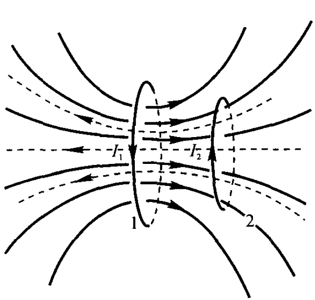

一接地导体球壳$A$,其内、外半径分别为$R_A$和$R$,内有一半径为$R_B$的同心导体球$B$,带电量为$q$,已知$R_A=2R_B$,$R=3R_B$。今在距球心$o$为$d=4R_B$处,放一电量为$Q$的点电荷,设球壳离地很远:并与地相连。试问:
(1)球壳$A$带的总电量是多少?
(2)若用导线将$A$与$B$相连,球壳$A$的带电量又是多少?

这种题目的固定套路都是先求圆心处的电势，然后再与接地的零电势点联系起来。

设球壳$A$带的总电量是$q'$
导体球$B$所带的电荷都分布在其外表面，对圆心的电势贡献$\varphi_1 = \dfrac{1}{4\pi\epsilon_0}\dfrac{q}{R_B}$
取球壳之间的同心圆截面做高斯定理，可知球壳$A$内表面带电$-q$，对圆心的电势贡献$\varphi_2 = -\dfrac{1}{4\pi\epsilon_0}\dfrac{q}{R_A}$
## 第十一章 稳恒电流
### 电流和电流密度
电流强度$I$和电流密度矢量$\mathbf{j}$的定义
$$I=\frac{dq}{dt},j=\frac{dI}{dS}$$
也即$$dI=\mathbf{j}\cdot d\mathbf{S},I=\int_S\mathbf{j}\cdot d\mathbf{S}$$
### 电流与漂移速度
$$I=env_d\Delta S,\mathbf{j}=en\mathbf{v}_d$$
### 电流连续性方程及稳恒的条件
电流连续性方程
$$\oint_s\mathbf{j}\cdot d\mathbf{S}=-\frac{dq}{dt}$$
稳恒条件
$$\oint_s\mathbf{j}\cdot d\mathbf{S}=0$$
### 欧姆定律的微分形式
导体元两端的电势差
$$\Delta U = E\Delta l = j\Delta S\Delta R$$
即
$$j=\frac{\Delta l}{\Delta R\Delta S}E=\frac{1}{\rho}E=\gamma E$$
矢量形式为$$\mathbf{j}=\gamma \mathbf{E}$$
$\gamma$为导体的电导率
## 第十二章 稳恒磁场
### 洛伦兹力
$$\mathbf{F}=q\mathbf{v}\times \mathbf{B}$$
标量式为
$$F=qvB\sin\theta$$
其中$\theta$为速度矢量$\mathbf{v}$与磁感应强度矢量$\mathbf{B}$之间的夹角
### 毕奥-萨伐尔定律
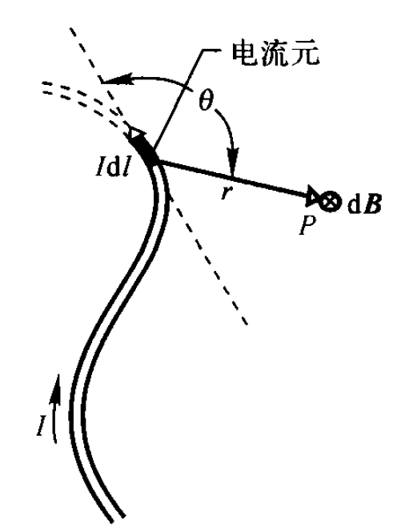

在导线中沿电流方向取一长为$dl$的矢量线元$d\mathbf{l}$，此线元取得足够小，方向与线元内电流密度的方向相同，称$Id\mathbf{l}$为电流元。
$$d\mathbf{B}=\frac{\mu_0}{4\pi}\frac{I d\mathbf{l}\times \mathbf{r}}{r^3}$$
计算某点场强时积分即可。

### 常见的稳恒磁场
#### 载流长直导线
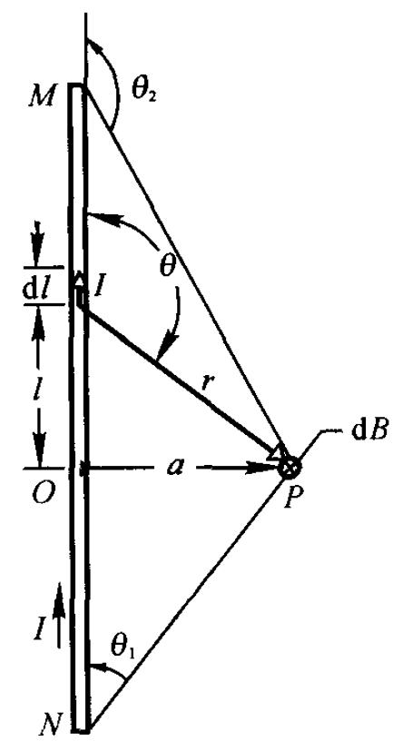

设真空中一长直导线$MN$中通有电流$I$。计算距导线为$a$的场点$P$的磁感应强度。

取$P$点至导线的垂足$O$为坐标原点。在载流导线上任取一电流元，它在$P$点产生的磁感应强度$d\mathbf{B}$的大小为
$$dB=\frac{\mu_0}{4\pi}\frac{Idl\sin\theta}{r^2}$$
则有$P$点的磁感应强度为
$$B=\int_L dB=\int_L \frac{\mu_0}{4\pi}\frac{Idl\sin\theta}{r^2}$$
其中
$$l=-\frac{a}{\tan\theta},r=\frac{a}{\sin\theta},dl = \frac{a}{\sin^2\theta}d\theta$$
代入上式可以得到
$$\boxed{B=\int_{\theta_1}^{\theta_2} \frac{\mu_0 I}{4\pi a}=\frac{\mu_0 I}{4\pi a}(\cos\theta_1-\cos\theta_2)}$$
对于**无限长直导线**，$\theta_1 = 0,\theta_2 = \pi$
$$\boxed{B=\frac{\mu_0 I}{2\pi a}}$$
#### 载流圆线圈
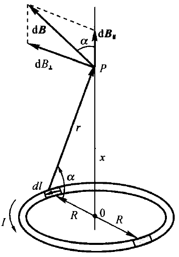

设真空中有一圆形线圈，其半径为$R$，通有电流$I$。下面计算其轴线上$P$点处的磁感应强度。
如右图，在载流圆线圈上任取一电流元，它在$P$点产生的磁感应强度$d\mathbf{B}$的大小为
$$dB=\frac{\mu_0}{4\pi}\frac{Idl}{R^2+x^2}$$
显然$dB_\perp$相互抵消，$dB_\parallel$互相加强。
$$\boxed{B=\int dB\cos\alpha=\int^{2\pi R}_0 \frac{\mu_0}{4\pi}\frac{I}{R^2+x^2}\frac{R}{\sqrt{R^2+x^2}}dl =\frac{\mu_0IR^2}{2({R^2+x^2)^{\frac{3}{2}}}}}$$
#### 载流直螺线管
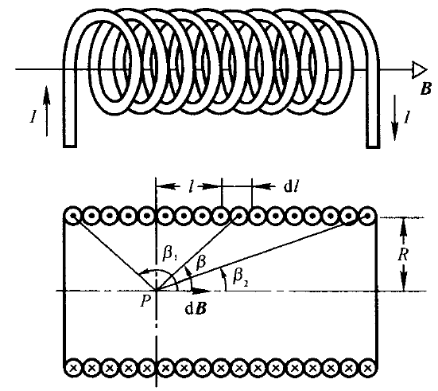

对于点$P$，
$$B = \frac{\mu_0}{2}nI(\cos\beta_2-\cos\beta_1)$$
螺线管无限长时$\beta_1=\pi,\beta_2 = 0$
$$B=\mu_0 n I$$
螺线管的两个端点，相应的有$\beta_1\rightarrow \dfrac{\pi}{2},\beta_2\rightarrow 0$和$\beta_1\rightarrow \pi,\beta_2\rightarrow \dfrac{\pi}{2}$，两种情况都有
$$B = \frac{\mu_0 n I}{2}$$
#### 载流导体薄板
无限长载流导体薄板宽度为$a$,测量点距薄板距离为$y$
$$\boxed{B=\frac{\mu_0 I}{\pi a}\arctan\frac{a}{2y}}$$
测量点距离足够远时，无限大导体薄板可视为无限长直导线。
$$\boxed{B=\frac{\mu_0 I}{2\pi y}}$$
### 载流线圈的磁矩和磁偶极子
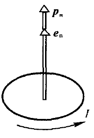

将场点到场源的距离远大于线圈尺寸的载流线圈称为**磁偶极子**。

假设上述载流圆线圈有$N$匝，且$x\gg R$，表达式可变为
$$B = \frac{N\mu_0IR^2}{2x^3}=\frac{N\mu_0IS}{2\pi x^3}(S=\pi R^2)$$
类似电偶极子的电矩，定义磁矩为
$$\mathbf{p}_m=NIS\mathbf{e}_n$$，其中$\mathbf{e}_n$为线圈平面正法线方向上的单位矢量.
引入磁矩后可以将磁感应强度表达式改写为
$$\mathbf{B} = \frac{\mu_0 \mathbf{p}_m}{2\pi x^3}$$
### 运动电荷的磁场
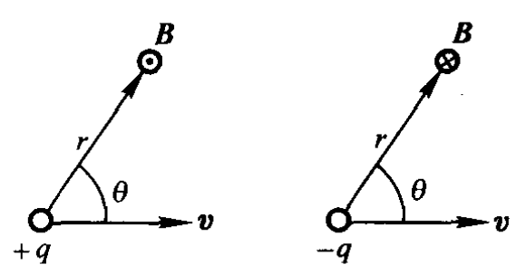

在载流导体中取一长为$dl$的电流元，它的截面积为$S$，单位体积内有$n$个带电粒子，每个带电粒子的电量为$q$，以平均漂移速度在导体中运动,即$I=nqSv$
$$d\mathbf{B}=\frac{\mu_0}{4\pi}\frac{Id\mathbf{l}\times \mathbf{r}}{r^3}=\frac{\mu_0}{4\pi}\frac{nqSv d\mathbf{l}\times \mathbf{r}}{r^3}$$
电流元$dl$内有$dN=nSdl$个以速度运动着的带电粒子，电流元$Idl$所产生的磁场，就是$dN$个运动电荷产生的磁场的总和。因此，每一个以速度运动的电荷所产生的磁感应强度为
$$\mathbf{B} = \frac{d\mathbf{B}}{dN}=\frac{\mu_0q\mathbf{v}\times \mathbf{r}}{4\pi r^3}$$
磁感应强度方向如上图所示。
### 磁通量
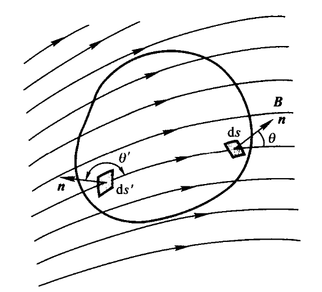

$$\Phi_m = \int_S \mathbf{B} \cdot d\mathbf{S}$$
在匀强磁场可以写成
$$\Phi_m = B S \cos\theta$$
取闭合曲面的外法线方向为法线正方向$\mathbf{n}$。在磁感应线穿出曲面处，$\mathbf{B}$与$\mathbf{n}$的夹角为锐角，相应的磁通量为正；在磁感应线穿入曲面处，$\mathbf{B}$与$\mathbf{n}$的夹角为钝角，通过该处的磁通量为负，如图所示。
### 磁场的高斯定理
磁场中任意闭合曲面的磁通量恒等于零，即
$$\Phi_m = \oint_S \mathbf{B} \cdot d\mathbf{S} = 0$$
### 安培环路定理
在稳恒磁场中，磁感应强度$B$沿任意闭合回路的线积分，等于闭合回路所包围电流代数和的$\mu_0$倍，其数学表达式为
$$\oint_L \mathbf{B} \cdot d\mathbf{l} = \mu_0 I_{内}$$
### 常见的稳恒磁场2
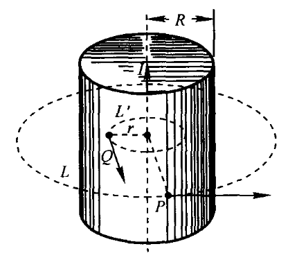

#### 无限长载流圆柱体
$P$点在圆柱体外时：
$$B\cdot 2\pi r = \mu_0 I$$
$$B = \frac{\mu_0 I}{2\pi r}$$
$P$点在圆柱体内时：
$$B\cdot 2\pi r  = \mu_0 \frac{I r^2}{R^2}$$
$$B = \frac{\mu_0 I r}{2\pi R^2}$$
#### 载流螺绕环
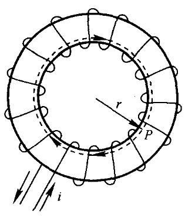

设螺绕环的总匝数为$N$，平均半径为$R$，导线中通过的电流为$I$，当环上线圈绕得很紧密时，磁场几乎全部集中在管内，在与环共轴的圆周上各点的磁感应强度的大小都相等，方向沿圆周切向。
$$B\cdot 2\pi r = \mu_0 N I$$
$$B = \frac{\mu_0 N I}{2\pi r}$$
若环的截面半径比环的平均半径小得多，上式中的$r$可用平均半径$R$代替，则环内磁感应强度为
$$B = \frac{\mu_0 N I}{2\pi R}$$

记螺线管每单位长度有$n$匝，则$n = \dfrac{N}{2\pi R}$
可知

$$B=\mu_0 n I$$

对于螺绕环外的空间,穿过这个回路的总电流为零,故得
$$B=0$$

#### 无限长载流螺线管
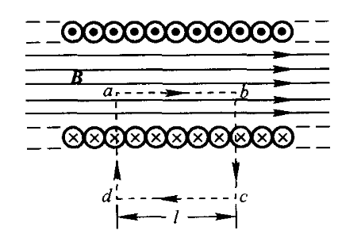

螺线管每单位长度有$n$匝
$$\oint_L \mathbf{B} \cdot d\mathbf{l} = \int^b_a\mathbf{B}d\mathbf{l}+\int^c_b\mathbf{B}d\mathbf{l}+\int^d_c\mathbf{B}d\mathbf{l}+\int^a_d\mathbf{B}d\mathbf{l}=Bl=\mu_0 n l I$$
$$B=\mu_0 n I$$
### 安培力
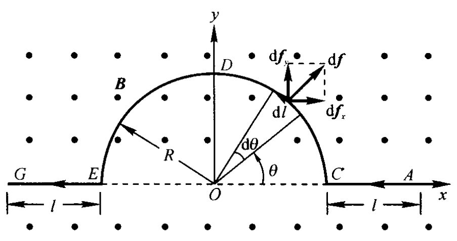

$$\mathbf{F} = \int^l_0 I d\mathbf{l} \times \mathbf{B}$$
#### 安培力的特性
如右图，作用在整个导线上的力与作用在通有同样电流，长度为$(2l+2R)$的直导线上的安培力相等。可以证明,无论中间一段导线的形状如何,其结果都一样。
#### 长直导线之间的作用力
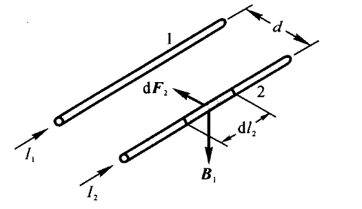

每单位长度所受的力为

$$\frac{dF_2}{dl_2}=\frac{\mu_0 I_1I_2}{2\pi d}$$
电流同向相互吸引，异向相互排斥。
在国际单位制中，电流强度是基本量，其单位“安培”就是利用平行电流间相互作用的安培力来定义的。
#### 磁场对线圈的力矩

取与线圈中电流方向成右螺旋关系的方向为线圈平面的法线矢量$n$的指向，线圈的面积为$S$，则磁场对线圈的力矩
$$M = BIS\sin\theta$$
写成矢量式，有
$$\mathbf{M} = \mathbf{p}_m \times \mathbf{B}$$
其中$\mathbf{p}_m = NIS\mathbf{e_n}$为线圈的磁矩。
### 磁力的功
可以证明,一个任意的闭合载流回路,在磁场中改变位置或形状时,磁力或磁力矩所做的功都为
$$A = I \Delta \varPhi$$
## 第十三章 磁场中的磁介质
### 磁感应强度、磁化强度和磁场强度
磁感应强度$\mathbf{B}$与磁场强度$\mathbf{H}$、磁化强度$\mathbf{M}$之间的关系为
$$\mathbf{B}=\mu_0(\mathbf{H}+\mathbf{M})$$
### 磁介质中的安培环路定理
磁场强度$\mathbf{H}$沿任意闭合路径的环流,等于穿过该路径所围面积的传导电流的代数和。
$$\oint_L \mathbf{H} \cdot d\mathbf{l} =  I_0$$
### 磁化率
对于各向同性的线性磁介质，磁化强度$\mathbf{M}$与磁场强度$\mathbf{H}$成正比，即
$$\mathbf{M}=\chi_m \mathbf{H}$$
其中$\chi_m$为磁介质的磁化率。
### 磁导率
由$$\mathbf{B}=\mu_0(\mathbf{H}+\mathbf{M})$$
和$$\mathbf{M}=\chi_m \mathbf{H}$$
可得
$$\mathbf{B}=\mu_0(\mathbf{H}+\chi_m \mathbf{H})=\mu_0(1+\chi_m)\mathbf{H}$$
定义$\mu_r = 1+\chi_m$为磁介质的相对磁导率。
则有
$$\mathbf{B}=\mu_0\mu_r \mathbf{H}=\mu \mathbf{H}$$
其中$\mu = \mu_0\mu_r$为磁介质的磁导率。
### 磁化电流线密度
磁化电流线密度的定义是磁介质表面单位长度的磁化电流强度，即
$$j_m = \frac{\Delta I_m}{l}$$
磁介质表面上某处磁化强度在量值上等于该处磁化电流的线密度，即
$$j_m = |\mathbf{M}|$$
磁化电流流向与$\mathbf{M}$成右螺旋关系，即将右手拇指指向 $\mathbf{M}$ 的方向，四指环绕方向就是表面磁化电流的方向。
## 第十四章 电磁感应
### 法拉第电磁感应定律
$$\varepsilon_i = - d\frac{d\Phi}{d t} = -\int_s\mathbf B\cdot d \mathbf S$$
### 全磁通和磁通链数
如果导体回路由N匝线圈串联组成，则当磁通量变化时，整个回路中的总感应电动势等于各匝线圈中产生的感应电动势之和。如果通过各匝线圈的磁通量不等，则
$$\mathscr{E}_{i} = -\frac{\mathrm{d}}{\mathrm{d}t} \left( \sum_{i=1}^{N} \Phi_{i} \right) = -\frac{\mathrm{d}\Psi}{\mathrm{d}t}$$
$\Psi =  \displaystyle\sum_{i=1}^{N} \Phi_{i}$是穿过各匝线圈的磁通量的总和,称为穿过线圈的全磁通，又叫**磁通链数**。
### 感生电场和磁通量变化率的关系
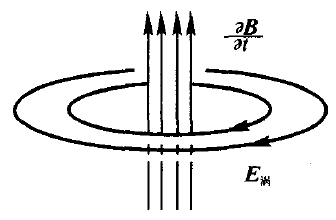

$$\oint_{L} \boldsymbol{E}_{i} \cdot \text{d}\boldsymbol{l} = \varepsilon_i=- \int_{S} \frac{\partial \boldsymbol{B}}{\partial t} \cdot \text{d}\boldsymbol{S}$$

单位正电荷绕闭合回路一周涡旋电场力所做的功等于感生电动势等于回路L所围任意曲面S中磁通量的变化率。
### 自感系数
根据毕奥-萨伐尔定律,载流回路在空间任一点产生的磁感应强度$\boldsymbol{B}$都与回路中的电流强度$I$成正比，因此,通过回路的全磁通$\Psi$也与$I$成正比，即
$$\Psi = L I$$
式中$L$是比例系数,称为线圈的自感系数,简称自感。
显然有感应电动势
$$\varepsilon_L =- \dfrac{d\varPhi}{dt} = -L\dfrac{dI}{dt}$$
### 互感系数

设有两个相邻回路1和2,分别通以电流$I_1$和$I_2$。根据毕奥-萨伐尔定律,在回路1中电流$I_1$所产生的磁场中,任意一点的磁感应强度都和$I_1$成正比,因此通过回路2的全磁通也必然和$I_1$成正比,即
$$\Psi_{21} = M_{21}I_1$$
同理,回路2中电流$I_2$所产生的磁场通过回路1的全磁通$\Psi_{12}$为
$$\Psi_{12} = M_{12}I_2$$
可以证明$$M_{12} = M_{21} = M$$称为两回路的互感系数，简称互感。
当回路1中的电流$I_1$变化时，在回路2中产生的互感电动势为
$$\varepsilon_{21} = - \dfrac{d \Psi_{21}}{dt} = -M\dfrac{dI_1}{dt}$$
当回路1中的电流$I_2$变化时，在回路1中产生的互感电动势为
$$\varepsilon_{12} = - \dfrac{d \Psi_{12}}{dt} = -M\dfrac{dI_2}{dt}$$
### 自感磁能
在一个自感系数为$L$的线圈中建立稳定电流$I_0$时,线圈中所储存的磁能为
$$W_m = \dfrac{1}{2}LI_0^2$$
称为线圈的自感磁能
### 磁能密度
单位体积内的磁能，即磁能密度为
$$\omega_m = \dfrac{1}{2}\boldsymbol{B}\cdot \boldsymbol{H}$$
## 第十五章 电磁场与电磁波
### 全电流安培环路定理
$$\oint_{L} \boldsymbol{H} \cdot \mathrm{d}\boldsymbol{l} = \sum I + \frac{\mathrm{d}\Phi_{\mathrm{D}}}{\mathrm{d}t} = \sum I + \int_{S} \frac{\partial \boldsymbol{D}}{\partial t} \cdot \mathrm{d}\boldsymbol{S}$$
### 电磁波的波动方程
$$E = E_0\cos\omega(t-\frac{x}{c}) \\ \  \\ H = H_0\cos\omega(t-\frac{x}{c})$$

电磁波在真空中的传播速度为
$$c = \dfrac{1}{\sqrt{\varepsilon_0\mu_0}}$$