## 第九章 真空中的静电场
### 库仑定律
</img>
$$\mathbf{F} = \frac{1}{4\pi\epsilon_0}\frac{q_1q_2}{r_{12}^2}\mathbf{e_{12}}$$

#### 电偶极子
一对等量异号点电荷$+q$和$-q$，相距为$l$。当从观察点到两电荷连线的距离$x\gg l$时，则这一对点电荷称为电偶极子
定义电偶极矩$\mathbf{p_e}=q\mathbf{l}$，$\mathbf{l}$的方向由负电荷指向正电荷
电偶极子中垂线上距两电荷中点$O$距离为$x$处的场强为
$$\mathbf{E}=-\frac{1}{4\pi \epsilon_0}\frac{\mathbf{p_e}}{x^3}$$
### 常见场强公式

#### 均匀带电直线外任意一点的场强（2021 T12）
</img>

一均匀带电直线，长为$L$，带电量为$q$，线外一点$P$到直线的垂直距离为$a$，$P$与直线两端的连线与直线间的夹角分别为$\theta_1,\theta_2$，如图所示。求$P$点的场强
解：
选取如图所示的坐标系，有$dq=\frac{q}{L}dx$
该电荷元在$P$点产生的场强的大小为
$$dE=\frac{1}{4\pi\epsilon_0}\frac{qdx}{Lr^2}$$
有$dE_x=dE\cos\theta,dE_y=dE\sin\theta$
$$\displaystyle E_x=\int dE_x=\int dE\cos\theta=\int\frac{1}{4\pi\epsilon_0}\frac{q\cos\theta}{Lr^2}dx\\\displaystyle E_y=\int dE_y=\int dE\sin\theta=\int\frac{1}{4\pi\epsilon_0}\frac{q\sin\theta}{Lr^2}dx$$
$$r=\frac{a}{\sin\theta},x=-a\cot\theta,dx=\frac{a}{\sin^2\theta}d\theta$$
$$\displaystyle E_x=\int^{\theta_2}_{\theta_1}\frac{q}{4\pi L\epsilon_0 a}\cos\theta d \theta=\frac{q}{4\pi L\epsilon_0 a}(\sin\theta_2-\sin\theta_1)\\\displaystyle E_y=\int^{\theta_2}_{\theta_1}\frac{q}{4\pi L\epsilon_0 a}\sin\theta d \theta=\frac{q}{4\pi L\epsilon_0 a}(\cos\theta_1-\cos\theta_2)$$

#### 常见带电体的电场强度公式

##### 均匀带电球面
总电量为$Q$，半径为$R$的均匀带电球面：
$$E = \begin{cases}
\dfrac{Q}{4\pi\epsilon_0r^2}, & \text{球面外}\\
0, & \text{球面内}
\end{cases}$$

##### 均匀带电球体
总电量为$Q$，半径为$R$的均匀带电球体：
$$E = \begin{cases}
\dfrac{Q}{4\pi\epsilon_0r^2}, & r>R\\
\dfrac{Qr}{4\pi\epsilon_0R^3}, & r<R
\end{cases}$$

##### 无限长均匀带电圆柱面
线电荷密度为$\lambda$，半径为$R$的无限长均匀带电圆柱面：
$$E = \begin{cases}
\dfrac{\lambda}{2\pi\epsilon_0r}, & \text{柱面外}\\
0, & \text{柱面内}
\end{cases}$$

##### 无限长均匀带电圆柱体
线电荷密度为$\lambda$，半径为$R$的无限长均匀带电圆柱体：
$$E = \begin{cases}
\dfrac{\lambda}{2\pi\epsilon_0r}, & \text{柱体外}\\
\dfrac{r\lambda}{2\pi\epsilon_0R^2}, & \text{柱体内}
\end{cases}$$

##### 无限大均匀带电平面
面电荷密度为$\sigma$的无限大均匀带电平面：
$$E = \frac{\sigma}{2\epsilon_0}$$

### 电通量
$$\Phi_e =\displaystyle\int_s\mathbf{E} \cdot d \mathbf{S}$$
### 高斯定理
通过任意闭合曲面的电通量等于该曲面所包围的所有电量的代数和除以$\epsilon_0$
$$\Phi_e = \displaystyle\int_s\mathbf{E} \cdot d \mathbf{S}=\frac{1}{\epsilon_0}\sum_iq_i$$
### 常见电势公式
#### 球壳

半径为$R$，总电量为$q$的均匀带电球面形成电场中电势的分布情况为
$$U(r)=\begin{cases}
\dfrac{q}{4\pi \epsilon_0 R},r\leq R\\
    \dfrac{q}{4\pi \epsilon_0 r},r>R
\end{cases}$$
#### 均匀带电球体
半径为$R$，总电量为$q$的均匀带电球体形成电场中电势的分布情况为
$$U(r)=\begin{cases}
\dfrac{q}{4\pi\epsilon_0 r}, & r>R\\
\dfrac{q}{8\pi\epsilon_0 R}\left(3-\dfrac{r^2}{R^2}\right), & r\le R
\end{cases}$$
#### 电偶极子
两点电荷为$\pm q$，相距为$l$的电偶极子电场中任一点$P$的电势

$$U_p=\frac{1}{4\pi\epsilon_0}\frac{ql\cos\theta}{x^2+y^2}$$

证明
$$U_P=U_1+U_2=\frac{1}{4\pi\epsilon_0}\left(\frac{q}{r_1}-\frac{q}{r_2}\right)=\frac{q}{4\pi\epsilon_0}\left(\frac{r_2-r_1}{r_1r_2}\right)$$
因为$r\gg l$,则有$r_2-r_1\approx l\cos\theta,r_1r_2=r^2$
因而
$$U_p=\frac{q}{4\pi \epsilon_0}\frac{l\cos\theta}{r^2}=\frac{1}{4\pi\epsilon_0}\frac{ql\cos\theta}{x^2+y^2}$$
#### 无限长均匀带电直线
电荷线密度为$\lambda$的无限长均匀带电直线，距带电直线$r$的$p$点的电势为
$$U_p=-\frac{\lambda}{2\pi\epsilon_0}\ln r+C$$
证明
无限长均匀带电直线周围的电场强度为
$$E=\frac{\lambda}{2\pi \epsilon_0 r}$$
如果选无穷远处作为电势零点，经过积分可知各点电势都是无穷大。
我们可以选取距带电直线$r_0$处的$p_0$点的电势为零参考点。
$$\displaystyle U_p=\int^{p_0}_p\mathbf{E}d\mathbf{l}=\int^{p_0}_p\frac{\lambda}{2\pi \epsilon_0 r}dr=-\frac{\lambda}{2\pi\epsilon_0}\ln r+\frac{\lambda}{2\pi\epsilon_0}\ln r_0$$
可以表示为
$$U_p= -\frac{\lambda}{2\pi\epsilon_0}\ln r+C$$
### 电场强度和电势的关系
$$\mathbf{E}=-\nabla U$$
#### 例题

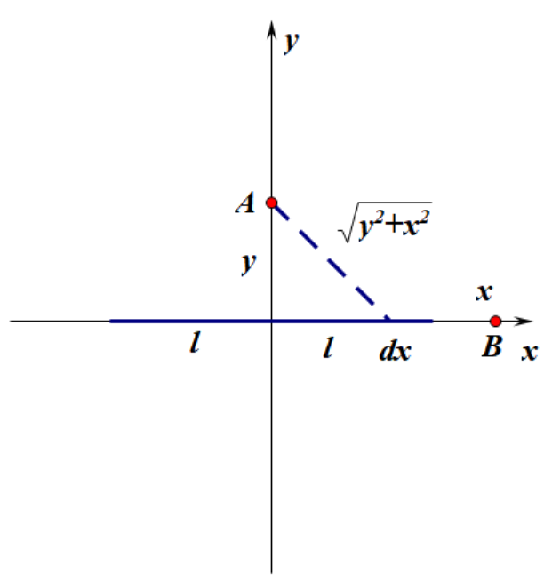

电量$Q$均匀分布在长为$2l$的细线上。试求:
(1)在带电直线的中垂线上离带电直线中心距离为$y$的$A$点的电势$U$和场强$E$;
<!-- (2)在带电直线的延长线上，距带电直线中心的距离为$x$的$B$点的电势$U$和场强$E$。 -->

(1)电荷线密度$\lambda = \dfrac{Q}{2l}$

A点的电势
$$U_A =\displaystyle 2\int_0^l \dfrac{1}{4\pi \epsilon_0}\cdot\dfrac{\lambda dx}{\sqrt{x^2+y^2}}=\dfrac{Q}{4\pi\epsilon_0 l}\int^l_0\dfrac{1}{\sqrt{x^2+y^2}}dx=\dfrac{Q}{4\pi\epsilon_0 l}\ln\dfrac{\sqrt{l^2+y^2}+l}{y}$$
由
$$\boldsymbol{E} = -\nabla U$$
可知$$E_A = -\dfrac{dU_A}{dy} = -\dfrac{Q}{4\pi\epsilon_0 l}(-\dfrac{l}{y\sqrt{l^2+y^2}})=\dfrac{Q}{4\pi\epsilon_0y\sqrt{l^2+y^2}}$$
方向沿$y$轴正方向

注：如何求$$\int^l_0\dfrac{1}{\sqrt{x^2+y^2}}dx$$
设$x = y\tan\theta，\theta \in [0,\dfrac{\pi}{2})$，则有$\theta = \arctan \dfrac{x}{y}$
$$\int^l_0\dfrac{1}{\sqrt{x^2+y^2}}dx = \int^{\arctan\frac{l}{y}}_0\dfrac{1}{\dfrac{y}{\cos\theta}}d(y\tan\theta)=\int^{\arctan\frac{l}{y}}_0\dfrac{1}{\cos\theta}d\theta = \int^{\arctan\frac{l}{y}}_0\dfrac{1}{1-\sin^2\theta} d\sin\theta$$
设$s = \sin\theta = \dfrac{x}{\sqrt{x^2+y^2}}$
$$\int^{\arctan\frac{l}{y}}_0\dfrac{1}{1-\sin^2\theta} d\sin\theta = \int^{\frac{l}{\sqrt{l^2+y^2}}}_0\dfrac{1}{1-s^2}ds = \dfrac{1}{2}\int^{\frac{l}{\sqrt{l^2+y^2}}}_0(\dfrac{1}{1+s}+\dfrac{1}{1-s})ds$$
$$\int^{\frac{l}{\sqrt{l^2+y^2}}}_0\dfrac{1}{1+s}ds = \ln(1+s)|^{\frac{l}{\sqrt{l^2+y^2}}}_0=\ln(1+\dfrac{l}{\sqrt{l^2+y^2}})$$
$$\int^{\frac{l}{\sqrt{l^2+y^2}}}_0\dfrac{1}{1-s}ds = -\ln(1-s)|^{\frac{l}{\sqrt{l^2+y^2}}}_0=-\ln(1-\dfrac{l}{\sqrt{l^2+y^2}})$$

从而有$$\int^l_0\dfrac{1}{\sqrt{x^2+y^2}}dx = \dfrac{1}{2}(\ln\dfrac{l+\sqrt{l^2+y^2}}{\sqrt{l^2+y^2}}-\ln\frac{\sqrt{l^2+y^2}-l}{\sqrt{l^2+y^2}})=\dfrac{1}{2}\ln\dfrac{\sqrt{l^2+y^2}+l}{\sqrt{l^2+y^2}-l}=\dfrac{1}{2}\ln\dfrac{(\sqrt{l^2+y^2}+l)^2}{y^2}=\ln\dfrac{\sqrt{l^2+y^2}+l}{y}$$
## 第十章 静电场中的导体和电介质
### 静电平衡
#### 基本性质
1. 导体内部场强处处为0
2. 导体表面外侧，紧靠表面处的场强处处与表面垂直
3. 导体是个等势体，导体表面是个等势面

#### 带空腔的导体
若导体内有空腔,而腔内无其他带电体（如右图），则不难证明
1. 导体空腔内表面无电荷存在
2. 导体空腔内场强处处为0
#### 例1
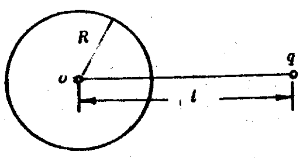

在半径为$R$的中性金属球壳外有一点电荷$q$,与球心$o$相距$l$,如图所示。设它们离地和其他物体都很远，试问:
(1)球内各点电势多大?
(2)若把金属球壳接地，则球上的感应电荷$q'$有多大?

(1)金属球壳表面会有感应电荷。任何感应电荷$dq'$对球心$o$的电势贡献为
$$dU = \dfrac{1}{4\pi\epsilon_0}\frac{dq'}{R}$$
而金属球壳本身总带电为0，可知感应电荷对球心的电势贡献总和为零。
因此球心处电势为
$$U_o = \dfrac{1}{4\pi\epsilon_0}\frac{q}{l}$$
根据高斯定理，球壳内任意一点都没有电荷，因此电场处处为0，电势均相同。球壳内电势均为
$$U = \dfrac{1}{4\pi\epsilon_0}\frac{q}{l}$$
(2)球壳接地表示球壳电势为0
也就是说
$$U_o =0$$
感应电荷对球心的电势
$$U_q' = \dfrac{1}{4\pi\epsilon_0}\dfrac{q'}{R}$$
$$U_{q'} +U_q = 0$$
从而$q' = -\dfrac{R}{l}q$
#### 例2
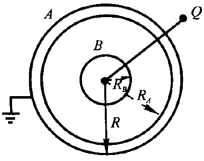

一接地导体球壳$A$,其内、外半径分别为$R_A$和$R$,内有一半径为$R_B$的同心导体球$B$,带电量为$q$,已知$R_A=2R_B$,$R=3R_B$。今在距球心$o$为$d=4R_B$处,放一电量为$Q$的点电荷,设球壳离地很远:并与地相连。试问:
(1)球壳$A$带的总电量是多少?
(2)若用导线将$A$与$B$相连,球壳$A$的带电量又是多少?

这种题目的固定套路都是先求圆心处的电势，然后再与接地的零电势点联系起来。

(1)
设球壳$A$带的总电量是$q'$
导体球$B$所带的电荷都分布在其外表面，对圆心的电势贡献$\varphi_1 = \dfrac{1}{4\pi\epsilon_0}\dfrac{q}{R_B}$
取球壳之间的同心圆截面做高斯定理，可知球壳$A$内表面带电$-q$，对圆心的电势贡献$\varphi_2 = -\dfrac{1}{4\pi\epsilon_0}\dfrac{q}{R_A}$
球壳$A$的外表面带电$q'+q$，对圆心的电势贡献$\varphi_3 = \dfrac{1}{4\pi\epsilon_0}\dfrac{q'+q}{R}$
点电荷对圆心的电势贡献$\varphi_4 = \dfrac{1}{4\pi\epsilon_0}\dfrac{Q}{d}$

圆心的电势为$$\varphi_o = \dfrac{q}{4\pi\epsilon_0 R_B}-\dfrac{q}{8\pi\epsilon_0 R_B}+\dfrac{q'+q}{12\pi\epsilon_0 R_B}+\dfrac{Q}{16\pi\epsilon_0R_B}$$

取$R_B<r<R_A$的高斯面
$$E\cdot 4\pi r^2 = \dfrac{1}{\epsilon_0}q$$
即$$E = \dfrac{q}{4\pi r^2 \epsilon_0}$$
$$U_{A外}-U_o = U_{A内}-U_{B外} = -\int^{R_A}_{R_B}\dfrac{q}{4\pi r^2 \epsilon_0} dr = \dfrac{q}{4\pi\epsilon_0}(\dfrac{1}{R_A}-\dfrac{1}{R_B})$$
由于接地，可知$U_{A外}=0$
可知$U_o =  \dfrac{q}{4\pi\epsilon_0}(\dfrac{1}{R_B}-\dfrac{1}{R_A})$，有$\varphi_o = U_o$
$$\dfrac{q}{4\pi\epsilon_0}(\dfrac{1}{R_B}-\dfrac{1}{2R_B}) = \dfrac{q}{4\pi\epsilon_0 R_B}-\dfrac{q}{8\pi\epsilon_0 R_B}+\dfrac{q'+q}{12\pi\epsilon_0 R_B}+\dfrac{Q}{16\pi\epsilon_0R_B}$$

$$q' = -q-\dfrac{3}{4}Q$$
(2)用导线相连之后球壳$A$内电场强度处处为0（否则电场驱动自由电子移动直到稳定），则由高斯定理，球壳$A$内部没有电荷。设球壳A外部带电$q'$，则有
$$U_o = \dfrac{1}{4\pi\epsilon_0}\dfrac{q'}{R}+ \dfrac{1}{4\pi\epsilon_0}\dfrac{Q}{d}=0$$
可以求得$$q' = -\dfrac{3}{4}Q$$
### 电容器的电容
两导体带有等量异号的电荷$Q$，导体间的电势差为$U_A-U_B$
$$C=\frac{Q}{U_A-U_B}$$
#### 平行板电容器
$$C=\epsilon_0\frac{S}{d}$$
#### 圆柱形电容器
两半径分别为$R_A$和$R_B$，长为$l$的圆柱面的电容

$$C=\frac{2\pi\epsilon_0l}{\ln\dfrac{R_B}{R_A}}$$
证明
令内外圆柱面单位长度的带电量分别为$+\lambda$和$-\lambda$
由高斯定理，取半径为$r$的圆柱面$(R_A<r<R_B)$
$$E=\frac{\lambda}{2\pi\epsilon_0 r}$$
$$U_A-U_B=\displaystyle\int^{R_B}_{R_A}\mathbf{E}d\mathbf{r}=\int^{R_B}_{R_A}\frac{\lambda}{2\pi\epsilon_0r}dr=\frac{\lambda}{2\pi\epsilon_0}\ln\frac{R_B}{R_A}$$
$$C=\frac{Q}{U_A-U_B}=\frac{\lambda l}{U_A-U_B}=\frac{2\pi\epsilon_0l}{\ln\dfrac{R_B}{R_A}}$$
#### 球形电容器
半径分别为$R_A$和$R_B$的同心的金属球壳组成的球形电容器的电容
$$C=\frac{4\pi\epsilon_0R_AR_B}{R_B-R_A}$$
证明
设内外球壳带电荷$+Q$和$-Q$
由高斯定理，取半径为$r$的球面$(R_A<r<R_B)$
$$E=\frac{Q}{4\pi\epsilon_0r^2}$$
$$U_A-U_B=\displaystyle\int^{R_B}_{R_A}\mathbf{E}d\mathbf{r}=\int^{R_B}_{R_A}\frac{Q}{4\pi\epsilon_0r^2}=\frac{Q}{4\pi\epsilon_0}\left(\frac{1}{R_A}-\frac{1}{R_B}\right)$$
$$C=\frac{Q}{U_A-U_B}=\frac{4\pi\epsilon_0R_AR_B}{R_B-R_A}$$
#### 例1
两个半径各为$a$和$b$的金属球,用细导线相连,它们间的距离比它们自身的线度大得多。今给此系统带上电荷$Q$求:
(1)留在每个球上的电荷;
(2)此系统的电容。

导线相连，即电势相等。
$$\dfrac{Q_A}{4\pi\epsilon_0 a} =\dfrac{Q_B}{4\pi\epsilon_0 b} $$且
$$Q_A+Q_B = Q$$

解得$$Q_A = \dfrac{a}{a+b}Q,Q_B = \dfrac{b}{a+b}Q$$
此系统的电容为
$$C = \dfrac{Q}{U} = \dfrac{Q}{\dfrac{Q}{4\pi\epsilon_0(a+b)}} = 4\pi\epsilon_0(a+b)$$
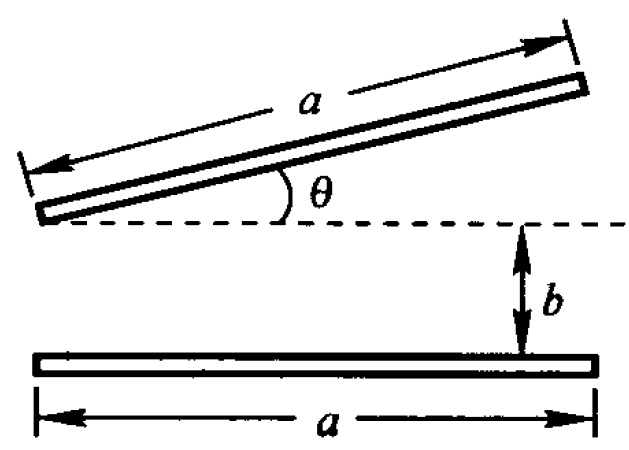

#### 例2
如图所示，一电容器的两极板都是边长为$a$的正方形金属平板，两板不是严格平行,而有一夹角$\theta$。当$\theta$很小且忽略边缘效应时，该电容器的电容$C=$()
A.$\displaystyle \frac{\varepsilon_0 a^2}{b} \left(1 - \frac{a\theta}{2b}\right) $  B. $\displaystyle \frac{\varepsilon_0 a^2}{b} \left(1 - \frac{a\theta}{4b}\right) $

C.  $\displaystyle \frac{\varepsilon_0 a^2}{2b} \left(1 - \frac{a\theta}{b}\right) $ D.  $\displaystyle \frac{\varepsilon_0 a^2}{4b} \left(1 - \frac{a\theta}{b}\right) $

建立如图所示的坐标系，可以将该电容器看做无数板面积为$\mathrm{d}S = a\mathrm{d}x$，极板间距离为$d = b+x\tan\theta$的电容器并联。
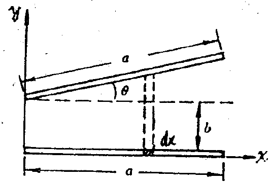

每个小电容器的电容$\mathrm{d}C = \epsilon_0\dfrac{\mathrm{d} S}{d}=\dfrac{\epsilon_0a\mathrm{d}x}{b+x\tan\theta}$

则并联后的总电容
 
 
 

$$C = \int^a_0 \dfrac{\epsilon_0a\mathrm{d}x}{b+x\tan\theta}=\dfrac{\epsilon_0 a}{\tan\theta}\int^a_0\dfrac{\mathrm{d}x}{x+\dfrac{b}{\tan\theta}}=\dfrac{\epsilon_0 a}{\tan\theta}(\ln(a+\dfrac{b}{\tan\theta})-\ln(\dfrac{b}{\tan\theta}))=\dfrac{\epsilon_0 a}{\tan\theta}\ln(1+\dfrac{a\tan\theta}{b})$$

$x\rightarrow 0$时$\ln(1+x) = x-\dfrac{1}{2}x^2$，则有$\ln(1+\dfrac{a\tan\theta}{b})=\dfrac{a\tan\theta}{b}-\dfrac{1}{2}(\dfrac{a\tan\theta}{b})^2=\dfrac{a\theta}{b}(1-\dfrac{a\theta}{2b})$
有$$C =\dfrac{\epsilon_0 a}{\theta}\dfrac{a\theta}{b}(1-\dfrac{a\theta}{2b})$$
答案为A
### 电介质
#### 电介质对电场的影响
$$U=\frac{U_0}{\epsilon_r}$$
$$C=\epsilon_rC_0$$
$$E=\frac{E_0}{\epsilon_r}$$
$\epsilon_r$为仅与电介质有关的常数，称为电介质的**相对介电常数**
#### 例题
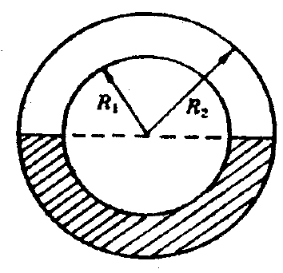

一球形电容器，内球半径 $R_1$，外球半径 $R_2$，两球面间的一半空间充满相对介电常数为 $\epsilon_r$ 的电介质，如图所示。设边缘效应可略，求其电容。

可以视作上下两电容器并联
球形电容器电容$$C=\frac{4\pi\epsilon_0R_1R_2}{R_2-R_1}$$
由
$$C=\epsilon_rC_0$$
上半电容$C_1 = \dfrac{2\pi \epsilon_0 R_1R_2}{R_2-R_1}$，下半电容$C_2 = \dfrac{2\pi \epsilon_0 \epsilon_r R_1R_2}{R_2-R_1}$
从而电容
$$C = C_1+C_2 = \dfrac{2\pi \epsilon_0 R_1R_2}{R_2-R_1}(1 + \epsilon_r)$$
#### 电极化强度
对大多数各项同性电介质来说，$\mathbf{P}$和$\mathbf{E}$有如下关系
$$\mathbf{P}=\epsilon_0\chi_e\mathbf{E}$$
#### 极化面密度
均匀电介质极化时，极化电荷面密度$\sigma'$等于极化强度在该点表面处的法向分量。即
$$\sigma'=|\mathbf{P}|\cos\theta=\mathbf{P} \cdot \mathbf{e}_n$$
其中$\mathbf{P}$为极化强度，$\mathbf{e}_n$为该点法线方向单位矢量
#### 电介质中的场强

$\chi_e$为电极化率
$$1+\chi_e=\epsilon_r$$
$$\sigma'=\sigma_0\left(1-\frac{1}{\epsilon_r}\right)$$
从而
$$\mathbf{P}=\epsilon_0\chi_e\mathbf{E}=\epsilon_0(\epsilon_r-1)\mathbf{E}$$
#### 电介质中的高斯定理
通过电场中任意闭合曲面的电位移通量，等于该闭合面所包围的自由电荷的代数和
$$\oint\mathbf{D}d\mathbf{S}=\sum q_0$$
其中$\mathbf{D}$为电位移
$$\mathbf{D}=\epsilon_0\mathbf{E}+\mathbf{P}=(1+\chi_e)\epsilon_0\mathbf{E}=\epsilon_r\epsilon_0\mathbf{E}=\epsilon \mathbf{E}$$
其中$\epsilon$称为电介质的介电常数或电容率
#### 例题
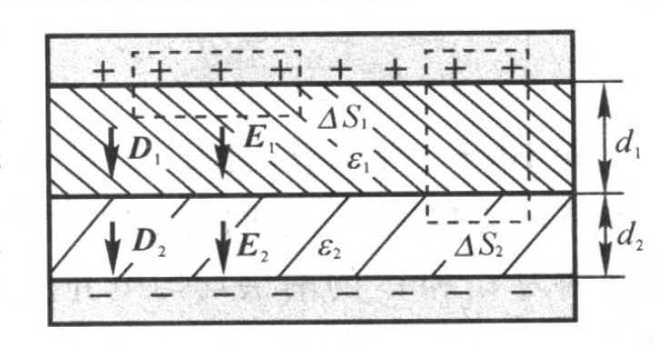

平行板电容器两极板面积为 $S$，间距为 $d$。在极板间平行地放置两块厚度分别为 $d_1$ 和 $d_2$ 的介质板，其相对介电常数分别为 $\epsilon_{r1}$ 和 $\epsilon_{r2}$。设电容器充电后两极板分别带有 $\pm q$ 的电荷。试求：
1. 电容器的电容；
2. 两介质交界面上的极化电荷面密度。

$$\begin{align*}
\oint_{S_1} \boldsymbol{D} \cdot \mathrm{d}\boldsymbol{S} &= D_1 \Delta S_1 = \sigma \Delta S_1 \\
\oint_{S_2} \boldsymbol{D} \cdot \mathrm{d}\boldsymbol{S} &= D_2 \Delta S_2 = \sigma \Delta S_2 \\
D_1 &= D_2 = \sigma = q/S
\end{align*}$$
由$D = \epsilon_0\epsilon_r E$
$$E_1 = \dfrac{D_1}{\epsilon_0\epsilon_{r1}} = \dfrac{q}{\epsilon_{r1} S},E_2 = \dfrac{D_2}{\epsilon_0\epsilon_{r2}} = \dfrac{q}{\epsilon_{r2} S}$$
$$U = E_1d_1+E_2d_2 =\dfrac{q}{S}(\dfrac{d_1}{\epsilon_{r1}}+\dfrac{d_2}{\epsilon_{r2}})$$
$$C = \dfrac{Q}{U} = \frac{\epsilon_1 \epsilon_2 S}{\epsilon_2 d_1 + \epsilon_1 d_2}$$

在交界面处，有两个表面,对于介质 1 的下表面，该表面的外法线 $\hat{\boldsymbol{n}}_1$（即离开介质 1 的方向）指向介质 2，此处的极化电荷面密度 $\sigma_{p1} = \boldsymbol{P}_1 \cdot \hat{\boldsymbol{n}}_1 = +P_1$；
对于介质 2 的上表面，该表面的外法线 $\hat{\boldsymbol{n}}_2$（即离开介质 2 的方向）指向介质 1，与 $\boldsymbol{P}_2$ 方向相反。此处的极化电荷面密度 $\sigma_{p2} = \boldsymbol{P}_2 \cdot \hat{\boldsymbol{n}}_2 = -P_2$。
$$  \sigma_{\text{界面}} = \sigma_{p1} + \sigma_{p2} = P_1 - P_2=\sigma_p = \frac{q}{S} \left( \frac{1}{\epsilon_{r2}} - \frac{1}{\epsilon_{r1}} \right)$$
### 电场的能量
#### 能量密度积分法
单位体积电场贮存的能量$w_e$为
$$w_e=\frac{1}{2}\epsilon E^2=\frac{1}{2}DE$$
从而整个电场贮存的能量为
$$W=\int_{V}w_edv$$
#### 等效电容能量公式法
$$W=\frac{1}{2}\frac{Q^2}{C}=\frac{1}{2}QU=\frac{1}{2}CU^2$$
#### 带电体的静电能公式
$$W=\frac{1}{2}\int_qUdq$$
#### 例
均匀带电球面，半径为$R$，总电量为$Q$，求这一带电系统的能量。
解一：
带电球面在球外产生电场，电场和能量密度分别为
$$E=\frac{Q}{4\pi\epsilon_0r^2},w=\frac{1}{2}\epsilon_0E^2$$
$$dV=4\pi r^2dr$$
$$W=\int^{\infty}_{R}wdV=\frac{Q^2}{8\pi\epsilon_0R}$$
解二：
$$C=4\pi\epsilon_0R,W=\frac{1}{2}\frac{Q^2}{C}=\frac{Q^2}{8\pi\epsilon_0R}$$
解三：
$$W=\frac{1}{2}\int Udq=\frac{1}{2}\int^{Q}_0\frac{Q}{4\pi\epsilon_0R}dq=\frac{Q^2}{8\pi\epsilon_0 R}$$
#### 例2
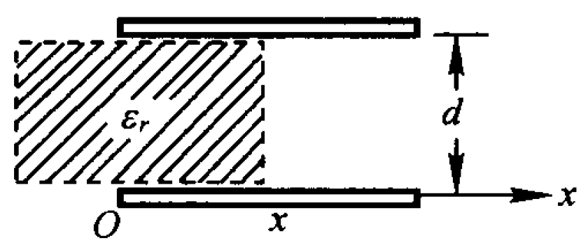

平行板电容器的极板是边长为 $a$ 的正方形, 间距为 $d$, 两板带电 $\pm Q$. 如本题图, 把厚度为 $d$、相对介电常数为 $\varepsilon_r$ 的电介质板插入一半. 试问电介质板所受电场力的大小及方向.

此题采用能量法。设电介质插入距离为$x$，该电容器可以看作两个电容器并联
$$C = \dfrac{\epsilon_0\epsilon_r ax}{d}+ \dfrac{\epsilon_0 a (a-x)}{d}$$
此时该电容器的能量为
$$W = \dfrac{1}{2}\dfrac{Q^2}{C} = \dfrac{1}{2}\dfrac{Q^2}{\dfrac{\epsilon_0\epsilon_r ax}{d}+ \dfrac{\epsilon_0 a (a-x)}{d}} = \dfrac{1}{2}\dfrac{Q^2 d}{\epsilon_0 a (a+x(\epsilon_r-1))}$$
由电场力做功与能量变化的关系
$$F = -\frac{dW}{dx} = \frac{1}{2}\frac{Q^2 d}{\epsilon_0 a}\frac{\epsilon_r - 1}{( a +x(\epsilon_r-1))^2}$$
注意到$x$增大时$W$是减小的，也就是越往里推能量越小，而电场力做正功时能量减小，因此电场力水平向右。
## 第十一章 稳恒电流
### 电流和电流密度
电流强度$I$和电流密度矢量$\mathbf{j}$的定义
$$I=\frac{dq}{dt},j=\frac{dI}{dS}$$
也即$$dI=\mathbf{j}\cdot d\mathbf{S},I=\int_S\mathbf{j}\cdot d\mathbf{S}$$
### 电流与漂移速度
设$n$为导线内单位体积的电子数
$$I=env_d\Delta S,\mathbf{j}=en\mathbf{v}_d$$
<!-- ### 电流连续性方程及稳恒的条件
电流连续性方程
$$\oint_s\mathbf{j}\cdot d\mathbf{S}=-\frac{dq}{dt}$$
稳恒条件
$$\oint_s\mathbf{j}\cdot d\mathbf{S}=0$$
### 欧姆定律的微分形式
导体元两端的电势差
$$\Delta U = E\Delta l = j\Delta S\Delta R$$
即
$$j=\frac{\Delta l}{\Delta R\Delta S}E=\frac{1}{\rho}E=\gamma E$$
矢量形式为$$\mathbf{j}=\gamma \mathbf{E}$$
$\gamma$为导体的电导率 -->
#### 例题 
直径为 $2.5\,\text{mm}$ 的铝线一端与直径为 $1.8\,\text{mm}$ 的铜线一端焊接。导线上通有 $1.3\,\text{A}$ 的稳恒电流。求：
(1)铜线和铝线中的电流密度；
(2)在铜中，平均每个原子有一个自由传导电子，求电子的漂移速度。已知铜的质量密度为 $8.96 \times 10^3\,\text{kg/m}^3$。

(1) $$j_{Al} = \dfrac{I}{S_{Al}} = \dfrac{1.3}{\pi (1.25 \times 10^{-3})^2} = 2.65 \times 10^5 \, \text{A/m}^2$$
$$j_{Cu} = \dfrac{I}{S_{Cu}} = \dfrac{1.3}{\pi (0.9 \times 10^{-3})^2} = 5.11 \times 10^5 \, \text{A/m}^2$$
(2) $$n = \frac{\rho N_A}{M} = 8.49\times 10^{28} /m^3$$ 
$$v_d = \frac{j}{en} =3.65\times 10^{-5}m/s$$
## 第十二章 稳恒磁场
### 洛伦兹力
$$\mathbf{F}=q\mathbf{v}\times \mathbf{B}$$
标量式为
$$F=qvB\sin\theta$$
其中$\theta$为速度矢量$\mathbf{v}$与磁感应强度矢量$\mathbf{B}$之间的夹角
### 毕奥-萨伐尔定律

在导线中沿电流方向取一长为$dl$的矢量线元$d\mathbf{l}$，此线元取得足够小，方向与线元内电流密度的方向相同，称$Id\mathbf{l}$为电流元。
$$d\mathbf{B}=\frac{\mu_0}{4\pi}\frac{I d\mathbf{l}\times \mathbf{r}}{r^3}$$
计算某点场强时积分即可。

### 常见的稳恒磁场
#### 载流长直导线

设真空中一长直导线$MN$中通有电流$I$。计算距导线为$a$的场点$P$的磁感应强度。

取$P$点至导线的垂足$O$为坐标原点。在载流导线上任取一电流元，它在$P$点产生的磁感应强度$d\mathbf{B}$的大小为
$$dB=\frac{\mu_0}{4\pi}\frac{Idl\sin\theta}{r^2}$$
则有$P$点的磁感应强度为
$$B=\int_L dB=\int_L \frac{\mu_0}{4\pi}\frac{Idl\sin\theta}{r^2}$$
其中
$$l=-\frac{a}{\tan\theta},r=\frac{a}{\sin\theta},dl = \frac{a}{\sin^2\theta}d\theta$$
代入上式可以得到
$$\boxed{B=\int_{\theta_1}^{\theta_2} \frac{\mu_0 I}{4\pi a}=\frac{\mu_0 I}{4\pi a}(\cos\theta_1-\cos\theta_2)}$$
对于**无限长直导线**，$\theta_1 = 0,\theta_2 = \pi$
$$\boxed{B=\frac{\mu_0 I}{2\pi a}}$$
#### 载流圆线圈

设真空中有一圆形线圈，其半径为$R$，通有电流$I$。下面计算其轴线上$P$点处的磁感应强度。
如右图，在载流圆线圈上任取一电流元，它在$P$点产生的磁感应强度$d\mathbf{B}$的大小为
$$dB=\frac{\mu_0}{4\pi}\frac{Idl}{R^2+x^2}$$
显然$dB_\perp$相互抵消，$dB_\parallel$互相加强。
$$\boxed{B=\int dB\cos\alpha=\int^{2\pi R}_0 \frac{\mu_0}{4\pi}\frac{I}{R^2+x^2}\frac{R}{\sqrt{R^2+x^2}}dl =\frac{\mu_0IR^2}{2({R^2+x^2)^{\frac{3}{2}}}}}$$
#### 载流直螺线管

对于点$P$，
$$B = \frac{\mu_0}{2}nI(\cos\beta_2-\cos\beta_1)$$
螺线管无限长时$\beta_1=\pi,\beta_2 = 0$
$$B=\mu_0 n I$$
螺线管的两个端点，相应的有$\beta_1\rightarrow \dfrac{\pi}{2},\beta_2\rightarrow 0$和$\beta_1\rightarrow \pi,\beta_2\rightarrow \dfrac{\pi}{2}$，两种情况都有
$$B = \frac{\mu_0 n I}{2}$$
#### 载流导体薄板
无限长载流导体薄板宽度为$a$,测量点距薄板距离为$y$
$$\boxed{B=\frac{\mu_0 I}{\pi a}\arctan\frac{a}{2y}}$$
测量点距离足够远时，无限大导体薄板可视为无限长直导线。
$$\boxed{B=\frac{\mu_0 I}{2\pi y}}$$
#### 例1
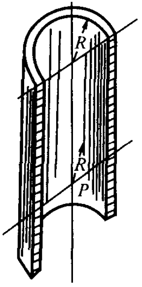
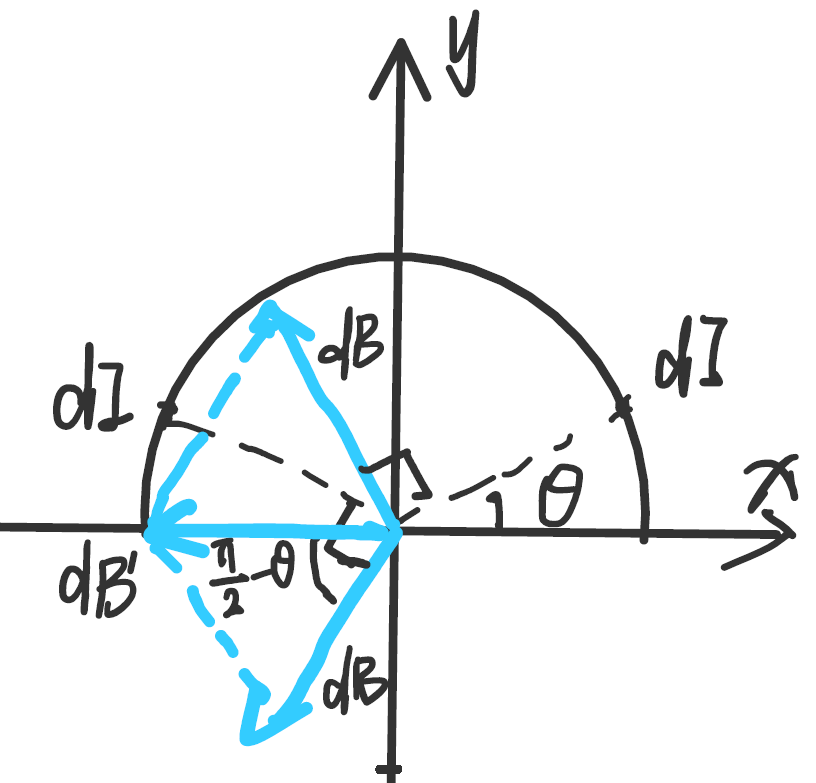

在半径 $R = 1.0 \times 10^{-2} \text{ m}$ 的无限长半圆筒形金属薄壁中，自上而下地通过 $I = 5.0 \text{ A}$ 的电流，设电流均匀地分布在薄壁上(见附图)。试求轴线上 $P$ 点的磁感应强度。

半圆筒形的金属薄壁可以看做是无限条无限长直导线的并联
对每一条直导线而言，设通过其的电流为$dI$，那么其对$P$点的磁感应强度为$dB = \dfrac{\mu_0 dI}{2\pi R}$

如图所示建立坐标系，取对称的两个$dI$一起考虑，易知其合场强为$dB' = 2dB\cos(\dfrac{\pi}{2}-\theta)=\dfrac{\mu_0 dI}{\pi R}\sin\theta$
到这里很明显了，我们是对$d\theta$进行积分，因此要将$dI$转换为$d\theta$
$$dI = \dfrac{I}{\pi R}\cdot Rd\theta = \dfrac{Id\theta}{\pi}$$
$$B = \int_0^{\frac{\pi}{2}}\dfrac{\mu_0}{\pi R}\sin\theta\cdot\dfrac{Id\theta}{\pi} = \dfrac{\mu_0I}{\pi^2 R}$$
#### 例2

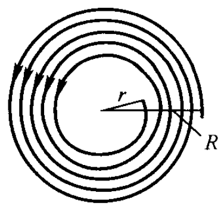

在半径为$R$及$r$的两圆周之间,有一总匝数为$N$的均匀密线平面线圈(如图)通有电流$I$,求线圈中心(即两圆圆心)处的磁感应强度。

距圆心距离为$x$的同心圆$dI = NI\cdot\dfrac{dx}{R-r}$
由载流圆线圈的磁感应强度公式
对圆心的磁感应强度贡献$$dB = \dfrac{\mu_0 dI}{2x} = \dfrac{NI\mu_0}{2x(R-r)}dx$$
积分即可
$$B = \int_r^R  \dfrac{NI\mu_0}{2x(R-r)}dx = \dfrac{NI\mu_0}{2(R-r)}\ln\dfrac{R}{r}$$

### 载流线圈的磁矩和磁偶极子

将场点到场源的距离远大于线圈尺寸的载流线圈称为**磁偶极子**。

假设上述载流圆线圈有$N$匝，且$x\gg R$，表达式可变为
$$B = \frac{N\mu_0IR^2}{2x^3}=\frac{N\mu_0IS}{2\pi x^3}(S=\pi R^2)$$
类似电偶极子的电矩，定义磁矩为
$$\mathbf{p}_m=NIS\mathbf{e}_n$$，其中$\mathbf{e}_n$为线圈平面正法线方向上的单位矢量.
引入磁矩后可以将磁感应强度表达式改写为
$$\mathbf{B} = \frac{\mu_0 \mathbf{p}_m}{2\pi x^3}$$
### 运动电荷的磁场

在载流导体中取一长为$dl$的电流元，它的截面积为$S$，单位体积内有$n$个带电粒子，每个带电粒子的电量为$q$，以平均漂移速度在导体中运动,即$I=nqSv$
$$d\mathbf{B}=\frac{\mu_0}{4\pi}\frac{Id\mathbf{l}\times \mathbf{r}}{r^3}=\frac{\mu_0}{4\pi}\frac{nqSv d\mathbf{l}\times \mathbf{r}}{r^3}$$
电流元$dl$内有$dN=nSdl$个以速度运动着的带电粒子，电流元$Idl$所产生的磁场，就是$dN$个运动电荷产生的磁场的总和。因此，每一个以速度运动的电荷所产生的磁感应强度为
$$\mathbf{B} = \frac{d\mathbf{B}}{dN}=\frac{\mu_0q\mathbf{v}\times \mathbf{r}}{4\pi r^3}$$
磁感应强度方向如上图所示。
### 磁通量

$$\Phi_m = \int_S \mathbf{B} \cdot d\mathbf{S}$$
在匀强磁场可以写成
$$\Phi_m = B S \cos\theta$$
取闭合曲面的外法线方向为法线正方向$\mathbf{n}$。在磁感应线穿出曲面处，$\mathbf{B}$与$\mathbf{n}$的夹角为锐角，相应的磁通量为正；在磁感应线穿入曲面处，$\mathbf{B}$与$\mathbf{n}$的夹角为钝角，通过该处的磁通量为负，如图所示。
### 磁场的高斯定理
磁场中任意闭合曲面的磁通量恒等于零，即
$$\Phi_m = \oint_S \mathbf{B} \cdot d\mathbf{S} = 0$$
### 安培环路定理
在稳恒磁场中，磁感应强度$B$沿任意闭合回路的线积分，等于闭合回路所包围电流代数和的$\mu_0$倍，其数学表达式为
$$\oint_L \mathbf{B} \cdot d\mathbf{l} = \mu_0 I_{内}$$
### 常见的稳恒磁场2

#### 无限长载流圆柱体
$P$点在圆柱体外时：
$$B\cdot 2\pi r = \mu_0 I$$
$$B = \frac{\mu_0 I}{2\pi r}$$
$P$点在圆柱体内时：
$$B\cdot 2\pi r  = \mu_0 \frac{I r^2}{R^2}$$
$$B = \frac{\mu_0 I r}{2\pi R^2}$$
#### 载流螺绕环

设螺绕环的总匝数为$N$，平均半径为$R$，导线中通过的电流为$I$，当环上线圈绕得很紧密时，磁场几乎全部集中在管内，在与环共轴的圆周上各点的磁感应强度的大小都相等，方向沿圆周切向。
$$B\cdot 2\pi r = \mu_0 N I$$
$$B = \frac{\mu_0 N I}{2\pi r}$$
若环的截面半径比环的平均半径小得多，上式中的$r$可用平均半径$R$代替，则环内磁感应强度为
$$B = \frac{\mu_0 N I}{2\pi R}$$

记螺线管每单位长度有$n$匝，则$n = \dfrac{N}{2\pi R}$
可知

$$B=\mu_0 n I$$

对于螺绕环外的空间,穿过这个回路的总电流为零,故得
$$B=0$$

#### 无限长载流螺线管

螺线管每单位长度有$n$匝
$$\oint_L \mathbf{B} \cdot d\mathbf{l} = \int^b_a\mathbf{B}d\mathbf{l}+\int^c_b\mathbf{B}d\mathbf{l}+\int^d_c\mathbf{B}d\mathbf{l}+\int^a_d\mathbf{B}d\mathbf{l}=Bl=\mu_0 n l I$$
$$B=\mu_0 n I$$
#### 无限大平行导体平面
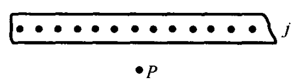

无限大平行导体平面上有均匀分布的电流，面电流密度为$j$，求平面外一点$P$的磁感应强度。

根据对称性可以判断出磁感应强度方向水平向右。根据安培环路定理
$$\oint \mathbf{B} \cdot d\mathbf{l} = \mu_0 \Sigma I$$
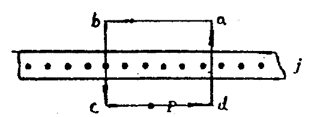

$$B \cdot \overline{ab} + B \cdot \overline{bc} \cos 90^\circ + B \cdot \overline{cd} + B \cdot \overline{da} \cos 90^\circ = \mu_0 j \overline{ab}$$
从而有
$$B = \dfrac{\mu_0 j}{2}$$
### 安培力

$$\mathbf{F} = \int^l_0 I d\mathbf{l} \times \mathbf{B}$$
#### 安培力的特性
如右图，作用在整个导线上的力与作用在通有同样电流，长度为$(2l+2R)$的直导线上的安培力相等。可以证明,无论中间一段导线的形状如何,其结果都一样。

#### 例题
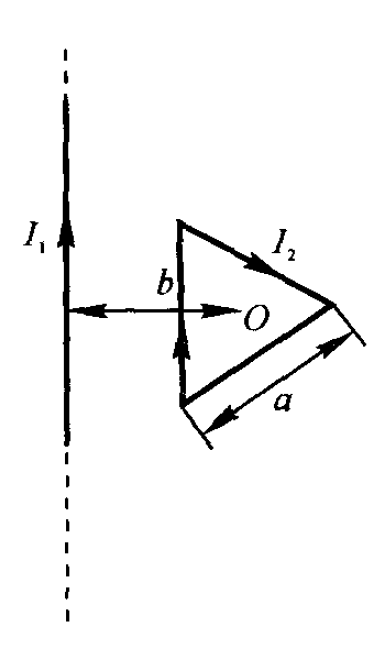

载有电流 $I_1$ 的长直导线旁有一正三角形线圈, 其边长为 $a$, 载有电流 $I_2$, 一边与直导线平行, 中心到直导线的垂直距离为 $b$。求三角形线圈所受的力。

本题需要注意的点是，不要使用上述“安培力的特性”，原因是不是匀强磁场。否则你很轻松地求出安培力为0还是错的。
受力分析易得等边三角形平行导线的边受力
$$F_1 = BIL = \dfrac{\mu_0 I_1}{2\pi (b-\dfrac{\sqrt 3}{6}a)}\cdot I_2\cdot a$$
斜边的受力（x是该点到导线的垂直距离）
$$F_2' = \int^{b+\frac{\sqrt 3}{3}a}_{b-\frac{\sqrt 3}{6}a}\dfrac{\mu_0 I_1}{2\pi x}\cdot I_2 \cdot \dfrac{2dx}{\sqrt 3} = \dfrac{\mu_0I_1I_2}{\sqrt 3 \pi}\ln \dfrac{b+\dfrac{\sqrt 3}{3}a}{b-\dfrac{\sqrt 3}{6}a}$$
两条斜边所受合力
$$F_2 = 2 F_2' \cos 60^\circ =  \dfrac{\mu_0I_1I_2}{\sqrt 3 \pi}\ln \dfrac{b+\dfrac{\sqrt 3}{3}a}{b-\dfrac{\sqrt 3}{6}a}$$
总合力
$$F = F_2-F_1 =  \dfrac{\mu_0I_1I_2}{\sqrt 3 \pi}\ln \dfrac{b+\dfrac{\sqrt 3}{3}a}{b-\dfrac{\sqrt 3}{6}a} - F_1 = BIL = \dfrac{\mu_0 I_1}{2\pi (b-\dfrac{\sqrt 3}{6}a)}\cdot I_2\cdot a$$
#### 长直导线之间的作用力

每单位长度所受的力为

$$\frac{dF_2}{dl_2}=\frac{\mu_0 I_1I_2}{2\pi d}$$
电流同向相互吸引，异向相互排斥。
在国际单位制中，电流强度是基本量，其单位“安培”就是利用平行电流间相互作用的安培力来定义的。
#### 磁场对线圈的力矩和磁矩

取与线圈中电流方向成右螺旋关系的方向为线圈平面的法线矢量$\mathbf n$的指向，线圈的面积为$S$，则磁场对线圈的力矩
$$M = BIS\sin\theta$$
写成矢量式，有
$$\mathbf{M} = \mathbf{p}_m \times \mathbf{B}$$
其中$\mathbf{p}_m = NIS\mathbf{n}$为线圈的磁矩。法线矢量$\mathbf n$的指向**与线圈中电流方向成右螺旋关系**。
#### 例题
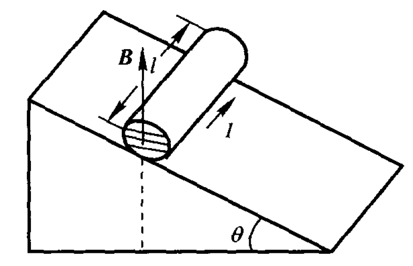
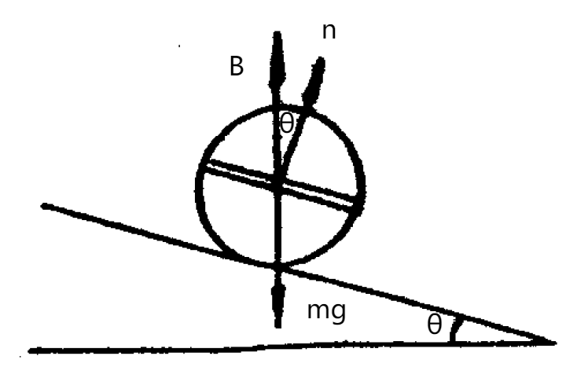

如图所示, 一斜面上放有木制圆柱, 圆柱质量 $m = 0.25 \text{ Kg}$, 半径 $R$, 长 $l = 0.10 \text{ m}$, 圆柱上缠绕有 $N = 10$ 匝的导线。斜面与水平面成 $\theta$ 角, 斜面上各处有铅直向上的均匀磁场, 磁感应强度 $B$ 为 $0.50 \text{ T}$。如果圆柱上所绕线圈的平面与斜面平行, 试问通过线圈的电流强度多大时, 圆柱才不往下滑动?

线圈受到的磁力矩
$$M = NBIS\sin\theta = 2NBIlR\sin\theta$$
重力对瞬心的力矩
$$M = mgR\sin\theta$$
$$NBIS\sin\theta = 2NBIlR\sin\theta\geq mgR\sin\theta$$
$$I\geq\dfrac{mg}{2NlB} = 2.45A$$
### 磁力的功
可以证明,一个任意的闭合载流回路,在磁场中改变位置或形状时,磁力或磁力矩所做的功都为
$$A = I \Delta \varPhi$$
### 霍尔效应
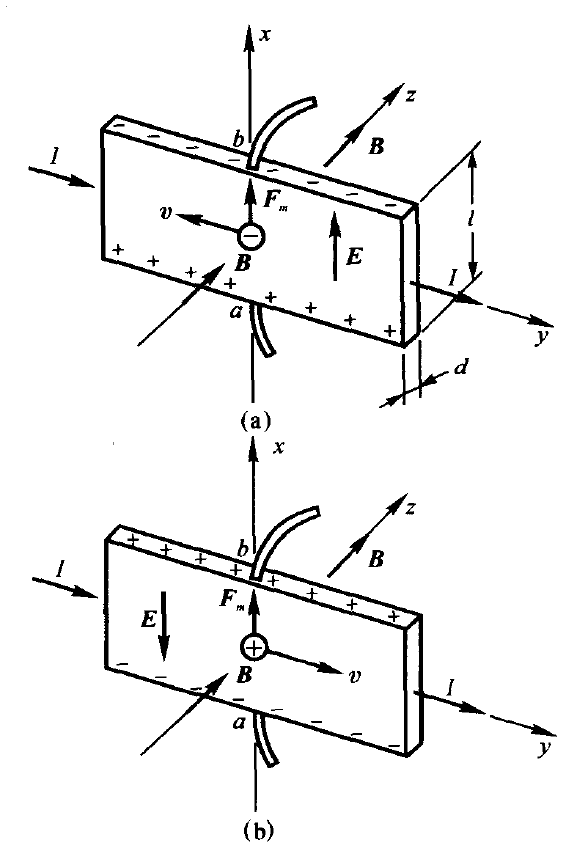

在均匀磁场中的通电导体薄板,当电流方向与磁场方向垂直时,则在垂直于磁场和电流方向的薄板上、下两端之间出现电势差，这一现象称为霍耳效应。霍尔效应可以表示为
$$U_H = R_H \frac{BI}{d}$$
其中$R_H$称为霍尔系数。

$$I = nqSv$$
式中$n$表示单位体积内的载流子个数，也称为**载流子浓度**。
解得$v = \dfrac{I}{nqS}$
$$qvB = qE$$
解得$E = vB = \dfrac{IB}{nqS}=\dfrac{IB}{nqld}$
$$U = El = \dfrac{BIl}{nq ld} = \dfrac{1}{nq}\dfrac{B}{d}$$
可知$R_H = \dfrac{1}{nq}$
**p型半导体的载流子是正电荷（positive），n型半导体的载流子是负电荷(negative)，据此由电压大小关系判断半导体类型，如右图所示。**
## 第十三章 磁场中的磁介质
### 磁感应强度、磁化强度和磁场强度
磁感应强度$\mathbf{B}$与磁场强度$\mathbf{H}$、磁化强度$\mathbf{M}$之间的关系为
$$\mathbf{B}=\mu_0(\mathbf{H}+\mathbf{M})$$
### 磁介质中的安培环路定理
磁场强度$\mathbf{H}$沿任意闭合路径的环流,等于穿过该路径所围面积的传导电流的代数和。
$$\oint_L \mathbf{H} \cdot d\mathbf{l} =  I_0$$
### 磁化率
对于各向同性的线性磁介质，磁化强度$\mathbf{M}$与磁场强度$\mathbf{H}$成正比，即
$$\mathbf{M}=\chi_m \mathbf{H}$$
其中$\chi_m$为磁介质的磁化率。
### 磁导率
由$$\mathbf{B}=\mu_0(\mathbf{H}+\mathbf{M})$$
和$$\mathbf{M}=\chi_m \mathbf{H}$$
可得
$$\mathbf{B}=\mu_0(\mathbf{H}+\chi_m \mathbf{H})=\mu_0(1+\chi_m)\mathbf{H}$$
定义$\mu_r = 1+\chi_m$为磁介质的相对磁导率。
则有
$$\mathbf{B}=\mu_0\mu_r \mathbf{H}=\mu \mathbf{H}$$
其中$\mu = \mu_0\mu_r$为磁介质的磁导率。
### 磁化电流线密度
磁化电流线密度的定义是磁介质表面单位长度的磁化电流强度，即
$$j_m = \frac{I_m}{l}$$
注意：这里的$l$是**磁介质的长度**，不是导线的长度
磁介质表面上某处磁化强度在量值上等于该处磁化电流的线密度，即
$$j_m = |\mathbf{M}|$$
磁化电流流向与$\mathbf{M}$成右螺旋关系，即将右手拇指指向 $\mathbf{M}$ 的方向，四指环绕方向就是表面磁化电流的方向。
#### 例题1

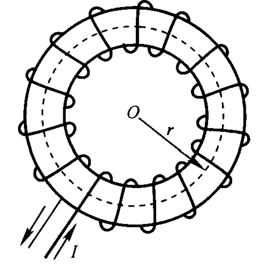

一螺线环的环芯为铝质圆环($\chi_m = 2.2 \times 10^{-5}$)，平均半径 $R = 1.0 \times 10^{-1} \text{ m}$，截面半径 $r = 1.0 \times 10^{-2} \text{ m}$，环上密绕 $N = 628$ 匝线圈，通以 $I = 5.0 \text{ A}$ 的电流。试计算环内
(1)磁场强度 $H$；
(2)磁感应强度 $B$；
(3)磁化强度 $M$；
(4)介质环表面的总磁化电流强度。

由磁介质中的安培环路定理
$$H\cdot 2\pi r = NI \\ H = \dfrac{NI}{2\pi r} = 5\times 10^3A/m \\M = \chi_m H = 0.11A/m \\ B = \mu_0(M+H) = 6.28\times 10^{-3}T$$
由$j_m =M$，$$I_m = j_m \cdot 2\pi R = 0.069A$$
其方向与导线的电流方向相同。
#### 例题2
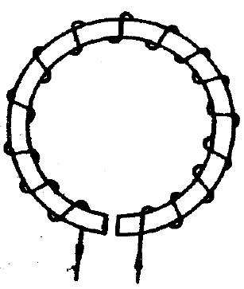

铁制的螺线环的平均周长为 $61 \text{ cm}$, 空气隙长 $1 \text{ cm}$ (如图所示)。环上线圈总数为 1000 匝, 当线圈中通过电流为 $1.5 \text{ A}$ 时, 空气隙中的磁感应强度为 $0.18 \text{ T}$。求铁环的 $\mu$ 值(忽略空气隙中磁感应线的发散)。

需要注意安培环路定理的环路经过了两种介质。记平均周长为$C$，空气隙长为$d$
$$H_1\cdot (C-d)+H_2\cdot d = NI$$
将$H_1 = \dfrac{B}{\mu},H_2 = \dfrac{B}{\mu_0}$代入即可。
$$
\mu = \frac{B(C-d)}{NI - \frac{B}{\mu_0}l_1}= 1.59 \times 10^{-3} \text{ N/A}^2
$$

### 磁滞回线

对于铁磁质而言：
随着磁场强度$H$的增大，磁感应强度$B$也增大，即图中$OS$段曲线。开始时B值随H值的增加比较缓慢（图中没有画出）,之后，B值有一急剧增加的过程,然后又缓慢下来达到一定的磁场强度值时,B值随H值的增加非常缓慢,趋于一个极限值,表明此时介质的磁化已达饱和状态,相应的磁感应强度称为**饱和磁感应强度**

当铁磁质达到饱和磁化状态后,如果逐渐减小电流使H值减小，实验表明，磁感应强度B的值也逐渐减小,但并不沿原来的起始磁化曲线OS返回原点，而是沿另一条曲线$SbcS$'下降。

当 $H$ 值降到零时, $B$ 值降至 $B_r$ (图中 $b$ 点), $B_r$ 称为**剩余磁感应强度(简称剩磁)**。这说明, 撤去电流磁场后, 铁磁质内尚保留磁性, 此时铁磁体成为永磁体了。这种 $B$ 值变化“落后”于 $H$ 值的现象称为**磁滞现象**。

为了消除剩磁, 必须加一反方向的磁场, 即电流反向。随着反向 $H$ 值的逐渐增加, $B$ 值将沿 $bc$ 曲线下降, 直至 $H = -H_c$ 时剩磁完全消失(即 $B=0$, 图中 C 点)。$H_c$ 称为**矫顽力**。**矫顽力的大小反映了铁磁质保留剩磁的能力。**

若继续增大反向磁场, 铁磁质将被反向磁化直至达到反向饱和状态 $S'$点。此后, 若使反向磁场逐渐减小到零, 然后再沿正方向增加, 则介质的磁化状态将沿图中 $S'b'c'S$ 曲线回到正向磁化饱和状态。于是形成了图 13.9 所示的闭合曲线 $sbcs'b's_o$。这条闭合曲线称为磁滞回线。

若在起始磁化曲线 $os$ 上未达到 $S$ 点之前就减小 $H$ 值, 则 $B$ 值将沿另一条曲线下降, $B$ 随 $H$ 的全部变化过程将形成较小的磁滞回线

## 第十四章 电磁感应
### 法拉第电磁感应定律
$$\varepsilon_i = - d\frac{d\Phi}{d t} = -\int_s\mathbf B\cdot d \mathbf S$$
#### 例题
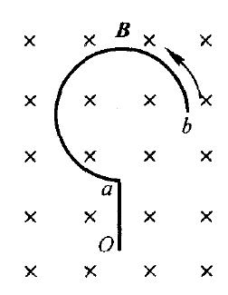

一导体被弯成附图所示的形状, 放在均匀磁场 $\mathbf{B}$ 中, $\hat{ab}$ 为半径 $R$ 的 $3/4$ 圆弧, $\overline{oa} = R$, 若此导线以角速度 $\omega$ 绕通过 $o$ 点并与磁场平行的轴逆时针匀速转动, 求此导线 $oab$ 中的动生电动势。哪一端电势高？

假设我们将$ob$直线连接，那么该闭合回路磁通量不变，即感应电动势为0。不难证明此时$oab$这段导线与$Ob$产生的感应电动势完全等效。

$$\epsilon = Blv=B \sqrt 5 R (\omega \dfrac{\sqrt 5 R}{2})=\dfrac{5}{2}B\omega^2R$$
### 全磁通和磁通链数
如果导体回路由N匝线圈串联组成，则当磁通量变化时，整个回路中的总感应电动势等于各匝线圈中产生的感应电动势之和。如果通过各匝线圈的磁通量不等，则
$$\mathscr{E}_{i} = -\frac{\mathrm{d}}{\mathrm{d}t} \left( \sum_{i=1}^{N} \Phi_{i} \right) = -\frac{\mathrm{d}\Psi}{\mathrm{d}t}$$
$\Psi =  \displaystyle\sum_{i=1}^{N} \Phi_{i}$是穿过各匝线圈的磁通量的总和,称为穿过线圈的全磁通，又叫**磁通链数**。

#### 例题
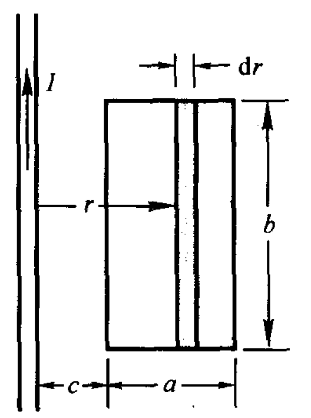

图中一长直导线载有恒定电流 $I$, 距 $c$ 近旁平行放置着匝数为 $N$, 长、宽分别为 $a$ 和 $b$ 的矩形线框。$t=0$ 时, 左边与长直导线的距离为 $c$。设矩形线框以匀速度 $v$ 垂直导线向右运动, 求线框中的感应电动势。

$$d\Psi = NBdS = \dfrac{N\mu_0I}{2\pi r}\cdot bdr$$
$$\Psi = \int^{c+a+vt}_{c+vt} \dfrac{N\mu_0I}{2\pi r}\cdot bdr =\dfrac{N\mu_0Ib}{2\pi} \int^{c+a+vt}_{c+vt} \dfrac{1}{r}dr = \dfrac{N\mu_0Ib}{2\pi}(\ln(c+a+vt)-\ln(c+vt))$$
$$\epsilon = -\dfrac{d \Psi}{dt} = \dfrac{N\mu_0Ib}{2\pi}(\dfrac{v}{c+a+vt}-\dfrac{v}{c+vt})$$
感应电动势顺时针
### 感生电场和磁通量变化率的关系

$$\oint_{L} \boldsymbol{E}_{i} \cdot \text{d}\boldsymbol{l} = \varepsilon_i=- \int_{S} \frac{\partial \boldsymbol{B}}{\partial t} \cdot \text{d}\boldsymbol{S}$$

单位正电荷绕闭合回路一周涡旋电场力所做的功等于感生电动势等于回路L所围任意曲面S中磁通量的变化率。
#### 例题
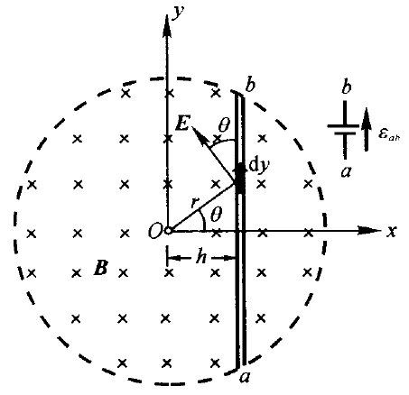

在半径为 $R$ 的圆柱形空间存在着均匀磁场, 如图所示。此磁场以 $\dfrac{dB}{dt}$ 的速率增大，其中放置细棒 $ab$, 与圆心 $O$ 的垂直距离为 $h$ (见图)。求棒 $ab$ 上的感生电动势。

对于半径为$r$的同心圆，
$$E\cdot 2\pi r = - \dfrac{dB}{dt} \pi r^2$$
$$|E| = \dfrac{r}{2}\dfrac{dB}{dt} = \dfrac{h}{2\cos\theta}\dfrac{dB}{dt}$$
方向为逆时针，如图所示。对棒取微元$dy$，则微元两侧的感应电动势
$$d\epsilon = E\cos\theta dy = \dfrac{h}{2}\dfrac{dB}{dt}dy$$
由几何关系有$y = h\tan\theta$
$$d\epsilon = \dfrac{h}{2}\dfrac{dB}{dt}d(h\tan\theta) = \dfrac{h^2}{2\cos^2\theta}\dfrac{dB}{dt}d\theta$$
$$\epsilon = \int^{\arccos \frac{h}{R}}_{-\arccos \frac{h}{R}}\dfrac{h^2}{2\cos^2\theta}\dfrac{dB}{dt}d\theta=h\sqrt{R^2-h^2}\dfrac{dB}{dt}$$
电动势方向为$a\rightarrow b$
#### 例题2

一半径为 $a$ 的无限长均匀带电圆筒面, 单位长度上的电荷为 $\lambda$, 圆筒绕 $oo'$ 以匀角加速度 $\beta$ 转动, 试求:
圆筒内与轴相距为 $b$ 的 $P_1$ 点的电场强度;

首先要想到等效为螺线管
长度为$l$的微元等效电流为$$I_l = \dfrac{\lambda l}{\dfrac{2\pi}{\beta t}} = \dfrac{\lambda l \beta t }{2\pi}$$
对于螺线管而言
$$B = \mu_0(nI)$$，其中$nI$是单位长度的电流，可知
$$B = \mu_0 \dfrac{I_l}{l} = \dfrac{\mu_0\lambda \beta t}{2\pi}$$
$$\dfrac{dB}{dt} = \dfrac{\mu_0\lambda \beta}{2\pi}$$
$$E \cdot 2 \pi b = \dfrac{dB}{dt} \pi b^2$$
$$E = \dfrac{b\mu_a \lambda \beta}{4\pi}$$
### 自感系数
根据毕奥-萨伐尔定律,载流回路在空间任一点产生的磁感应强度$\boldsymbol{B}$都与回路中的电流强度$I$成正比，因此,通过回路的全磁通$\Psi$也与$I$成正比，即
$$\Psi = L I$$
式中$L$是比例系数,称为线圈的自感系数,简称自感。
显然有感应电动势
$$\varepsilon_L =- \dfrac{d\Psi}{dt} = -L\dfrac{dI}{dt}$$
#### 常见的自感系数
##### 螺线管
单层密绕空心长直螺线管总匝数为 $N$, 长为 $l$, 半径为 $R$, 且 $l \gg R$。试求其自感系数。

长直螺线管$$B = \mu_0 nI = \mu_0\dfrac{N}{l}I$$
$$\Psi = NBS = \dfrac{\mu_0N^2I}{l}\pi R^2$$
$$L = \dfrac{\Psi}{I} = \dfrac{\mu_0N^2\pi R^2}{l}$$
##### 平行长直导线
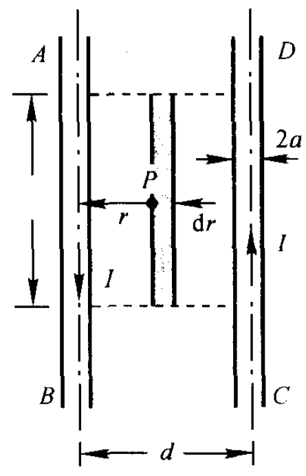

 两根半径为 $a$ 的平行长直传输线, 相距为 $d$, 且 $a \ll d$。试求长为 $l$ 的这对传输线的自感。

将这两根直导线看做一个回路。对于距离左导线为$r$的地方，磁感应强度$$B = \dfrac{\mu_0 I}{2\pi r} +  \dfrac{\mu_0 I}{2\pi (d-r)}$$
$$dS = ldr,d\Phi = BdS = \dfrac{\mu_0I}{2\pi}(\dfrac{1}{r}+\dfrac{1}{d-r})ldr$$
$$\Phi = \int_a^{d-a} \dfrac{\mu_0lI}{2\pi}(\dfrac{1}{r}+\dfrac{1}{d-r})dr =  \dfrac{\mu_0lI}{2\pi}[\ln \dfrac{r}{d-r}]^{d-a}_{a} = \dfrac{\mu_0 l I}{\pi}\ln(\dfrac{d-a}{a})$$
$$L = \dfrac{\Phi}{I} = \dfrac{\mu_0 l}{\pi}\ln(\dfrac{d-a}{a})$$
### 互感系数

设有两个相邻回路1和2,分别通以电流$I_1$和$I_2$。根据毕奥-萨伐尔定律,在回路1中电流$I_1$所产生的磁场中,任意一点的磁感应强度都和$I_1$成正比,因此通过回路2的全磁通也必然和$I_1$成正比,即
$$\Psi_{21} = M_{21}I_1$$
同理,回路2中电流$I_2$所产生的磁场通过回路1的全磁通$\Psi_{12}$为
$$\Psi_{12} = M_{12}I_2$$
可以证明$$M_{12} = M_{21} = M$$称为两回路的互感系数，简称互感。
当回路1中的电流$I_1$变化时，在回路2中产生的互感电动势为
$$\varepsilon_{21} = - \dfrac{d \Psi_{21}}{dt} = -M\dfrac{dI_1}{dt}$$
当回路1中的电流$I_2$变化时，在回路1中产生的互感电动势为
$$\varepsilon_{12} = - \dfrac{d \Psi_{12}}{dt} = -M\dfrac{dI_2}{dt}$$
#### 两回路的互感系数相等
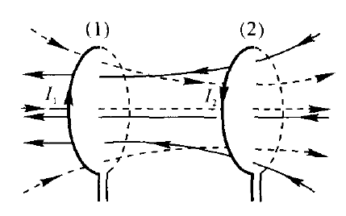

两个线圈的自感磁能分别为
$$W_1 = \dfrac{1}{2}LI_1^2,W_2 = \dfrac{1}{2}LI_2^2$$
假设给线圈1先通电到$I_1$，然后在线圈2的电流从0到$I_2$的过程中，由定义
$$\Phi_{12} = M_{12}I_2\\ \epsilon_{12}  = \dfrac{d\Phi_{12}}{dt} = \dfrac{M_{12}dI_2}{dt}$$
线圈1的电流保持不变，电源提供附加能量阻止互感电动势做功
$$W = \int^t_0\epsilon_{12}I_1 dt=\int^t_0 \dfrac{M_{12}dI_2}{dt}I_1 dt = \int_0^{I_2} M_{12}I_1 dI_2 = M_{12}I_1I_2$$
整个系统的能量为
$$W = \dfrac{1}{2}LI_1^2+ \dfrac{1}{2}LI_2^2+  M_{12}I_1I_2$$
总体能量不应该与通电顺序有关，因此
$$M_{12} = M_{21}$$
#### 常见的互感系数
##### 共轴螺线管
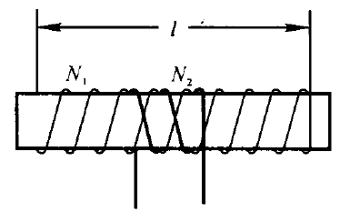

在一长度为$l$、截面积为 $S$、相对磁导率为 $\mu_r$ 的长直圆柱形介质棒上, 均匀密绕有两个共轴螺线管 $a$ 和 $b$, 它们绕向相同, 截面积都可近似等于磁介质棒的截面积, 螺线管 1 和 2 的匝数分别为 $N_1$ 和 $N_2$。(假设一个螺线管中的电流所激发​的磁通量全部通过另一个, 即无漏磁)试求两共轴螺线管的互感系数。

$$\Psi_{21} =N_2 \cdot \mu_0 \dfrac{N_1}{l}I_1 \cdot S$$
$$M = \dfrac{\Psi_{21}}{I_1} = \dfrac{\mu_0 N_1N_2S}{l}$$
#### 例题
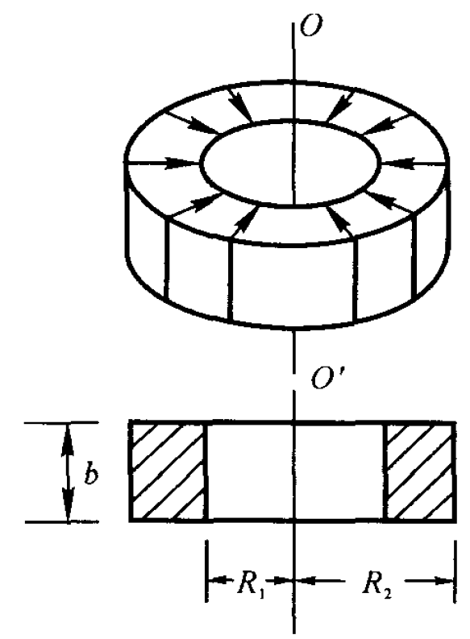

一矩形截面螺线环($\mu_r = 1$), 由细导线均匀密绕而成, 内半径为 $R_1$, 外半径为 $R_2$, 高为 $h$, 共 $N$ 匝。在螺线环的轴线上, 另有一无限长直导线 $oo'$。如图所示, 在螺线环内通以交变电流 $I = I_0 \cos \omega t$, 求当 $\omega t = \pi / 4$ 时, 在无限长直导线中的感应电动势 $\mathscr{E}_i$。

在长直导线中通入电流$I_1$
对于距离轴心$r$的同心圆，$B = \dfrac{\mu_0I_1}{2\pi r}$
磁通链数
$$dS = h \mathrm{d}r,d\Phi = B\mathrm{d}S = Bh\mathrm{d}r,d\Psi = NhB\mathrm{d}r = \dfrac{Nh\mu_0I_1}{2\pi r}\mathrm{d}r$$
$$\Psi = \int^{R_2}_{R_1}\dfrac{Nh\mu_0I_1}{2\pi r}\mathrm{d}r = \dfrac{Nh\mu_0I_1}{2\pi}\ln\dfrac{R_2}{R_1}$$
$$M = \dfrac{\Psi_{21}}{I_1} = \dfrac{Nh\mu_0}{2\pi}\ln\dfrac{R_2}{R_1}$$
$$\epsilon_1 = M\dfrac{dI}{dt} =  \dfrac{Nh\mu_0}{2\pi} I_0 \omega \sin\omega t \ln\dfrac{R_2}{R_1}$$
### 自感磁能
在一个自感系数为$L$的线圈中建立稳定电流$I_0$时,线圈中所储存的磁能为
$$W_m = \dfrac{1}{2}LI_0^2$$
称为线圈的自感磁能
### 磁能密度
单位体积内的磁能，即磁能密度为
$$\omega_m = \dfrac{1}{2}\boldsymbol{B}\cdot \boldsymbol{H}$$
## 第十五章 电磁场与电磁波
### 位移电流密度和位移电流强度
位移电流密度
$$\mathbf j_d = \dfrac{d \mathbf{D}}{dt}$$
位移电流强度
$$\mathbf I_d = \dfrac{d \Phi_d}{dt} =\int_S \dfrac{\partial \mathbf{D}}{\partial t}\cdot d \mathbf{S}$$
### 全电流安培环路定理
$$\oint_{L} \boldsymbol{H} \cdot \mathrm{d}\boldsymbol{l} = \sum I + \frac{\mathrm{d}\Phi_{\mathrm{D}}}{\mathrm{d}t} = \sum I + \int_{S} \frac{\partial \boldsymbol{D}}{\partial t} \cdot \mathrm{d}\boldsymbol{S}$$
#### 例题
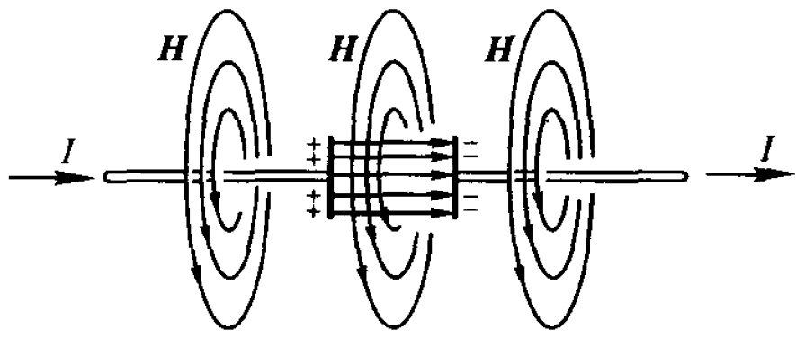

平行板电容器由半径为$R$ 的圆形极板组成。已知充电时极板间电场强度的变化率 $\dfrac{dE}{dt}$。若略去边缘效应, 求：

1.  两极板间的位移电流密度和位移电流；
2.  距两极板中心连线 $r=R$ 处的磁感应强度。

(1)
$$j_d = \dfrac{d D}{dt} = \epsilon_0 \dfrac{d E}{dt}$$
$$I_d = \dfrac{d \Phi_D}{dt} = \dfrac{dD}{dt}S =  \epsilon_0 \pi R^2\dfrac{d E}{dt}$$
(2)

$$2\pi R \cdot H =  \epsilon_0 \pi R^2\dfrac{d E}{dt}$$
$$H = \dfrac{1}{2}\epsilon_0 R\dfrac{dE}{dt}$$
$$B = \mu_0 H = \dfrac{1}{2}\mu_0\epsilon_0 R\dfrac{dE}{dt}$$
### 电磁波的波动方程
$$E = E_0\cos\omega(t-\frac{x}{c}) \\ \  \\ H = H_0\cos\omega(t-\frac{x}{c})$$

$$\dfrac{E}{H} = \dfrac{E_0}{H_0} = \sqrt{\dfrac{\mu_0}{\epsilon_0}}$$
电磁波在真空中的传播速度为
$$c = \dfrac{1}{\sqrt{\varepsilon_0\mu_0}}$$

### 能流密度
在单位时间通过垂直于传播方向上每单位面积的辐射能，即能流密度为
$$\mathbf{S} = \mathbf{E}\times \mathbf{H}$$
又称为坡印亭矢量。平均值
$$\bar{S} = \dfrac{1}{2} E_0H_0$$
