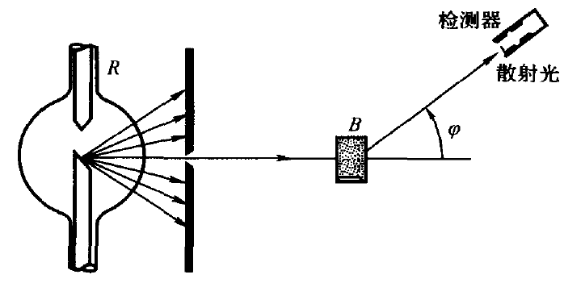

## 第二十章 电磁辐射的量子性
### 辐射出射度
在一定温度下,每单位时间内，从物体单位面积上所发射的各种波长的总辐射能称为辐射出射度,记作$M(T)$。
#### 斯忒藩-玻尔兹曼定律
$$M(T)=\sigma T^4$$
式中$σ = 5.67\times 10^{-8}W/(m^2·K^4)$，$T$为热力学温
标，即以$K$为单位。

#### 维恩位移定律
$$T\lambda_m = b$$

式中$b = 2.898×10^{-3}m·K$，$λ_m$为$M_λ(T)‒λ$曲线的峰值波长。
### 光电效应

在光的照射下电子从金属表面逸出的现象叫光电效应。因光照而逸出的电子叫光电子，部分光电子到达阳极而形成的电流叫光电流。使光电流为0的最小反向电势差的大小叫遏止电势差$U_a$
离开金属表面后的光电子的动能有大有小，设最大值为$E_{km}$，有
$$E_{km} = e|U_a|$$
#### 光子的能量与动量
光子的能量
$$E = h \nu = h \frac{c}{\lambda}$$
光子的质量
$$m = \frac{E}{c^2} = \frac{h\nu}{c^2}$$
光子的动量
$$p = mc = \frac{h\nu}{c} = \frac{h}{\lambda}$$
#### $I-U$曲线

图中的$I$为光电流，$U$为阳极和阴极之间的电势差。$I_1>I_2$代表的是入射光的强度。从图中可以看出：
1. 饱和光电流(单位时间内从阴极逸出的光电子数)与入射光强成正比。
2. 遏止电势差$U_a$与入射光强无关

#### $U_a-\nu$曲线

设电子从金属中逸出时为克服表面阻力所需的逸出功为$A$，则有
$$h\nu = A + e|U_a|$$

遏止电势差$U_a$与入射光频率正比。

某频率的光子让电子刚刚能够脱离原子或固体，但已失去动能，该频率称为红限频率
$$\nu_0 = \frac{A}{h}$$
### 康普顿效应

$\text X$射线管$R$发射波长为$\lambda_0$的$\text X$射线，经光栏后变成狭窄的射线束投射到发射物质$B$上，用检测器测量散射光在各方向上的波长及其强度。在散射线中除了有与入射线波长$\lambda_0$相同的成分外，还包含有波长大于$\lambda_0$的成分，而且波长的变
化$\Delta \lambda = \lambda - \lambda_0$随散射角$\varphi$的增大而增大，并与$\lambda_0$和散射物质无关。这种波长改变的散射称康普顿散射，或康普顿效应。
实验结果还表明，散射物质的原子量越小，散射光中波长变大的散射线强度越大，康普顿效应越显著；散射物质的原子量越大，波长变大的散射线相对
较弱。

$$\Delta \lambda = \lambda - \lambda_0 = \frac{h}{m_0c}(1-\cos\varphi)$$

式中$\dfrac{h}{m_0c} = 0.0024nm$，称为康普顿波长。
## 第二十一章 量子力学简介
### 德布罗意波
实物粒子也具有波粒二象性，能量、动量为$E$、$p$的粒子对应着频率和波长为
$$\nu = \frac{E}{h},\lambda = \frac{h}{p}$$
的波，即德布罗意波。粒子的能量$E$和动量$p$指的是相对论力学中的总能量和动量。
$$
E = mc^2 = \frac{m_0}{\sqrt{1 - v^2 / c^2}}c^2 = m_0c^2 + E_k
$$

$$
p = mv = \frac{m_0 v}{\sqrt{1 - v^2 / c^2}} \quad \quad E^2 = p^2c^2 + m_0^2c^4
$$

$$
p = \sqrt{E^2 / c^2 - m_0^2c^2} = \sqrt{\frac{(m_0c^2 + E_k)^2}{c^2} - m_0^2c^2} = \sqrt{2m_0E_k + \frac{E_k^2}{c^2}}
$$
### 测不准原理
粒子的波动性明显时，同时精确测量坐标$x$和动量$p$是不可能的。
根
据量子力学推出，当同时测量一个粒子的位置坐标（设为$x$）及其对应的动量分量(设为$p_x$)时，它们的不确定量$\Delta x$和$\Delta p_x$和之间存在如下关系
$$\Delta x \Delta p_x \geqslant \frac{\hbar}{2}$$
式中$\hbar =\dfrac{h}{2\pi}$
量子力学还导出能量和时间的不确定性关系
$$\Delta E \Delta t \geqslant \frac{\hbar}{2}$$
### 薛定谔方程
略