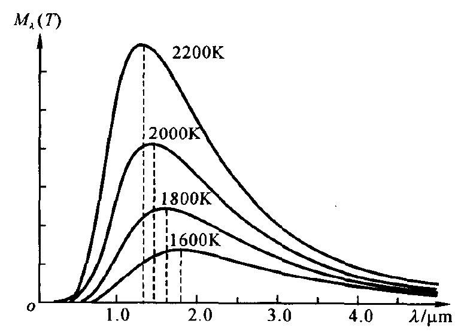
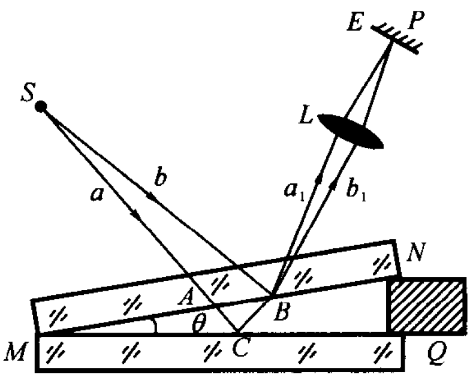
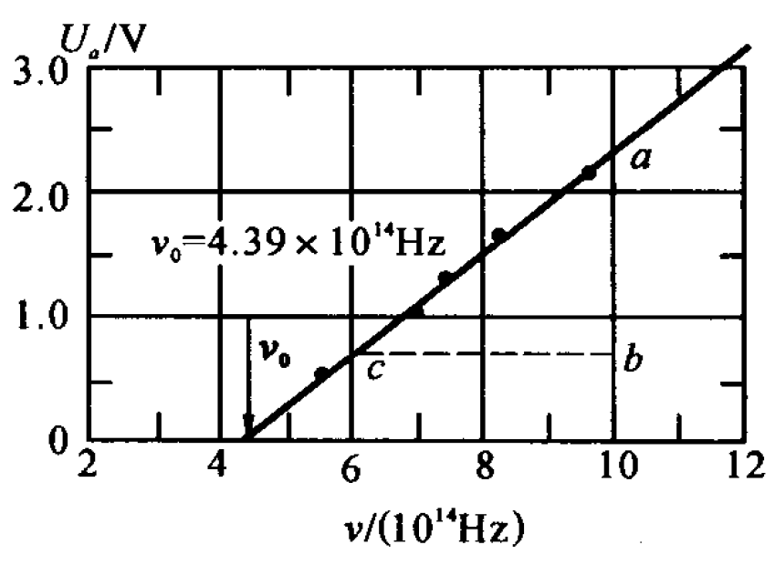

## 第二十章 电磁辐射的量子性
### 辐射出射度
在一定温度下,每单位时间内，从物体单位面积上所发射的各种波长的总辐射能称为辐射出射度,记作$M(T)$。
#### 斯忒藩-玻尔兹曼定律
$$M(T)=\sigma T^4$$
式中$σ = 5.67\times 10^{-8}W/(m^2·K^4)$，$T$为热力学温
标，即以$K$为单位。

#### 维恩位移定律
$$T\lambda_m = b$$

式中$b = 2.898×10^{-3}m·K$，$λ_m$为$M_λ(T)‒λ$曲线的峰值波长。
### 光电效应

在光的照射下电子从金属表面逸出的现象叫光电效应。因光照而逸出的电子叫光电子，部分光电子到达阳极而形成的电流叫光电流。使光电流为0的最小反向电势差的大小叫遏止电势差$U_a$
离开金属表面后的光电子的动能有大有小，设最大值为$E_{km}$，有
$$E_{km} = e|U_a|$$

#### $I-U$曲线

图中的$I$为光电流，$U$为阳极和阴极之间的电势差。$I_1>I_2$代表的是入射光的强度。从图中可以看出：
1. 饱和光电流(单位时间内从阴极逸出的光电子数)与入射光强成正比。
2. 遏止电势差$U_a$与入射光强无关

#### $U_a-\nu$曲线

设电子从金属中逸出时为克服表面阻力所需的逸出功为$A$，则有
$$h\nu + eU_a = A$$

遏止电势差$U_a$与入射光频率正比。