## 第十九章 几何光学
### 几何光学三大定律
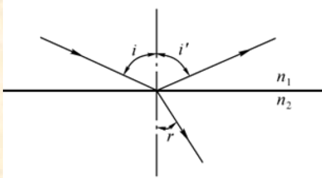

1. 直线传播定律：光在均匀介质中沿直线传播
2. 反射定律：光在反射时，入射角等于反射角，即$i=i'$
3. 折射定律：光在折射时，入射角$i$与折射角$r$满足$n_1\sin i = n_2\sin r$
### 全内反射
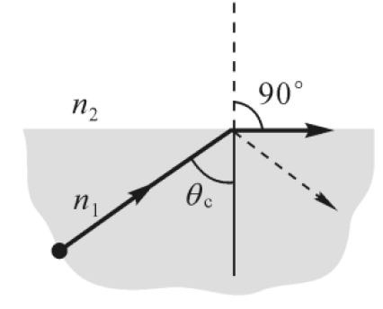

光从光密(折射率较大)介质射向光疏介质（比如水射向空气），且入射角大于某个临界角$θ_c$时，没有折射光线存在，只有反射光线。这个现象叫全内反射。
临界角由方程
$$n_1\theta_c=n_2\sin 90^\circ$$
决定。也即
$$\sin\theta_c=\frac{n_2}{n_1}$$
### 符号法则
|参数|符号法则|
|:---:|:---:|
|物距S|物与入射光在反射面同侧为正 (实物),反之为负 (虚物)。|
|像距S'|像与出射光在反射面同侧为正 (实像),反之为负 (虚像)。|
|曲率半径R和焦距f|曲率中心与出射光在反射面同侧时R为正，反之R为负。焦距f的符号与R相同。|
|垂直于光轴的线段高度y|光轴之上为正，之下为负|

其余可以看[savia的笔记](https://savia7582.github.io/Exterior/Physics/2/19/)
#### 例题
一凸透镜焦距 $f=10cm$，一凹透镜焦距 $f=10cm$，两透镜共轴放置，间距 $d=5cm$。若一物体位于凸透镜左侧 $20cm$ 处，求最终像的位置及像的虚实性。

对于凸透镜$$\frac{1}{S_1} + \frac{1}{S_1'} = \frac{1}{f_1}$$求出 $S'=20cm$，也就是说像成在凹透镜右侧 $15cm$ 处像与物不在透镜的同一边，即“虚物”，物距为负。凹透镜焦距为负$$S_2 = -15cm, f_2 = -10cm$$对凹透镜使用$$\frac{1}{S_2} + \frac{1}{S_2'} = \frac{1}{f_2}$$$S_2' = -30cm$，入射是左侧，出射是右侧，因此像在凹透镜左侧 $30cm$ 处，相距为负值说明成虚像。
## 第十六章 光的干涉
### 半波损失
半波损失是指波在反射时，相位发生 $\pi$（即 $180^\circ$）的突变，相当于光程增加了（或减少了）半个波长 $\frac{\lambda}{2}$ 的现象。简单来说，当光从“光疏介质”射向“光密介质”并发生反射时（比如空气射向水），就会发生半波损失。
### 双缝干涉
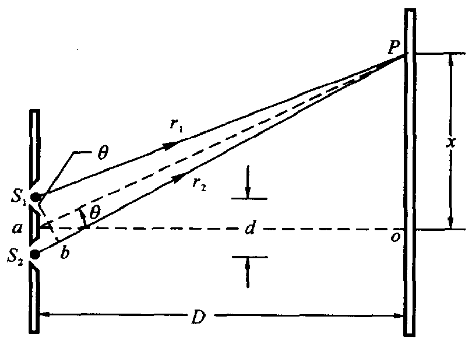

由几何关系可知两束光走过的路程差
$$r_2-r_1 = \frac{d}{D}x$$
明纹中心的位置为:
$$x = \pm \frac{D}{d} k \lambda \qquad k=0, 1, 2, \cdots$$
暗纹中心的位置为：
$$x = \pm \frac{D}{d} \left( k - \frac{1}{2} \right) \lambda \qquad k=0, 1, 2, \cdots$$
屏上相邻两明纹中心(或暗纹中心)的距离，即条纹间距$\Delta x$为
$$\Delta x = \dfrac{D}{d}\lambda$$
### 光程
在折射率为$n$的介质中，单色光的波长
$$\lambda_n = \dfrac{\lambda}{n} $$
若光波在介质中传播的几何路程为$r$，则相位变化为
$$\Delta \varphi = 2\pi\dfrac{r}{\lambda_n} = \dfrac{2\pi n r}{\lambda}$$
光在介质中传播的几何路程$r$,相当于光在真空中传播了$nr$的几何路程。我们称光在某种介质中传播的几何路程$r$乘以介质的折射率$n$为光程。两束相干光分别通过不同介质后,在空间相遇时的相位差为
$$\Delta \varphi = \dfrac{2\pi}{\lambda}(n_2r_2 - n_1r_1) =\dfrac{2\pi}{\lambda}\delta$$
$\delta$称为光程差。
做题时我们将光程差**规定为正值**（虽然理论上也可以是负值，但是取相反数就是正的了），同时，如果其中一条光路发生半波损失，那么就在原本的（几何）光程差后面**加上**$\dfrac{\lambda}{2}$从而保证光程差还是正的，如果两条光路都发生半波损失则不需要加半波损失。按以上的说法去操作，下面的$k$就是明纹、暗纹的级数。
#### 干涉条纹明暗
决定干涉条纹明暗的条件为
$$\delta = 
\begin{cases} 
k\lambda & k=1,2,3,\cdots \quad \text{明纹} \\ 
\left( k - \frac{1}{2} \right) \lambda & k=1,2,3,\cdots \quad \text{暗纹} 
\end{cases}$$
其中$k$代表明纹/暗纹级数
#### 例题
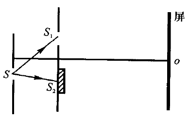

在双缝实验装置中，双缝间距为 $0.7\text{mm}$，双缝到屏的距离为 $100\text{cm}$。当用波长 $500\text{nm}$ 的单色光垂直照射时，在屏中央 $O$ 点处为中央明纹。现将单缝 $S$ 向下作微小移动，使 $SS_1 - SS_2 = \lambda/2$，再在 $S_2$ 后面贴一折射率为 $1.5$，厚度为 $l$ 的透明薄膜，观察到 $O$ 点变为第 4 级暗纹（见图）。试求
(1) 薄膜的厚度 $l$；
(2) 中央明条纹在屏上离 $O$ 点的距离；
(3) 第 2 级明条纹离 $O$ 点的距离。

(1) 设$S_1,S_2$到o点的距离均为$r$
$$\delta=SS_2+nl+r-l-(SS1+r)=(n-1)l-\frac{\lambda}{2}$$
根据干涉条纹明暗条件
$$\delta=(n-1)l-\frac{\lambda}{2}=(k-\frac{1}{2})\lambda=\frac{7}{2}\lambda$$
解得$l=4\times 10^{-6}m$
(2)设中央明条纹处为$O'$点，$S_1$到$O'$点的距离为$r_1$，$S_2$到$O'$点的距离为$r_2$
$$\delta = SS_2+nl+r_2-l-(SS_1+r_1)=r_2-r_1+(n-1)l-\frac{\lambda}{2}=0$$
又有
$$r_2-r_1 = \frac{d}{D}x$$
解得$$x = -2.5\times 10^{-3}m$$
(3)$$\delta =r_2-r_1+(n-1)l-\frac{\lambda}{2}=\pm2\lambda\\ r_2-r_1 = \frac{d}{D}x$$
解得$x=-3.93\times10^{-3}m$或$x=-1.07\times10^{-3}m$
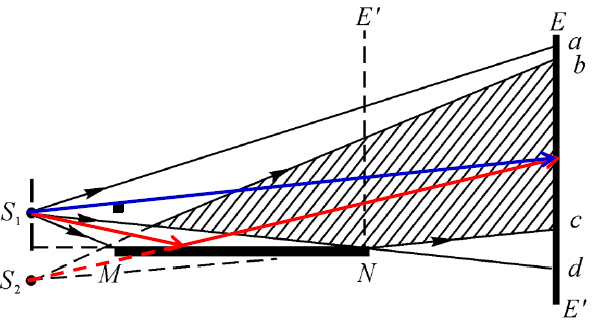

### 洛埃镜干涉
经平面镜MN反射的光与从狭缝$S_1$直接照射到bc区间的光发生干涉。
将洛埃镜看成狭缝$S_1$与其虚象$S_2$构成的杨氏双缝即可。

#### 例题
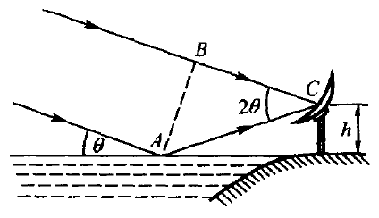

一射电望远镜的天线设在湖岸上，距湖面高度为$h$。对岸地平线上方有一恒星正在升起，恒星发出波长为$\lambda$的电磁波。试求当天线测得第1次干涉极大时，恒星所在的最小角位置（作为洛埃镜干涉分析）。

*按杨氏双缝干涉去分析，第一级明纹所在位置
$$x = \frac{D}{d}\lambda$$
恒星上升实际上是$d$增大的意思，所以第一级明纹对应的$x$逐渐减小，直到$x=h$*

以上仅为思考过程。
据图分析光程差（半波损失）
$$\delta = AC-BC+\frac{\lambda}{2}=AC(1-\cos2\theta)+\frac{\lambda}{2}=\frac{h}{\sin\theta}\cdot 2\sin^2\theta+\frac{\lambda}{2}=2h\sin\theta+\frac{\lambda}{2}$$
根据明纹条件
$$\delta = 2h\sin\theta+\frac{\lambda}{2}=\lambda$$
时接收到第一条明纹
$$\theta = \arcsin \frac{\lambda}{4h}$$

### 薄膜干涉
#### 等倾干涉
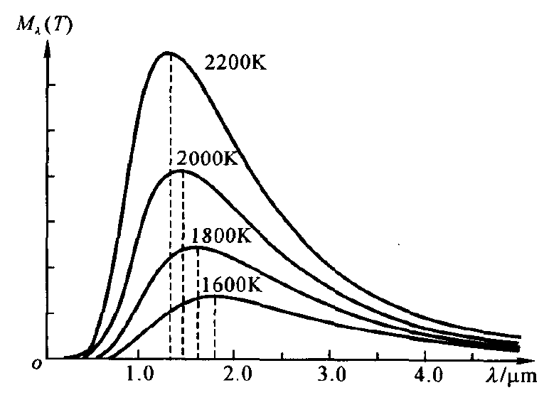

当扩展的单色光源照射厚度均匀的平行平面薄膜时，薄膜两表面的反射光会在无限远处产生干涉现象。这是将入射光的振幅(能量)分解为若干部分,再相遇产生的干涉,是分振幅法干涉。
厚度为 $e$ 的匀厚薄膜置于介质之中，膜的折射率为 $n_2$，介质的折射率为 $n_1$，设 $n_2 > n_1$。
根据折射定律
$$n_1 \sin i = n_2 \sin r$$
$a$和$b$两条光线的光程差为
$$\begin{aligned}
\delta &= n_2 (\overline{AC} + \overline{CB}) - (n_1 \overline{AD} - \frac{\lambda}{2}) \\
&= 2n_2 \frac{e}{\cos r} - 2n_1 e \tan r \sin i + \frac{\lambda}{2} \\
&= 2n_2 e \cos r + \frac{\lambda}{2} \\
\end{aligned}$$
或
$$\delta = 2e \sqrt{n_2^2 - n_1^2 \sin^2 i} + \frac{\lambda}{2}$$
因此干涉条件为
$$\delta = 2e \sqrt{n_2^2 - n_1^2 \sin^2 i} + \frac{\lambda}{2} =
\begin{cases}
k\lambda & k=1,2,3,\cdots \quad \text{明纹} \\
\left( k - \frac{1}{2} \right) \lambda & k=1,2,3,\cdots \quad \text{暗纹}
\end{cases}$$
#### 例题1
平板玻璃上有一层厚度均匀的肥皂膜。在阳光垂直照射下，在波长700nm处有一干涉极大，而在600nm处有一干涉极小，而且在这两极大和极小间没有出现其他的极值情况。已知肥皂液折射率为1.33，玻璃折射率为1.50，求此膜的厚度。

由垂直入射可知$i=0$，同时空气射向肥皂液和肥皂液射向玻璃**均发生半波损失**，因此光程差为$\delta = 2ne $
由干涉条件
$$2ne = k\lambda_1=(k+\frac{1}{2})\lambda_2$$
解得
$$k = 3,e=798.5nm$$
#### 例题2
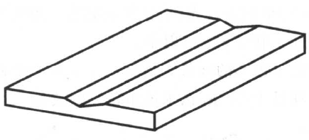

在折射率为1.50的平晶玻璃上刻有截面为等腰三角形的浅槽，内装肥皂液，折射率为1.33。当用波长为600nm的黄光垂直照射时，从反射光中观察到液面上共有15条暗纹。求液体最深处的厚度。

$$\delta = 2ne=(k-\frac{1}{2})\lambda$$
液体越深$\delta$越大，$k$越大。
考虑到暗纹应该都是成对出现，因此最深处厚度对应的一定是暗纹，而且是**第8级暗纹**，取$k=8$即可
$$e = 1.69\times 10^{-6}m$$
#### 例题3
将一滴油($n_2=1.20$)放在平玻璃片($n_1=1.52$)上，以波长入=600nm的黄光垂直照射，如图所示。从边缘向中心数，第5个亮环处油层的厚度。

$$\delta = 2ne = k\lambda$$
需要注意的是这里$e$是可以取0的，即最边缘的油膜宽度为0，是第一个亮环。因此取$k=4$。
#### 等厚干涉
##### 劈尖干涉
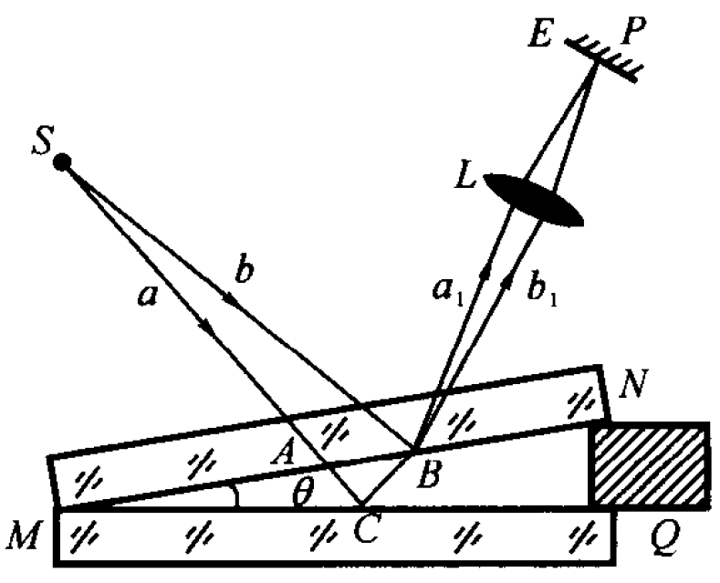

若用平行单色光**垂直**照射薄膜(即 $i=0$),由于 $\theta$ 很小,可近似使用等倾干涉的公式计算两反射光的光程差 $\delta$
$$\delta = 2ne + \frac{\lambda}{2}$$
决定干涉条纹明暗的条件为
$$\delta = 2ne + \frac{\lambda}{2} = 
\begin{cases} 
k\lambda & k=1,2,3,\cdots \quad \text{明纹} \\ 
\left( k - \frac{1}{2} \right) \lambda & k=1,2,3,\cdots \quad \text{暗纹} 
\end{cases}$$

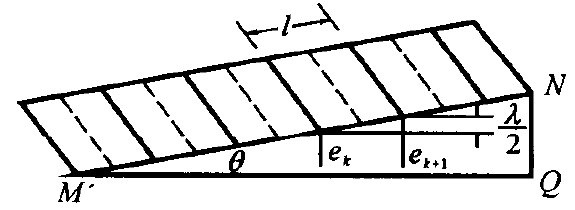

设相邻两明条纹（或暗条纹）对应的薄膜厚度为 $e_k$ 和 $e_{k+1}$，见图 16.12，则由(16.10)式可得
$$e_{k+1} - e_k = \frac{\lambda}{2n}$$因为$$e_{k+1} - e_k = l \sin\theta$$
式中$l$为相邻明纹(或暗纹)的距离。故
$$l\sin\theta = \dfrac{\lambda}{2n}$$
条纹均匀排列,间距$l$相等且和厚度$e$无关
##### 牛顿环
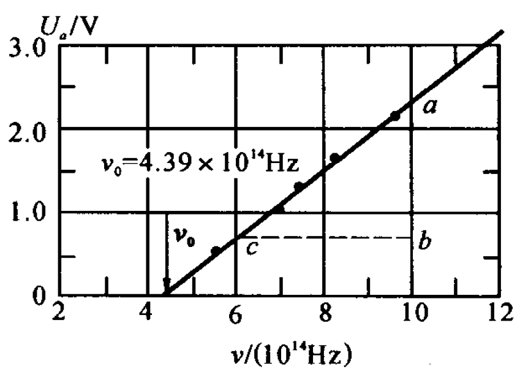

取一曲率半径相当大的平凸透镜$A$,将其凸面放在一片平玻璃$B$上面。在两玻璃面之间便形成类似劈尖式的空气薄层。当波长为入的单色光垂直入射时,在空气薄层上形成的等干涉条纹是一组内疏外密的同心圆环,称为牛顿环。

$$r^2 = R^2 - (R - e)^2 = 2Re - e^2$$

因为 $R\gg e$,故有
$$e\approx \dfrac{r^2}{2R}$$
代入以上劈尖干涉的例子
明环半径
$$r = \sqrt{(k - \frac{1}{2}) R \lambda} \quad k = 1, 2, 3, \dots,$$
暗环半径
$$r = \sqrt{kR\lambda} \quad k = 1, 2, 3, \dots,$$
#### 应用
##### 测量细丝直径

细丝直径
$$d = L\tan\theta$$
又由
$$l\sin\theta = \dfrac{\lambda}{2n}$$
以及小角度下$\tan\theta \approx \sin\theta$，消去$\theta$可得
$$d = \dfrac{\lambda L}{2n l}$$
##### 测量小角度
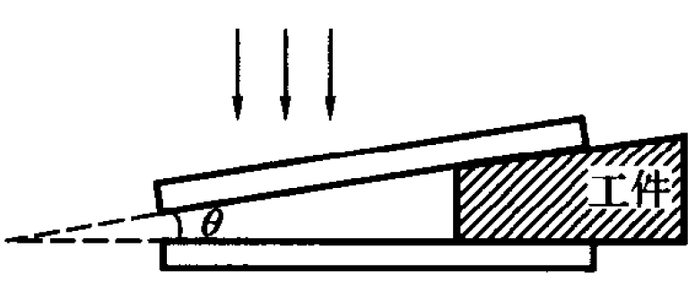
 

$$\theta \approx \sin\theta = \dfrac{\lambda}{2nl}$$

##### 检查工件表面质量
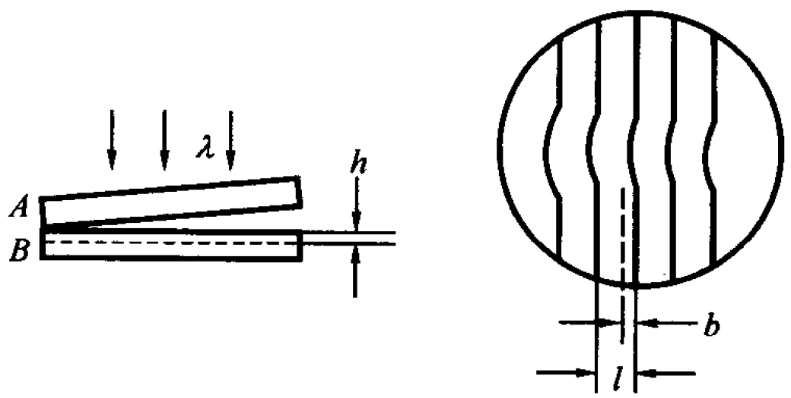

将标准平面$A$放在待测平面$B$上,形成劈尖空气薄膜。若B表面有一条刻痕,则刻痕上方的空气层厚度就较其周围大。由于同一级干涉条纹对应的气隙厚度是相同的，因此当工件表面出现凹陷时,干涉条纹就要向劈尖棱边方向弯曲。
空气中两相邻明纹对应的薄膜厚度差$\Delta e = \dfrac{\lambda}{2}(n=1)$，所以刻痕深度$h$和条纹的偏离距离$b$有关系式
$$h = \dfrac{b}{l}\cdot\dfrac{\lambda}{2}$$
式中$l$为相邻明纹(或暗纹)的水平间距。
##### 增透膜
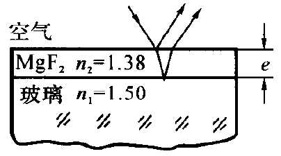

在透镜（折射率 $n_1$）表面镀一层 $\text{MgF}_2$（$n_2$）之类的透明介质薄膜，并设计合适的膜层厚度，使入射光在介质膜两个表面的两束反射光因干涉而相消。因为光线垂直入射，故**干涉相消**的条件为
$$\delta = 2n_2e=(k-\dfrac{1}{2})\lambda \quad k=1,2,\cdots$$
这里$n_2e$称为光学厚度。
$$e = (k-\frac{1}{2})\frac{\lambda}{2n_2}\quad k=1,2,\cdots$$
（反射的少了，透过的就多了，光的能量是恒定的）
注：两个表面都发生了半波损失。
##### 高反射膜
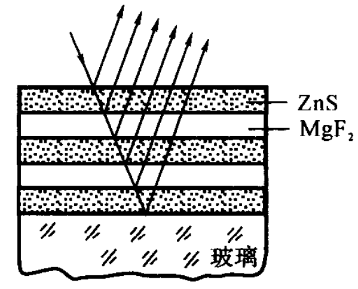

通常在玻璃（$n_1$）表面镀一层硫化锌（$n_2$）之类的高折射率的透明介质薄膜，选取合适的厚度，使膜层上、下两面的两束反射光干涉后加强，这样的薄膜称为高反射膜。
$$2n_2e+\dfrac{\lambda}{2} = k\lambda \quad k=1,2,\cdots $$
$$e = (k-\frac{1}{2})\frac{\lambda}{2n_2}\quad k=1,2,\cdots$$
### 迈克尔孙干涉仪
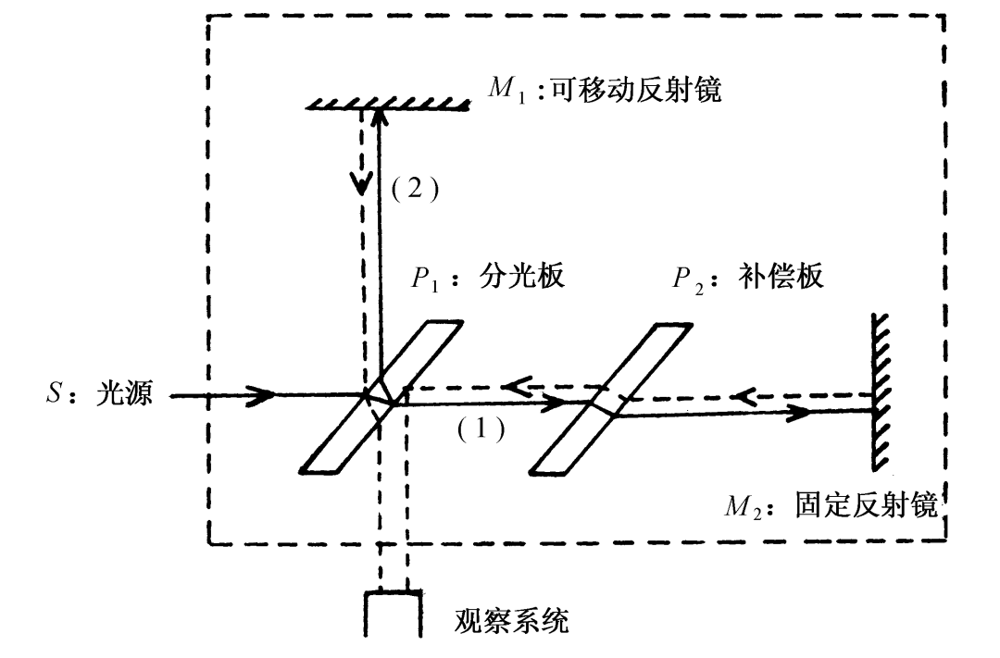

光源发出的光射到分光板上，被分成 光束1 和 光束2。光束1(**图中的(2)**) 射向反射镜 $M_1$，然后反射回来。光束2 (**图中的(1)**)射向反射镜 $M_2$，然后反射回来。两束光回到分光板处汇合，射向观察屏。如果两束光走过的路程不一样（存在光程差），它们就会发生干涉，形成明暗相间的条纹。通常在分光板旁边有一块补偿板，是为了让两条光路穿过的玻璃厚度相同而加的一块板，保证光程差只由空气距离决定。
如果移动可移动反射镜$M_1$，使其移动距离为$d$，则光程差变化为$2d$。那么可以观察到视场中移过的条纹数目为
$$N=\frac{2d}{\lambda}$$
在其中一条光束的光路上加一个玻璃片，光程差变化也是$2ne$而不是$ne$

#### 例题
如上图，在迈克耳孙干涉仪中，水平入射光波长为 $517nm$，补偿板 $P_2$ 的厚度为 $1mm$，折射率为 $\sqrt{2}$。若将 $P_2$ 从与水平方向夹角为 $i=45^\circ$ 转至与水平方向垂直的位置，将会观察到多少个明纹移过视场？

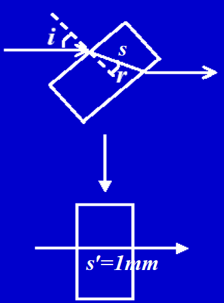

这里需要计算光在玻璃片中的光程变化
$$1\cdot \sin i = n\sin r$$
解得$r = 30^\circ$，光程$s = n\cdot \dfrac{e}{\cos 30^\circ} = \dfrac{2\sqrt 6}{3}mm$
光程差变化$\Delta \delta =\Delta s = \dfrac{2\sqrt 6}{3}-\sqrt{2}=0.2192mm$
$$N = \frac{2\Delta \delta}{\lambda}=848$$

### 时间相干性
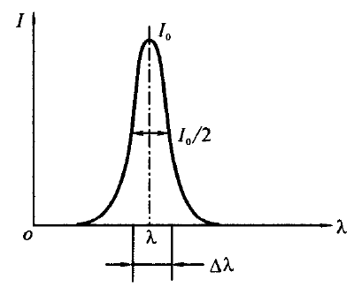

当一束光波分裂为两束相干光波并再次相遇时，能产生干涉现象的光程差必须小于波列的长度$L_c$。此极限长度$L_c$称为两束相干光波的相干长度。
真空中两列相干光波先后到达空间某点时,能产生干涉现象的时间差不能大于某一确定值$\tau$,$\tau$值为
$$\tau = \dfrac{L_c}{c}$$
一般将强度下降到$\dfrac{I_0}{2}$时所对应的波长范围称为谱线宽度,用$\Delta \lambda$表示。
$$L_c = \dfrac{\lambda^2}{\Delta \lambda}$$
时间相干性说明，光程差小于$L_c$时才能观察到干涉现象。
$$c\tau = \delta \leq L_c$$
#### 例题
用波长为500nm,谱线宽度为0.05nm的光作为光源，应用干涉方法检测薄膜的厚度，薄膜的折射率n=1. 30, 试问能检测的最大薄膜厚度是多少？

$$L_c = \dfrac{\lambda^2}{\Delta \lambda} = 5\times 10^{-3}m$$
$$\delta = 2ne\leq L_c\\ e\leq\frac{L_c}{2n}=1.92\times 10^{-3}m$$
### 空间相干性
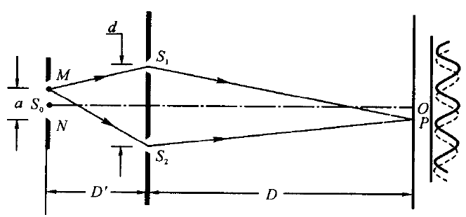

要观察到干涉现象,光源宽度必须小于
$$a = \dfrac{D'}{d}\lambda$$
称为临界宽度。
## 第十七章 光的衍射
波遇到障碍物时偏离直线传播的现象叫衍射。
### 半波带法
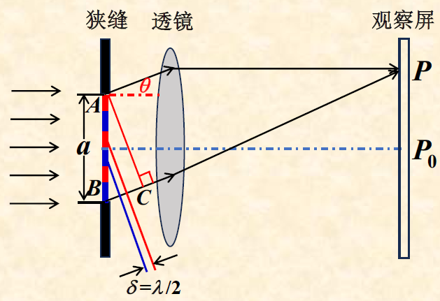

将狭缝分割为若干波带，相邻两个波带的光线在P点相遇时光程差为$\dfrac{\lambda}{2}$,即刚好干涉相消。近似认为半波带的数目
$$N = \dfrac{BC}{\dfrac{\lambda}{2}}=\dfrac{a\sin\theta}{\dfrac{\lambda}{2}}$$
那么由干涉的知识可以知道，
1. 半波带数目为偶数时，则P处为暗纹
2. 半波带数目为奇数时，有一条波带的振动未被相消，P处为明纹
3. 半波带数目为非整数时，P处的光强介于明暗之间。

#### 明暗条纹位置
显然有中央明纹中心处$\theta = 0$
明纹位置$$a \sin\theta = \pm(k+\dfrac{1}{2})\lambda, \quad (k=1, 2, 3, \dots)$$
暗纹位置$$a \sin\theta = \pm k \lambda, \quad (k=1, 2, 3, \dots)$$

注：在单缝衍射的理论中，明纹位置公式中$k=0$的情况的位置并不是中央明纹的中心，也不是一个独立的明纹峰值位置。它其实位于中央明纹边缘的某个位置。
#### 明纹范围
中央明纹范围定义为上下两个一级暗纹之间的部分
$$-\lambda < a\sin\theta <\lambda(\sin\theta \approx \theta)$$
可知$-\dfrac{\lambda}{\theta}<a< \dfrac{\lambda}{\theta}$，记中央明纹角宽度为$\Delta \theta_0$，半角宽为$\Delta \theta_0'$
有$$\Delta \theta_0 = \frac{2\lambda}{\theta},\Delta \theta_0' = \frac{\lambda}{\theta}$$
对于k级明纹，其范围
$$k\lambda < a\sin\theta <(k+1)\lambda(\sin\theta \approx \theta)$$