## 第十九章 几何光学
### 几何光学三大定律

1. 直线传播定律：光在均匀介质中沿直线传播
2. 反射定律：光在反射时，入射角等于反射角，即$i=i'$
3. 折射定律：光在折射时，入射角$i$与折射角$r$满足$n_1\sin i = n_2\sin r$
### 全内反射

光从光密(折射率较大)介质射向光疏介质（比如水射向空气），且入射角大于某个临界角$θ_c$时，没有折射光线存在，只有反射光线。这个现象叫全内反射。
临界角由方程
$$n_1\theta_c=n_2\sin 90^\circ$$
决定。也即
$$\sin\theta_c=\frac{n_2}{n_1}$$
### 符号法则
|参数|符号法则|
|:---:|:---:|
|物距S|物与入射光在反射面同侧为正 (实物),反之为负 (虚物)。|
|像距S'|像与出射光在反射面同侧为正 (实像),反之为负 (虚像)。|
|曲率半径R和焦距f|曲率中心与出射光在反射面同侧时R为正，反之R为负。焦距f的符号与R相同。|
|垂直于光轴的线段高度y|光轴之上为正，之下为负|

其余可以看[savia的笔记](https://savia7582.github.io/Exterior/Physics/2/19/)
#### 例题
一凸透镜焦距 $f=10cm$，一凹透镜焦距 $f=10cm$，两透镜共轴放置，间距 $d=5cm$。若一物体位于凸透镜左侧 $20cm$ 处，求最终像的位置及像的虚实性。

对于凸透镜$$\frac{1}{S_1} + \frac{1}{S_1'} = \frac{1}{f_1}$$求出 $S'=20cm$，也就是说像成在凹透镜右侧 $15cm$ 处像与物不在透镜的同一边，即“虚物”，物距为负。凹透镜焦距为负$$S_2 = -15cm, f_2 = -10cm$$对凹透镜使用$$\frac{1}{S_2} + \frac{1}{S_2'} = \frac{1}{f_2}$$$S_2' = -30cm$，入射是左侧，出射是右侧，因此像在凹透镜左侧 $30cm$ 处，相距为负值说明成虚像。
## 第十六章 光的干涉
### 半波损失
半波损失是指波在反射时，相位发生 $\pi$（即 $180^\circ$）的突变，相当于光程增加了（或减少了）半个波长 $\frac{\lambda}{2}$ 的现象。简单来说，当光从“光疏介质”射向“光密介质”并发生反射时（比如空气射向水），就会发生半波损失。
### 光程
在折射率为$n$的介质中，单色光的波长
$$\lambda_n = \dfrac{\lambda}{n} $$
若光波在介质中传播的几何路程为$r$，则相位变化为
$$\Delta \varphi = 2\pi\dfrac{r}{\lambda_n} = \dfrac{2\pi n r}{\lambda}$$
光在介质中传播的几何路程$r$,相当于光在真空中传播了$nr$的几何路程。我们称光在某种介质中传播的几何路程$r$乘以介质的折射率$n$为光程。两束相干光分别通过不同介质后,在空间相遇时的相位差为
$$\Delta \varphi = \dfrac{2\pi}{\lambda}(n_2r_2 - n_1r_1) =\dfrac{2\pi}{\lambda}\delta$$
$\delta$称为光程差。
做题时我们将光程差**规定为正值**（虽然理论上也可以是负值，但是取相反数就是正的了），同时，如果其中一条光路发生半波损失，那么就在原本的（几何）光程差后面**加上**$\dfrac{\lambda}{2}$从而保证光程差还是正的，如果两条光路都发生半波损失则不需要加半波损失。按以上的说法去操作，下面的$k$就是明纹、暗纹的级数。
#### 干涉条纹明暗
决定干涉条纹明暗的条件为
$$\delta = 
\begin{cases} 
k\lambda & k=1,2,3,\cdots \quad \text{明纹} \\ 
\left( k - \frac{1}{2} \right) \lambda & k=1,2,3,\cdots \quad \text{暗纹} 
\end{cases}$$
其中$k$代表明纹/暗纹级数
### 双缝干涉

由几何关系可知两束光走过的路程差
$$\delta = r_2-r_1 = d\sin\theta \approx d\tan\theta = \frac{d}{D}x$$
明纹中心的位置为:
$$x = \pm \frac{D}{d} k \lambda \qquad k=0, 1, 2, \cdots$$
暗纹中心的位置为：
$$x = \pm \frac{D}{d} \left( k - \frac{1}{2} \right) \lambda \qquad k=0, 1, 2, \cdots$$
屏上相邻两明纹中心(或暗纹中心)的距离，即条纹间距$\Delta x$为
$$\Delta x = \dfrac{D}{d}\lambda$$
#### 例题

在双缝实验装置中，双缝间距为 $0.7\text{mm}$，双缝到屏的距离为 $100\text{cm}$。当用波长 $500\text{nm}$ 的单色光垂直照射时，在屏中央 $O$ 点处为中央明纹。现将单缝 $S$ 向下作微小移动，使 $SS_1 - SS_2 = \lambda/2$，再在 $S_2$ 后面贴一折射率为 $1.5$，厚度为 $l$ 的透明薄膜，观察到 $O$ 点变为第 4 级暗纹（见图）。试求
(1) 薄膜的厚度 $l$；
(2) 中央明条纹在屏上离 $O$ 点的距离；
(3) 第 2 级明条纹离 $O$ 点的距离。

(1) 设$S_1,S_2$到o点的距离均为$r$
$$\delta=SS_2+nl+r-l-(SS1+r)=(n-1)l-\frac{\lambda}{2}$$
根据干涉条纹明暗条件
$$\delta=(n-1)l-\frac{\lambda}{2}=(k-\frac{1}{2})\lambda=\frac{7}{2}\lambda$$
解得$l=4\times 10^{-6}m$
(2)设中央明条纹处为$O'$点，$S_1$到$O'$点的距离为$r_1$，$S_2$到$O'$点的距离为$r_2$
$$\delta = SS_2+nl+r_2-l-(SS_1+r_1)=r_2-r_1+(n-1)l-\frac{\lambda}{2}=0$$
又有
$$r_2-r_1 = \frac{d}{D}x$$
解得$$x = -2.5\times 10^{-3}m$$
(3)$$\delta =r_2-r_1+(n-1)l-\frac{\lambda}{2}=\pm2\lambda\\ r_2-r_1 = \frac{d}{D}x$$
解得$x=-3.93\times10^{-3}m$或$x=-1.07\times10^{-3}m$

### 洛埃镜干涉
经平面镜MN反射的光与从狭缝$S_1$直接照射到bc区间的光发生干涉。
将洛埃镜看成狭缝$S_1$与其虚象$S_2$构成的杨氏双缝即可。

#### 例题

一射电望远镜的天线设在湖岸上，距湖面高度为$h$。对岸地平线上方有一恒星正在升起，恒星发出波长为$\lambda$的电磁波。试求当天线测得第1次干涉极大时，恒星所在的最小角位置（作为洛埃镜干涉分析）。

*按杨氏双缝干涉去分析，第一级明纹所在位置
$$x = \frac{D}{d}\lambda$$
恒星上升实际上是$d$增大的意思，所以第一级明纹对应的$x$逐渐减小，直到$x=h$*

以上仅为思考过程。
据图分析光程差（半波损失）
$$\delta = AC-BC+\frac{\lambda}{2}=AC(1-\cos2\theta)+\frac{\lambda}{2}=\frac{h}{\sin\theta}\cdot 2\sin^2\theta+\frac{\lambda}{2}=2h\sin\theta+\frac{\lambda}{2}$$
根据明纹条件
$$\delta = 2h\sin\theta+\frac{\lambda}{2}=\lambda$$
时接收到第一条明纹
$$\theta = \arcsin \frac{\lambda}{4h}$$

### 薄膜干涉
#### 等倾干涉

当扩展的单色光源照射厚度均匀的平行平面薄膜时，薄膜两表面的反射光会在无限远处产生干涉现象。这是将入射光的振幅(能量)分解为若干部分,再相遇产生的干涉,是分振幅法干涉。
厚度为 $e$ 的匀厚薄膜置于介质之中，膜的折射率为 $n_2$，介质的折射率为 $n_1$，设 $n_2 > n_1$。
根据折射定律
$$n_1 \sin i = n_2 \sin r$$
$a$和$b$两条光线的光程差为
$$\begin{aligned}
\delta &= n_2 (\overline{AC} + \overline{CB}) - (n_1 \overline{AD} - \frac{\lambda}{2}) \\
&= 2n_2 \frac{e}{\cos r} - 2n_1 e \tan r \sin i + \frac{\lambda}{2} \\
&= 2n_2 e \cos r + \frac{\lambda}{2} \\
\end{aligned}$$
或
$$\delta = 2e \sqrt{n_2^2 - n_1^2 \sin^2 i} + \frac{\lambda}{2}$$
因此干涉条件为
$$\delta = 2e \sqrt{n_2^2 - n_1^2 \sin^2 i} + \frac{\lambda}{2} =
\begin{cases}
k\lambda & k=1,2,3,\cdots \quad \text{明纹} \\
\left( k - \frac{1}{2} \right) \lambda & k=1,2,3,\cdots \quad \text{暗纹}
\end{cases}$$
#### 例题1
平板玻璃上有一层厚度均匀的肥皂膜。在阳光垂直照射下，在波长700nm处有一干涉极大，而在600nm处有一干涉极小，而且在这两极大和极小间没有出现其他的极值情况。已知肥皂液折射率为1.33，玻璃折射率为1.50，求此膜的厚度。

由垂直入射可知$i=0$，同时空气射向肥皂液和肥皂液射向玻璃**均发生半波损失**，因此光程差为$\delta = 2ne $
由干涉条件
$$2ne = k\lambda_1=(k+\frac{1}{2})\lambda_2$$
解得
$$k = 3,e=798.5nm$$
#### 例题2

在折射率为1.50的平晶玻璃上刻有截面为等腰三角形的浅槽，内装肥皂液，折射率为1.33。当用波长为600nm的黄光垂直照射时，从反射光中观察到液面上共有15条暗纹。求液体最深处的厚度。

$$\delta = 2ne=(k-\frac{1}{2})\lambda$$
液体越深$\delta$越大，$k$越大。
考虑到暗纹应该都是成对出现，因此最深处厚度对应的一定是暗纹，而且是**第8级暗纹**，取$k=8$即可
$$e = 1.69\times 10^{-6}m$$
#### 例题3
将一滴油($n_2=1.20$)放在平玻璃片($n_1=1.52$)上，以波长入=600nm的黄光垂直照射，如图所示。从边缘向中心数，第5个亮环处油层的厚度。

$$\delta = 2ne = k\lambda$$
需要注意的是这里$e$是可以取0的，即最边缘的油膜宽度为0，是第一个亮环。因此取$k=4$。
#### 等厚干涉
##### 劈尖干涉

若用平行单色光**垂直**照射薄膜(即 $i=0$),由于 $\theta$ 很小,可近似使用等倾干涉的公式计算两反射光的光程差 $\delta$
$$\delta = 2ne + \frac{\lambda}{2}$$
决定干涉条纹明暗的条件为
$$\delta = 2ne + \frac{\lambda}{2} = 
\begin{cases} 
k\lambda & k=1,2,3,\cdots \quad \text{明纹} \\ 
\left( k - \frac{1}{2} \right) \lambda & k=1,2,3,\cdots \quad \text{暗纹} 
\end{cases}$$

设相邻两明条纹（或暗条纹）对应的薄膜厚度为 $e_k$ 和 $e_{k+1}$，见图 16.12，则由(16.10)式可得
$$e_{k+1} - e_k = \frac{\lambda}{2n}$$因为$$e_{k+1} - e_k = l \sin\theta$$
式中$l$为相邻明纹(或暗纹)的距离。故
$$l\sin\theta = \dfrac{\lambda}{2n}$$
条纹均匀排列,间距$l$相等且和厚度$e$无关
##### 牛顿环

取一曲率半径相当大的平凸透镜$A$,将其凸面放在一片平玻璃$B$上面。在两玻璃面之间便形成类似劈尖式的空气薄层。当波长为入的单色光垂直入射时,在空气薄层上形成的等干涉条纹是一组内疏外密的同心圆环,称为牛顿环。

$$r^2 = R^2 - (R - e)^2 = 2Re - e^2$$

因为 $R\gg e$,故有
$$e\approx \dfrac{r^2}{2R}$$
代入以上劈尖干涉的例子
明环半径
$$r = \sqrt{(k - \frac{1}{2}) R \lambda} \quad k = 1, 2, 3, \dots,$$
暗环半径
$$r = \sqrt{kR\lambda} \quad k = 1, 2, 3, \dots,$$
#### 应用
##### 测量细丝直径

细丝直径
$$d = L\tan\theta$$
又由
$$l\sin\theta = \dfrac{\lambda}{2n}$$
以及小角度下$\tan\theta \approx \sin\theta$，消去$\theta$可得
$$d = \dfrac{\lambda L}{2n l}$$
##### 测量小角度

 

$$\theta \approx \sin\theta = \dfrac{\lambda}{2nl}$$

##### 检查工件表面质量

将标准平面$A$放在待测平面$B$上,形成劈尖空气薄膜。若B表面有一条刻痕,则刻痕上方的空气层厚度就较其周围大。由于同一级干涉条纹对应的气隙厚度是相同的，因此当工件表面出现凹陷时,干涉条纹就要向劈尖棱边方向弯曲。
空气中两相邻明纹对应的薄膜厚度差$\Delta e = \dfrac{\lambda}{2}(n=1)$，所以刻痕深度$h$和条纹的偏离距离$b$有关系式
$$h = \dfrac{b}{l}\cdot\dfrac{\lambda}{2}$$
式中$l$为相邻明纹(或暗纹)的水平间距。
##### 增透膜

在透镜（折射率 $n_1$）表面镀一层 $\text{MgF}_2$（$n_2$）之类的透明介质薄膜，并设计合适的膜层厚度，使入射光在介质膜两个表面的两束反射光因干涉而相消。因为光线垂直入射，故**干涉相消**的条件为
$$\delta = 2n_2e=(k-\dfrac{1}{2})\lambda \quad k=1,2,\cdots$$
这里$n_2e$称为光学厚度。
$$e = (k-\frac{1}{2})\frac{\lambda}{2n_2}\quad k=1,2,\cdots$$
（反射的少了，透过的就多了，光的能量是恒定的）
注：两个表面都发生了半波损失。
##### 高反射膜

通常在玻璃（$n_1$）表面镀一层硫化锌（$n_2$）之类的高折射率的透明介质薄膜，选取合适的厚度，使膜层上、下两面的两束反射光干涉后加强，这样的薄膜称为高反射膜。
$$2n_2e+\dfrac{\lambda}{2} = k\lambda \quad k=1,2,\cdots $$
$$e = (k-\frac{1}{2})\frac{\lambda}{2n_2}\quad k=1,2,\cdots$$
### 迈克尔孙干涉仪

光源发出的光射到分光板上，被分成 光束1 和 光束2。光束1(**图中的(2)**) 射向反射镜 $M_1$，然后反射回来。光束2 (**图中的(1)**)射向反射镜 $M_2$，然后反射回来。两束光回到分光板处汇合，射向观察屏。如果两束光走过的路程不一样（存在光程差），它们就会发生干涉，形成明暗相间的条纹。通常在分光板旁边有一块补偿板，是为了让两条光路穿过的玻璃厚度相同而加的一块板，保证光程差只由空气距离决定。
如果移动可移动反射镜$M_1$，使其移动距离为$d$，则光程差变化为$2d$。那么可以观察到视场中移过的条纹数目为
$$N=\frac{2d}{\lambda}$$
在其中一条光束的光路上加一个玻璃片，光程差变化也是$2ne$而不是$ne$

#### 例题
如上图，在迈克耳孙干涉仪中，水平入射光波长为 $517nm$，补偿板 $P_2$ 的厚度为 $1mm$，折射率为 $\sqrt{2}$。若将 $P_2$ 从与水平方向夹角为 $i=45^\circ$ 转至与水平方向垂直的位置，将会观察到多少个明纹移过视场？

这里需要计算光在玻璃片中的光程变化
$$1\cdot \sin i = n\sin r$$
解得$r = 30^\circ$，光程$s = n\cdot \dfrac{e}{\cos 30^\circ} = \dfrac{2\sqrt 6}{3}mm$
光程差变化$\Delta \delta =\Delta s = \dfrac{2\sqrt 6}{3}-\sqrt{2}=0.2192mm$
$$N = \frac{2\Delta \delta}{\lambda}=848$$

### 时间相干性

当一束光波分裂为两束相干光波并再次相遇时，能产生干涉现象的光程差必须小于波列的长度$L_c$。此极限长度$L_c$称为两束相干光波的相干长度。
真空中两列相干光波先后到达空间某点时,能产生干涉现象的时间差不能大于某一确定值$\tau$,$\tau$值为
$$\tau = \dfrac{L_c}{c}$$
一般将强度下降到$\dfrac{I_0}{2}$时所对应的波长范围称为谱线宽度,用$\Delta \lambda$表示。
$$L_c = \dfrac{\lambda^2}{\Delta \lambda}$$
时间相干性说明，光程差小于$L_c$时才能观察到干涉现象。
$$c\tau = \delta \leq L_c$$
#### 例题
用波长为500nm,谱线宽度为0.05nm的光作为光源，应用干涉方法检测薄膜的厚度，薄膜的折射率n=1. 30, 试问能检测的最大薄膜厚度是多少？

$$L_c = \dfrac{\lambda^2}{\Delta \lambda} = 5\times 10^{-3}m$$
$$\delta = 2ne\leq L_c\\ e\leq\frac{L_c}{2n}=1.92\times 10^{-3}m$$
### 空间相干性

要观察到干涉现象,光源宽度必须小于
$$a = \dfrac{D'}{d}\lambda$$
称为临界宽度。
## 第十七章 光的衍射
波遇到障碍物时偏离直线传播的现象叫衍射。
### 半波带法

将狭缝分割为若干波带，相邻两个波带的光线在P点相遇时光程差为$\dfrac{\lambda}{2}$,即刚好干涉相消。近似认为半波带的数目
$$N = \dfrac{BC}{\dfrac{\lambda}{2}}=\dfrac{a\sin\theta}{\dfrac{\lambda}{2}}$$

那么由干涉的知识可以知道，
1. 半波带数目为偶数时，则P处为暗纹
2. 半波带数目为奇数时，有一条波带的振动未被相消，P处为明纹
3. 半波带数目为非整数时，P处的光强介于明暗之间。

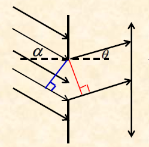

如果入射光与衍射屏法线成$\alpha$角（入射光与衍射光在衍射屏法线同侧，如果异侧$\alpha$变为$-\alpha$），那么不难看出半波带的数目变为
$$N =\dfrac{a(\sin\theta+\sin\alpha)}{\dfrac{\lambda}{2}}$$
下面所有的分析都是基于没有夹角的情况。如果有夹角将$\sin\theta$替换为$\sin\theta+\sin\alpha$即可。
注：狭缝的位置不一定要在光轴处，狭缝，透镜上下移动都不影响衍射图样**相对于光轴的分布**，只要是与光轴成相同角度的光线就会被透镜聚焦到焦平面上的同一个点。
#### 明暗条纹位置
显然有中央明纹中心处$\theta = 0$
明纹位置$$a \sin\theta = \pm(k+\dfrac{1}{2})\lambda, \quad (k=1, 2, 3, \dots)$$
暗纹位置$$a \sin\theta = \pm k \lambda, \quad (k=1, 2, 3, \dots)$$

从以上公式可以得出，白光入射时波长短的光的条纹更靠近中央。
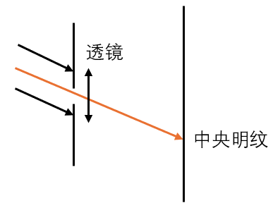

注1：在单缝衍射的理论中，明纹位置公式中$k=0$的情况的位置并不是中央明纹的中心，也不是一个独立的明纹峰值位置。它其实位于中央明纹边缘的某个位置。

注2：当入射光与衍射屏法线有夹角时，中央明纹的位置如图。
#### 例题
波长为$\lambda$的单色平行光，以角$\varphi$（与衍射屏的法线间的夹角）入射单缝衍射屏。测得第二级暗纹出现在衍射角$\theta (\theta > \varphi)$处。试求单缝的宽度。

当入射光和衍射光在法线两侧时
$$a(\sin\theta - \sin \varphi) = 2\lambda\\ a = \frac{2\lambda}{\sin\theta-\sin\varphi}$$
当入射光和衍射光在法线同侧时
$$a(\sin\theta + \sin \varphi) = 2\lambda\\ a = \frac{2\lambda}{\sin\theta+\sin\varphi}$$
#### 明纹范围和角宽度
中央明纹范围定义为上下两个一级暗纹之间的部分
$$-\lambda < a\sin\theta <\lambda(\sin\theta \approx \theta)$$
可知$-\dfrac{\lambda}{\theta}<a< \dfrac{\lambda}{\theta}$，记中央明纹角宽度为$\Delta \theta_0$，半角宽为$\Delta \theta_0'$
有$$\Delta \theta_0 = \frac{2\lambda}{\theta},\Delta \theta_0' = \frac{\lambda}{\theta}$$
对于k级明纹，其范围
$$k\lambda < a\sin\theta <(k+1)\lambda(\sin\theta \approx \theta)$$
那么显然其明纹角宽度和半角宽分别为
$$\Delta \theta_k = \frac{\lambda}{\theta},\Delta \theta_k' = \frac{\lambda}{2\theta}$$
显而易见的是，中央明纹是两个明纹的叠加，所以角宽度是一般明纹的两倍。
#### 例题
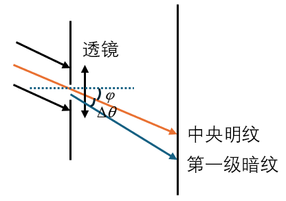

在单缝夫琅禾费街射实验中，若单色平行光斜向入射单缝（入射光与衍射光在法线异侧），试证明衔射中央明纹的半角宽度为
$$\Delta \theta = \frac{\lambda}{a\cos \varphi}$$

因为是中央明纹，因此入射光与衍射光在衍射屏法线异侧
$$a(\sin\theta_0 -\sin\varphi)=0$$
中央明纹位置$\theta_0 = \varphi$。对第一级暗纹
$$a(\sin\theta -\sin\varphi)=\lambda$$
如图，根据定义$\theta = \varphi+\Delta \theta$
$$a(\sin\theta -\sin\varphi)=a(\sin(\varphi+\Delta\theta)-\sin\varphi)=a(\sin\varphi(\cos\Delta\theta-1)+\sin\Delta \theta \cos\varphi)$$
$\cos\Delta\theta\approx 1,\sin \Delta \theta \approx \Delta \theta$
从而
$$a\Delta \theta \cos\varphi =\lambda$$
也即
$$\Delta \theta = \frac{\lambda}{a\cos \varphi}$$
### 缺级
波长 $480\mathrm{nm}$ 的单色平行光垂直照射一双缝，两缝宽度均为 $a=0.080\mathrm{mm}$，缝间距 $d=0.40\mathrm{mm}$，紧靠缝后放置焦距 $f=2.0\mathrm{m}$ 的透镜，观察屏置于透镜焦平面处。求：
(1) 在屏上单缝衍射中央亮纹范围内，双缝干涉亮纹的数目；
(2) 双缝干涉条纹的间距 $\Delta x$。

单缝衍射中央亮纹范围
$$\frac{-\lambda}{a}<\sin\theta<\frac{\lambda}{a}$$
双缝干涉亮纹位置
$$d\sin\theta = k\lambda$$
代入可以得到
$$\frac{-\lambda}{a}<\frac{k\lambda}{d}<\frac{\lambda}{a}$$
即
$$-\frac{d}{a}<k<\frac{d}{a}$$
$$-5<k<5$$
$k=0,\pm 1,\pm 2,\pm 3,\pm 4$共九条，其中$k=\pm 5$时为第一条暗纹位置，已经不可见。这种情况叫**缺级**。
(2)双缝干涉条纹的间距
$$\Delta x = \frac{D}{d}\lambda=2.4mm$$
### 振幅矢量法
衍射时光强与$\theta$的关系为
$$I = I_0\left(\frac{\sin u}{u}\right)^2$$
其中 $u = \dfrac{\pi a \sin \theta}{\lambda}$，$a$为窄缝的宽度，$I_0$为中央明纹（中央主极大）的光强。

#### 推导
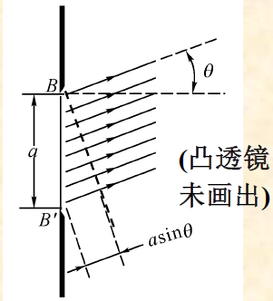

无数个小窄条发出子波。在衍射角为 $\theta$ 的方向上，相邻小窄条之间存在相位差 $\Delta \phi$。首（缝上端）尾（缝下端）两条光线的总光程差为 $\delta = a \sin \theta$。首尾的总相位差为$$n\Delta \phi = \dfrac{2\pi}{\lambda} a \sin \theta$$
为了求合振幅，我们将这 $n$ 个小窄条的振幅矢量（大小均为$A_1$）首尾相连。当 $n \to \infty$ 时，这些小矢量构成一个圆弧。弦长 $MN$ 代表合振幅 $A_\theta$（我们要求的量）。弧长代表所有子波振幅直接相加（即 $\theta=0$ 时的中央明纹最大振幅），记为$A_0=nA_1$。
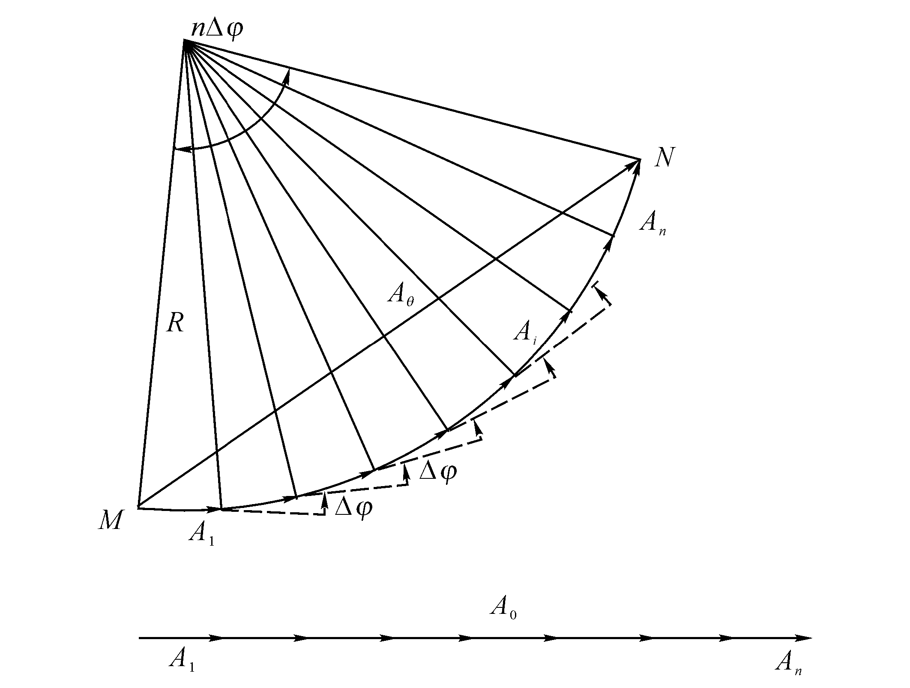

记$u=\dfrac{\pi a \sin \theta}{\lambda}$
半径$$R=\dfrac{\widehat{MN}}{n\Delta \phi}=\frac{nA_1}{n\Delta \phi} = \frac{nA_1}{2u}$$
$n\rightarrow\infty$时，$A_\theta = \widehat{MN}=|MN|= 2R\sin \dfrac{n\Delta \phi}{2}=nA_1\dfrac{\sin u}{u}$
$$I_{\theta} = A_{\theta}^2 = n^2A_1^2\left(\frac{\sin u}{u}\right)^2$$
### 光栅衍射
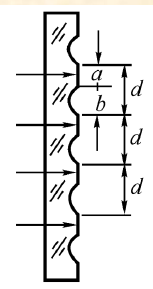

a是狭缝宽度，透明部分。b部分不透光。因此，光栅衍射图样是所有单缝衍射图样的相干叠加结果。
$$d=a+b$$称为光栅常数
 
 

#### 光栅方程
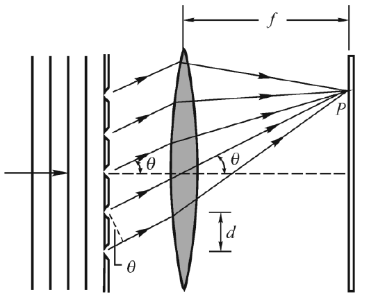

考虑干涉，那么光程差$\delta = d\sin\theta$，如图所示
明纹条件（光栅方程）为
$$d\sin\theta = \pm k \lambda \quad k = 0,1,2,\cdots$$
由该方程决定的明纹叫衍射的**主极大**。$k$称为主极大的级数或级次，也是光谱的级次。主极大的宽度就是光谱的宽度，求解时**不用考虑**上下有同级主极大相加。
主极大的级数有上限,因为
$$k=\dfrac{d\sin\theta}{\lambda}< \frac{d}{\lambda}$$
**当$\sin\theta = 1$时衍射角达到$90^\circ$，无法到达屏上。**
光线斜入射时的光栅方程：
$$d(\sin\theta+\sin\varphi)=\pm k \lambda$$
正负规定同单缝衍射。
#### 暗纹与次级大
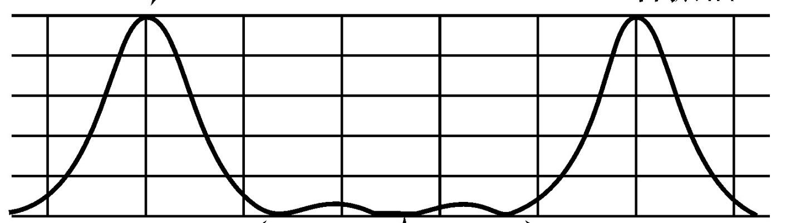

每两条相邻的主极大明纹间有$N-1$个暗纹(N为光栅的狭缝数目)和$N-2$个次极大。$N$越大，两个主极大之间的暗纹和次极大越多，主极大越明锐。
如右图（振幅矢量图）所示，两个主极大（两峰）之间有3条暗纹（与横轴的交点）和两个次级大（小鼓包）。可以推断出$N=4$
#### 缺级
由于光栅图样是单缝衍射图样叠加而成，在单缝衍射的暗纹区域由光栅方程算得的明纹位置实际上仍为暗纹，这种现象叫缺级。
$$d\sin\theta = \pm k\lambda \quad k=0,1,2,\cdots \\ a\sin\theta = \pm k' \lambda \quad k'=1,2,3,\cdots$$
从而当$\dfrac{d}{a}=\dfrac{k}{k'}$时就会出现缺级，即$\dfrac{d}{a}$为整数之比时就出现缺级。因此。所缺的主极大级次$k$为$\dfrac{d}{a}$的整数倍。同时主极大级次也应保证为整数。
例如$\dfrac{d}{a}=\dfrac{5}{2}$时，缺级的主极大级次
$$\pm \frac{10}{2},\pm\frac{20}{2},\pm\frac{30}{2}\cdots$$
#### 分辨率
恰能分辨的两条谱线的平均波长λ与这两条谱线的波长之差的比值叫分辨率。
$$R=\frac{\lambda}{\Delta\lambda}=kN$$
$k$为主极大级数，$N$为被光照射到的光栅总缝数。
#### 例题1
试按下列要求设计光栅：当白光(400nm~760nm)垂直照射时，在30°衍射方向上观察到波长为600nm的第二级主极大，且能分辨$\Delta \lambda=0.05nm$的两条谱线，同时在该处不出现其他谱线的主极大。

$$d\sin \theta=2\lambda$$
解得$d = 2400nm$
$$N = \frac{\lambda}{k\Delta \lambda} = 6000$$
$$d\sin \theta=k\lambda$$
$400nm\leq\lambda\leq 760nm$时$1.58\leq k \leq 3$
$\lambda = 400nm$时$30^\circ$衍射位置观察到波长为$400nm$的第三级主极大，因此此处缺级
$$\frac{d}{a}=3$$
（等于$\dfrac{3}{2}$也理论可行)$a = 800mm$
因此满足上述条件光栅的光栅常数为2400nm，缝宽为800nm，总缝数 N=6000条。
#### 例题2
将一束波长为$\lambda=589nm$的平行钠光入射到$1cm$内有$5000$条刻痕的平面衍射光栅上。光栅的透光缝宽度$a$与刻痕（不透光）宽度$b$相等。

(1)光线垂直入射，单缝衍射一级暗纹和一级明纹的衍射角
(2)若光线以与光栅平面法线的夹角$\varphi = 30^\circ$，则该光线能看到几条光栅谱线？是哪几条？

(1) $d=\dfrac{1cm}{5000}=2\times 10^{-8}m,a = \dfrac{d}{2}=1\times 10^{-8}m$
$a\sin\theta = \pm \lambda$，解得一级暗纹衍射角$\theta = \pm 36^\circ$
$a\sin\theta = \pm (3+\dfrac{1}{2})\lambda$，解得一级暗纹衍射角$\theta = \pm 62^\circ$
(2) 如果入射光与干涉光相对法线同侧
$$d(\sin \varphi +\sin \theta)= k \lambda$$
$$-\frac{1}{2}\frac{d}{\lambda}<k=\frac{d(\sin\theta+\dfrac{1}{2})}{\lambda}<\frac{3}{2}\frac{d}{\lambda}$$
解得$$-1.7<k<5.1$$
其中$\dfrac{d}{a}=2$的整数倍缺级
可以看到的谱线为$k=\pm1,0,3,5$共五条谱线。
入射光与干涉光相对法线异侧同理
可以看到的谱线为$k=\pm1,0,-3,-5$共五条谱线。
#### 例题3
波长范围在$450\sim 650nm$之间的复色平行光垂直照射在每厘米有$500$条刻线的光栅上，观察屏放在透镜的焦平面上，屏上第二级光谱各色光在屏上所占范围为$20mm$。求透镜的焦距。

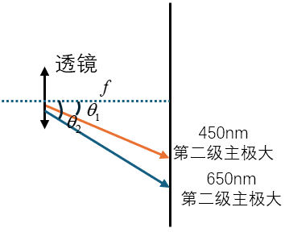

$d=\dfrac{1cm}{500}=2\times 10^{-5}m$
$$d\sin \theta = 2\lambda$$
$\lambda = 450nm$时$\theta_1 = 2.58^\circ$，$\lambda = 650nm$时$\theta_2 = 3.73^\circ$
$$\Delta x = f(\tan\theta_2-\tan\theta_1)$$
解得$$f=0.9934m$$
注：当不给数据的时候，常认为$\sin\theta\approx \tan\theta$，当然给了数据你也可以这么认为，但要注意是否是小角度以防坑你。
### 圆孔夫朗禾费衍射
衍射屏为小圆孔，平行光入射，小孔后放置凸透镜。观察屏上呈现一组明暗相间的同心圆环。中间为亮斑，占所有衍射光强度的84%，称为爱里斑。爱里斑的边缘，即第一级暗纹，对圆孔的张角为（弧度制）
$$\theta_0 = 1.22\dfrac{\lambda}{D}$$
其中$D$为圆孔衍射屏的直径。
<!-- #### 光学仪器的最小分辨角
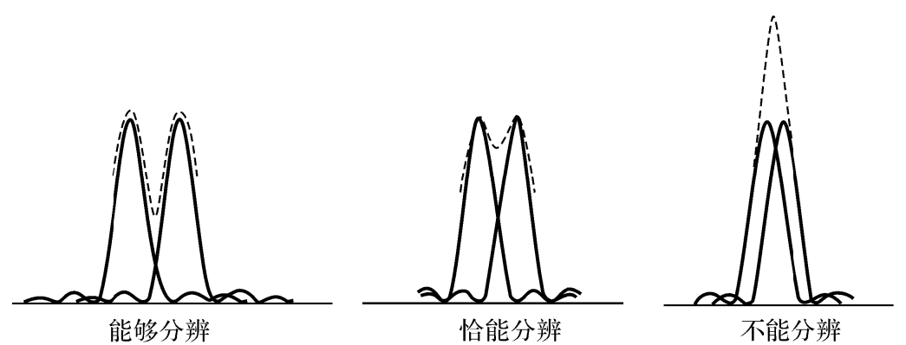

瑞利判据：一个爱里斑边缘(第一级衍射暗纹)落在另一个爱里斑中心时恰能分辨。
在恰能分辨时，两物点对透镜中心的张角叫最小分辨角。
$$\theta_{min} = 1.22\dfrac{\lambda}{D}$$
望远镜的分辨率
$$R=\frac{1}{\theta_{min}}=\frac{D}{1.22\lambda}$$
### X射线在晶体上的衍射
晶体上的衍射是相邻平行晶面的**反射**光之间再相干叠加，公式为
$$2d\sin\theta = k\lambda \quad k=1,2,\cdots$$
因此能观察到的衍射极大的光波长极大值
$$\lambda_{max}=2d$$
式中$d$为晶面间距或晶格常数，$\theta$为掠射角，是光线和晶面之间的夹角。 -->
## 第十八章 光的偏振
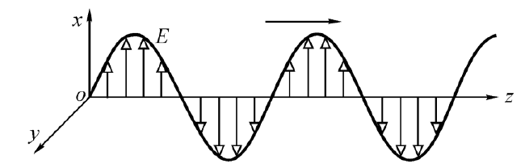

光波是横波,横波的光振动方向一定在垂直于传播方向的平面内,如右图所示为振动方向在纸面内的线偏振光。
### 线偏振光与部分偏振光
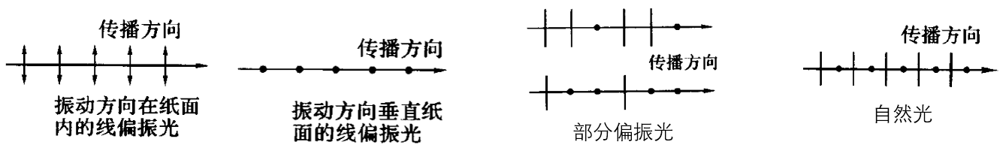
把偏振光“压到”$xoy$平面内，那么振动方向就可以像前两张图一样表示。如果光矢量始终在xoy面内的一个固定方向振动，则这样的光叫线偏振光。可以将自然光看作是由两个振动方向互相垂直、相互间没有固定相位差、等振幅的线偏振光组合而成的。部分偏振光介于两者之间。
### 马吕斯定律
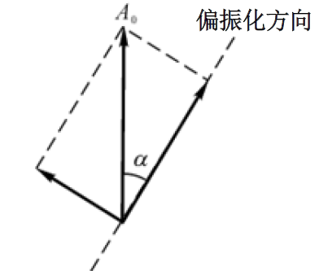

设入射的线偏振光的强度为$I_0$，振动方向与偏振化方向夹角为$α$，透过偏振片后的光强为
$$I = I_0\cos^2\alpha$$
如果入射光为自然光,透过偏振片后的光强为
$$I = \frac{I_0}{2}$$
#### 例题
强度为$I_0$的一束自然光相继通过三个偏振片P1, P2, P3后出射强度为$I=\dfrac{I_0}{8}$。已知P1和P3的偏振化方向相互垂直，若以入射光为轴旋转P2使出射光强为0，则P2转过的角度至少为_______。

设P1,P2的偏振化方向夹角为$\alpha$
$$I = \frac{1}{2}\cos^2\alpha\cos^2(90^\circ-\alpha)=\frac{I_0}{8}$$
$$\alpha = 45^\circ$$
令$\cos\alpha=0$或$\cos(90^\circ - \alpha)=0$，都需要旋转$45^\circ$
### 布儒斯特定律
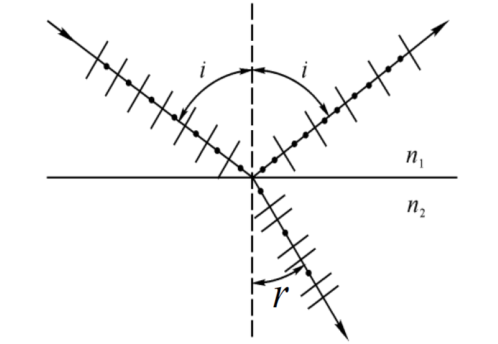

对于等各向同性均匀介质：
1. **反射光中垂直于入射面振动的光较强。**
2. **折射光中平行于入射面振动的光较强。**
3. 当入射角$i$与折射角$r$满足$i+r = 90^\circ$的时候，反射光成为线偏振光，**振动方向垂直于入射面**。折射光仍为部分偏振光，具有入射光中全部平行于入射面的振动，并且垂直于入射面的振动成分很少。

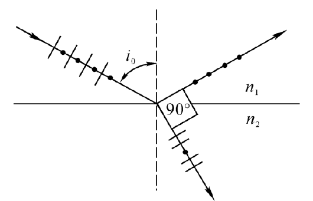

此时的入射角$i_0$称为布儒斯特角或起偏振角
$$\tan i_0 = \frac{n_2}{n_1}$$
其中$i_0$为布儒斯特角
#### 线偏振光入射的情况
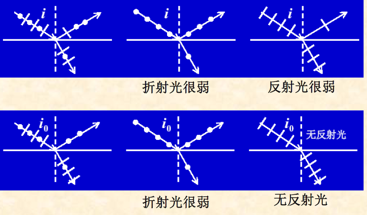

1. 两行的第一张图就是布儒斯特定律的内容。
1. 两行的第二张图表明，垂直于纸面的线偏振光入射，折射光很弱
2. 两行的第三张图表明，平行于纸面的线偏振光入射，当入射角不是布儒斯特角时，反射光很弱；当反射光是布儒斯特角时，无反射光。

### 光的双折射
一束单色光进入光学各向异性媒质后分裂成两束线偏振光、沿不同方向折射。这种现象叫双折射。
#### 光轴
不发生双折射的特殊入射方向叫晶体的光轴。
#### 主平面
光轴的平行线与入射光线相交所确认的平面
#### o光和e光
在双折射材料(媒质)内部分裂出的两束光中，一束服从通常的折射定律，叫寻常光，简称o光(ordinary ray)。另一束不服从折射定律且一般不在入射面内，叫非寻常光，简称e光(extraordinary ray)。
**o光振动方向垂直于其主平面，e光振动方向平行于其主平面。**
#### 正晶体与负晶体
在垂直于光轴的方向上，如果o光速率大于e光速率，那么这种晶体叫正晶体; 反之叫负晶体。
正晶体（石英）：$v_o>v_e,n_o<n_e$
负晶体(方解石)：$v_o<v_e,n_o>n_e$
#### o光与e光的传播法则
下图中椭圆形为光传递的波面，主要用来表示速度，也就是说，越靠外面的波面，对应的光速度越大。以负晶体为例。
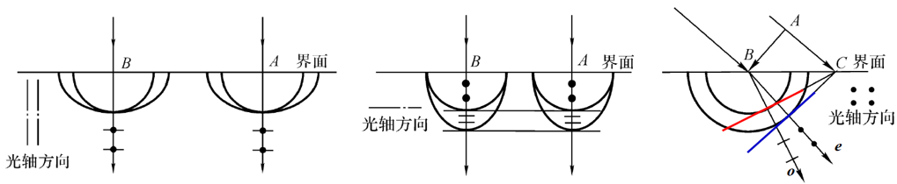

1. 光轴在入射面内且与界面垂直，平行光束正入射负晶体表面。如第一张图所示，因为沿光轴方向传播，所以不发生双折射。
2. 光轴在入射面内且与界面平行，平行光束正入射负晶体表面。如第二张图所示，主平面即为纸面，垂直与纸面传播的为$o$光，速度慢；平行于纸面传播的为$e$光，速度快。
3. 光轴与界面平行且垂直入射面，平行光束斜入射晶体表面。如第二张图所示，主平面即为光线向纸面内延伸所对应的平面（比如图中e光的偏振方向对应的平面）。负晶体中$n_o>n_e$.

#### o光与e光的强度
设入射偏振光的光振幅为$A$，光强为$I$，入射光振动方向与光轴的夹角为$α$，则
$$A_o = A\sin\alpha ,A_e = A\cos\alpha$$
$$I_o =A_o^2=I^2\sin^2\alpha,I_e =A_e^2=I^2\cos^2\alpha$$

#### 例题
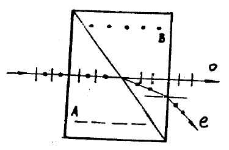
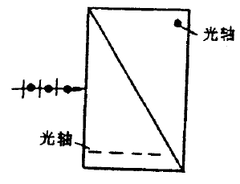

洛匈棱镜是由两块方解石直角三棱镜粘合面成的。梭镜A和B的光轴分别平行和垂直于截面，如图所示。自然光垂直入射棱镜A，试画出o光和e光的传播方向及光矢量的振动方向。

需要注意的是，在A中平行光轴的时候，符合正常的折射定律，所以都是$o$光（包括偏振方向垂直纸面的光），折射率为$n_o$，穿过界面后偏振方向垂直纸面的光在$B$中变为e光，折射率变化而发生折射，而平行纸面振动的光因为一直是o光所以折射率不变。
### 波片
波片利用双折射和干涉原理来改变出射光的相位。
经过波片后o光与e光的光程差
$$\delta = |n_o-n_e|d$$
其中$d$为波片厚度。相位差
$$\varphi = \frac{2\pi}{\lambda}|n_o-n_e|d$$
选择合适的d，可以得到技术上常用的1/4波片和1/2波片。
1/4波片令$\delta = \dfrac{\lambda}{4}$或$\varphi = \dfrac{\pi}{2}$，1/2波片令$\delta = \dfrac{\lambda}{2}$或$\varphi = \pi$即可。
