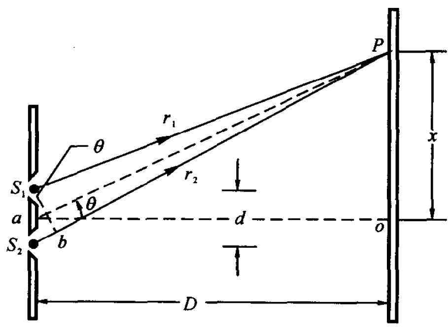
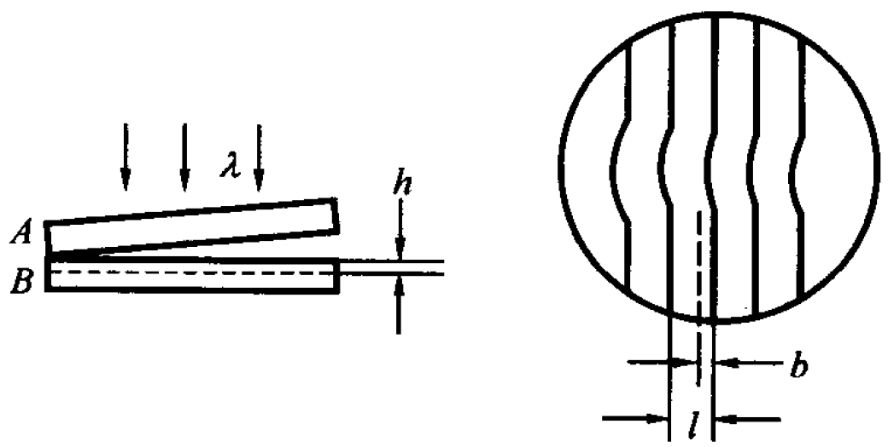
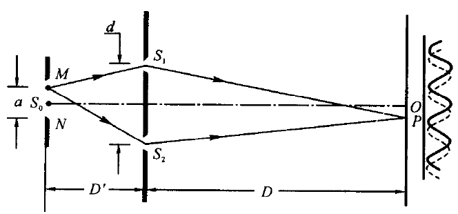

## 第十六章 光的干涉
### 半波损失
半波损失是指波在反射时，相位发生 $\pi$（即 $180^\circ$）的突变，相当于光程增加了（或减少了）半个波长 $\frac{\lambda}{2}$ 的现象。简单来说，当光从“光疏介质”射向“光密介质”并发生反射时，就会发生半波损失。
### 双缝干涉

明纹中心的位置为:
$$x = \pm \frac{D}{d} k \lambda \qquad k=0, 1, 2, \cdots$$
暗纹中心的位置为：
$$x = \pm \frac{D}{d} \left( k - \frac{1}{2} \right) \lambda \qquad k=0, 1, 2, \cdots$$
屏上相邻两明纹中心(或暗纹中心)的距离，即条纹间距$\Delta x$为
$$\Delta x = \dfrac{D}{d}\lambda$$
### 光程
在折射率为$n$的介质中，单色光的波长
$$\lambda_n = \dfrac{\lambda}{n} $$
若光波在介质中传播的几何路程为$r$，则相位变化为
$$\Delta \varphi = 2\pi\dfrac{r}{\lambda_n} = \dfrac{2\pi n r}{\lambda}$$
光在介质中传播的几何路程$r$,相当于光在真空中传播了$nr$的几何路程。我们称光在某种介质中传播的几何路程$r$乘以介质的折射率$n$为光程。两束相干光分别通过不同介质后,在空间相遇时的相位差为
$$\Delta \varphi = \dfrac{2\pi}{\lambda}(n_2r_2 - n_1r_1) =\dfrac{2\pi}{\lambda}\delta$$
$\delta$称为光程差。
### 薄膜干涉
#### 等倾干涉

当扩展的单色光源照射厚度均匀的平行平面薄膜时，薄膜两表面的反射光会在无限远处产生干涉现象。这是将入射光的振幅(能量)分解为若干部分,再相遇产生的干涉,是分振幅法干涉。
厚度为 $e$ 的匀厚薄膜置于介质之中，膜的折射率为 $n_2$，介质的折射率为 $n_1$，设 $n_2 > n_1$。
根据折射定律
$$n_1 \sin i = n_2 \sin r$$
$a$和$b$两条光线的光程差为
$$\begin{aligned}
\delta &= n_2 (\overline{AC} + \overline{CB}) - (n_1 \overline{AD} - \frac{\lambda}{2}) \\
&= 2n_2 \frac{e}{\cos r} - 2n_1 e \tan r \sin i + \frac{\lambda}{2} \\
&= 2n_2 e \cos r + \frac{\lambda}{2} \\
\end{aligned}$$
或
$$\delta = 2e \sqrt{n_2^2 - n_1^2 \sin^2 i} + \frac{\lambda}{2}$$
因此干涉条件为
$$\delta = 2e \sqrt{n_2^2 - n_1^2 \sin^2 i} + \frac{\lambda}{2} =
\begin{cases}
k\lambda & k=1,2,3,\cdots \quad \text{明纹} \\
\left( k - \frac{1}{2} \right) \lambda & k=0,1,2,\cdots \quad \text{暗纹}
\end{cases}$$
#### 等厚干涉
##### 劈尖干涉

若用平行单色光**垂直**照射薄膜(即 $i=0$),由于 $\theta$ 很小,可近似使用等倾干涉的公式计算两反射光的光程差 $\delta$
$$\delta = 2ne + \frac{\lambda}{2}$$
决定干涉条纹明暗的条件为
$$\delta = 2ne + \frac{\lambda}{2} = 
\begin{cases} 
k\lambda & k=1,2,3,\cdots \quad \text{明纹} \\ 
\left( k - \frac{1}{2} \right) \lambda & k=0,1,2,\cdots \quad \text{暗纹} 
\end{cases}$$

设相邻两明条纹（或暗条纹）对应的薄膜厚度为 $e_k$ 和 $e_{k+1}$，见图 16.12，则由(16.10)式可得
$$e_{k+1} - e_k = \frac{\lambda}{2n}$$因为$$e_{k+1} - e_k = l \sin\theta$$
式中$l$为相邻明纹(或暗纹)的距离。故
$$l\sin\theta = \dfrac{\lambda}{2n}$$
条纹均匀排列,间距$l$相等且和厚度$e$无关
##### 牛顿环

取一曲率半径相当大的平凸透镜$A$,将其凸面放在一片平玻璃$B$上面。在两玻璃面之间便形成类似劈尖式的空气薄层。当波长为入的单色光垂直入射时,在空气薄层上形成的等干涉条纹是一组内疏外密的同心圆环,称为牛顿环。

$$r^2 = R^2 - (R - e)^2 = 2Re - e^2$$

因为 $R\gg e$,故有
$$e\approx \dfrac{r^2}{2R}$$
代入以上劈尖干涉的例子
明环半径
$$r = \sqrt{(k - \frac{1}{2}) R \lambda} \quad k = 1, 2, 3, \dots,$$
暗环半径
$$r = \sqrt{kR\lambda} \quad k = 1, 2, 3, \dots,$$
#### 应用
##### 测量细丝直径

细丝直径
$$d = L\tan\theta$$
又由
$$l\sin\theta = \dfrac{\lambda}{2n}$$
以及小角度下$\tan\theta \approx \sin\theta$，消去$\theta$可得
$$d = \dfrac{\lambda L}{2n l}$$
##### 测量小角度

 

$$\theta \approx \sin\theta = \dfrac{\lambda}{2nl}$$

##### 检查工件表面质量

将标准平面$A$放在待测平面$B$上,形成劈尖空气薄膜。若B表面有一条刻痕,则刻痕上方的空气层厚度就较其周围大。由于同一级干涉条纹对应的气隙厚度是相同的，因此当工件表面出现凹陷时,干涉条纹就要向劈尖棱边方向弯曲。
空气中两相邻明纹对应的薄膜厚度差$\Delta e = \dfrac{\lambda}{2}(n=1)$，所以刻痕深度$h$和条纹的偏离距离$b$有关系式
$$h = \dfrac{b}{l}\cdot\dfrac{\lambda}{2}$$
式中$l$为相邻明纹(或暗纹)的水平间距。
##### 增透膜

在透镜（折射率 $n_1$）表面镀一层 $\text{MgF}_2$（$n_2$）之类的透明介质薄膜，并设计合适的膜层厚度，使入射光在介质膜两个表面的两束反射光因干涉而相消。因为光线垂直入射，故干涉相消的条件为
$$\delta = 2n_2e=(k-\dfrac{1}{2})\lambda \quad k=1,2,\cdots$$
这里$n_2e$称为光学厚度。
$$e = (k-\frac{1}{2})\frac{\lambda}{2n_2}\quad k=1,2,\cdots$$

注：这里为什么不是$$\delta = 2n_2e +\dfrac{\lambda}{2}$$
因为在上面等倾干涉的例子中，光在上表面反射时发生了半波损失，而在下表面反射时没有发生半波损失。而在增透膜的例子中，光在膜的上表面反射时没有发生半波损失，而在下表面反射时发生了半波损失。
##### 高反射膜

通常在玻璃（$n_1$）表面镀一层硫化锌（$n_2$）之类的高折射率的透明介质薄膜，选取合适的厚度，使膜层上、下两面的两束反射光干涉后加强，这样的薄膜称为高反射膜。
$$2n_2e+\dfrac{\lambda}{2} = k\lambda \quad k=1,2,\cdots $$
$$e = (k-\frac{1}{2})\frac{\lambda}{2n_2}\quad k=1,2,\cdots$$
### 时间相干性

当一束光波分裂为两束相干光波并再次相遇时，能产生干涉现象的光程差必须小于波列的长度$L_c$。此极限长度$L_c$称为两束相干光波的相干长度。
两列相干光波先后到达空间某点时,能产生干涉现象的时间差不能大于某一确定值$\tau$,$\tau$值为
$$\tau = \dfrac{L_c}{c}$$
一般将强度下降到$\dfrac{I_0}{2}$时所对应的波长范围称为谱线宽度,用$\Delta \lambda$表示。
$$L_c = \dfrac{\lambda^2}{\Delta \lambda}$$
### 空间相干性

要观察到干涉现象,光源宽度必须小于
$$a = \dfrac{D'}{d}\lambda$$
称为临界宽度。